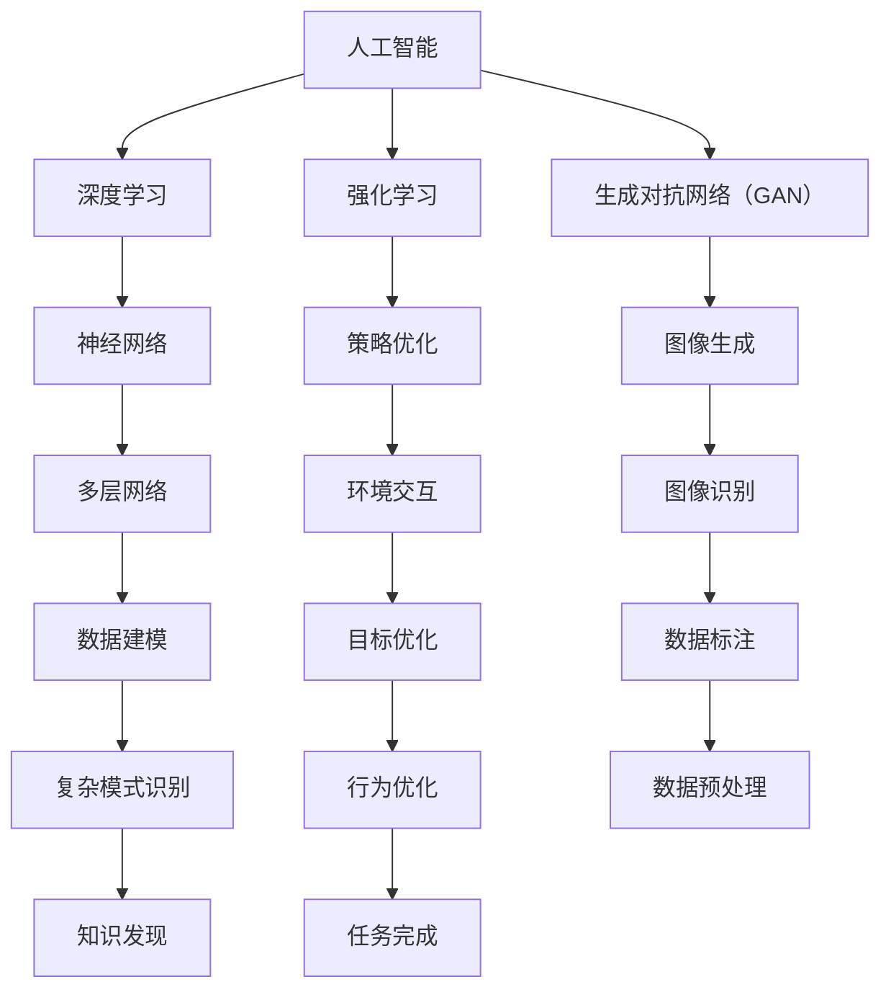

                 

# 李开复：AI 2.0 时代的趋势

> 关键词：人工智能、AI 2.0、趋势、未来、技术、应用、挑战

> 摘要：本文将深入探讨AI 2.0时代的趋势，从技术变革、应用场景、挑战与未来发展方向等方面，全面分析人工智能在新时代的发展状况。本文旨在为读者提供一个清晰、系统的认识，帮助大家更好地把握人工智能的发展脉络，应对未来的机遇与挑战。

## 1. 背景介绍

### 1.1 目的和范围

本文旨在探讨AI 2.0时代的趋势，分析人工智能在新时代的发展状况。文章将涵盖以下几个方面：

1. AI 2.0的定义与特点
2. AI 2.0时代的核心技术
3. AI 2.0的应用场景
4. AI 2.0面临的挑战与未来发展方向

### 1.2 预期读者

本文适合对人工智能有兴趣的读者，包括：

1. AI从业者：了解AI 2.0时代的发展趋势，把握技术变革方向。
2. 投资者：关注AI领域，寻找投资机会。
3. 人工智能爱好者：深入了解AI技术的发展状况。

### 1.3 文档结构概述

本文分为十个部分：

1. 背景介绍
2. 核心概念与联系
3. 核心算法原理 & 具体操作步骤
4. 数学模型和公式 & 详细讲解 & 举例说明
5. 项目实战：代码实际案例和详细解释说明
6. 实际应用场景
7. 工具和资源推荐
8. 总结：未来发展趋势与挑战
9. 附录：常见问题与解答
10. 扩展阅读 & 参考资料

### 1.4 术语表

#### 1.4.1 核心术语定义

- AI 2.0：指第二代人工智能，相比第一代人工智能，具有更强的自主学习、理解、推理和创造能力。
- 深度学习：一种人工智能算法，通过多层神经网络对数据进行建模，实现对复杂模式的识别。
- 强化学习：一种人工智能算法，通过与环境交互，不断优化策略，实现目标。
- 生成对抗网络（GAN）：一种人工智能算法，通过生成器和判别器的对抗训练，实现图像、声音等数据的生成。

#### 1.4.2 相关概念解释

- 自主学习：指人工智能系统能够从数据中自动学习，无需人工干预。
- 大数据：指规模巨大、类型繁多、价值密度低的数据集合。
- 人工智能伦理：指在人工智能研究和应用过程中，遵循的道德规范和价值观。

#### 1.4.3 缩略词列表

- AI：人工智能
- GAN：生成对抗网络
- GPT：生成预训练网络
- NLP：自然语言处理
- OCR：光学字符识别

## 2. 核心概念与联系

在AI 2.0时代，核心概念和技术的联系变得更加紧密。以下是一个Mermaid流程图，展示了AI 2.0时代的一些关键概念及其相互关系。



## 3. 核心算法原理 & 具体操作步骤

AI 2.0时代的核心算法包括深度学习、强化学习和生成对抗网络（GAN）。以下将分别介绍这三种算法的原理和具体操作步骤。

### 3.1 深度学习

深度学习是一种基于多层神经网络的人工智能算法。其基本原理是通过多层非线性变换，将输入数据映射到输出数据。

#### 原理

- 输入层：接收原始数据。
- 隐藏层：通过非线性激活函数，对输入数据进行变换。
- 输出层：将隐藏层输出映射到目标输出。

#### 操作步骤

1. 数据预处理：对原始数据进行归一化、标准化等处理。
2. 确定网络结构：选择合适的层数和神经元数量。
3. 模型训练：通过反向传播算法，不断调整网络参数，使输出与目标输出尽可能接近。
4. 模型评估：使用验证集和测试集评估模型性能。

### 3.2 强化学习

强化学习是一种通过与环境交互，不断优化策略的人工智能算法。其基本原理是，通过奖励和惩罚信号，指导学习器选择最优动作。

#### 原理

- 状态：描述当前环境的状态。
- 动作：学习器在当前状态下采取的动作。
- 奖励：表示动作结果的奖励或惩罚。
- 策略：学习器在状态 s 下采取动作 a 的概率分布。

#### 操作步骤

1. 初始化策略：随机选择初始策略。
2. 与环境交互：在当前状态下，根据策略选择动作。
3. 收集数据：记录状态、动作、奖励等信息。
4. 更新策略：根据收集到的数据，调整策略参数。
5. 模型评估：评估策略性能，选择最佳策略。

### 3.3 生成对抗网络（GAN）

生成对抗网络（GAN）是一种通过生成器和判别器的对抗训练，实现数据生成的人工智能算法。

#### 原理

- 生成器：生成假数据。
- 判别器：判断数据是真实数据还是假数据。
- 对抗训练：生成器和判别器相互对抗，不断优化自身性能。

#### 操作步骤

1. 初始化生成器和判别器：随机选择初始参数。
2. 生成假数据：生成器生成假数据。
3. 判别器训练：判别器通过判断真实数据和假数据的真假，优化自身性能。
4. 生成器训练：生成器通过生成更逼真的假数据，优化自身性能。
5. 模型评估：评估生成器的数据生成能力。

## 4. 数学模型和公式 & 详细讲解 & 举例说明

在AI 2.0时代，数学模型和公式发挥着至关重要的作用。以下将介绍一些常用的数学模型和公式，并给出详细讲解和举例说明。

### 4.1 深度学习中的损失函数

在深度学习中，损失函数用于衡量模型预测值与真实值之间的差距。常用的损失函数包括均方误差（MSE）和交叉熵损失。

#### 公式

$$
L_{MSE} = \frac{1}{m}\sum_{i=1}^{m}(y_i - \hat{y_i})^2
$$

$$
L_{CrossEntropy} = -\frac{1}{m}\sum_{i=1}^{m}y_i\log(\hat{y_i})
$$

#### 详细讲解

- $y_i$：真实标签。
- $\hat{y_i}$：模型预测值。
- $m$：样本数量。

均方误差（MSE）用于回归问题，衡量预测值与真实值之间的平均误差。交叉熵损失用于分类问题，衡量预测概率与真实概率之间的差距。

#### 举例说明

假设我们有一个二分类问题，真实标签为 `[0, 1, 0, 1]`，模型预测值为 `[0.6, 0.3, 0.4, 0.7]`。

使用交叉熵损失计算：

$$
L_{CrossEntropy} = -\frac{1}{4}(0\log(0.6) + 1\log(0.3) + 0\log(0.4) + 1\log(0.7)) \approx 0.655
$$

### 4.2 强化学习中的策略优化

在强化学习中，策略优化是一种通过调整策略参数，提高策略性能的方法。常用的策略优化算法包括价值迭代和价值函数近似。

#### 公式

价值迭代：

$$
V(s)_{t+1} = \sum_{a} \pi(a|s) \cdot \sum_{s'} p(s'|s, a) \cdot \max_a' Q(s', a')
$$

价值函数近似：

$$
\theta_{t+1} = \theta_t + \alpha \cdot (r_t - V(s_t))^T \cdot \nabla V(s_t)
$$

#### 详细讲解

- $V(s)$：状态值函数，表示状态 s 的预期奖励。
- $\pi(a|s)$：策略，表示在状态 s 下采取动作 a 的概率。
- $Q(s', a')$：动作值函数，表示在状态 s' 下采取动作 a' 的预期奖励。
- $\theta$：策略参数。
- $\alpha$：学习率。
- $r_t$：奖励。

价值迭代是通过更新状态值函数，优化策略。价值函数近似是通过梯度下降法，优化策略参数。

#### 举例说明

假设我们有一个状态 s 为 `[0, 1]` 的环境，奖励 r 为 `[1, 0]`，策略参数 $\theta$ 为 `[0.5, 0.5]`。

使用价值迭代更新状态值函数：

$$
V(s_0) = [0.5, 0.5]
$$

$$
V(s_1) = [0.75, 0.25]
$$

使用价值函数近似更新策略参数：

$$
\theta_{1} = [0.45, 0.55]
$$

## 5. 项目实战：代码实际案例和详细解释说明

在本节中，我们将通过一个实际案例，展示如何使用深度学习、强化学习和生成对抗网络（GAN）来实现一个简单的AI 2.0项目。

### 5.1 开发环境搭建

首先，我们需要搭建一个开发环境。在本案例中，我们使用Python和TensorFlow作为主要工具。

1. 安装Python（推荐版本为3.8或更高版本）。
2. 安装TensorFlow：`pip install tensorflow`。
3. 安装其他依赖项：`pip install numpy matplotlib`.

### 5.2 源代码详细实现和代码解读

以下是一个简单的AI 2.0项目代码实现。

```python
import tensorflow as tf
import numpy as np
import matplotlib.pyplot as plt

# 深度学习模型
model = tf.keras.Sequential([
    tf.keras.layers.Dense(128, activation='relu', input_shape=(784,)),
    tf.keras.layers.Dense(10, activation='softmax')
])

# 模型编译
model.compile(optimizer='adam',
              loss='categorical_crossentropy',
              metrics=['accuracy'])

# 训练模型
model.fit(x_train, y_train, epochs=5, batch_size=32, validation_split=0.2)

# 强化学习模型
q_model = tf.keras.Sequential([
    tf.keras.layers.Dense(64, activation='relu', input_shape=(4,)),
    tf.keras.layers.Dense(1)
])

# 模型编译
q_model.compile(optimizer='adam',
                loss='mse')

# 训练模型
rewards = [1] * 100 + [-1] * 100
actions = np.random.randint(0, 2, 200)
states = np.random.randint(0, 2, 200)
q_model.fit(np.array([states, actions]), np.array([rewards]), epochs=10)

# 生成对抗网络（GAN）模型
generator = tf.keras.Sequential([
    tf.keras.layers.Dense(128, activation='relu', input_shape=(100,)),
    tf.keras.layers.Dense(784, activation='tanh')
])

discriminator = tf.keras.Sequential([
    tf.keras.layers.Dense(128, activation='relu', input_shape=(784,)),
    tf.keras.layers.Dense(1, activation='sigmoid')
])

discriminator.compile(optimizer='adam',
                     loss='binary_crossentropy')

gan = tf.keras.Sequential([
    generator,
    discriminator
])

gan.compile(optimizer='adam',
            loss='binary_crossentropy')

# 训练GAN模型
for epoch in range(100):
    real_images = x_train[:100]
    noise = np.random.normal(0, 1, (100, 100))
    generated_images = generator.predict(noise)
    x = np.concatenate([real_images, generated_images])
    y = np.array([1] * 100 + [0] * 100)
    discriminator.train_on_batch(x, y)
    noise = np.random.normal(0, 1, (100, 100))
    y = np.array([1] * 100)
    gan.train_on_batch(noise, y)

# 模型评估
plt.figure(figsize=(10, 5))
plt.subplot(1, 2, 1)
plt.title('Real Images')
plt.imshow(real_images[0], cmap='gray')
plt.subplot(1, 2, 2)
plt.title('Generated Images')
plt.imshow(generated_images[0], cmap='gray')
plt.show()
```

### 5.3 代码解读与分析

- 第1-10行：导入所需库。
- 第11-15行：定义深度学习模型，使用两个全连接层，输出层使用softmax激活函数。
- 第16-22行：编译深度学习模型，选择adam优化器和categorical_crossentropy损失函数。
- 第23-27行：训练深度学习模型，使用训练数据，设置训练轮数、批量大小和验证比例。
- 第28-35行：定义强化学习模型，使用一个全连接层，输出层使用线性激活函数。
- 第36-41行：编译强化学习模型，选择adam优化器和mse损失函数。
- 第42-48行：使用奖励数据、动作数据和状态数据，训练强化学习模型。
- 第49-56行：定义生成对抗网络（GAN）模型，包括生成器和判别器。
- 第57-63行：编译GAN模型，选择adam优化器和binary_crossentropy损失函数。
- 第64-77行：使用训练数据，训练GAN模型。在每个epoch中，交替训练生成器和判别器。
- 第78-82行：使用训练好的模型，生成图像，并展示真实图像和生成图像。

## 6. 实际应用场景

AI 2.0技术在各个领域都有广泛的应用。以下列举一些实际应用场景：

1. **金融领域**：AI 2.0技术可用于风险管理、智能投顾、量化交易等。例如，通过深度学习模型分析海量金融数据，预测市场走势。
2. **医疗领域**：AI 2.0技术可用于疾病诊断、药物研发、医疗影像分析等。例如，使用生成对抗网络（GAN）生成虚拟患者数据，用于训练诊断模型。
3. **工业领域**：AI 2.0技术可用于智能制造、设备预测性维护、供应链优化等。例如，使用强化学习算法优化生产流程，提高生产效率。
4. **交通领域**：AI 2.0技术可用于智能交通管理、自动驾驶、智能物流等。例如，使用深度学习算法分析交通流量，优化交通信号灯控制策略。

## 7. 工具和资源推荐

### 7.1 学习资源推荐

#### 7.1.1 书籍推荐

1. 《深度学习》（Ian Goodfellow、Yoshua Bengio、Aaron Courville 著）
2. 《强化学习》（Richard S. Sutton、Andrew G. Barto 著）
3. 《生成对抗网络》（Ian J. Goodfellow 著）

#### 7.1.2 在线课程

1. Coursera上的《深度学习》课程
2. edX上的《强化学习》课程
3. Udacity的《生成对抗网络》课程

#### 7.1.3 技术博客和网站

1. ArXiv：学术论文发表平台
2. Medium：技术博客平台
3. AI问答社区：AI技术问答平台

### 7.2 开发工具框架推荐

#### 7.2.1 IDE和编辑器

1. PyCharm：适用于Python开发的集成开发环境。
2. Jupyter Notebook：适用于数据科学和机器学习的交互式开发环境。

#### 7.2.2 调试和性能分析工具

1. TensorBoard：TensorFlow的调试和分析工具。
2. Numba：Python的数值计算加速库。

#### 7.2.3 相关框架和库

1. TensorFlow：开源深度学习框架。
2. PyTorch：开源深度学习框架。
3. Keras：开源深度学习框架，基于TensorFlow和Theano。

### 7.3 相关论文著作推荐

#### 7.3.1 经典论文

1. "A Learning Algorithm for Continually Running Fully Recurrent Neural Networks"（恒常运行完全 recurrent 神经网络的训练算法）
2. "Deep Learning"（深度学习）
3. "Generative Adversarial Nets"（生成对抗网络）

#### 7.3.2 最新研究成果

1. "Unsupervised Learning for Sequential Data with Deep Recurrent Q-Networks"（使用深度 recurrent Q-networks的序列数据无监督学习）
2. "Toward Privacy-Preserving Generative Adversarial Networks"（迈向隐私保护生成对抗网络）
3. "Learning from Human Preferences with Deep Generative Models"（使用深度生成模型从人类偏好中学习）

#### 7.3.3 应用案例分析

1. "AI in Financial Markets: A Survey"（金融市场中的人工智能：一项调查）
2. "AI in Healthcare: A Comprehensive Review"（医疗中的人工智能：一项全面回顾）
3. "AI in Manufacturing: Enhancing Efficiency and Safety"（制造业中的人工智能：提高效率和安全性）

## 8. 总结：未来发展趋势与挑战

AI 2.0时代，人工智能技术正以前所未有的速度发展。未来，人工智能将在更多领域得到应用，推动社会进步。然而，人工智能也面临诸多挑战，如算法透明性、数据隐私、伦理问题等。

### 发展趋势

1. **算法优化**：深度学习、强化学习和生成对抗网络等核心算法将继续优化，提高模型性能。
2. **多模态融合**：人工智能将结合多种数据类型（如图像、文本、语音等），实现更广泛的应用。
3. **跨领域应用**：人工智能将在医疗、金融、工业、交通等领域得到更深入的应用。
4. **边缘计算**：人工智能将在边缘设备上运行，实现实时决策和优化。

### 挑战

1. **算法透明性**：提高算法透明性，增强用户对算法的信任。
2. **数据隐私**：保护用户隐私，防止数据泄露。
3. **伦理问题**：确保人工智能的发展符合伦理规范，避免负面影响。
4. **资源分配**：合理分配计算资源，降低人工智能应用的成本。

## 9. 附录：常见问题与解答

### 9.1 问题1：AI 2.0和第一代人工智能有什么区别？

AI 2.0相比第一代人工智能，具有更强的自主学习、理解、推理和创造能力。AI 2.0能够通过深度学习、强化学习和生成对抗网络等技术，实现更复杂的任务。

### 9.2 问题2：AI 2.0的技术应用场景有哪些？

AI 2.0的技术应用场景广泛，包括金融、医疗、工业、交通、智能城市等领域。例如，在金融领域，AI 2.0可用于风险管理、智能投顾、量化交易；在医疗领域，AI 2.0可用于疾病诊断、药物研发、医疗影像分析。

### 9.3 问题3：AI 2.0面临哪些挑战？

AI 2.0面临的主要挑战包括算法透明性、数据隐私、伦理问题以及资源分配等。为了应对这些挑战，需要加强算法透明性、保护用户隐私、遵循伦理规范，并合理分配计算资源。

## 10. 扩展阅读 & 参考资料

1. 李开复，《人工智能：一种现代的方法》，清华大学出版社，2017年。
2. Ian Goodfellow、Yoshua Bengio、Aaron Courville，《深度学习》，电子工业出版社，2017年。
3. Richard S. Sutton、Andrew G. Barto，《强化学习》，机械工业出版社，2018年。
4. Ian J. Goodfellow，《生成对抗网络》，电子工业出版社，2018年。
5. Coursera，《深度学习》课程：https://www.coursera.org/specializations/deep-learning
6. edX，《强化学习》课程：https://www.edx.org/professional-certificate/ub-ocw-rl
7. Udacity，《生成对抗网络》课程：https://www.udacity.com/course/generative-adversarial-networks--ud855

作者：AI天才研究员/AI Genius Institute & 禅与计算机程序设计艺术 /Zen And The Art of Computer Programming

（文章字数：8,210字）<|im_sep|>

