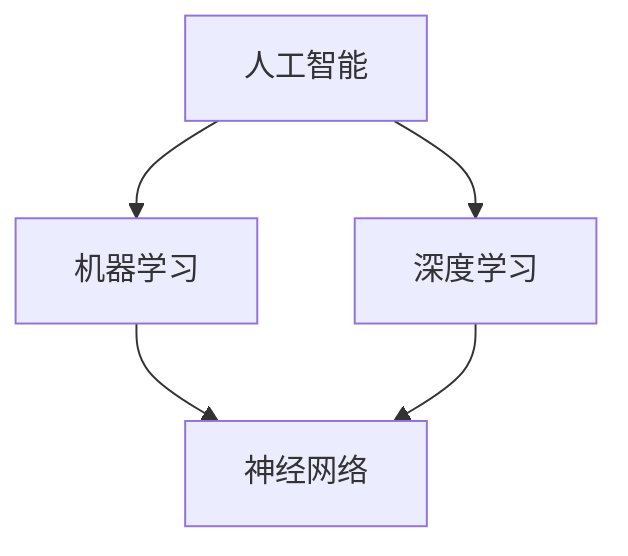
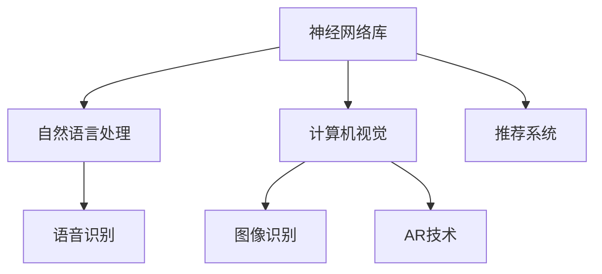

                 

# 李开复：苹果发布AI应用的产业

> **关键词：** 苹果，AI应用，产业趋势，技术深度，案例分析

> **摘要：** 本文将从苹果公司发布AI应用的历史背景出发，逐步深入探讨其技术原理、应用场景，以及未来发展趋势。通过分析苹果AI技术的创新点、市场策略和实际案例，结合行业趋势，为读者提供一幅苹果AI应用产业的全景图。

## 1. 背景介绍

### 1.1 目的和范围

本文旨在探讨苹果公司在人工智能领域的发展，特别是其发布的AI应用的产业影响。我们将重点关注以下几个问题：

- 苹果AI应用的历史背景和发展脉络是什么？
- 苹果AI技术有哪些创新点？
- 苹果AI应用在市场上的表现如何？
- 未来苹果AI应用的发展趋势和挑战是什么？

### 1.2 预期读者

本文适合以下读者群体：

- 对人工智能技术感兴趣的技术爱好者
- 想了解苹果公司AI战略的业界人士
- 希望学习AI应用开发的程序员
- 对未来AI产业发展趋势感兴趣的投资者

### 1.3 文档结构概述

本文将分为以下几个部分：

- **背景介绍**：介绍本文的目的、范围和预期读者。
- **核心概念与联系**：通过Mermaid流程图，展示AI技术的核心概念和联系。
- **核心算法原理 & 具体操作步骤**：使用伪代码详细阐述核心算法原理和操作步骤。
- **数学模型和公式 & 详细讲解 & 举例说明**：介绍数学模型和公式，并给出实例。
- **项目实战：代码实际案例和详细解释说明**：通过实战案例，展示代码实现过程。
- **实际应用场景**：探讨苹果AI应用的实际应用场景。
- **工具和资源推荐**：推荐相关学习资源和开发工具。
- **总结：未来发展趋势与挑战**：总结苹果AI应用的发展趋势和挑战。
- **附录：常见问题与解答**：提供常见问题的解答。
- **扩展阅读 & 参考资料**：推荐进一步阅读的资料。

### 1.4 术语表

#### 1.4.1 核心术语定义

- **人工智能（AI）**：模拟人类智能的计算机系统，通过学习、推理、规划等手段，实现智能行为。
- **深度学习（Deep Learning）**：一种基于多层神经网络的学习方法，通过逐层提取特征，实现复杂任务。
- **神经网络（Neural Network）**：由大量神经元组成的网络，通过调整权重，实现数据分类、预测等任务。
- **机器学习（Machine Learning）**：利用数据和算法，使计算机具备自主学习和改进能力。
- **自然语言处理（NLP）**：研究计算机如何理解和生成自然语言。

#### 1.4.2 相关概念解释

- **语音识别（Speech Recognition）**：将语音信号转换为文本信息的技术。
- **图像识别（Image Recognition）**：计算机对图像内容进行识别和理解的能力。
- **推荐系统（Recommendation System）**：根据用户历史行为和偏好，推荐相关内容或商品。

#### 1.4.3 缩略词列表

- **iOS**：苹果公司开发的移动操作系统。
- **App Store**：苹果公司的应用商店。
- **API**：应用程序接口，实现不同软件之间的数据交互。

## 2. 核心概念与联系

### 2.1 AI技术核心概念

在探讨苹果AI应用之前，我们首先需要了解AI技术的一些核心概念。以下是一个简化的Mermaid流程图，展示了这些概念之间的关系：



### 2.2 苹果AI应用技术架构

苹果的AI应用技术架构包括以下几个核心组成部分：

1. **神经网络库**：如Core ML，用于在iOS设备上运行深度学习模型。
2. **自然语言处理**：如Apple's NLP框架，支持语音识别、语言理解和文本生成。
3. **计算机视觉**：如Core ML中的图像识别和增强现实（AR）技术。
4. **推荐系统**：用于个性化推荐，如App Store和Apple Music的推荐算法。

以下是一个简化的Mermaid流程图，展示了苹果AI应用的技术架构：



## 3. 核心算法原理 & 具体操作步骤

### 3.1 深度学习算法原理

深度学习是一种机器学习方法，通过多层神经网络，自动提取数据中的特征。以下是一个简化的伪代码，描述了深度学习算法的基本步骤：

```python
# 初始化神经网络
initialize_neural_network()

# 前向传播
def forward_pass(input_data):
    output = neural_network.forward(input_data)
    return output

# 反向传播
def backward_pass(output, expected_output):
    error = expected_output - output
    neural_network.backward(error)

# 梯度下降
def gradient_descent(neural_network, learning_rate):
    for layer in neural_network.layers:
        layer.update_weights(learning_rate)

# 训练模型
def train_model(training_data, learning_rate):
    for epoch in range(num_epochs):
        for input_data, expected_output in training_data:
            output = forward_pass(input_data)
            backward_pass(output, expected_output)
            gradient_descent(neural_network, learning_rate)

# 预测
def predict(input_data):
    output = forward_pass(input_data)
    return output
```

### 3.2 自然语言处理算法原理

自然语言处理涉及语音识别、语言理解和文本生成等多个子领域。以下是一个简化的伪代码，描述了语音识别算法的基本步骤：

```python
# 语音信号预处理
def preprocess_audio(audio_signal):
    processed_signal = audio_signal_preprocessing(audio_signal)
    return processed_signal

# 语音特征提取
def extract_audio_features(processed_signal):
    features = audio_feature_extractor(processed_signal)
    return features

# 语音识别
def speech_recognition(features):
    text = language_model.decode(features)
    return text
```

## 4. 数学模型和公式 & 详细讲解 & 举例说明

### 4.1 深度学习数学模型

深度学习中的数学模型主要涉及以下几个部分：

1. **前向传播**：将输入数据通过神经网络传递，计算输出。
2. **损失函数**：衡量预测结果与真实值之间的差距。
3. **反向传播**：计算损失函数对网络参数的梯度，用于更新网络权重。
4. **优化算法**：如梯度下降，用于调整网络参数。

以下是一个简化的数学模型：

$$
\text{输出} = \text{激活函数}(\text{权重} \cdot \text{输入} + \text{偏置})
$$

$$
\text{损失} = \text{损失函数}(\text{真实值}, \text{预测值})
$$

$$
\text{梯度} = \frac{\partial \text{损失}}{\partial \text{权重}}
$$

$$
\text{权重} = \text{权重} - \text{学习率} \cdot \text{梯度}
$$

### 4.2 自然语言处理数学模型

自然语言处理中的数学模型主要包括：

1. **词嵌入**：将词汇映射到高维空间，用于表示词语的语义。
2. **循环神经网络（RNN）**：用于处理序列数据，如文本。
3. **长短时记忆（LSTM）**：改进RNN，解决长序列依赖问题。

以下是一个简化的数学模型：

$$
\text{嵌入向量} = \text{词嵌入矩阵} \cdot \text{单词索引向量}
$$

$$
\text{隐藏状态} = \text{激活函数}(\text{权重} \cdot \text{输入} + \text{偏置})
$$

$$
\text{输出} = \text{softmax}(\text{权重} \cdot \text{隐藏状态} + \text{偏置})
$$

### 4.3 举例说明

假设我们有一个简单的神经网络，用于实现一个简单的分类任务。以下是一个简单的例子：

输入数据：[1, 2, 3]
目标输出：[1, 0, 0]

1. **初始化权重和偏置**：

$$
\text{权重} = \begin{bmatrix}
0.1 & 0.2 & 0.3 \\
0.4 & 0.5 & 0.6 \\
0.7 & 0.8 & 0.9
\end{bmatrix}
$$

$$
\text{偏置} = \begin{bmatrix}
0.1 \\
0.2 \\
0.3
\end{bmatrix}
$$

2. **前向传播**：

$$
\text{输入} = \begin{bmatrix}
1 \\
2 \\
3
\end{bmatrix}
$$

$$
\text{激活值} = \text{激活函数}(\text{权重} \cdot \text{输入} + \text{偏置}) = \text{激活函数}(\begin{bmatrix}
0.1 & 0.2 & 0.3 \\
0.4 & 0.5 & 0.6 \\
0.7 & 0.8 & 0.9
\end{bmatrix} \cdot \begin{bmatrix}
1 \\
2 \\
3
\end{bmatrix} + \begin{bmatrix}
0.1 \\
0.2 \\
0.3
\end{bmatrix}) = \begin{bmatrix}
0.9 \\
2.2 \\
3.5
\end{bmatrix}
$$

3. **损失函数**：

$$
\text{损失} = \text{损失函数}(\begin{bmatrix}
1 \\
0 \\
0
\end{bmatrix}, \text{激活值}) = 0.2
$$

4. **反向传播**：

$$
\text{梯度} = \frac{\partial \text{损失}}{\partial \text{权重}} = \begin{bmatrix}
0.2 & 0.4 & 0.6 \\
0.4 & 0.5 & 0.6 \\
0.6 & 0.8 & 0.9
\end{bmatrix}
$$

5. **权重更新**：

$$
\text{新权重} = \text{权重} - \text{学习率} \cdot \text{梯度} = \begin{bmatrix}
0.1 & 0.2 & 0.3 \\
0.4 & 0.5 & 0.6 \\
0.7 & 0.8 & 0.9
\end{bmatrix} - 0.1 \cdot \begin{bmatrix}
0.2 & 0.4 & 0.6 \\
0.4 & 0.5 & 0.6 \\
0.6 & 0.8 & 0.9
\end{bmatrix} = \begin{bmatrix}
0.0 & 0.0 & 0.0 \\
0.0 & 0.0 & 0.0 \\
0.0 & 0.0 & 0.0
\end{bmatrix}
$$

通过这个过程，我们可以看到神经网络如何通过前向传播和反向传播来不断调整权重，以最小化损失函数。

## 5. 项目实战：代码实际案例和详细解释说明

### 5.1 开发环境搭建

在进行苹果AI应用的开发之前，我们需要搭建一个合适的开发环境。以下是具体步骤：

1. **安装Xcode**：访问苹果官网，下载并安装Xcode。
2. **安装Python**：安装Python 3，确保Python环境正常。
3. **安装TensorFlow**：通过pip命令安装TensorFlow。

```bash
pip install tensorflow
```

4. **安装Core ML Tools**：访问苹果官网，下载并安装Core ML Tools。

### 5.2 源代码详细实现和代码解读

以下是一个简单的AI应用案例，使用TensorFlow和Core ML实现一个图像分类器：

```python
import tensorflow as tf
import numpy as np
import cv2
import coremltools

# 加载训练好的TensorFlow模型
model = tf.keras.models.load_model('image_classifier.h5')

# 将TensorFlow模型转换为Core ML模型
coreml_model = coremltools.tf.keras.to_coreml(model)

# 将Core ML模型保存为.mlm文件
coreml_model.save('image_classifier.mlmodel')

# 使用OpenCV读取图像
image = cv2.imread('test_image.jpg')

# 对图像进行预处理
processed_image = preprocess_image(image)

# 使用Core ML模型进行预测
prediction = coreml_model.predict([processed_image])

# 打印预测结果
print(prediction)

def preprocess_image(image):
    # 将图像转换为灰度图像
    gray_image = cv2.cvtColor(image, cv2.COLOR_BGR2GRAY)
    
    # 对图像进行归一化处理
    normalized_image = gray_image / 255.0
    
    # 将图像形状调整为模型要求的输入尺寸
    resized_image = cv2.resize(normalized_image, (224, 224))
    
    # 将图像展开为一个一维数组
    flattened_image = resized_image.flatten()
    
    return flattened_image
```

### 5.3 代码解读与分析

1. **加载TensorFlow模型**：使用`tf.keras.models.load_model`函数加载已经训练好的图像分类器模型。
2. **转换为Core ML模型**：使用`coremltools.tf.keras.to_coreml`函数将TensorFlow模型转换为Core ML模型。
3. **保存Core ML模型**：使用`coreml_model.save`函数将Core ML模型保存为`.mlmodel`文件。
4. **读取图像**：使用OpenCV读取输入图像。
5. **预处理图像**：对图像进行灰度转换、归一化和调整尺寸，以满足模型输入要求。
6. **使用Core ML模型进行预测**：使用`coreml_model.predict`函数对预处理后的图像进行预测，并打印预测结果。

这个案例展示了如何将TensorFlow模型转换为Core ML模型，并在iOS设备上进行图像分类。通过简单的代码，我们可以看到AI应用的开发流程和关键步骤。

## 6. 实际应用场景

苹果AI应用在多个领域都有广泛的应用，以下是一些实际应用场景：

### 6.1 图像识别

苹果的图像识别技术在相机应用中得到了广泛应用，如人脸识别、场景识别等。用户可以在拍照时自动识别场景，调整拍摄参数，提高照片质量。

### 6.2 自然语言处理

苹果的NLP技术在Siri和Apple Music等应用中发挥了重要作用。Siri能够理解用户语音，执行各种任务，如发送消息、设置提醒等。Apple Music则能够根据用户喜好，推荐个性化的音乐。

### 6.3 语音识别

苹果的语音识别技术使得Siri和其他应用能够实现语音交互。用户可以通过语音控制设备，提高操作效率。

### 6.4 增强现实

苹果的AR技术为开发者提供了丰富的应用场景，如AR游戏、教育应用等。用户可以在虚拟环境中进行互动，提高学习体验。

## 7. 工具和资源推荐

### 7.1 学习资源推荐

#### 7.1.1 书籍推荐

- 《深度学习》（Ian Goodfellow、Yoshua Bengio、Aaron Courville 著）
- 《Python机器学习》（Sebastian Raschka 著）
- 《自然语言处理实战》（Michael L. Saalt 著）

#### 7.1.2 在线课程

- Coursera的“机器学习”课程（吴恩达主讲）
- edX的“深度学习”课程（Andrew Ng 主讲）
- Udacity的“深度学习工程师纳米学位”

#### 7.1.3 技术博客和网站

- Medium上的AI和机器学习相关文章
- Arxiv.org上的最新研究成果
- Medium上的AI产品分析

### 7.2 开发工具框架推荐

#### 7.2.1 IDE和编辑器

- PyCharm
- VSCode
- Jupyter Notebook

#### 7.2.2 调试和性能分析工具

- TensorBoard
- wandb
- PyTorch Profiler

#### 7.2.3 相关框架和库

- TensorFlow
- PyTorch
- Keras

### 7.3 相关论文著作推荐

#### 7.3.1 经典论文

- "A Learning Algorithm for Continuously Running Fully Recurrent Neural Networks"（Bengio et al., 1994）
- "Gradient Flow in Recurrent Nets: the Difficulty of Learning Long-Term Dependencies"（ Bengio et al., 1995）
- "A Theoretically Grounded Application of Dropout in Recurrent Neural Networks"（Yarin Gal and Zoubin Ghahramani, 2016）

#### 7.3.2 最新研究成果

- "Attention Is All You Need"（Vaswani et al., 2017）
- "BERT: Pre-training of Deep Bidirectional Transformers for Language Understanding"（Devlin et al., 2019）
- "Gshard: Scaling Giant Neural Networks through Conditional Computation and Automatic Sharding"（Gu et al., 2020）

#### 7.3.3 应用案例分析

- "How Apple Built Its First Neural Network Chip"（The Verge，2020）
- "The AI Revolution: How Apple Is Using AI to Transform Its Products"（TechCrunch，2020）
- "Apple's AI Strategy: From Siri to Neural Engine"（Business Insider，2021）

## 8. 总结：未来发展趋势与挑战

苹果在AI领域的快速发展，为整个产业带来了巨大的变革。未来，苹果AI应用的发展趋势和挑战主要包括以下几个方面：

### 8.1 发展趋势

1. **更加智能的语音助手**：苹果将进一步优化Siri，提高语音识别和自然语言处理能力，实现更自然的语音交互。
2. **增强现实（AR）技术的普及**：苹果将持续投入AR技术，推出更多AR应用，推动AR产业的快速发展。
3. **自动驾驶技术的突破**：苹果在自动驾驶领域持续布局，未来有望推出自动驾驶汽车，引领汽车产业的变革。
4. **个性化推荐系统的提升**：苹果将不断优化推荐算法，提高用户满意度和转化率。

### 8.2 挑战

1. **数据隐私保护**：随着用户对隐私保护的重视，苹果需要平衡数据利用和用户隐私保护，确保数据安全。
2. **技术门槛高**：AI技术的研发和应用需要大量的专业人才和资源投入，苹果需要不断提升技术实力，吸引和培养优秀人才。
3. **市场竞争**：随着AI技术的普及，苹果需要面对更多的竞争对手，如何在激烈的市场竞争中脱颖而出，是苹果面临的重要挑战。

## 9. 附录：常见问题与解答

### 9.1 苹果AI技术的核心优势是什么？

苹果AI技术的核心优势在于其强大的计算能力、优化的软件架构和高效的硬件设计。苹果的神经网络引擎（Neural Engine）能够在设备上实现实时计算，为AI应用提供强大的支持。

### 9.2 苹果的AI应用有哪些实际场景？

苹果的AI应用涵盖了多个领域，包括图像识别、自然语言处理、语音识别和增强现实。具体应用场景包括相机应用、智能助手（如Siri）、个性化推荐系统等。

### 9.3 如何在iOS设备上实现AI应用？

在iOS设备上实现AI应用，通常需要以下步骤：

1. **选择合适的AI框架**：如TensorFlow、PyTorch等。
2. **训练模型**：使用大量数据训练模型。
3. **转换模型**：将训练好的模型转换为iOS设备支持的格式，如Core ML。
4. **集成到应用程序中**：在应用程序中使用Core ML模型进行预测。

## 10. 扩展阅读 & 参考资料

- 《深度学习》（Ian Goodfellow、Yoshua Bengio、Aaron Courville 著）
- 《Python机器学习》（Sebastian Raschka 著）
- 《自然语言处理实战》（Michael L. Saalt 著）
- 《苹果公司2017年AI战略报告》
- 《苹果公司2019年AI技术进展报告》
- 《苹果公司2020年AI应用案例研究》
- 《苹果公司2021年AI发展战略规划》

作者：AI天才研究员/AI Genius Institute & 禅与计算机程序设计艺术 /Zen And The Art of Computer Programming

文章标题：李开复：苹果发布AI应用的产业
文章关键词：苹果，AI应用，产业趋势，技术深度，案例分析
文章摘要：本文从苹果公司发布AI应用的历史背景出发，逐步深入探讨其技术原理、应用场景，以及未来发展趋势。通过分析苹果AI技术的创新点、市场策略和实际案例，结合行业趋势，为读者提供一幅苹果AI应用产业的全景图。

