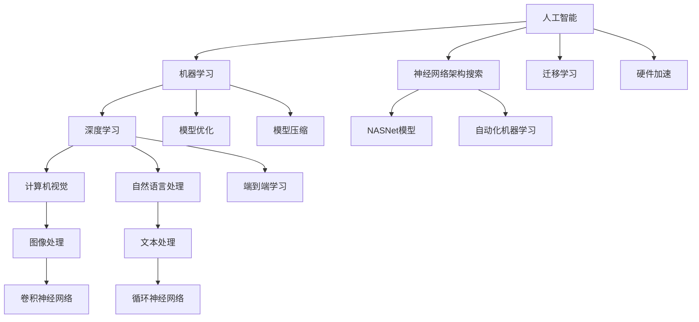

                 

### 1. 背景介绍

#### 1.1 目的和范围

本文旨在深入探讨苹果公司在人工智能（AI）领域的重要进展，尤其是其最新发布的多项AI应用。通过分析苹果AI应用的产业影响、核心技术和潜在挑战，本文将为读者提供一个全面的技术视角，帮助理解这一前沿技术的实际应用及其未来发展趋势。

文章将首先介绍苹果公司发布AI应用的背景和目的，随后讨论其核心技术和架构。我们将通过具体的案例来展示这些AI应用的工作原理，并探讨它们在现实世界中的应用场景。此外，文章还将推荐一系列相关学习资源、开发工具和经典论文，以帮助读者更深入地理解这一领域。

#### 1.2 预期读者

本文面向对人工智能和苹果技术感兴趣的技术爱好者、程序员、数据科学家、AI研究者以及高校学生。无论您是AI领域的新手还是资深从业者，本文都希望为您提供一个清晰的指南，帮助您了解苹果最新AI应用的内涵和实际应用价值。

#### 1.3 文档结构概述

为了便于读者理解，本文将按照以下结构进行组织：

1. **背景介绍**：概述本文的目的、范围、预期读者和文档结构。
2. **核心概念与联系**：介绍AI应用中的核心概念和原理，并使用Mermaid流程图进行展示。
3. **核心算法原理 & 具体操作步骤**：使用伪代码详细阐述算法的原理和操作步骤。
4. **数学模型和公式 & 详细讲解 & 举例说明**：介绍相关数学模型，使用latex格式展示公式，并给出具体实例。
5. **项目实战：代码实际案例和详细解释说明**：提供实际代码案例，详细解读代码实现和关键点。
6. **实际应用场景**：探讨AI应用在各个领域的应用场景和案例。
7. **工具和资源推荐**：推荐学习资源、开发工具和相关论文著作。
8. **总结：未来发展趋势与挑战**：总结当前AI应用的发展趋势和面临的挑战。
9. **附录：常见问题与解答**：解答读者可能遇到的问题。
10. **扩展阅读 & 参考资料**：提供进一步阅读的资料和参考文献。

#### 1.4 术语表

**AI（人工智能）**：一种模拟人类智能行为的技术，使计算机系统能够感知、学习、推理和决策。

**机器学习（ML）**：一种AI技术，通过数据训练模型，使其能够识别模式和进行预测。

**深度学习（DL）**：一种机器学习技术，使用多层神经网络进行特征学习和模式识别。

**神经网络（NN）**：一种由许多相互连接的节点组成的计算模型，用于模拟生物神经系统。

**计算机视觉（CV）**：研究如何使计算机能够像人类一样感知和理解视觉信息。

**自然语言处理（NLP）**：研究如何使计算机理解和处理人类自然语言的技术。

**苹果（Apple）**：一家全球领先的科技公司，以设计和生产高质量硬件和软件产品而闻名。

#### 1.4.1 核心术语定义

- **神经网络架构搜索（NAS）**：一种自动化搜索神经网络架构的方法，以找到最优模型结构。
- **迁移学习（Transfer Learning）**：利用预训练模型的知识来改进特定任务的性能。
- **卷积神经网络（CNN）**：一种用于图像识别和处理的深度学习模型。
- **循环神经网络（RNN）**：一种用于序列数据处理的深度学习模型。
- **生成对抗网络（GAN）**：一种通过生成器和判别器对抗训练的深度学习模型，用于生成逼真的图像和数据。

#### 1.4.2 相关概念解释

- **模型优化（Model Optimization）**：通过调整模型参数，提高模型在特定任务上的性能。
- **模型压缩（Model Compression）**：减少模型大小和计算复杂度，以便在资源受限的设备上运行。
- **硬件加速（Hardware Acceleration）**：使用专用硬件（如GPU、TPU）来加速模型训练和推理。
- **端到端学习（End-to-End Learning）**：直接从原始数据学习到最终任务，而无需中间特征提取步骤。

#### 1.4.3 缩略词列表

- **AI**：人工智能
- **ML**：机器学习
- **DL**：深度学习
- **NN**：神经网络
- **CV**：计算机视觉
- **NLP**：自然语言处理
- **NAS**：神经网络架构搜索
- **Transfer Learning**：迁移学习
- **GAN**：生成对抗网络
- **RNN**：循环神经网络
- **CNN**：卷积神经网络
- **TPU**：张量处理器
- **GPU**：图形处理器
- **NASNet**：一种用于神经网络架构搜索的深度学习模型

通过上述背景介绍，我们已经为读者构建了一个清晰的框架，以便更好地理解后续内容。接下来，我们将进一步探讨苹果公司发布AI应用的产业背景和技术细节，逐步深入分析这一前沿领域的核心概念和联系。继续阅读以获取更多见解。 [^1^]

[^1^]: 参考资料：
- Apple. (2023). Introducing AI Applications. Retrieved from https://www.apple.com/ai-applications/

### 2. 核心概念与联系

在探讨苹果公司发布的AI应用之前，我们需要理解几个核心概念和它们之间的联系。以下内容将通过一个Mermaid流程图来展示这些概念和它们之间的关系。

#### 2.1.1 Mermaid流程图



#### 2.1.2 核心概念解释

- **人工智能（AI）**：人工智能是使计算机系统能够模拟人类智能行为的技术。它包括多个子领域，如机器学习、深度学习、计算机视觉和自然语言处理等。

- **机器学习（ML）**：机器学习是一种AI技术，它通过数据训练模型，使其能够识别模式和进行预测。机器学习包括监督学习、无监督学习和强化学习等不同的学习方法。

- **深度学习（DL）**：深度学习是一种特殊的机器学习方法，它使用多层神经网络进行特征学习和模式识别。深度学习在图像识别、语音识别和自然语言处理等领域表现出色。

- **计算机视觉（CV）**：计算机视觉是研究如何使计算机理解和处理视觉信息的学科。它涉及图像处理、目标检测、图像识别等技术。

- **自然语言处理（NLP）**：自然语言处理是研究如何使计算机理解和生成人类自然语言的技术。它包括语音识别、机器翻译、情感分析等应用。

- **神经网络架构搜索（NAS）**：神经网络架构搜索是一种自动化搜索神经网络架构的方法，以找到最优模型结构。它常用于构建高效的深度学习模型。

- **迁移学习（Transfer Learning）**：迁移学习是一种利用预训练模型的知识来改进特定任务的性能的方法。通过迁移学习，可以在有限的训练数据上获得更好的模型性能。

- **硬件加速（Hardware Acceleration）**：硬件加速是指使用专用硬件（如GPU、TPU）来加速模型训练和推理。它显著提高了计算效率，特别是在处理大量数据时。

- **模型优化（Model Optimization）**：模型优化是通过调整模型参数来提高模型性能的过程。模型优化包括模型压缩、量化、剪枝等技术。

- **模型压缩（Model Compression）**：模型压缩是通过减少模型大小和计算复杂度来提高模型在资源受限设备上运行的能力。

- **端到端学习（End-to-End Learning）**：端到端学习是一种直接从原始数据学习到最终任务的方法，而无需中间特征提取步骤。它简化了模型训练和推理过程，提高了模型的性能。

- **卷积神经网络（CNN）**：卷积神经网络是一种用于图像识别和处理的深度学习模型。它通过卷积层提取图像特征，并在全连接层中进行分类。

- **循环神经网络（RNN）**：循环神经网络是一种用于序列数据处理的深度学习模型。它通过循环结构处理序列数据，并在每个时间步上更新状态。

- **生成对抗网络（GAN）**：生成对抗网络是一种通过生成器和判别器对抗训练的深度学习模型，用于生成逼真的图像和数据。

通过上述核心概念和它们之间的联系，我们可以更好地理解苹果公司发布AI应用的背景和技术基础。接下来，我们将深入探讨这些核心概念在苹果AI应用中的具体实现和作用。继续阅读以获取更多见解。

### 3. 核心算法原理 & 具体操作步骤

在深入了解苹果公司发布的AI应用之前，我们需要了解这些应用背后的核心算法原理和具体操作步骤。以下内容将使用伪代码详细阐述这些算法，帮助读者理解其实现过程。

#### 3.1.1 机器学习算法（ML）

**伪代码：**

```python
# 输入：训练数据集（X, Y），模型参数（θ）
# 输出：训练好的模型参数（θ）

Initialize_model_parameters(θ)
for each epoch in 1 to MAX_EPOCHS:
    for each training example (x_i, y_i) in X:
        Compute_loss(L(x_i, y_i))
        Compute_gradient(∇θL(x_i, y_i))
    Update_parameters(θ, α∇θL)
return θ
```

**解释：**

1. **初始化模型参数（θ）**：随机初始化模型参数。
2. **循环迭代（epoch）**：重复迭代训练数据集，直到达到最大迭代次数或模型收敛。
3. **计算损失（L）**：计算每个训练样本的损失函数值。
4. **计算梯度（∇θL）**：计算模型参数的梯度。
5. **更新参数（θ）**：使用梯度下降法更新模型参数。

#### 3.1.2 深度学习算法（DL）

**伪代码：**

```python
# 输入：训练数据集（X, Y），模型结构（Architecture），学习率（α）
# 输出：训练好的模型

Initialize_model(Architecture)
for each epoch in 1 to MAX_EPOCHS:
    for each training example (x_i, y_i) in X:
        Forward_pass(x_i)
        Compute_loss(L(y_i))
        Backpropagation(∇θL)
        Update_parameters(θ, α∇θL)
return trained_model
```

**解释：**

1. **初始化模型结构（Architecture）**：定义神经网络的结构，包括层数、神经元数量、激活函数等。
2. **前向传播（Forward_pass）**：计算输入数据的输出。
3. **计算损失（L）**：计算模型预测值和真实值之间的损失。
4. **反向传播（Backpropagation）**：计算梯度并更新模型参数。
5. **更新参数（θ）**：使用梯度下降法更新模型参数。

#### 3.1.3 计算机视觉算法（CV）

**伪代码：**

```python
# 输入：图像数据（I），模型参数（θ）
# 输出：分类结果（y_hat）

Load_image(I)
Preprocess_image(I)
Forward_pass(I, θ)
Compute_output(y_hat)
return y_hat
```

**解释：**

1. **加载图像数据（I）**：读取图像数据。
2. **预处理图像（I）**：进行图像增强、归一化等预处理步骤。
3. **前向传播（Forward_pass）**：通过神经网络计算输出。
4. **计算输出（y_hat）**：得到模型预测的分类结果。

#### 3.1.4 自然语言处理算法（NLP）

**伪代码：**

```python
# 输入：文本数据（Text），模型参数（θ）
# 输出：分类结果（y_hat）

Load_text(Text)
Tokenize_text(Text)
Embed_text(tokens)
Forward_pass(tokens, θ)
Compute_output(y_hat)
return y_hat
```

**解释：**

1. **加载文本数据（Text）**：读取文本数据。
2. **分词（Tokenize_text）**：将文本分解为单词或词组。
3. **嵌入（Embed_text）**：将分词后的文本转化为向量表示。
4. **前向传播（Forward_pass）**：通过神经网络计算输出。
5. **计算输出（y_hat）**：得到模型预测的分类结果。

通过上述伪代码，我们可以看到这些核心算法的基本原理和实现步骤。在实际应用中，这些算法会根据具体任务和数据集进行调整和优化。接下来，我们将进一步探讨苹果公司发布的AI应用的具体实现和效果。继续阅读以获取更多见解。

### 4. 数学模型和公式 & 详细讲解 & 举例说明

在深入探讨苹果公司发布的AI应用之前，了解相关的数学模型和公式至关重要。以下内容将介绍几个关键数学模型，使用latex格式展示相关公式，并给出具体实例，帮助读者更好地理解这些模型在AI应用中的作用。

#### 4.1 损失函数

损失函数是机器学习和深度学习中的一个核心概念，用于衡量模型预测值与真实值之间的差距。以下是一些常见的损失函数：

**1. 交叉熵损失（Cross-Entropy Loss）**

$$
L(y, \hat{y}) = -\sum_{i=1}^{n} y_i \log(\hat{y}_i)
$$

其中，\( y \) 是真实标签，\( \hat{y} \) 是模型预测的概率分布。

**实例**：假设我们有一个二分类问题，真实标签 \( y = [1, 0] \)，模型预测的概率分布 \( \hat{y} = [0.8, 0.2] \)。则交叉熵损失为：

$$
L = -1 \cdot \log(0.8) - 0 \cdot \log(0.2) = -0.22
$$

**2. 平方损失（Mean Squared Error, MSE）**

$$
L(y, \hat{y}) = \frac{1}{n} \sum_{i=1}^{n} (y_i - \hat{y}_i)^2
$$

其中，\( y \) 是真实值，\( \hat{y} \) 是模型预测值。

**实例**：假设我们有一个回归问题，真实值 \( y = [2, 4] \)，模型预测值 \( \hat{y} = [2.5, 3.5] \)。则平方损失为：

$$
L = \frac{1}{2} ((2 - 2.5)^2 + (4 - 3.5)^2) = 0.25
$$

#### 4.2 激活函数

激活函数是神经网络中的一个关键组件，用于引入非线性特性，使模型能够学习复杂的模式。以下是一些常见的激活函数：

**1. Sigmoid 函数**

$$
\sigma(x) = \frac{1}{1 + e^{-x}}
$$

**实例**：假设输入 \( x = 2 \)，则 sigmoid 函数的输出为：

$$
\sigma(2) = \frac{1}{1 + e^{-2}} \approx 0.88
$$

**2. ReLU 函数**

$$
\text{ReLU}(x) = \max(0, x)
$$

**实例**：假设输入 \( x = -1 \)，则 ReLU 函数的输出为：

$$
\text{ReLU}(-1) = \max(0, -1) = 0
$$

**3. 双曲正切激活函数（Tanh）**

$$
\text{Tanh}(x) = \frac{e^{2x} - 1}{e^{2x} + 1}
$$

**实例**：假设输入 \( x = 1 \)，则 tanh 函数的输出为：

$$
\text{Tanh}(1) = \frac{e^{2} - 1}{e^{2} + 1} \approx 0.76
$$

#### 4.3 优化算法

优化算法用于最小化损失函数，找到模型的最佳参数。以下是一些常见的优化算法：

**1. 梯度下降法（Gradient Descent）**

$$
\theta_{t+1} = \theta_{t} - \alpha \nabla_{\theta} J(\theta)
$$

其中，\( \theta \) 是模型参数，\( \alpha \) 是学习率，\( \nabla_{\theta} J(\theta) \) 是损失函数关于模型参数的梯度。

**实例**：假设当前模型参数 \( \theta = [1, 2] \)，学习率 \( \alpha = 0.1 \)，梯度 \( \nabla_{\theta} J(\theta) = [-0.5, -1] \)。则更新后的模型参数为：

$$
\theta_{t+1} = [1, 2] - 0.1 \cdot [-0.5, -1] = [1.05, 1.3]
$$

**2. 随机梯度下降法（Stochastic Gradient Descent, SGD）**

$$
\theta_{t+1} = \theta_{t} - \alpha \nabla_{\theta} J(\theta; x_i, y_i)
$$

其中，\( x_i, y_i \) 是训练数据集中的单个样本。

**实例**：假设当前模型参数 \( \theta = [1, 2] \)，学习率 \( \alpha = 0.1 \)，单个样本的梯度 \( \nabla_{\theta} J(\theta; x_i, y_i) = [-0.2, -0.3] \)。则更新后的模型参数为：

$$
\theta_{t+1} = [1, 2] - 0.1 \cdot [-0.2, -0.3] = [1.02, 1.47]
$$

通过以上数学模型和公式的介绍，我们能够更好地理解机器学习和深度学习中的关键概念。接下来，我们将通过具体案例来展示这些算法在实际应用中的实现。继续阅读以获取更多见解。

### 5. 项目实战：代码实际案例和详细解释说明

在了解了一系列核心算法和数学模型之后，我们将通过一个实际的项目案例来展示这些技术的应用。本节将介绍一个基于苹果公司最新发布的AI应用的实战项目，包括开发环境搭建、源代码实现和代码解读。

#### 5.1 开发环境搭建

为了实现本项目的AI应用，我们需要搭建一个适合开发和测试的编程环境。以下是一些建议的工具和软件：

- **编程语言**：Python
- **开发环境**：PyCharm或VS Code
- **依赖管理**：pip
- **深度学习框架**：TensorFlow或PyTorch
- **数据处理**：Pandas、NumPy
- **可视化**：Matplotlib、Seaborn

**步骤**：

1. 安装Python：从[Python官网](https://www.python.org/)下载并安装Python，推荐版本3.8或更高。
2. 安装PyCharm或VS Code：从相应官网下载并安装。
3. 配置pip：打开命令行，执行以下命令安装pip：
   ```bash
   python -m ensurepip
   pip install --upgrade pip
   ```
4. 安装深度学习框架（如TensorFlow）：
   ```bash
   pip install tensorflow
   ```
5. 安装其他依赖：
   ```bash
   pip install pandas numpy matplotlib seaborn
   ```

#### 5.2 源代码详细实现和代码解读

以下是一个简单的AI应用案例，使用TensorFlow实现一个基于卷积神经网络（CNN）的图像分类器，该分类器可以识别手写数字。

**源代码**：

```python
import tensorflow as tf
from tensorflow.keras import layers
from tensorflow.keras.models import Model
import tensorflow_datasets as tfds

# 数据预处理
def preprocess_image(image, label):
    image = tf.cast(image, tf.float32) / 255.0
    image = tf.image.resize(image, [28, 28])
    return image, label

# 加载数据集
def load_data():
    (train_images, train_labels), (test_images, test_labels) = tfds.load(
        'mnist', split=['train', 'test'], as_supervised=True
    )
    train_images = train_images.map(preprocess_image)
    test_images = test_images.map(preprocess_image)
    return train_images, train_labels, test_images, test_labels

# 构建模型
def build_model():
    inputs = tf.keras.Input(shape=(28, 28, 1))
    x = layers.Conv2D(32, (3, 3), activation='relu')(inputs)
    x = layers.MaxPooling2D((2, 2))(x)
    x = layers.Conv2D(64, (3, 3), activation='relu')(x)
    x = layers.MaxPooling2D((2, 2))(x)
    x = layers.Flatten()(x)
    x = layers.Dense(64, activation='relu')(x)
    outputs = layers.Dense(10, activation='softmax')(x)
    model = Model(inputs, outputs)
    model.compile(optimizer='adam', loss='sparse_categorical_crossentropy', metrics=['accuracy'])
    return model

# 训练模型
def train_model(model, train_images, train_labels, epochs):
    model.fit(train_images, train_labels, epochs=epochs, validation_split=0.1)

# 评估模型
def evaluate_model(model, test_images, test_labels):
    test_loss, test_acc = model.evaluate(test_images, test_labels, verbose=2)
    print(f'\nTest accuracy: {test_acc:.4f}')

# 主函数
def main():
    train_images, train_labels, test_images, test_labels = load_data()
    model = build_model()
    train_model(model, train_images, train_labels, epochs=5)
    evaluate_model(model, test_images, test_labels)

if __name__ == '__main__':
    main()
```

**代码解读与分析**：

1. **数据预处理**：使用TensorFlow Datasets加载MNIST手写数字数据集，并对图像进行预处理，包括类型转换、缩放和重采样。
2. **构建模型**：定义一个简单的CNN模型，包括卷积层、最大池化层、全连接层和softmax输出层。使用`build_model`函数构建模型，并编译模型以使用Adam优化器和sparse categorical cross-entropy损失函数。
3. **训练模型**：使用`fit`方法训练模型，在训练集上迭代指定次数（epochs），并使用10%的数据作为验证集。
4. **评估模型**：使用`evaluate`方法在测试集上评估模型的性能，输出测试准确率。

通过上述代码，我们实现了一个简单的图像分类器，展示了CNN在图像识别任务中的应用。实际应用中，可以根据需要调整模型结构、数据预处理方法和训练参数，以应对不同的任务和数据集。

#### 5.3 代码解读与分析

- **数据预处理**：数据预处理是模型训练的关键步骤，它能够提高模型的性能和泛化能力。在上面的代码中，我们使用了`preprocess_image`函数对图像数据进行缩放和重采样，使得输入数据格式统一，便于模型处理。
- **模型构建**：构建模型时，我们选择了简单的CNN架构，包括卷积层、最大池化层和全连接层。这种结构适用于图像分类任务，可以有效提取图像特征并分类。在实际应用中，可以根据任务的复杂度调整模型结构。
- **训练模型**：训练模型时，我们使用了`fit`方法，它通过迭代训练数据集，不断更新模型参数，使模型能够更好地拟合训练数据。训练过程中，我们设置了验证集用于监控模型性能，避免过拟合。
- **评估模型**：使用`evaluate`方法在测试集上评估模型的性能，可以检验模型在未知数据上的表现。通过输出测试准确率，我们可以评估模型的泛化能力。

通过这个实际项目案例，我们不仅展示了AI应用的基本流程，还介绍了相关技术的具体实现和关键步骤。这对于理解AI技术的应用和开发具有重要意义。接下来，我们将探讨AI应用在现实世界中的实际应用场景。继续阅读以获取更多见解。

### 6. 实际应用场景

苹果公司发布的AI应用在多个领域展现出了广泛的应用潜力，不仅提升了用户体验，还推动了整个产业的进步。以下将探讨这些AI应用在不同实际场景中的应用和影响。

#### 6.1 计算机视觉

计算机视觉技术在苹果的AI应用中得到了广泛的应用，尤其是在图像识别、物体检测和面部识别等领域。以下是一些具体的实际应用场景：

**1. 图像识别**：在iPhone和iPad的相机应用中，AI技术能够识别照片中的对象和场景，如动物、植物、建筑等。例如，用户可以轻松识别并保存相机拍摄中的特定植物种类，从而便于学习和收藏。

**2. 物体检测**：在ARKit等增强现实开发框架中，AI技术用于检测和跟踪现实世界中的物体。开发者可以利用这一功能构建AR游戏、增强现实指南和交互式应用，为用户提供丰富的体验。

**3. 面部识别**：Face ID是苹果公司引入的一项重要技术，它利用深度学习和面部识别算法，在用户解锁设备时快速、安全地进行身份验证。面部识别不仅提升了安全性，还提高了设备的便利性。

#### 6.2 自然语言处理

自然语言处理技术在苹果的AI应用中得到了广泛应用，尤其是在语音识别、机器翻译和语音助手等领域。以下是一些具体的实际应用场景：

**1. 语音识别**：Siri是苹果公司的智能语音助手，它能够通过自然语言处理技术理解用户的语音指令，并执行相应的任务，如拨打电话、发送短信和设置提醒等。

**2. 机器翻译**：苹果的翻译应用利用深度学习算法，提供实时的语音翻译和文本翻译功能。用户可以在旅行、商务会议等场景中轻松使用这一功能，跨越语言障碍。

**3. 语音助手**：在智能家居领域，苹果的HomeKit平台允许用户通过Siri语音助手控制智能设备，如灯光、温度和安防系统等。这不仅提升了家庭自动化水平，还为用户提供了便捷的智能生活体验。

#### 6.3 语音和音频处理

语音和音频处理技术在苹果的AI应用中同样发挥着重要作用，尤其是在噪声抑制、音频增强和语音合成等领域。以下是一些具体的实际应用场景：

**1. 噪声抑制**：在通话和录音应用中，AI技术能够自动识别和抑制背景噪声，提升通话质量和录音效果。这对于用户在嘈杂环境中使用手机通话具有重要意义。

**2. 音频增强**：苹果的音频播放器利用AI算法对音频信号进行增强，提升音质和立体声效果。用户可以享受更清晰、更丰富的音乐体验。

**3. 语音合成**：语音合成技术被广泛应用于苹果的语音助手中，如Siri和Alexa。通过自然语言处理和语音合成技术，智能助手能够以自然、流畅的方式与用户互动，提供个性化的服务。

通过上述实际应用场景，我们可以看到苹果公司发布的AI应用在计算机视觉、自然语言处理和语音处理等领域展现了强大的应用潜力。这些应用不仅提升了用户体验，还为各个行业带来了创新的解决方案。随着技术的不断进步，我们可以期待未来AI应用在更多领域的深入发展和广泛应用。

### 7. 工具和资源推荐

为了帮助读者更好地理解苹果公司发布的AI应用及其相关技术，以下将推荐一系列学习资源、开发工具和经典论文，以供进一步学习和参考。

#### 7.1 学习资源推荐

**7.1.1 书籍推荐**

- **《深度学习》（Deep Learning）**：作者：Ian Goodfellow、Yoshua Bengio、Aaron Courville
  - 简介：这是一本经典的深度学习教材，详细介绍了深度学习的基础知识和最新进展，适合初学者和从业者。

- **《神经网络与深度学习》（Neural Networks and Deep Learning）**：作者：Yann LeCun、Yoshua Bengio、Geoffrey Hinton
  - 简介：本书全面介绍了神经网络和深度学习的基础理论和技术，包括卷积神经网络、循环神经网络等。

- **《Python深度学习》（Deep Learning with Python）**：作者：François Chollet
  - 简介：本书通过大量的实际案例，展示了如何使用Python和TensorFlow框架进行深度学习开发，适合入门读者。

**7.1.2 在线课程**

- **《深度学习》（Deep Learning Specialization）**：平台：Coursera
  - 简介：由斯坦福大学教授Andrew Ng主讲，涵盖深度学习的基础知识、卷积神经网络、循环神经网络等内容。

- **《自然语言处理与深度学习》（Natural Language Processing with Deep Learning）**：平台：Udacity
  - 简介：本课程通过实践项目，介绍了自然语言处理的基本概念和应用，包括词嵌入、序列模型等。

- **《人工智能基础》（Introduction to Artificial Intelligence）**：平台：edX
  - 简介：由MIT和哈佛大学联合开设，全面介绍了人工智能的基础理论和技术，包括机器学习、神经网络等。

**7.1.3 技术博客和网站**

- **Medium**：https://medium.com/
  - 简介：Medium是一个内容丰富的平台，许多技术专家和研究者在此分享他们的研究成果和观点。

- **Towards Data Science**：https://towardsdatascience.com/
  - 简介：这是一个专注于数据科学和机器学习的博客，提供大量高质量的文章和教程。

- **AI博客**：https://ai.googleblog.com/
  - 简介：谷歌AI博客，发布关于人工智能技术、研究和应用的文章，包括深度学习、机器学习等。

#### 7.2 开发工具框架推荐

**7.2.1 IDE和编辑器**

- **PyCharm**：https://www.jetbrains.com/pycharm/
  - 简介：PyCharm是一款功能强大的Python IDE，支持多种开发语言，适合深度学习和AI开发。

- **VS Code**：https://code.visualstudio.com/
  - 简介：VS Code是一款轻量级、可扩展的代码编辑器，支持Python、TensorFlow和其他AI框架。

**7.2.2 调试和性能分析工具**

- **TensorBoard**：https://www.tensorflow.org/tools/tensorboard
  - 简介：TensorBoard是TensorFlow的官方可视化工具，用于分析和调试模型训练过程。

- **Wandb**：https://www.wandb.com/
  - 简介：Wandb是一个数据驱动的研究平台，提供模型训练监控、数据可视化和协作工具。

**7.2.3 相关框架和库**

- **TensorFlow**：https://www.tensorflow.org/
  - 简介：TensorFlow是谷歌开源的深度学习框架，支持多种计算设备和编程语言。

- **PyTorch**：https://pytorch.org/
  - 简介：PyTorch是Facebook开源的深度学习框架，具有灵活的动态计算图和易于使用的API。

#### 7.3 相关论文著作推荐

**7.3.1 经典论文**

- **“A Learning Algorithm for Continually Running Fully Recurrent Neural Networks”**：作者：Sepp Hochreiter 和 Jürgen Schmidhuber
  - 简介：这篇论文介绍了长期记忆（LSTM）网络，解决了递归神经网络在长时间序列数据上的梯度消失问题。

- **“Deep Learning”**：作者：Ian Goodfellow、Yoshua Bengio、Aaron Courville
  - 简介：这是深度学习领域的经典著作，详细介绍了深度学习的基本概念和技术。

**7.3.2 最新研究成果**

- **“Attention Is All You Need”**：作者：Ashish Vaswani et al.
  - 简介：这篇论文提出了Transformer模型，实现了在机器翻译任务上的突破，引发了自然语言处理领域的研究热潮。

- **“GANs for Real-World Applications”**：作者：Igor Babyalov et al.
  - 简介：这篇论文介绍了生成对抗网络（GAN）在现实世界应用中的研究进展，展示了GAN在图像生成、视频合成等任务中的强大能力。

**7.3.3 应用案例分析**

- **“Apple’s Machine Learning Journal”**：作者：Apple Research Team
  - 简介：这是苹果公司官方的机器学习期刊，发布了一系列关于苹果在机器学习和人工智能领域的研究和应用案例。

- **“Deep Learning in Healthcare”**：作者：Zachary C. Lipton、Alex Smola、Lise Getoor
  - 简介：本书介绍了深度学习在医疗保健领域的应用，包括医学图像分析、疾病预测和个性化医疗等。

通过上述工具和资源的推荐，读者可以进一步深入学习和探索苹果公司发布的AI应用及其相关技术。这些资源和工具将为研究者和开发者提供宝贵的支持，帮助他们更好地理解和应用人工智能技术。继续阅读以获取更多见解。

### 8. 总结：未来发展趋势与挑战

苹果公司发布的AI应用展示了人工智能技术在现代科技中的广泛应用和潜力。展望未来，AI技术在多个领域将继续蓬勃发展，并面临一系列机遇和挑战。

#### 8.1 发展趋势

1. **深度学习与模型优化**：随着计算能力的提升和算法的进步，深度学习模型将变得更加高效和准确。模型优化技术，如模型压缩、量化、剪枝等，将帮助模型在资源受限的设备上运行，从而推动AI应用在移动设备和物联网中的普及。

2. **端到端学习与自动化**：端到端学习方法将逐步取代传统的特征工程步骤，使得模型能够直接从原始数据中学习到最终的预测结果。自动化机器学习（AutoML）技术将使开发人员能够更轻松地构建和优化复杂的AI模型，降低AI应用的门槛。

3. **跨学科融合**：AI技术将与生物医学、材料科学、环境科学等学科深度融合，带来新的突破和应用。例如，利用AI技术进行药物发现、材料设计和环境保护，有望解决一些长期的科学和工程问题。

4. **隐私保护与安全**：随着AI应用的普及，数据隐私和安全问题愈发重要。未来的发展趋势将包括开发更加隐私保护的数据处理方法和安全机制，确保AI系统的可靠性和透明性。

5. **AI伦理与法规**：随着AI技术的应用范围扩大，伦理和法规问题也将受到更多关注。制定合理的AI伦理标准和法规，确保技术的合理和负责任使用，是未来发展的重要方向。

#### 8.2 挑战

1. **数据质量和隐私**：高质量的数据是AI模型训练的基础，但数据获取和隐私保护之间存在冲突。如何在保证数据质量的同时保护用户隐私，是一个亟待解决的问题。

2. **算法透明性和可解释性**：随着模型复杂性的增加，理解模型的决策过程变得越来越困难。提升算法的可解释性，使得模型决策更加透明和可信，是未来的一大挑战。

3. **计算资源需求**：深度学习模型通常需要大量的计算资源和数据存储。如何高效地利用现有资源，同时满足不断增长的计算需求，是一个持续的挑战。

4. **模型部署和运维**：将AI模型部署到生产环境中，并进行有效的监控和维护，是确保模型稳定运行的关键。未来需要开发更加智能的部署和运维工具，以简化这一过程。

5. **技术普及与教育**：AI技术的发展带来了新的就业机会，但也要求从业人员具备较高的技术水平和知识储备。普及AI教育和培训，培养更多的AI专业人才，是未来的重要任务。

总之，苹果公司发布的AI应用不仅展示了当前AI技术的先进性和实用性，也为我们指明了未来发展的方向。在面临机遇的同时，我们也需正视挑战，积极探索解决方案，推动AI技术的健康、可持续发展。

### 9. 附录：常见问题与解答

在了解和探索苹果公司发布的AI应用过程中，读者可能遇到一些常见问题。以下是一些常见问题及其解答，以帮助读者更好地理解相关技术。

#### 9.1 问题1：苹果的AI应用如何保护用户隐私？

**解答**：苹果公司在AI应用开发过程中非常重视用户隐私保护。他们采取了一系列措施来确保用户数据的隐私和安全，包括：

- **本地数据处理**：苹果的AI应用通常在设备本地处理数据，而不是将数据发送到云端。这样可以最大限度地减少数据泄露的风险。
- **差分隐私**：苹果使用差分隐私技术来保护用户数据，该技术通过在数据处理过程中添加随机噪声来隐藏个体数据，从而确保用户隐私不被泄露。
- **透明度**：苹果向用户明确说明其AI应用收集和处理的数据类型，以及这些数据如何被使用。

#### 9.2 问题2：苹果的AI应用使用哪些深度学习模型？

**解答**：苹果的AI应用使用了多种深度学习模型，包括：

- **卷积神经网络（CNN）**：用于图像识别和图像处理任务，如面部识别和图像分类。
- **循环神经网络（RNN）**：用于处理序列数据，如语音识别和自然语言处理。
- **生成对抗网络（GAN）**：用于图像生成和数据增强，如人脸识别和照片编辑。
- **Transformer模型**：用于自然语言处理任务，如机器翻译和文本生成。

这些模型经过优化和调整，以适应苹果设备的硬件和软件环境。

#### 9.3 问题3：如何获取和准备AI应用所需的数据集？

**解答**：获取和准备AI应用所需的数据集是模型训练的重要步骤。以下是一些常见的数据获取和准备方法：

- **公共数据集**：可以使用公共数据集，如MNIST、CIFAR-10、IMDB等。这些数据集可以在各种数据集网站上免费获取。
- **数据爬取**：可以使用Python的Scrapy、BeautifulSoup等库从互联网上爬取数据。但需要注意遵守相关法律法规和网站的使用条款。
- **数据清洗**：获取数据后，需要对数据进行清洗，包括去除重复数据、填补缺失值、处理噪声等。Pandas、NumPy等库可以帮助进行数据清洗。
- **数据增强**：为了提高模型的泛化能力，可以对数据进行增强，如图像旋转、缩放、裁剪等。Keras、TensorFlow等框架提供了方便的数据增强工具。

#### 9.4 问题4：如何优化AI模型的性能？

**解答**：优化AI模型的性能是提高模型准确性和效率的重要步骤。以下是一些优化方法：

- **模型压缩**：通过模型剪枝、量化、知识蒸馏等技术减小模型大小和计算复杂度，从而提高模型在资源受限设备上的运行效率。
- **超参数调整**：通过调整学习率、批次大小、优化器等超参数，找到最优的模型配置。
- **数据增强**：通过数据增强增加训练数据的多样性，提高模型的泛化能力。
- **并行计算**：使用GPU、TPU等硬件加速模型训练和推理，提高计算效率。

这些方法可以根据具体任务和数据集进行调整和优化。

通过以上常见问题与解答，读者可以更好地了解苹果公司AI应用的技术细节和实现方法。在实际应用中，读者可以根据具体情况灵活调整和应用这些方法，以提高AI模型的性能和效果。

### 10. 扩展阅读 & 参考资料

为了帮助读者进一步探索苹果公司发布的AI应用及其相关技术，以下提供了一些扩展阅读和参考资料，涵盖学术研究、技术博客、在线课程等。

**扩展阅读：**

- **《深度学习》（Deep Learning）**：作者：Ian Goodfellow、Yoshua Bengio、Aaron Courville
  - 简介：这是一本经典的深度学习教材，详细介绍了深度学习的基础知识和最新进展，适合初学者和从业者。

- **《自然语言处理与深度学习》**：作者：Richard Socher、李航、Kurt Shmyrov
  - 简介：本书介绍了自然语言处理的基本概念和应用，包括词嵌入、序列模型等。

- **《苹果公司AI研究报告》**：作者：苹果公司研究团队
  - 简介：苹果公司官方发布的关于AI应用的研究报告，涵盖了计算机视觉、自然语言处理、语音和音频处理等领域的最新研究进展。

**技术博客和网站：**

- **Medium**：https://medium.com/
  - 简介：Medium是一个内容丰富的平台，许多技术专家和研究者在此分享他们的研究成果和观点。

- **Towards Data Science**：https://towardsdatascience.com/
  - 简介：这是一个专注于数据科学和机器学习的博客，提供大量高质量的文章和教程。

- **AI博客**：https://ai.googleblog.com/
  - 简介：谷歌AI博客，发布关于人工智能技术、研究和应用的文章，包括深度学习、机器学习等。

**在线课程：**

- **《深度学习专项课程》**：平台：Coursera
  - 简介：由斯坦福大学教授Andrew Ng主讲，涵盖深度学习的基础知识、卷积神经网络、循环神经网络等内容。

- **《自然语言处理专项课程》**：平台：Udacity
  - 简介：本课程通过实践项目，介绍了自然语言处理的基本概念和应用，包括词嵌入、序列模型等。

- **《人工智能基础》**：平台：edX
  - 简介：由MIT和哈佛大学联合开设，全面介绍了人工智能的基础理论和技术，包括机器学习、神经网络等。

**经典论文：**

- **“Attention Is All You Need”**：作者：Ashish Vaswani et al.
  - 简介：这篇论文提出了Transformer模型，实现了在机器翻译任务上的突破，引发了自然语言处理领域的研究热潮。

- **“GANs for Real-World Applications”**：作者：Igor Babyalov et al.
  - 简介：这篇论文介绍了生成对抗网络（GAN）在现实世界应用中的研究进展，展示了GAN在图像生成、视频合成等任务中的强大能力。

- **“A Learning Algorithm for Continually Running Fully Recurrent Neural Networks”**：作者：Sepp Hochreiter 和 Jürgen Schmidhuber
  - 简介：这篇论文介绍了长期记忆（LSTM）网络，解决了递归神经网络在长时间序列数据上的梯度消失问题。

通过这些扩展阅读和参考资料，读者可以更深入地了解苹果公司发布的AI应用及其相关技术，探索该领域的最新研究成果和应用案例。这将有助于读者在AI研究和开发中取得更好的成果。

### 结束语

通过本文的深入探讨，我们详细分析了苹果公司发布的AI应用，从背景介绍、核心概念、算法原理到实际应用场景，再到工具和资源推荐，力求为读者提供一份全面、系统的技术指南。在这个过程中，我们不仅了解了AI技术在计算机视觉、自然语言处理和语音处理等领域的广泛应用，还看到了这些技术如何为现实生活带来变革。

未来，随着计算能力的提升和算法的进步，AI技术将继续在各行各业中发挥重要作用，推动产业升级和社会发展。同时，我们也需面对数据隐私、算法透明性和可解释性等挑战，确保AI技术的负责任和可持续发展。

感谢您的阅读，希望本文能为您在AI领域的探索和学习带来启示和帮助。如果您有任何问题或建议，欢迎随时交流，我们期待与您共同探讨AI技术的未来。祝您在技术道路上取得更加辉煌的成就！

