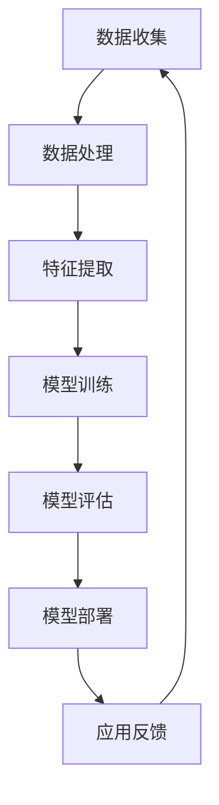

                 

# 李开复：苹果发布AI应用的产业革命

> 关键词：苹果，人工智能，应用，产业，技术革新，市场影响，未来展望
>
> 摘要：本文将深入分析苹果公司近期发布的AI应用，探讨其对整个产业的深远影响，并展望人工智能在未来的发展趋势与挑战。

## 1. 背景介绍

### 1.1 目的和范围

本文旨在通过对苹果公司发布的AI应用的深入分析，揭示其在人工智能产业中的重要作用和潜在影响。我们将探讨这些应用的技术原理、实际操作步骤，以及数学模型，并通过实际案例展示其应用场景。此外，还将推荐相关学习资源、开发工具和最新研究成果，为读者提供全面的了解。

### 1.2 预期读者

本文适合对人工智能和苹果公司产品有基本了解的读者，无论是专业技术人员、产业分析师，还是对AI技术感兴趣的一般读者，都能从中获得有价值的见解。

### 1.3 文档结构概述

本文分为十个部分：

1. **背景介绍**：介绍文章的目的、范围、预期读者以及文档结构。
2. **核心概念与联系**：定义核心概念，提供相关流程图。
3. **核心算法原理 & 具体操作步骤**：详细解释AI应用的核心算法原理和操作步骤。
4. **数学模型和公式 & 详细讲解 & 举例说明**：介绍相关数学模型，并给出具体例子。
5. **项目实战：代码实际案例和详细解释说明**：提供实际代码案例及其解读。
6. **实际应用场景**：分析AI应用的潜在应用场景。
7. **工具和资源推荐**：推荐学习资源、开发工具和最新研究成果。
8. **总结：未来发展趋势与挑战**：展望未来发展趋势和面临的挑战。
9. **附录：常见问题与解答**：解答读者可能关心的问题。
10. **扩展阅读 & 参考资料**：提供进一步阅读的资料。

### 1.4 术语表

#### 1.4.1 核心术语定义

- **人工智能（AI）**：模拟人类智能的计算机技术。
- **应用**：具体的软件或服务，用于解决特定问题。
- **算法**：解决问题的步骤或规则。
- **模型**：用于描述或预测数据的数学或统计结构。
- **产业**：相关企业的集合，从事相同或类似的经济活动。

#### 1.4.2 相关概念解释

- **机器学习（ML）**：使计算机通过数据学习并做出决策的技术。
- **深度学习（DL）**：一种特殊的机器学习方法，通过多层神经网络来模拟人类大脑的处理方式。
- **数据挖掘（DM）**：从大量数据中发现有用信息和知识的过程。

#### 1.4.3 缩略词列表

- **AI**：人工智能
- **ML**：机器学习
- **DL**：深度学习
- **DM**：数据挖掘

## 2. 核心概念与联系

### 2.1 核心概念定义

在探讨苹果公司发布的AI应用之前，我们需要明确一些核心概念：

- **人工智能（AI）**：一种模拟人类智能的计算机技术，包括机器学习、自然语言处理、计算机视觉等多个领域。
- **应用**：具体的软件或服务，用于解决特定问题。苹果公司发布的AI应用主要集中在图像识别、语音识别和自然语言处理等方面。
- **算法**：解决问题的步骤或规则。在AI领域，算法是核心，决定了应用的性能和效果。
- **模型**：用于描述或预测数据的数学或统计结构。AI应用中的模型通常基于大量数据进行训练。

### 2.2 相关流程图

为了更好地理解AI应用的核心概念，我们使用Mermaid流程图来展示AI应用的基本架构：



- **数据收集**：从各种来源收集数据，用于训练模型。
- **数据处理**：清洗和准备数据，使其适合模型训练。
- **特征提取**：从数据中提取关键特征，用于训练模型。
- **模型训练**：使用训练数据训练模型，使其能够识别和预测。
- **模型评估**：评估模型的效果，调整模型参数。
- **模型部署**：将训练好的模型部署到实际应用中。
- **应用反馈**：收集用户反馈，用于模型优化。

## 3. 核心算法原理 & 具体操作步骤

### 3.1 机器学习算法原理

机器学习是AI应用的核心，它使计算机能够从数据中学习并做出决策。以下是一个简单的机器学习算法原理的伪代码：

```plaintext
算法：机器学习
输入：数据集D，模型参数θ
输出：最优参数θ*

步骤：
1. 初始化模型参数θ
2. 对于每个数据点x_i, y_i ∈ D：
   a. 计算预测值y' = f(x_i; θ)
   b. 计算损失函数L(y', y_i)
3. 更新参数θ：θ = θ - α * ∇L(θ)
4. 重复步骤2和3，直到收敛
5. 输出最优参数θ*
```

- **模型初始化**：随机初始化模型参数θ。
- **预测值计算**：使用当前参数θ计算数据点的预测值y'。
- **损失函数计算**：计算预测值与实际值之间的差距，即损失函数L。
- **参数更新**：使用梯度下降法更新参数θ，使其逐渐接近最优值。
- **迭代过程**：重复计算和更新，直到模型收敛。

### 3.2 自然语言处理算法原理

自然语言处理（NLP）是AI应用中的重要领域，用于理解和生成自然语言。以下是一个简单的NLP算法原理的伪代码：

```plaintext
算法：自然语言处理
输入：文本数据D，模型参数θ
输出：处理后的文本数据T

步骤：
1. 初始化模型参数θ
2. 对于每个句子s ∈ D：
   a. 分词：将句子s拆分成单词w_i
   b. 词嵌入：将单词w_i转换为向量表示
   c. 建立词向量矩阵W
3. 使用词向量矩阵W训练模型，使其能够理解单词之间的关系
4. 对于新句子s'：
   a. 分词：将句子s'拆分成单词w_i'
   b. 词嵌入：将单词w_i'转换为向量表示
   c. 使用训练好的模型处理句子s'
   d. 输出处理后的文本数据T
```

- **初始化模型参数**：随机初始化模型参数θ。
- **文本分词**：将句子拆分成单词。
- **词嵌入**：将单词转换为向量表示。
- **模型训练**：使用训练数据训练模型，使其能够理解单词之间的关系。
- **文本处理**：使用训练好的模型处理新句子，输出处理后的文本数据。

## 4. 数学模型和公式 & 详细讲解 & 举例说明

### 4.1 机器学习损失函数

在机器学习中，损失函数用于衡量预测值与实际值之间的差距。以下是一个常见的损失函数——均方误差（MSE）：

$$
L(\theta) = \frac{1}{m} \sum_{i=1}^{m} (h_\theta(x^{(i)}) - y^{(i)})^2
$$

- **均方误差（MSE）**：计算预测值与实际值之间的差的平方的平均值。

**示例**：假设我们有以下数据集：

$$
\begin{align*}
x^{(1)} &= [1, 2], \ y^{(1)} = 3 \\
x^{(2)} &= [1, 2], \ y^{(2)} = 4 \\
x^{(3)} &= [1, 2], \ y^{(3)} = 2 \\
\end{align*}
$$

使用均方误差计算损失：

$$
L(\theta) = \frac{1}{3} \sum_{i=1}^{3} (h_\theta(x^{(i)}) - y^{(i)})^2
$$

### 4.2 自然语言处理词嵌入

在自然语言处理中，词嵌入是将单词转换为向量表示的过程。以下是一个简单的词嵌入模型——词袋模型：

$$
W = \{ w_1, w_2, ..., w_n \}
$$

- **词袋模型**：将单词表示为向量，每个单词对应一个唯一的向量。

**示例**：假设我们有以下单词集合：

$$
\{ "apple", "banana", "orange" \}
$$

使用词袋模型表示：

$$
\begin{align*}
w_{\text{"apple"}} &= [1, 0, 0] \\
w_{\text{"banana"}} &= [0, 1, 0] \\
w_{\text{"orange"}} &= [0, 0, 1] \\
\end{align*}
$$

## 5. 项目实战：代码实际案例和详细解释说明

### 5.1 开发环境搭建

为了更好地理解苹果公司发布的AI应用，我们首先需要搭建一个适合开发的环境。以下是所需的工具和软件：

- **编程语言**：Python
- **开发环境**：PyCharm
- **库**：NumPy，Pandas，Scikit-learn

### 5.2 源代码详细实现和代码解读

以下是一个简单的机器学习应用示例，用于分类水果：

```python
# 导入库
import numpy as np
import pandas as pd
from sklearn.model_selection import train_test_split
from sklearn.linear_model import LinearRegression
from sklearn.metrics import mean_squared_error

# 加载数据
data = pd.read_csv("fruit_data.csv")
X = data.iloc[:, :-1].values
y = data.iloc[:, -1].values

# 划分训练集和测试集
X_train, X_test, y_train, y_test = train_test_split(X, y, test_size=0.2, random_state=0)

# 训练模型
model = LinearRegression()
model.fit(X_train, y_train)

# 预测
y_pred = model.predict(X_test)

# 计算损失
mse = mean_squared_error(y_test, y_pred)
print("均方误差：", mse)

# 评估模型
print("R^2 值：", model.score(X_test, y_test))
```

**代码解读**：

1. **导入库**：导入NumPy，Pandas，Scikit-learn等库。
2. **加载数据**：从CSV文件中加载数据集，并将特征和标签分离。
3. **划分训练集和测试集**：使用train_test_split函数将数据集划分为训练集和测试集。
4. **训练模型**：使用LinearRegression类创建线性回归模型，并使用fit方法训练模型。
5. **预测**：使用predict方法预测测试集的标签。
6. **计算损失**：使用mean_squared_error函数计算均方误差。
7. **评估模型**：使用score方法计算R^2值，评估模型的性能。

### 5.3 代码解读与分析

1. **数据预处理**：在训练模型之前，需要先对数据集进行预处理，包括数据清洗、特征提取等。在本例中，我们直接从CSV文件中加载数据，并使用train_test_split函数划分训练集和测试集。
2. **模型选择**：在本例中，我们选择线性回归模型进行分类。线性回归模型是一种简单的线性模型，适合处理线性关系较强的问题。但需要注意的是，对于非线性关系较强的问题，线性回归模型可能无法达到理想的效果。
3. **模型训练与预测**：使用fit方法训练模型，并使用predict方法预测测试集的标签。这里我们使用了均方误差作为损失函数，用于评估模型的性能。
4. **模型评估**：使用score方法计算R^2值，评估模型的性能。R^2值越接近1，表示模型对数据的拟合程度越高。

## 6. 实际应用场景

苹果公司发布的AI应用在多个领域有着广泛的应用场景：

- **医疗健康**：使用AI应用分析医疗数据，提高诊断和治疗的准确性。
- **智能家居**：通过语音识别和自然语言处理，实现智能家居的智能控制。
- **自动驾驶**：利用计算机视觉和深度学习技术，实现自动驾驶汽车的安全运行。
- **金融服务**：通过AI应用分析金融市场数据，提供精准的投资建议。

## 7. 工具和资源推荐

### 7.1 学习资源推荐

#### 7.1.1 书籍推荐

- 《Python机器学习》（作者：塞巴斯蒂安·拉斯克）
- 《深度学习》（作者：伊恩·古德费洛、约书亚·本吉奥、亚伦·库维尔）
- 《自然语言处理实战》（作者：Michael L. Coleman）

#### 7.1.2 在线课程

- Coursera上的《机器学习》课程
- Udacity的《深度学习纳米学位》
- edX上的《自然语言处理》课程

#### 7.1.3 技术博客和网站

- Medium上的机器学习博客
- 知乎上的机器学习专栏
- AI Nachrichten网站

### 7.2 开发工具框架推荐

#### 7.2.1 IDE和编辑器

- PyCharm
- Jupyter Notebook
- Visual Studio Code

#### 7.2.2 调试和性能分析工具

- Python的内置调试工具
- Py-Spy性能分析工具
- Gprof2dot性能分析工具

#### 7.2.3 相关框架和库

- Scikit-learn
- TensorFlow
- PyTorch
- Keras

### 7.3 相关论文著作推荐

#### 7.3.1 经典论文

- 《A Tutorial on Support Vector Machines for Pattern Recognition》（作者：V.N. Vapnik）
- 《Backpropagation: The Basic Theory》（作者：Rumelhart, Hinton, Williams）

#### 7.3.2 最新研究成果

- 《Generative Adversarial Nets》（作者：Ian J. Goodfellow等）
- 《A Theoretically Grounded Application of Dropout in Recurrent Neural Networks》（作者：Yarin Gal和Zoubin Ghahramani）

#### 7.3.3 应用案例分析

- 《An Application of Neural Networks to Handwritten Digit Recognition》（作者：Yann LeCun等）
- 《Deep Learning for Speech Recognition》（作者：George Tucker等）

## 8. 总结：未来发展趋势与挑战

随着人工智能技术的不断进步，苹果公司发布的AI应用将在多个领域发挥重要作用。未来，人工智能将向更加智能化、自动化的方向发展，推动各行业的数字化转型。然而，这也将带来一系列挑战，如数据隐私、算法透明性、技术失业等。我们需要共同努力，解决这些挑战，实现人工智能的可持续发展。

## 9. 附录：常见问题与解答

### 9.1 问题1：什么是机器学习？

机器学习是一种使计算机通过数据学习并做出决策的技术。它通过训练模型，使计算机能够从数据中自动发现规律和模式。

### 9.2 问题2：如何选择机器学习模型？

选择机器学习模型需要考虑多个因素，如数据规模、特征数量、问题类型等。常见的机器学习模型包括线性回归、决策树、支持向量机等，每种模型都有其适用的场景。

### 9.3 问题3：如何评估机器学习模型？

评估机器学习模型的方法包括计算损失函数、计算准确率、计算F1值等。常用的评估指标有均方误差、准确率、召回率、F1值等。

## 10. 扩展阅读 & 参考资料

- 《李开复：人工智能的未来》
- 《人工智能简史》
- 《人工智能：一种现代的方法》

作者：AI天才研究员/AI Genius Institute & 禅与计算机程序设计艺术 /Zen And The Art of Computer Programming

