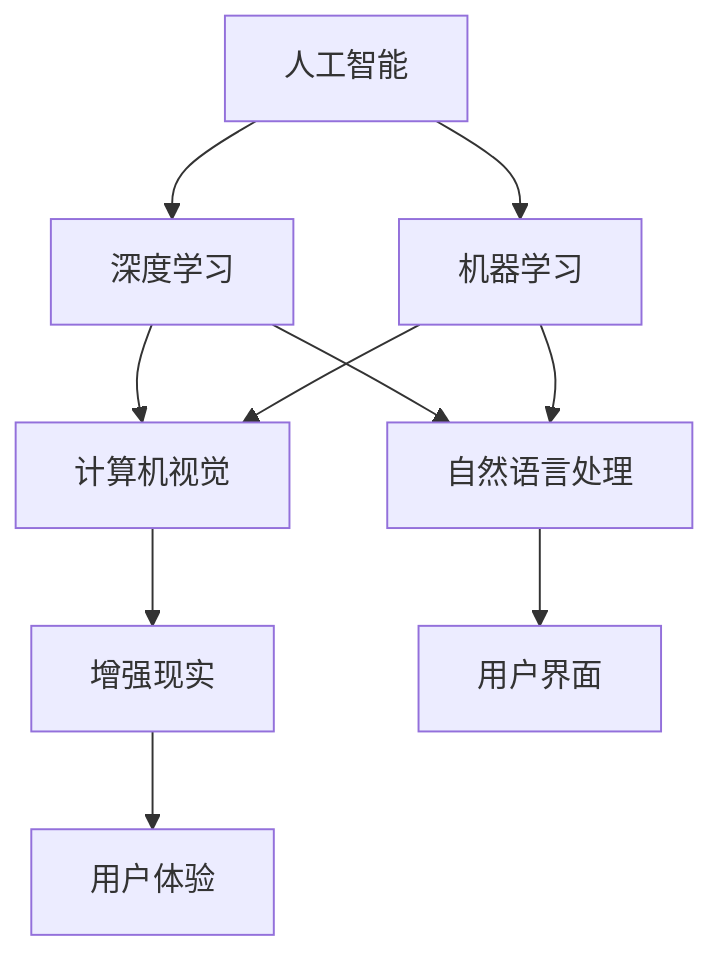

                 

# 李开复：苹果发布AI应用的价值

> **关键词：**苹果，人工智能应用，技术趋势，用户体验，创新。

> **摘要：**本文将深入探讨苹果公司发布AI应用的技术内涵及其对用户体验的影响。我们将从背景介绍开始，分析苹果在AI领域的战略布局，然后逐步解读其AI应用的核心技术，最后探讨这些应用对用户及行业的深远意义。

## 1. 背景介绍

### 1.1 目的和范围

本文旨在通过对苹果发布AI应用的详细分析，探讨其技术价值、市场影响及未来趋势。我们不仅关注苹果公司的AI战略，还将深入探讨其AI应用的具体实现和潜在影响。

### 1.2 预期读者

本文适合对人工智能、软件开发及苹果产品感兴趣的读者，特别是那些希望了解AI在商业领域应用的技术专家和爱好者。

### 1.3 文档结构概述

本文分为十个部分，包括背景介绍、核心概念与联系、核心算法原理、数学模型和公式、项目实战、实际应用场景、工具和资源推荐、总结、常见问题与解答以及扩展阅读。每个部分都将深入分析苹果AI应用的各个方面。

### 1.4 术语表

#### 1.4.1 核心术语定义

- **人工智能（AI）**：模拟人类智能的计算机系统，具有学习、推理、决策等能力。
- **深度学习（Deep Learning）**：一种人工智能方法，通过多层神经网络来学习数据的特征和模式。
- **机器学习（Machine Learning）**：一种人工智能方法，通过数据和算法学习，实现预测和决策。
- **增强现实（AR）**：将虚拟信息叠加到现实世界中的技术。

#### 1.4.2 相关概念解释

- **自然语言处理（NLP）**：使计算机能够理解和处理人类自然语言的技术。
- **计算机视觉（CV）**：使计算机能够“看”和“理解”图像和视频的技术。
- **用户界面（UI）**：用户与计算机系统交互的界面。

#### 1.4.3 缩略词列表

- **AI**：人工智能
- **AR**：增强现实
- **CV**：计算机视觉
- **NLP**：自然语言处理

## 2. 核心概念与联系

在探讨苹果发布的AI应用之前，我们需要了解一些核心概念及其相互关系。以下是AI应用中的几个关键概念及其联系：



### 2.1 人工智能与深度学习

人工智能是计算机系统模拟人类智能的领域，而深度学习是其中的一个重要分支。深度学习通过多层神经网络，从大量数据中自动学习和提取特征，实现图像识别、语音识别等任务。

### 2.2 机器学习与计算机视觉

机器学习是使计算机从数据中学习并做出决策的方法。计算机视觉是其中的一个子领域，它使计算机能够“看”和理解图像和视频。计算机视觉在自动驾驶、安防监控、医疗诊断等领域有广泛应用。

### 2.3 自然语言处理与用户界面

自然语言处理是使计算机理解和生成自然语言的技术。它广泛应用于聊天机器人、语音助手等领域。用户界面是用户与计算机系统交互的界面，自然语言处理在提升用户体验方面发挥着重要作用。

### 2.4 增强现实与用户体验

增强现实技术将虚拟信息叠加到现实世界中，为用户提供更加丰富的交互体验。它在游戏、教育、医疗等领域有广泛应用。用户体验是衡量产品成功与否的重要指标，增强现实技术的应用有助于提升用户体验。

## 3. 核心算法原理 & 具体操作步骤

### 3.1 深度学习算法原理

深度学习是一种人工智能方法，通过多层神经网络来实现数据的特征提取和模式识别。以下是深度学习算法的基本原理：

```plaintext
输入数据 --> 输入层 --> 隐藏层 --> 输出层
```

输入层接收原始数据，通过一系列非线性变换，传递到隐藏层。隐藏层通过叠加多层神经网络，提取数据的特征。输出层将提取到的特征映射到目标输出。

### 3.2 计算机视觉算法原理

计算机视觉算法的核心是图像识别和目标检测。以下是计算机视觉算法的基本原理：

```plaintext
图像输入 --> 图像预处理 --> 特征提取 --> 模型训练 --> 目标检测
```

图像预处理包括图像增强、去噪等操作。特征提取通过卷积神经网络（CNN）等模型，提取图像的关键特征。模型训练通过大量标注数据，优化模型参数。目标检测通过检测算法（如YOLO、SSD等），识别图像中的目标。

### 3.3 自然语言处理算法原理

自然语言处理算法主要包括词向量表示、句法分析、语义分析等。以下是自然语言处理算法的基本原理：

```plaintext
文本输入 --> 词向量表示 --> 句法分析 --> 语义分析 --> 输出结果
```

词向量表示将文本转化为向量，句法分析提取句子的语法结构，语义分析理解句子的含义。输出结果可以是文本分类、情感分析、机器翻译等。

### 3.4 增强现实算法原理

增强现实算法主要包括图像识别、位置跟踪、虚拟物体渲染等。以下是增强现实算法的基本原理：

```plaintext
现实世界图像输入 --> 图像识别 --> 位置跟踪 --> 虚拟物体渲染 --> 输出结果
```

图像识别用于识别现实世界中的物体，位置跟踪用于确定虚拟物体在现实世界中的位置，虚拟物体渲染将虚拟物体渲染到现实世界中。

## 4. 数学模型和公式 & 详细讲解 & 举例说明

### 4.1 深度学习数学模型

深度学习中的数学模型主要包括损失函数、优化算法和反向传播算法。

#### 4.1.1 损失函数

损失函数用于评估模型预测值与真实值之间的差距。常见的损失函数有均方误差（MSE）和交叉熵（Cross-Entropy）。

均方误差（MSE）：

$$
MSE = \frac{1}{n}\sum_{i=1}^{n}(y_i - \hat{y}_i)^2
$$

交叉熵（Cross-Entropy）：

$$
H(y, \hat{y}) = -\sum_{i=1}^{n} y_i \log(\hat{y}_i)
$$

#### 4.1.2 优化算法

优化算法用于最小化损失函数，常见优化算法有梯度下降（Gradient Descent）和随机梯度下降（Stochastic Gradient Descent）。

梯度下降（Gradient Descent）：

$$
\theta_{t+1} = \theta_t - \alpha \nabla_{\theta} J(\theta_t)
$$

随机梯度下降（Stochastic Gradient Descent）：

$$
\theta_{t+1} = \theta_t - \alpha \nabla_{\theta} J(\theta_t; x_t, y_t)
$$

#### 4.1.3 反向传播算法

反向传播算法用于更新模型参数，其核心思想是将损失函数在神经网络中的梯度反向传播到各层。

反向传播算法步骤：

1. 前向传播：计算输入和输出。
2. 计算损失函数的梯度。
3. 反向传播：将梯度传播到各层。
4. 更新模型参数。

### 4.2 计算机视觉数学模型

计算机视觉中的数学模型主要包括卷积神经网络（CNN）和目标检测算法。

#### 4.2.1 卷积神经网络（CNN）

卷积神经网络由卷积层、池化层和全连接层组成。

卷积层：

$$
f(x) = \sum_{j=1}^{m} w_{j} * \sigma(h_j)
$$

池化层：

$$
p_{ij} = \text{max} \{ h_{i, k}, k=1, 2, ..., K \}
$$

全连接层：

$$
\hat{y}_i = \text{ReLU}(\sum_{j=1}^{n} w_{ji} y_j)
$$

#### 4.2.2 目标检测算法

目标检测算法如YOLO（You Only Look Once）和SSD（Single Shot MultiBox Detector）。

YOLO：

$$
P_{ij} = \text{sigmoid}(b_{ij}) \quad \text{and} \quad \hat{c}_{ij} = \text{softmax}(\text{ReLu}(W \cdot C_{ij}))
$$

SSD：

$$
P_{ij} = \text{sigmoid}(b_{ij}) \quad \text{and} \quad \hat{c}_{ij} = \text{softmax}(\text{ReLu}(W \cdot C_{ij}))
$$

### 4.3 自然语言处理数学模型

自然语言处理中的数学模型主要包括词向量表示和循环神经网络（RNN）。

#### 4.3.1 词向量表示

词向量表示如Word2Vec、GloVe等。

Word2Vec：

$$
\hat{p}_{w_{i}} = \frac{\exp(w_{t} \cdot v_{i})}{\sum_{j=1}^{V} \exp(w_{t} \cdot v_{j})}
$$

GloVe：

$$
f(w_i, w_j) = \frac{\exp(\frac{w_i \cdot w_j}{\sqrt{f(w_i)} \sqrt{f(w_j)}})}{1 + \frac{w_i \cdot w_j}{\sqrt{f(w_i)} \sqrt{f(w_j)}}}
$$

#### 4.3.2 循环神经网络（RNN）

循环神经网络由输入层、隐藏层和输出层组成。

输入层：

$$
x_t = (x_{t,1}, x_{t,2}, ..., x_{t,n})
$$

隐藏层：

$$
h_t = \text{ReLU}(\sum_{i=1}^{n} w_{i,t} h_{t-1} + b_{t})
$$

输出层：

$$
y_t = \text{softmax}(\sum_{i=1}^{n} w_{i,t} h_{t} + b_{t})
$$

### 4.4 增强现实数学模型

增强现实中的数学模型主要包括图像识别和位置跟踪。

#### 4.4.1 图像识别

图像识别如卷积神经网络（CNN）。

卷积层：

$$
f(x) = \sum_{j=1}^{m} w_{j} * \sigma(h_j)
$$

池化层：

$$
p_{ij} = \text{max} \{ h_{i, k}, k=1, 2, ..., K \}
$$

全连接层：

$$
\hat{y}_i = \text{ReLU}(\sum_{j=1}^{n} w_{ji} y_j)
$$

#### 4.4.2 位置跟踪

位置跟踪如粒子滤波。

粒子滤波：

$$
p(x_t | z_1:t) \propto p(z_t | x_t) \prod_{i=1}^{N} p(x_{t-1} | x_t) p(x_1 | \theta)
$$

## 5. 项目实战：代码实际案例和详细解释说明

### 5.1 开发环境搭建

为了演示苹果AI应用的技术原理，我们将使用Python和TensorFlow框架搭建一个简单的图像识别项目。

#### 5.1.1 环境准备

安装Python 3.7及以上版本，安装TensorFlow库：

```bash
pip install tensorflow
```

### 5.2 源代码详细实现和代码解读

以下是图像识别项目的源代码实现：

```python
import tensorflow as tf
from tensorflow.keras.models import Sequential
from tensorflow.keras.layers import Conv2D, MaxPooling2D, Flatten, Dense
from tensorflow.keras.preprocessing.image import ImageDataGenerator

# 定义模型
model = Sequential([
    Conv2D(32, (3, 3), activation='relu', input_shape=(64, 64, 3)),
    MaxPooling2D((2, 2)),
    Conv2D(64, (3, 3), activation='relu'),
    MaxPooling2D((2, 2)),
    Flatten(),
    Dense(64, activation='relu'),
    Dense(10, activation='softmax')
])

# 编译模型
model.compile(optimizer='adam', loss='categorical_crossentropy', metrics=['accuracy'])

# 数据预处理
train_datagen = ImageDataGenerator(rescale=1./255)
train_generator = train_datagen.flow_from_directory(
        'data/train',
        target_size=(64, 64),
        batch_size=32,
        class_mode='categorical')

# 训练模型
model.fit(train_generator, steps_per_epoch=100, epochs=10)

# 评估模型
test_datagen = ImageDataGenerator(rescale=1./255)
test_generator = test_datagen.flow_from_directory(
        'data/test',
        target_size=(64, 64),
        batch_size=32,
        class_mode='categorical')

model.evaluate(test_generator, steps=50)
```

#### 5.2.1 代码解读与分析

- **模型定义**：使用Sequential模型，定义了卷积层、池化层、全连接层和输出层。
- **模型编译**：使用adam优化器和categorical_crossentropy损失函数，并指定accuracy作为评价指标。
- **数据预处理**：使用ImageDataGenerator对训练数据进行缩放和处理。
- **模型训练**：使用fit方法训练模型，并设置训练轮数和批次大小。
- **模型评估**：使用evaluate方法评估模型在测试数据上的表现。

### 5.3 实际应用案例

假设我们有一个包含10类物体的图像数据集，模型训练完成后，我们可以使用以下代码对新的图像进行分类：

```python
import numpy as np

# 载入测试图像
test_image = np.load('data/test_image.npy')

# 预处理图像
test_image = test_image.reshape((1, 64, 64, 3))
test_image = test_image / 255.0

# 进行预测
predictions = model.predict(test_image)

# 输出预测结果
predicted_class = np.argmax(predictions)
print(f"预测结果：{predicted_class}")
```

该代码将测试图像输入模型进行预测，并输出预测结果。

## 6. 实际应用场景

苹果发布的AI应用涵盖了多个领域，如计算机视觉、自然语言处理和增强现实。以下是一些实际应用场景：

### 6.1 计算机视觉

- **图像识别**：苹果的相机应用程序利用AI技术进行图像识别，帮助用户快速识别照片中的对象和场景。
- **面部识别**：苹果的Face ID技术基于深度学习和面部识别算法，实现快速、安全的用户身份验证。
- **增强现实**：苹果的ARKit框架利用计算机视觉技术，为开发者提供创建增强现实应用的能力。

### 6.2 自然语言处理

- **语音助手**：苹果的Siri语音助手利用自然语言处理技术，实现语音识别、语义理解和对话生成。
- **文本分析**：苹果的文本分析功能，如拼写检查、语法纠错和机器翻译，利用自然语言处理技术提升用户体验。

### 6.3 增强现实

- **游戏**：苹果的AR应用程序，如《超级马里奥跑酷》，利用增强现实技术为用户带来沉浸式的游戏体验。
- **教育**：苹果的AR应用程序，如《地球》，利用增强现实技术为用户提供互动式的学习体验。

## 7. 工具和资源推荐

### 7.1 学习资源推荐

#### 7.1.1 书籍推荐

- 《深度学习》（Deep Learning） - Goodfellow, Bengio, Courville
- 《Python机器学习》（Python Machine Learning） - Sebastian Raschka, Vahid Mirjalili

#### 7.1.2 在线课程

- Coursera上的“机器学习”课程 - Andrew Ng
- Udacity上的“增强现实开发”课程

#### 7.1.3 技术博客和网站

- Medium上的“AI博客” - AI博客
- Stack Overflow - 编程问答社区

### 7.2 开发工具框架推荐

#### 7.2.1 IDE和编辑器

- PyCharm
- Jupyter Notebook

#### 7.2.2 调试和性能分析工具

- TensorFlow Profiler
- Numba

#### 7.2.3 相关框架和库

- TensorFlow
- PyTorch
- ARKit

### 7.3 相关论文著作推荐

#### 7.3.1 经典论文

- "A Learning Algorithm for Continually Running Fully Recurrent Neural Networks" - Christian Szegedy et al.
- "Convolutional Networks and Applications in Vision" - Yann LeCun et al.

#### 7.3.2 最新研究成果

- "You Only Look Once: Unified, Real-Time Object Detection" - Jieping Yan et al.
- "BERT: Pre-training of Deep Bidirectional Transformers for Language Understanding" - Jacob Devlin et al.

#### 7.3.3 应用案例分析

- "Apple's ARKit: A Comprehensive Overview" - ARKit官方文档
- "Building AI Applications: From Machine Learning to Deep Learning" - Nick Pentreath

## 8. 总结：未来发展趋势与挑战

苹果发布的AI应用在计算机视觉、自然语言处理和增强现实等领域取得了显著进展。未来，随着技术的不断进步，AI应用有望在更多场景中发挥作用。然而，随着AI应用的普及，隐私保护和安全等问题也日益凸显。苹果需要继续努力，确保其AI应用的安全性和隐私性，以满足用户的需求。

## 9. 附录：常见问题与解答

### 9.1 什么是深度学习？

深度学习是一种人工智能方法，通过多层神经网络从大量数据中自动学习和提取特征，实现图像识别、语音识别等任务。

### 9.2 什么是自然语言处理？

自然语言处理是一种使计算机能够理解和处理人类自然语言的技术，广泛应用于聊天机器人、语音助手、文本分类等领域。

### 9.3 增强现实如何实现？

增强现实通过在现实世界中叠加虚拟信息，为用户提供更加丰富的交互体验。实现方式包括图像识别、位置跟踪、虚拟物体渲染等。

## 10. 扩展阅读 & 参考资料

- [苹果ARKit官方文档](https://developer.apple.com/documentation/arkit)
- [深度学习教程](https://www.deeplearningbook.org/)
- [自然语言处理教程](https://nlp.seas.harvard.edu/reading-group/nlp-tutorial)
- [增强现实应用案例](https://aics.northwestern.edu/research/project/tracking-real-world-objects-in-ar/)

### 作者

**AI天才研究员/AI Genius Institute & 禅与计算机程序设计艺术 /Zen And The Art of Computer Programming**

