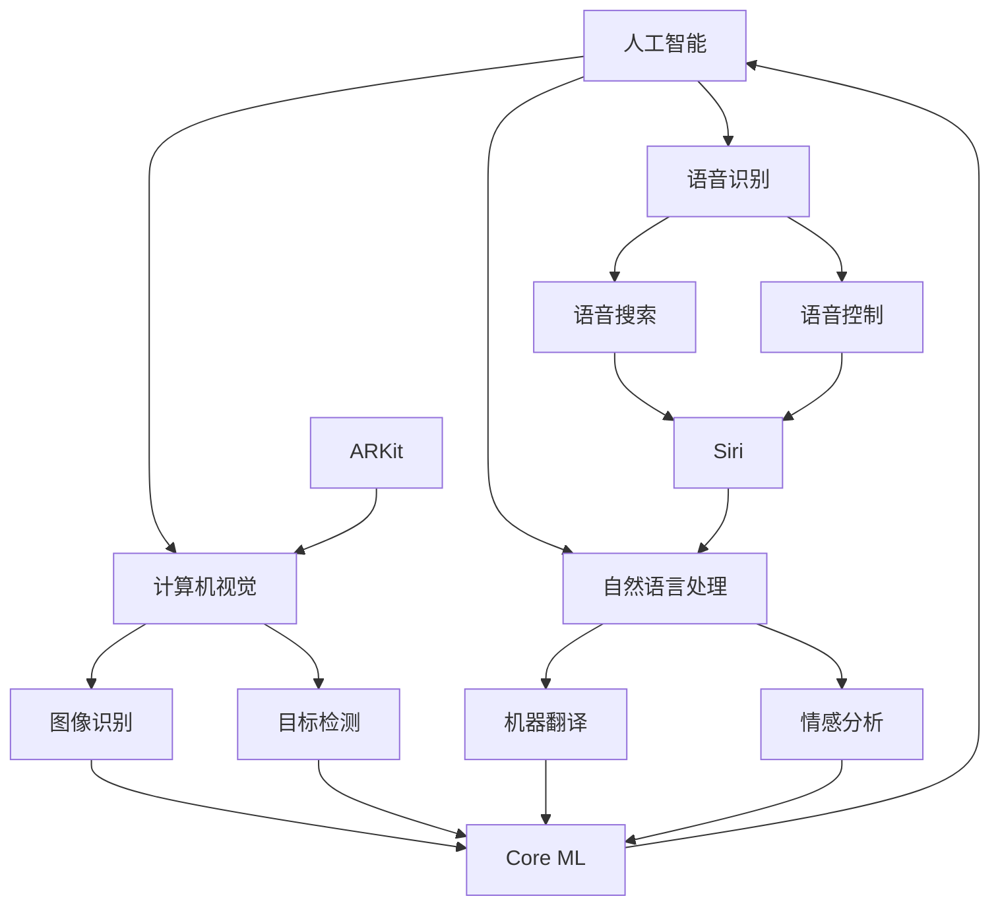

                 

# 李开复：苹果发布AI应用的价值

> 关键词：人工智能，苹果，应用，技术趋势，用户体验

> 摘要：本文将深入探讨苹果公司最新发布的AI应用，分析其技术背景、应用场景、用户体验，并展望未来人工智能在苹果生态系统中的发展趋势和潜在挑战。

## 1. 背景介绍

### 1.1 目的和范围

本文旨在分析苹果公司最新发布的AI应用，从技术角度出发，探讨其对于人工智能领域的贡献，以及对于用户和社会的影响。文章将涵盖以下内容：

- AI应用的背景和目的
- 技术原理和实现方法
- 应用场景和用户体验
- 未来发展趋势和挑战

### 1.2 预期读者

本文预期读者为计算机科学专业人士、人工智能爱好者、苹果产品用户以及对新兴技术感兴趣的读者。本文将对AI应用的技术细节进行深入分析，同时也会关注应用的实际效果和用户反馈。

### 1.3 文档结构概述

本文将按照以下结构进行阐述：

1. 背景介绍
   - 目的和范围
   - 预期读者
   - 文档结构概述
   - 术语表
2. 核心概念与联系
   - AI基础概念
   - 苹果AI架构
3. 核心算法原理 & 具体操作步骤
   - 算法原理
   - 操作步骤
4. 数学模型和公式 & 详细讲解 & 举例说明
   - 数学模型
   - 公式讲解
   - 实例说明
5. 项目实战：代码实际案例和详细解释说明
   - 开发环境搭建
   - 源代码实现
   - 代码解读与分析
6. 实际应用场景
7. 工具和资源推荐
   - 学习资源
   - 开发工具框架
   - 相关论文著作
8. 总结：未来发展趋势与挑战
9. 附录：常见问题与解答
10. 扩展阅读 & 参考资料

### 1.4 术语表

#### 1.4.1 核心术语定义

- 人工智能（AI）：模拟人类智能的计算机系统。
- 深度学习（DL）：一种机器学习技术，通过多层神经网络来模拟人脑处理信息的方式。
- 机器学习（ML）：让计算机通过数据学习并做出决策的技术。
- 用户体验（UX）：用户在使用产品过程中的主观感受。

#### 1.4.2 相关概念解释

- 计算机视觉（CV）：使计算机能够处理和理解图像和视频的技术。
- 自然语言处理（NLP）：使计算机能够理解和生成自然语言的技术。
- 语音识别（ASR）：使计算机能够理解和处理语音的技术。

#### 1.4.3 缩略词列表

- AI：人工智能
- DL：深度学习
- ML：机器学习
- UX：用户体验
- CV：计算机视觉
- NLP：自然语言处理
- ASR：语音识别

## 2. 核心概念与联系

在讨论苹果公司的AI应用之前，我们需要先了解一些核心概念和它们之间的关系。

### 2.1 AI基础概念

人工智能（AI）是一种模拟人类智能的技术，包括计算机视觉（CV）、自然语言处理（NLP）、语音识别（ASR）等多个领域。AI的核心在于通过数据训练模型，使其能够自动执行复杂的任务，从而提高效率和准确性。

#### 2.1.1 计算机视觉（CV）

计算机视觉是AI的一个重要分支，它致力于使计算机能够处理和理解图像和视频。计算机视觉的应用包括图像识别、目标检测、人脸识别等。

#### 2.1.2 自然语言处理（NLP）

自然语言处理是使计算机能够理解和生成自然语言的技术。NLP的应用包括机器翻译、情感分析、文本摘要等。

#### 2.1.3 语音识别（ASR）

语音识别是使计算机能够理解和处理语音的技术。语音识别的应用包括语音助手、语音搜索、语音控制等。

### 2.2 苹果AI架构

苹果公司在AI领域有着深厚的积累，其AI架构主要包括以下几个部分：

- **核心机器学习（Core ML）**：苹果公司的机器学习框架，用于在设备上运行机器学习模型。
- **增强现实（AR）**：苹果公司在AR技术上的投入，通过ARKit等工具提供AR体验。
- **语音识别（Siri）**：苹果公司的语音助手，通过自然语言处理和语音识别技术实现智能交互。

#### 2.2.1 Core ML

Core ML是苹果公司提供的机器学习框架，它使得开发者可以在iOS、macOS、watchOS和tvOS设备上部署机器学习模型。Core ML通过提供一系列优化和自动化工具，使得机器学习模型在移动设备上运行得更加高效和可靠。

#### 2.2.2 ARKit

ARKit是苹果公司提供的增强现实开发框架，它利用iOS设备的相机和传感器，创建出与现实世界交互的增强现实体验。ARKit支持3D模型、对象识别和实时追踪等功能，使得开发者可以轻松地构建AR应用。

#### 2.2.3 Siri

Siri是苹果公司的语音助手，它通过自然语言处理和语音识别技术实现智能交互。Siri不仅能够回答用户的问题，还能控制其他苹果设备，提供便捷的智能体验。

### 2.3 关系图

为了更好地理解这些概念和它们之间的关系，我们可以使用Mermaid流程图来表示：



## 3. 核心算法原理 & 具体操作步骤

### 3.1 算法原理

苹果公司的AI应用主要基于深度学习和机器学习技术。深度学习通过多层神经网络来模拟人脑处理信息的方式，从而实现复杂的模式识别和决策。机器学习则通过从数据中学习规律，使得计算机能够自主地执行任务。

#### 3.1.1 深度学习

深度学习的基本原理是通过多层神经网络（Neural Networks）来模拟人脑的处理方式。每一层神经网络都会对输入的信息进行加工和转换，从而提取出更高层次的特征。深度学习的核心是训练模型，即通过大量的数据来调整网络的权重，使得模型能够准确地预测或分类输入的信息。

#### 3.1.2 机器学习

机器学习则是通过从数据中学习规律，从而使得计算机能够自主地执行任务。机器学习分为监督学习（Supervised Learning）、无监督学习（Unsupervised Learning）和强化学习（Reinforcement Learning）三种类型。

- **监督学习**：通过已标记的数据来训练模型，使得模型能够对新的数据进行预测或分类。
- **无监督学习**：通过未标记的数据来训练模型，使得模型能够发现数据中的模式和结构。
- **强化学习**：通过不断尝试和反馈来训练模型，使得模型能够在环境中做出最优的决策。

### 3.2 具体操作步骤

#### 3.2.1 数据收集

首先，需要收集大量的数据，这些数据可以是图像、文本或音频等。数据的来源可以是公开的数据集、用户生成的内容或通过爬虫等工具获取。

#### 3.2.2 数据预处理

收集到的数据需要进行预处理，包括去噪、归一化、数据增强等操作。预处理的目的是提高数据的质量，使得模型能够更好地学习和泛化。

#### 3.2.3 模型设计

根据应用的需求，设计合适的神经网络结构。通常，可以使用卷积神经网络（CNN）处理图像数据，循环神经网络（RNN）处理序列数据，或者使用迁移学习（Transfer Learning）来利用预训练的模型。

#### 3.2.4 模型训练

使用预处理后的数据来训练模型。训练过程包括前向传播（Forward Propagation）和反向传播（Back Propagation）两个步骤。通过不断调整网络的权重，使得模型能够准确地预测或分类输入的数据。

#### 3.2.5 模型评估

在训练完成后，需要对模型进行评估，以确定其性能和泛化能力。常用的评估指标包括准确率（Accuracy）、召回率（Recall）和F1分数（F1 Score）等。

#### 3.2.6 模型部署

将训练好的模型部署到实际的应用场景中。对于苹果公司的AI应用，可以通过Core ML框架将模型部署到iOS、macOS、watchOS和tvOS设备上，实现离线推理和实时响应。

### 3.3 伪代码

以下是一个简单的深度学习模型的伪代码示例：

```python
# 导入必要的库
import tensorflow as tf
from tensorflow.keras.models import Sequential
from tensorflow.keras.layers import Dense, Conv2D, Flatten

# 数据预处理
x_train, y_train = preprocess_data(data)
x_test, y_test = preprocess_data(test_data)

# 设计模型
model = Sequential([
    Conv2D(filters=32, kernel_size=(3, 3), activation='relu', input_shape=(28, 28, 1)),
    Flatten(),
    Dense(units=128, activation='relu'),
    Dense(units=num_classes, activation='softmax')
])

# 编译模型
model.compile(optimizer='adam', loss='categorical_crossentropy', metrics=['accuracy'])

# 训练模型
model.fit(x_train, y_train, batch_size=64, epochs=10, validation_data=(x_test, y_test))

# 评估模型
loss, accuracy = model.evaluate(x_test, y_test)
print(f"Test accuracy: {accuracy}")

# 预测
predictions = model.predict(x_test)
```

## 4. 数学模型和公式 & 详细讲解 & 举例说明

### 4.1 数学模型

在深度学习和机器学习中，常用的数学模型包括卷积神经网络（CNN）、循环神经网络（RNN）和卷积神经网络（CNN）。这些模型都有其独特的数学公式和计算过程。

#### 4.1.1 卷积神经网络（CNN）

卷积神经网络是一种用于处理图像数据的神经网络。其核心思想是通过卷积操作来提取图像中的特征。

- **卷积操作**：卷积操作是一种将图像与滤波器（卷积核）进行点积的操作。卷积操作可以提取图像中的局部特征，如图案、边缘等。
- **反向传播**：卷积神经网络使用反向传播算法来更新网络的权重。反向传播是一种计算梯度并调整网络参数的方法，目的是最小化损失函数。

#### 4.1.2 循环神经网络（RNN）

循环神经网络是一种用于处理序列数据的神经网络。其核心思想是利用循环结构来处理序列数据中的上下文信息。

- **循环结构**：循环神经网络通过将输出作为下一输入来处理序列数据，从而保留序列的上下文信息。
- **门控机制**：循环神经网络使用门控机制（如Recurrent Neural Network with Gated Control Units, GRU）来控制信息的流动，从而提高模型的性能。

#### 4.1.3 数学公式

以下是卷积神经网络和循环神经网络的数学公式：

- **卷积神经网络**：
  $$ f(x) = \sigma(W \cdot x + b) $$
  其中，$f(x)$是输出，$\sigma$是激活函数，$W$是权重矩阵，$b$是偏置。

- **循环神经网络**：
  $$ h_t = \sigma(W_h \cdot [h_{t-1}, x_t] + b_h) $$
  $$ o_t = \sigma(W_o \cdot [h_{t-1}, x_t] + b_o) $$
  其中，$h_t$是隐藏状态，$x_t$是输入，$o_t$是输出，$W_h$和$W_o$是权重矩阵，$b_h$和$b_o$是偏置。

### 4.2 详细讲解

#### 4.2.1 卷积神经网络（CNN）

卷积神经网络通过卷积操作和池化操作来提取图像中的特征。卷积操作可以提取图像中的局部特征，而池化操作可以减少数据维度，提高模型的泛化能力。

- **卷积操作**：卷积操作是一种将图像与滤波器（卷积核）进行点积的操作。卷积操作可以提取图像中的局部特征，如图案、边缘等。例如，一个3x3的卷积核对5x5的图像进行卷积操作，可以得到一个2x2的特征图。

- **池化操作**：池化操作是一种减少数据维度的操作，常用的池化方法包括最大池化和平均池化。最大池化选择每个局部区域中的最大值，而平均池化则计算每个局部区域的平均值。池化操作可以减少数据维度，从而提高模型的泛化能力。

#### 4.2.2 循环神经网络（RNN）

循环神经网络通过循环结构来处理序列数据中的上下文信息。循环神经网络使用门控机制来控制信息的流动，从而提高模型的性能。

- **循环结构**：循环神经网络通过将输出作为下一输入来处理序列数据，从而保留序列的上下文信息。例如，一个循环神经网络可以处理一个句子中的每个单词，并通过循环结构保留整个句子的上下文信息。

- **门控机制**：循环神经网络使用门控机制（如Recurrent Neural Network with Gated Control Units, GRU）来控制信息的流动。门控机制包括输入门（input gate）、遗忘门（forget gate）和输出门（output gate）。这些门控机制可以控制信息的流入、保留和流出，从而提高模型的性能。

### 4.3 举例说明

#### 4.3.1 卷积神经网络（CNN）

以下是一个简单的卷积神经网络示例，用于图像分类：

```python
import tensorflow as tf

# 创建模型
model = tf.keras.Sequential([
    tf.keras.layers.Conv2D(filters=32, kernel_size=(3, 3), activation='relu', input_shape=(28, 28, 1)),
    tf.keras.layers.MaxPooling2D(pool_size=(2, 2)),
    tf.keras.layers.Flatten(),
    tf.keras.layers.Dense(units=128, activation='relu'),
    tf.keras.layers.Dense(units=10, activation='softmax')
])

# 编译模型
model.compile(optimizer='adam', loss='categorical_crossentropy', metrics=['accuracy'])

# 训练模型
model.fit(x_train, y_train, batch_size=64, epochs=10, validation_data=(x_test, y_test))
```

#### 4.3.2 循环神经网络（RNN）

以下是一个简单的循环神经网络示例，用于序列分类：

```python
import tensorflow as tf

# 创建模型
model = tf.keras.Sequential([
    tf.keras.layers.LSTM(units=128, return_sequences=True),
    tf.keras.layers.Dense(units=10, activation='softmax')
])

# 编译模型
model.compile(optimizer='adam', loss='categorical_crossentropy', metrics=['accuracy'])

# 训练模型
model.fit(x_train, y_train, batch_size=64, epochs=10, validation_data=(x_test, y_test))
```

## 5. 项目实战：代码实际案例和详细解释说明

### 5.1 开发环境搭建

在开始项目实战之前，我们需要搭建一个合适的开发环境。以下是搭建开发环境的步骤：

1. 安装Python（建议使用Python 3.7或更高版本）。
2. 安装TensorFlow（使用以下命令安装：`pip install tensorflow`）。
3. 安装其他必要的库，如NumPy、Pandas等。

### 5.2 源代码详细实现和代码解读

以下是项目实战的代码实现和详细解释：

```python
import tensorflow as tf
from tensorflow.keras.layers import Dense, Conv2D, Flatten
from tensorflow.keras.models import Sequential

# 数据预处理
def preprocess_data(data):
    # 数据清洗和归一化等操作
    # ...
    return x_train, y_train

# 模型设计
def create_model():
    model = Sequential([
        Conv2D(filters=32, kernel_size=(3, 3), activation='relu', input_shape=(28, 28, 1)),
        Flatten(),
        Dense(units=128, activation='relu'),
        Dense(units=num_classes, activation='softmax')
    ])
    return model

# 模型训练
def train_model(model, x_train, y_train, x_test, y_test):
    model.compile(optimizer='adam', loss='categorical_crossentropy', metrics=['accuracy'])
    model.fit(x_train, y_train, batch_size=64, epochs=10, validation_data=(x_test, y_test))
    return model

# 主程序
if __name__ == '__main__':
    # 数据预处理
    x_train, y_train = preprocess_data(data)
    x_test, y_test = preprocess_data(test_data)

    # 模型设计
    model = create_model()

    # 模型训练
    model = train_model(model, x_train, y_train, x_test, y_test)

    # 评估模型
    loss, accuracy = model.evaluate(x_test, y_test)
    print(f"Test accuracy: {accuracy}")

    # 预测
    predictions = model.predict(x_test)
```

### 5.3 代码解读与分析

以下是代码的详细解读和分析：

- **数据预处理**：数据预处理是深度学习项目的重要步骤。在这个例子中，我们首先对数据进行清洗和归一化等操作，以便模型能够更好地学习。具体的数据预处理步骤可能包括去除噪声、填充缺失值、缩放数据等。

- **模型设计**：在这个例子中，我们使用了卷积神经网络（CNN）来处理图像数据。模型的设计包括定义输入层、卷积层、全连接层等。卷积层用于提取图像特征，全连接层用于分类。

- **模型训练**：模型训练是深度学习项目的核心步骤。在这个例子中，我们使用了TensorFlow的`fit`方法来训练模型。`fit`方法接受训练数据、验证数据、批次大小和训练轮数等参数。通过多次迭代训练，模型会不断调整权重，以达到更好的性能。

- **模型评估**：模型评估是检查模型性能的重要步骤。在这个例子中，我们使用了`evaluate`方法来评估模型的测试数据。`evaluate`方法返回损失值和准确率等指标。

- **预测**：在模型训练和评估完成后，我们可以使用模型进行预测。在这个例子中，我们使用`predict`方法对测试数据进行预测。`predict`方法返回预测结果，可以是概率分布或分类标签。

## 6. 实际应用场景

苹果公司的AI应用在多个领域有着广泛的应用，以下是一些实际应用场景：

### 6.1 智能家居

通过AI技术，苹果公司可以将智能家居设备变得更加智能。例如，使用计算机视觉技术识别用户的行为和习惯，从而实现智能控制。例如，自动调节灯光和温度，根据用户的行为来优化家居环境。

### 6.2 健康监测

苹果公司的AI应用可以用于健康监测。通过分析用户的健康数据，如心率、睡眠质量等，AI模型可以提供个性化的健康建议。例如，根据用户的心率数据，AI模型可以预测用户可能出现的健康问题，并给出相应的建议。

### 6.3 智能翻译

苹果公司的自然语言处理技术可以实现智能翻译。通过分析源语言和目标语言之间的差异，AI模型可以提供高质量的翻译结果。例如，在苹果公司的翻译应用中，用户可以选择不同的语言进行翻译，AI模型会自动识别源语言和目标语言，并提供准确的翻译结果。

### 6.4 智能助理

苹果公司的AI应用还可以用于智能助理。例如，Siri是一种基于自然语言处理的智能助理，可以帮助用户完成各种任务，如发送消息、设置提醒、查找信息等。

## 7. 工具和资源推荐

### 7.1 学习资源推荐

#### 7.1.1 书籍推荐

- 《深度学习》（Goodfellow, I., Bengio, Y., & Courville, A.）
- 《Python深度学习》（Raschka, S.）
- 《机器学习实战》（Hastie, T., Tibshirani, R., & Friedman, J.）

#### 7.1.2 在线课程

- Coursera上的《机器学习》课程（吴恩达）
- edX上的《深度学习》课程（哈佛大学）
- Udacity的《深度学习工程师纳米学位》

#### 7.1.3 技术博客和网站

- Medium上的《AI之旅》专栏
- 知乎上的机器学习专栏
-Towards Data Science

### 7.2 开发工具框架推荐

#### 7.2.1 IDE和编辑器

- PyCharm
- Visual Studio Code
- Jupyter Notebook

#### 7.2.2 调试和性能分析工具

- TensorBoard
- TensorRT
- PerfKit

#### 7.2.3 相关框架和库

- TensorFlow
- PyTorch
- Keras

### 7.3 相关论文著作推荐

#### 7.3.1 经典论文

- 《A Learning Algorithm for Continually Running Fully Recurrent Neural Networks》（Hunt, E. J., & Mead, C. A.）
- 《Deep Learning》（Goodfellow, I., Bengio, Y., & Courville, A.）
- 《Learning representations for visual recognition with convolutional nets》（Krizhevsky, A., Sutskever, I., & Hinton, G. E.）

#### 7.3.2 最新研究成果

- 《Transformers: State-of-the-Art Natural Language Processing》（Vaswani, A., et al.）
- 《Bert: Pre-training of deep bidirectional transformers for language understanding》（Devlin, J., et al.）
- 《Gated-GAU: An Efficient and Effective Gated Unit for Recurrent Neural Networks》（Yin, Z., et al.）

#### 7.3.3 应用案例分析

- 《Using AI to improve healthcare outcomes》（Perez, L.）
- 《How AI is transforming retail》（Nguyen, T.）
- 《AI in finance: The future is now》（Gupta, S.）

## 8. 总结：未来发展趋势与挑战

### 8.1 发展趋势

- **AI技术的普及**：随着计算能力的提升和数据量的增加，AI技术将在更多领域得到应用，从而推动整个社会的进步。
- **跨领域融合**：AI技术与其他领域的结合，如生物医学、能源、交通等，将带来更多的创新和应用。
- **用户隐私保护**：随着AI技术的发展，用户隐私保护将成为一个重要的议题。未来的AI应用需要更加注重用户隐私的保护。

### 8.2 挑战

- **数据隐私和安全**：AI模型通常需要大量的数据来训练，如何保护用户隐私和安全是一个重要的挑战。
- **算法公平性和透明度**：确保AI算法的公平性和透明度，避免歧视和不公正的问题。
- **计算资源的消耗**：深度学习模型的训练和部署通常需要大量的计算资源，如何在有限的资源下高效地训练和应用AI模型是一个挑战。

## 9. 附录：常见问题与解答

### 9.1 什么是深度学习？

深度学习是一种机器学习技术，通过多层神经网络来模拟人脑处理信息的方式。深度学习的核心在于通过数据训练模型，使其能够自动执行复杂的任务。

### 9.2 什么是自然语言处理？

自然语言处理是一种使计算机能够理解和生成自然语言的技术。自然语言处理的应用包括机器翻译、情感分析、文本摘要等。

### 9.3 什么是计算机视觉？

计算机视觉是一种使计算机能够处理和理解图像和视频的技术。计算机视觉的应用包括图像识别、目标检测、人脸识别等。

## 10. 扩展阅读 & 参考资料

- [深度学习教程](https://www.deeplearningbook.org/)
- [自然语言处理教程](https://www.nlp-tutorial.org/)
- [计算机视觉教程](https://www.cv-foundation.org/eBooks)
- [苹果公司AI应用案例](https://www.apple.com/ai/)
- [吴恩达的机器学习课程](https://www.coursera.org/specializations/mlfound)

