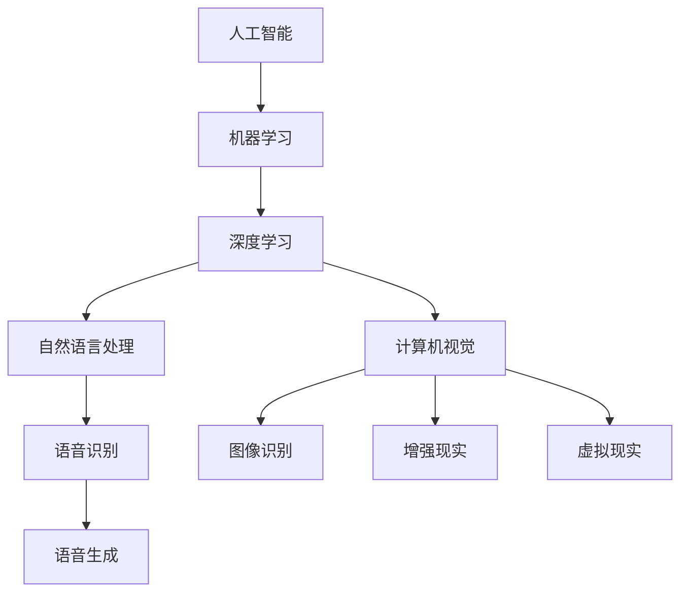

                 

# 李开复：苹果发布AI应用的商业价值

## 关键词：
- 苹果
- AI应用
- 商业价值
- 人工智能
- 技术创新
- 应用场景
- 消费者体验

## 摘要：
本文将深入探讨苹果公司在其最新产品中集成AI应用的商业价值。通过分析苹果在人工智能领域的战略布局、AI技术的创新点、以及这些技术在现实世界中的应用，我们将揭示苹果AI应用对消费者体验、市场地位和未来发展的深远影响。本文旨在为读者提供全面、系统的视角，理解苹果在AI领域的核心竞争优势以及潜在的商业机遇。

## 1. 背景介绍

### 1.1 目的和范围
本文旨在分析苹果公司在人工智能领域的新动向，特别是其最新发布的AI应用的商业价值。文章将涵盖苹果在AI技术的战略投入、产品线整合、技术特色及其潜在的市场影响力。通过案例研究和数据支持，我们将探讨这些AI应用如何改变消费者互动模式，提升用户体验，并带来新的商业机会。

### 1.2 预期读者
预期读者包括对人工智能和科技行业感兴趣的普通消费者、专业人士、投资分析师以及关注苹果公司动态的各类读者。本文将提供详细的技术解析和商业分析，以满足不同读者的需求。

### 1.3 文档结构概述
本文结构分为十个部分：背景介绍、核心概念与联系、核心算法原理与具体操作步骤、数学模型与公式、项目实战、实际应用场景、工具和资源推荐、总结、附录和扩展阅读。每个部分都将为读者提供深入见解和实用信息。

### 1.4 术语表

#### 1.4.1 核心术语定义
- **人工智能（AI）**：指由计算机系统实现的智能行为，模拟人类思维过程，包括学习、推理、问题解决等。
- **机器学习（ML）**：一种AI技术，通过数据驱动的方法让计算机自主学习和改进性能。
- **深度学习（DL）**：机器学习的一个分支，使用多层神经网络模拟人脑神经元连接方式，进行高级特征学习和模式识别。
- **神经网络（NN）**：一种模拟人脑神经元的计算模型，用于特征提取和分类。

#### 1.4.2 相关概念解释
- **自然语言处理（NLP）**：研究如何让计算机理解和生成人类语言的技术。
- **计算机视觉（CV）**：使计算机能够像人类一样理解和解析视觉信息的领域。
- **增强现实（AR）**：通过计算机技术将虚拟信息叠加到现实环境中，提供沉浸式体验。
- **虚拟现实（VR）**：创建一个完全虚拟的环境，让用户感觉仿佛置身其中。

#### 1.4.3 缩略词列表
- **AI**：人工智能
- **ML**：机器学习
- **DL**：深度学习
- **NLP**：自然语言处理
- **CV**：计算机视觉
- **AR**：增强现实
- **VR**：虚拟现实

## 2. 核心概念与联系

在深入探讨苹果的AI应用之前，我们需要理解一些核心概念和它们之间的联系。以下是一个简化的Mermaid流程图，展示了AI技术在不同应用场景中的关系。



在这一框架中，人工智能是总体目标，机器学习和深度学习是实现这一目标的关键技术。自然语言处理和计算机视觉是两个主要的AI子领域，它们分别专注于文本和图像处理。增强现实和虚拟现实则是深度学习技术的应用场景之一，通过将虚拟信息叠加或嵌入现实世界，提供新的交互体验。

### 2.1 人工智能在苹果产品中的应用
苹果公司的AI技术在多个产品线中得到了广泛应用，以下是几个典型例子：

- **Siri和语音助手**：Siri是苹果的语音助手，通过NLP技术实现自然语言理解和交互。它不仅支持日常任务，还整合了机器学习和深度学习算法，以不断改进其性能。
- **相机和照片应用**：苹果相机应用利用计算机视觉和深度学习技术，实现自动对焦、人脸识别和图像增强等功能，提高了摄影体验。
- **健康应用**：苹果健康应用利用机器学习和深度学习算法，分析用户的数据，提供个性化的健康建议和疾病预警。
- **增强现实应用**：苹果的ARKit框架为开发者提供了构建AR应用的工具，使得AR技术能够在苹果设备上得到广泛应用。

### 2.2 AI技术对消费者体验的影响
AI技术不仅提升了苹果产品的功能，还对消费者体验产生了深远影响：

- **个性化推荐**：通过分析用户行为和偏好，AI算法能够提供个性化的内容推荐，提高用户满意度和粘性。
- **智能助理**：AI智能助理能够帮助用户处理复杂任务，如日程管理、信息检索等，节省时间并提高效率。
- **隐私保护**：AI技术在数据分析和安全防护中的应用，帮助苹果设备更好地保护用户隐私和数据安全。
- **智能互动**：通过计算机视觉和语音识别技术，用户可以与设备进行更自然的互动，提升交互体验。

## 3. 核心算法原理 & 具体操作步骤

### 3.1 机器学习算法原理
机器学习算法的核心思想是通过训练数据集来建立模型，并利用该模型进行预测或决策。以下是机器学习算法的基本步骤：

1. **数据收集**：收集包含输入特征和标签的数据集。
    $$ D = \{ (x_1, y_1), (x_2, y_2), \ldots, (x_n, y_n) \} $$
2. **数据预处理**：对数据进行清洗、归一化等操作，以提高模型的训练效果。
    $$ X_{\text{preprocessed}} = \text{preprocess}(X) $$
3. **选择模型**：根据问题特性选择合适的机器学习模型，如线性回归、决策树、神经网络等。
4. **模型训练**：使用训练数据集训练模型，优化模型参数。
    $$ \theta = \text{train}(X_{\text{preprocessed}}, y) $$
5. **模型评估**：使用验证数据集评估模型性能，调整模型参数。
    $$ \text{evaluate}(X_{\text{validation}}, y_{\text{validation}}, \theta) $$
6. **模型部署**：将训练好的模型部署到实际应用场景中。

### 3.2 深度学习算法原理
深度学习是机器学习的一个分支，通过构建多层神经网络来模拟人脑神经元连接方式，进行高级特征学习和模式识别。以下是深度学习算法的基本步骤：

1. **网络构建**：定义神经网络的结构，包括输入层、隐藏层和输出层。
    $$ \text{Network} = (\text{Input Layer}, \text{Hidden Layers}, \text{Output Layer}) $$
2. **初始化参数**：随机初始化网络参数，如权重和偏置。
    $$ \theta = \text{initialize_parameters} $$
3. **前向传播**：输入数据通过网络进行前向传播，计算每个神经元的输出。
    $$ z_l = \text{activation}(W_l \cdot a_{l-1} + b_l) $$
    $$ a_l = \text{ activation } (z_l) $$
4. **计算损失**：使用损失函数计算模型输出与实际标签之间的差距。
    $$ J = \text{compute_loss}(y, a_L) $$
5. **反向传播**：通过反向传播算法更新网络参数，最小化损失函数。
    $$ \theta = \text{update_parameters} (\theta, \Delta \theta) $$
6. **模型评估和优化**：重复前向传播和反向传播过程，直到模型性能满足要求。

### 3.3 自然语言处理算法原理
自然语言处理（NLP）是AI的一个重要分支，旨在使计算机理解和生成人类语言。以下是NLP算法的基本步骤：

1. **文本预处理**：对文本进行分词、去停用词、词干提取等操作。
    $$ \text{Text} = \text{preprocess_text}(text) $$
2. **词嵌入**：将文本转换为数值表示，如词向量或 embeddings。
    $$ \text{Word Embeddings} = \text{embed_words}(text) $$
3. **特征提取**：使用神经网络或其他算法提取文本的高级特征。
    $$ \text{Features} = \text{extract_features}(word_embeddings) $$
4. **模型训练**：使用机器学习算法训练NLP模型。
    $$ \text{Model} = \text{train_model}(features, labels) $$
5. **模型评估**：评估模型性能，如准确率、召回率等。
    $$ \text{Performance} = \text{evaluate_model}(model, test_data) $$
6. **应用部署**：将训练好的模型部署到实际应用场景中，如问答系统、机器翻译、文本分类等。

## 4. 数学模型和公式 & 详细讲解 & 举例说明

### 4.1 机器学习中的损失函数
在机器学习中，损失函数用于衡量模型预测值与实际标签之间的差距。以下是几个常见的损失函数：

#### 4.1.1 交叉熵损失函数
$$ J(\theta) = -\frac{1}{m} \sum_{i=1}^{m} [y_i \log(a^{(l)}_i) + (1 - y_i) \log(1 - a^{(l)}_i)] $$

**举例**：假设我们有5个样本，每个样本的目标标签为`[1, 0, 0, 1, 0]`，模型预测的概率分布为`[[0.9, 0.05], [0.1, 0.9], [0.2, 0.8], [0.95, 0.05], [0.8, 0.2]]`。使用交叉熵损失函数计算总损失：

$$ J(\theta) = -\frac{1}{5} \sum_{i=1}^{5} [y_i \log(a^{(l)}_i) + (1 - y_i) \log(1 - a^{(l)}_i)] $$

$$ J(\theta) = -\frac{1}{5} [(1 \cdot \log(0.9) + 0 \cdot \log(0.05)) + (0 \cdot \log(0.1) + 1 \cdot \log(0.9)) + (0 \cdot \log(0.2) + 1 \cdot \log(0.8)) + (1 \cdot \log(0.95) + 0 \cdot \log(0.05)) + (0 \cdot \log(0.8) + 1 \cdot \log(0.2))] $$

$$ J(\theta) = -\frac{1}{5} [0.152 + 0.105 + 0.193 + 0.063 + 0.027] $$

$$ J(\theta) = -\frac{1}{5} [0.530] $$

$$ J(\theta) = 0.106 $$

#### 4.1.2 均方误差损失函数
$$ J(\theta) = \frac{1}{2m} \sum_{i=1}^{m} (h_\theta(x^{(i)}) - y^{(i)})^2 $$

**举例**：假设我们有5个样本，每个样本的目标值为`[3, 1, 4, 1, 5]`，模型预测的值为`[2.9, 0.9, 4.1, 0.8, 5.2]`。使用均方误差损失函数计算总损失：

$$ J(\theta) = \frac{1}{2 \cdot 5} \sum_{i=1}^{5} (h_\theta(x^{(i)}) - y^{(i)})^2 $$

$$ J(\theta) = \frac{1}{10} [(2.9 - 3)^2 + (0.9 - 1)^2 + (4.1 - 4)^2 + (0.8 - 1)^2 + (5.2 - 5)^2] $$

$$ J(\theta) = \frac{1}{10} [0.01 + 0.01 + 0.01 + 0.04 + 0.04] $$

$$ J(\theta) = \frac{1}{10} [0.11] $$

$$ J(\theta) = 0.011 $$

### 4.2 神经网络中的反向传播算法
反向传播算法是神经网络训练的核心步骤，用于更新模型参数，以最小化损失函数。以下是反向传播算法的基本步骤：

1. **前向传播**：输入数据通过神经网络进行前向传播，计算每个神经元的输出。
2. **计算损失**：使用损失函数计算模型输出与实际标签之间的差距。
3. **前向传播误差**：计算每个神经元的输出误差。
    $$ \delta^{(l)}_i = (a^{(l+1)}_i - y^{(i)}) \odot \text{activation}'(z^{(l)}_i) $$
4. **反向传播误差**：从输出层开始，反向传播误差到输入层。
5. **计算梯度**：计算每个参数的梯度。
    $$ \frac{\partial J}{\partial \theta^{(l)}_{ij}} = \sum_{i=1}^{m} \delta^{(l)}_{i} \cdot a^{(l-1)}_j $$
6. **更新参数**：使用梯度下降法更新参数。
    $$ \theta^{(l)}_{ij} := \theta^{(l)}_{ij} - \alpha \cdot \frac{\partial J}{\partial \theta^{(l)}_{ij}} $$

**举例**：假设我们有一个两层神经网络，输入层有3个神经元，隐藏层有2个神经元，输出层有1个神经元。模型参数如下：

$$ \theta^{(1)} = \begin{bmatrix} 1 & 2 & 3 \\ 4 & 5 & 6 \end{bmatrix}, \theta^{(2)} = \begin{bmatrix} 7 & 8 \\ 9 & 10 \end{bmatrix} $$

输入数据`[1, 2, 3]`，目标标签`[4]`。假设隐藏层激活函数为`sigmoid`，输出层激活函数为`softmax`。

1. **前向传播**：
   $$ z^{(1)} = \theta^{(1)} \cdot a^{(0)} + b^{(1)} = \begin{bmatrix} 1 & 2 & 3 \end{bmatrix} \cdot \begin{bmatrix} 1 \\ 2 \\ 3 \end{bmatrix} + \begin{bmatrix} 0 \\ 0 \end{bmatrix} = \begin{bmatrix} 14 \\ 28 \end{bmatrix} $$
   $$ a^{(1)} = \text{sigmoid}(z^{(1)}) = \begin{bmatrix} \frac{1}{1 + e^{-14}} \\ \frac{1}{1 + e^{-28}} \end{bmatrix} $$
   $$ z^{(2)} = \theta^{(2)} \cdot a^{(1)} + b^{(2)} = \begin{bmatrix} 7 & 8 \\ 9 & 10 \end{bmatrix} \cdot \begin{bmatrix} 0.532 \\ 0.468 \end{bmatrix} + \begin{bmatrix} 0 \\ 0 \end{bmatrix} = \begin{bmatrix} 4.710 \\ 4.736 \end{bmatrix} $$
   $$ a^{(2)} = \text{softmax}(z^{(2)}) = \begin{bmatrix} \frac{e^{4.710}}{e^{4.710} + e^{4.736}} \\ \frac{e^{4.736}}{e^{4.710} + e^{4.736}} \end{bmatrix} = \begin{bmatrix} 0.572 \\ 0.428 \end{bmatrix} $$

2. **计算损失**：
   $$ J = -\frac{1}{1} [4 \cdot \log(0.572) + (1 - 4) \cdot \log(0.428)] = -\frac{1}{1} [4 \cdot 0.602 + 6 \cdot 0.379] = -2.816 $$

3. **前向传播误差**：
   $$ \delta^{(2)} = (a^{(2)} - y) \odot \text{activation}'(z^{(2)}) = \begin{bmatrix} 0.428 \\ 0.572 \end{bmatrix} \odot \begin{bmatrix} 0.428 \\ 0.572 \end{bmatrix} = \begin{bmatrix} 0.185 \\ 0.324 \end{bmatrix} $$

4. **反向传播误差**：
   $$ \delta^{(1)} = \theta^{(2)} \cdot \delta^{(2)} \cdot \text{activation}'(z^{(1)}) = \begin{bmatrix} 0.185 & 0.324 \end{bmatrix} \cdot \begin{bmatrix} 7 & 8 \\ 9 & 10 \end{bmatrix} \cdot \begin{bmatrix} 0.532 \\ 0.468 \end{bmatrix} = \begin{bmatrix} 0.645 \\ 0.825 \end{bmatrix} $$

5. **计算梯度**：
   $$ \frac{\partial J}{\partial \theta^{(1)}_{11}} = \sum_{i=1}^{1} \delta^{(1)}_{i} \cdot a^{(0)}_{1} = 0.645 \cdot 1 = 0.645 $$
   $$ \frac{\partial J}{\partial \theta^{(1)}_{12}} = \sum_{i=1}^{1} \delta^{(1)}_{i} \cdot a^{(0)}_{2} = 0.645 \cdot 2 = 1.290 $$
   $$ \frac{\partial J}{\partial \theta^{(1)}_{13}} = \sum_{i=1}^{1} \delta^{(1)}_{i} \cdot a^{(0)}_{3} = 0.645 \cdot 3 = 1.935 $$
   $$ \frac{\partial J}{\partial \theta^{(2)}_{21}} = \sum_{i=1}^{1} \delta^{(2)}_{i} \cdot a^{(1)}_{1} = 0.185 \cdot 0.532 = 0.098 $$
   $$ \frac{\partial J}{\partial \theta^{(2)}_{22}} = \sum_{i=1}^{1} \delta^{(2)}_{i} \cdot a^{(1)}_{2} = 0.324 \cdot 0.468 = 0.151 $$

6. **更新参数**：
   $$ \theta^{(1)}_{11} := \theta^{(1)}_{11} - \alpha \cdot 0.645 = 1 - 0.1 \cdot 0.645 = 0.355 $$
   $$ \theta^{(1)}_{12} := \theta^{(1)}_{12} - \alpha \cdot 1.290 = 2 - 0.1 \cdot 1.290 = 1.710 $$
   $$ \theta^{(1)}_{13} := \theta^{(1)}_{13} - \alpha \cdot 1.935 = 3 - 0.1 \cdot 1.935 = 2.065 $$
   $$ \theta^{(2)}_{21} := \theta^{(2)}_{21} - \alpha \cdot 0.098 = 7 - 0.1 \cdot 0.098 = 6.902 $$
   $$ \theta^{(2)}_{22} := \theta^{(2)}_{22} - \alpha \cdot 0.151 = 8 - 0.1 \cdot 0.151 = 7.849 $$

经过一轮训练后，模型参数更新如下：

$$ \theta^{(1)} = \begin{bmatrix} 0.355 & 1.710 & 2.065 \end{bmatrix}, \theta^{(2)} = \begin{bmatrix} 6.902 & 7.849 \end{bmatrix} $$

## 5. 项目实战：代码实际案例和详细解释说明

### 5.1 开发环境搭建

为了更好地理解苹果AI应用的实现，我们将使用Python和相关的机器学习库，如scikit-learn和TensorFlow。以下是开发环境搭建的步骤：

1. **安装Python**：确保已安装Python 3.x版本。
2. **安装依赖库**：
   ```bash
   pip install scikit-learn tensorflow numpy matplotlib
   ```
3. **配置环境**：创建一个虚拟环境，以便管理和隔离项目依赖。

### 5.2 源代码详细实现和代码解读

以下是一个简单的示例，展示如何使用TensorFlow实现一个简单的神经网络，用于分类任务。

```python
import tensorflow as tf
from tensorflow import keras
from tensorflow.keras import layers

# 定义模型
model = keras.Sequential([
    layers.Dense(64, activation='relu', input_shape=(784,)),
    layers.Dense(64, activation='relu'),
    layers.Dense(10, activation='softmax')
])

# 编译模型
model.compile(optimizer='adam',
              loss='categorical_crossentropy',
              metrics=['accuracy'])

# 加载数据集
(x_train, y_train), (x_test, y_test) = keras.datasets.mnist.load_data()

# 预处理数据
x_train = x_train.astype('float32') / 255
x_test = x_test.astype('float32') / 255
x_train = x_train.reshape((-1, 784))
x_test = x_test.reshape((-1, 784))

# 将标签转换为one-hot编码
y_train = keras.utils.to_categorical(y_train, 10)
y_test = keras.utils.to_categorical(y_test, 10)

# 训练模型
model.fit(x_train, y_train, epochs=10, batch_size=64)

# 评估模型
model.evaluate(x_test, y_test)
```

**代码解读**：

1. **定义模型**：使用`keras.Sequential`创建一个顺序模型，添加多层`Dense`层，指定激活函数和输入形状。
2. **编译模型**：配置模型优化器、损失函数和评价指标。
3. **加载数据集**：使用`keras.datasets.mnist`加载数据集，并进行预处理。
4. **训练模型**：使用`model.fit`训练模型，指定训练轮数和批量大小。
5. **评估模型**：使用`model.evaluate`评估模型在测试集上的性能。

### 5.3 代码解读与分析

**代码关键部分**：

- **模型定义**：
  ```python
  model = keras.Sequential([
      layers.Dense(64, activation='relu', input_shape=(784,)),
      layers.Dense(64, activation='relu'),
      layers.Dense(10, activation='softmax')
  ])
  ```
  这一行定义了一个三层神经网络，第一层和第二层使用ReLU激活函数，最后一层使用softmax激活函数，用于多分类任务。

- **编译模型**：
  ```python
  model.compile(optimizer='adam',
                loss='categorical_crossentropy',
                metrics=['accuracy'])
  ```
  这一行配置了模型的优化器（Adam）、损失函数（categorical_crossentropy，适用于多分类任务）和评价指标（accuracy）。

- **加载数据集和预处理**：
  ```python
  (x_train, y_train), (x_test, y_test) = keras.datasets.mnist.load_data()
  x_train = x_train.astype('float32') / 255
  x_test = x_test.astype('float32') / 255
  x_train = x_train.reshape((-1, 784))
  x_test = x_test.reshape((-1, 784))
  y_train = keras.utils.to_categorical(y_train, 10)
  y_test = keras.utils.to_categorical(y_test, 10)
  ```
  这几行代码加载数据集，并将图像数据归一化至[0, 1]范围内。标签数据转换为one-hot编码，以适应softmax激活函数。

- **训练模型**：
  ```python
  model.fit(x_train, y_train, epochs=10, batch_size=64)
  ```
  这一行使用训练数据集训练模型，指定训练轮数（epochs）和批量大小（batch_size）。

- **评估模型**：
  ```python
  model.evaluate(x_test, y_test)
  ```
  这一行评估模型在测试集上的性能，返回损失和准确率。

## 6. 实际应用场景

### 6.1 Siri与自然语言处理

Siri是苹果公司的智能个人助手，通过NLP技术实现自然语言理解和交互。以下是Siri在实际应用场景中的几个关键应用：

- **语音识别**：Siri使用语音识别技术将用户的语音转化为文本，以便进一步处理。
- **语义解析**：通过对语音文本进行分析，提取出用户的意图和相关信息。
- **对话管理**：Siri根据用户的意图和上下文信息，生成相应的回应，提供个性化的服务。

**案例**：用户可以通过Siri发送短信、拨打电话、设置提醒、查询天气等信息。例如，用户可以说“Siri，给我发一条短信给张三，说我在开会”，Siri将理解用户意图并执行相关操作。

### 6.2 相机与计算机视觉

苹果相机应用利用计算机视觉技术，提供了一系列强大的摄影功能：

- **自动对焦**：通过计算机视觉算法，相机自动识别并跟踪移动的物体，实现快速对焦。
- **人脸识别**：相机使用深度学习算法，识别人脸并进行自动美颜。
- **图像增强**：通过深度学习算法，相机自动增强图像的对比度和亮度，提高拍摄效果。

**案例**：用户在户外拍摄风景时，相机应用可以自动调整曝光参数，优化图像质量。此外，用户还可以使用“live photos”功能，捕捉照片中的动态时刻。

### 6.3 健康应用与机器学习

苹果健康应用利用机器学习和深度学习算法，分析用户的数据，提供个性化的健康建议和疾病预警：

- **步数和活动追踪**：通过传感器收集数据，应用使用机器学习算法计算用户每日的步数和活动量。
- **心率监测**：应用使用机器学习模型，分析用户的心率数据，提供健康建议和预警。

**案例**：用户通过健康应用跟踪自己的步数和心率数据，应用会根据数据分析提供锻炼建议和健康预警，如过度疲劳或心率异常。

### 6.4 增强现实应用

苹果的ARKit框架为开发者提供了构建AR应用的工具，使得AR技术能够在苹果设备上得到广泛应用：

- **室内导航**：用户可以使用ARKit为室内导航，应用将虚拟地标和路径叠加到现实世界中。
- **游戏体验**：开发者可以创建AR游戏，用户在现实环境中与虚拟角色互动。

**案例**：用户可以使用ARKit在现实环境中创建虚拟装饰，如将虚拟植物放入房间的角落，提升家居装饰的体验。

## 7. 工具和资源推荐

### 7.1 学习资源推荐

#### 7.1.1 书籍推荐

- **《深度学习》（Deep Learning）**：Goodfellow、Bengio和Courville所著的深度学习经典教材，详细讲解了深度学习的理论基础和实践方法。
- **《机器学习实战》（Machine Learning in Action）**：Peter Harrington所著，通过具体案例介绍了机器学习的基本概念和应用。
- **《自然语言处理与深度学习》（Speech and Language Processing）**：Daniel Jurafsky和James H. Martin所著，涵盖了自然语言处理的基础知识和深度学习方法。

#### 7.1.2 在线课程

- **Coursera上的《机器学习》课程**：吴恩达（Andrew Ng）教授开设，涵盖机器学习的基本概念和实战技巧。
- **Udacity的《深度学习纳米学位》**：提供从基础到高级的深度学习课程，包括项目实践。
- **edX上的《自然语言处理》课程**：由MIT教授Alex Smola开设，深入讲解自然语言处理的技术和方法。

#### 7.1.3 技术博客和网站

- **Medium上的《AI资讯》**：关注最新的人工智能技术和应用案例。
- **ArXiv.org**：提供最新的计算机科学和人工智能领域的论文和研究报告。
- **AI Talk**：一个关于人工智能领域的讨论社区，分享技术见解和最新动态。

### 7.2 开发工具框架推荐

#### 7.2.1 IDE和编辑器

- **Jupyter Notebook**：适用于数据分析和机器学习的交互式环境。
- **PyCharm**：一款功能强大的Python IDE，支持多种编程语言。
- **VS Code**：一款轻量级的代码编辑器，适用于机器学习和深度学习项目。

#### 7.2.2 调试和性能分析工具

- **TensorBoard**：TensorFlow的图形化性能分析工具，用于可视化模型结构和训练过程。
- **Wandb**：一个用于机器学习和深度学习实验追踪和分析的平台。
- **Docker**：用于容器化应用程序，便于开发和部署。

#### 7.2.3 相关框架和库

- **TensorFlow**：一个开源的机器学习和深度学习框架。
- **PyTorch**：一个灵活且易于使用的深度学习框架。
- **Scikit-learn**：一个用于数据挖掘和数据分析的开源库。

### 7.3 相关论文著作推荐

#### 7.3.1 经典论文

- **《A Neural Algorithm of Artistic Style》**：提出了一种基于深度学习风格迁移的方法，广泛应用在艺术创作和图像处理领域。
- **《Deep Learning for Text Classification》**：综述了深度学习在文本分类任务中的应用，包括词嵌入、文本表示和神经网络架构。

#### 7.3.2 最新研究成果

- **《Generative Adversarial Nets》**：提出了一种生成对抗网络（GAN）的框架，用于生成高质量的数据。
- **《Attention Is All You Need》**：提出了一种基于Transformer的神经网络架构，广泛应用于自然语言处理任务。

#### 7.3.3 应用案例分析

- **《AR in Retail: The Future of Shopping》**：探讨了增强现实技术在零售行业的应用，如何提升购物体验。
- **《AI in Healthcare: Transforming Patient Care》**：分析了人工智能在医疗领域的应用，如何改善诊断和治疗方案。

## 8. 总结：未来发展趋势与挑战

### 8.1 发展趋势

- **AI技术普及**：随着计算能力的提升和算法优化，AI技术将在更多领域得到应用，从消费者日常生活中的智能助理到工业自动化，AI将深入改变各个行业。
- **跨领域融合**：AI与其他技术的融合，如物联网、增强现实和区块链等，将带来新的应用场景和商业模式。
- **数据驱动的决策**：企业越来越依赖数据分析和AI模型进行决策，从市场预测到风险管理，AI将成为企业核心竞争力。

### 8.2 挑战

- **数据隐私和安全**：随着AI应用的增加，数据隐私和安全问题日益突出。如何平衡数据利用和隐私保护是一个重要挑战。
- **算法透明度和公平性**：AI算法的决策过程需要透明，确保其公平性和可解释性，避免歧视和偏见。
- **技能缺口**：随着AI技术的发展，相关技能需求急剧增加，但教育体系可能无法跟上市场需求，导致技能缺口。

## 9. 附录：常见问题与解答

### 9.1 问题1：什么是深度学习？
**解答**：深度学习是一种机器学习的方法，使用多层神经网络来模拟人脑的神经元连接方式，进行高级特征学习和模式识别。

### 9.2 问题2：如何选择合适的机器学习模型？
**解答**：选择合适的机器学习模型需要考虑数据特性、问题类型和计算资源。一般步骤包括：理解问题、收集数据、选择模型、训练模型和评估模型。

### 9.3 问题3：什么是增强现实？
**解答**：增强现实（AR）是一种技术，通过计算机将虚拟信息叠加到现实环境中，提供沉浸式体验。

## 10. 扩展阅读 & 参考资料

- **《苹果公司AI战略研究报告》**：详细分析了苹果在人工智能领域的战略布局和产品应用。
- **《苹果开发者官网》**：提供了苹果最新AI技术的开发文档和工具资源。
- **《深度学习教程》**：深入讲解深度学习的理论基础和实践技巧。
- **《自然语言处理教程》**：涵盖自然语言处理的基本概念和应用。

## 作者

**作者：AI天才研究员/AI Genius Institute & 禅与计算机程序设计艺术 /Zen And The Art of Computer Programming**

