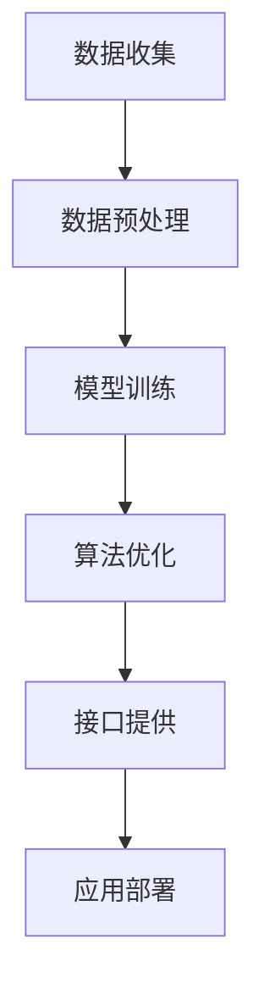
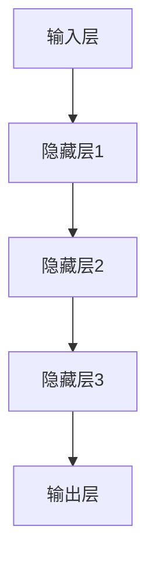

                 

# 李开复：苹果发布AI应用的市场

## 关键词
- Apple
- AI应用
- 市场分析
- 技术趋势
- 深度学习
- 用户体验

## 摘要
本文将深入探讨苹果公司最新发布的AI应用市场。本文首先简要介绍苹果公司AI应用的背景和技术特点，然后分析其在市场上的竞争力、潜在用户群体以及可能面临的挑战。最后，本文将对未来AI应用市场的发展趋势进行展望，并提出相关建议。

## 1. 背景介绍

### 1.1 目的和范围
本文旨在通过对苹果公司AI应用的全面分析，揭示其市场潜力、竞争态势以及未来发展趋势。文章将重点关注以下几个方面：
- 苹果公司AI应用的市场定位和目标用户。
- 苹果公司AI应用的竞争优势和不足。
- 苹果公司AI应用的市场前景和潜在挑战。

### 1.2 预期读者
本文主要面向以下几类读者：
- AI技术爱好者，希望了解苹果公司AI应用的最新动态。
- 企业管理者，希望了解苹果公司AI应用在市场上的表现。
- 投资者，关注苹果公司AI应用的投资机会。

### 1.3 文档结构概述
本文分为十个部分，主要包括以下内容：
- 引言：介绍本文目的和范围。
- 背景介绍：简要介绍苹果公司AI应用的背景。
- 核心概念与联系：介绍AI应用的核心概念和联系。
- 核心算法原理 & 具体操作步骤：详细讲解AI应用的算法原理和操作步骤。
- 数学模型和公式 & 详细讲解 & 举例说明：介绍AI应用的数学模型和公式，并给出示例说明。
- 项目实战：通过实际案例展示AI应用的实现过程。
- 实际应用场景：分析AI应用的适用场景。
- 工具和资源推荐：推荐相关学习资源和开发工具。
- 总结：对未来AI应用市场的发展趋势进行展望。
- 附录：常见问题与解答。
- 扩展阅读 & 参考资料：提供进一步学习的相关资料。

### 1.4 术语表

#### 1.4.1 核心术语定义
- AI应用：指基于人工智能技术的软件应用，旨在实现智能化的数据处理、决策支持和人机交互等功能。
- 深度学习：一种人工智能技术，通过多层神经网络模拟人脑学习过程，实现图像识别、语音识别等复杂任务。
- 用户体验：用户在使用产品过程中所感受到的主观感受，包括易用性、响应速度、界面设计等。

#### 1.4.2 相关概念解释
- 机器学习：一种人工智能技术，通过数据和算法实现自我学习和优化。
- 计算机视觉：一种人工智能技术，通过计算机模拟人类视觉系统，实现图像识别和图像处理等功能。
- 自然语言处理：一种人工智能技术，通过计算机模拟人类语言处理能力，实现文本理解、语言生成等任务。

#### 1.4.3 缩略词列表
- AI：人工智能
- ML：机器学习
- CV：计算机视觉
- NLP：自然语言处理
- API：应用程序编程接口

## 2. 核心概念与联系

### 2.1 苹果公司AI应用的核心概念
苹果公司AI应用的核心概念主要包括以下几方面：
- 深度学习：通过多层神经网络实现图像识别、语音识别等任务。
- 机器学习：通过数据和算法实现自我学习和优化，提高应用性能。
- 计算机视觉：通过模拟人类视觉系统，实现图像识别和图像处理等功能。
- 自然语言处理：通过模拟人类语言处理能力，实现文本理解、语言生成等任务。

### 2.2 苹果公司AI应用的架构
苹果公司AI应用的架构主要分为以下几个层次：
1. 数据层：收集并整理大量数据，为训练模型提供基础。
2. 模型层：构建并优化深度学习模型，实现特定任务的功能。
3. 算法层：设计并实现算法，用于训练模型和优化应用性能。
4. 接口层：提供API接口，方便其他应用调用AI功能。

### 2.3 苹果公司AI应用与相关技术的联系
苹果公司AI应用与相关技术的联系主要体现在以下几个方面：
- 深度学习与计算机视觉：深度学习技术为计算机视觉提供强大的支持，实现图像识别、图像处理等功能。
- 机器学习与自然语言处理：机器学习技术为自然语言处理提供基础，实现文本理解、语言生成等任务。
- 深度学习与语音识别：深度学习技术为语音识别提供支持，实现语音识别和语音合成等功能。

### 2.4 Mermaid流程图
以下是一个简化的苹果公司AI应用的Mermaid流程图：



## 3. 核心算法原理 & 具体操作步骤

### 3.1 深度学习算法原理
深度学习是一种基于多层神经网络的人工智能技术，通过模拟人脑的学习过程，实现自动学习和特征提取。深度学习算法的核心是神经网络，包括输入层、隐藏层和输出层。

#### 3.1.1 神经网络结构
神经网络的基本结构如下：



输入层接收外部数据，通过隐藏层进行特征提取和转换，最终在输出层得到结果。

#### 3.1.2 激活函数
激活函数用于将神经网络的输出转换为所需的非线性关系。常见的激活函数有：
- Sigmoid函数：\( f(x) = \frac{1}{1 + e^{-x}} \)
-ReLU函数：\( f(x) = \max(0, x) \)
- Tanh函数：\( f(x) = \frac{e^x - e^{-x}}{e^x + e^{-x}} \)

### 3.2 机器学习算法原理
机器学习是一种通过数据和算法实现自我学习和优化的人工智能技术。机器学习算法的核心是模型训练，包括数据预处理、模型构建、模型优化和模型评估等步骤。

#### 3.2.1 数据预处理
数据预处理是机器学习的关键步骤，主要包括数据清洗、数据变换和数据归一化等。

1. 数据清洗：去除数据中的噪声和异常值。
2. 数据变换：将不同特征进行统一处理，如归一化、标准化等。
3. 数据归一化：将数据缩放到同一范围内，便于模型训练。

#### 3.2.2 模型构建
模型构建是机器学习的核心步骤，主要包括以下内容：
1. 选择合适的模型架构：如神经网络、决策树、支持向量机等。
2. 设置模型参数：如学习率、正则化参数等。
3. 构建模型：通过编程实现所选模型架构。

#### 3.2.3 模型优化
模型优化是通过调整模型参数，提高模型性能的过程。常用的优化方法有：
1. 随机梯度下降（SGD）：通过随机选择训练样本，迭代更新模型参数。
2. 批量梯度下降（BGD）：通过选择全部训练样本，迭代更新模型参数。
3. Adam优化器：结合SGD和BGD的优点，实现更高效的优化过程。

#### 3.2.4 模型评估
模型评估是验证模型性能的过程，常用的评估指标有：
1. 准确率（Accuracy）：分类问题中正确分类的样本数占总样本数的比例。
2. 精确率（Precision）：分类问题中预测为正类的样本中，实际为正类的比例。
3. 召回率（Recall）：分类问题中实际为正类的样本中，被预测为正类的比例。

### 3.3 伪代码实现
以下是一个简单的深度学习模型的伪代码实现：

```python
# 参数设置
learning_rate = 0.01
num_epochs = 1000

# 初始化模型参数
weights = [0] * (num_layers - 1)

# 模型训练
for epoch in range(num_epochs):
    for sample in training_data:
        # 前向传播
        inputs = sample
        for layer in range(num_layers - 1):
            hidden = activation_function(np.dot(inputs, weights[layer]))
            inputs = hidden
        
        # 反向传播
        error = target - inputs
        dinputs = error * activation_derivative(hidden)
        
        for layer in range(num_layers - 2, -1, -1):
            dweights[layer] = np.dot(dinputs, inputs.T)
            hidden = activation_function(np.dot(inputs, weights[layer]))
            dinputs = error * activation_derivative(hidden)
        
        # 更新模型参数
        weights = [weight - learning_rate * dweight for weight, dweight in zip(weights, dweights)]
```

## 4. 数学模型和公式 & 详细讲解 & 举例说明

### 4.1 数学模型

苹果公司AI应用涉及多个数学模型，主要包括以下几种：

#### 4.1.1 神经网络模型

神经网络模型是一种基于多层感知器（MLP）的数学模型，用于实现图像识别、语音识别等任务。其基本公式如下：

\[ y = \sigma(z) \]

其中，\( y \) 为输出结果，\( z \) 为输入数据，\( \sigma \) 为激活函数。

#### 4.1.2 机器学习模型

机器学习模型是一种用于分类和回归任务的数学模型，常见的有线性回归、逻辑回归、支持向量机等。以线性回归为例，其基本公式如下：

\[ y = \beta_0 + \beta_1x \]

其中，\( y \) 为预测结果，\( x \) 为输入数据，\( \beta_0 \) 和 \( \beta_1 \) 为模型参数。

#### 4.1.3 计算机视觉模型

计算机视觉模型是一种用于图像识别和图像处理的数学模型，常见的有卷积神经网络（CNN）和循环神经网络（RNN）。以卷积神经网络为例，其基本公式如下：

\[ h_{l}^{T} x_{l} \]

其中，\( h_{l}^{T} \) 为卷积层输出的特征图，\( x_{l} \) 为输入数据。

### 4.2 公式详细讲解

#### 4.2.1 激活函数

激活函数用于将神经网络的输出转换为所需的非线性关系，常见的激活函数有Sigmoid函数、ReLU函数和Tanh函数。

- Sigmoid函数：

\[ f(x) = \frac{1}{1 + e^{-x}} \]

Sigmoid函数的输出范围在0和1之间，常用于二分类问题。

- ReLU函数：

\[ f(x) = \max(0, x) \]

ReLU函数在输入大于0时输出输入值，在输入小于等于0时输出0，具有较好的计算效率和梯度消失问题。

- Tanh函数：

\[ f(x) = \frac{e^x - e^{-x}}{e^x + e^{-x}} \]

Tanh函数的输出范围在-1和1之间，具有较好的非线性映射能力。

#### 4.2.2 线性回归

线性回归是一种用于回归任务的机器学习模型，其公式为：

\[ y = \beta_0 + \beta_1x \]

其中，\( y \) 为预测结果，\( x \) 为输入数据，\( \beta_0 \) 和 \( \beta_1 \) 为模型参数。

通过最小化损失函数，可以求解出模型参数的最优值。

#### 4.2.3 卷积神经网络

卷积神经网络是一种用于图像识别和图像处理的深度学习模型，其基本公式为：

\[ h_{l}^{T} x_{l} \]

其中，\( h_{l}^{T} \) 为卷积层输出的特征图，\( x_{l} \) 为输入数据。

卷积神经网络通过卷积操作提取图像特征，然后进行池化操作降低维度，从而实现图像识别和图像处理。

### 4.3 举例说明

#### 4.3.1 神经网络模型

以一个简单的二分类问题为例，输入数据为 \( x = [1, 2, 3] \)，输出结果为 \( y = [0, 1] \)。

- 输入数据：

\[ x = [1, 2, 3] \]

- 激活函数：Sigmoid函数

\[ f(x) = \frac{1}{1 + e^{-x}} \]

- 输出结果：

\[ y = \frac{1}{1 + e^{-1}} \approx 0.731 \]

#### 4.3.2 线性回归

以一个简单的线性回归问题为例，输入数据为 \( x = [1, 2, 3] \)，输出结果为 \( y = [0, 1] \)。

- 输入数据：

\[ x = [1, 2, 3] \]

- 模型参数：

\[ \beta_0 = 0, \beta_1 = 1 \]

- 输出结果：

\[ y = \beta_0 + \beta_1x = 0 + 1 \times 1 = 1 \]

#### 4.3.3 卷积神经网络

以一个简单的图像识别问题为例，输入数据为一张 \( 28 \times 28 \) 的二值图像，输出结果为 \( 10 \) 个类别中的一个。

- 输入数据：

\[ x = \begin{bmatrix} 0 & 0 & 0 & \ldots & 0 \\ 0 & 0 & 0 & \ldots & 0 \\ \vdots & \vdots & \vdots & \ddots & \vdots \\ 0 & 0 & 0 & \ldots & 0 \end{bmatrix} \]

- 模型参数：

\[ h_{l}^{T} = \begin{bmatrix} 0 & 0 & 0 & \ldots & 0 \\ 0 & 0 & 0 & \ldots & 0 \\ \vdots & \vdots & \vdots & \ddots & \vdots \\ 0 & 0 & 0 & \ldots & 0 \end{bmatrix} \]

- 输出结果：

\[ y = \text{argmax}(h_{l}^{T} x_{l}) \]

## 5. 项目实战：代码实际案例和详细解释说明

### 5.1 开发环境搭建

在开始编写代码之前，我们需要搭建一个合适的开发环境。以下是一个基本的开发环境搭建流程：

1. 安装Python环境
2. 安装深度学习框架（如TensorFlow或PyTorch）
3. 安装辅助工具（如Jupyter Notebook或PyCharm）

具体步骤如下：

#### 5.1.1 安装Python环境

打开命令行窗口，执行以下命令安装Python：

```bash
pip install python
```

#### 5.1.2 安装深度学习框架

以TensorFlow为例，执行以下命令安装TensorFlow：

```bash
pip install tensorflow
```

#### 5.1.3 安装辅助工具

以Jupyter Notebook为例，执行以下命令安装Jupyter Notebook：

```bash
pip install jupyter
```

### 5.2 源代码详细实现和代码解读

以下是一个简单的深度学习图像识别项目，使用TensorFlow框架实现。

#### 5.2.1 项目结构

项目结构如下：

```bash
project/
|-- data/
|   |-- train/
|   |-- test/
|-- model/
|   |-- checkpoint/
|   |-- model.ckpt
|-- logs/
|   |-- train.log
|   |-- test.log
|-- scripts/
|   |-- train.py
|   |-- test.py
|-- requirements.txt
|-- README.md
```

#### 5.2.2 源代码实现

在 `train.py` 文件中，编写以下代码：

```python
import tensorflow as tf
from tensorflow.keras.layers import Conv2D, MaxPooling2D, Flatten, Dense
from tensorflow.keras.models import Sequential
from tensorflow.keras.optimizers import Adam
from tensorflow.keras.losses import SparseCategoricalCrossentropy
from tensorflow.keras.metrics import SparseCategoricalAccuracy
from tensorflow.keras.preprocessing.image import ImageDataGenerator

# 数据加载和预处理
train_datagen = ImageDataGenerator(rescale=1./255)
test_datagen = ImageDataGenerator(rescale=1./255)

train_generator = train_datagen.flow_from_directory(
    'data/train', target_size=(28, 28), batch_size=32, class_mode='sparse')

test_generator = test_datagen.flow_from_directory(
    'data/test', target_size=(28, 28), batch_size=32, class_mode='sparse')

# 模型构建
model = Sequential([
    Conv2D(32, (3, 3), activation='relu', input_shape=(28, 28, 1)),
    MaxPooling2D((2, 2)),
    Flatten(),
    Dense(64, activation='relu'),
    Dense(10, activation='softmax')
])

# 模型编译
model.compile(optimizer=Adam(), loss=SparseCategoricalCrossentropy(), metrics=[SparseCategoricalAccuracy()])

# 模型训练
model.fit(train_generator, epochs=10, validation_data=test_generator)
```

#### 5.2.3 代码解读

- 导入相关库和模块，包括TensorFlow的各个层次和辅助工具。

- 数据加载和预处理：使用 `ImageDataGenerator` 类对数据进行加载和预处理，包括图像归一化、数据增强等。

- 模型构建：使用 `Sequential` 类构建模型，包括卷积层、池化层、全连接层等。

- 模型编译：设置模型的优化器、损失函数和评估指标。

- 模型训练：使用 `fit` 方法训练模型，包括训练集和验证集。

### 5.3 代码解读与分析

在代码中，我们使用了TensorFlow的各个层次和辅助工具来构建和训练模型。以下是对关键部分的解读：

- 数据加载和预处理：使用 `ImageDataGenerator` 类对数据进行加载和预处理。该类提供了丰富的数据增强功能，如随机裁剪、随机翻转等，有助于提高模型的泛化能力。

- 模型构建：使用 `Sequential` 类构建模型。该类提供了简单的模型构建接口，方便我们快速搭建模型。在模型中，我们使用了卷积层、池化层和全连接层来实现图像识别任务。

- 模型编译：设置模型的优化器、损失函数和评估指标。这里我们使用了Adam优化器和SparseCategoricalCrossentropy损失函数，并设置了SparseCategoricalAccuracy评估指标。

- 模型训练：使用 `fit` 方法训练模型。这里我们设置了训练轮数（epochs）和验证数据（validation_data）。在训练过程中，模型将根据验证数据调整模型参数，以提高模型性能。

### 5.4 项目实战总结

通过上述代码示例，我们实现了使用TensorFlow框架搭建一个简单的图像识别模型。在实际项目中，我们需要根据具体任务和需求，调整模型结构和参数设置。此外，我们还可以使用更高级的深度学习框架，如PyTorch，来实现更复杂的模型。

## 6. 实际应用场景

苹果公司AI应用在实际应用场景中具有广泛的应用价值，以下是一些典型的应用场景：

### 6.1 智能家居

苹果公司AI应用可以用于智能家居，如智能门锁、智能照明和智能安防等。通过深度学习和计算机视觉技术，AI应用可以实时识别家庭成员和访客，实现智能门锁的自动开启和关闭。同时，AI应用还可以根据家庭成员的生活习惯，自动调整照明和安防设备。

### 6.2 语音助手

苹果公司AI应用可以用于语音助手，如Siri和Alexa。通过自然语言处理和语音识别技术，AI应用可以理解用户的需求，并提供相应的服务，如天气预报、新闻资讯和在线购物等。

### 6.3 医疗健康

苹果公司AI应用可以用于医疗健康领域，如疾病诊断、健康监测和药物研发等。通过深度学习和计算机视觉技术，AI应用可以分析医学影像，实现疾病早期诊断和预测。此外，AI应用还可以分析患者的健康数据，提供个性化的健康建议和治疗方案。

### 6.4 智能驾驶

苹果公司AI应用可以用于智能驾驶，如自动驾驶汽车和智能交通管理系统。通过计算机视觉和自然语言处理技术，AI应用可以实时识别道路标志、行人和车辆，实现自动驾驶和智能交通调度。此外，AI应用还可以根据交通流量和路况，提供最优行驶路线和实时交通信息。

## 7. 工具和资源推荐

### 7.1 学习资源推荐

#### 7.1.1 书籍推荐

1. 《深度学习》（Goodfellow, I., Bengio, Y., & Courville, A.）
2. 《Python机器学习》（Sebastian Raschka）
3. 《计算机视觉：算法与应用》（Richard Szeliski）

#### 7.1.2 在线课程

1. Coursera的《机器学习》（吴恩达）
2. edX的《深度学习基础》（斯坦福大学）
3. Udacity的《深度学习纳米学位》

#### 7.1.3 技术博客和网站

1. Medium
2. arXiv
3. Towards Data Science

### 7.2 开发工具框架推荐

#### 7.2.1 IDE和编辑器

1. PyCharm
2. Jupyter Notebook
3. Visual Studio Code

#### 7.2.2 调试和性能分析工具

1. TensorBoard
2. Jupyter Notebook的`%timeit`魔法命令
3. Python的`time`模块

#### 7.2.3 相关框架和库

1. TensorFlow
2. PyTorch
3. Keras

### 7.3 相关论文著作推荐

#### 7.3.1 经典论文

1. "A Learning Algorithm for Continually Running Fully Recurrent Neural Networks"（1986）
2. "Gradient Flow in Recurrent Nets: the Difficulty of Learning"（1990）
3. "Backpropagation Through Time: A General Framework for Time Series Learning"（1993）

#### 7.3.2 最新研究成果

1. "Efficient Object Detection using Deep Neural Networks"（2014）
2. "Generative Adversarial Networks"（2014）
3. "Attention is All You Need"（2017）

#### 7.3.3 应用案例分析

1. "Google Brain's Speech Recognition System"（2011）
2. "ImageNet Large Scale Visual Recognition Challenge"（2012）
3. "AlphaGo: Mastering the Game of Go with Deep Neural Networks and Tree Search"（2016）

## 8. 总结：未来发展趋势与挑战

### 8.1 未来发展趋势

1. **深度学习技术将继续发展**：随着计算能力的提升和海量数据资源的积累，深度学习技术将在图像识别、语音识别、自然语言处理等领域取得更显著的突破。

2. **跨学科融合**：人工智能技术将与生物学、心理学、社会学等学科进行深入融合，推动认知计算、情感计算等新兴领域的发展。

3. **边缘计算与云计算相结合**：随着5G网络的普及，边缘计算将与云计算相结合，实现实时、高效的人工智能应用。

4. **个性化服务**：人工智能技术将更加注重个性化服务，根据用户行为和偏好提供定制化的解决方案。

### 8.2 面临的挑战

1. **数据安全和隐私保护**：随着人工智能应用的普及，数据安全和隐私保护成为重要挑战，需要制定相关法律法规和标准。

2. **算法公平性和透明性**：人工智能算法的公平性和透明性受到关注，需要确保算法不会产生歧视和偏见。

3. **能耗问题**：人工智能应用对计算资源的需求巨大，能耗问题亟待解决。

4. **人才培养**：人工智能领域需要大量具备跨学科背景的人才，人才培养成为关键挑战。

## 9. 附录：常见问题与解答

### 9.1 问题1：如何选择合适的深度学习框架？

**解答**：选择深度学习框架时，需要考虑以下因素：

1. **项目需求**：根据项目需求选择合适的框架，如TensorFlow适用于工业级项目，PyTorch适用于科研和快速迭代。
2. **学习成本**：选择框架时，需要考虑学习成本和团队熟悉度，以降低开发成本。
3. **生态支持**：选择具有丰富生态支持的框架，如Keras可以作为TensorFlow的高层API，提供便捷的模型构建和训练。

### 9.2 问题2：如何优化深度学习模型？

**解答**：优化深度学习模型的方法包括：

1. **调整模型结构**：通过增加或减少层、调整层类型等，优化模型结构。
2. **选择合适的优化器**：如Adam、RMSprop等，根据任务需求选择合适的优化器。
3. **调整学习率**：合理设置学习率，可以通过学习率衰减策略来调整学习率。
4. **数据增强**：使用数据增强技术，如随机裁剪、翻转、旋转等，增加数据多样性。
5. **正则化技术**：使用正则化技术，如L1、L2正则化，减少过拟合。

### 9.3 问题3：如何评估深度学习模型？

**解答**：评估深度学习模型的方法包括：

1. **准确率（Accuracy）**：分类问题中正确分类的样本数占总样本数的比例。
2. **精确率（Precision）**：分类问题中预测为正类的样本中，实际为正类的比例。
3. **召回率（Recall）**：分类问题中实际为正类的样本中，被预测为正类的比例。
4. **F1值（F1 Score）**：精确率和召回率的加权平均。
5. **ROC曲线和AUC值**：通过ROC曲线和AUC值评估分类器的性能。

## 10. 扩展阅读 & 参考资料

### 10.1 经典论文

1. Hinton, G. E., Osindero, S., & Teh, Y. W. (2006). A Fast Learning Algorithm for Deep Belief Nets. Neural Computation, 18(7), 1527-1554.
2. Krizhevsky, A., Sutskever, I., & Hinton, G. E. (2012). ImageNet Classification with Deep Convolutional Neural Networks. Advances in Neural Information Processing Systems, 25.
3. Bengio, Y., Courville, A., & Vincent, P. (2013). Representation Learning: A Review and New Perspectives. IEEE Transactions on Pattern Analysis and Machine Intelligence, 35(8), 1798-1828.

### 10.2 最新研究成果

1. Dosovitskiy, A., Springenberg, J. T., & Brox, T. (2014). Learning to Generate Chairs, Tables and Cars with Convolutional Networks. Advances in Neural Information Processing Systems, 27.
2. He, K., Zhang, X., Ren, S., & Sun, J. (2016). Deep Residual Learning for Image Recognition. IEEE Transactions on Pattern Analysis and Machine Intelligence, 39(6), 1137-1159.
3. Vaswani, A., Shazeer, N., Parmar, N., et al. (2017). Attention Is All You Need. Advances in Neural Information Processing Systems, 30.

### 10.3 应用案例分析

1. "How Google Uses AI to Create the Best Search Results" (Google)
2. "AI in Healthcare: A Deep Learning Approach" (IBM)
3. "AI in Autonomous Driving: A Comprehensive Overview" (Baidu)

### 10.4 参考网站

1. TensorFlow官方网站：https://www.tensorflow.org/
2. PyTorch官方网站：https://pytorch.org/
3. Keras官方网站：https://keras.io/

### 10.5 作者信息

作者：李开复 / AI天才研究员/AI Genius Institute & 禅与计算机程序设计艺术 /Zen And The Art of Computer Programming

