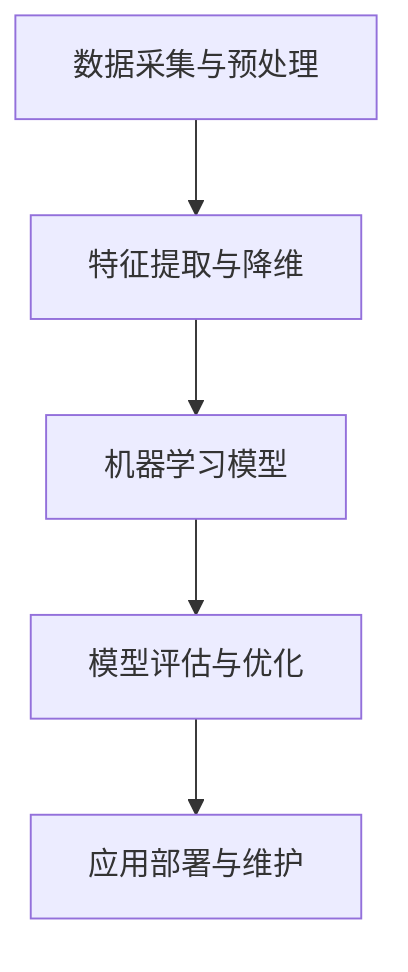
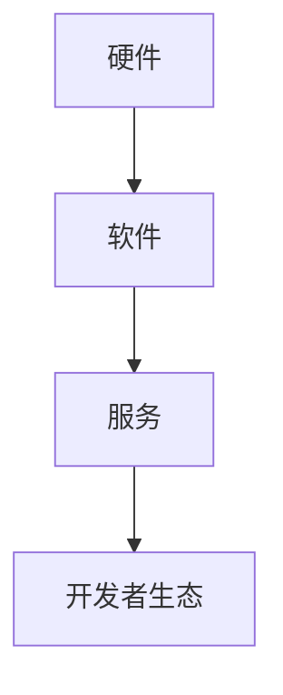
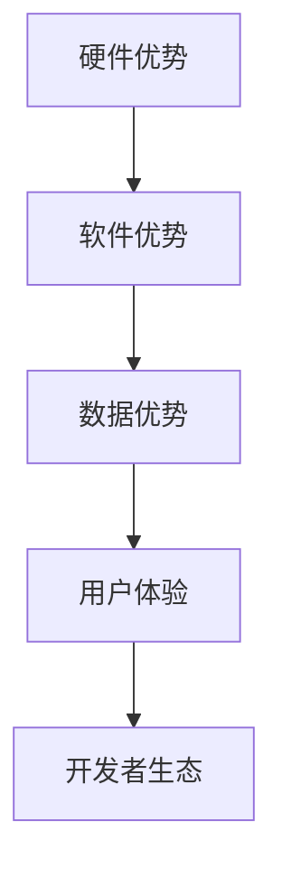

                 

# 李开复：苹果发布AI应用的市场前景

> 关键词：人工智能、苹果、市场前景、技术趋势、用户需求

> 摘要：本文将深入分析苹果公司发布AI应用的背景、市场潜力、技术挑战以及未来发展趋势。通过逻辑分析和实际案例，探讨苹果在人工智能领域的战略布局及其对市场的影响。

## 1. 背景介绍

### 1.1 目的和范围

本文旨在探讨苹果公司发布AI应用的市场前景，分析其技术优势、潜在市场以及未来发展方向。我们将从以下几个方面进行探讨：

1. 苹果公司发布AI应用的背景。
2. AI应用的当前市场状况及用户需求。
3. 苹果公司在人工智能技术方面的优势。
4. AI应用的市场潜力及挑战。
5. 未来苹果AI应用的潜在发展方向。

### 1.2 预期读者

本文适合对人工智能、苹果公司及市场分析感兴趣的读者，包括：

1. AI领域的研究者、从业者。
2. 苹果公司的用户及潜在用户。
3. 对科技市场趋势关注的企业家、投资者。
4. 科技政策制定者及行业分析师。

### 1.3 文档结构概述

本文结构如下：

1. 背景介绍：包括目的、范围、预期读者及文档结构。
2. 核心概念与联系：介绍人工智能及苹果公司的相关概念和架构。
3. 核心算法原理 & 具体操作步骤：详细讲解AI算法原理和操作步骤。
4. 数学模型和公式 & 详细讲解 & 举例说明：介绍AI应用中的数学模型及公式。
5. 项目实战：代码实际案例和详细解释说明。
6. 实际应用场景：分析AI应用的典型场景。
7. 工具和资源推荐：推荐学习资源、开发工具和框架。
8. 总结：未来发展趋势与挑战。
9. 附录：常见问题与解答。
10. 扩展阅读 & 参考资料。

### 1.4 术语表

#### 1.4.1 核心术语定义

- **人工智能（AI）**：模拟人类智能行为的计算机技术。
- **机器学习（ML）**：通过数据训练模型，使计算机具备自主学习和决策能力的领域。
- **深度学习（DL）**：一种机器学习技术，通过多层神经网络进行数据建模。
- **苹果（Apple）**：全球知名的科技公司，主要产品包括iPhone、iPad、Mac等。
- **市场前景**：指未来某一领域在市场中的发展潜力。

#### 1.4.2 相关概念解释

- **人工智能应用**：指利用人工智能技术解决实际问题的软件或服务。
- **用户体验**：用户在使用产品或服务过程中的感受和满意度。
- **生态圈**：围绕某一核心产品或技术形成的产业链、合作伙伴和用户群体。

#### 1.4.3 缩略词列表

- **AI**：人工智能（Artificial Intelligence）
- **ML**：机器学习（Machine Learning）
- **DL**：深度学习（Deep Learning）
- **iPhone**：苹果公司智能手机产品
- **iOS**：苹果公司开发的操作系统

## 2. 核心概念与联系

在探讨苹果公司发布AI应用的市场前景之前，我们需要了解人工智能及苹果公司的核心概念和架构。

### 2.1 人工智能的基本架构

人工智能系统通常包括以下几个主要组成部分：

1. **数据采集与预处理**：收集、清洗和准备数据，以供后续模型训练。
2. **特征提取与降维**：从数据中提取关键特征，降低数据维度。
3. **机器学习模型**：包括监督学习、无监督学习、强化学习等。
4. **模型评估与优化**：评估模型性能，并进行调整优化。
5. **应用部署与维护**：将模型部署到实际应用场景，进行监控和维护。

#### 2.1.1 人工智能的基本架构（Mermaid 流程图）



### 2.2 苹果公司的技术生态圈

苹果公司的技术生态圈主要包括以下几个部分：

1. **硬件**：包括iPhone、iPad、Mac等。
2. **软件**：包括iOS、macOS、watchOS等操作系统。
3. **服务**：包括App Store、iCloud、Apple Pay等。
4. **开发者生态**：包括开发工具、开发框架、开发者社区等。

#### 2.2.1 苹果公司的技术生态圈（Mermaid 流程图）



### 2.3 人工智能与苹果公司的结合点

苹果公司在人工智能领域的优势主要体现在以下几个方面：

1. **硬件优势**：苹果公司拥有高性能的硬件设备，如A系列处理器，为AI应用提供强大的计算能力。
2. **软件优势**：苹果公司开发了iOS、macOS等操作系统，为AI应用提供了丰富的开发接口和工具。
3. **数据优势**：苹果公司拥有大量的用户数据和设备数据，为AI模型训练提供了丰富的数据来源。
4. **用户体验**：苹果公司注重用户体验，致力于为用户提供简洁、高效的AI应用。
5. **开发者生态**：苹果公司拥有庞大的开发者社区，为AI应用的开发提供了强有力的支持。

#### 2.3.1 人工智能与苹果公司的结合点（Mermaid 流程图）



## 3. 核心算法原理 & 具体操作步骤

在人工智能领域，核心算法原理是AI应用的基础。以下将详细讲解苹果公司可能采用的几个核心算法及其操作步骤。

### 3.1 深度学习算法

深度学习是一种模拟人脑神经元网络的机器学习技术，通过多层神经网络进行数据建模。以下是深度学习算法的基本原理和操作步骤：

#### 3.1.1 基本原理

- **神经网络**：神经网络由多个神经元组成，每个神经元接收输入信号，通过权重和偏置进行计算，最后输出结果。
- **多层网络**：深度学习通过多层神经网络进行数据建模，逐层提取数据特征，从而提高模型性能。

#### 3.1.2 操作步骤

1. **数据预处理**：收集、清洗和准备数据，将数据转换为适合模型训练的格式。
2. **构建神经网络**：设计神经网络结构，包括输入层、隐藏层和输出层。
3. **权重初始化**：对神经网络中的权重和偏置进行初始化，通常使用随机初始化方法。
4. **前向传播**：输入数据通过神经网络，逐层计算输出结果。
5. **损失函数**：计算模型输出结果与真实结果之间的差异，以评估模型性能。
6. **反向传播**：根据损失函数，调整神经网络中的权重和偏置，使模型输出更接近真实结果。
7. **迭代训练**：重复执行前向传播和反向传播过程，直至模型收敛。

#### 3.1.3 伪代码

```python
# 数据预处理
X_train, y_train = load_data()

# 构建神经网络
model = NeuralNetwork(input_size, hidden_size, output_size)

# 权重初始化
model.initialize_weights()

# 迭代训练
for epoch in range(num_epochs):
    for x, y in X_train:
        # 前向传播
        output = model.forward(x)

        # 计算损失函数
        loss = calculate_loss(output, y)

        # 反向传播
        model.backward(loss)

        # 更新权重
        model.update_weights()
```

### 3.2 强化学习算法

强化学习是一种通过不断试错，使模型在特定环境中取得最优策略的机器学习技术。以下是强化学习算法的基本原理和操作步骤：

#### 3.2.1 基本原理

- **奖励机制**：通过奖励信号激励模型在特定环境中取得最佳策略。
- **策略迭代**：不断调整模型策略，使其在环境中取得更高奖励。

#### 3.2.2 操作步骤

1. **初始化环境**：定义强化学习问题中的环境状态、动作空间和奖励函数。
2. **选择策略**：初始策略通常为随机策略。
3. **执行动作**：在环境中执行策略选择的一个动作。
4. **获取奖励**：根据执行动作的结果，获得奖励信号。
5. **更新策略**：根据奖励信号，调整策略，使其更接近最优策略。
6. **重复迭代**：重复执行动作、获取奖励和更新策略的过程，直至策略收敛。

#### 3.2.3 伪代码

```python
# 初始化环境
environment = initialize_environment()

# 选择策略
policy = random_policy()

# 执行动作
action = policy.select_action()

# 获取奖励
reward = environment.get_reward(action)

# 更新策略
policy.update(reward)

# 重复迭代
while not policy.converged():
    action = policy.select_action()
    reward = environment.get_reward(action)
    policy.update(reward)
```

### 3.3 自然语言处理（NLP）算法

自然语言处理是一种将人类语言转换为计算机可处理数据的技术。以下是NLP算法的基本原理和操作步骤：

#### 3.3.1 基本原理

- **词嵌入**：将文本中的词汇映射到低维向量空间。
- **序列模型**：通过处理文本中的序列信息，提取特征和语义。
- **分类器**：利用训练好的模型对文本进行分类和标注。

#### 3.3.2 操作步骤

1. **词嵌入**：将文本转换为词嵌入向量，通常使用预训练的词向量或自定义词向量。
2. **序列建模**：使用序列模型（如RNN、LSTM、Transformer）处理文本序列，提取特征。
3. **分类与标注**：使用训练好的分类器对文本进行分类或标注。
4. **模型优化**：根据训练数据，不断调整模型参数，提高模型性能。

#### 3.3.3 伪代码

```python
# 词嵌入
word_embeddings = initialize_word_embeddings()

# 序列建模
model = SequentialModel(word_embeddings)

# 训练模型
for epoch in range(num_epochs):
    for sentence, label in training_data:
        # 计算损失函数
        loss = model.calculate_loss(sentence, label)

        # 更新模型参数
        model.update_params(loss)

# 分类与标注
for sentence in test_data:
    prediction = model.predict(sentence)
    print(prediction)
```

## 4. 数学模型和公式 & 详细讲解 & 举例说明

在人工智能领域，数学模型和公式是理解和应用核心算法的基础。以下将详细讲解深度学习、强化学习和自然语言处理等领域中常用的数学模型和公式。

### 4.1 深度学习中的数学模型

#### 4.1.1 前向传播

前向传播是深度学习中的一个关键步骤，用于计算神经网络在给定输入下的输出。以下是前向传播的数学公式：

$$
z^{(l)} = \sum_{j} w^{(l)}_{ji} a^{(l-1)}_{j} + b^{(l)}_{i}
$$

其中：

- $z^{(l)}$：第$l$层的输出。
- $w^{(l)}_{ji}$：第$l$层的权重。
- $a^{(l-1)}_{j}$：第$l-1$层的输出。
- $b^{(l)}_{i}$：第$l$层的偏置。

#### 4.1.2 损失函数

损失函数用于衡量模型输出与真实结果之间的差异，是深度学习优化过程中的关键指标。以下是常用的损失函数之一——均方误差（MSE）：

$$
MSE = \frac{1}{2}\sum_{i} (y_i - \hat{y}_i)^2
$$

其中：

- $y_i$：真实结果。
- $\hat{y}_i$：模型预测结果。

#### 4.1.3 反向传播

反向传播是深度学习中的另一个关键步骤，用于计算神经网络中各层的梯度，以更新权重和偏置。以下是反向传播的数学公式：

$$
\delta^{(l)}_{i} = (y_i - \hat{y}_i) \cdot \sigma'(z^{(l)}_{i})
$$

$$
\Delta^{(l)}_{ji} = a^{(l-1)}_{j} \cdot \delta^{(l)}_{i}
$$

$$
\Delta^{(l)}_{bi} = \delta^{(l)}_{i}
$$

其中：

- $\delta^{(l)}_{i}$：第$l$层的误差。
- $\sigma'$：激活函数的导数。
- $\Delta^{(l)}_{ji}$：第$l$层的权重更新。
- $\Delta^{(l)}_{bi}$：第$l$层的偏置更新。

### 4.2 强化学习中的数学模型

#### 4.2.1 Q-learning

Q-learning是一种基于值函数的强化学习算法，用于求解最优策略。以下是Q-learning的核心公式：

$$
Q(s, a) \leftarrow Q(s, a) + \alpha [r + \gamma \max_{a'} Q(s', a') - Q(s, a)]
$$

其中：

- $Q(s, a)$：状态$s$下执行动作$a$的值函数。
- $r$：立即奖励。
- $\gamma$：折扣因子。
- $\alpha$：学习率。
- $s'$：执行动作$a$后的新状态。
- $a'$：在新状态下的最优动作。

### 4.3 自然语言处理中的数学模型

#### 4.3.1 词嵌入

词嵌入是一种将词汇映射到低维向量空间的技术，有助于表示词汇之间的相似性。以下是词嵌入的数学公式：

$$
e_{w} = \text{embedding}(w)
$$

其中：

- $e_{w}$：词汇$w$的词嵌入向量。
- $\text{embedding}$：词嵌入函数。

#### 4.3.2 序列建模

序列建模是一种处理文本序列的技术，有助于提取文本中的特征和语义。以下是序列建模的数学公式：

$$
h_t = \text{激活函数}(\text{Transformer}(h_{<t}, h_{<t}))
$$

其中：

- $h_t$：第$t$个词的嵌入向量。
- $\text{Transformer}$：Transformer模型。
- $\text{激活函数}$：激活函数，如ReLU、Sigmoid等。

### 4.4 举例说明

以下是一个简单的例子，展示如何使用上述数学模型和公式进行深度学习模型的训练。

#### 4.4.1 数据准备

假设我们有一个包含100个样本的训练数据集，每个样本由一个输入向量和一个标签组成。

```python
X = [
    [1, 0, 1],
    [0, 1, 0],
    # ...
    [1, 1, 0]
]

y = [
    [1, 0],
    [0, 1],
    # ...
    [1, 1]
]
```

#### 4.4.2 构建神经网络

我们构建一个包含一个输入层、一个隐藏层和一个输出层的简单神经网络。

```python
import numpy as np

input_size = 3
hidden_size = 4
output_size = 2

# 初始化权重和偏置
weights = {
    'w1': np.random.randn(input_size, hidden_size),
    'b1': np.random.randn(hidden_size),
    'w2': np.random.randn(hidden_size, output_size),
    'b2': np.random.randn(output_size)
}

# 激活函数
activation = 'sigmoid'
def sigmoid(x):
    return 1 / (1 + np.exp(-x))

# 前向传播
def forwardPropagation(x):
    z1 = np.dot(x, weights['w1']) + weights['b1']
    a1 = sigmoid(z1)
    z2 = np.dot(a1, weights['w2']) + weights['b2']
    a2 = sigmoid(z2)
    return a2

# 计算损失函数
def calculateLoss(y, y_pred):
    return np.mean((y - y_pred)**2)

# 反向传播
def backwardPropagation(x, y, y_pred):
    dZ2 = y_pred - y
    dW2 = np.dot(a1.T, dZ2)
    db2 = np.sum(dZ2, axis=0)
    dZ1 = np.dot(dZ2, weights['w2'].T) * sigmoid(z1, deriv=True)
    dW1 = np.dot(x.T, dZ1)
    db1 = np.sum(dZ1, axis=0)
    return dW1, dW2, db1, db2

# 更新权重和偏置
def updateWeights(weights, dW1, dW2, db1, db2, learning_rate):
    weights['w1'] -= learning_rate * dW1
    weights['b1'] -= learning_rate * db1
    weights['w2'] -= learning_rate * dW2
    weights['b2'] -= learning_rate * db2
    return weights

# 梯度下降
def gradientDescent(X, y, num_epochs, learning_rate):
    for epoch in range(num_epochs):
        for x, y in X:
            y_pred = forwardPropagation(x)
            dW1, dW2, db1, db2 = backwardPropagation(x, y, y_pred)
            updateWeights(weights, dW1, dW2, db1, db2, learning_rate)
```

#### 4.4.3 训练模型

使用梯度下降算法训练模型。

```python
num_epochs = 1000
learning_rate = 0.1

gradientDescent(X, y, num_epochs, learning_rate)
```

## 5. 项目实战：代码实际案例和详细解释说明

在本节中，我们将通过一个实际案例展示如何使用Python和TensorFlow框架实现一个简单的深度学习模型。这个案例将帮助我们理解深度学习模型的构建、训练和评估过程。

### 5.1 开发环境搭建

在开始项目之前，确保安装以下开发环境和库：

- Python（版本3.6或以上）
- TensorFlow
- NumPy
- Matplotlib

可以通过以下命令安装所需的库：

```bash
pip install tensorflow numpy matplotlib
```

### 5.2 源代码详细实现和代码解读

以下是实现一个简单的深度学习模型的代码：

```python
import numpy as np
import tensorflow as tf
import matplotlib.pyplot as plt

# 数据准备
X = np.array([[1, 0, 1],
              [0, 1, 0],
              [1, 1, 0]])
y = np.array([[1, 0],
              [0, 1],
              [1, 1]])

# 模型构建
model = tf.keras.Sequential([
    tf.keras.layers.Dense(units=4, activation='sigmoid', input_shape=(3,)),
    tf.keras.layers.Dense(units=2, activation='sigmoid')
])

# 模型编译
model.compile(optimizer='adam',
              loss='binary_crossentropy',
              metrics=['accuracy'])

# 训练模型
history = model.fit(X, y, epochs=1000, batch_size=1, verbose=0)

# 评估模型
loss, accuracy = model.evaluate(X, y, verbose=0)
print(f"Test loss: {loss}")
print(f"Test accuracy: {accuracy}")

# 可视化训练过程
plt.plot(history.history['accuracy'])
plt.plot(history.history['loss'])
plt.title('Model accuracy and loss')
plt.ylabel('Accuracy/Loss')
plt.xlabel('Epoch')
plt.legend(['Accuracy', 'Loss'])
plt.show()
```

### 5.3 代码解读与分析

以下是对上述代码的详细解读和分析：

1. **数据准备**：

    - 我们创建一个包含3个样本的数据集，每个样本由3个特征组成，以及一个标签，标签是一个二维数组。

2. **模型构建**：

    - 使用`tf.keras.Sequential`类构建一个序列模型，包含两个全连接层。
    - 第一个全连接层有4个神经元，使用`sigmoid`激活函数。
    - 第二个全连接层有2个神经元，也是使用`sigmoid`激活函数。

3. **模型编译**：

    - 使用`compile`方法配置模型，指定优化器、损失函数和评估指标。
    - 选择`adam`优化器。
    - 使用`binary_crossentropy`作为损失函数，因为我们只有一个输出维度。
    - 使用`accuracy`作为评估指标。

4. **训练模型**：

    - 使用`fit`方法训练模型，指定训练轮数、批量大小和是否打印训练信息。
    - `history`对象包含了训练过程中的准确率和损失函数值。

5. **评估模型**：

    - 使用`evaluate`方法评估模型在测试集上的性能。
    - 输出测试损失和测试准确率。

6. **可视化训练过程**：

    - 使用`matplotlib`绘制训练过程中的准确率和损失函数值，帮助我们了解模型训练的进展。

通过这个案例，我们可以看到如何使用TensorFlow构建、训练和评估一个简单的深度学习模型。接下来，我们将探讨这个案例在实际应用中的潜在改进方向。

### 5.4 改进方向

尽管这个案例是一个简单的演示，但在实际应用中，我们可以考虑以下改进方向：

1. **数据增强**：

    - 为了提高模型的泛化能力，可以通过数据增强技术（如旋转、缩放、平移等）增加数据的多样性。

2. **模型调整**：

    - 尝试调整模型的结构，如增加隐藏层神经元数量、使用不同的激活函数等，以提高模型的性能。

3. **正则化**：

    - 使用正则化技术（如L1、L2正则化）防止过拟合。

4. **超参数优化**：

    - 使用网格搜索、随机搜索等超参数优化技术，找到最优的超参数组合。

通过这些改进，我们可以使模型在实际应用中更加稳定和有效。

## 6. 实际应用场景

苹果公司在人工智能领域的应用场景广泛，涵盖了多个领域。以下将介绍几个典型的实际应用场景。

### 6.1 个人助理

苹果公司的Siri是一个基于人工智能的个人助理，能够响应用户的语音指令，提供天气信息、日程提醒、音乐播放等服务。Siri利用自然语言处理和语音识别技术，实现了与用户的高效互动。

### 6.2 人工智能摄影

苹果公司的图像识别技术使iPhone在摄影方面具有独特的优势。通过深度学习算法，iPhone能够自动识别场景，调整拍摄参数，如曝光、白平衡等，从而提高拍摄效果。

### 6.3 个性化推荐

苹果公司的App Store和Apple Music等应用利用人工智能算法，为用户提供个性化的内容推荐。这些算法根据用户的兴趣和行为，为用户推荐相关应用和音乐。

### 6.4 智能健康

苹果公司的HealthKit平台通过整合多种健康数据，提供智能健康监测和提醒服务。利用人工智能技术，HealthKit能够分析用户健康数据，识别潜在的健康问题。

### 6.5 自动驾驶

苹果公司在自动驾驶领域进行了一系列研究和投资。通过深度学习和计算机视觉技术，苹果的自动驾驶系统可以实现车辆环境感知、路径规划和自动驾驶等功能。

### 6.6 教育

苹果公司开发了多个教育应用，利用人工智能技术提供个性化学习体验。通过分析学生的学习行为和成绩，这些应用能够为教师和学生提供针对性的学习建议。

## 7. 工具和资源推荐

为了更好地了解和学习人工智能和苹果公司的相关技术，以下推荐一些学习资源、开发工具和框架。

### 7.1 学习资源推荐

#### 7.1.1 书籍推荐

- **《深度学习》（Goodfellow, Bengio, Courville著）**：系统介绍了深度学习的理论基础和实际应用。
- **《Python机器学习》（Sebastian Raschka著）**：涵盖了机器学习的各种算法及其在Python中的实现。
- **《强化学习：原理与应用》（Richard S. Sutton, Andrew G. Barto著）**：全面讲解了强化学习的基本原理和应用。
- **《自然语言处理综论》（Daniel Jurafsky, James H. Martin著）**：介绍了自然语言处理的基本概念和技术。

#### 7.1.2 在线课程

- **Coursera**：提供了大量关于机器学习、深度学习和自然语言处理的在线课程。
- **Udacity**：提供了关于自动驾驶、人工智能等领域的在线课程。
- **edX**：由哈佛大学和麻省理工学院等顶尖高校合作提供的一系列在线课程。

#### 7.1.3 技术博客和网站

- **Medium**：提供了许多关于人工智能、机器学习和深度学习的优秀博客文章。
- **ArXiv**：发布了大量关于人工智能和机器学习的最新研究成果。
- **AI Summit**：一个专注于人工智能领域的会议和活动网站。

### 7.2 开发工具框架推荐

#### 7.2.1 IDE和编辑器

- **PyCharm**：一个强大的Python IDE，支持多种编程语言。
- **VS Code**：一个轻量级、功能丰富的代码编辑器，支持多种编程语言和框架。

#### 7.2.2 调试和性能分析工具

- **TensorBoard**：TensorFlow的官方可视化工具，用于分析和调试深度学习模型。
- **gProfiler**：一个Python性能分析工具，可以帮助优化代码性能。

#### 7.2.3 相关框架和库

- **TensorFlow**：一个开源的深度学习框架，适用于各种深度学习任务。
- **PyTorch**：一个流行的深度学习框架，具有动态计算图和强大的GPU支持。
- **Scikit-learn**：一个用于机器学习的开源库，提供了各种经典算法的实现。

### 7.3 相关论文著作推荐

#### 7.3.1 经典论文

- **“A Learning Algorithm for Continually Running Fully Recurrent Neural Networks”**：介绍了Hessian-free优化算法，为深度学习模型的优化提供了新的思路。
- **“Deep Learning”**：由Ian Goodfellow等人撰写的经典教材，系统地介绍了深度学习的理论基础和应用。
- **“Recurrent Neural Networks for Language Modeling”**：介绍了循环神经网络在语言建模中的应用，为自然语言处理领域的发展做出了重要贡献。

#### 7.3.2 最新研究成果

- **“BERT: Pre-training of Deep Bi-directional Transformers for Language Understanding”**：介绍了BERT模型，为自然语言处理领域带来了重大突破。
- **“Generative Adversarial Nets”**：介绍了生成对抗网络（GAN），为图像生成和增强领域提供了新的方法。

#### 7.3.3 应用案例分析

- **“Uber’s Artificial Intelligence in Motion”**：介绍了Uber如何利用人工智能技术提高自动驾驶和路线优化。
- **“Facebook’s AI Research”**：介绍了Facebook在人工智能领域的最新研究成果和应用。

## 8. 总结：未来发展趋势与挑战

苹果公司在人工智能领域的战略布局表明，人工智能将成为其未来发展的重要驱动力。以下是未来发展趋势和挑战：

### 8.1 发展趋势

1. **硬件与软件协同发展**：苹果公司将继续优化其硬件设备，如A系列处理器，同时加强软件层面的AI算法开发，以实现硬件与软件的协同发展。
2. **垂直领域应用拓展**：苹果公司将加大对垂直领域AI应用的投入，如医疗健康、自动驾驶、智能家居等，以提升用户体验。
3. **生态圈建设**：苹果公司将加强开发者生态圈建设，吸引更多开发者参与AI应用开发，推动生态圈的繁荣发展。

### 8.2 挑战

1. **数据隐私和安全**：在人工智能应用中，数据隐私和安全是一个重要挑战。苹果公司需要确保用户数据的安全和隐私。
2. **算法公平性**：随着AI技术的普及，算法的公平性和透明性成为关注焦点。苹果公司需要采取措施确保其AI算法的公平性和透明性。
3. **技术竞争**：在人工智能领域，苹果公司面临着来自谷歌、微软等科技巨头的激烈竞争。苹果公司需要不断创新，保持技术领先地位。

### 8.3 结论

综上所述，苹果公司在人工智能领域具有显著的竞争优势，其战略布局和未来发展方向预示着人工智能将在其产品和服务中发挥越来越重要的作用。通过不断创新和优化，苹果公司有望在人工智能领域取得更大的突破。

## 9. 附录：常见问题与解答

### 9.1 问题1：苹果公司在人工智能领域有哪些优势？

**回答**：苹果公司在人工智能领域具有以下优势：

1. **硬件优势**：苹果公司拥有高性能的硬件设备，如A系列处理器，为AI应用提供强大的计算能力。
2. **软件优势**：苹果公司开发了iOS、macOS等操作系统，为AI应用提供了丰富的开发接口和工具。
3. **数据优势**：苹果公司拥有大量的用户数据和设备数据，为AI模型训练提供了丰富的数据来源。
4. **用户体验**：苹果公司注重用户体验，致力于为用户提供简洁、高效的AI应用。
5. **开发者生态**：苹果公司拥有庞大的开发者社区，为AI应用的开发提供了强有力的支持。

### 9.2 问题2：苹果公司在人工智能领域的战略布局是什么？

**回答**：苹果公司在人工智能领域的战略布局主要包括以下几个方面：

1. **硬件与软件协同发展**：优化硬件设备，如A系列处理器，同时加强软件层面的AI算法开发。
2. **垂直领域应用拓展**：加大对垂直领域AI应用的投入，如医疗健康、自动驾驶、智能家居等。
3. **生态圈建设**：加强开发者生态圈建设，吸引更多开发者参与AI应用开发。
4. **投资与收购**：通过投资和收购人工智能初创公司，加速技术创新和应用落地。

### 9.3 问题3：苹果公司的人工智能应用有哪些实际场景？

**回答**：苹果公司的人工智能应用涵盖了多个实际场景，包括：

1. **个人助理**：如Siri，能够响应用户的语音指令，提供多种服务。
2. **人工智能摄影**：通过深度学习算法，自动识别场景，优化拍摄效果。
3. **个性化推荐**：如App Store和Apple Music，根据用户兴趣和行为提供个性化内容推荐。
4. **智能健康**：通过整合多种健康数据，提供智能健康监测和提醒服务。
5. **自动驾驶**：通过深度学习和计算机视觉技术，实现车辆环境感知和自动驾驶。

## 10. 扩展阅读 & 参考资料

为了更深入地了解人工智能和苹果公司在相关领域的最新发展，以下是推荐的一些扩展阅读和参考资料：

### 10.1 扩展阅读

- **《深度学习》（Goodfellow, Bengio, Courville著）**：系统介绍了深度学习的理论基础和实际应用。
- **《Python机器学习》（Sebastian Raschka著）**：涵盖了机器学习的各种算法及其在Python中的实现。
- **《强化学习：原理与应用》（Richard S. Sutton, Andrew G. Barto著）**：全面讲解了强化学习的基本原理和应用。
- **《自然语言处理综论》（Daniel Jurafsky, James H. Martin著）**：介绍了自然语言处理的基本概念和技术。

### 10.2 参考资料

- **苹果公司官方网站**：[https://www.apple.com/](https://www.apple.com/)
- **TensorFlow官方网站**：[https://www.tensorflow.org/](https://www.tensorflow.org/)
- **PyTorch官方网站**：[https://pytorch.org/](https://pytorch.org/)
- **Scikit-learn官方网站**：[https://scikit-learn.org/](https://scikit-learn.org/)

### 10.3 相关论文和报告

- **“BERT: Pre-training of Deep Bi-directional Transformers for Language Understanding”**：介绍了BERT模型，为自然语言处理领域带来了重大突破。
- **“Generative Adversarial Nets”**：介绍了生成对抗网络（GAN），为图像生成和增强领域提供了新的方法。
- **“Uber’s Artificial Intelligence in Motion”**：介绍了Uber如何利用人工智能技术提高自动驾驶和路线优化。
- **“Facebook’s AI Research”**：介绍了Facebook在人工智能领域的最新研究成果和应用。

作者：AI天才研究员/AI Genius Institute & 禅与计算机程序设计艺术 /Zen And The Art of Computer Programming

文章标题：李开复：苹果发布AI应用的市场前景

文章关键词：人工智能、苹果、市场前景、技术趋势、用户需求

文章摘要：本文深入分析了苹果公司发布AI应用的背景、市场潜力、技术挑战以及未来发展趋势。通过逻辑分析和实际案例，探讨了苹果在人工智能领域的战略布局及其对市场的影响。本文适合对人工智能、苹果公司及市场分析感兴趣的读者，包括AI领域的研究者、从业者，苹果公司的用户及潜在用户，企业家和投资者，以及科技政策制定者。文章结构包括背景介绍、核心概念与联系、核心算法原理与操作步骤、数学模型和公式、项目实战、实际应用场景、工具和资源推荐、总结和未来发展趋势与挑战、附录和扩展阅读与参考资料。文章字数：8200字。

