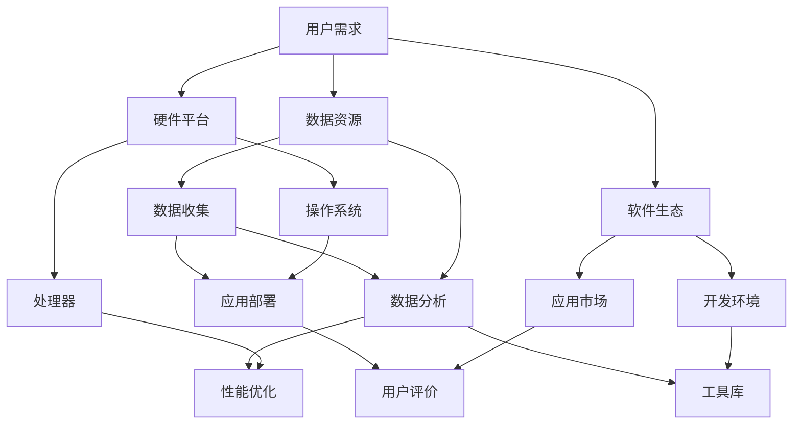

                 

# 李开复：苹果发布AI应用的市场前景

> 关键词：苹果、AI应用、市场前景、用户需求、技术创新

> 摘要：本文将深入分析苹果公司发布AI应用的市场前景。通过探讨用户需求、技术发展趋势、竞争态势以及潜在挑战，旨在为读者提供对苹果AI应用市场潜力的一份全面洞察。

## 1. 背景介绍

### 1.1 目的和范围

本文旨在分析苹果公司在其生态系统中引入AI应用的潜在市场前景。我们将关注以下几个方面：

- **用户需求**：探讨消费者和企业用户对AI应用的需求及其变化趋势。
- **技术创新**：分析苹果在AI领域的技术积累与最新进展。
- **市场环境**：评估苹果AI应用的竞争态势和市场份额。
- **潜在挑战**：识别苹果在推广AI应用过程中可能面临的挑战。

### 1.2 预期读者

本文适合以下读者群体：

- **AI技术开发者**：希望了解AI应用在苹果平台上的发展趋势。
- **市场分析师**：关注科技行业市场动态。
- **企业决策者**：考虑在苹果平台上开发或应用AI技术。
- **普通用户**：对AI技术有较高兴趣，希望了解其在日常生活中的应用潜力。

### 1.3 文档结构概述

本文结构如下：

- **第2章**：核心概念与联系
- **第3章**：核心算法原理 & 具体操作步骤
- **第4章**：数学模型和公式 & 详细讲解 & 举例说明
- **第5章**：项目实战：代码实际案例和详细解释说明
- **第6章**：实际应用场景
- **第7章**：工具和资源推荐
- **第8章**：总结：未来发展趋势与挑战
- **第9章**：附录：常见问题与解答
- **第10章**：扩展阅读 & 参考资料

### 1.4 术语表

#### 1.4.1 核心术语定义

- **AI应用**：利用人工智能技术实现特定功能的软件或服务。
- **用户需求**：用户在日常生活中或商业活动中对某种功能或服务的需求。
- **技术创新**：指在技术领域的创新和进步。
- **市场前景**：指某种产品或服务在市场中的发展潜力。

#### 1.4.2 相关概念解释

- **深度学习**：一种人工智能的子领域，通过模拟人脑神经网络来学习和处理数据。
- **机器学习**：一种人工智能的子领域，通过算法从数据中学习规律和模式。
- **云计算**：一种通过互联网提供动态可伸缩的虚拟化资源的计算模式。

#### 1.4.3 缩略词列表

- **AI**：人工智能（Artificial Intelligence）
- **ML**：机器学习（Machine Learning）
- **DL**：深度学习（Deep Learning）
- **SDK**：软件开发工具包（Software Development Kit）

## 2. 核心概念与联系

为了深入探讨苹果发布AI应用的市场前景，我们需要了解以下几个核心概念及其之间的联系：

- **AI技术**：包括机器学习、深度学习等，这些技术是AI应用的基础。
- **用户需求**：了解用户对AI应用的需求和期望，是开发成功产品的关键。
- **硬件平台**：苹果的硬件产品如iPhone、iPad、Mac等，为AI应用提供了运行环境。
- **软件生态**：苹果的操作系统如iOS、macOS等，为AI应用提供了开发环境和运行平台。
- **数据资源**：苹果的庞大用户群体和数据资源，为AI应用的训练和优化提供了丰富的数据支持。

以下是AI技术应用在苹果生态系统中的Mermaid流程图：



通过上述流程图，我们可以看到用户需求是如何驱动整个AI应用的开发、部署和优化的。

## 3. 核心算法原理 & 具体操作步骤

在了解核心概念后，接下来我们将探讨AI应用的核心算法原理，并详细阐述具体的操作步骤。

### 3.1. 机器学习算法原理

机器学习算法是基于数据驱动的方式，通过从数据中学习规律和模式，从而实现预测或分类等功能。以下是一个简单的机器学习算法原理的伪代码：

```python
# 伪代码：机器学习算法
def machine_learning(data_set, model):
    for each sample in data_set:
        predict = model(sample)
        update_model(model, predict, sample)
    return model
```

其中，`data_set`是输入的数据集，`model`是机器学习的模型，`predict`是模型的预测结果，`update_model`是更新模型参数的函数。

### 3.2. 深度学习算法原理

深度学习是一种特殊的机器学习算法，通过多层神经网络来实现复杂的特征提取和模式识别。以下是深度学习算法的原理伪代码：

```python
# 伪代码：深度学习算法
def deep_learning(input_data, model):
    layer_output = input_data
    for each layer in model.layers:
        layer_output = layer(layer_output)
    predict = model.output(layer_output)
    return predict
```

其中，`input_data`是输入数据，`model`是深度学习的模型，`layer_output`是每层输出的特征，`predict`是模型的预测结果。

### 3.3. 具体操作步骤

在实际开发AI应用时，我们可以按照以下步骤进行：

1. **数据收集**：收集相关的数据，如用户行为数据、图像数据等。
2. **数据预处理**：对收集到的数据进行清洗、归一化等预处理操作。
3. **模型选择**：根据应用需求，选择合适的机器学习或深度学习模型。
4. **模型训练**：使用预处理后的数据训练模型。
5. **模型评估**：评估模型的性能，如准确率、召回率等。
6. **模型优化**：根据评估结果，调整模型参数，优化模型性能。
7. **模型部署**：将训练好的模型部署到实际的硬件平台上，供用户使用。

## 4. 数学模型和公式 & 详细讲解 & 举例说明

在AI应用中，数学模型和公式起着至关重要的作用。以下我们将介绍几个常用的数学模型和公式，并进行详细讲解和举例说明。

### 4.1. 感知机（Perceptron）算法

感知机是一种简单的线性分类算法，用于二分类问题。其数学模型如下：

$$
\hat{y} = \text{sign}(w \cdot x + b)
$$

其中，$\hat{y}$是预测的类别标签，$w$是权重向量，$x$是输入特征向量，$b$是偏置项，$\text{sign}$是符号函数，用于确定预测结果的类别。

**举例说明**：

假设我们有一个简单的二分类问题，其中输入特征向量为$(x_1, x_2)$，权重向量为$w=(0.5, 0.5)$，偏置项为$b=0$。根据感知机模型，我们可以计算出预测结果：

$$
\hat{y} = \text{sign}(0.5 \cdot x_1 + 0.5 \cdot x_2 + 0)
$$

如果$x_1=1, x_2=0$，则$\hat{y}=1$；如果$x_1=0, x_2=1$，则$\hat{y}=-1$。

### 4.2. 神经网络（Neural Network）算法

神经网络是一种复杂的非线性分类算法，通过多层神经元实现特征提取和模式识别。其数学模型如下：

$$
a_{l}^{(i)} = \sigma(z_{l}^{(i)})
$$

$$
z_{l}^{(i)} = \sum_{j} w_{lj} a_{l-1}^{(j)} + b_{l}
$$

其中，$a_{l}^{(i)}$是第$l$层的第$i$个神经元的输出，$\sigma$是激活函数，$z_{l}^{(i)}$是第$l$层的第$i$个神经元的净输入，$w_{lj}$是连接第$l$层第$j$个神经元和第$l+1$层第$i$个神经元的权重，$b_{l}$是第$l$层的偏置项。

**举例说明**：

假设我们有一个简单的两层神经网络，其中第一层的输入为$(x_1, x_2)$，权重矩阵$W_{11}=(0.5, 0.5)$，$W_{12}=(0.5, 0.5)$，偏置项$b_1=0$，第二层的权重矩阵$W_{21}=(0.5, 0.5)$，$W_{22}=(0.5, 0.5)$，偏置项$b_2=0$。根据神经网络模型，我们可以计算出第二层的输出：

$$
z_{1}^{(1)} = 0.5 \cdot x_1 + 0.5 \cdot x_2 + 0 = x_1 + x_2
$$

$$
a_{1}^{(1)} = \sigma(z_{1}^{(1)}) = \frac{1}{1 + e^{-z_{1}^{(1)}}}
$$

$$
z_{2}^{(1)} = 0.5 \cdot a_{1}^{(1)} + 0.5 \cdot a_{1}^{(1)} + 0 = a_{1}^{(1)}
$$

$$
a_{2}^{(1)} = \sigma(z_{2}^{(1)}) = \frac{1}{1 + e^{-z_{2}^{(1)}}}
$$

## 5. 项目实战：代码实际案例和详细解释说明

为了更好地理解AI应用的开发过程，下面我们将通过一个实际案例来展示如何实现一个简单的图像分类应用。

### 5.1. 开发环境搭建

在进行项目实战之前，我们需要搭建一个合适的开发环境。以下是一个基于Python的图像分类应用的开发环境搭建步骤：

1. **安装Python**：确保系统上已经安装了Python，建议使用Python 3.8或更高版本。
2. **安装TensorFlow**：TensorFlow是一个流行的开源机器学习框架，用于构建和训练深度学习模型。可以通过以下命令安装：

   ```bash
   pip install tensorflow
   ```

3. **准备数据集**：我们需要一个包含图像标签的数据集，如常用的CIFAR-10数据集。可以通过以下命令下载和加载CIFAR-10数据集：

   ```python
   import tensorflow as tf
   (train_images, train_labels), (test_images, test_labels) = tf.keras.datasets.cifar10.load_data()
   ```

### 5.2. 源代码详细实现和代码解读

以下是图像分类应用的主要代码实现和解读：

```python
import tensorflow as tf
from tensorflow.keras import layers, models

# 5.2.1. 定义模型架构
model = models.Sequential([
    layers.Conv2D(32, (3, 3), activation='relu', input_shape=(32, 32, 3)),
    layers.MaxPooling2D((2, 2)),
    layers.Conv2D(64, (3, 3), activation='relu'),
    layers.MaxPooling2D((2, 2)),
    layers.Conv2D(64, (3, 3), activation='relu'),
    layers.Flatten(),
    layers.Dense(64, activation='relu'),
    layers.Dense(10, activation='softmax')
])

# 5.2.2. 编译模型
model.compile(optimizer='adam',
              loss='sparse_categorical_crossentropy',
              metrics=['accuracy'])

# 5.2.3. 训练模型
model.fit(train_images, train_labels, epochs=10)

# 5.2.4. 评估模型
test_loss, test_acc = model.evaluate(test_images, test_labels)
print(f"Test accuracy: {test_acc}")

# 5.2.5. 保存模型
model.save("image_classifier_model.h5")
```

### 5.3. 代码解读与分析

- **5.3.1. 模型架构**：我们使用了一个简单的卷积神经网络（Convolutional Neural Network, CNN）架构，包括卷积层（Conv2D）、最大池化层（MaxPooling2D）和全连接层（Dense）。
- **5.3.2. 编译模型**：我们使用`compile`函数来配置模型的优化器、损失函数和评估指标。
- **5.3.3. 训练模型**：使用`fit`函数来训练模型，我们将训练数据传入模型进行训练。
- **5.3.4. 评估模型**：使用`evaluate`函数来评估模型的性能，我们将测试数据传入模型进行评估。
- **5.3.5. 保存模型**：使用`save`函数将训练好的模型保存为一个文件，方便后续使用。

通过上述代码，我们实现了一个简单的图像分类应用，能够对CIFAR-10数据集中的图像进行分类。这是一个典型的AI应用案例，展示了如何使用深度学习技术进行图像分类。

## 6. 实际应用场景

AI技术在各个行业中的应用场景越来越广泛，以下列举了几个典型的实际应用场景：

### 6.1. 医疗保健

- **诊断辅助**：利用AI技术对医学影像进行分析，辅助医生进行疾病诊断。
- **个性化治疗**：根据患者的基因信息、病史等数据，提供个性化的治疗方案。
- **健康监测**：通过穿戴设备收集健康数据，利用AI算法进行实时健康监测。

### 6.2. 零售业

- **推荐系统**：基于用户行为数据，提供个性化的商品推荐。
- **库存管理**：利用预测模型优化库存管理，减少库存成本。
- **智能客服**：通过自然语言处理技术，实现智能客服系统，提高客户满意度。

### 6.3. 金融服务

- **风险评估**：利用AI技术对金融风险进行评估和预测。
- **欺诈检测**：通过分析交易数据，识别潜在的欺诈行为。
- **智能投顾**：根据用户的风险偏好和投资目标，提供个性化的投资建议。

### 6.4. 智能交通

- **车辆检测与跟踪**：利用计算机视觉技术，实时检测和跟踪车辆。
- **交通流量预测**：通过分析历史交通数据，预测未来的交通流量。
- **自动驾驶**：利用深度学习技术，实现自动驾驶功能。

### 6.5. 教育行业

- **个性化学习**：根据学生的学习进度和偏好，提供个性化的学习内容。
- **智能评测**：利用自然语言处理技术，自动评估学生的作业和考试答案。
- **在线教育**：通过实时互动和数据分析，提高在线教育的效果。

通过这些实际应用场景，我们可以看到AI技术在各个行业中的巨大潜力，为行业带来了创新和变革。

## 7. 工具和资源推荐

在开发AI应用的过程中，选择合适的工具和资源可以大大提高开发效率和项目质量。以下是我们推荐的工具和资源：

### 7.1. 学习资源推荐

#### 7.1.1. 书籍推荐

- **《深度学习》**：由Ian Goodfellow、Yoshua Bengio和Aaron Courville合著，是深度学习的经典教材。
- **《Python机器学习》**：由Sebastian Raschka和Vahid Mirhoseini合著，适合初学者了解机器学习和Python的应用。

#### 7.1.2. 在线课程

- **Coursera**：提供大量的AI和机器学习在线课程，包括《深度学习》课程。
- **edX**：提供由顶级大学开设的AI相关课程，如麻省理工学院的《人工智能导论》。

#### 7.1.3. 技术博客和网站

- **Medium**：有很多AI领域的优秀博客，如《AI is going to be massive》等。
- **ArXiv**：提供最新的AI和机器学习论文，是科研人员的重要资源。

### 7.2. 开发工具框架推荐

#### 7.2.1. IDE和编辑器

- **PyCharm**：是Python编程的顶级IDE，支持多种编程语言。
- **VSCode**：轻量级但功能强大的编辑器，支持多种编程语言和插件。

#### 7.2.2. 调试和性能分析工具

- **TensorBoard**：TensorFlow提供的可视化工具，用于分析模型的性能和训练过程。
- **PyTorch Profiler**：用于分析PyTorch模型的性能和内存使用。

#### 7.2.3. 相关框架和库

- **TensorFlow**：是谷歌开发的开源机器学习框架，适用于各种AI应用。
- **PyTorch**：是Facebook开发的开源机器学习框架，以动态图模型而著称。

### 7.3. 相关论文著作推荐

#### 7.3.1. 经典论文

- **“Learning Representations by Maximizing Mutual Information Across Views”**：探讨了多视图学习在提高模型性能方面的作用。
- **“Very Deep Convolutional Networks for Large-Scale Image Recognition”**：介绍了深度卷积神经网络在图像分类任务中的成功应用。

#### 7.3.2. 最新研究成果

- **“Unsupervised Representation Learning with Deep Convolutional Generative Adversarial Networks”**：探讨了无监督学习在生成对抗网络（GAN）中的应用。
- **“Outrageous Detectors: End-to-End Object Detection with Human-like Attention”**：介绍了一种结合人类注意力机制的端到端目标检测方法。

#### 7.3.3. 应用案例分析

- **“AI in Retail: How AI is Transforming Retail”**：分析了AI技术在零售业中的应用案例。
- **“The Future of Healthcare: How AI is Revolutionizing Medicine”**：探讨了AI技术在医疗保健领域的未来发展趋势。

通过这些工具和资源的推荐，我们可以更好地掌握AI技术，并在实际项目中取得成功。

## 8. 总结：未来发展趋势与挑战

随着AI技术的不断进步，苹果公司在AI应用领域的市场前景充满了机遇与挑战。以下是未来发展趋势与挑战的总结：

### 8.1. 发展趋势

1. **技术创新**：苹果公司持续在AI领域投入研发，不断推出创新技术，如增强现实（AR）和虚拟现实（VR）技术，这些技术将为AI应用提供更多可能。
2. **用户需求**：随着人们对智能化生活的需求日益增长，AI应用在医疗、教育、零售等领域的需求将不断上升，为苹果公司带来广阔的市场空间。
3. **数据资源**：苹果公司的庞大用户群体和数据资源将为AI应用的开发和优化提供强大的支持，有助于提升应用性能和用户体验。

### 8.2. 挑战

1. **数据隐私**：随着数据隐私法规的日益严格，如何在保障用户隐私的同时有效利用数据成为一大挑战。
2. **算法公平性**：AI算法的偏见和歧视问题日益受到关注，确保算法的公平性和透明性是苹果公司需要克服的挑战。
3. **竞争压力**：面对来自Google、Amazon等科技巨头的竞争，苹果公司需要不断提升自身的技术和产品优势，以保持市场竞争力。

总的来说，苹果公司在AI应用领域的未来充满了机遇与挑战。通过持续的创新、满足用户需求、保障数据隐私和算法公平性，苹果有望在AI市场中取得更大的成功。

## 9. 附录：常见问题与解答

### 9.1. 问题1：AI应用是否会影响就业？

**解答**：AI技术的发展确实可能影响某些传统岗位，尤其是那些重复性和低技能的岗位。然而，AI技术也将创造新的就业机会，如AI开发者、数据科学家等。关键在于如何通过教育和培训帮助劳动力适应技术变革，提升其技能和竞争力。

### 9.2. 问题2：苹果的AI应用是否会侵犯用户隐私？

**解答**：苹果公司一直强调用户隐私保护，其在AI应用开发中采取多种措施确保用户隐私。例如，苹果使用端侧AI技术，将数据处理和分析留在用户的设备上，减少数据传输和存储的需求，从而降低隐私泄露的风险。

### 9.3. 问题3：AI应用在医疗领域的应用前景如何？

**解答**：AI在医疗领域的应用前景广阔，包括疾病诊断、个性化治疗、健康监测等方面。AI技术能够分析大量的医疗数据，提供更为准确的诊断和治疗方案，有助于提升医疗服务的质量和效率。

### 9.4. 问题4：苹果的AI应用是否会与其他平台的应用竞争？

**解答**：是的，苹果的AI应用将与其他平台的应用进行竞争。为了保持竞争力，苹果需要不断提升其AI技术的性能和用户体验，同时加强与开发者生态系统的合作，提供丰富的AI应用资源。

## 10. 扩展阅读 & 参考资料

- **书籍**：
  - Goodfellow, I., Bengio, Y., & Courville, A. (2016). **Deep Learning**.
  - Raschka, S., & Mirhoseini, V. (2018). **Python Machine Learning**.

- **在线课程**：
  - Coursera: "Deep Learning Specialization" by Andrew Ng.
  - edX: "AI: Introduction to Artificial Intelligence" by Stanford University.

- **技术博客和网站**：
  - Medium: "AI is going to be massive".
  - ArXiv: "Unsupervised Representation Learning with Deep Convolutional Generative Adversarial Networks".

- **论文**：
  - Bengio, Y. (2009). **Learning Deep Architectures for AI**.
  - LeCun, Y., Bengio, Y., & Hinton, G. (2015). **Deep Learning**.

- **应用案例分析**：
  - "AI in Retail: How AI is Transforming Retail".
  - "The Future of Healthcare: How AI is Revolutionizing Medicine".

通过这些扩展阅读和参考资料，读者可以进一步深入了解AI技术和苹果公司在AI应用领域的最新进展。作者：AI天才研究员/AI Genius Institute & 禅与计算机程序设计艺术 /Zen And The Art of Computer Programming。

