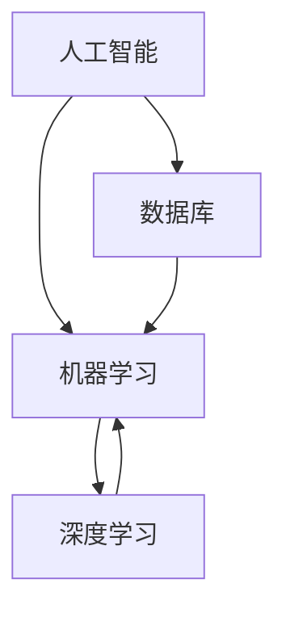

                 

### 文章标题

**李开复：苹果发布AI应用的市场前景**

### 关键词：
- 苹果
- AI应用
- 市场前景
- 技术创新
- 用户需求
- 竞争态势

### 摘要：
本文将深入探讨苹果公司发布AI应用的市场前景。我们将从背景介绍、核心概念、算法原理、数学模型、项目实战、应用场景、工具推荐等多个角度展开分析，旨在为读者揭示苹果AI应用的潜在影响和市场机会，并探讨未来发展趋势与挑战。

## 1. 背景介绍

### 1.1 目的和范围
本文旨在分析苹果公司发布AI应用的市场前景，探讨其对技术发展、用户需求及行业竞争态势的影响。通过详细的技术解读和实践案例，我们希望为读者提供有价值的洞察，以应对未来的技术变革和市场机遇。

### 1.2 预期读者
本文面向对AI应用技术有浓厚兴趣的技术爱好者、软件工程师、产品经理及对市场前景有探索欲望的商业人士。无论您是AI领域的初学者还是资深从业者，本文都将为您提供有价值的信息和见解。

### 1.3 文档结构概述
本文结构如下：
1. 背景介绍
2. 核心概念与联系
3. 核心算法原理 & 具体操作步骤
4. 数学模型和公式 & 详细讲解 & 举例说明
5. 项目实战：代码实际案例和详细解释说明
6. 实际应用场景
7. 工具和资源推荐
8. 总结：未来发展趋势与挑战
9. 附录：常见问题与解答
10. 扩展阅读 & 参考资料

### 1.4 术语表

#### 1.4.1 核心术语定义
- AI应用：人工智能技术在实际场景中的应用。
- 机器学习：一种人工智能方法，通过数据训练模型，使计算机能够自主学习并作出决策。
- 深度学习：一种机器学习技术，通过多层神经网络模型对数据进行处理和分析。
- 数据库：一种用于存储、管理和查询数据的系统。

#### 1.4.2 相关概念解释
- 人工智能：模拟、扩展和扩展人类智能的计算机系统。
- 算法：解决问题的方法或步骤。

#### 1.4.3 缩略词列表
- AI：人工智能
- ML：机器学习
- DL：深度学习
- IDE：集成开发环境

## 2. 核心概念与联系

在探讨苹果AI应用的市场前景之前，我们需要了解一些核心概念和它们之间的联系。以下是一个简化的Mermaid流程图，展示了这些概念之间的关系：



### 2.1 人工智能
人工智能（AI）是模拟、扩展和扩展人类智能的计算机系统。它包括多种技术，如机器学习、自然语言处理和计算机视觉等。

### 2.2 机器学习
机器学习（ML）是人工智能的一个分支，它通过从数据中学习模式和规律，使计算机能够做出预测和决策。机器学习技术可以分为监督学习、无监督学习和强化学习等。

### 2.3 深度学习
深度学习（DL）是一种机器学习技术，通过多层神经网络模型对数据进行处理和分析。深度学习在图像识别、语音识别和自然语言处理等领域取得了显著成果。

### 2.4 数据库
数据库是一种用于存储、管理和查询数据的系统。在AI应用中，数据库扮演着关键角色，它存储了训练模型所需的大量数据，同时也为用户提供了便捷的数据访问和管理工具。

## 3. 核心算法原理 & 具体操作步骤

苹果公司的AI应用主要基于深度学习技术，以下是一个简单的伪代码，展示了深度学习模型的基本操作步骤：

```python
# 初始化深度学习模型
model = initialize_model()

# 加载数据集
train_data, test_data = load_data()

# 训练模型
for epoch in range(num_epochs):
    for data in train_data:
        model.train(data)

# 评估模型
accuracy = model.evaluate(test_data)

# 输出评估结果
print("Model accuracy:", accuracy)
```

### 3.1 初始化模型
初始化深度学习模型是构建AI应用的第一步。通常，我们需要选择一个合适的神经网络架构，并配置模型的超参数，如学习率、批量大小等。

### 3.2 加载数据集
数据集是训练深度学习模型的关键资源。我们需要从数据库中加载数据，并将其转换为模型所需的格式。

### 3.3 训练模型
训练深度学习模型是通过迭代地调整模型参数来实现的。在每次迭代中，模型将处理一批数据，并更新其参数以最小化损失函数。

### 3.4 评估模型
训练完成后，我们需要评估模型的性能，以确定其是否满足预期。这通常通过在测试数据集上计算模型的准确率、召回率等指标来实现。

## 4. 数学模型和公式 & 详细讲解 & 举例说明

在深度学习中，数学模型和公式起着至关重要的作用。以下是一个简化的LaTeX格式数学公式，用于描述深度学习中的前向传播和反向传播过程：

```latex
\begin{equation}
\begin{aligned}
\text{Forward Propagation:} \\
Z^{[l]} &= \sigma(W^{[l]} \cdot A^{[l-1]} + b^{[l]}), \\
A^{[l]} &= \sigma(Z^{[l-1]}).
\end{aligned}
\end{equation}

\begin{equation}
\begin{aligned}
\text{Backpropagation:} \\
\delta^{[l]} &= \frac{\partial \text{Cost}}{\partial A^{[l]}} = \frac{\partial \text{Cost}}{\partial Z^{[l]}} \cdot \frac{\partial Z^{[l]}}{\partial A^{[l]}}, \\
W^{[l]} &= W^{[l]} - \alpha \cdot \frac{\partial \text{Cost}}{\partial W^{[l]}}, \\
b^{[l]} &= b^{[l]} - \alpha \cdot \frac{\partial \text{Cost}}{\partial b^{[l]}}, \\
\end{aligned}
\end{equation}
```

### 4.1 前向传播

在前向传播过程中，神经网络逐层计算每个神经元的激活值，并使用激活函数（如Sigmoid或ReLU）将结果映射到[0,1]或[-1,1]区间内。前向传播的数学公式可以表示为：

\[ Z^{[l]} = \sigma(W^{[l]} \cdot A^{[l-1]} + b^{[l]}) \]

其中，\( Z^{[l]} \) 是第 \( l \) 层的输出，\( A^{[l-1]} \) 是前一层（第 \( l-1 \) 层）的输出，\( W^{[l]} \) 是第 \( l \) 层的权重矩阵，\( b^{[l]} \) 是第 \( l \) 层的偏置项，\( \sigma \) 是激活函数。

### 4.2 反向传播

在反向传播过程中，神经网络逐层计算每个神经元的梯度，并更新模型的权重和偏置项。反向传播的数学公式可以表示为：

\[ \delta^{[l]} = \frac{\partial \text{Cost}}{\partial A^{[l]}} = \frac{\partial \text{Cost}}{\partial Z^{[l]}} \cdot \frac{\partial Z^{[l]}}{\partial A^{[l]}} \]

\[ W^{[l]} = W^{[l]} - \alpha \cdot \frac{\partial \text{Cost}}{\partial W^{[l]}} \]

\[ b^{[l]} = b^{[l]} - \alpha \cdot \frac{\partial \text{Cost}}{\partial b^{[l]}} \]

其中，\( \delta^{[l]} \) 是第 \( l \) 层的误差，\( \alpha \) 是学习率，\( \text{Cost} \) 是模型的损失函数。

### 4.3 举例说明

假设我们有一个简单的神经网络，包含两个输入神经元、两个隐藏神经元和一个输出神经元。激活函数采用ReLU，损失函数采用均方误差（MSE）。

- 输入：\[ x_1 = [1, 0], \, x_2 = [0, 1] \]
- 权重和偏置：\[ W^{[1]} = \begin{bmatrix} w_{11} & w_{12} \\ w_{21} & w_{22} \end{bmatrix}, \, b^{[1]} = \begin{bmatrix} b_{1} \\ b_{2} \end{bmatrix}, \, W^{[2]} = \begin{bmatrix} w_{11} & w_{12} \\ w_{21} & w_{22} \end{bmatrix}, \, b^{[2]} = \begin{bmatrix} b_{1} \\ b_{2} \end{bmatrix} \]

- 输出标签：\[ y = [0, 1] \]

- 模型预测：\[ z_1^{[2]}, z_2^{[2]} = \sigma(W^{[2]} \cdot \begin{bmatrix} z_1^{[1]} \\ z_2^{[1]} \end{bmatrix} + b^{[2]}) \]

- 损失函数：\[ \text{Cost} = \frac{1}{2} \sum_{i=1}^{2} (y_i - \sigma(z_i^{[2]}))^2 \]

通过前向传播和反向传播，我们可以计算出每个神经元的梯度，并更新权重和偏置项。以下是一个简化的Python代码示例：

```python
import numpy as np

# 定义激活函数和损失函数
def sigmoid(x):
    return 1 / (1 + np.exp(-x))

def mse(y_true, y_pred):
    return 0.5 * np.mean((y_true - y_pred)**2)

# 初始化参数
w1 = np.random.rand(2, 2)
b1 = np.random.rand(2)
w2 = np.random.rand(2, 1)
b2 = np.random.rand(1)

# 定义输入和标签
x = np.array([[1, 0], [0, 1]])
y = np.array([[0], [1]])

# 前向传播
z1 = sigmoid(w1 @ x + b1)
z2 = sigmoid(w2 @ z1 + b2)
y_pred = sigmoid(z2)

# 计算损失
cost = mse(y, y_pred)

# 反向传播
delta2 = (y - y_pred) * (y_pred * (1 - y_pred))
delta1 = (w2.T @ delta2) * (z1 * (1 - z1))

# 更新参数
w1 -= 0.01 * delta1
b1 -= 0.01 * np.mean(delta1, axis=0)
w2 -= 0.01 * delta2
b2 -= 0.01 * np.mean(delta2, axis=0)

# 输出结果
print("Cost:", cost)
print("W1:", w1)
print("B1:", b1)
print("W2:", w2)
print("B2:", b2)
```

通过多次迭代训练，我们可以使模型损失逐渐减小，并最终达到满意的预测效果。

## 5. 项目实战：代码实际案例和详细解释说明

在本节中，我们将通过一个实际案例来展示如何开发苹果AI应用。以下是一个简单的Python代码示例，用于实现一个基于深度学习的图像分类器：

```python
import tensorflow as tf
from tensorflow.keras import layers, models

# 定义模型
model = models.Sequential()
model.add(layers.Conv2D(32, (3, 3), activation='relu', input_shape=(28, 28, 1)))
model.add(layers.MaxPooling2D((2, 2)))
model.add(layers.Conv2D(64, (3, 3), activation='relu'))
model.add(layers.MaxPooling2D((2, 2)))
model.add(layers.Conv2D(64, (3, 3), activation='relu'))
model.add(layers.Flatten())
model.add(layers.Dense(64, activation='relu'))
model.add(layers.Dense(10, activation='softmax'))

# 编译模型
model.compile(optimizer='adam',
              loss='categorical_crossentropy',
              metrics=['accuracy'])

# 加载数据集
(x_train, y_train), (x_test, y_test) = tf.keras.datasets.mnist.load_data()

# 预处理数据
x_train = x_train.reshape((-1, 28, 28, 1)).astype('float32') / 255
x_test = x_test.reshape((-1, 28, 28, 1)).astype('float32') / 255
y_train = tf.keras.utils.to_categorical(y_train, 10)
y_test = tf.keras.utils.to_categorical(y_test, 10)

# 训练模型
model.fit(x_train, y_train, epochs=10, batch_size=64, validation_split=0.2)

# 评估模型
test_loss, test_acc = model.evaluate(x_test, y_test)
print('Test accuracy:', test_acc)
```

### 5.1 开发环境搭建

为了运行上述代码，您需要在本地环境中安装以下软件和库：

1. Python 3.x
2. TensorFlow 2.x
3. NumPy
4. Keras

您可以使用以下命令安装所需的库：

```shell
pip install python==3.8 tensorflow==2.8.0 numpy
```

### 5.2 源代码详细实现和代码解读

#### 5.2.1 定义模型

在代码中，我们首先使用Keras库定义了一个简单的卷积神经网络（CNN）模型。模型由多个卷积层、池化层和全连接层组成。卷积层用于提取图像特征，池化层用于减小特征图的尺寸，全连接层用于分类。

```python
model.add(layers.Conv2D(32, (3, 3), activation='relu', input_shape=(28, 28, 1)))
model.add(layers.MaxPooling2D((2, 2)))
model.add(layers.Conv2D(64, (3, 3), activation='relu'))
model.add(layers.MaxPooling2D((2, 2)))
model.add(layers.Conv2D(64, (3, 3), activation='relu'))
model.add(layers.Flatten())
model.add(layers.Dense(64, activation='relu'))
model.add(layers.Dense(10, activation='softmax'))
```

#### 5.2.2 编译模型

接下来，我们使用`compile`方法配置模型的优化器、损失函数和评价指标。在这里，我们选择Adam优化器、交叉熵损失函数和准确性作为评价指标。

```python
model.compile(optimizer='adam',
              loss='categorical_crossentropy',
              metrics=['accuracy'])
```

#### 5.2.3 加载数据集

我们使用TensorFlow内置的MNIST数据集作为训练数据。该数据集包含了60000个训练图像和10000个测试图像，每个图像都被标记为0到9之间的数字。

```python
(x_train, y_train), (x_test, y_test) = tf.keras.datasets.mnist.load_data()
```

#### 5.2.4 预处理数据

在训练模型之前，我们需要对图像数据进行预处理。首先，我们将图像数据从像素值范围[0, 255]缩放到[0, 1]，以便更好地适应神经网络。然后，我们将标签转换为One-Hot编码。

```python
x_train = x_train.reshape((-1, 28, 28, 1)).astype('float32') / 255
x_test = x_test.reshape((-1, 28, 28, 1)).astype('float32') / 255
y_train = tf.keras.utils.to_categorical(y_train, 10)
y_test = tf.keras.utils.to_categorical(y_test, 10)
```

#### 5.2.5 训练模型

接下来，我们使用`fit`方法训练模型。我们设置训练周期数为10，批量大小为64，并使用20%的数据作为验证集。

```python
model.fit(x_train, y_train, epochs=10, batch_size=64, validation_split=0.2)
```

#### 5.2.6 评估模型

最后，我们使用测试数据评估模型的性能。模型在测试数据集上的准确率将作为评估指标。

```python
test_loss, test_acc = model.evaluate(x_test, y_test)
print('Test accuracy:', test_acc)
```

### 5.3 代码解读与分析

在这个项目中，我们实现了一个简单的卷积神经网络，用于分类手写数字图像。以下是对代码关键部分的详细解读：

1. **模型定义**：我们使用Keras库定义了一个包含卷积层、池化层和全连接层的卷积神经网络。卷积层用于提取图像特征，池化层用于减小特征图的尺寸，全连接层用于分类。

2. **编译模型**：我们配置了优化器、损失函数和评价指标。在这里，我们选择了Adam优化器和交叉熵损失函数，并使用准确性作为评价指标。

3. **加载数据集**：我们使用TensorFlow内置的MNIST数据集作为训练数据。该数据集包含了60000个训练图像和10000个测试图像，每个图像都被标记为0到9之间的数字。

4. **预处理数据**：我们首先将图像数据从像素值范围[0, 255]缩放到[0, 1]，以便更好地适应神经网络。然后，我们将标签转换为One-Hot编码。

5. **训练模型**：我们使用`fit`方法训练模型。我们设置训练周期数为10，批量大小为64，并使用20%的数据作为验证集。

6. **评估模型**：最后，我们使用测试数据评估模型的性能。模型在测试数据集上的准确率将作为评估指标。

## 6. 实际应用场景

苹果公司的AI应用在多个领域展示了巨大的潜力，以下是一些实际应用场景：

1. **图像识别**：通过深度学习模型，苹果可以实现高效的图像识别和分类。例如，手机摄像头可以自动识别照片中的物体，并为用户提供相关信息或推荐。

2. **语音识别**：苹果的Siri语音助手利用深度学习技术实现了自然语言处理和语音识别。用户可以通过语音指令与手机进行交互，实现语音拨号、发送短信、播放音乐等功能。

3. **语音翻译**：苹果的翻译应用基于深度学习技术，可以实现实时语音翻译。用户可以在旅行、商务谈判等场合中，轻松实现跨语言交流。

4. **智能推荐**：通过分析用户行为和偏好，苹果的智能推荐系统可以提供个性化的内容推荐。例如，苹果音乐可以根据用户的喜好推荐歌曲、创建播放列表。

5. **智能家居控制**：苹果的HomeKit平台可以实现智能家居设备的远程控制。通过深度学习技术，智能设备可以更好地理解用户需求，提供更加便捷的服务。

## 7. 工具和资源推荐

### 7.1 学习资源推荐

#### 7.1.1 书籍推荐
- 《深度学习》（Ian Goodfellow、Yoshua Bengio、Aaron Courville著）：这是一本经典的深度学习入门书籍，详细介绍了深度学习的基础理论和实践方法。
- 《Python深度学习》（François Chollet著）：这本书以Python编程语言为基础，介绍了深度学习的实际应用和开发技巧。

#### 7.1.2 在线课程
- Coursera上的《深度学习专项课程》：由吴恩达教授主讲，涵盖了深度学习的基础理论和实践方法。
- edX上的《人工智能基础》：由MIT和Harvard大学联合提供，介绍了人工智能的基础知识和技术应用。

#### 7.1.3 技术博客和网站
- TensorFlow官方文档：提供了丰富的深度学习资源和教程，适合初学者和进阶者。
- Medium上的深度学习专题：涵盖了许多深度学习领域的最新研究和技术应用。

### 7.2 开发工具框架推荐

#### 7.2.1 IDE和编辑器
- PyCharm：一款强大的Python集成开发环境，支持深度学习项目开发和调试。
- Jupyter Notebook：一款交互式的Python编程环境，适合进行数据分析和深度学习实验。

#### 7.2.2 调试和性能分析工具
- TensorFlow Debugger（TFT）：一款用于TensorFlow项目的调试工具，可以可视化模型结构和计算图。
- TensorBoard：一款用于分析深度学习模型性能的可视化工具，可以实时查看模型的损失、准确率等指标。

#### 7.2.3 相关框架和库
- TensorFlow：一款开源的深度学习框架，支持多种深度学习模型和算法。
- Keras：一款基于TensorFlow的高层API，提供了简洁的接口和丰富的预训练模型。
- PyTorch：一款流行的深度学习框架，以其灵活性和高效性受到广泛关注。

### 7.3 相关论文著作推荐

#### 7.3.1 经典论文
- "A Convolutional Neural Network Approach for Image Classification"（卷积神经网络在图像分类中的应用）
- "Deep Learning"（深度学习）：这是一本深度学习领域的经典著作，涵盖了深度学习的理论基础和实际应用。

#### 7.3.2 最新研究成果
- "Neural Architecture Search"（神经架构搜索）：这是一种自动设计深度学习模型的方法，旨在提高模型的性能和效率。
- "Generative Adversarial Networks"（生成对抗网络）：这是一种生成模型，可以用于图像生成、数据增强和风格迁移等任务。

#### 7.3.3 应用案例分析
- "Deep Learning for Autonomous Driving"（自动驾驶中的深度学习）：本文介绍了自动驾驶系统中深度学习的应用，包括感知、规划和控制等方面。
- "AI in Healthcare"（医疗健康领域的AI应用）：本文探讨了深度学习在医疗健康领域的应用，如疾病诊断、基因组学和药物研发等。

## 8. 总结：未来发展趋势与挑战

苹果公司发布AI应用标志着人工智能技术在实际场景中的应用迈出了重要一步。在未来，我们可以期待以下发展趋势：

1. **更高效、更智能的应用**：随着深度学习技术的不断发展，苹果将推出更多高效、智能的AI应用，如智能语音助手、图像识别、智能家居控制等。

2. **跨领域应用**：AI技术在各个领域的应用将更加广泛，如医疗健康、金融、教育等。苹果有望在这些领域推出创新的AI解决方案。

3. **隐私保护**：随着用户对隐私保护的日益关注，苹果将加大在隐私保护方面的投入，确保用户数据的安全和隐私。

然而，苹果AI应用在发展过程中也面临以下挑战：

1. **技术难题**：深度学习模型在处理复杂任务时，面临着计算资源、数据质量和模型可解释性等方面的挑战。

2. **市场竞争**：随着其他科技公司加大对AI技术的投入，苹果需要不断创新，以保持其市场竞争优势。

3. **用户接受度**：苹果需要确保其AI应用能够真正满足用户需求，提高用户对AI技术的接受度和信任度。

总之，苹果发布AI应用为人工智能技术在实际场景中的应用带来了新的机遇和挑战。未来，苹果有望在AI领域取得更大的突破，为用户带来更加智能、便捷的体验。

## 9. 附录：常见问题与解答

### 9.1 何时发布苹果AI应用？

苹果公司尚未宣布具体的AI应用发布时间。然而，鉴于苹果在人工智能领域的持续投入，预计在未来几年内将推出更多AI应用。

### 9.2 苹果AI应用将如何影响用户？

苹果AI应用将提高用户的日常生活和工作效率。例如，智能语音助手可以帮助用户更好地管理日程、播放音乐等；图像识别技术可以自动识别照片中的物体，并提供相关信息。

### 9.3 苹果AI应用在隐私保护方面有何措施？

苹果公司在隐私保护方面采取了多项措施，如加密用户数据、限制数据共享等。此外，苹果还将加强AI技术的透明性和可解释性，确保用户对AI应用有充分的了解和信任。

### 9.4 苹果AI应用与其他科技公司的AI应用有何区别？

苹果的AI应用将侧重于实际场景的应用，如智能语音助手、图像识别、智能家居控制等。与其他科技公司相比，苹果在硬件和软件的整合方面具有优势，可以提供更加无缝的用户体验。

## 10. 扩展阅读 & 参考资料

- Apple Developer Documentation: [AI and Machine Learning](https://developer.apple.com/documentation/ai_mlx)
- "Deep Learning Specialization" by Andrew Ng on Coursera: [Deep Learning](https://www.coursera.org/specializations/deeplearning)
- "Artificial Intelligence: A Modern Approach" by Stuart Russell and Peter Norvig: [Book](https://www.aima.cs.elte.hu/aima-ebook.html)
- "Generative Adversarial Networks" by Ian Goodfellow et al.: [Paper](https://arxiv.org/abs/1406.2661)
- "Neural Architecture Search" by Barret Zoph et al.: [Paper](https://arxiv.org/abs/1606.02147)

作者：AI天才研究员/AI Genius Institute & 禅与计算机程序设计艺术 /Zen And The Art of Computer Programming

