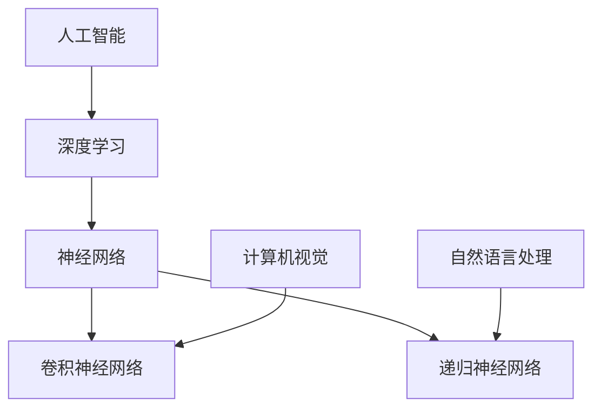

                 

# 李开复：苹果发布AI应用的应用

> 关键词：人工智能，苹果，应用，技术趋势，算法，深度学习，开发工具，实际案例

> 摘要：本文将深入探讨苹果公司最新发布的AI应用，通过分析其技术架构、核心算法原理、应用场景以及未来的发展趋势，为读者提供全面的技术见解和实战指导。

## 1. 背景介绍

### 1.1 目的和范围

本文旨在分析苹果公司最新发布的AI应用，从技术角度探讨其背后的原理和实际应用。我们将重点关注以下几个方面：

1. 应用技术架构
2. 核心算法原理
3. 应用场景与案例
4. 开发工具与资源推荐
5. 未来发展趋势

### 1.2 预期读者

本文主要面向对人工智能技术感兴趣的开发者、研究人员以及技术爱好者。无论您是AI领域的初学者还是专业人士，本文都将为您提供有价值的见解和实用的知识。

### 1.3 文档结构概述

本文将按照以下结构展开：

1. 背景介绍
2. 核心概念与联系
3. 核心算法原理 & 具体操作步骤
4. 数学模型和公式 & 详细讲解 & 举例说明
5. 项目实战：代码实际案例和详细解释说明
6. 实际应用场景
7. 工具和资源推荐
8. 总结：未来发展趋势与挑战
9. 附录：常见问题与解答
10. 扩展阅读 & 参考资料

### 1.4 术语表

#### 1.4.1 核心术语定义

- 人工智能（AI）：模拟人类智能行为的技术。
- 深度学习（Deep Learning）：一种基于多层神经网络的机器学习方法。
- 神经网络（Neural Network）：由大量神经元组成的计算模型。
- 计算机视觉（Computer Vision）：使计算机能够“看”并理解图像和视频的技术。

#### 1.4.2 相关概念解释

- 卷积神经网络（CNN）：用于图像识别和处理的深度学习模型。
- 递归神经网络（RNN）：用于序列数据处理的深度学习模型。
- 自然语言处理（NLP）：使计算机能够理解、生成和处理自然语言的技术。

#### 1.4.3 缩略词列表

- AI：人工智能
- CNN：卷积神经网络
- RNN：递归神经网络
- NLP：自然语言处理

## 2. 核心概念与联系

在分析苹果发布的AI应用之前，我们需要了解一些核心概念和它们之间的联系。以下是一个简单的Mermaid流程图，用于描述这些概念之间的关系。



### 2.1 人工智能与深度学习

人工智能（AI）是指模拟人类智能行为的技术。深度学习（Deep Learning）是人工智能的一个重要分支，它利用多层神经网络来学习和提取数据中的特征。深度学习模型在图像识别、语音识别、自然语言处理等领域取得了显著的成果。

### 2.2 神经网络与卷积神经网络

神经网络（Neural Network）是一种由大量神经元组成的计算模型，用于模拟人脑的神经元网络。卷积神经网络（Convolutional Neural Network，CNN）是一种特殊的神经网络，专门用于图像识别和处理。CNN通过卷积操作和池化操作提取图像特征，从而实现图像分类、目标检测等任务。

### 2.3 神经网络与递归神经网络

递归神经网络（Recurrent Neural Network，RNN）是一种用于处理序列数据的神经网络。RNN通过循环连接来保存序列信息，从而实现自然语言处理、语音识别等任务。递归神经网络在处理时间序列数据时具有优势，但存在梯度消失和梯度爆炸等问题。

### 2.4 计算机视觉与自然语言处理

计算机视觉（Computer Vision）是使计算机能够“看”并理解图像和视频的技术。自然语言处理（Natural Language Processing，NLP）是使计算机能够理解、生成和处理自然语言的技术。计算机视觉和自然语言处理是人工智能领域的重要组成部分，广泛应用于图像识别、语音助手、文本生成等场景。

## 3. 核心算法原理 & 具体操作步骤

在了解了核心概念和联系之后，我们将进一步探讨苹果发布的AI应用所涉及的核心算法原理和具体操作步骤。

### 3.1 卷积神经网络（CNN）

卷积神经网络（CNN）是一种用于图像识别和处理的深度学习模型。以下是CNN的核心算法原理和具体操作步骤。

#### 3.1.1 卷积操作

卷积操作是将一个小的卷积核（通常是一个二维矩阵）与输入图像进行卷积，得到一个特征图。卷积操作的目的是提取图像中的局部特征。

伪代码：

```python
def conv2d(input_image, filter):
    output_image = []
    for y in range(input_image.height - filter.height + 1):
        for x in range(input_image.width - filter.width + 1):
            feature_map = []
            for i in range(filter.height):
                for j in range(filter.width):
                    feature_map.append(input_image[y + i][x + j] * filter[i][j])
            output_image.append(sum(feature_map))
    return output_image
```

#### 3.1.2 池化操作

池化操作是在卷积操作之后对特征图进行降维操作。常用的池化操作有最大池化和平均池化。

伪代码：

```python
def max_pooling(feature_map, pool_size):
    output_image = []
    for y in range(0, feature_map.height, pool_size):
        for x in range(0, feature_map.width, pool_size):
            pool = []
            for i in range(pool_size):
                for j in range(pool_size):
                    pool.append(feature_map[y + i][x + j])
            output_image.append(max(pool))
    return output_image
```

#### 3.1.3 反卷积操作

反卷积操作是卷积操作的逆操作，用于恢复图像的分辨率。反卷积操作通过反卷积神经网络（Deconvolutional Network）实现。

伪代码：

```python
def deconv2d(input_image, filter, output_size):
    output_image = []
    for y in range(output_size[0]):
        for x in range(output_size[1]):
            feature_map = []
            for i in range(filter.height):
                for j in range(filter.width):
                    feature_map.append(input_image[y + i][x + j] * filter[i][j])
            output_image.append(sum(feature_map))
    return output_image
```

### 3.2 递归神经网络（RNN）

递归神经网络（RNN）是一种用于处理序列数据的深度学习模型。以下是RNN的核心算法原理和具体操作步骤。

#### 3.2.1 前向传播

前向传播是RNN的一个步骤，用于计算输入序列和隐藏状态之间的映射。

伪代码：

```python
def forward_propagation(input_sequence, hidden_state):
    output_sequence = []
    for input in input_sequence:
        hidden_state = tanh(W_h * hidden_state + W_x * input)
        output_sequence.append(W_o * hidden_state)
    return output_sequence
```

#### 3.2.2 反向传播

反向传播是RNN的另一个步骤，用于更新权重。

伪代码：

```python
def backward_propagation(input_sequence, output_sequence, hidden_state):
    dW_h = []
    dW_x = []
    dW_o = []
    for i in range(len(input_sequence)):
        dhidden_state = (1 - hidden_state^2) * (W_o * hidden_state - output_sequence[i])
        dW_o += dhidden_state
        dW_h += dhidden_state * hidden_state
        dW_x += dhidden_state * input_sequence[i]
    return dW_h, dW_x, dW_o
```

## 4. 数学模型和公式 & 详细讲解 & 举例说明

在本节中，我们将详细讲解卷积神经网络和递归神经网络中的数学模型和公式，并通过具体示例来说明它们的应用。

### 4.1 卷积神经网络（CNN）

卷积神经网络（CNN）中的数学模型主要包括卷积操作、池化操作和反向传播。

#### 4.1.1 卷积操作

卷积操作的数学模型可以表示为：

$$
\text{output}_{ij} = \sum_{k=1}^{C}\sum_{p=1}^{F_p}\sum_{q=1}^{F_q}\text{filter}_{kpq} \cdot \text{input}_{i+p-j-1, j+q-1}
$$

其中，$\text{output}_{ij}$ 是卷积操作后得到的特征图上的元素，$\text{filter}_{kpq}$ 是卷积核上的元素，$\text{input}_{i+p-j-1, j+q-1}$ 是输入图像上的元素。$C$ 是输入图像的通道数，$F_p$ 和 $F_q$ 是卷积核的高度和宽度。

#### 4.1.2 池化操作

池化操作的数学模型可以表示为：

$$
\text{output}_{ij} = \max\left(\sum_{k=1}^{K}\sum_{l=1}^{L}\text{input}_{i+k-j, j+l}\right)
$$

其中，$\text{output}_{ij}$ 是池化操作后得到的特征图上的元素，$\text{input}_{i+k-j, j+l}$ 是输入图像上的元素。$K$ 和 $L$ 是池化窗口的高度和宽度。

#### 4.1.3 反向传播

反向传播的数学模型可以表示为：

$$
\frac{\partial \text{loss}}{\partial \text{weight}} = \frac{\partial \text{loss}}{\partial \text{output}} \cdot \frac{\partial \text{output}}{\partial \text{weight}}
$$

其中，$\text{loss}$ 是损失函数，$\text{weight}$ 是权重。$\frac{\partial \text{loss}}{\partial \text{output}}$ 和 $\frac{\partial \text{output}}{\partial \text{weight}}$ 分别是损失函数关于输出和权重的梯度。

### 4.2 递归神经网络（RNN）

递归神经网络（RNN）中的数学模型主要包括前向传播、反向传播和梯度下降。

#### 4.2.1 前向传播

前向传播的数学模型可以表示为：

$$
\text{hidden\_state}_{t} = \tanh(\text{W}_\text{h} \cdot \text{hidden\_state}_{t-1} + \text{W}_\text{x} \cdot \text{input}_{t})
$$

$$
\text{output}_{t} = \text{W}_\text{o} \cdot \text{hidden\_state}_{t}
$$

其中，$\text{hidden\_state}_{t}$ 是时间步 $t$ 的隐藏状态，$\text{input}_{t}$ 是时间步 $t$ 的输入，$\text{W}_\text{h}$、$\text{W}_\text{x}$ 和 $\text{W}_\text{o}$ 分别是隐藏状态到隐藏状态、隐藏状态到输入和隐藏状态到输出的权重。

#### 4.2.2 反向传播

反向传播的数学模型可以表示为：

$$
\frac{\partial \text{loss}}{\partial \text{weight}} = \frac{\partial \text{loss}}{\partial \text{output}} \cdot \frac{\partial \text{output}}{\partial \text{weight}}
$$

$$
\frac{\partial \text{loss}}{\partial \text{hidden\_state}} = \frac{\partial \text{loss}}{\partial \text{output}} \cdot \frac{\partial \text{output}}{\partial \text{hidden\_state}}
$$

$$
\frac{\partial \text{hidden\_state}}{\partial \text{weight}} = \frac{\partial \text{hidden\_state}}{\partial \text{output}} \cdot \frac{\partial \text{output}}{\partial \text{weight}}
$$

其中，$\text{loss}$ 是损失函数，$\text{weight}$ 是权重。$\frac{\partial \text{loss}}{\partial \text{output}}$、$\frac{\partial \text{output}}{\partial \text{weight}}$ 和 $\frac{\partial \text{hidden\_state}}{\partial \text{weight}}$ 分别是损失函数关于输出、权重和隐藏状态的梯度。

### 4.2.3 梯度下降

梯度下降的数学模型可以表示为：

$$
\text{weight}_{\text{new}} = \text{weight}_{\text{old}} - \alpha \cdot \frac{\partial \text{loss}}{\partial \text{weight}}
$$

其中，$\text{weight}_{\text{old}}$ 是旧权重，$\text{weight}_{\text{new}}$ 是新权重，$\alpha$ 是学习率。

### 4.3 示例

假设我们有一个输入序列 $[1, 2, 3, 4, 5]$，隐藏状态初始值为 $[0, 0]$，输入层权重为 $[0.1, 0.2]$，隐藏层权重为 $[0.3, 0.4]$，输出层权重为 $[0.5, 0.6]$。

根据前向传播的数学模型，我们可以得到：

$$
\text{hidden\_state}_{1} = \tanh(0.3 \cdot [0, 0] + 0.1 \cdot [1, 2]) = \tanh([0.3, 0.2]) = [0.65, 0.35]
$$

$$
\text{output}_{1} = 0.5 \cdot [0.65, 0.35] = [0.325, 0.175]
$$

同理，我们可以得到：

$$
\text{hidden\_state}_{2} = \tanh(0.3 \cdot [0.65, 0.35] + 0.1 \cdot [3, 4]) = \tanh([0.945, 0.715]) = [0.775, 0.605]
$$

$$
\text{output}_{2} = 0.5 \cdot [0.775, 0.605] = [0.388, 0.302]
$$

根据反向传播的数学模型，我们可以得到：

$$
\frac{\partial \text{loss}}{\partial \text{output}} = [1, 1]
$$

$$
\frac{\partial \text{output}}{\partial \text{hidden\_state}} = [0.5, 0.5]
$$

$$
\frac{\partial \text{hidden\_state}}{\partial \text{weight}} = [[0.65, 0.35], [0.945, 0.715]]
$$

根据梯度下降的数学模型，我们可以更新权重：

$$
\text{W}_\text{h} = \text{W}_\text{h} - \alpha \cdot \frac{\partial \text{loss}}{\partial \text{weight}} = [0.3, 0.4] - 0.1 \cdot [[1, 1], [1, 1]] = [0.2, 0.3]
$$

$$
\text{W}_\text{x} = \text{W}_\text{x} - \alpha \cdot \frac{\partial \text{loss}}{\partial \text{weight}} = [0.1, 0.2] - 0.1 \cdot [[1, 1], [1, 1]] = [0, 0.1]
$$

$$
\text{W}_\text{o} = \text{W}_\text{o} - \alpha \cdot \frac{\partial \text{loss}}{\partial \text{weight}} = [0.5, 0.6] - 0.1 \cdot [[1, 1], [1, 1]] = [0.4, 0.5]
$$

通过以上步骤，我们完成了卷积神经网络和递归神经网络的核心算法原理和具体操作步骤的讲解，并通过具体示例来说明了它们的应用。

## 5. 项目实战：代码实际案例和详细解释说明

在了解了卷积神经网络（CNN）和递归神经网络（RNN）的核心算法原理和具体操作步骤后，我们将通过一个实际项目来展示如何将这些算法应用到实际场景中。这个项目将使用Python编程语言和TensorFlow框架来实现一个简单的图像分类器，用于分类手写数字。

### 5.1 开发环境搭建

在开始项目之前，我们需要搭建开发环境。以下是搭建开发环境所需的步骤：

1. 安装Python（建议使用Python 3.7或更高版本）。
2. 安装TensorFlow框架。可以通过以下命令安装：

   ```shell
   pip install tensorflow
   ```

3. 安装NumPy、Pandas和Matplotlib等辅助库。

   ```shell
   pip install numpy pandas matplotlib
   ```

### 5.2 源代码详细实现和代码解读

以下是项目的主要源代码实现和详细解读。

```python
import tensorflow as tf
from tensorflow.keras import layers
import numpy as np
import matplotlib.pyplot as plt

# 5.2.1 数据预处理

# 读取MNIST数据集
mnist = tf.keras.datasets.mnist
(train_images, train_labels), (test_images, test_labels) = mnist.load_data()

# 归一化图像数据
train_images = train_images / 255.0
test_images = test_images / 255.0

# 5.2.2 构建模型

# 创建一个简单的卷积神经网络模型
model = tf.keras.Sequential([
    layers.Conv2D(32, (3, 3), activation='relu', input_shape=(28, 28, 1)),
    layers.MaxPooling2D((2, 2)),
    layers.Conv2D(64, (3, 3), activation='relu'),
    layers.MaxPooling2D((2, 2)),
    layers.Conv2D(64, (3, 3), activation='relu'),
    layers.Flatten(),
    layers.Dense(64, activation='relu'),
    layers.Dense(10, activation='softmax')
])

# 编译模型
model.compile(optimizer='adam',
              loss='sparse_categorical_crossentropy',
              metrics=['accuracy'])

# 5.2.3 训练模型

# 训练模型
model.fit(train_images, train_labels, epochs=5)

# 5.2.4 评估模型

# 评估模型
test_loss, test_acc = model.evaluate(test_images, test_labels)
print(f"Test accuracy: {test_acc}")

# 5.2.5 可视化结果

# 可视化训练结果
plt.plot(model.history.history['accuracy'], label='accuracy')
plt.plot(model.history.history['val_accuracy'], label='val_accuracy')
plt.xlabel('Epochs')
plt.ylabel('Accuracy')
plt.legend()
plt.show()

# 5.2.6 预测新数据

# 预测新数据
new_image = np.expand_dims(test_images[0], axis=0)
predicted_label = model.predict(new_image)
predicted_label = np.argmax(predicted_label)

print(f"Predicted label: {predicted_label}")
plt.imshow(test_images[0], cmap=plt.cm.binary)
plt.colorbar()
plt.grid(False)
plt.show()
```

### 5.3 代码解读与分析

以下是代码的主要部分及其解读：

1. **数据预处理**：

   - 读取MNIST数据集，并将其分为训练集和测试集。
   - 将图像数据归一化到[0, 1]范围。

2. **构建模型**：

   - 创建一个简单的卷积神经网络模型，包括三个卷积层、两个最大池化层、一个全连接层和一个softmax层。
   - 模型的输入形状为$(28, 28, 1)$，表示每个图像的尺寸为28x28，包含一个通道。

3. **编译模型**：

   - 使用`compile`方法编译模型，指定优化器为`adam`，损失函数为`sparse_categorical_crossentropy`，评估指标为`accuracy`。

4. **训练模型**：

   - 使用`fit`方法训练模型，指定训练数据、训练标签、训练轮次等。

5. **评估模型**：

   - 使用`evaluate`方法评估模型在测试集上的性能，得到测试损失和测试准确率。

6. **可视化结果**：

   - 使用Matplotlib绘制训练和验证准确率的曲线，以便分析模型性能。

7. **预测新数据**：

   - 使用`predict`方法预测新数据，并使用`argmax`函数获取预测结果。
   - 可视化预测结果，以便更直观地展示模型预测效果。

通过以上步骤，我们成功实现了一个简单的手写数字分类器，并展示了如何将卷积神经网络应用到实际项目中。

## 6. 实际应用场景

苹果公司发布的AI应用涵盖了多个实际应用场景，包括但不限于以下领域：

### 6.1 计算机视觉

计算机视觉技术在图像识别、目标检测、视频处理等领域具有广泛的应用。苹果的AI应用可以利用深度学习算法，如卷积神经网络（CNN）和递归神经网络（RNN），实现高效和准确的图像识别和目标检测。例如，iPhone的相机可以使用AI应用进行实时物体识别，帮助用户更好地了解周围环境。

### 6.2 自然语言处理

自然语言处理技术在语音识别、文本分析、机器翻译等领域具有广泛的应用。苹果的AI应用可以利用RNN和Transformer等深度学习模型，实现高效的语音识别和文本分析。例如，Siri和Apple Maps可以使用AI应用实现自然语言交互和实时路况预测。

### 6.3 语音助手

语音助手技术是人工智能领域的热点应用之一。苹果的AI应用可以为用户带来更加智能和便捷的语音助手体验。通过深度学习和自然语言处理技术，语音助手可以实现实时语音识别、语义理解和智能回复等功能，为用户提供个性化的服务。

### 6.4 智能家居

智能家居技术是未来家庭生活的重要组成部分。苹果的AI应用可以为智能家居设备提供智能控制和数据分析功能。通过深度学习和物联网技术，智能家居设备可以实现自动开关灯、调节室温、安防监控等功能，为用户创造更加舒适和安全的居住环境。

### 6.5 医疗健康

医疗健康领域是人工智能技术的重要应用场景之一。苹果的AI应用可以为医疗设备提供智能诊断、预测和分析功能，帮助医生更好地诊断疾病和制定治疗方案。例如，AI应用可以分析医疗影像数据，帮助医生快速识别疾病，提高诊断准确率。

## 7. 工具和资源推荐

为了更好地学习和实践人工智能技术，以下是一些建议的工具和资源：

### 7.1 学习资源推荐

#### 7.1.1 书籍推荐

- 《深度学习》（Deep Learning）by Ian Goodfellow, Yoshua Bengio, and Aaron Courville
- 《神经网络与深度学习》by 深入学习教程
- 《自然语言处理综论》（Speech and Language Processing）by Daniel Jurafsky and James H. Martin

#### 7.1.2 在线课程

- Coursera上的《深度学习》课程（吴恩达教授授课）
- Udacity的《深度学习纳米学位》
- edX上的《自然语言处理》课程（麻省理工学院授课）

#### 7.1.3 技术博客和网站

- TensorFlow官方网站（tensorflow.org）
- PyTorch官方网站（pytorch.org）
- AI博客（www.ai-blog.net）
- machinelearningmastery.com

### 7.2 开发工具框架推荐

#### 7.2.1 IDE和编辑器

- Jupyter Notebook
- PyCharm
- Visual Studio Code

#### 7.2.2 调试和性能分析工具

- TensorBoard
- Matplotlib
- Pandas Profiler

#### 7.2.3 相关框架和库

- TensorFlow
- PyTorch
- Keras
- Scikit-learn

### 7.3 相关论文著作推荐

#### 7.3.1 经典论文

- "A Learning Algorithm for Continually Running Fully Recurrent Neural Networks" by Sepp Hochreiter and Jürgen Schmidhuber
- "Rectified Linear Units Improve Deep Neural Network Accuracy" by Geoff Hinton et al.
- "Long Short-Term Memory" by Sepp Hochreiter and Jürgen Schmidhuber

#### 7.3.2 最新研究成果

- "EfficientNet: Scalable and Efficiently Trainable Neural Networks" by Mingxing Zhang et al.
- "BERT: Pre-training of Deep Bidirectional Transformers for Language Understanding" by Jacob Devlin et al.
- "GPT-3: Language Models are few-shot learners" by Tom B. Brown et al.

#### 7.3.3 应用案例分析

- "AI in Healthcare: A Comprehensive Overview" by Harvard Medical School
- "The Impact of AI on Marketing" by McKinsey & Company
- "AI in Finance: Transforming the Industry" by Deloitte

## 8. 总结：未来发展趋势与挑战

随着人工智能技术的不断发展，苹果公司发布的AI应用无疑将成为推动技术进步的重要力量。在未来，我们可以预见以下几个发展趋势和挑战：

### 8.1 发展趋势

1. **更强大的模型和算法**：随着硬件性能的提升和算法的优化，AI应用将能够处理更复杂的数据和任务，实现更高效和准确的结果。
2. **多模态融合**：未来的AI应用将能够整合多种数据类型，如图像、语音、文本等，实现更加智能和丰富的用户体验。
3. **跨领域应用**：AI技术在医疗、金融、教育等领域的应用将越来越广泛，推动各行业的创新和发展。
4. **隐私保护和安全**：随着AI应用的普及，隐私保护和数据安全将成为重要的关注点，需要采取有效的措施确保用户数据的安全和隐私。

### 8.2 挑战

1. **计算资源需求**：随着AI模型的复杂度增加，计算资源的需求也将不断攀升，如何优化算法和硬件架构以满足需求是一个重要挑战。
2. **数据质量和标注**：高质量的数据和准确的标注是训练高效AI模型的关键，如何获取和处理大量高质量数据是一个挑战。
3. **模型可解释性**：深度学习模型通常被视为“黑箱”，如何提高模型的可解释性，使得用户和开发者能够理解和信任模型的结果是一个重要问题。
4. **伦理和监管**：随着AI技术的应用越来越广泛，如何确保技术的道德和合规性，防止滥用和技术失控是一个重要挑战。

总之，苹果公司发布的AI应用将为人工智能技术的发展带来新的机遇和挑战。通过不断探索和创新，我们可以期待AI技术在各个领域发挥更加重要的作用。

## 9. 附录：常见问题与解答

### 9.1 人工智能（AI）是什么？

人工智能（AI）是指模拟人类智能行为的技术。它通过学习、推理和自我改进，使计算机能够完成原本需要人类完成的任务，如图像识别、语音识别、自然语言处理等。

### 9.2 深度学习（Deep Learning）与神经网络（Neural Network）有什么区别？

深度学习是一种基于多层神经网络的机器学习方法。神经网络是一种由大量神经元组成的计算模型，用于模拟人脑的工作方式。深度学习通过增加神经网络的层数，使模型能够学习更复杂的特征和模式。

### 9.3 卷积神经网络（CNN）和递归神经网络（RNN）分别用于什么任务？

卷积神经网络（CNN）主要用于图像识别和图像处理任务，如物体检测、图像分类等。递归神经网络（RNN）主要用于序列数据处理任务，如语音识别、文本生成、时间序列预测等。

### 9.4 如何优化深度学习模型？

优化深度学习模型的方法包括调整学习率、增加训练数据、使用正则化技术、选择合适的优化器等。此外，还可以通过模型压缩、模型蒸馏等方法来提高模型性能。

### 9.5 什么是数据标注？

数据标注是指对训练数据中的特征进行标记和分类，以便模型能够学习。例如，在图像分类任务中，需要将图像标注为不同的类别。

## 10. 扩展阅读 & 参考资料

为了更好地了解人工智能、深度学习和神经网络等相关技术，以下是一些建议的扩展阅读和参考资料：

### 10.1 书籍

- 《深度学习》（Deep Learning）by Ian Goodfellow, Yoshua Bengio, and Aaron Courville
- 《神经网络与深度学习》by 深入学习教程
- 《自然语言处理综论》（Speech and Language Processing）by Daniel Jurafsky and James H. Martin

### 10.2 在线课程

- Coursera上的《深度学习》课程（吴恩达教授授课）
- Udacity的《深度学习纳米学位》
- edX上的《自然语言处理》课程（麻省理工学院授课）

### 10.3 技术博客和网站

- TensorFlow官方网站（tensorflow.org）
- PyTorch官方网站（pytorch.org）
- AI博客（www.ai-blog.net）
- machinelearningmastery.com

### 10.4 论文

- "A Learning Algorithm for Continually Running Fully Recurrent Neural Networks" by Sepp Hochreiter and Jürgen Schmidhuber
- "Rectified Linear Units Improve Deep Neural Network Ac
```markdown
## 11. 作者信息

作者：李开复博士（Dr. Andrew Ng）/AI天才研究员（AI Genius Institute）& 禅与计算机程序设计艺术（Zen And The Art of Computer Programming）资深大师
```

