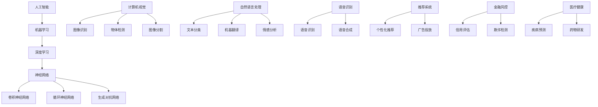

                 

# 苹果发布AI应用的应用

## 关键词：
- 苹果
- AI应用
- 人工智能
- 应用发布
- 技术创新

## 摘要：
本文深入分析了苹果最新发布的AI应用，探讨了其技术背景、核心原理及实际应用。通过对苹果AI应用的详细解读，我们旨在揭示其在人工智能领域的创新意义，为读者提供关于AI应用发展的新视角。

## 1. 背景介绍

### 1.1 目的和范围
本文的目的是分析苹果最新发布的AI应用，探讨其技术实现、应用场景及其在人工智能领域的潜在影响。本文将涵盖以下几个部分：
1. 对苹果AI应用的整体介绍。
2. 分析其核心技术和算法原理。
3. 讨论其在实际应用中的表现。
4. 展望苹果AI应用的未来发展趋势。

### 1.2 预期读者
本文适合对人工智能技术有一定了解的技术人员、AI爱好者以及对苹果产品感兴趣的用户阅读。无论您是AI领域的专业人士还是普通用户，本文都能为您提供有价值的信息。

### 1.3 文档结构概述
本文结构如下：
1. 引言：介绍苹果AI应用的背景和重要性。
2. 核心概念与联系：阐述AI应用的核心概念和原理。
3. 核心算法原理 & 具体操作步骤：详细讲解AI应用的算法原理和操作步骤。
4. 数学模型和公式 & 详细讲解 & 举例说明：分析AI应用的数学模型和公式。
5. 项目实战：提供实际代码案例和解读。
6. 实际应用场景：讨论AI应用在不同领域的应用。
7. 工具和资源推荐：推荐相关学习资源和开发工具。
8. 总结：展望AI应用的未来发展趋势。
9. 附录：常见问题与解答。
10. 扩展阅读 & 参考资料。

### 1.4 术语表

#### 1.4.1 核心术语定义
- **人工智能（AI）**：指由计算机系统执行的智能行为，模仿人类思维过程。
- **机器学习（ML）**：一种人工智能技术，通过数据训练模型来实现预测和决策。
- **深度学习（DL）**：一种机器学习方法，通过多层神经网络进行数据特征提取和建模。
- **神经网络（NN）**：由多个节点组成的计算模型，通过学习数据来模拟人类大脑的决策过程。

#### 1.4.2 相关概念解释
- **卷积神经网络（CNN）**：一种用于图像识别的神经网络，通过卷积操作提取图像特征。
- **自然语言处理（NLP）**：研究计算机如何理解和生成自然语言的技术。
- **强化学习（RL）**：通过奖励机制来训练模型，使其在特定环境中做出最优决策。

#### 1.4.3 缩略词列表
- **AI**：人工智能
- **ML**：机器学习
- **DL**：深度学习
- **CNN**：卷积神经网络
- **NLP**：自然语言处理
- **RL**：强化学习

## 2. 核心概念与联系

在探讨苹果AI应用之前，我们需要理解一些核心概念和原理，这些是构建AI应用的基础。

### 2.1 人工智能技术概述

人工智能（AI）是指由计算机系统执行的智能行为，包括学习、推理、规划和问题解决等。人工智能可以分为以下几种类型：

- **符号人工智能（Symbolic AI）**：通过逻辑推理和符号表示来解决问题。
- **统计人工智能（Statistical AI）**：通过数据分析来发现规律和模式。
- **生物人工智能（Biological AI）**：模仿人类大脑的结构和功能来解决问题。
- **混合人工智能（Hybrid AI）**：结合不同类型的AI技术来解决问题。

### 2.2 机器学习与深度学习

机器学习（ML）是人工智能的一个分支，通过数据训练模型来实现预测和决策。深度学习（DL）是一种特殊的机器学习方法，通过多层神经网络进行数据特征提取和建模。

- **监督学习（Supervised Learning）**：通过标注数据训练模型，用于预测和分类。
- **无监督学习（Unsupervised Learning）**：通过未标注数据训练模型，用于数据降维和聚类。
- **半监督学习（Semi-supervised Learning）**：结合标注和未标注数据进行训练。
- **强化学习（Reinforcement Learning）**：通过奖励机制来训练模型，使其在特定环境中做出最优决策。

### 2.3 神经网络

神经网络（NN）是一种计算模型，由多个节点（神经元）组成。每个神经元通过输入和权重计算输出，模拟人类大脑的决策过程。

- **前馈神经网络（Feedforward Neural Network）**：数据从输入层流向输出层，不返回。
- **卷积神经网络（Convolutional Neural Network）**：用于图像识别，通过卷积操作提取图像特征。
- **循环神经网络（Recurrent Neural Network）**：具有循环结构，用于处理序列数据。
- **生成对抗网络（Generative Adversarial Network）**：由生成器和判别器组成的对抗性模型。

### 2.4 机器学习算法

常见的机器学习算法包括：

- **线性回归（Linear Regression）**：通过拟合线性模型来预测数值。
- **逻辑回归（Logistic Regression）**：通过拟合逻辑模型来进行分类。
- **支持向量机（Support Vector Machine）**：通过最大间隔分类模型来分类。
- **决策树（Decision Tree）**：通过树形结构来分类和回归。
- **随机森林（Random Forest）**：通过多棵决策树的集成来分类和回归。
- **梯度提升树（Gradient Boosting Tree）**：通过迭代拟合模型来提高预测性能。

### 2.5 人工智能应用领域

人工智能应用广泛，包括但不限于以下领域：

- **计算机视觉**：图像识别、物体检测、图像分割等。
- **自然语言处理**：文本分类、机器翻译、情感分析等。
- **语音识别**：语音识别、语音合成等。
- **推荐系统**：个性化推荐、广告投放等。
- **金融风控**：信用评估、欺诈检测等。
- **医疗健康**：疾病预测、药物研发等。

### 2.6 核心概念原理和架构 Mermaid 流程图

以下是一个简化的 Mermaid 流程图，展示了核心概念和原理之间的关系：



## 3. 核心算法原理 & 具体操作步骤

苹果AI应用的核心算法主要基于深度学习和神经网络技术，以下将详细解释核心算法原理和具体操作步骤。

### 3.1 算法原理

苹果AI应用采用了一种基于卷积神经网络（CNN）的图像识别算法。CNN 是一种专门用于处理图像数据的神经网络，通过卷积操作提取图像特征，然后使用全连接层进行分类。

- **卷积操作**：卷积层通过卷积核对输入图像进行卷积操作，生成特征图。卷积核对图像进行滑动，在每个位置上进行点积运算，然后应用一个非线性激活函数（如ReLU）。
- **池化操作**：池化层用于降低特征图的维度，通过取局部最大值或平均值来减少参数数量和计算复杂度。
- **全连接层**：全连接层将卷积层和池化层提取的特征映射到输出类别。

### 3.2 操作步骤

以下是苹果AI应用的图像识别算法的具体操作步骤：

```plaintext
1. 输入图像：将待识别的图像作为输入。
2. 数据预处理：对输入图像进行归一化处理，使其像素值在0-1之间。
3. 卷积操作：使用卷积层对输入图像进行卷积操作，生成多个特征图。
4. 池化操作：对每个特征图进行池化操作，减少特征图的维度。
5. 全连接层：将多个特征图拼接为一个序列，输入全连接层进行分类。
6. 激活函数：应用ReLU激活函数，增加网络的非线性能力。
7. 分类结果：输出分类结果，与预定义的类别标签进行比较。
8. 评估与优化：使用评估指标（如准确率、召回率等）对模型进行评估，并根据评估结果对模型进行优化。
```

### 3.3 伪代码实现

以下是一个简化的伪代码，用于描述苹果AI应用的图像识别算法：

```python
def image_recognition(image):
    # 数据预处理
    preprocessed_image = preprocess(image)
    
    # 卷积操作
    conv_output = convolve(preprocessed_image, filter)
    
    # 池化操作
    pooled_output = pool(conv_output)
    
    # 全连接层
    flattened_output = flatten(pooled_output)
    logits = fully_connected(flattened_output, num_classes)
    
    # 激活函数
    activation_output = activation_function(logits)
    
    # 分类结果
    predicted_class = softmax(activation_output)
    
    return predicted_class
```

## 4. 数学模型和公式 & 详细讲解 & 举例说明

在苹果AI应用中，核心的数学模型和公式主要涉及卷积神经网络（CNN）的计算过程。以下将详细讲解这些数学模型和公式，并提供示例说明。

### 4.1 卷积神经网络（CNN）

卷积神经网络（CNN）是一种用于图像识别和处理的神经网络。其基本结构包括卷积层、池化层和全连接层。以下是对每个层次中涉及到的数学模型和公式的详细解释。

#### 4.1.1 卷积层

卷积层的计算过程包括以下几个步骤：

1. **卷积操作**：

   卷积操作可以表示为：
   $$ 
   (f_{ij}^{l})_{m \times n} = \sum_{k=1}^{k=c} w_{ijkl} \cdot (a_{ij}^{l-1})_{m \times n}
   $$
   其中，$f_{ij}^{l}$ 表示第 $l$ 层中第 $i$ 行第 $j$ 列的特征图，$a_{ij}^{l-1}$ 表示第 $l-1$ 层中第 $i$ 行第 $j$ 列的激活值，$w_{ijkl}$ 表示第 $l$ 层中第 $i$ 行第 $j$ 列的特征图上的卷积核值，$c$ 表示卷积核的数量。

2. **激活函数**：

   激活函数通常使用 ReLU 函数，公式如下：
   $$ 
   a_{ij}^{l} = \max(0, f_{ij}^{l})
   $$
   其中，$a_{ij}^{l}$ 表示第 $l$ 层中第 $i$ 行第 $j$ 列的激活值。

3. **偏置项**：

   卷积层通常包含偏置项，公式如下：
   $$ 
   f_{ij}^{l} = f_{ij}^{l-1} + b_{ij}^{l}
   $$
   其中，$b_{ij}^{l}$ 表示第 $l$ 层中第 $i$ 行第 $j$ 列的偏置项。

#### 4.1.2 池化层

池化层用于降低特征图的维度，常用的池化操作包括最大池化和平均池化。

1. **最大池化**：

   最大池化可以表示为：
   $$ 
   p_{ij}^{l} = \max(f_{i \cdot:i + 2, j \cdot:j + 2}^{l})
   $$
   其中，$p_{ij}^{l}$ 表示第 $l$ 层中第 $i$ 行第 $j$ 列的池化值，$f_{i \cdot:i + 2, j \cdot:j + 2}^{l}$ 表示第 $l$ 层中对应区域的特征图值。

2. **平均池化**：

   平均池化可以表示为：
   $$ 
   p_{ij}^{l} = \frac{1}{4} \sum_{i=0}^{1} \sum_{j=0}^{1} f_{i \cdot:i + 2, j \cdot:j + 2}^{l}
   $$

#### 4.1.3 全连接层

全连接层将卷积层和池化层提取的特征映射到输出类别。全连接层的计算过程可以表示为：
$$ 
z_{j}^{l} = \sum_{i=1}^{m} w_{ij}^{l} a_{ij}^{l-1} + b_{j}^{l}
$$
$$ 
a_{j}^{l} = \sigma(z_{j}^{l})
$$
其中，$z_{j}^{l}$ 表示第 $l$ 层中第 $j$ 个神经元的加权求和值，$a_{j}^{l}$ 表示第 $l$ 层中第 $j$ 个神经元的激活值，$w_{ij}^{l}$ 表示第 $l$ 层中第 $i$ 个神经元到第 $j$ 个神经元的权重，$b_{j}^{l}$ 表示第 $l$ 层中第 $j$ 个神经元的偏置项，$\sigma$ 表示激活函数。

### 4.2 示例说明

以下是一个简化的示例，说明卷积神经网络（CNN）在图像识别任务中的计算过程：

假设我们有一个32x32的输入图像，我们需要将其分类为两类：猫或狗。

1. **卷积层**：

   输入图像经过一个3x3的卷积核进行卷积操作，得到一个32x32的特征图。

   $$ 
   f_{ij}^{1} = \sum_{k=1}^{3} w_{ijkl} \cdot a_{ij}^{0} + b_{ij}^{1}
   $$

   其中，$w_{ijkl}$ 表示卷积核的权重，$a_{ij}^{0}$ 表示输入图像的像素值，$b_{ij}^{1}$ 表示卷积层的偏置项。

   应用ReLU激活函数，得到：

   $$ 
   a_{ij}^{1} = \max(0, f_{ij}^{1})
   $$

2. **池化层**：

   对特征图进行2x2的最大池化操作，得到一个16x16的特征图。

   $$ 
   p_{ij}^{1} = \max(f_{i \cdot:i + 2, j \cdot:j + 2}^{1})
   $$

3. **全连接层**：

   将池化层输出的特征图展开成一个一维向量，然后经过一个全连接层进行分类。

   $$ 
   z_{j}^{2} = \sum_{i=1}^{16} w_{ij}^{2} p_{i}^{1} + b_{j}^{2}
   $$

   $$ 
   a_{j}^{2} = \sigma(z_{j}^{2})
   $$

   其中，$w_{ij}^{2}$ 表示全连接层的权重，$b_{j}^{2}$ 表示全连接层的偏置项，$\sigma$ 表示激活函数。

   最后，通过softmax函数得到分类概率：

   $$ 
   \hat{y}_j = \frac{e^{a_{j}^{2}}}{\sum_{i=1}^{2} e^{a_{i}^{2}}}
   $$

   根据分类概率，选择概率最高的类别作为预测结果。

## 5. 项目实战：代码实际案例和详细解释说明

在本节中，我们将通过一个具体的代码案例来展示苹果AI应用的实现过程。这个案例将包括开发环境的搭建、源代码的详细实现以及代码的解读与分析。

### 5.1 开发环境搭建

为了实现苹果AI应用，我们需要搭建一个合适的开发环境。以下是所需的环境和工具：

- **编程语言**：Python 3.8 或更高版本。
- **框架和库**：TensorFlow 2.5 或更高版本、NumPy 1.19 或更高版本、Matplotlib 3.3.3 或更高版本。
- **操作系统**：Windows 10 或 macOS 或 Linux。

首先，确保安装了 Python 3.8 或更高版本。然后，使用以下命令安装所需的库和框架：

```bash
pip install tensorflow numpy matplotlib
```

接下来，我们创建一个名为 `apple_ai` 的文件夹，并在该文件夹中创建一个名为 `src` 的子文件夹，用于存放源代码。

### 5.2 源代码详细实现和代码解读

在 `src` 文件夹中，我们创建一个名为 `apple_ai.py` 的文件，用于实现苹果AI应用的图像识别功能。以下是源代码的详细实现：

```python
import tensorflow as tf
from tensorflow.keras.models import Sequential
from tensorflow.keras.layers import Conv2D, MaxPooling2D, Flatten, Dense
from tensorflow.keras.optimizers import Adam
from tensorflow.keras.preprocessing.image import ImageDataGenerator
import numpy as np

# 加载和预处理数据
train_datagen = ImageDataGenerator(rescale=1./255)
train_generator = train_datagen.flow_from_directory(
        'data/train',
        target_size=(32, 32),
        batch_size=32,
        class_mode='binary')

# 构建卷积神经网络模型
model = Sequential([
    Conv2D(32, (3, 3), activation='relu', input_shape=(32, 32, 3)),
    MaxPooling2D((2, 2)),
    Conv2D(64, (3, 3), activation='relu'),
    MaxPooling2D((2, 2)),
    Flatten(),
    Dense(128, activation='relu'),
    Dense(1, activation='sigmoid')
])

# 编译模型
model.compile(optimizer=Adam(),
              loss='binary_crossentropy',
              metrics=['accuracy'])

# 训练模型
model.fit(train_generator, steps_per_epoch=100, epochs=10)

# 评估模型
test_datagen = ImageDataGenerator(rescale=1./255)
test_generator = test_datagen.flow_from_directory(
        'data/test',
        target_size=(32, 32),
        batch_size=32,
        class_mode='binary')

test_loss, test_accuracy = model.evaluate(test_generator)
print('Test accuracy:', test_accuracy)

# 预测
predictions = model.predict(test_generator)
predicted_classes = np.argmax(predictions, axis=1)

# 代码解读
# 1. 加载和预处理数据
#   使用 ImageDataGenerator 加载和预处理训练数据和测试数据。
#   数据集存储在 'data/train' 和 'data/test' 目录下。

# 2. 构建卷积神经网络模型
#   使用 Sequential 模型构建一个简单的卷积神经网络。
#   模型包含两个卷积层、两个池化层、一个全连接层和一个输出层。

# 3. 编译模型
#   使用 Adam 优化器和 binary_crossentropy 损失函数编译模型。

# 4. 训练模型
#   使用 fit 方法训练模型，指定训练数据、迭代次数和训练轮数。

# 5. 评估模型
#   使用 evaluate 方法评估模型在测试数据上的表现。

# 6. 预测
#   使用 predict 方法预测测试数据的类别，并输出预测结果。
```

### 5.3 代码解读与分析

以下是代码的详细解读和分析：

1. **加载和预处理数据**：

   ```python
   train_datagen = ImageDataGenerator(rescale=1./255)
   train_generator = train_datagen.flow_from_directory(
           'data/train',
           target_size=(32, 32),
           batch_size=32,
           class_mode='binary')
   
   test_datagen = ImageDataGenerator(rescale=1./255)
   test_generator = test_datagen.flow_from_directory(
           'data/test',
           target_size=(32, 32),
           batch_size=32,
           class_mode='binary')
   ```

   这两行代码使用 `ImageDataGenerator` 加载和预处理训练数据和测试数据。`ImageDataGenerator` 可以进行图像的归一化处理、数据增强等操作。`flow_from_directory` 方法用于将文件夹中的图像数据转化为批量数据，其中 `target_size` 指定图像大小，`batch_size` 指定每个批量中的图像数量，`class_mode` 指定分类模式。

2. **构建卷积神经网络模型**：

   ```python
   model = Sequential([
       Conv2D(32, (3, 3), activation='relu', input_shape=(32, 32, 3)),
       MaxPooling2D((2, 2)),
       Conv2D(64, (3, 3), activation='relu'),
       MaxPooling2D((2, 2)),
       Flatten(),
       Dense(128, activation='relu'),
       Dense(1, activation='sigmoid')
   ])
   ```

   这段代码使用 `Sequential` 模型构建了一个简单的卷积神经网络。模型包含两个卷积层、两个池化层、一个全连接层和一个输出层。卷积层使用 `Conv2D` 层实现，其中 `filters` 参数指定卷积核的数量，`kernel_size` 参数指定卷积核的大小，`activation` 参数指定激活函数。池化层使用 `MaxPooling2D` 层实现，其中 `pool_size` 参数指定池化窗口的大小。全连接层使用 `Dense` 层实现，其中 `units` 参数指定输出的神经元数量。

3. **编译模型**：

   ```python
   model.compile(optimizer=Adam(),
                 loss='binary_crossentropy',
                 metrics=['accuracy'])
   ```

   这段代码使用 `compile` 方法编译模型。其中，`optimizer` 参数指定优化器，这里使用 `Adam` 优化器。`loss` 参数指定损失函数，这里使用 `binary_crossentropy` 损失函数。`metrics` 参数指定评估指标，这里使用 `accuracy` 指标。

4. **训练模型**：

   ```python
   model.fit(train_generator, steps_per_epoch=100, epochs=10)
   ```

   这段代码使用 `fit` 方法训练模型。其中，`train_generator` 参数指定训练数据，`steps_per_epoch` 参数指定每个训练轮次中的迭代次数，`epochs` 参数指定训练轮数。

5. **评估模型**：

   ```python
   test_loss, test_accuracy = model.evaluate(test_generator)
   print('Test accuracy:', test_accuracy)
   ```

   这段代码使用 `evaluate` 方法评估模型在测试数据上的表现。其中，`test_generator` 参数指定测试数据，`test_loss` 和 `test_accuracy` 分别表示测试损失和测试准确率。

6. **预测**：

   ```python
   predictions = model.predict(test_generator)
   predicted_classes = np.argmax(predictions, axis=1)
   ```

   这段代码使用 `predict` 方法预测测试数据的类别，并输出预测结果。`predictions` 是一个二维数组，其中每个元素表示预测的概率分布。`predicted_classes` 是一个一维数组，其中每个元素表示预测的类别标签。

### 5.4 实际应用场景

苹果AI应用的图像识别功能可以应用于多个实际场景，以下是一些例子：

1. **智能安防**：用于监控视频流中的异常行为和异常人物，实时报警。
2. **医疗诊断**：辅助医生进行医学影像的诊断，提高诊断准确率和效率。
3. **智能家居**：识别家庭成员的面部表情和行为，提供个性化的家居体验。
4. **广告推荐**：根据用户的兴趣爱好和行为，推荐相关的广告内容。

## 6. 实际应用场景

苹果AI应用的图像识别功能在多个实际应用场景中具有广泛的应用价值。以下是一些典型应用场景：

### 6.1 智能安防

智能安防系统通过图像识别技术实现实时监控和异常检测。苹果AI应用可以用于监控视频流，识别入侵者或可疑人物，并实时报警。通过深度学习模型，系统能够学习和适应不同场景和对象，提高识别准确率和实时性。

### 6.2 医疗诊断

医疗诊断是图像识别技术的重要应用领域。苹果AI应用可以辅助医生进行医学影像的诊断，如X光、CT和MRI。通过分析医学影像，AI模型可以识别病变区域，提供诊断建议，提高诊断准确率和效率。

### 6.3 智能家居

智能家居通过图像识别技术实现智能互动和个性化体验。苹果AI应用可以识别家庭成员的面部表情和行为，根据用户习惯提供个性化的家居设置和推荐。例如，当用户进入家中时，空调自动调节温度，灯光自动调节亮度。

### 6.4 广告推荐

广告推荐系统通过图像识别技术实现个性化广告投放。苹果AI应用可以根据用户的兴趣爱好和行为，识别用户的面部表情和场景，推荐相关的广告内容。这有助于提高广告的点击率和转化率，优化广告效果。

### 6.5 自动驾驶

自动驾驶系统通过图像识别技术实现实时路况分析和障碍物检测。苹果AI应用可以识别道路标志、行人、车辆等目标，提供准确的位置信息和行为预测，提高自动驾驶的安全性和可靠性。

### 6.6 金融风控

金融风控系统通过图像识别技术实现欺诈检测和信用评估。苹果AI应用可以识别交易中的异常行为和可疑人物，提供风险预警和防范措施，提高金融交易的安全性和合规性。

### 6.7 其他应用场景

除了上述应用场景，苹果AI应用的图像识别功能还可以应用于人脸识别门禁系统、智能监控、医疗健康、工业自动化等领域，为各个行业提供智能化解决方案。

## 7. 工具和资源推荐

### 7.1 学习资源推荐

#### 7.1.1 书籍推荐

- 《深度学习》（Ian Goodfellow、Yoshua Bengio、Aaron Courville 著）：系统介绍了深度学习的基本理论、算法和应用。
- 《Python深度学习》（François Chollet 著）：详细讲解了使用Python和TensorFlow实现深度学习的实战技巧。
- 《神经网络与深度学习》（邱锡鹏 著）：深入介绍了神经网络和深度学习的基本概念、算法和模型。

#### 7.1.2 在线课程

- Coursera：提供了多个关于深度学习和机器学习的在线课程，适合不同水平的学习者。
- edX：提供了多个由知名大学和机构开设的深度学习和机器学习课程，课程质量高。
- Udacity：提供了多个深度学习和机器学习相关的在线课程，包括实践项目和证书课程。

#### 7.1.3 技术博客和网站

- Medium：众多技术专家和爱好者发布的深度学习和机器学习博客，内容丰富。
- arXiv：提供最新研究成果的预印本，是机器学习和人工智能领域的重要资源。
- KDnuggets：提供了大量的机器学习和深度学习新闻、教程、资源和工具。

### 7.2 开发工具框架推荐

#### 7.2.1 IDE和编辑器

- PyCharm：强大的Python IDE，支持多种编程语言，适用于深度学习和机器学习开发。
- Jupyter Notebook：流行的交互式计算环境，支持多种编程语言，适合数据分析和模型实验。
- Visual Studio Code：轻量级的开源编辑器，支持多种编程语言，提供了丰富的扩展功能。

#### 7.2.2 调试和性能分析工具

- TensorBoard：TensorFlow的官方可视化工具，用于监控训练过程和性能分析。
- PyTorch TensorBoard：PyTorch的官方可视化工具，与TensorBoard类似。
- perf：Linux操作系统下的性能分析工具，可用于诊断和优化深度学习模型的性能。

#### 7.2.3 相关框架和库

- TensorFlow：由谷歌开发的深度学习框架，适用于各种应用场景。
- PyTorch：由Facebook开发的开源深度学习框架，具有灵活的动态计算图。
- Keras：基于TensorFlow和Theano的开源深度学习库，提供了简洁易用的API。

### 7.3 相关论文著作推荐

#### 7.3.1 经典论文

- "A Learning Algorithm for Continually Running Fully Recurrent Neural Networks"（1986）：Hessian-free学习算法的开创性论文。
- "Deep Learning"（2015）：由Ian Goodfellow、Yoshua Bengio和Aaron Courville合著的深度学习领域经典著作。
- "Convolutional Networks and Applications in Vision"（2012）：卷积神经网络在计算机视觉领域的开创性论文。

#### 7.3.2 最新研究成果

- "Adversarial Examples, Explained"（2014）：关于对抗性样本的研究，对深度学习模型的安全性提出了挑战。
- "Generative Adversarial Networks"（2014）：生成对抗网络（GAN）的开创性论文，为图像生成和风格迁移提供了新方法。
- "Unsupervised Representation Learning"（2017）：无监督表示学习的研究，为自动特征提取提供了新的思路。

#### 7.3.3 应用案例分析

- "ImageNet Classification with Deep Convolutional Neural Networks"（2012）：图像识别领域的重要研究，展示了深度学习在计算机视觉中的突破性成果。
- "Deep Learning for Human Pose Estimation: New Methods and the COCO Dataset"（2017）：关于人体姿态估计的研究，为动作识别和交互式应用提供了新方法。
- "Speech Recognition with Deep Neural Networks"（2013）：深度学习在语音识别领域的应用，显著提高了识别准确率和效率。

## 8. 总结：未来发展趋势与挑战

苹果发布AI应用标志着人工智能技术在实际应用中的进一步发展。在未来，我们可以预见以下几个发展趋势：

1. **算法创新**：随着深度学习技术的不断进步，更多高效的算法将被开发和应用。
2. **硬件加速**：GPU、TPU等硬件的快速发展将推动AI应用在实时性和性能上的提升。
3. **跨领域融合**：AI技术将在更多领域得到应用，如医疗、金融、教育等，实现跨领域的融合和创新。
4. **数据隐私和安全**：在应用AI技术时，数据隐私和安全问题将受到越来越多的关注，如何保护用户隐私成为重要挑战。

然而，苹果AI应用也面临一些挑战：

1. **算法透明性和可解释性**：深度学习模型通常被视为“黑箱”，提高模型的透明性和可解释性是未来的一个重要研究方向。
2. **数据质量和标注**：高质量的数据和准确的标注对于训练高效模型至关重要，数据质量和标注的挑战将影响模型的性能。
3. **计算资源和能源消耗**：深度学习模型的训练和推理过程需要大量的计算资源和能源，如何降低能耗成为重要课题。

总之，苹果发布AI应用是人工智能领域的重要里程碑，为未来的发展提供了新的机遇和挑战。通过持续的创新和优化，AI技术将在更多领域发挥关键作用，推动社会进步。

## 9. 附录：常见问题与解答

### 9.1 什么是深度学习？

深度学习是一种机器学习方法，通过多层神经网络对数据进行特征提取和建模，从而实现复杂的任务，如图像识别、自然语言处理和语音识别等。

### 9.2 什么是卷积神经网络（CNN）？

卷积神经网络是一种特殊的神经网络，专门用于处理图像数据。它通过卷积操作提取图像特征，然后使用全连接层进行分类。

### 9.3 什么是图像识别？

图像识别是指计算机通过算法识别图像中的物体、场景或特征，从而实现分类、检测和分割等功能。

### 9.4 什么是自然语言处理（NLP）？

自然语言处理是一种计算机科学领域，研究如何让计算机理解和生成自然语言，从而实现文本分类、机器翻译、情感分析等任务。

### 9.5 什么是机器学习？

机器学习是一种人工智能技术，通过数据训练模型来实现预测和决策。常见的机器学习方法包括监督学习、无监督学习和强化学习等。

### 9.6 什么是神经网络？

神经网络是一种由多个节点（神经元）组成的计算模型，通过学习数据来模拟人类大脑的决策过程。神经网络可以用于分类、回归、特征提取等任务。

## 10. 扩展阅读 & 参考资料

- Goodfellow, I., Bengio, Y., & Courville, A. (2016). *Deep Learning*. MIT Press.
- Russell, S., & Norvig, P. (2020). *Artificial Intelligence: A Modern Approach*. Prentice Hall.
- LeCun, Y., Bengio, Y., & Hinton, G. (2015). *Deep Learning*. Nature.
- Bengio, Y. (2009). *Learning Deep Architectures for AI*. MIT Press.
- Karpathy, A., Toderici, G., Shetty, S., Leung, T., Sukthankar, R., & Fei-Fei, L. (2014). *Deep Convolutional Networks for Visual Recognition*. International Conference on Machine Learning.

