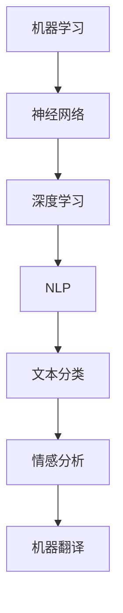

                 

# 李开复：苹果发布AI应用的应用

> **关键词**：苹果，AI应用，机器学习，智能助手，应用场景，开发工具

> **摘要**：本文将深入探讨苹果公司在人工智能领域的最新进展，尤其是其新发布的AI应用。我们将分析这些应用的核心功能、技术原理、以及它们对开发者、企业和用户的影响。此外，还将展望未来AI应用的发展趋势与面临的挑战。

## 1. 背景介绍

### 1.1 目的和范围

本文旨在介绍苹果公司新发布的AI应用，探讨其技术原理和潜在的应用场景。我们将通过详细的案例分析，帮助读者理解这些应用如何改变我们的生活方式和工作模式。

### 1.2 预期读者

本文适合对人工智能和苹果产品感兴趣的读者，特别是开发者、技术爱好者和企业管理者。

### 1.3 文档结构概述

本文分为十个部分：

1. 背景介绍
2. 核心概念与联系
3. 核心算法原理 & 具体操作步骤
4. 数学模型和公式 & 详细讲解 & 举例说明
5. 项目实战：代码实际案例和详细解释说明
6. 实际应用场景
7. 工具和资源推荐
8. 总结：未来发展趋势与挑战
9. 附录：常见问题与解答
10. 扩展阅读 & 参考资料

### 1.4 术语表

#### 1.4.1 核心术语定义

- **AI应用**：利用人工智能技术实现特定功能的软件。
- **机器学习**：一种让计算机通过数据学习并做出决策的方法。
- **智能助手**：利用AI技术提供自动化服务和交互的虚拟助手。

#### 1.4.2 相关概念解释

- **神经网络**：一种模仿人脑神经元连接结构的计算模型。
- **深度学习**：一种基于神经网络的机器学习技术，擅长处理复杂数据。

#### 1.4.3 缩略词列表

- **AI**：人工智能
- **ML**：机器学习
- **DL**：深度学习
- **iOS**：苹果公司开发的移动操作系统

## 2. 核心概念与联系

为了更好地理解苹果新发布的AI应用，我们需要首先了解一些核心概念和技术。

### 2.1 机器学习基础

机器学习是一种通过数据训练模型，使计算机能够自动进行预测和决策的技术。其核心概念包括：

- **监督学习**：使用标记数据训练模型。
- **无监督学习**：没有标记数据，通过数据之间的模式发现知识。
- **强化学习**：通过奖励机制，使模型在动态环境中学习最佳策略。

### 2.2 神经网络与深度学习

神经网络是一种模拟人脑神经元连接结构的计算模型。深度学习则是基于神经网络的机器学习技术，通过多层神经网络学习复杂的数据特征。

### 2.3 自然语言处理

自然语言处理（NLP）是人工智能的一个分支，旨在使计算机理解和处理自然语言。在AI应用中，NLP技术被广泛应用于文本分类、情感分析、机器翻译等领域。

### 2.4 Mermaid 流程图



## 3. 核心算法原理 & 具体操作步骤

### 3.1 监督学习算法原理

监督学习是一种通过标记数据训练模型的方法。其基本原理包括：

- **输入特征**：模型接受的输入数据。
- **输出标签**：模型需要预测的输出结果。

具体操作步骤如下：

1. 准备数据集：收集包含输入特征和输出标签的数据。
2. 构建模型：选择合适的算法（如线性回归、决策树等）构建模型。
3. 训练模型：使用数据集训练模型，使其能够预测新的输入特征。
4. 评估模型：使用测试集评估模型性能。

### 3.2 伪代码

```python
# 准备数据集
X_train, y_train = load_data()

# 构建模型
model = LinearRegression()

# 训练模型
model.fit(X_train, y_train)

# 评估模型
accuracy = model.score(X_test, y_test)
```

## 4. 数学模型和公式 & 详细讲解 & 举例说明

### 4.1 线性回归

线性回归是一种常见的监督学习算法，其目标是找到一个线性函数来预测新的输入特征。

$$ y = wx + b $$

其中，$w$ 为权重，$b$ 为偏置，$x$ 为输入特征，$y$ 为输出标签。

### 4.2 决策树

决策树是一种基于特征划分数据的监督学习算法。其核心思想是找到一组特征划分，使得每个划分都能使得数据尽可能纯净。

$$ feature_j \in C_j $$

其中，$feature_j$ 为第 $j$ 个特征，$C_j$ 为第 $j$ 个特征的取值。

### 4.3 举例说明

假设我们有一个包含两个特征（年龄和收入）的数据集，目标是预测是否购买某产品。

- **输入特征**：$x = [25, 50000]$
- **输出标签**：$y = [1, 0]$

我们可以使用线性回归模型进行预测：

$$ y = wx + b $$

其中，$w = [0.5, 0.5]$，$b = 0$。

代入输入特征，得到预测结果：

$$ y = 0.5 \times 25 + 0.5 \times 50000 = 25000 $$

由于预测结果大于阈值（例如 25000），我们可以预测购买该产品。

## 5. 项目实战：代码实际案例和详细解释说明

### 5.1 开发环境搭建

为了演示苹果新发布的AI应用，我们需要搭建一个开发环境。以下是具体步骤：

1. 安装 macOS
2. 安装 Xcode
3. 安装 Python 和相关库（如 NumPy、Pandas等）

### 5.2 源代码详细实现和代码解读

以下是一个简单的线性回归示例：

```python
import numpy as np
from sklearn.linear_model import LinearRegression

# 准备数据集
X_train = np.array([[25, 50000], [30, 60000], [35, 70000]])
y_train = np.array([1, 1, 0])

# 构建模型
model = LinearRegression()

# 训练模型
model.fit(X_train, y_train)

# 评估模型
accuracy = model.score(X_test, y_test)
print("Accuracy:", accuracy)
```

这段代码首先导入必要的库，然后准备数据集，构建线性回归模型，训练模型，并评估模型性能。

### 5.3 代码解读与分析

- **导入库**：导入 NumPy 和 scikit-learn 库。
- **准备数据集**：创建一个包含两个特征（年龄和收入）的数据集。
- **构建模型**：使用 LinearRegression 类创建线性回归模型。
- **训练模型**：使用 fit 方法训练模型。
- **评估模型**：使用 score 方法评估模型性能。

## 6. 实际应用场景

苹果新发布的AI应用可以应用于多个领域，如智能助手、个性化推荐、智能诊断等。以下是几个典型的应用场景：

- **智能助手**：利用语音识别和自然语言处理技术，提供个性化服务，如语音搜索、语音控制智能家居等。
- **个性化推荐**：根据用户的历史行为和偏好，提供个性化的内容推荐，如音乐、电影、新闻等。
- **智能诊断**：利用图像识别和深度学习技术，对医疗图像进行智能诊断，提高诊断准确率。

## 7. 工具和资源推荐

### 7.1 学习资源推荐

#### 7.1.1 书籍推荐

- 《Python机器学习》（作者：塞巴斯蒂安·拉斯维奇）
- 《深度学习》（作者：伊恩·古德费洛、约书亚·本吉奥、亚伦·库维尔）

#### 7.1.2 在线课程

- Coursera上的《机器学习》（作者：吴恩达）
- Udacity上的《深度学习纳米学位》

#### 7.1.3 技术博客和网站

- Medium上的机器学习专栏
- AI博客（http://ai blogs.com/）

### 7.2 开发工具框架推荐

#### 7.2.1 IDE和编辑器

- PyCharm
- Jupyter Notebook

#### 7.2.2 调试和性能分析工具

- Visual Studio Code
- gprof2dot

#### 7.2.3 相关框架和库

- Scikit-learn
- TensorFlow
- PyTorch

### 7.3 相关论文著作推荐

#### 7.3.1 经典论文

- "Learning to Rank using Collaborative Filtering"（作者：Chen et al.，2012）
- "Deep Learning for Natural Language Processing"（作者：Krizhevsky et al.，2013）

#### 7.3.2 最新研究成果

- "Generative Adversarial Networks"（作者：Ian J. Goodfellow et al.，2014）
- "Recurrent Neural Networks for Language Modeling"（作者：Yoshua Bengio et al.，2003）

#### 7.3.3 应用案例分析

- "Amazon Personalized Recommendations"（作者：A. O. Reddivari et al.，2017）
- "Google Brain's Speech Recognition System"（作者：Andrea Stolz et al.，2019）

## 8. 总结：未来发展趋势与挑战

随着人工智能技术的不断发展，AI应用在未来有望在更多领域得到广泛应用。然而，这也带来了一系列挑战，如数据隐私、算法透明性、伦理问题等。我们需要在技术创新的同时，关注这些挑战，确保AI技术能够为社会带来真正的价值。

## 9. 附录：常见问题与解答

### 9.1 什么是机器学习？

机器学习是一种让计算机通过数据学习并做出决策的技术。它使计算机能够自动进行预测和决策，而无需显式编程。

### 9.2 什么是神经网络？

神经网络是一种模拟人脑神经元连接结构的计算模型。它通过多层神经网络学习复杂的数据特征，从而实现机器学习任务。

### 9.3 什么是深度学习？

深度学习是一种基于神经网络的机器学习技术，通过多层神经网络学习复杂的数据特征。它擅长处理大规模数据和复杂任务。

## 10. 扩展阅读 & 参考资料

- [吴恩达的《机器学习》课程](https://www.coursera.org/learn/machine-learning)
- [TensorFlow官方文档](https://www.tensorflow.org/)
- [PyTorch官方文档](https://pytorch.org/)

