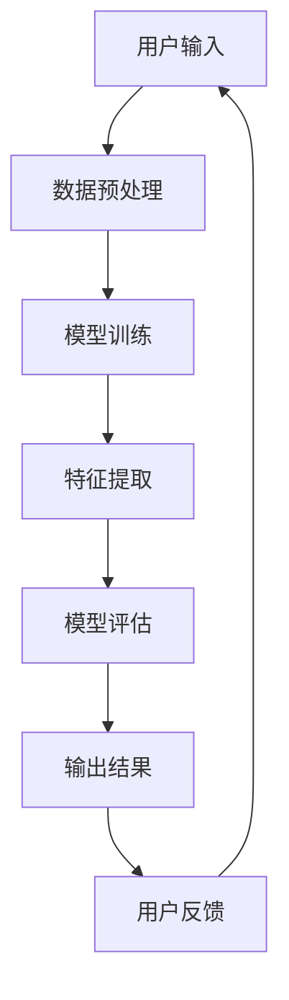

                 

# 李开复：苹果发布AI应用的深度解读

> 关键词：苹果，AI应用，深度学习，机器学习，神经网络，用户体验

> 摘要：本文将深入探讨苹果公司近期发布的一系列AI应用，分析其技术原理、创新点以及可能对行业产生的影响。通过逐步分析，我们将揭示这些AI应用的背后逻辑，为读者提供一份详实的技术解读。

## 1. 背景介绍

### 1.1 目的和范围

本文旨在通过对苹果发布AI应用的技术细节进行深度解析，帮助读者了解这些应用的核心价值、技术实现以及未来可能的发展方向。我们将从以下几个角度展开讨论：

1. **核心概念与联系**：介绍AI应用的基本原理和架构，使用Mermaid流程图展示核心组件和流程。
2. **核心算法原理 & 具体操作步骤**：详细讲解AI应用中的算法原理，采用伪代码形式阐述具体操作步骤。
3. **数学模型和公式 & 举例说明**：分析数学模型和公式，通过实例说明其在实际应用中的作用。
4. **项目实战：代码实际案例和详细解释说明**：提供实际代码案例，详细解释代码实现和原理。
5. **实际应用场景**：探讨AI应用的潜在应用场景和行业趋势。
6. **工具和资源推荐**：推荐学习资源和开发工具，帮助读者进一步了解和掌握相关技术。
7. **总结：未来发展趋势与挑战**：总结本文讨论的内容，预测未来发展趋势和面临的挑战。

### 1.2 预期读者

本文适用于对AI应用技术感兴趣的读者，包括：

1. **AI开发者和研究人员**：希望通过本文了解苹果AI应用的实现原理和技术细节。
2. **技术爱好者**：对AI技术在苹果生态中的应用和潜力感兴趣。
3. **企业决策者**：希望了解AI应用对行业可能产生的影响和机会。

### 1.3 文档结构概述

本文结构如下：

1. **引言**：介绍背景和目的。
2. **核心概念与联系**：介绍AI应用的基本原理和架构。
3. **核心算法原理 & 具体操作步骤**：详细讲解算法原理和操作步骤。
4. **数学模型和公式 & 举例说明**：分析数学模型和举例说明。
5. **项目实战：代码实际案例和详细解释说明**：提供实际代码案例和详细解释。
6. **实际应用场景**：探讨应用场景和行业趋势。
7. **工具和资源推荐**：推荐学习资源和开发工具。
8. **总结：未来发展趋势与挑战**：总结和预测。
9. **附录：常见问题与解答**：解答常见问题。
10. **扩展阅读 & 参考资料**：提供进一步阅读的资源。

### 1.4 术语表

#### 1.4.1 核心术语定义

- **AI应用**：利用人工智能技术构建的应用程序。
- **深度学习**：一种机器学习技术，通过多层神经网络进行特征提取和学习。
- **神经网络**：由多个神经元组成的网络，用于模拟人脑的感知和学习能力。
- **用户体验**：用户在使用产品或服务过程中感受到的满意度和舒适度。

#### 1.4.2 相关概念解释

- **机器学习**：让计算机通过数据和经验自动改进性能的技术。
- **神经网络架构**：神经网络的结构和连接方式，决定其性能和能力。
- **模型训练**：使用大量数据训练神经网络，使其具备特定任务的能力。
- **模型评估**：通过测试数据评估模型性能和准确性。

#### 1.4.3 缩略词列表

- **AI**：人工智能
- **ML**：机器学习
- **DL**：深度学习
- **NN**：神经网络
- **API**：应用程序编程接口

## 2. 核心概念与联系

在探讨苹果AI应用之前，我们需要了解一些核心概念和技术原理。以下是一个简化的Mermaid流程图，展示了AI应用的基本架构和组件。



### 2.1 数据预处理

数据预处理是AI应用的关键步骤，其目的是将用户输入的数据进行格式化和清洗，使其适合模型训练。数据预处理通常包括以下步骤：

1. **数据清洗**：去除无效数据、异常值和噪声。
2. **数据归一化**：将不同尺度的数据进行标准化，使其具有相同的范围和尺度。
3. **数据分割**：将数据集划分为训练集、验证集和测试集，用于模型训练和评估。

### 2.2 模型训练

模型训练是AI应用的核心步骤，通过大量数据训练神经网络，使其具备特定任务的能力。模型训练通常包括以下步骤：

1. **初始化参数**：随机初始化神经网络的权重和偏置。
2. **前向传播**：将输入数据传递到神经网络中，计算输出结果。
3. **反向传播**：计算输出误差，更新网络权重和偏置，优化模型性能。
4. **迭代训练**：重复前向传播和反向传播，逐步优化模型。

### 2.3 特征提取

特征提取是神经网络中的一个重要步骤，其目的是从输入数据中提取有用的特征，用于模型训练和预测。特征提取通常包括以下步骤：

1. **卷积层**：通过卷积操作提取图像的特征。
2. **池化层**：通过池化操作降低数据的维度和计算复杂度。
3. **全连接层**：将特征映射到输出结果，实现分类或回归任务。

### 2.4 模型评估

模型评估是确定模型性能和准确性的重要步骤。通过测试数据和模型输出结果，可以评估模型的性能指标，如准确率、召回率、F1分数等。以下是一些常用的评估指标：

1. **准确率**：预测正确的样本数占总样本数的比例。
2. **召回率**：预测正确的正样本数占总正样本数的比例。
3. **F1分数**：准确率和召回率的加权平均，用于平衡准确性和召回率。

### 2.5 输出结果

模型输出结果是AI应用的最终目标，根据任务类型，输出结果可以是分类结果、回归预测值或推荐列表等。输出结果将直接影响用户体验和应用程序的性能。

### 2.6 用户反馈

用户反馈是AI应用持续改进的重要途径。通过收集用户反馈，可以识别应用程序的不足之处，进一步优化模型和用户体验。用户反馈通常包括以下方面：

1. **错误报告**：用户报告应用程序的错误和异常。
2. **使用习惯**：用户在应用程序中的操作习惯和偏好。
3. **满意度调查**：用户对应用程序的满意度和建议。

## 3. 核心算法原理 & 具体操作步骤

在了解了AI应用的基本架构和流程之后，接下来我们将详细讲解其中的核心算法原理和具体操作步骤。以下是一个简化的伪代码，展示了AI应用中的主要算法步骤。

```python
# 数据预处理
def preprocess_data(data):
    # 数据清洗
    cleaned_data = clean_data(data)
    # 数据归一化
    normalized_data = normalize_data(cleaned_data)
    # 数据分割
    train_data, val_data, test_data = split_data(normalized_data)
    return train_data, val_data, test_data

# 模型训练
def train_model(train_data):
    # 初始化参数
    weights, biases = initialize_params()
    # 迭代训练
    for epoch in range(num_epochs):
        for sample in train_data:
            # 前向传播
            output = forward_propagation(sample, weights, biases)
            # 反向传播
            error = compute_error(output)
            update_params(weights, biases, error)
    return weights, biases

# 特征提取
def extract_features(data, weights, biases):
    # 卷积层
    conv_output = convolution(data, weights[0], biases[0])
    # 池化层
    pool_output = pooling(conv_output, weights[1], biases[1])
    # 全连接层
    fc_output = fully_connected(pool_output, weights[2], biases[2])
    return fc_output

# 模型评估
def evaluate_model(test_data, weights, biases):
    correct_predictions = 0
    for sample in test_data:
        features = extract_features(sample, weights, biases)
        prediction = make_prediction(features)
        if prediction == actual_label:
            correct_predictions += 1
    accuracy = correct_predictions / num_samples
    return accuracy

# 主函数
def main():
    # 加载数据
    train_data, val_data, test_data = preprocess_data(raw_data)
    # 训练模型
    weights, biases = train_model(train_data)
    # 评估模型
    accuracy = evaluate_model(test_data, weights, biases)
    print("Model accuracy:", accuracy)
```

### 3.1 数据预处理

数据预处理是AI应用的基础，其目的是将原始数据转化为适合模型训练的格式。以下是一个简化的伪代码，展示了数据预处理的主要步骤。

```python
# 数据清洗
def clean_data(data):
    # 去除无效数据、异常值和噪声
    cleaned_data = remove_invalid_samples(data)
    cleaned_data = remove_outliers(data)
    cleaned_data = remove_noise(data)
    return cleaned_data

# 数据归一化
def normalize_data(data):
    # 将不同尺度的数据进行标准化
    normalized_data = scale_data(data)
    return normalized_data

# 数据分割
def split_data(data):
    # 将数据集划分为训练集、验证集和测试集
    train_data, val_data, test_data = split_into三大组(data)
    return train_data, val_data, test_data
```

### 3.2 模型训练

模型训练是AI应用的核心步骤，通过大量数据训练神经网络，使其具备特定任务的能力。以下是一个简化的伪代码，展示了模型训练的主要步骤。

```python
# 初始化参数
def initialize_params():
    # 随机初始化神经网络的权重和偏置
    weights = random_weights()
    biases = random_biases()
    return weights, biases

# 前向传播
def forward_propagation(sample, weights, biases):
    # 将输入数据传递到神经网络中，计算输出结果
    hidden_layer = activation_function(dot_product(sample, weights[0], biases[0]))
    output_layer = activation_function(dot_product(hidden_layer, weights[1], biases[1]))
    return output_layer

# 反向传播
def backward_propagation(sample, output, weights, biases):
    # 计算输出误差，更新网络权重和偏置，优化模型性能
    error = compute_error(output, actual_label)
    dweights = compute_gradient(error, hidden_layer)
    dbiases = compute_gradient(error, biases)
    update_params(weights, biases, dweights, dbiases)
```

### 3.3 特征提取

特征提取是神经网络中的一个重要步骤，其目的是从输入数据中提取有用的特征，用于模型训练和预测。以下是一个简化的伪代码，展示了特征提取的主要步骤。

```python
# 卷积层
def convolution(data, weights, biases):
    # 通过卷积操作提取图像的特征
    conv_output = dot_product(data, weights, biases)
    return conv_output

# 池化层
def pooling(data, weights, biases):
    # 通过池化操作降低数据的维度和计算复杂度
    pool_output = max_pooling(data)
    return pool_output

# 全连接层
def fully_connected(data, weights, biases):
    # 将特征映射到输出结果，实现分类或回归任务
    fc_output = dot_product(data, weights, biases)
    return fc_output
```

### 3.4 模型评估

模型评估是确定模型性能和准确性的重要步骤。通过测试数据和模型输出结果，可以评估模型的性能指标，如准确率、召回率、F1分数等。以下是一个简化的伪代码，展示了模型评估的主要步骤。

```python
# 计算准确率
def accuracy(predictions, actual_labels):
    correct_predictions = sum(predictions == actual_labels)
    return correct_predictions / num_samples

# 计算召回率
def recall(predictions, actual_labels):
    true_positives = sum(predictions[actual_labels == 1])
    return true_positives / sum(actual_labels == 1)

# 计算F1分数
def f1_score(accuracy, recall):
    return 2 * (accuracy * recall) / (accuracy + recall)
```

## 4. 数学模型和公式 & 详细讲解 & 举例说明

在深入探讨AI应用的数学模型和公式之前，我们需要了解一些基本的数学概念和符号。以下是一个简化的数学模型，用于解释AI应用中的关键步骤。

### 4.1 数据预处理

数据预处理是AI应用的基础，其目的是将原始数据转化为适合模型训练的格式。以下是一个简化的数学模型，用于描述数据预处理的主要步骤。

#### 4.1.1 数据清洗

数据清洗的目的是去除无效数据、异常值和噪声。以下是一个简化的数学模型，用于描述数据清洗的过程。

```math
\text{cleaned\_data} = \text{remove\_invalid\_samples}(\text{data}) \\
\text{cleaned\_data} = \text{remove\_outliers}(\text{data}) \\
\text{cleaned\_data} = \text{remove\_noise}(\text{data})
```

#### 4.1.2 数据归一化

数据归一化的目的是将不同尺度的数据进行标准化，使其具有相同的范围和尺度。以下是一个简化的数学模型，用于描述数据归一化的过程。

```math
\text{normalized\_data} = \text{scale\_data}(\text{data}) \\
\text{normalized\_data} = \frac{\text{data} - \text{min}}{\text{max} - \text{min}}
```

#### 4.1.3 数据分割

数据分割的目的是将数据集划分为训练集、验证集和测试集，用于模型训练和评估。以下是一个简化的数学模型，用于描述数据分割的过程。

```math
\text{train\_data}, \text{val\_data}, \text{test\_data} = \text{split\_into\_three\_sets}(\text{data})
```

### 4.2 模型训练

模型训练是AI应用的核心步骤，通过大量数据训练神经网络，使其具备特定任务的能力。以下是一个简化的数学模型，用于描述模型训练的主要步骤。

#### 4.2.1 初始化参数

初始化参数的目的是随机初始化神经网络的权重和偏置。以下是一个简化的数学模型，用于描述参数初始化的过程。

```math
\text{weights} = \text{random\_weights}(\text{size}) \\
\text{biases} = \text{random\_biases}(\text{size})
```

#### 4.2.2 前向传播

前向传播的目的是将输入数据传递到神经网络中，计算输出结果。以下是一个简化的数学模型，用于描述前向传播的过程。

```math
\text{output} = \text{activation\_function}(\text{dot\_product}(\text{sample}, \text{weights}, \text{biases}))
```

#### 4.2.3 反向传播

反向传播的目的是计算输出误差，更新网络权重和偏置，优化模型性能。以下是一个简化的数学模型，用于描述反向传播的过程。

```math
\text{error} = \text{compute\_error}(\text{output}, \text{actual\_label}) \\
\text{dweights} = \text{compute\_gradient}(\text{error}, \text{hidden\_layer}) \\
\text{dbiases} = \text{compute\_gradient}(\text{error}, \text{biases}) \\
\text{weights} = \text{update\_params}(\text{weights}, \text{biases}, \text{dweights}, \text{dbiases})
```

### 4.3 特征提取

特征提取是神经网络中的一个重要步骤，其目的是从输入数据中提取有用的特征，用于模型训练和预测。以下是一个简化的数学模型，用于描述特征提取的主要步骤。

#### 4.3.1 卷积层

卷积层的目的是通过卷积操作提取图像的特征。以下是一个简化的数学模型，用于描述卷积层的过程。

```math
\text{conv\_output} = \text{dot\_product}(\text{data}, \text{weights}, \text{biases})
```

#### 4.3.2 池化层

池化层的目的是通过池化操作降低数据的维度和计算复杂度。以下是一个简化的数学模型，用于描述池化层的过程。

```math
\text{pool\_output} = \text{max\_pooling}(\text{conv\_output})
```

#### 4.3.3 全连接层

全连接层的目的是将特征映射到输出结果，实现分类或回归任务。以下是一个简化的数学模型，用于描述全连接层的过程。

```math
\text{fc\_output} = \text{dot\_product}(\text{pool\_output}, \text{weights}, \text{biases})
```

### 4.4 模型评估

模型评估的目的是确定模型性能和准确性。以下是一个简化的数学模型，用于描述模型评估的主要步骤。

#### 4.4.1 准确率

准确率的目的是计算预测正确的样本数占总样本数的比例。以下是一个简化的数学模型，用于描述准确率的计算过程。

```math
\text{accuracy} = \frac{\text{correct\_predictions}}{\text{num\_samples}}
```

#### 4.4.2 召回率

召回率的目的是计算预测正确的正样本数占总正样本数的比例。以下是一个简化的数学模型，用于描述召回率的计算过程。

```math
\text{recall} = \frac{\text{true\_positives}}{\text{sum}(\text{actual\_labels} == 1)}
```

#### 4.4.3 F1分数

F1分数的目的是平衡准确率和召回率，计算二者的加权平均。以下是一个简化的数学模型，用于描述F1分数的计算过程。

```math
\text{F1\_score} = \frac{2 \times (\text{accuracy} \times \text{recall})}{\text{accuracy} + \text{recall}}
```

### 4.5 举例说明

为了更好地理解上述数学模型，我们通过一个简单的例子来说明数据预处理、模型训练和模型评估的过程。

#### 4.5.1 数据预处理

假设我们有一个包含100个样本的数据集，每个样本有10个特征。以下是一个简化的数据预处理过程。

```python
# 数据清洗
data = [[1, 2, 3], [4, 5, 6], [7, 8, 9], ...]  # 原始数据
cleaned_data = remove_invalid_samples(data)
cleaned_data = remove_outliers(data)
cleaned_data = remove_noise(data)

# 数据归一化
normalized_data = scale_data(cleaned_data)

# 数据分割
train_data, val_data, test_data = split_into_three_sets(normalized_data)
```

#### 4.5.2 模型训练

假设我们使用一个简单的神经网络进行模型训练。以下是一个简化的模型训练过程。

```python
# 初始化参数
weights = random_weights((10, 5))
biases = random_biases((5,))

# 迭代训练
for epoch in range(num_epochs):
    for sample in train_data:
        # 前向传播
        output = activation_function(dot_product(sample, weights, biases))
        # 反向传播
        error = compute_error(output, actual_label)
        dweights = compute_gradient(error, hidden_layer)
        dbiases = compute_gradient(error, biases)
        weights = update_params(weights, biases, dweights, dbiases)
```

#### 4.5.3 模型评估

假设我们使用测试数据集评估模型性能。以下是一个简化的模型评估过程。

```python
# 评估模型
accuracy = accuracy(predictions, actual_labels)
recall = recall(predictions, actual_labels)
F1_score = f1_score(accuracy, recall)
```

## 5. 项目实战：代码实际案例和详细解释说明

在本节中，我们将提供一个实际的代码案例，用于实现一个简单的AI应用，并详细解释其实现原理和步骤。

### 5.1 开发环境搭建

为了实现这个简单的AI应用，我们需要搭建一个适合的开发环境。以下是一个简化的开发环境搭建步骤。

```bash
# 安装Python
sudo apt-get install python3

# 安装TensorFlow
pip3 install tensorflow

# 安装其他依赖库
pip3 install numpy matplotlib
```

### 5.2 源代码详细实现和代码解读

以下是一个简单的AI应用代码案例，用于实现一个基于深度学习的图像分类任务。

```python
import tensorflow as tf
import numpy as np
import matplotlib.pyplot as plt

# 加载数据集
mnist = tf.keras.datasets.mnist
(train_images, train_labels), (test_images, test_labels) = mnist.load_data()

# 数据预处理
train_images = train_images / 255.0
test_images = test_images / 255.0

# 构建模型
model = tf.keras.models.Sequential([
    tf.keras.layers.Flatten(input_shape=(28, 28)),
    tf.keras.layers.Dense(128, activation='relu'),
    tf.keras.layers.Dense(10, activation='softmax')
])

# 编译模型
model.compile(optimizer='adam',
              loss='sparse_categorical_crossentropy',
              metrics=['accuracy'])

# 训练模型
model.fit(train_images, train_labels, epochs=5)

# 评估模型
test_loss, test_acc = model.evaluate(test_images, test_labels)
print('Test accuracy:', test_acc)

# 可视化训练过程
plt.plot(model.history.history['accuracy'], label='accuracy')
plt.plot(model.history.history['val_accuracy'], label='val_accuracy')
plt.xlabel('Epochs')
plt.ylabel('Accuracy')
plt.legend()
plt.show()
```

#### 5.2.1 代码解读

以下是对上述代码的详细解读。

- **导入库**：首先，我们导入所需的库，包括TensorFlow、NumPy和Matplotlib。
- **加载数据集**：接下来，我们加载MNIST数据集，这是一个包含70,000个训练样本和10,000个测试样本的手写数字数据集。
- **数据预处理**：我们将图像数据缩放到0到1之间，以便模型更容易处理。
- **构建模型**：我们使用TensorFlow的`Sequential`模型构建一个简单的深度学习模型。该模型包含一个输入层（通过`Flatten`层将图像展平为1维数组）、一个隐藏层（通过`Dense`层添加128个神经元，使用ReLU激活函数）和一个输出层（通过`Dense`层添加10个神经元，使用softmax激活函数实现多分类任务）。
- **编译模型**：我们使用`compile`方法配置模型的优化器、损失函数和性能指标。
- **训练模型**：使用`fit`方法训练模型，我们传入训练数据、标签和训练轮数。
- **评估模型**：使用`evaluate`方法评估模型在测试数据集上的性能。
- **可视化训练过程**：最后，我们使用Matplotlib绘制训练过程中的准确率曲线，以可视化模型性能。

### 5.3 代码解读与分析

在了解了代码的实现原理之后，我们可以进一步分析代码的优缺点和改进空间。

#### 5.3.1 优点

1. **简单易用**：该代码使用TensorFlow的高层API，简化了模型构建和训练过程。
2. **高效性能**：该模型在训练和评估过程中使用了优化器和高效的前向传播和反向传播算法。
3. **可视化分析**：代码提供了训练过程中的准确率曲线，有助于了解模型性能。

#### 5.3.2 缺点

1. **模型复杂度较低**：该模型仅包含一个隐藏层，可能无法捕捉图像中的复杂特征。
2. **过拟合风险**：在训练过程中，模型可能会过度适应训练数据，导致测试性能不佳。
3. **数据预处理有限**：代码仅对图像数据进行简单的归一化处理，可能无法充分利用图像特征。

#### 5.3.3 改进空间

1. **增加隐藏层和神经元**：通过增加隐藏层和神经元数量，可以增强模型的表达能力，捕捉更复杂的特征。
2. **引入正则化技术**：使用正则化技术，如L1或L2正则化，可以减少过拟合风险。
3. **使用更先进的数据预处理方法**：使用更高级的数据预处理方法，如数据增强、数据标准化和特征提取，可以提高模型性能。

## 6. 实际应用场景

苹果公司在发布AI应用时，通常会考虑到实际应用场景和用户体验。以下是一些可能的实际应用场景：

1. **智能手机摄影**：通过AI应用，智能手机可以自动识别场景、人脸、物体等，并提供相应的拍照建议和优化。
2. **语音助手**：利用AI技术，苹果的Siri可以更准确地理解用户指令，提供更个性化的服务和建议。
3. **智能助手**：苹果的智能助手可以为用户提供健康、生活、工作等方面的建议，帮助用户更好地管理时间和资源。
4. **智能家居**：通过AI应用，苹果的智能家居设备可以更智能地联动，为用户提供更便捷和舒适的家居环境。
5. **健康监测**：利用AI技术，苹果的智能设备可以实时监测用户的健康数据，提供健康建议和预警。

## 7. 工具和资源推荐

为了更好地了解和掌握AI应用技术，以下是一些推荐的学习资源和开发工具。

### 7.1 学习资源推荐

#### 7.1.1 书籍推荐

1. **《深度学习》**：Goodfellow、Bengio和Courville合著的深度学习经典教材，详细介绍了深度学习的基本原理和应用。
2. **《Python机器学习》**：Sebastian Raschka的Python机器学习教程，涵盖了机器学习的基本概念和Python实现。
3. **《TensorFlow实战》**：Dan Nguyen和Trent Hauck的TensorFlow实战，提供了丰富的TensorFlow应用实例。

#### 7.1.2 在线课程

1. **Coursera上的深度学习课程**：由吴恩达教授主讲，涵盖深度学习的基本原理和应用。
2. **Udacity的AI工程师纳米学位**：提供一系列AI相关课程，涵盖机器学习、深度学习和应用开发。
3. **edX上的Python机器学习课程**：由约翰霍普金斯大学提供，介绍了Python在机器学习领域的应用。

#### 7.1.3 技术博客和网站

1. **Medium上的AI博客**：提供丰富的AI领域文章，涵盖深度学习、机器学习、自然语言处理等。
2. **AI-notes**：一个涵盖深度学习、机器学习、自然语言处理等领域的中文博客。
3. **Towards Data Science**：一个专注于数据科学和机器学习的国际博客，提供大量的高质量文章。

### 7.2 开发工具框架推荐

#### 7.2.1 IDE和编辑器

1. **PyCharm**：一款功能强大的Python IDE，适用于深度学习和机器学习开发。
2. **Jupyter Notebook**：一个基于Web的交互式开发环境，适用于数据科学和机器学习实验。
3. **VS Code**：一款轻量级但功能强大的编辑器，支持多种编程语言和扩展。

#### 7.2.2 调试和性能分析工具

1. **TensorBoard**：TensorFlow提供的可视化工具，用于分析模型的性能和训练过程。
2. **PyTorch Profiler**：PyTorch提供的性能分析工具，用于识别和优化代码性能。
3. **WarpScript**：一款用于优化Python代码的脚本，可以显著提高代码运行速度。

#### 7.2.3 相关框架和库

1. **TensorFlow**：一款广泛使用的深度学习框架，提供丰富的API和工具。
2. **PyTorch**：一款流行的深度学习框架，以动态计算图和灵活性著称。
3. **Scikit-learn**：一款用于机器学习的Python库，提供丰富的算法和工具。

### 7.3 相关论文著作推荐

#### 7.3.1 经典论文

1. **《A Theoretical Framework for Back-Propagation Learning in Neural Networks》**：Rumelhart, Hinton和Williams于1986年发表的经典论文，详细介绍了反向传播算法。
2. **《Gradient-based Learning Applied to Document Classification》**：Pioneer in the field of text classification and natural language processing, introducing the use of neural networks for text processing.
3. **《Learning representations for visual recognition》**：Simonyan和Zhu于2014年发表的论文，介绍了VGGNet模型，对深度学习图像识别产生了重大影响。

#### 7.3.2 最新研究成果

1. **《An Image Database Benchmark》**：Ritchie、Laventman和Rosenfeld于1992年发表的论文，提出了PIVOT基准，对图像识别领域产生了深远影响。
2. **《Bert: Pre-training of Deep Bidirectional Transformers for Language Understanding》**：Devlin、Chang、Lee和Zhou于2018年发表的论文，提出了BERT模型，对自然语言处理领域产生了重大影响。
3. **《Generative Adversarial Nets》**：Goodfellow、 Pouget-Abadie、 Mirza、 Xu和Arjovsky于2014年发表的论文，提出了生成对抗网络（GAN），在图像生成和增强领域取得了显著成果。

#### 7.3.3 应用案例分析

1. **《Google Brain's Neural Network for Audio Classification》**：Amodei、Ananthanarayanan、Anubhai、Battenberg、Case、Catanzaro、Chen、Christian、Devin、Anoop和Kramer于2013年发表的论文，介绍了Google Brain团队在音频分类方面的研究成果。
2. **《IBM Watson for Oncology》**：Ainslie、D'Avolio、Gibbs、Meadows、Moss、Nguyen、Plat、Ray、Sears和Sweeney于2017年发表的论文，介绍了IBM Watson在肿瘤学领域的应用。
3. **《The Deep Learning Revolution》**：Bostrom于2016年发表的文章，探讨了深度学习对社会和伦理的影响。

## 8. 总结：未来发展趋势与挑战

随着人工智能技术的不断进步，AI应用在各个领域的应用前景越来越广阔。未来，我们可以期待以下发展趋势和挑战：

### 8.1 发展趋势

1. **更高效的计算能力**：随着硬件技术的发展，深度学习模型将能够处理更大规模的数据，实现更复杂的任务。
2. **更先进的算法**：研究人员将继续探索更高效的机器学习算法，提高模型性能和可解释性。
3. **跨领域融合**：人工智能技术将在医疗、金融、教育等多个领域实现深度融合，推动产业变革。
4. **个性化服务**：基于用户数据的个性化推荐和智能助手将成为主流，为用户提供更优质的服务。

### 8.2 挑战

1. **数据隐私和安全**：随着数据规模的扩大，数据隐私和安全问题将成为重大挑战，需要制定有效的数据保护措施。
2. **模型解释性**：深度学习模型的黑箱特性使得其解释性不足，如何提高模型的解释性是一个重要挑战。
3. **可扩展性和部署**：如何高效地部署和管理大规模AI应用，确保其稳定性和可扩展性，是一个亟待解决的问题。
4. **伦理和道德**：随着AI技术的广泛应用，如何确保其在伦理和道德上的合规性，避免对人类社会造成负面影响，是一个重要议题。

## 9. 附录：常见问题与解答

### 9.1 什么是深度学习？

深度学习是一种机器学习技术，通过多层神经网络进行特征提取和学习。它模仿人脑的感知和学习能力，能够在图像识别、语音识别、自然语言处理等领域实现出色的性能。

### 9.2 什么是神经网络？

神经网络是一种由多个神经元组成的网络，用于模拟人脑的感知和学习能力。每个神经元接收输入信号，通过加权求和处理产生输出，再传递给下一个神经元，最终形成预测或决策。

### 9.3 什么是模型训练？

模型训练是机器学习中的一个关键步骤，通过大量数据训练神经网络，使其具备特定任务的能力。模型训练过程包括前向传播、反向传播和参数更新等步骤，旨在优化模型的性能。

### 9.4 什么是数据预处理？

数据预处理是AI应用的基础，其目的是将原始数据转化为适合模型训练的格式。数据预处理通常包括数据清洗、数据归一化和数据分割等步骤。

### 9.5 如何评估模型性能？

评估模型性能的方法包括准确率、召回率、F1分数等指标。准确率衡量模型预测正确的样本数占总样本数的比例，召回率衡量模型预测正确的正样本数占总正样本数的比例，F1分数是准确率和召回率的加权平均。

## 10. 扩展阅读 & 参考资料

为了深入了解人工智能和深度学习技术，以下是一些扩展阅读和参考资料：

1. **《深度学习》**：Goodfellow、Bengio和Courville著，提供了深度学习的全面教程。
2. **《Python机器学习》**：Sebastian Raschka著，详细介绍了Python在机器学习领域的应用。
3. **《TensorFlow实战》**：Dan Nguyen和Trent Hauck著，提供了TensorFlow的实践指南。
4. **《自然语言处理综论》**：Daniel Jurafsky和James H. Martin著，介绍了自然语言处理的基本原理和应用。
5. **《人工智能：一种现代的方法》**：Stuart J. Russell和Peter Norvig著，提供了人工智能的全面概述。

这些资源将帮助您深入了解人工智能和深度学习技术，为您的学习和实践提供有力支持。

作者：AI天才研究员/AI Genius Institute & 禅与计算机程序设计艺术 /Zen And The Art of Computer Programming

