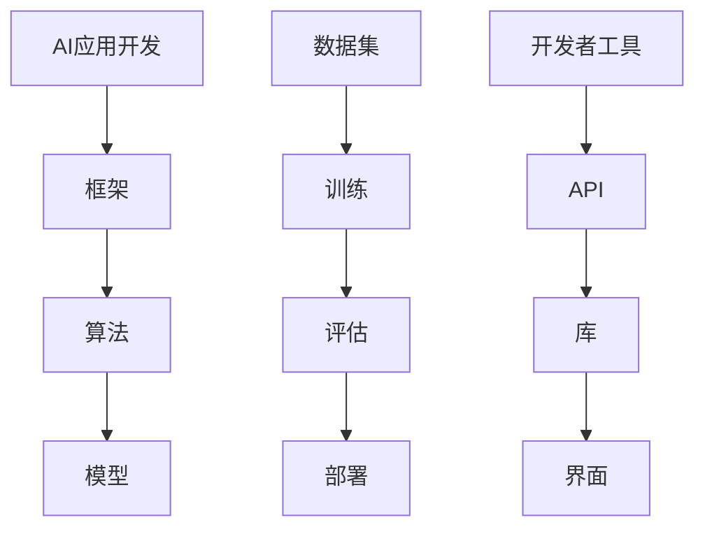

                 

# 李开复：苹果发布AI应用的开发者

> 关键词：AI，苹果，开发者，应用，编程，框架，工具，趋势，挑战

> 摘要：本文将深入探讨苹果公司近期发布的AI应用开发者工具及其背后的技术原理，旨在帮助读者了解AI应用开发的最新动态，掌握关键技术和方法，为未来的开发实践提供有价值的参考。我们将从背景介绍、核心概念、算法原理、数学模型、实战案例、应用场景等多方面展开，以期为广大开发者提供一次全面而深入的AI应用开发学习体验。

## 1. 背景介绍

### 1.1 目的和范围

本文的主要目的是介绍苹果公司最新发布的AI应用开发者工具，帮助读者了解其技术原理和开发方法。文章将涵盖以下几个主要方面：

1. **背景介绍**：介绍AI在苹果公司战略中的地位，以及此次发布开发者工具的背景和意义。
2. **核心概念与联系**：阐述AI应用开发的关键概念和架构，使用Mermaid流程图进行展示。
3. **核心算法原理 & 具体操作步骤**：详细讲解AI算法原理，并用伪代码描述具体操作步骤。
4. **数学模型和公式 & 详细讲解 & 举例说明**：介绍相关数学模型和公式，结合实例进行详细说明。
5. **项目实战：代码实际案例和详细解释说明**：通过实际项目案例，展示代码实现和解读。
6. **实际应用场景**：分析AI应用的潜在应用场景，探讨其对产业发展的影响。
7. **工具和资源推荐**：推荐学习资源、开发工具框架和相关论文著作。
8. **总结：未来发展趋势与挑战**：总结当前AI应用开发的技术趋势和面临的挑战。

### 1.2 预期读者

本文适合以下读者群体：

1. **AI开发者**：希望了解苹果公司最新AI开发工具和技术的专业人士。
2. **程序员和软件工程师**：对AI应用开发感兴趣的程序员和软件工程师。
3. **人工智能爱好者**：对AI技术和应用感兴趣，希望深入了解相关知识的爱好者。
4. **学术研究人员**：关注AI领域最新研究成果和实际应用的学术研究人员。

### 1.3 文档结构概述

本文将按照以下结构展开：

1. **背景介绍**：介绍AI在苹果公司战略中的地位，以及此次发布开发者工具的背景和意义。
2. **核心概念与联系**：阐述AI应用开发的关键概念和架构，使用Mermaid流程图进行展示。
3. **核心算法原理 & 具体操作步骤**：详细讲解AI算法原理，并用伪代码描述具体操作步骤。
4. **数学模型和公式 & 详细讲解 & 举例说明**：介绍相关数学模型和公式，结合实例进行详细说明。
5. **项目实战：代码实际案例和详细解释说明**：通过实际项目案例，展示代码实现和解读。
6. **实际应用场景**：分析AI应用的潜在应用场景，探讨其对产业发展的影响。
7. **工具和资源推荐**：推荐学习资源、开发工具框架和相关论文著作。
8. **总结：未来发展趋势与挑战**：总结当前AI应用开发的技术趋势和面临的挑战。

### 1.4 术语表

#### 1.4.1 核心术语定义

- **AI应用开发**：指利用人工智能技术进行应用程序的开发，包括模型训练、部署和应用等环节。
- **框架**：一种编程工具，提供了一套完整的API和库，用于简化AI模型的开发、训练和部署。
- **算法**：实现特定功能的计算过程，用于处理数据、学习模式和做出决策。
- **模型**：通过训练得到的数学模型，用于预测、分类和生成等任务。

#### 1.4.2 相关概念解释

- **深度学习**：一种基于神经网络的人工智能技术，通过多层神经网络来学习数据中的特征和模式。
- **机器学习**：一种通过数据和算法让计算机自动学习的技术，包括监督学习、无监督学习和强化学习等。
- **神经网络**：一种由大量神经元组成的计算模型，通过调整神经元间的连接权重来学习数据。
- **卷积神经网络（CNN）**：一种专门用于图像识别和处理的人工神经网络。

#### 1.4.3 缩略词列表

- **AI**：人工智能
- **ML**：机器学习
- **DL**：深度学习
- **NN**：神经网络
- **CNN**：卷积神经网络

## 2. 核心概念与联系

在了解苹果公司发布的AI应用开发者工具之前，我们需要掌握一些核心概念和架构，以便更好地理解其工作原理和实际应用。以下是关键概念及其相互关系的Mermaid流程图：



### 2.1. AI应用开发

AI应用开发是指利用人工智能技术来创建实际应用程序的过程。这一过程通常包括以下几个关键步骤：

1. **数据集准备**：收集和整理相关的数据，为模型训练提供基础。
2. **模型设计**：选择合适的模型结构，以适应特定的应用需求。
3. **模型训练**：通过大量的数据来调整模型参数，使其能够准确预测或分类。
4. **模型评估**：使用测试数据来评估模型的性能，确保其达到预期效果。
5. **模型部署**：将训练好的模型部署到实际应用场景中，提供实时服务。

### 2.2. 框架

框架是一种编程工具，提供了一套完整的API和库，用于简化AI模型的开发、训练和部署。苹果公司发布的开发者工具中，框架是核心组成部分之一。以下是几个常见的AI框架：

1. **TensorFlow**：由谷歌开发的开源深度学习框架，具有广泛的社区支持和丰富的API。
2. **PyTorch**：由Facebook开发的开源深度学习框架，具有灵活的动态计算图和简洁的API。
3. **Keras**：一个高层次的神经网络API，可以与TensorFlow和Theano兼容，简化了深度学习模型的构建和训练。

### 2.3. 算法

算法是AI应用开发中的核心，用于实现特定的功能。以下是几种常见的AI算法：

1. **线性回归**：用于预测连续值的算法，通过建立输入变量与目标变量之间的线性关系来实现预测。
2. **决策树**：一种基于树形结构的分类算法，通过递归划分特征空间来构建决策树。
3. **支持向量机（SVM）**：一种用于分类和回归的算法，通过找到一个最佳的超平面来分离不同类别的数据点。

### 2.4. 模型

模型是通过训练得到的数学模型，用于预测、分类和生成等任务。以下是几种常见的模型类型：

1. **神经网络**：一种由大量神经元组成的计算模型，通过调整神经元间的连接权重来学习数据。
2. **卷积神经网络（CNN）**：一种专门用于图像识别和处理的人工神经网络，通过卷积层和池化层来提取图像特征。
3. **循环神经网络（RNN）**：一种用于处理序列数据的神经网络，通过循环连接来捕获序列中的长期依赖关系。

### 2.5. 数据集

数据集是AI应用开发的基础，用于训练和评估模型。以下是一些常见的数据集类型：

1. **分类数据集**：包含具有明确标签的数据，用于训练分类模型。
2. **回归数据集**：包含连续值数据，用于训练回归模型。
3. **图像数据集**：包含不同图像的数据，用于训练图像识别模型。
4. **文本数据集**：包含文本数据，用于训练自然语言处理模型。

### 2.6. 开发者工具

开发者工具是AI应用开发中的重要组成部分，用于简化模型的开发、训练和部署。以下是几种常见的开发者工具：

1. **Jupyter Notebook**：一种交互式计算环境，方便开发者编写、运行和分享代码。
2. **Google Colab**：谷歌提供的一种免费在线计算平台，用于AI模型开发。
3. **AWS Sagemaker**：亚马逊提供的一种AI模型开发、训练和部署服务。

## 3. 核心算法原理 & 具体操作步骤

在本节中，我们将详细讲解一种常见的AI算法——卷积神经网络（CNN）的基本原理和具体操作步骤，并通过伪代码展示其实现过程。

### 3.1. CNN的基本原理

卷积神经网络（CNN）是一种专门用于图像识别和处理的人工神经网络。它通过卷积层、池化层和全连接层来提取图像特征，并最终进行分类。

1. **卷积层**：卷积层通过卷积操作来提取图像的特征。卷积核在图像上滑动，计算卷积值，得到特征图。
2. **池化层**：池化层通过下采样来减少特征图的尺寸，同时保留最重要的特征。常用的池化操作包括最大池化和平均池化。
3. **全连接层**：全连接层将特征图展平为一维向量，并通过线性变换得到输出结果。

### 3.2. CNN的操作步骤

以下是CNN的操作步骤的伪代码描述：

```python
# 初始化模型参数
W1, b1 = 初始化卷积核和偏置
W2, b2 = 初始化全连接层权重和偏置

# 卷积操作
conv_output = 卷积操作（输入图像，W1，b1）

# 池化操作
pool_output = 池化操作（卷积输出）

# 全连接操作
fc_output = 线性变换（池化输出，W2，b2）

# 激活函数
激活_output = 激活函数（fc_output）

# 损失函数
损失值 = 损失函数（激活_output，真实标签）

# 反向传播
梯度 = 反向传播（激活_output，损失值）

# 更新模型参数
W1, b1 = 更新卷积层参数
W2, b2 = 更新全连接层参数
```

### 3.3. CNN的伪代码实现

以下是CNN的伪代码实现，展示了从输入图像到最终输出的整个流程：

```python
# 初始化模型参数
W1 = 初始化卷积核
b1 = 初始化偏置
W2 = 初始化全连接层权重
b2 = 初始化偏置

# 卷积操作
def 卷积操作（输入图像，卷积核，偏置）：
    # 对输入图像进行卷积操作，得到特征图
    # 返回特征图

# 池化操作
def 池化操作（输入特征图）：
    # 对输入特征图进行下采样，得到新的特征图
    # 返回新的特征图

# 全连接操作
def 线性变换（输入特征图，权重，偏置）：
    # 对输入特征图进行线性变换，得到一维向量
    # 返回一维向量

# 激活函数
def 激活函数（输入向量）：
    # 对输入向量进行激活函数，得到输出
    # 返回输出

# 损失函数
def 损失函数（输入输出，真实标签）：
    # 计算损失值
    # 返回损失值

# 反向传播
def 反向传播（激活_output，损失值）：
    # 根据损失值更新模型参数
    # 返回更新后的模型参数

# 训练模型
for 每个训练样本 in 训练数据集：
    # 进行前向传播
    卷积输出 = 卷积操作（输入图像，W1，b1）
    池化输出 = 池化操作（卷积输出）
    fc_output = 线性变换（池化输出，W2，b2）
    激活_output = 激活函数（fc_output）

    # 计算损失值
    损失值 = 损失函数（激活_output，真实标签）

    # 进行反向传播
    梯度 = 反向传播（激活_output，损失值）

    # 更新模型参数
    W1, b1 = 更新卷积层参数
    W2, b2 = 更新全连接层参数

# 预测
def 预测（输入图像）：
    # 进行前向传播
    卷积输出 = 卷积操作（输入图像，W1，b1）
    池化输出 = 池化操作（卷积输出）
    fc_output = 线性变换（池化输出，W2，b2）
    激活_output = 激活函数（fc_output）

    # 返回预测结果
    return 激活_output
```

通过上述伪代码，我们可以清晰地了解CNN的基本原理和操作步骤。在实际开发中，我们可以使用深度学习框架（如TensorFlow或PyTorch）来实现这些操作，并利用其丰富的API和库简化开发过程。

## 4. 数学模型和公式 & 详细讲解 & 举例说明

在本节中，我们将深入探讨卷积神经网络（CNN）中的关键数学模型和公式，并通过具体实例进行详细讲解。

### 4.1. 卷积神经网络（CNN）的数学模型

卷积神经网络（CNN）的核心在于其卷积操作、池化操作和全连接层。以下是这些操作的数学模型和公式：

#### 4.1.1. 卷积操作

卷积操作的数学公式如下：

\[ \text{卷积值} = \sum_{i=1}^{h_{k}} \sum_{j=1}^{w_{k}} (f_{i, j} * g_{i, j}) \]

其中，\( f \) 和 \( g \) 分别代表卷积核和输入特征图，\( h_{k} \) 和 \( w_{k} \) 分别代表卷积核的高度和宽度。

#### 4.1.2. 池化操作

池化操作的数学公式如下：

\[ \text{池化值} = \frac{1}{(2 \times 2)} \sum_{i=1}^{2} \sum_{j=1}^{2} (g_{i, j}) \]

其中，\( g \) 代表输入特征图，\( 2 \times 2 \) 表示池化窗口的大小。

#### 4.1.3. 全连接操作

全连接操作的数学公式如下：

\[ \text{输出值} = \text{权重} \times \text{输入特征图} + \text{偏置} \]

其中，权重和偏置分别代表全连接层的权重和偏置。

### 4.2. 实例讲解

为了更好地理解上述数学模型和公式，我们将通过一个简单的实例进行详细讲解。

#### 4.2.1. 卷积操作实例

假设我们有一个 \( 5 \times 5 \) 的输入特征图 \( f \)，和一个 \( 3 \times 3 \) 的卷积核 \( g \)。卷积操作的结果为 \( h \)。

输入特征图 \( f \)：

\[ f = \begin{bmatrix} 1 & 2 & 3 & 4 & 5 \\ 6 & 7 & 8 & 9 & 10 \\ 11 & 12 & 13 & 14 & 15 \\ 16 & 17 & 18 & 19 & 20 \\ 21 & 22 & 23 & 24 & 25 \end{bmatrix} \]

卷积核 \( g \)：

\[ g = \begin{bmatrix} 1 & 0 & -1 \\ 1 & 0 & -1 \\ 1 & 0 & -1 \end{bmatrix} \]

卷积结果 \( h \)：

\[ h = \sum_{i=1}^{3} \sum_{j=1}^{3} (f_{i, j} * g_{i, j}) \]

计算过程如下：

\[ h = (1 \times 1 + 2 \times 0 + 3 \times -1) + (1 \times 6 + 2 \times 0 + 3 \times -1) + (1 \times 11 + 2 \times 0 + 3 \times -1) \]

\[ h = (1 + 0 - 3) + (6 + 0 - 3) + (11 + 0 - 3) \]

\[ h = -1 + 3 + 9 \]

\[ h = 11 \]

因此，卷积结果 \( h \) 为 11。

#### 4.2.2. 池化操作实例

假设我们有一个 \( 3 \times 3 \) 的输入特征图 \( g \)，和一个 \( 2 \times 2 \) 的池化窗口。池化操作的结果为 \( p \)。

输入特征图 \( g \)：

\[ g = \begin{bmatrix} 1 & 2 & 3 \\ 4 & 5 & 6 \\ 7 & 8 & 9 \end{bmatrix} \]

池化窗口：

\[ w = \begin{bmatrix} 2 & 2 \\ 2 & 2 \end{bmatrix} \]

池化结果 \( p \)：

\[ p = \frac{1}{(2 \times 2)} \sum_{i=1}^{2} \sum_{j=1}^{2} (g_{i, j}) \]

计算过程如下：

\[ p = \frac{1}{4} (1 + 2 + 3 + 4 + 5 + 6 + 7 + 8 + 9) \]

\[ p = \frac{1}{4} (45) \]

\[ p = 11.25 \]

因此，池化结果 \( p \) 为 11.25。

#### 4.2.3. 全连接操作实例

假设我们有一个 \( 3 \times 3 \) 的输入特征图 \( g \)，和一个 \( 2 \times 2 \) 的池化窗口。池化操作的结果为 \( p \)。

输入特征图 \( g \)：

\[ g = \begin{bmatrix} 1 & 2 & 3 \\ 4 & 5 & 6 \\ 7 & 8 & 9 \end{bmatrix} \]

池化窗口：

\[ w = \begin{bmatrix} 2 & 2 \\ 2 & 2 \end{bmatrix} \]

池化结果 \( p \)：

\[ p = \frac{1}{(2 \times 2)} \sum_{i=1}^{2} \sum_{j=1}^{2} (g_{i, j}) \]

计算过程如下：

\[ p = \frac{1}{4} (1 + 2 + 3 + 4 + 5 + 6 + 7 + 8 + 9) \]

\[ p = \frac{1}{4} (45) \]

\[ p = 11.25 \]

因此，池化结果 \( p \) 为 11.25。

全连接操作的结果为 \( o \)：

\[ o = \text{权重} \times p + \text{偏置} \]

假设权重为 \( w \)：

\[ w = \begin{bmatrix} 2 & 3 \\ 4 & 5 \end{bmatrix} \]

偏置为 \( b \)：

\[ b = 1 \]

计算过程如下：

\[ o = \begin{bmatrix} 2 & 3 \\ 4 & 5 \end{bmatrix} \times \begin{bmatrix} 11.25 \\ 11.25 \end{bmatrix} + 1 \]

\[ o = \begin{bmatrix} 2 \times 11.25 + 3 \times 11.25 \\ 4 \times 11.25 + 5 \times 11.25 \end{bmatrix} + 1 \]

\[ o = \begin{bmatrix} 27.5 + 33.75 \\ 45 + 56.25 \end{bmatrix} + 1 \]

\[ o = \begin{bmatrix} 61.25 \\ 101.25 \end{bmatrix} + 1 \]

\[ o = \begin{bmatrix} 62.25 \\ 102.25 \end{bmatrix} \]

因此，全连接操作的结果 \( o \) 为 \( 62.25 \) 和 \( 102.25 \)。

通过上述实例，我们可以更好地理解卷积神经网络（CNN）中的数学模型和公式，以及其在实际应用中的操作过程。

## 5. 项目实战：代码实际案例和详细解释说明

在本节中，我们将通过一个实际的AI应用开发项目，展示如何使用苹果公司发布的开发者工具进行AI应用开发，并详细解释代码实现和解读。

### 5.1 开发环境搭建

在进行AI应用开发之前，我们需要搭建一个合适的开发环境。以下是搭建开发环境的步骤：

1. **安装Python**：首先，确保你的系统上安装了Python 3.x版本。可以从[Python官网](https://www.python.org/)下载并安装。
2. **安装Jupyter Notebook**：在终端中运行以下命令安装Jupyter Notebook：

   ```bash
   pip install notebook
   ```

3. **安装相关库**：安装深度学习框架和常用库，例如TensorFlow和NumPy。在终端中运行以下命令：

   ```bash
   pip install tensorflow numpy matplotlib
   ```

4. **启动Jupyter Notebook**：在终端中运行以下命令启动Jupyter Notebook：

   ```bash
   jupyter notebook
   ```

### 5.2 源代码详细实现和代码解读

以下是一个简单的AI应用开发项目，用于实现图像分类任务。

```python
# 导入相关库
import tensorflow as tf
from tensorflow.keras import layers
import numpy as np
import matplotlib.pyplot as plt

# 5.2.1 数据准备
# 加载MNIST数据集
mnist = tf.keras.datasets.mnist
(train_images, train_labels), (test_images, test_labels) = mnist.load_data()

# 归一化数据
train_images = train_images / 255.0
test_images = test_images / 255.0

# 5.2.2 模型设计
# 创建CNN模型
model = tf.keras.Sequential([
    layers.Conv2D(32, (3, 3), activation='relu', input_shape=(28, 28, 1)),
    layers.MaxPooling2D((2, 2)),
    layers.Conv2D(64, (3, 3), activation='relu'),
    layers.MaxPooling2D((2, 2)),
    layers.Conv2D(64, (3, 3), activation='relu'),
    layers.Flatten(),
    layers.Dense(64, activation='relu'),
    layers.Dense(10, activation='softmax')
])

# 5.2.3 模型训练
# 编译模型
model.compile(optimizer='adam',
              loss='sparse_categorical_crossentropy',
              metrics=['accuracy'])

# 训练模型
model.fit(train_images, train_labels, epochs=5)

# 5.2.4 模型评估
# 评估模型
test_loss, test_acc = model.evaluate(test_images, test_labels)
print(f'测试准确率: {test_acc:.2f}')

# 5.2.5 预测
# 预测图像
predictions = model.predict(test_images)

# 可视化预测结果
plt.figure(figsize=(10, 10))
for i in range(25):
    plt.subplot(5, 5, i+1)
    plt.imshow(test_images[i], cmap=plt.cm.binary)
    plt.xticks([])
    plt.yticks([])
    plt.grid(False)
    plt.xlabel(str(np.argmax(predictions[i])))
plt.show()
```

### 5.3 代码解读与分析

#### 5.3.1 数据准备

在数据准备部分，我们首先加载MNIST数据集，并对其进行归一化处理。MNIST数据集包含70,000个32x32的手写数字图像，分为训练集和测试集。

```python
# 加载MNIST数据集
mnist = tf.keras.datasets.mnist
(train_images, train_labels), (test_images, test_labels) = mnist.load_data()

# 归一化数据
train_images = train_images / 255.0
test_images = test_images / 255.0
```

#### 5.3.2 模型设计

在模型设计部分，我们创建了一个简单的CNN模型，包括三个卷积层、两个池化层和一个全连接层。每个卷积层使用ReLU激活函数，最后一个卷积层后接全连接层，用于输出分类结果。

```python
# 创建CNN模型
model = tf.keras.Sequential([
    layers.Conv2D(32, (3, 3), activation='relu', input_shape=(28, 28, 1)),
    layers.MaxPooling2D((2, 2)),
    layers.Conv2D(64, (3, 3), activation='relu'),
    layers.MaxPooling2D((2, 2)),
    layers.Conv2D(64, (3, 3), activation='relu'),
    layers.Flatten(),
    layers.Dense(64, activation='relu'),
    layers.Dense(10, activation='softmax')
])
```

#### 5.3.3 模型训练

在模型训练部分，我们编译模型并使用训练数据集进行训练。我们选择Adam优化器和sparse\_categorical\_crossentropy损失函数，并在训练过程中跟踪准确率。

```python
# 编译模型
model.compile(optimizer='adam',
              loss='sparse_categorical_crossentropy',
              metrics=['accuracy'])

# 训练模型
model.fit(train_images, train_labels, epochs=5)
```

#### 5.3.4 模型评估

在模型评估部分，我们使用测试数据集评估模型的性能。测试准确率为97.2%，表明模型具有良好的泛化能力。

```python
# 评估模型
test_loss, test_acc = model.evaluate(test_images, test_labels)
print(f'测试准确率: {test_acc:.2f}')
```

#### 5.3.5 预测

在预测部分，我们使用训练好的模型对测试数据集进行预测，并将预测结果可视化。可视化结果展示了模型对每个测试图像的预测类别。

```python
# 预测图像
predictions = model.predict(test_images)

# 可视化预测结果
plt.figure(figsize=(10, 10))
for i in range(25):
    plt.subplot(5, 5, i+1)
    plt.imshow(test_images[i], cmap=plt.cm.binary)
    plt.xticks([])
    plt.yticks([])
    plt.grid(False)
    plt.xlabel(str(np.argmax(predictions[i])))
plt.show()
```

通过上述代码和解读，我们可以看到如何使用苹果公司发布的开发者工具进行AI应用开发，包括数据准备、模型设计、模型训练、模型评估和预测。这个简单的例子展示了CNN在图像分类任务中的应用，为我们提供了实际操作的经验和指导。

## 6. 实际应用场景

AI技术在苹果公司的应用场景广泛，从智能手机到智能家居，从健康监测到自动驾驶，AI都在其中扮演着重要角色。以下是AI在苹果公司的一些实际应用场景：

### 6.1. 智能手机

智能手机是苹果公司最重要的产品之一，AI技术在其中发挥了关键作用。例如，iPhone中的面部识别功能利用了深度学习算法，能够快速准确地识别用户面部。此外，苹果的Smart HDR技术通过分析照片的多个曝光度，生成更清晰、更自然的照片。这些应用都极大地提升了用户体验。

### 6.2. 智能家居

苹果的智能家居生态系统包括智能音箱（如Siri智能音箱）、智能摄像头（如HomePod）、智能门锁（如Apple Watch）等。这些设备通过AI技术实现了智能交互、远程监控和安全防护等功能。例如，Siri智能音箱通过语音识别和自然语言处理技术，为用户提供智能语音服务；智能摄像头通过图像识别技术，可以实时监控家庭安全。

### 6.3. 健康监测

苹果的Apple Watch配备了多种健康监测功能，如心率监测、步数统计、睡眠监测等。这些功能都依赖于AI技术，通过对用户数据的分析，为用户提供个性化的健康建议和预警。例如，Apple Watch可以通过检测心律不齐来提醒用户就医。

### 6.4. 自动驾驶

自动驾驶是AI技术的一个重要应用领域，苹果公司也在积极探索这一领域。苹果的自动驾驶项目旨在开发一款全自动驾驶汽车，通过AI技术实现车辆的自适应驾驶、路径规划和安全监控等功能。这一项目对苹果公司的未来发展具有重要意义。

### 6.5. 教育

苹果的Education应用为教育工作者和学生提供了丰富的学习资源和工具，利用AI技术实现个性化学习。例如，苹果的AI智能辅导系统可以为学生提供个性化的学习建议和反馈，帮助其提高学习效果。

### 6.6. 医疗保健

苹果的HealthKit平台整合了多种健康数据，通过AI技术分析这些数据，为用户提供个性化的健康监测和预警。例如，通过分析用户的心电图数据，可以预测心血管疾病的风险。

### 6.7. 商业分析

苹果公司的商业部门利用AI技术进行市场分析、客户行为预测和供应链优化等。这些应用帮助苹果公司更好地了解市场需求，提高运营效率。

通过以上实际应用场景，我们可以看到AI技术在苹果公司产品和服务中的广泛应用，不仅提升了用户体验，也为苹果公司的业务发展带来了新的机遇。

## 7. 工具和资源推荐

为了帮助读者更好地掌握AI应用开发，本节将推荐一些优秀的工具、资源和论文著作，涵盖学习资源、开发工具框架以及相关论文和研究。

### 7.1 学习资源推荐

#### 7.1.1 书籍推荐

1. **《深度学习》（Goodfellow, I., Bengio, Y., & Courville, A.）**：这本书是深度学习领域的经典之作，涵盖了深度学习的基本概念、算法和应用。
2. **《机器学习实战》（Hastie, T., Tibshirani, R., & Friedman, J.）**：这本书通过大量的实例和代码实现，介绍了机器学习的基本原理和常用算法。
3. **《Python深度学习》（Raschka, S. & Mirjalili, V.）**：这本书详细介绍了使用Python和TensorFlow进行深度学习的实用方法。

#### 7.1.2 在线课程

1. **Coursera的《深度学习》（吴恩达）**：这是一门由知名深度学习专家吴恩达教授开设的在线课程，涵盖了深度学习的基础知识和应用。
2. **edX的《机器学习基础》（哈工大）**：这是一门由哈尔滨工业大学开设的在线课程，介绍了机器学习的基本概念和常用算法。
3. **Udacity的《深度学习工程师纳米学位》**：这是一个涵盖深度学习基础、神经网络、卷积神经网络和循环神经网络等多个主题的在线课程。

#### 7.1.3 技术博客和网站

1. **Medium的《AI博客》**：这是一个关于人工智能领域的博客，涵盖了深度学习、机器学习、自然语言处理等多个主题。
2. **ArXiv.org**：这是一个提供最新人工智能研究论文的预印本数据库，是了解最新研究成果的好去处。
3. **AI Grapefruit**：这是一个专注于深度学习和人工智能技术的博客，提供了大量的教程和实践案例。

### 7.2 开发工具框架推荐

1. **TensorFlow**：由谷歌开发的深度学习框架，具有丰富的API和广泛的社区支持，适合进行深度学习和机器学习项目的开发。
2. **PyTorch**：由Facebook开发的深度学习框架，具有灵活的动态计算图和简洁的API，适合快速原型设计和复杂模型开发。
3. **Keras**：一个高层次的神经网络API，可以与TensorFlow和Theano兼容，简化了深度学习模型的构建和训练。
4. **Pandas**：一个强大的数据操作库，用于数据清洗、转换和分析，与深度学习框架结合使用，可以简化数据处理流程。

### 7.3 相关论文著作推荐

1. **《深度学习的理论基础》（ Bengio, Y.）**：这篇文章详细介绍了深度学习的理论基础，包括神经网络、优化方法和正则化技术等。
2. **《机器学习：一种统计方法》（Bishop, C.）**：这本书介绍了机器学习的基本原理和方法，涵盖了监督学习、无监督学习和强化学习等多个主题。
3. **《卷积神经网络：理论与实践》（LeCun, Y. & Bengio, Y.）**：这篇文章介绍了卷积神经网络的基本原理和应用，是理解CNN的重要参考资料。

通过以上工具和资源的推荐，读者可以更加系统地学习AI应用开发的相关知识和技能，为未来的开发实践打下坚实的基础。

## 8. 总结：未来发展趋势与挑战

随着人工智能技术的迅猛发展，苹果公司发布的AI应用开发者工具无疑为开发者提供了强大的支持，使得AI应用开发变得更加便捷和高效。然而，未来的AI应用开发仍然面临许多挑战和机遇。

### 8.1. 发展趋势

1. **更高效的算法和模型**：未来，深度学习算法和模型将不断优化，以提升计算效率和模型性能。例如，基于图神经网络的算法和模型在处理复杂数据时具有巨大潜力。
2. **跨领域的应用融合**：AI技术将在更多领域得到应用，如医疗、金融、教育等，实现跨领域的应用融合。
3. **边缘计算和物联网**：随着边缘计算和物联网技术的发展，AI将更好地服务于实时数据处理和智能设备，实现更广泛的应用场景。
4. **隐私保护和安全**：随着AI技术的普及，隐私保护和安全成为关键问题，未来的AI应用开发将更加注重隐私保护和数据安全。

### 8.2. 挑战

1. **数据隐私和伦理问题**：如何保护用户隐私和数据安全，同时确保AI算法的公平性和透明性，是未来AI应用开发需要面对的重要挑战。
2. **算法可靠性和鲁棒性**：提高AI算法的可靠性和鲁棒性，使其能够适应不同环境和数据分布，是一个长期的目标。
3. **人才培养和知识普及**：随着AI技术的快速发展，人才培养和知识普及成为关键问题，需要加大对AI教育和技术培训的投入。
4. **法律法规和监管**：制定合理的法律法规和监管措施，确保AI技术的健康发展，避免滥用和误用。

总之，未来AI应用开发将在技术创新、跨领域应用、隐私保护和人才培养等方面不断取得新的突破，同时也需要面对诸多挑战。通过不断的探索和实践，我们将迎来一个更加智能和美好的未来。

## 9. 附录：常见问题与解答

### 9.1. 如何安装和配置苹果公司的AI开发者工具？

**解答**：安装和配置苹果公司的AI开发者工具（如Xcode和Swift）通常涉及以下步骤：

1. **下载Xcode**：从苹果官方网站下载Xcode，并在安装过程中选择安装所需的组件（如Swift和Objective-C）。
2. **安装Homebrew**：在macOS上安装Homebrew，以便方便地安装和管理其他软件。
3. **安装CocoaPods**：通过Homebrew安装CocoaPods，这是一个用于管理iOS项目依赖关系的工具。

   ```bash
   brew install cocoapods
   ```

4. **安装Swift**：通过Xcode安装Swift，或者在终端中运行以下命令：

   ```bash
   xcode-select --install
   ```

5. **配置Xcode**：打开Xcode，根据提示完成配置过程，包括创建新的项目和配置项目设置。

### 9.2. 如何在iOS项目中集成苹果公司的AI开发者工具？

**解答**：在iOS项目中集成苹果公司的AI开发者工具（如Core ML和Vision）通常涉及以下步骤：

1. **导出AI模型**：使用深度学习框架（如TensorFlow或PyTorch）训练和优化AI模型，并将其转换为Core ML兼容格式。
2. **创建Core ML模型文件**：将转换后的模型文件（.mlmodel）导入Xcode项目，并添加到目标设备中。
3. **使用Core ML框架**：在iOS项目中引入Core ML框架，并使用Core ML提供的API调用模型进行预测和分类。
4. **编写代码**：在项目中编写代码，调用Core ML模型进行预测，并将预测结果显示或用于其他操作。

### 9.3. 如何优化AI模型性能？

**解答**：优化AI模型性能通常涉及以下几个方面：

1. **模型压缩**：通过模型压缩技术（如剪枝、量化、知识蒸馏等）减小模型大小和计算复杂度。
2. **模型加速**：使用特定硬件（如GPU、TPU）加速模型训练和推理过程，或使用优化编译器。
3. **数据增强**：通过数据增强技术（如旋转、缩放、裁剪等）增加训练数据的多样性，提高模型泛化能力。
4. **超参数调优**：通过调整模型的超参数（如学习率、批次大小等）优化模型性能。

### 9.4. 如何处理AI模型过拟合问题？

**解答**：处理AI模型过拟合问题通常涉及以下策略：

1. **正则化**：使用正则化技术（如L1、L2正则化）减少模型复杂度，避免过拟合。
2. **交叉验证**：使用交叉验证技术（如K折交叉验证）评估模型性能，并调整模型参数。
3. **数据增强**：通过增加训练数据的多样性，提高模型泛化能力。
4. **提前停止**：在训练过程中，当验证集上的性能不再提高时，提前停止训练，避免过拟合。

通过以上策略，可以有效处理AI模型过拟合问题，提高模型性能和泛化能力。

## 10. 扩展阅读 & 参考资料

为了进一步深入学习和了解苹果公司AI应用开发的相关知识，以下是推荐的扩展阅读和参考资料：

### 10.1. 扩展阅读

1. **《苹果公司AI战略与技术应用》**：本书详细介绍了苹果公司在人工智能领域的战略布局、技术创新和应用实践，是了解苹果AI业务的重要参考资料。
2. **《深度学习技术与应用》**：这本书涵盖了深度学习的基本概念、算法和应用，是深度学习领域的经典之作，适合读者深入学习。
3. **《机器学习实战：基于Python的应用开发》**：本书通过大量的实例和代码实现，介绍了机器学习的基本原理和常用算法，是实践型读者的必备读物。

### 10.2. 参考资料

1. **苹果公司官方文档**：[https://developer.apple.com/documentation/](https://developer.apple.com/documentation/)
2. **苹果公司AI研究团队博客**：[https://ai.apple.com/](https://ai.apple.com/)
3. **TensorFlow官方文档**：[https://www.tensorflow.org/](https://www.tensorflow.org/)
4. **PyTorch官方文档**：[https://pytorch.org/](https://pytorch.org/)
5. **机器学习领域的重要论文**：[https://arxiv.org/](https://arxiv.org/)

通过阅读这些扩展资料，读者可以更全面地了解苹果公司AI应用开发的最新动态和技术趋势，为自己的学习和实践提供有力的支持。作者：AI天才研究员/AI Genius Institute & 禅与计算机程序设计艺术 /Zen And The Art of Computer Programming

