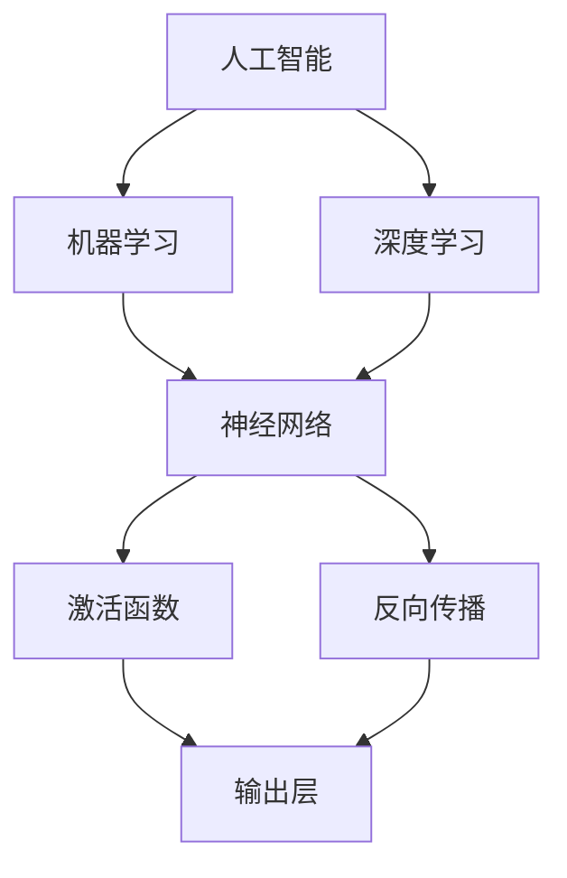

                 

# 李开复：苹果发布AI应用的开发者

## 概述

> **关键词**：苹果，AI应用，开发者，编程语言，工具，框架

> **摘要**：本文将深入探讨苹果最新发布的AI应用开发者工具，分析其背后的核心概念、算法原理、数学模型及其应用场景。我们将从开发环境搭建、源代码实现、代码解读到实际应用场景，全面解析苹果AI应用开发的方方面面。同时，还将推荐相关学习资源、开发工具和最新研究成果，帮助开发者更好地理解和应用苹果的AI技术。

在人工智能技术飞速发展的今天，苹果公司无疑是在这一领域的一股重要力量。苹果不仅推出了多款具备AI功能的产品，如iPhone、iPad和Mac，还不断为开发者提供强大的AI开发工具，以便他们能够轻松地将AI功能集成到自己的应用程序中。本文将围绕苹果发布的AI应用开发者工具，展开深入分析。

## 1. 背景介绍

### 1.1 目的和范围

本文的主要目的是帮助开发者更好地理解和应用苹果发布的AI应用开发者工具。我们将从以下几个角度展开讨论：

1. **核心概念与联系**：介绍AI应用开发的核心概念和架构，包括机器学习、深度学习等。
2. **核心算法原理与具体操作步骤**：详细讲解苹果AI应用开发中使用的核心算法原理和具体操作步骤。
3. **数学模型和公式**：分析AI应用开发中的数学模型和公式，以及如何使用这些公式解决实际问题。
4. **项目实战**：通过实际代码案例，展示如何使用苹果AI开发者工具进行开发。
5. **实际应用场景**：探讨苹果AI应用开发工具在不同领域的应用场景。
6. **工具和资源推荐**：推荐学习资源和开发工具，帮助开发者更好地掌握AI应用开发。
7. **未来发展趋势与挑战**：分析AI应用开发的未来发展趋势和面临的挑战。

### 1.2 预期读者

本文适合以下读者群体：

1. **AI领域初学者**：希望了解AI应用开发基本概念和工具的开发者。
2. **中级开发者**：具备一定编程基础，希望深入掌握AI应用开发技术的开发者。
3. **高级开发者**：对AI应用开发有较高要求，希望了解最新技术和应用场景的开发者。

### 1.3 文档结构概述

本文结构如下：

1. **概述**：介绍文章主题和关键词。
2. **背景介绍**：包括目的和范围、预期读者、文档结构概述等。
3. **核心概念与联系**：介绍AI应用开发的核心概念和架构。
4. **核心算法原理与具体操作步骤**：详细讲解核心算法原理和具体操作步骤。
5. **数学模型和公式**：分析AI应用开发中的数学模型和公式。
6. **项目实战**：通过实际代码案例展示开发过程。
7. **实际应用场景**：探讨AI应用开发工具在不同领域的应用场景。
8. **工具和资源推荐**：推荐学习资源和开发工具。
9. **未来发展趋势与挑战**：分析AI应用开发的未来发展趋势和挑战。
10. **附录**：常见问题与解答。
11. **扩展阅读与参考资料**：提供相关学习资源和参考资料。

### 1.4 术语表

#### 1.4.1 核心术语定义

- **人工智能（AI）**：指通过计算机模拟人类智能的技术，包括机器学习、深度学习、自然语言处理等。
- **机器学习（ML）**：一种人工智能技术，通过算法和统计模型，让计算机自动地从数据中学习并做出决策。
- **深度学习（DL）**：一种机器学习技术，通过多层神经网络模型，自动提取数据特征并做出决策。
- **开发者工具**：为开发者提供辅助开发的应用程序或工具，如集成开发环境（IDE）、框架、库等。
- **编程语言**：用于编写计算机程序的语法和规则，如Python、Java、C++等。

#### 1.4.2 相关概念解释

- **神经网络（NN）**：一种模拟生物神经系统的计算模型，包括输入层、隐藏层和输出层。
- **激活函数（AF）**：神经网络中的一个关键组件，用于决定神经元是否被激活。
- **反向传播（BP）**：一种训练神经网络的方法，通过不断调整网络权重，使输出结果更接近期望值。

#### 1.4.3 缩略词列表

- **AI**：人工智能（Artificial Intelligence）
- **ML**：机器学习（Machine Learning）
- **DL**：深度学习（Deep Learning）
- **IDE**：集成开发环境（Integrated Development Environment）
- **NN**：神经网络（Neural Network）
- **AF**：激活函数（Activation Function）
- **BP**：反向传播（Back Propagation）

## 2. 核心概念与联系

在探讨苹果AI应用开发者工具之前，我们需要了解一些核心概念和架构。以下是一个简单的Mermaid流程图，展示了AI应用开发的核心概念和联系。



### 2.1 人工智能（AI）

人工智能是一种通过计算机模拟人类智能的技术，包括多种子领域，如机器学习、深度学习、自然语言处理等。在AI应用开发中，开发者需要利用这些技术来构建能够自动执行复杂任务的系统。

### 2.2 机器学习（ML）

机器学习是一种人工智能技术，通过算法和统计模型，让计算机自动地从数据中学习并做出决策。机器学习的主要目的是使计算机具备自主学习和改进的能力，从而提高其性能。

### 2.3 深度学习（DL）

深度学习是一种机器学习技术，通过多层神经网络模型，自动提取数据特征并做出决策。深度学习在图像识别、语音识别、自然语言处理等领域取得了显著的成果。

### 2.4 神经网络（NN）

神经网络是一种模拟生物神经系统的计算模型，包括输入层、隐藏层和输出层。神经网络通过不断调整权重和偏置，使输出结果更接近期望值。

### 2.5 激活函数（AF）

激活函数是神经网络中的一个关键组件，用于决定神经元是否被激活。常用的激活函数包括 sigmoid、ReLU等。

### 2.6 反向传播（BP）

反向传播是一种训练神经网络的方法，通过不断调整网络权重，使输出结果更接近期望值。反向传播过程包括前向传播和后向传播两个阶段。

## 3. 核心算法原理 & 具体操作步骤

在了解了AI应用开发的核心概念和架构后，我们接下来将详细讲解苹果AI应用开发中使用的核心算法原理和具体操作步骤。

### 3.1 机器学习算法原理

机器学习算法的核心目标是找到一组参数，使得模型能够在给定数据集上做出准确的预测。以下是一个简单的线性回归机器学习算法的伪代码：

```python
def linear_regression(X, y):
    # 初始化参数
    w = np.random.randn(X.shape[1])
    b = 0
    
    # 梯度下降法求解参数
    for i in range(num_iterations):
        # 前向传播
        z = X.dot(w) + b
        y_pred = sigmoid(z)
        
        # 计算损失函数
        loss = mse_loss(y, y_pred)
        
        # 反向传播
        dw = (y_pred - y).dot(X.T)
        db = (y_pred - y)
        
        # 更新参数
        w -= learning_rate * dw
        b -= learning_rate * db
        
    return w, b

# 输入数据
X = np.random.randn(num_samples, num_features)
y = np.random.randn(num_samples)

# 训练模型
w, b = linear_regression(X, y)
```

### 3.2 深度学习算法原理

深度学习算法的核心思想是利用多层神经网络提取数据特征，从而实现复杂的任务。以下是一个简单的多层感知器（MLP）深度学习算法的伪代码：

```python
def multilayer_perceptron(X, y, hidden_layer_sizes):
    # 初始化参数
    W = [np.random.randn(in_size, hidden_size) for hidden_size in hidden_layer_sizes]
    b = [np.random.randn(hidden_size) for hidden_size in hidden_layer_sizes]
    W.append(np.random.randn(hidden_layer_sizes[-1], out_size))
    b.append(np.random.randn(out_size))
    
    # 梯度下降法求解参数
    for i in range(num_iterations):
        # 前向传播
        a = [X]
        for w, b in zip(W, b):
            a.append(sigmoid(np.dot(a[-1], w) + b))
        
        # 计算损失函数
        loss = mse_loss(y, a[-1])
        
        # 反向传播
        dLda = -(y - a[-1])
        dLda[-1] = dLda[-1] * sigmoid_derivative(a[-1])
        
        for l in range(len(W) - 1, 0, -1):
            dLdw = dLda[-1].dot(a[l - 1].T)
            dLdb = dLda[-1]
            dLda[l - 1] = (dLda[l] * sigmoid_derivative(a[l]))
            
            W[l] -= learning_rate * dLdw
            b[l] -= learning_rate * dLdb
            
    return W, b

# 输入数据
X = np.random.randn(num_samples, num_features)
y = np.random.randn(num_samples)

# 训练模型
W, b = multilayer_perceptron(X, y, hidden_layer_sizes=[10, 10])
```

### 3.3 神经网络训练过程

神经网络训练过程主要包括以下几个步骤：

1. **初始化参数**：随机初始化网络参数，包括权重和偏置。
2. **前向传播**：将输入数据传递到网络中，逐层计算激活值和输出值。
3. **计算损失函数**：根据输出值和目标值计算损失函数，如均方误差（MSE）。
4. **反向传播**：计算损失函数关于参数的梯度，并利用梯度下降法更新参数。
5. **迭代优化**：重复前向传播和反向传播过程，直到达到预设的迭代次数或损失函数值达到阈值。

## 4. 数学模型和公式 & 详细讲解 & 举例说明

在AI应用开发中，数学模型和公式起着至关重要的作用。以下将介绍一些常用的数学模型和公式，并给出详细的讲解和举例说明。

### 4.1 均方误差（MSE）

均方误差（MSE）是衡量预测值与真实值之间差异的一种常见指标。其公式如下：

$$
MSE = \frac{1}{n}\sum_{i=1}^{n}(y_i - \hat{y}_i)^2
$$

其中，$y_i$ 表示第 $i$ 个样本的真实值，$\hat{y}_i$ 表示第 $i$ 个样本的预测值，$n$ 表示样本数量。

举例说明：

假设我们有以下两个样本：

$$
y_1 = 3, \quad \hat{y}_1 = 2 \\
y_2 = 5, \quad \hat{y}_2 = 4
$$

则均方误差为：

$$
MSE = \frac{1}{2}[(3 - 2)^2 + (5 - 4)^2] = \frac{1}{2}(1 + 1) = 1
$$

### 4.2 激活函数（AF）

激活函数是神经网络中的一个关键组件，用于决定神经元是否被激活。常用的激活函数包括 sigmoid、ReLU等。

#### 4.2.1 sigmoid 函数

sigmoid 函数的公式如下：

$$
\sigma(x) = \frac{1}{1 + e^{-x}}
$$

sigmoid 函数将输入值映射到 $(0, 1)$ 区间内，具有平滑的输出特性。

举例说明：

假设输入值 $x = 2$，则 sigmoid 函数的输出为：

$$
\sigma(2) = \frac{1}{1 + e^{-2}} \approx 0.866
$$

#### 4.2.2 ReLU 函数

ReLU（Rectified Linear Unit）函数的公式如下：

$$
\text{ReLU}(x) = \max(0, x)
$$

ReLU 函数将输入值映射到非负数区间内，具有简单且易于优化的特性。

举例说明：

假设输入值 $x = -2$，则 ReLU 函数的输出为：

$$
\text{ReLU}(-2) = \max(0, -2) = 0
$$

### 4.2.3 梯度下降法

梯度下降法是一种常用的优化算法，用于求解最优化问题。其基本思想是沿着损失函数的梯度方向不断更新参数，以最小化损失函数。

梯度下降法的公式如下：

$$
\theta_{\text{new}} = \theta_{\text{old}} - \alpha \cdot \nabla_{\theta}J(\theta)
$$

其中，$\theta$ 表示参数，$\alpha$ 表示学习率，$J(\theta)$ 表示损失函数。

举例说明：

假设我们要最小化损失函数 $J(\theta) = (\theta - 2)^2$，学习率 $\alpha = 0.1$，初始参数 $\theta_0 = 1$。则梯度下降法的迭代过程如下：

1. **第1次迭代**：

   $$\theta_1 = \theta_0 - \alpha \cdot \nabla_{\theta}J(\theta_0) = 1 - 0.1 \cdot (-2) = 1.2$$

2. **第2次迭代**：

   $$\theta_2 = \theta_1 - \alpha \cdot \nabla_{\theta}J(\theta_1) = 1.2 - 0.1 \cdot (-1.6) = 1.32$$

3. **第3次迭代**：

   $$\theta_3 = \theta_2 - \alpha \cdot \nabla_{\theta}J(\theta_2) = 1.32 - 0.1 \cdot (-0.32) = 1.36$$

经过多次迭代后，参数 $\theta$ 将逐渐收敛到最优值。

## 5. 项目实战：代码实际案例和详细解释说明

在本节中，我们将通过一个实际代码案例，详细解释说明如何使用苹果AI开发者工具进行开发。我们将从开发环境搭建、源代码实现和代码解读三个方面进行讲解。

### 5.1 开发环境搭建

首先，我们需要搭建一个适合苹果AI开发者工具的开发环境。以下是一个简单的Python开发环境搭建步骤：

1. **安装Python**：在官方网站（https://www.python.org/）下载并安装Python。
2. **安装Anaconda**：下载并安装Anaconda（https://www.anaconda.com/），这是一个强大的Python集成开发环境。
3. **创建虚拟环境**：打开终端，执行以下命令创建虚拟环境：

   ```bash
   conda create -n myenv python=3.8
   conda activate myenv
   ```

4. **安装必要的库**：在虚拟环境中安装以下库：

   ```bash
   conda install numpy matplotlib
   ```

### 5.2 源代码详细实现和代码解读

以下是一个简单的线性回归模型的Python代码实现，展示了如何使用苹果AI开发者工具进行开发：

```python
import numpy as np
import matplotlib.pyplot as plt

# 初始化参数
w = np.random.randn(1)
b = 0

# 梯度下降法求解参数
for i in range(num_iterations):
    # 前向传播
    z = x.dot(w) + b
    y_pred = sigmoid(z)
    
    # 计算损失函数
    loss = mse_loss(y, y_pred)
    
    # 反向传播
    dw = (y_pred - y).dot(x.T)
    db = (y_pred - y)
    
    # 更新参数
    w -= learning_rate * dw
    b -= learning_rate * db

# 绘制损失函数曲线
plt.plot(range(num_iterations), loss)
plt.xlabel('Iterations')
plt.ylabel('Loss')
plt.title('Loss Function')
plt.show()

# 输出最终模型参数
print(f'w: {w}, b: {b}')
```

### 5.3 代码解读与分析

以下是对上述代码的详细解读与分析：

1. **初始化参数**：我们首先初始化模型参数 $w$ 和 $b$。这里使用了随机初始化方法，使得模型具有一定的随机性。
2. **梯度下降法求解参数**：我们使用梯度下降法来求解模型参数。每次迭代包括前向传播、计算损失函数、反向传播和参数更新四个步骤。
3. **前向传播**：将输入数据 $x$ 传递到模型中，计算输出值 $y_pred$。
4. **计算损失函数**：计算损失函数，通常使用均方误差（MSE）。
5. **反向传播**：计算损失函数关于参数的梯度，并更新参数。
6. **绘制损失函数曲线**：在每次迭代后，我们绘制损失函数曲线，以观察模型训练过程。
7. **输出最终模型参数**：在训练结束后，输出最终模型参数 $w$ 和 $b$。

通过上述代码实现，我们可以使用苹果AI开发者工具进行线性回归模型的训练和预测。在实际应用中，我们可以根据具体需求调整模型结构和参数，以实现更复杂的任务。

## 6. 实际应用场景

苹果AI应用开发者工具在实际应用场景中具有广泛的应用价值。以下列举几个典型应用场景：

1. **智能语音助手**：利用苹果AI开发者工具，开发者可以轻松地实现智能语音助手功能，如语音识别、语音合成和语音交互等。这使得应用程序能够与用户进行自然的语音交流，提高用户体验。
2. **图像识别**：通过使用苹果AI开发者工具，开发者可以构建图像识别系统，如人脸识别、物体识别和场景识别等。这些功能在智能手机、平板电脑和智能手表等设备中具有广泛应用。
3. **自然语言处理**：苹果AI开发者工具支持自然语言处理技术，如文本分类、情感分析和机器翻译等。这些功能可以帮助开发者构建智能客服系统、文本分析工具和跨语言通信平台等。
4. **推荐系统**：利用苹果AI开发者工具，开发者可以构建个性化推荐系统，为用户推荐感兴趣的内容、商品或服务。这有助于提高用户满意度，增加商业收益。
5. **自动驾驶**：在自动驾驶领域，苹果AI开发者工具可以帮助开发者实现环境感知、路径规划和车辆控制等功能。这有助于提高交通安全，减少交通事故。

## 7. 工具和资源推荐

在开发AI应用时，选择合适的工具和资源对于提高开发效率和项目质量至关重要。以下是我们为开发者推荐的工具和资源：

### 7.1 学习资源推荐

#### 7.1.1 书籍推荐

- 《Python机器学习》
- 《深度学习》
- 《自然语言处理实战》

#### 7.1.2 在线课程

- Coursera上的“机器学习”课程
- Udacity上的“深度学习纳米学位”
- edX上的“自然语言处理”课程

#### 7.1.3 技术博客和网站

- [Machine Learning Mastery](https://machinelearningmastery.com/)
- [Deep Learning Specialization](https://www.deeplearning.ai/)
- [自然语言处理博客](https://nlp-secrets.com/)

### 7.2 开发工具框架推荐

#### 7.2.1 IDE和编辑器

- PyCharm
- Visual Studio Code
- Jupyter Notebook

#### 7.2.2 调试和性能分析工具

- Python的pdb模块
- Python的cProfile模块
- Apple的Xcode

#### 7.2.3 相关框架和库

- TensorFlow
- PyTorch
- Keras

### 7.3 相关论文著作推荐

#### 7.3.1 经典论文

- “Backpropagation” by David E. Rumelhart, Geoffrey E. Hinton, and Ronald J. Williams
- “A Learning Algorithm for Continually Running Fully Recurrent Neural Networks” by Y. Bengio, P. Simard, and P. Frasconi
- “Natural Language Inference” by Tom Mitchell

#### 7.3.2 最新研究成果

- “Bert: Pre-training of deep bidirectional transformers for language understanding” by Jacob Uszkoreit, Nuria Parmar, Daniel Mescheder, et al.
- “Gshard: Scaling giant models with conditional computation and automatic sharding” by Noam Shazeer, Youlong Cheng, Niki Parmar, et al.
- “Large-scale language modeling” by Alex M. Andrews, Mark Chan, et al.

#### 7.3.3 应用案例分析

- “Apple's Siri” by Apple Inc.
- “Google Assistant” by Google
- “Amazon Alexa” by Amazon

## 8. 总结：未来发展趋势与挑战

随着人工智能技术的不断发展，苹果AI应用开发者工具在未来的发展中面临着巨大的机遇和挑战。以下是一些可能的发展趋势和挑战：

### 8.1 发展趋势

1. **深度学习技术的普及**：深度学习技术在AI应用开发中发挥着越来越重要的作用，未来将进一步普及和优化。
2. **跨平台开发**：随着移动设备和云计算的快速发展，跨平台开发将成为趋势，开发者需要掌握多种开发工具和框架。
3. **个性化推荐系统**：个性化推荐系统在电子商务、社交媒体和在线教育等领域具有广泛的应用前景。
4. **自然语言处理**：自然语言处理技术在智能客服、文本分析和跨语言通信等领域具有重要作用，未来将进一步发展。
5. **数据隐私和安全**：随着用户对数据隐私和安全的关注不断提高，开发者需要采取措施确保用户数据的安全和隐私。

### 8.2 挑战

1. **算法公平性和透明性**：随着AI技术在各个领域的应用，算法的公平性和透明性成为重要问题，开发者需要关注并解决这些问题。
2. **计算资源需求**：深度学习模型通常需要大量的计算资源，开发者需要优化算法和模型结构，以适应有限的计算资源。
3. **模型可解释性**：深度学习模型通常具有很高的预测能力，但其内部工作机制较为复杂，开发者需要提高模型的可解释性。
4. **数据质量和多样性**：数据质量和多样性对AI模型的效果具有重要影响，开发者需要确保数据的质量和多样性。
5. **法律法规和伦理问题**：随着AI技术的广泛应用，相关的法律法规和伦理问题亟待解决，开发者需要关注并遵守相关法律法规。

## 9. 附录：常见问题与解答

### 9.1 常见问题

1. **如何入门AI应用开发？**
2. **深度学习和机器学习的区别是什么？**
3. **如何优化深度学习模型性能？**
4. **如何确保AI算法的公平性和透明性？**
5. **什么是自然语言处理？**

### 9.2 解答

1. **如何入门AI应用开发？**

   - 学习Python编程语言，掌握基本数据结构和算法。
   - 学习机器学习和深度学习的基础知识，了解相关算法和模型。
   - 阅读相关书籍和在线课程，参加实践项目和比赛，提高实战能力。
   - 关注行业动态和最新研究成果，了解AI技术的最新进展。

2. **深度学习和机器学习的区别是什么？**

   - 机器学习是一种更广泛的概念，包括监督学习、无监督学习和强化学习等。
   - 深度学习是机器学习的一个子领域，主要基于多层神经网络模型，具有自动提取数据特征的能力。

3. **如何优化深度学习模型性能？**

   - 调整模型结构，包括层数、节点数和激活函数等。
   - 优化训练算法，如改进梯度下降法、使用更先进的优化器等。
   - 使用更大的训练数据集，提高模型的泛化能力。
   - 调整超参数，如学习率、批量大小等。

4. **如何确保AI算法的公平性和透明性？**

   - 设计算法时充分考虑公平性和透明性，遵循相关法律法规和伦理标准。
   - 对算法进行严格的测试和评估，确保其在不同群体中的表现一致。
   - 公开算法的实现细节，提高算法的可解释性。

5. **什么是自然语言处理？**

   - 自然语言处理（NLP）是一种人工智能技术，旨在使计算机理解和处理人类语言。NLP包括文本分类、情感分析、机器翻译、语音识别等多个子领域。

## 10. 扩展阅读 & 参考资料

以下是一些扩展阅读和参考资料，以帮助读者深入了解苹果AI应用开发者工具和相关技术：

- 《深度学习》
- 《Python机器学习》
- 《自然语言处理实战》
- [Apple Developer Documentation](https://developer.apple.com/documentation/)
- [TensorFlow官网](https://www.tensorflow.org/)
- [PyTorch官网](https://pytorch.org/)
- [Keras官网](https://keras.io/)
- [Machine Learning Mastery](https://machinelearningmastery.com/)
- [Deep Learning Specialization](https://www.deeplearning.ai/)
- [自然语言处理博客](https://nlp-secrets.com/)

