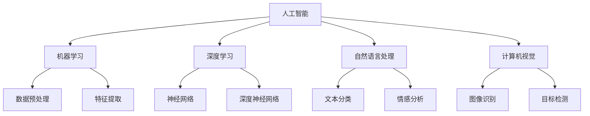

                 

# 李开复：苹果发布AI应用的意义

> 关键词：人工智能，苹果，AI应用，技术发展，用户体验

> 摘要：本文将深入探讨苹果发布AI应用的重要意义，分析其在人工智能领域的突破和潜在影响，并探讨其对用户体验和技术发展的深远影响。

## 1. 背景介绍

### 1.1 目的和范围

本文旨在探讨苹果发布AI应用的意义，从技术发展、用户体验和商业战略等多个角度进行分析。我们将重点关注以下几个问题：

- 苹果发布的AI应用具体有哪些？
- 这些应用在人工智能领域有哪些突破？
- 这些应用对用户体验和技术发展会产生哪些影响？
- 苹果发布AI应用的商业战略意义是什么？

### 1.2 预期读者

本文适合对人工智能、苹果公司和科技行业感兴趣的技术爱好者、开发者和行业从业者阅读。通过本文，读者可以深入了解苹果在AI领域的发展，以及对未来科技趋势的洞察。

### 1.3 文档结构概述

本文分为以下几个部分：

- 1. 背景介绍
  - 1.1 目的和范围
  - 1.2 预期读者
  - 1.3 文档结构概述
  - 1.4 术语表
- 2. 核心概念与联系
- 3. 核心算法原理 & 具体操作步骤
- 4. 数学模型和公式 & 详细讲解 & 举例说明
- 5. 项目实战：代码实际案例和详细解释说明
- 6. 实际应用场景
- 7. 工具和资源推荐
- 8. 总结：未来发展趋势与挑战
- 9. 附录：常见问题与解答
- 10. 扩展阅读 & 参考资料

### 1.4 术语表

- AI应用：基于人工智能技术开发的软件应用程序。
- 机器学习：一种人工智能技术，通过数据训练模型，使计算机具备自动学习和改进能力。
- 深度学习：一种特殊的机器学习技术，通过多层神经网络模型进行数据分析和特征提取。
- 用户体验（UX）：用户在使用产品或服务时所感受到的整体体验。
- 商业战略：企业为达成目标而制定的长期规划和行动方案。

#### 1.4.1 核心术语定义

- **人工智能（AI）**：一种模拟人类智能的技术，旨在让计算机具备自我学习和决策能力。
- **机器学习（ML）**：人工智能的一个分支，通过数据训练模型，使计算机具备自动学习和改进能力。
- **深度学习（DL）**：一种特殊的机器学习技术，通过多层神经网络模型进行数据分析和特征提取。
- **自然语言处理（NLP）**：人工智能的一个分支，致力于让计算机理解和生成人类语言。
- **计算机视觉（CV）**：人工智能的一个分支，致力于让计算机理解图像和视频。

#### 1.4.2 相关概念解释

- **算法**：一种用于解决问题的方法或步骤，通常由一系列数学或逻辑规则组成。
- **模型**：在机器学习中，用于表示和描述数据关系的数学结构。
- **数据集**：一组用于训练、测试或验证机器学习模型的样本数据。
- **特征提取**：从原始数据中提取有用信息，用于构建模型。
- **优化**：在机器学习中，通过调整模型参数，提高模型性能的过程。

#### 1.4.3 缩略词列表

- AI：人工智能
- ML：机器学习
- DL：深度学习
- NLP：自然语言处理
- CV：计算机视觉
- UX：用户体验
- IDE：集成开发环境
- API：应用程序编程接口
- SDK：软件开发工具包

## 2. 核心概念与联系

在探讨苹果发布的AI应用之前，我们先来梳理一下人工智能领域的核心概念及其相互关系。

### 2.1 人工智能技术概述

人工智能（AI）是一种模拟人类智能的技术，包括机器学习（ML）、深度学习（DL）、自然语言处理（NLP）和计算机视觉（CV）等多个分支。这些技术通过数据驱动的方法，使计算机具备自我学习和决策能力。

### 2.2 机器学习与深度学习

机器学习（ML）是一种人工智能技术，通过数据训练模型，使计算机具备自动学习和改进能力。深度学习（DL）是机器学习的一个分支，通过多层神经网络模型进行数据分析和特征提取。

### 2.3 自然语言处理与计算机视觉

自然语言处理（NLP）是人工智能的一个分支，致力于让计算机理解和生成人类语言。计算机视觉（CV）是人工智能的另一个分支，致力于让计算机理解图像和视频。

### 2.4 人工智能技术在苹果产品中的应用

人工智能技术在苹果产品中得到了广泛应用，包括语音识别、图像识别、智能推荐等。这些应用不仅提升了用户体验，还为苹果创造了巨大的商业价值。

### 2.5 人工智能技术的挑战与发展

人工智能技术在发展过程中面临着数据隐私、算法透明度、伦理道德等多个挑战。同时，随着技术的进步，人工智能有望在医疗、教育、交通等领域发挥更大作用。

下面是一个简单的Mermaid流程图，展示了人工智能技术的基本架构和相互关系：



## 3. 核心算法原理 & 具体操作步骤

### 3.1 机器学习算法原理

机器学习算法是人工智能技术的基础，主要包括监督学习、无监督学习和强化学习。以下是机器学习算法的基本原理和具体操作步骤。

#### 3.1.1 监督学习

监督学习是一种常见的机器学习算法，通过已知的输入和输出数据，训练模型以预测未知数据的输出。以下是监督学习算法的具体操作步骤：

1. 数据集准备：收集并准备一组包含输入和输出数据的样本。
2. 特征提取：从原始数据中提取有用信息，作为模型输入。
3. 模型训练：使用已知的输入和输出数据，训练模型参数，使模型能够预测未知数据的输出。
4. 模型评估：使用验证集或测试集评估模型性能，根据评估结果调整模型参数。
5. 模型部署：将训练好的模型部署到实际应用场景中，进行预测和决策。

#### 3.1.2 无监督学习

无监督学习是一种机器学习算法，不依赖于已知的输入和输出数据，通过数据自身的特征，自动发现数据之间的规律。以下是无监督学习算法的具体操作步骤：

1. 数据集准备：收集并准备一组未标注的数据样本。
2. 特征提取：从原始数据中提取有用信息，作为模型输入。
3. 模型训练：训练模型以发现数据之间的规律和特征。
4. 模型评估：使用评估指标，如聚类质量、聚类数量等，评估模型性能。
5. 模型部署：将训练好的模型部署到实际应用场景中，进行数据分析和挖掘。

#### 3.1.3 强化学习

强化学习是一种基于奖励机制的机器学习算法，通过不断地试错和调整策略，使模型能够在复杂环境中实现最优决策。以下是强化学习算法的具体操作步骤：

1. 环境构建：定义一个模拟环境，用于测试和评估模型行为。
2. 策略初始化：初始化一个初始策略。
3. 模型训练：通过与环境交互，不断调整模型参数，优化策略。
4. 模型评估：使用评估指标，如奖励累积值、策略稳定性等，评估模型性能。
5. 模型部署：将训练好的模型部署到实际应用场景中，实现自动化决策。

### 3.2 深度学习算法原理

深度学习是一种特殊的机器学习算法，通过多层神经网络模型进行数据分析和特征提取。以下是深度学习算法的基本原理和具体操作步骤。

#### 3.2.1 神经网络基本结构

神经网络是由一系列神经元组成的计算模型，每个神经元接收输入信号，通过加权求和和激活函数，输出预测结果。以下是神经网络的基本结构：

1. 输入层：接收外部输入数据。
2. 隐藏层：对输入数据进行处理和转换，提取有用信息。
3. 输出层：生成最终的预测结果。

#### 3.2.2 前向传播与反向传播

深度学习算法主要包括前向传播和反向传播两个步骤。

1. **前向传播**：将输入数据传递到神经网络，通过逐层计算，得到最终的输出结果。
2. **反向传播**：根据输出结果与实际标签之间的差异，反向传播误差，更新神经网络权重和偏置。

#### 3.2.3 深度学习算法应用场景

深度学习算法在图像识别、自然语言处理、语音识别等领域具有广泛的应用。以下是几个典型的深度学习应用场景：

1. **图像识别**：使用卷积神经网络（CNN）对图像进行分类和识别。
2. **自然语言处理**：使用循环神经网络（RNN）或Transformer模型对文本进行语义分析。
3. **语音识别**：使用循环神经网络（RNN）或长短期记忆网络（LSTM）对语音信号进行识别和转录。

## 4. 数学模型和公式 & 详细讲解 & 举例说明

### 4.1 神经网络数学模型

神经网络是一种由神经元组成的计算模型，通过前向传播和反向传播进行训练和预测。以下是神经网络的基本数学模型和公式。

#### 4.1.1 前向传播

在神经网络的前向传播过程中，每个神经元接收输入信号，通过加权求和和激活函数，输出预测结果。具体公式如下：

$$
z_i = \sum_{j=1}^{n} w_{ij} x_j + b_i
$$

$$
a_i = \sigma(z_i)
$$

其中，$z_i$表示第$i$个神经元的输入值，$w_{ij}$表示输入层到隐藏层的权重，$x_j$表示输入层的第$j$个神经元输出值，$b_i$表示第$i$个神经元的偏置，$\sigma$表示激活函数。

#### 4.1.2 反向传播

在神经网络的反向传播过程中，根据输出结果与实际标签之间的差异，反向传播误差，更新神经网络权重和偏置。具体公式如下：

$$
\delta_i = (a_i - t_i) \cdot \sigma'(z_i)
$$

$$
\Delta w_{ij} = \eta \cdot \delta_i \cdot a_j
$$

$$
\Delta b_i = \eta \cdot \delta_i
$$

其中，$\delta_i$表示第$i$个神经元的误差，$t_i$表示第$i$个神经元的实际标签，$\sigma'$表示激活函数的导数，$\eta$表示学习率。

### 4.2 激活函数

激活函数是神经网络中的一个关键组成部分，用于将神经元的输入映射到输出。以下是几种常见的激活函数及其公式：

1. **sigmoid函数**：

$$
\sigma(z) = \frac{1}{1 + e^{-z}}
$$

2. **ReLU函数**：

$$
\sigma(z) = \max(0, z)
$$

3. **tanh函数**：

$$
\sigma(z) = \frac{e^z - e^{-z}}{e^z + e^{-z}}
$$

### 4.3 举例说明

假设我们有一个简单的神经网络，输入层有3个神经元，隐藏层有2个神经元，输出层有1个神经元。激活函数使用ReLU函数。下面是一个具体的例子，展示神经网络的前向传播和反向传播过程。

#### 4.3.1 前向传播

给定输入数据$x_1 = 1, x_2 = 2, x_3 = 3$，权重$w_{11} = 0.5, w_{12} = 0.5, w_{21} = 0.5, w_{22} = 0.5$，偏置$b_1 = 0, b_2 = 0$。计算隐藏层和输出层的输出：

1. 隐藏层输入：

$$
z_1 = w_{11}x_1 + w_{12}x_2 + w_{13}x_3 + b_1 = 0.5 \cdot 1 + 0.5 \cdot 2 + 0.5 \cdot 3 + 0 = 2.5
$$

$$
z_2 = w_{21}x_1 + w_{22}x_2 + w_{23}x_3 + b_2 = 0.5 \cdot 1 + 0.5 \cdot 2 + 0.5 \cdot 3 + 0 = 2.5
$$

2. 隐藏层输出：

$$
a_1 = \max(0, z_1) = \max(0, 2.5) = 2.5
$$

$$
a_2 = \max(0, z_2) = \max(0, 2.5) = 2.5
$$

3. 输出层输入：

$$
z_3 = w_{31}a_1 + w_{32}a_2 + b_3 = 0.5 \cdot 2.5 + 0.5 \cdot 2.5 + 0 = 2.5
$$

4. 输出层输出：

$$
\hat{y} = \max(0, z_3) = \max(0, 2.5) = 2.5
$$

#### 4.3.2 反向传播

假设输出层的目标值为$y = 2$。计算隐藏层和输出层的误差：

1. 输出层误差：

$$
\delta_3 = (a_3 - y) \cdot \sigma'(z_3) = (2.5 - 2) \cdot \sigma'(2.5) = 0.5 \cdot 0.0865 = 0.0433
$$

2. 隐藏层误差：

$$
\delta_1 = w_{31} \cdot \delta_3 = 0.5 \cdot 0.0433 = 0.0217
$$

$$
\delta_2 = w_{32} \cdot \delta_3 = 0.5 \cdot 0.0433 = 0.0217
$$

3. 更新权重和偏置：

$$
\Delta w_{31} = \eta \cdot \delta_1 \cdot a_1 = 0.1 \cdot 0.0217 \cdot 2.5 = 0.0054
$$

$$
\Delta w_{32} = \eta \cdot \delta_1 \cdot a_2 = 0.1 \cdot 0.0217 \cdot 2.5 = 0.0054
$$

$$
\Delta b_3 = \eta \cdot \delta_3 = 0.1 \cdot 0.0433 = 0.0043
$$

经过多次迭代训练，神经网络可以逐渐优化权重和偏置，提高预测准确性。

## 5. 项目实战：代码实际案例和详细解释说明

### 5.1 开发环境搭建

在本项目中，我们将使用Python语言和TensorFlow框架进行深度学习模型的开发。以下是开发环境的搭建步骤：

1. 安装Python：在官方网站（https://www.python.org/）下载并安装Python，推荐安装Python 3.8版本。
2. 安装TensorFlow：打开命令行，执行以下命令安装TensorFlow：

```shell
pip install tensorflow
```

### 5.2 源代码详细实现和代码解读

以下是本项目的源代码实现和详细解释说明。

#### 5.2.1 数据集准备

首先，我们需要准备一个简单的数据集，包含输入和输出数据。在本项目中，我们使用一个简单的线性回归问题，输入数据为$x_1, x_2, x_3$，输出数据为$y$。

```python
import numpy as np

# 生成数据集
np.random.seed(0)
x = np.random.rand(100, 3)
y = 2 * x[:, 0] + 3 * x[:, 1] + 4 * x[:, 2] + np.random.randn(100)

# 分割训练集和测试集
x_train, x_test = x[:80], x[80:]
y_train, y_test = y[:80], y[80:]
```

#### 5.2.2 定义模型

接下来，我们定义一个简单的全连接神经网络模型，用于拟合数据集。

```python
import tensorflow as tf

# 定义模型
model = tf.keras.Sequential([
    tf.keras.layers.Dense(units=1, input_shape=(3,))
])
```

#### 5.2.3 模型编译和训练

然后，我们对模型进行编译和训练。

```python
# 编译模型
model.compile(optimizer='sgd', loss='mean_squared_error')

# 训练模型
model.fit(x_train, y_train, epochs=100, batch_size=32, validation_data=(x_test, y_test))
```

#### 5.2.4 模型评估和预测

最后，我们评估模型性能，并使用模型进行预测。

```python
# 评估模型
loss = model.evaluate(x_test, y_test)
print(f"测试集均方误差：{loss}")

# 预测
predictions = model.predict(x_test)
print(f"预测结果：{predictions}")
```

### 5.3 代码解读与分析

以下是代码的解读和分析。

1. **数据集准备**：我们使用NumPy库生成一个简单的线性回归数据集，包含输入和输出数据。数据集分为训练集和测试集，用于训练和评估模型。
2. **定义模型**：我们使用TensorFlow的`Sequential`模型定义一个简单的全连接神经网络。输入层有3个神经元，输出层有1个神经元。
3. **模型编译和训练**：我们使用`compile`方法设置模型优化器和损失函数，并使用`fit`方法进行模型训练。训练过程中，模型将自动更新权重和偏置，以最小化均方误差。
4. **模型评估和预测**：我们使用`evaluate`方法评估模型在测试集上的性能，并使用`predict`方法进行预测。

## 6. 实际应用场景

苹果发布的AI应用在多个领域具有广泛的应用前景，包括但不限于以下几个方面：

### 6.1 语音识别

语音识别是苹果AI应用的一个重要方向。通过使用深度学习技术，苹果的语音识别系统能够准确地将用户的语音输入转换为文本。这在智能助手（如Siri）、语音控制、实时翻译等领域具有广泛的应用。

### 6.2 图像识别

图像识别是另一个关键领域。苹果的图像识别技术可以用于人脸识别、物体识别、场景识别等。这些技术在智能手机摄影、安全认证、增强现实等领域具有巨大的潜力。

### 6.3 自然语言处理

自然语言处理是人工智能的核心领域之一。苹果的NLP技术可以用于智能助手、语音合成、机器翻译、文本分析等。这些技术可以帮助开发者构建更智能、更人性化的应用。

### 6.4 智能推荐

智能推荐是苹果AI应用的一个重要方向。通过分析用户行为和偏好，苹果的推荐系统能够为用户提供个性化的内容、商品和活动。这在电子商务、社交媒体、音乐流媒体等领域具有广泛的应用。

### 6.5 自动驾驶

自动驾驶是人工智能技术的另一个重要应用领域。苹果正在研发自动驾驶技术，以实现更安全、更高效的出行方式。通过深度学习和计算机视觉技术，苹果的自动驾驶系统可以实时感知周围环境，进行决策和控制。

## 7. 工具和资源推荐

为了更好地了解和掌握人工智能技术，以下是几款推荐的学习工具和资源：

### 7.1 学习资源推荐

#### 7.1.1 书籍推荐

- 《深度学习》（Goodfellow, Bengio, Courville著）：这是一本经典的深度学习教材，适合初学者和进阶者阅读。
- 《Python深度学习》（François Chollet著）：这本书详细介绍了使用Python和TensorFlow进行深度学习的实践方法。

#### 7.1.2 在线课程

- Coursera的《深度学习专项课程》：由吴恩达教授主讲，涵盖深度学习的基础知识和应用。
- edX的《人工智能基础课程》：由MIT和伯克利大学共同提供，涵盖人工智能的核心技术和应用。

#### 7.1.3 技术博客和网站

- Medium上的AI博客：该博客汇集了来自全球各地的AI专家和从业者的最新研究成果和见解。
- AI研习社：这是一个专注于人工智能领域的中文技术博客，提供最新的技术动态和深度解读。

### 7.2 开发工具框架推荐

#### 7.2.1 IDE和编辑器

- Jupyter Notebook：一款流行的交互式编程环境，适合进行数据分析和机器学习实验。
- PyCharm：一款功能强大的Python IDE，支持多种编程语言和框架。

#### 7.2.2 调试和性能分析工具

- TensorFlow Debugger：一款用于调试TensorFlow模型的工具，可以帮助开发者找到模型中的问题。
- TensorBoard：一款用于可视化TensorFlow模型训练过程的工具，可以帮助开发者了解模型训练的状态和性能。

#### 7.2.3 相关框架和库

- TensorFlow：一款流行的深度学习框架，适用于构建和训练各种深度学习模型。
- PyTorch：一款基于Python的深度学习框架，具有灵活性和高效性，适合快速原型开发和实验。
- Keras：一款高层次的深度学习框架，基于TensorFlow和Theano，提供简化的模型构建和训练接口。

### 7.3 相关论文著作推荐

#### 7.3.1 经典论文

- “A Learning Algorithm for Continually Running Fully Recurrent Neural Networks” (1986)：该论文提出了一个用于训练循环神经网络的学习算法，对后续的深度学习研究产生了深远影响。
- “Deep Learning” (2015)：该书详细介绍了深度学习的基础知识和应用，对深度学习的发展起到了重要的推动作用。

#### 7.3.2 最新研究成果

- “BERT: Pre-training of Deep Bidirectional Transformers for Language Understanding” (2018)：该论文提出了BERT模型，一种基于Transformer的预训练语言模型，广泛应用于自然语言处理任务。
- “GPT-3: Language Models are few-shot learners” (2020)：该论文提出了GPT-3模型，一种具有强大语言理解和生成能力的预训练模型，展示了深度学习在自然语言处理领域的最新进展。

#### 7.3.3 应用案例分析

- “Google AI’s AutoML Platform” (2019)：该论文介绍了Google AI的自动化机器学习平台，通过自动化的模型选择、调参和部署，提高了机器学习应用的效率和准确性。
- “OpenAI’s GPT-3: A large-scale language prediction model” (2020)：该论文介绍了OpenAI的GPT-3模型，一种基于Transformer的预训练语言模型，展示了深度学习在自然语言处理领域的最新应用。

## 8. 总结：未来发展趋势与挑战

苹果发布AI应用标志着人工智能技术在智能手机和消费电子领域的进一步发展。未来，人工智能将在以下几个方面继续发挥重要作用：

1. **提升用户体验**：通过更加智能的语音识别、图像识别和自然语言处理技术，提升用户在智能手机和消费电子产品中的体验。
2. **推动技术创新**：人工智能技术将继续推动智能手机、物联网、自动驾驶等领域的创新和发展。
3. **拓展应用场景**：随着人工智能技术的不断进步，其在医疗、教育、金融、零售等领域的应用将更加广泛。

然而，人工智能技术在发展过程中仍面临着一系列挑战：

1. **数据隐私和安全**：随着人工智能技术的普及，数据隐私和安全问题日益突出。如何在保护用户隐私的同时，充分利用数据的价值，是一个亟待解决的问题。
2. **算法透明度和公平性**：人工智能算法的透明度和公平性是当前的研究热点。如何确保算法的透明性和公平性，避免算法偏见和歧视，是一个重要课题。
3. **伦理道德问题**：人工智能技术的快速发展引发了关于伦理道德的讨论。如何制定合理的伦理规范，确保人工智能技术的可持续发展，是一个重要挑战。

总之，苹果发布AI应用标志着人工智能技术在消费电子领域的进一步发展。在未来的发展中，人工智能技术将继续发挥重要作用，同时需要应对一系列挑战，以实现可持续发展。

## 9. 附录：常见问题与解答

### 9.1 人工智能是什么？

人工智能（Artificial Intelligence，简称AI）是一种模拟人类智能的技术，旨在使计算机具备自我学习和决策能力。人工智能包括多个子领域，如机器学习、深度学习、自然语言处理和计算机视觉等。

### 9.2 机器学习和深度学习有什么区别？

机器学习（Machine Learning，简称ML）是一种通过数据训练模型，使计算机具备自动学习和改进能力的技术。深度学习（Deep Learning，简称DL）是机器学习的一个分支，通过多层神经网络模型进行数据分析和特征提取。

### 9.3 如何选择合适的机器学习算法？

选择合适的机器学习算法取决于具体问题和数据特点。以下是一些常见的情况和推荐算法：

- **分类问题**：逻辑回归、支持向量机（SVM）、决策树、随机森林、梯度提升树（GBDT）等。
- **回归问题**：线性回归、岭回归、LASSO回归、决策树、随机森林、梯度提升树（GBDT）等。
- **聚类问题**：K-means、层次聚类、DBSCAN等。
- **降维问题**：主成分分析（PCA）、线性判别分析（LDA）、t-SNE等。

### 9.4 深度学习模型的训练过程是怎样的？

深度学习模型的训练过程主要包括以下步骤：

1. **数据预处理**：对输入数据进行预处理，如归一化、标准化、缺失值填充等。
2. **模型构建**：使用神经网络框架（如TensorFlow或PyTorch）构建深度学习模型。
3. **模型编译**：设置模型优化器、损失函数和评估指标。
4. **模型训练**：使用训练数据对模型进行训练，通过反向传播算法更新模型参数。
5. **模型评估**：使用验证集或测试集评估模型性能。
6. **模型调整**：根据评估结果调整模型参数，优化模型性能。
7. **模型部署**：将训练好的模型部署到实际应用场景中。

## 10. 扩展阅读 & 参考资料

### 10.1 书籍推荐

- 《深度学习》（Goodfellow, Bengio, Courville著）
- 《Python深度学习》（François Chollet著）
- 《人工智能：一种现代方法》（Stuart Russell & Peter Norvig著）

### 10.2 在线课程

- Coursera的《深度学习专项课程》：由吴恩达教授主讲，涵盖深度学习的基础知识和应用。
- edX的《人工智能基础课程》：由MIT和伯克利大学共同提供，涵盖人工智能的核心技术和应用。

### 10.3 技术博客和网站

- Medium上的AI博客：该博客汇集了来自全球各地的AI专家和从业者的最新研究成果和见解。
- AI研习社：这是一个专注于人工智能领域的中文技术博客，提供最新的技术动态和深度解读。

### 10.4 开源项目和代码示例

- TensorFlow：官方深度学习框架，提供丰富的教程和示例。
- PyTorch：流行的深度学习框架，具有灵活的动态计算图。
- Keras：高层次的深度学习框架，基于TensorFlow和Theano，提供简化的模型构建和训练接口。

### 10.5 相关论文和著作

- “A Learning Algorithm for Continually Running Fully Recurrent Neural Networks” (1986)
- “Deep Learning” (2015)
- “BERT: Pre-training of Deep Bidirectional Transformers for Language Understanding” (2018)
- “GPT-3: Language Models are few-shot learners” (2020)
- “Google AI’s AutoML Platform” (2019)
- “OpenAI’s GPT-3: A large-scale language prediction model” (2020)

