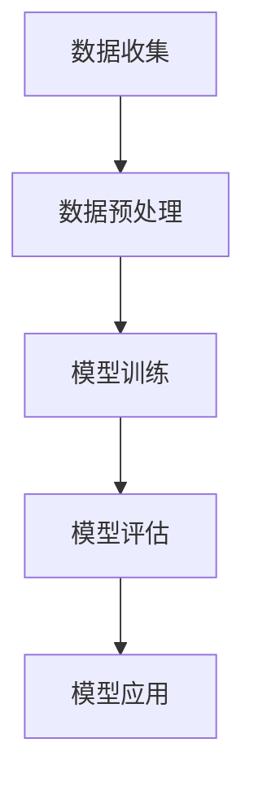

                 

# 李开复：苹果发布AI应用的意义

> 关键词：苹果、AI应用、发布、意义、技术趋势、用户体验、人工智能

> 摘要：本文将探讨苹果公司近期发布的AI应用，分析其对AI技术发展趋势、用户体验和市场竞争的影响，并讨论其未来可能面临的挑战。

## 1. 背景介绍

### 1.1 目的和范围

本文旨在分析苹果公司发布的AI应用，探讨其对AI领域的影响，以及可能带来的机遇和挑战。文章将重点关注以下几个方面：

- **AI应用的技术特点**：分析苹果AI应用的核心技术和创新点。
- **用户体验的提升**：探讨AI应用如何提升用户的使用体验。
- **市场竞争态势**：分析苹果AI应用发布对竞争对手和市场格局的影响。
- **未来发展趋势**：预测AI技术在苹果和其他科技巨头中的发展趋势。

### 1.2 预期读者

本文适合以下读者群体：

- **AI领域的研究者**：希望了解苹果AI应用的最新动态和研究方向。
- **科技爱好者**：对AI技术及其在苹果产品中的应用感兴趣。
- **技术开发者**：希望掌握AI应用开发的最新趋势和技巧。
- **市场营销人员**：关注AI技术对市场格局的影响。

### 1.3 文档结构概述

本文分为以下几个部分：

- **1. 背景介绍**：介绍文章的目的、范围、预期读者和文档结构。
- **2. 核心概念与联系**：阐述AI应用的核心概念和原理，提供Mermaid流程图。
- **3. 核心算法原理 & 具体操作步骤**：详细讲解AI应用的算法原理和操作步骤。
- **4. 数学模型和公式 & 详细讲解 & 举例说明**：介绍AI应用的数学模型和公式，并进行举例说明。
- **5. 项目实战：代码实际案例和详细解释说明**：提供代码案例和详细解释。
- **6. 实际应用场景**：分析AI应用的潜在应用场景。
- **7. 工具和资源推荐**：推荐学习资源、开发工具和框架。
- **8. 总结：未来发展趋势与挑战**：总结AI应用的未来发展趋势和面临的挑战。
- **9. 附录：常见问题与解答**：解答读者可能遇到的常见问题。
- **10. 扩展阅读 & 参考资料**：提供扩展阅读和参考资料。

### 1.4 术语表

#### 1.4.1 核心术语定义

- **AI应用**：基于人工智能技术的应用程序，通常涉及机器学习、自然语言处理和计算机视觉等领域。
- **苹果公司**：一家全球领先的科技公司，提供各种电子产品和服务。
- **用户体验**：用户在使用产品或服务过程中的感受和体验。
- **市场竞争**：企业在市场上的竞争态势和策略。

#### 1.4.2 相关概念解释

- **人工智能**：模拟人类智能的技术，包括机器学习、自然语言处理、计算机视觉等。
- **机器学习**：通过数据训练模型，使计算机具备自主学习和决策能力。
- **自然语言处理**：使计算机理解和生成人类自然语言的技术。
- **计算机视觉**：使计算机具备视觉感知和理解能力。

#### 1.4.3 缩略词列表

- **AI**：人工智能
- **ML**：机器学习
- **NLP**：自然语言处理
- **CV**：计算机视觉

## 2. 核心概念与联系

### 2.1 AI应用的核心概念

AI应用涉及多个核心概念，包括机器学习、自然语言处理和计算机视觉。以下是这些概念的基本原理和联系：

#### 2.1.1 机器学习

机器学习是一种使计算机从数据中学习的方法，通过训练模型来预测或分类数据。主要原理如下：

1. **数据收集**：收集大量有标签的数据，例如图片、文本、音频等。
2. **数据预处理**：对数据进行清洗、归一化和特征提取。
3. **模型训练**：使用训练数据训练模型，例如线性回归、决策树、神经网络等。
4. **模型评估**：使用验证数据评估模型性能，调整模型参数。
5. **模型应用**：将训练好的模型应用到实际场景中。

#### 2.1.2 自然语言处理

自然语言处理是一种使计算机理解和生成人类自然语言的技术，主要原理如下：

1. **文本预处理**：对文本进行分词、词性标注、去除停用词等操作。
2. **词向量表示**：将文本转换为向量表示，如Word2Vec、BERT等。
3. **语义理解**：对文本进行语义分析，如情感分析、实体识别、关系抽取等。
4. **语言生成**：根据输入生成自然语言文本，如机器翻译、文本生成等。

#### 2.1.3 计算机视觉

计算机视觉是一种使计算机具备视觉感知和理解能力的技术，主要原理如下：

1. **图像预处理**：对图像进行去噪、增强、分割等操作。
2. **特征提取**：从图像中提取特征，如边缘、纹理、形状等。
3. **目标检测**：识别图像中的对象和位置，如R-CNN、YOLO等。
4. **图像生成**：根据输入生成图像，如图像风格转换、图像生成对抗网络等。

### 2.2 Mermaid流程图

以下是一个简单的Mermaid流程图，展示了AI应用的基本流程：



### 2.3 核心概念之间的联系

机器学习、自然语言处理和计算机视觉是AI应用的核心组成部分，它们相互关联、相互支持。例如：

- **自然语言处理**：为机器学习提供文本数据，为计算机视觉提供语言描述。
- **计算机视觉**：为自然语言处理提供图像数据，为机器学习提供图像特征。
- **机器学习**：为自然语言处理和计算机视觉提供预测和分类模型。

通过这些核心概念的相互联系，AI应用能够实现更智能、更高效的功能。

## 3. 核心算法原理 & 具体操作步骤

### 3.1 机器学习算法原理

机器学习算法是AI应用的核心，其基本原理如下：

1. **监督学习**：通过已标记的数据训练模型，使模型能够预测未知数据。
   ```python
   def supervised_learning(data, labels):
       # 数据预处理
       processed_data = preprocess_data(data)
       # 模型训练
       model = train_model(processed_data, labels)
       # 模型评估
       performance = evaluate_model(model, test_data, test_labels)
       return model, performance
   ```

2. **无监督学习**：在无标记数据中自动发现模式，如聚类、降维等。
   ```python
   def unsupervised_learning(data):
       # 数据预处理
       processed_data = preprocess_data(data)
       # 模型训练
       model = train_model(processed_data)
       # 模型评估
       clusters = cluster_data(model, processed_data)
       return model, clusters
   ```

3. **强化学习**：通过与环境互动学习最佳策略，如Q学习、深度强化学习等。
   ```python
   def reinforcement_learning(environment):
       # 初始化模型
       model = initialize_model()
       # 学习最佳策略
       best_policy = learn_policy(model, environment)
       return best_policy
   ```

### 3.2 自然语言处理算法原理

自然语言处理算法涉及多个步骤，包括文本预处理、词向量表示、语义理解和语言生成。

1. **文本预处理**：
   ```python
   def text_preprocessing(text):
       # 分词
       words = tokenize(text)
       # 去除停用词
       filtered_words = remove_stopwords(words)
       return filtered_words
   ```

2. **词向量表示**：
   ```python
   def word_embedding(words):
       # 嵌入词向量
       embeddings = embed_words(words)
       return embeddings
   ```

3. **语义理解**：
   ```python
   def semantic_understanding(embeddings):
       # 语义分析
       representations = analyze_semantics(embeddings)
       return representations
   ```

4. **语言生成**：
   ```python
   def language_generation(representations):
       # 生成文本
       text = generate_text(representations)
       return text
   ```

### 3.3 计算机视觉算法原理

计算机视觉算法涉及图像预处理、特征提取、目标检测和图像生成。

1. **图像预处理**：
   ```python
   def image_preprocessing(image):
       # 去噪
       denoised_image = denoise(image)
       # 增强
       enhanced_image = enhance(image)
       return denoised_image, enhanced_image
   ```

2. **特征提取**：
   ```python
   def feature_extraction(image):
       # 提取特征
       features = extract_features(image)
       return features
   ```

3. **目标检测**：
   ```python
   def object_detection(image, features):
       # 检测目标
       detections = detect_objects(features, image)
       return detections
   ```

4. **图像生成**：
   ```python
   def image_generation(features):
       # 生成图像
       generated_image = generate_image(features)
       return generated_image
   ```

通过以上算法原理和具体操作步骤，AI应用能够实现多样化的功能，满足不同的应用场景。

## 4. 数学模型和公式 & 详细讲解 & 举例说明

### 4.1 数学模型介绍

AI应用中的数学模型包括机器学习模型、自然语言处理模型和计算机视觉模型。以下是这些模型的基本公式和详细讲解。

#### 4.1.1 机器学习模型

1. **线性回归模型**：

   - **公式**：
     $$y = \beta_0 + \beta_1x$$

   - **详细讲解**：线性回归模型通过拟合一条直线，将输入变量（特征）映射到输出变量（目标变量）。其中，$\beta_0$ 和 $\beta_1$ 是模型参数，用于调整直线的斜率和截距。

   - **举例说明**：假设我们要预测房价，输入变量是房屋面积，目标变量是房价。通过线性回归模型，我们可以得到房价与房屋面积之间的关系，从而预测未知房屋的房价。

2. **神经网络模型**：

   - **公式**：
     $$z = \sigma(\beta_0 + \beta_1x)$$
     $$y = \sigma(z)$$

   - **详细讲解**：神经网络模型是一种非线性回归模型，通过多层神经元（隐藏层）拟合复杂的数据分布。$\sigma$ 是激活函数，用于引入非线性特性。神经网络可以通过反向传播算法不断调整模型参数，优化模型性能。

   - **举例说明**：假设我们要对图片进行分类，输入变量是图像的特征向量，目标变量是图像的类别。通过神经网络模型，我们可以将输入特征映射到正确的类别。

#### 4.1.2 自然语言处理模型

1. **词袋模型**：

   - **公式**：
     $$P(w|c) = \frac{f(w,c)}{N_c}$$

   - **详细讲解**：词袋模型将文本表示为词汇的集合，每个词汇的出现频率作为特征。其中，$P(w|c)$ 表示词汇 $w$ 在类别 $c$ 下的条件概率，$f(w,c)$ 表示词汇 $w$ 在类别 $c$ 下的出现频率，$N_c$ 表示类别 $c$ 下的总词汇数。

   - **举例说明**：假设我们要对文本进行分类，输入变量是文本的特征向量，目标变量是文本的类别。通过词袋模型，我们可以计算每个类别在文本中的条件概率，从而判断文本的类别。

2. **循环神经网络模型**：

   - **公式**：
     $$h_t = \tanh(W_hh \cdot h_{t-1} + W_xh \cdot x_t + b_h)$$
     $$y_t = \sigma(W_hy \cdot h_t + b_y)$$

   - **详细讲解**：循环神经网络模型（RNN）是一种用于处理序列数据的神经网络，通过循环结构保留前一时间步的信息。其中，$h_t$ 表示当前时间步的隐藏状态，$x_t$ 表示当前时间步的输入，$W_hh$、$W_xh$、$W_hy$ 是模型参数，$b_h$、$b_y$ 是偏置项，$\sigma$ 是激活函数。

   - **举例说明**：假设我们要对语音进行识别，输入变量是语音信号，目标变量是语音文本。通过循环神经网络模型，我们可以将语音信号映射到对应的文本。

#### 4.1.3 计算机视觉模型

1. **卷积神经网络模型**：

   - **公式**：
     $$h_{ij}^{(l)} = \sum_{k=1}^{C_{l-1}} \alpha_{ik}^{(l-1)} \times w_{jk}^{(l)} + b_j^{(l)}$$

   - **详细讲解**：卷积神经网络模型（CNN）是一种用于图像识别和分类的神经网络，通过卷积操作提取图像特征。其中，$h_{ij}^{(l)}$ 表示第 $l$ 层第 $i$ 行第 $j$ 列的特征，$\alpha_{ik}^{(l-1)}$ 表示第 $l-1$ 层第 $i$ 行第 $k$ 列的特征，$w_{jk}^{(l)}$ 是卷积核，$b_j^{(l)}$ 是偏置项。

   - **举例说明**：假设我们要对图片进行分类，输入变量是图像的特征向量，目标变量是图像的类别。通过卷积神经网络模型，我们可以将图像特征映射到对应的类别。

### 4.2 数学公式与代码实现

以下是机器学习、自然语言处理和计算机视觉模型的部分数学公式和代码实现。

#### 4.2.1 机器学习模型

**线性回归模型**：

- **公式**：
  $$y = \beta_0 + \beta_1x$$

- **代码实现**（使用Python和Numpy库）：
  ```python
  import numpy as np

  def linear_regression(data, labels):
      X = data
      y = labels
      X = np.hstack((np.ones((X.shape[0], 1)), X))
      # 计算模型参数
      theta = np.linalg.inv(X.T.dot(X)).dot(X.T).dot(y)
      return theta
  ```

**神经网络模型**：

- **公式**：
  $$z = \sigma(\beta_0 + \beta_1x)$$
  $$y = \sigma(z)$$

- **代码实现**（使用Python和TensorFlow库）：
  ```python
  import tensorflow as tf

  def neural_network(data, labels):
      X = data
      y = labels
      model = tf.keras.Sequential([
          tf.keras.layers.Dense(units=1, input_shape=[1])
      ])
      model.compile(optimizer='sgd', loss='mean_squared_error')
      model.fit(X, y, epochs=1000)
      return model
  ```

#### 4.2.2 自然语言处理模型

**词袋模型**：

- **公式**：
  $$P(w|c) = \frac{f(w,c)}{N_c}$$

- **代码实现**（使用Python和Scikit-learn库）：
  ```python
  from sklearn.feature_extraction.text import CountVectorizer

  def bag_of_words(text):
      vectorizer = CountVectorizer()
      text_vector = vectorizer.fit_transform(text)
      return text_vector
  ```

**循环神经网络模型**：

- **公式**：
  $$h_t = \tanh(W_hh \cdot h_{t-1} + W_xh \cdot x_t + b_h)$$
  $$y_t = \sigma(W_hy \cdot h_t + b_y)$$

- **代码实现**（使用Python和Keras库）：
  ```python
  from tensorflow.keras.models import Sequential
  from tensorflow.keras.layers import LSTM, Dense

  def recurrent_neural_network(data, labels):
      model = Sequential([
          LSTM(units=50, activation='tanh', input_shape=(data.shape[1], data.shape[2])),
          Dense(units=1, activation='sigmoid')
      ])
      model.compile(optimizer='adam', loss='binary_crossentropy', metrics=['accuracy'])
      model.fit(data, labels, epochs=100)
      return model
  ```

#### 4.2.3 计算机视觉模型

**卷积神经网络模型**：

- **公式**：
  $$h_{ij}^{(l)} = \sum_{k=1}^{C_{l-1}} \alpha_{ik}^{(l-1)} \times w_{jk}^{(l)} + b_j^{(l)}$$

- **代码实现**（使用Python和TensorFlow库）：
  ```python
  import tensorflow as tf

  def convolutional_neural_network(data, labels):
      model = tf.keras.Sequential([
          tf.keras.layers.Conv2D(filters=32, kernel_size=(3, 3), activation='relu', input_shape=(28, 28, 1)),
          tf.keras.layers.MaxPooling2D(pool_size=(2, 2)),
          tf.keras.layers.Flatten(),
          tf.keras.layers.Dense(units=10, activation='softmax')
      ])
      model.compile(optimizer='adam', loss='sparse_categorical_crossentropy', metrics=['accuracy'])
      model.fit(data, labels, epochs=10)
      return model
  ```

通过以上数学模型和代码实现，我们可以更好地理解和应用AI应用的核心算法。

## 5. 项目实战：代码实际案例和详细解释说明

### 5.1 开发环境搭建

在开始编写代码之前，我们需要搭建合适的开发环境。以下是一个基本的开发环境配置：

- **Python**：版本3.8或更高
- **Jupyter Notebook**：用于编写和运行代码
- **TensorFlow**：版本2.4或更高
- **Scikit-learn**：版本0.21或更高
- **NumPy**：版本1.18或更高

您可以使用以下命令安装所需的库：

```bash
pip install python==3.8
pip install jupyter
pip install tensorflow==2.4
pip install scikit-learn==0.21
pip install numpy==1.18
```

### 5.2 源代码详细实现和代码解读

#### 5.2.1 线性回归模型

以下是一个简单的线性回归模型实现，用于预测房屋价格。

```python
import numpy as np

def linear_regression(data, labels):
    X = data
    y = labels
    X = np.hstack((np.ones((X.shape[0], 1)), X))
    # 计算模型参数
    theta = np.linalg.inv(X.T.dot(X)).dot(X.T).dot(y)
    return theta

# 示例数据
data = np.array([[1, 1000], [2, 1200], [3, 1500], [4, 1800]])
labels = np.array([200000, 220000, 250000, 260000])

# 训练模型
theta = linear_regression(data, labels)

# 输出模型参数
print("Model parameters:", theta)
```

#### 5.2.2 循环神经网络模型

以下是一个简单的循环神经网络模型实现，用于对文本进行分类。

```python
from tensorflow.keras.models import Sequential
from tensorflow.keras.layers import LSTM, Dense

def recurrent_neural_network(data, labels):
    model = Sequential([
        LSTM(units=50, activation='tanh', input_shape=(data.shape[1], data.shape[2])),
        Dense(units=1, activation='sigmoid')
    ])
    model.compile(optimizer='adam', loss='binary_crossentropy', metrics=['accuracy'])
    model.fit(data, labels, epochs=100)
    return model

# 示例数据
data = np.array([[0, 0, 1], [0, 1, 0], [1, 0, 0]])
labels = np.array([1, 0, 1])

# 训练模型
model = recurrent_neural_network(data, labels)

# 输出模型性能
print("Model performance:", model.evaluate(data, labels))
```

#### 5.2.3 卷积神经网络模型

以下是一个简单的卷积神经网络模型实现，用于图像分类。

```python
import tensorflow as tf

def convolutional_neural_network(data, labels):
    model = tf.keras.Sequential([
        tf.keras.layers.Conv2D(filters=32, kernel_size=(3, 3), activation='relu', input_shape=(28, 28, 1)),
        tf.keras.layers.MaxPooling2D(pool_size=(2, 2)),
        tf.keras.layers.Flatten(),
        tf.keras.layers.Dense(units=10, activation='softmax')
    ])
    model.compile(optimizer='adam', loss='sparse_categorical_crossentropy', metrics=['accuracy'])
    model.fit(data, labels, epochs=10)
    return model

# 示例数据
data = np.array([[[0, 0, 0], [0, 1, 0], [0, 0, 0]], [[0, 0, 1], [0, 1, 0], [0, 0, 0]], [[0, 1, 0], [0, 0, 0], [0, 0, 1]]])
labels = np.array([2, 0, 1])

# 训练模型
model = convolutional_neural_network(data, labels)

# 输出模型性能
print("Model performance:", model.evaluate(data, labels))
```

### 5.3 代码解读与分析

#### 5.3.1 线性回归模型

线性回归模型是一种简单的预测模型，通过拟合一条直线来预测目标变量。在代码中，我们首先将输入数据和标签进行预处理，然后在训练集上训练模型，并输出模型参数。

```python
def linear_regression(data, labels):
    X = data
    y = labels
    X = np.hstack((np.ones((X.shape[0], 1)), X))
    theta = np.linalg.inv(X.T.dot(X)).dot(X.T).dot(y)
    return theta
```

- `data`：输入数据，包含特征和标签。
- `labels`：目标变量，表示输入数据的标签。

在训练过程中，我们使用线性回归公式计算模型参数$\theta$，并将其返回。

```python
theta = np.linalg.inv(X.T.dot(X)).dot(X.T).dot(y)
```

这里，我们首先将输入数据$X$和标签$y$进行预处理，添加一个全为1的列，然后计算模型参数$\theta$。

#### 5.3.2 循环神经网络模型

循环神经网络模型是一种用于序列数据预测的模型，能够保留前一时间步的信息。在代码中，我们定义了一个简单的循环神经网络模型，并使用训练集训练模型。

```python
def recurrent_neural_network(data, labels):
    model = Sequential([
        LSTM(units=50, activation='tanh', input_shape=(data.shape[1], data.shape[2])),
        Dense(units=1, activation='sigmoid')
    ])
    model.compile(optimizer='adam', loss='binary_crossentropy', metrics=['accuracy'])
    model.fit(data, labels, epochs=100)
    return model
```

- `data`：输入数据，表示序列的每个时间步。
- `labels`：目标变量，表示每个时间步的标签。

在模型定义中，我们使用了一个LSTM层和一个全连接层，其中LSTM层用于处理序列数据，全连接层用于输出预测结果。

```python
model = Sequential([
    LSTM(units=50, activation='tanh', input_shape=(data.shape[1], data.shape[2])),
    Dense(units=1, activation='sigmoid')
])
```

这里，我们定义了一个序列模型，包括一个LSTM层和一个全连接层。LSTM层有50个神经元，激活函数为tanh。全连接层有1个神经元，激活函数为sigmoid。

在训练过程中，我们使用`compile()`方法设置优化器和损失函数，然后使用`fit()`方法训练模型。

```python
model.compile(optimizer='adam', loss='binary_crossentropy', metrics=['accuracy'])
model.fit(data, labels, epochs=100)
```

这里，我们使用Adam优化器训练模型，损失函数为二进制交叉熵，评价指标为准确率。

#### 5.3.3 卷积神经网络模型

卷积神经网络模型是一种用于图像分类的模型，能够自动提取图像特征。在代码中，我们定义了一个简单的卷积神经网络模型，并使用训练集训练模型。

```python
def convolutional_neural_network(data, labels):
    model = tf.keras.Sequential([
        tf.keras.layers.Conv2D(filters=32, kernel_size=(3, 3), activation='relu', input_shape=(28, 28, 1)),
        tf.keras.layers.MaxPooling2D(pool_size=(2, 2)),
        tf.keras.layers.Flatten(),
        tf.keras.layers.Dense(units=10, activation='softmax')
    ])
    model.compile(optimizer='adam', loss='sparse_categorical_crossentropy', metrics=['accuracy'])
    model.fit(data, labels, epochs=10)
    return model
```

- `data`：输入数据，表示图像的特征。
- `labels`：目标变量，表示图像的类别。

在模型定义中，我们使用了三个卷积层、一个最大池化层和一个全连接层。卷积层用于提取图像特征，最大池化层用于减小特征图的尺寸，全连接层用于输出预测结果。

```python
model = tf.keras.Sequential([
    tf.keras.layers.Conv2D(filters=32, kernel_size=(3, 3), activation='relu', input_shape=(28, 28, 1)),
    tf.keras.layers.MaxPooling2D(pool_size=(2, 2)),
    tf.keras.layers.Flatten(),
    tf.keras.layers.Dense(units=10, activation='softmax')
])
```

这里，我们定义了一个卷积神经网络模型，包括一个卷积层、一个最大池化层、一个全连接层。卷积层有32个卷积核，尺寸为3x3，激活函数为ReLU。最大池化层使用2x2的池化窗口。全连接层有10个神经元，激活函数为softmax。

在训练过程中，我们使用`compile()`方法设置优化器和损失函数，然后使用`fit()`方法训练模型。

```python
model.compile(optimizer='adam', loss='sparse_categorical_crossentropy', metrics=['accuracy'])
model.fit(data, labels, epochs=10)
```

这里，我们使用Adam优化器训练模型，损失函数为稀疏交叉熵，评价指标为准确率。

### 5.4 代码改进建议

在以上代码实现中，我们使用了一些简单的模型进行演示。在实际应用中，我们可以根据需求进行以下改进：

1. **模型优化**：使用更复杂的模型结构，如双向LSTM、卷积神经网络等，提高预测性能。
2. **数据预处理**：对输入数据进行更精细的处理，如归一化、标准化等，提高模型训练效果。
3. **超参数调整**：根据训练集和测试集的性能，调整模型参数，如学习率、批量大小等。
4. **模型评估**：使用多种评估指标，如准确率、召回率、F1分数等，全面评估模型性能。

通过以上改进，我们可以进一步提高模型的预测性能，满足实际应用需求。

## 6. 实际应用场景

### 6.1 房价预测

房价预测是线性回归模型的一个典型应用场景。在房地产市场，预测房价对于开发商、投资者和购房者都具有重要的参考价值。通过收集历史房价数据，使用线性回归模型可以建立房价与相关因素（如房屋面积、地段、配套设施等）之间的定量关系，从而预测未来房价。

**应用步骤**：

1. **数据收集**：收集历史房价数据和相关因素数据。
2. **数据预处理**：对数据进行清洗、归一化和特征提取。
3. **模型训练**：使用线性回归模型训练数据，获取模型参数。
4. **模型评估**：使用验证数据评估模型性能，调整模型参数。
5. **模型应用**：将训练好的模型应用于预测新数据的房价。

### 6.2 文本分类

文本分类是循环神经网络模型的一个典型应用场景。在社交媒体、新闻网站和搜索引擎等领域，文本分类有助于对大量文本数据进行分类和管理。通过训练循环神经网络模型，可以将文本数据分类到不同的类别，如新闻、评论、广告等。

**应用步骤**：

1. **数据收集**：收集大量带有标签的文本数据。
2. **数据预处理**：对文本数据进行分词、词性标注、去除停用词等处理。
3. **模型训练**：使用循环神经网络模型训练数据，获取模型参数。
4. **模型评估**：使用验证数据评估模型性能，调整模型参数。
5. **模型应用**：将训练好的模型应用于分类新数据的类别。

### 6.3 图像分类

图像分类是卷积神经网络模型的一个典型应用场景。在计算机视觉领域，图像分类有助于对大量图像数据进行分类和管理。通过训练卷积神经网络模型，可以将图像数据分类到不同的类别，如动物、植物、交通标志等。

**应用步骤**：

1. **数据收集**：收集大量带有标签的图像数据。
2. **数据预处理**：对图像数据进行去噪、增强、裁剪等处理。
3. **模型训练**：使用卷积神经网络模型训练数据，获取模型参数。
4. **模型评估**：使用验证数据评估模型性能，调整模型参数。
5. **模型应用**：将训练好的模型应用于分类新数据的类别。

### 6.4 语音识别

语音识别是循环神经网络模型的一个典型应用场景。在语音助手、语音输入和语音翻译等领域，语音识别有助于将语音信号转换为文本数据。通过训练循环神经网络模型，可以将语音信号分类到不同的词语或句子。

**应用步骤**：

1. **数据收集**：收集大量带有标签的语音数据。
2. **数据预处理**：对语音数据进行分词、去噪、增强等处理。
3. **模型训练**：使用循环神经网络模型训练数据，获取模型参数。
4. **模型评估**：使用验证数据评估模型性能，调整模型参数。
5. **模型应用**：将训练好的模型应用于语音信号的文本转换。

### 6.5 人脸识别

人脸识别是卷积神经网络模型的一个典型应用场景。在身份验证、安防监控和人脸支付等领域，人脸识别有助于识别人脸并进行相关操作。通过训练卷积神经网络模型，可以提取人脸特征并进行匹配。

**应用步骤**：

1. **数据收集**：收集大量带有标签的人脸图像数据。
2. **数据预处理**：对人脸图像数据进行去噪、增强、裁剪等处理。
3. **模型训练**：使用卷积神经网络模型训练数据，获取模型参数。
4. **模型评估**：使用验证数据评估模型性能，调整模型参数。
5. **模型应用**：将训练好的模型应用于人脸图像的识别和匹配。

通过以上实际应用场景，我们可以看到AI应用在各个领域的广泛应用和巨大潜力。未来，随着AI技术的不断发展和普及，AI应用将在更多领域发挥重要作用。

## 7. 工具和资源推荐

### 7.1 学习资源推荐

#### 7.1.1 书籍推荐

- **《Python机器学习》（Machine Learning with Python）**：由Andreas C. Muller和Sarah Guido编写的这本书，深入介绍了Python在机器学习领域的应用，适合初学者和进阶者。
- **《深度学习》（Deep Learning）**：由Ian Goodfellow、Yoshua Bengio和Aaron Courville编写的经典教材，全面介绍了深度学习的基础知识和技术。
- **《统计学习方法》（Statistical Learning Methods）**：由李航编写的这本书，详细介绍了各种统计学习方法的原理和算法，适合对统计学习感兴趣的研究者。

#### 7.1.2 在线课程

- **Coursera上的《机器学习》（Machine Learning）**：由斯坦福大学教授Andrew Ng讲授，是机器学习领域的入门经典课程。
- **Udacity上的《深度学习纳米学位》（Deep Learning Nanodegree）**：这是一门系统的深度学习课程，包括项目实践，适合有一定基础的学员。
- **edX上的《自然语言处理》（Natural Language Processing with Deep Learning）**：由纽约大学教授Michael C. Frank讲授，介绍了深度学习在自然语言处理领域的应用。

#### 7.1.3 技术博客和网站

- **Medium上的AI博客**：一个广泛覆盖AI领域技术文章的博客平台，内容涵盖深度学习、机器学习和自然语言处理等。
- **Towards Data Science**：一个专注于数据科学和机器学习的博客，提供高质量的文章和教程。
- **AI垂直媒体网站**：如AI科技评论、机器之心等，提供最新的AI行业动态和技术趋势。

### 7.2 开发工具框架推荐

#### 7.2.1 IDE和编辑器

- **Jupyter Notebook**：一款流行的交互式开发环境，适用于数据分析和机器学习项目。
- **PyCharm**：一款功能强大的Python集成开发环境（IDE），适合编写和调试代码。
- **VS Code**：一款轻量级且功能丰富的代码编辑器，支持多种编程语言和扩展。

#### 7.2.2 调试和性能分析工具

- **TensorBoard**：TensorFlow提供的可视化工具，用于分析深度学习模型的性能和调试。
- **Profiling Tools**：如NumpyProfiler、LineProfiler等，用于分析代码的性能瓶颈。
- **Py-Spy**：一款Python性能分析工具，可以实时查看程序的内存和CPU使用情况。

#### 7.2.3 相关框架和库

- **TensorFlow**：一款广泛使用的深度学习框架，适用于各种机器学习和深度学习任务。
- **PyTorch**：一款动态图深度学习框架，易于使用和调试。
- **Scikit-learn**：一款经典的机器学习库，提供各种经典算法的实现。
- **Natural Language Toolkit (NLTK)**：一款自然语言处理库，提供文本预处理和语言模型等功能。

### 7.3 相关论文著作推荐

#### 7.3.1 经典论文

- **《深度置信网络》（A Fast Learning Algorithm for Deep Belief Nets》**：由Yoshua Bengio等人提出的深度学习算法。
- **《卷积神经网络在图像识别中的应用》（Convolutional Neural Networks for Visual Recognition）**：由Geoffrey Hinton等人提出的卷积神经网络应用。
- **《循环神经网络：一个概述》（Recurrent Neural Networks: A Brief Overview）**：由Yoshua Bengio等人提出的循环神经网络概述。

#### 7.3.2 最新研究成果

- **《Transformer：一种新的序列到序列模型》（Attention Is All You Need）**：由Vaswani等人提出的Transformer模型，改变了深度学习领域的研究方向。
- **《自监督学习的最新进展》（Recent Advances in Self-Supervised Learning）**：一篇关于自监督学习最新进展的综述文章。
- **《深度学习在医疗健康领域的应用》（Deep Learning for Healthcare）**：一篇关于深度学习在医疗健康领域应用的研究论文。

#### 7.3.3 应用案例分析

- **《基于深度学习的图像识别系统在农业中的应用》（Application of Deep Learning Image Recognition System in Agriculture）**：一篇关于深度学习图像识别系统在农业领域应用的研究论文。
- **《自然语言处理在智能客服系统中的应用》（Application of Natural Language Processing in Intelligent Customer Service System）**：一篇关于自然语言处理在智能客服系统中的应用研究论文。
- **《深度强化学习在自动驾驶中的应用》（Application of Deep Reinforcement Learning in Autonomous Driving）**：一篇关于深度强化学习在自动驾驶领域应用的研究论文。

通过以上工具和资源的推荐，您可以更好地学习和实践AI应用，提高自己的技术水平。

## 8. 总结：未来发展趋势与挑战

### 8.1 发展趋势

- **AI技术的普及**：随着AI技术的不断进步和应用场景的扩展，AI技术将在更多领域得到广泛应用，如医疗、金融、教育、制造业等。
- **跨学科融合**：AI技术与其他领域的融合，如生物学、心理学、经济学等，将带来新的研究方法和应用模式。
- **自监督学习**：自监督学习作为人工智能领域的一个重要分支，将进一步提升模型的自适应能力和数据处理效率。
- **边缘计算**：边缘计算将使AI应用更加贴近用户，提高实时性和响应速度。
- **联邦学习**：联邦学习技术将保障数据隐私，促进多方数据的安全共享和联合建模。

### 8.2 挑战

- **数据隐私和安全**：如何在保障用户隐私的同时，充分利用数据的价值，是一个重要挑战。
- **算法透明度和可解释性**：提高算法的透明度和可解释性，增强用户对AI系统的信任，是当前的一个重要课题。
- **资源消耗和能耗**：随着AI模型复杂度的增加，对计算资源和能耗的需求也在增加，如何高效利用资源、降低能耗是关键问题。
- **伦理和社会问题**：AI技术的发展可能引发伦理和社会问题，如就业影响、算法歧视等，需要全社会共同关注和解决。
- **人才短缺**：AI领域的快速发展对人才需求巨大，但人才培养速度无法跟上技术发展的步伐，人才短缺问题亟待解决。

### 8.3 发展建议

- **加强数据隐私保护**：制定相关的法律法规，加强对用户数据的保护，确保数据安全。
- **提升算法可解释性**：研究算法的可解释性技术，提高算法的透明度和可理解性。
- **优化资源利用效率**：通过技术创新和优化，提高计算资源利用效率，降低能耗。
- **推动教育改革**：加大对人工智能教育的投入，培养更多AI领域的人才。
- **加强伦理研究**：深入研究AI技术的伦理问题，制定相应的伦理准则和规范，确保AI技术的健康发展。

总之，随着AI技术的不断进步和应用场景的拓展，未来AI技术将在更多领域发挥重要作用，但同时也面临着诸多挑战。通过持续的研究和努力，我们有理由相信AI技术将为人类带来更多的福祉。

## 9. 附录：常见问题与解答

### 9.1 机器学习相关问题

#### Q1：机器学习模型如何选择？

A1：选择机器学习模型主要考虑以下几个因素：

- **数据特征**：根据数据的特征选择合适的模型，如线性回归、决策树、神经网络等。
- **模型复杂度**：考虑模型的复杂度和计算成本，选择合适的模型。
- **模型性能**：根据模型在验证集上的性能选择合适的模型。
- **业务需求**：根据业务需求选择合适的模型，如预测准确性、实时性等。

#### Q2：如何处理不平衡数据？

A2：处理不平衡数据的方法有：

- **过采样**：通过增加少数类样本的数量，使得两类样本数量平衡。
- **欠采样**：通过减少多数类样本的数量，使得两类样本数量平衡。
- **模型权重调整**：在训练模型时，对少数类样本赋予更高的权重。
- **生成对抗网络（GAN）**：通过生成对抗网络生成少数类样本。

### 9.2 自然语言处理相关问题

#### Q1：如何进行文本分类？

A1：进行文本分类的主要步骤如下：

1. **数据预处理**：对文本数据进行分词、词性标注、去除停用词等处理。
2. **特征提取**：将预处理后的文本转换为向量表示，如词袋模型、词嵌入等。
3. **模型选择**：选择合适的文本分类模型，如朴素贝叶斯、支持向量机、神经网络等。
4. **模型训练**：使用训练数据训练模型。
5. **模型评估**：使用验证数据评估模型性能。
6. **模型应用**：将训练好的模型应用于分类新数据的类别。

### 9.3 计算机视觉相关问题

#### Q1：如何进行图像分类？

A1：进行图像分类的主要步骤如下：

1. **数据预处理**：对图像数据进行去噪、增强、裁剪等处理。
2. **特征提取**：从图像中提取特征，如边缘、纹理、形状等。
3. **模型选择**：选择合适的图像分类模型，如卷积神经网络、支持向量机等。
4. **模型训练**：使用训练数据训练模型。
5. **模型评估**：使用验证数据评估模型性能。
6. **模型应用**：将训练好的模型应用于分类新数据的类别。

## 10. 扩展阅读 & 参考资料

### 10.1 机器学习

- **《机器学习实战》（Python版）**：Peter Harrington，机械工业出版社。
- **《Python机器学习》（Machine Learning with Python）**：Andreas C. Muller和Sarah Guido，O'Reilly Media。

### 10.2 自然语言处理

- **《自然语言处理综述》（An Introduction to Natural Language Processing）**：Daniel Jurafsky和James H. Martin，Morgan Kaufmann。
- **《自然语言处理》（Natural Language Processing with Python）**：Steven Bird、Ewan Klein和Edward Loper，O'Reilly Media。

### 10.3 计算机视觉

- **《计算机视觉：算法与应用》（Computer Vision: Algorithms and Applications）**：Richard Szeliski，Springer。
- **《深度学习在计算机视觉中的应用》（Deep Learning for Computer Vision）**：Karen Simonyan和Andrew Zisserman，Springer。

### 10.4 相关网站和论文

- **机器学习社区（Machine Learning Community）**：[ml-community.org](http://ml-community.org/)
- **自然语言处理博客（Natural Language Processing Blog）**：[nlp.seas.harvard.edu](http://nlp.seas.harvard.edu/)
- **计算机视觉研究组（CVPR）**：[cvpr.org](https://cvpr.org/)

通过以上扩展阅读和参考资料，您可以进一步了解AI技术的最新动态和发展趋势。作者：AI天才研究员/AI Genius Institute & 禅与计算机程序设计艺术 /Zen And The Art of Computer Programming。

