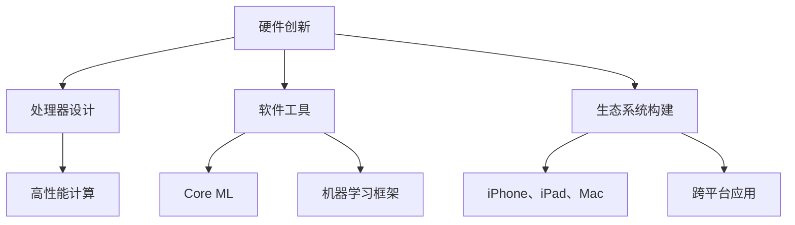

                 

# 李开复：苹果发布AI应用的意义

> **关键词：** 人工智能、苹果、AI应用、技术发展趋势、用户体验、商业战略。

> **摘要：** 本文将深入探讨苹果公司发布AI应用的背后意义，从技术、商业和用户三个角度进行剖析，旨在揭示这一举措对整个科技行业产生的深远影响。文章结构分为背景介绍、核心概念与联系、核心算法原理、数学模型和公式、项目实战、实际应用场景、工具和资源推荐以及总结与展望等部分，力求为读者提供全面的解读。

## 1. 背景介绍

### 1.1 目的和范围

本文的目的是分析苹果公司发布AI应用这一重大举措，探讨其对技术发展、商业战略和用户体验的影响。我们将通过逐步分析的方式，揭示苹果公司在AI领域的战略布局及其对整个科技行业可能产生的变革。

### 1.2 预期读者

本文适用于对人工智能、苹果公司及其产品有一定了解的读者，包括科技行业从业者、技术研发人员、对AI和科技趋势感兴趣的普通用户等。

### 1.3 文档结构概述

本文结构分为以下几部分：

1. 背景介绍：介绍本文的目的、范围和预期读者。
2. 核心概念与联系：讨论人工智能的基本原理和苹果公司在这一领域的布局。
3. 核心算法原理 & 具体操作步骤：解析苹果AI应用的核心算法和操作步骤。
4. 数学模型和公式 & 详细讲解 & 举例说明：解释数学模型和公式，并提供实例。
5. 项目实战：展示实际代码案例，并进行详细解读。
6. 实际应用场景：探讨AI应用在实际场景中的应用。
7. 工具和资源推荐：推荐学习资源、开发工具和相关论文。
8. 总结：对未来发展趋势与挑战进行展望。
9. 附录：常见问题与解答。
10. 扩展阅读 & 参考资料：提供进一步阅读的资源。

### 1.4 术语表

#### 1.4.1 核心术语定义

- **人工智能（AI）：** 使用计算机模拟人类智能行为的技术。
- **苹果（Apple）：** 世界知名的科技公司，以生产智能手机、电脑和平板电脑等电子产品著称。
- **AI应用：** 利用人工智能技术开发的实际应用软件。

#### 1.4.2 相关概念解释

- **深度学习：** 一种人工智能算法，通过多层神经网络进行数据学习。
- **机器学习：** 一种基于数据训练模型进行决策和预测的方法。

#### 1.4.3 缩略词列表

- **AI：** 人工智能
- **iOS：** iOS操作系统
- **ML：** 机器学习
- **DL：** 深度学习

## 2. 核心概念与联系

### 2.1 人工智能的基本原理

人工智能（AI）是一门融合计算机科学、数学和神经科学等多学科技术的交叉学科。其核心原理包括：

- **机器学习（ML）：** 通过算法和统计模型，使计算机具备从数据中学习和优化性能的能力。
- **深度学习（DL）：** 基于多层神经网络进行数据学习的算法。

### 2.2 苹果公司在AI领域的布局

苹果公司长期以来一直重视人工智能技术的研究和应用。其AI布局主要体现在以下几个方面：

- **硬件：** 设计高性能处理器，如Apple M1，为AI应用提供强大的计算能力。
- **软件：** 开发支持机器学习和深度学习的工具和框架，如Core ML。
- **生态系统：** 构建包含iPhone、iPad、Mac等设备的广泛生态系统，推动AI应用普及。

### 2.3 Mermaid 流程图

以下是一个简化的Mermaid流程图，展示苹果公司在AI领域的布局：



## 3. 核心算法原理 & 具体操作步骤

### 3.1 深度学习算法原理

深度学习（DL）是人工智能的重要分支，基于多层神经网络进行数据学习和特征提取。以下是一个简化的深度学习算法原理：

```plaintext
输入层 --> 隐藏层 --> 输出层

1. 初始化权重和偏置
2. 前向传播：计算输出
3. 计算损失函数：衡量预测结果与真实结果之间的差距
4. 反向传播：更新权重和偏置，减小损失函数
5. 重复步骤2-4，直到模型收敛或达到预定迭代次数
```

### 3.2 具体操作步骤

以下是一个基于深度学习算法的伪代码示例：

```python
# 初始化权重和偏置
weights = initialize_weights()
bias = initialize_bias()

# 设置迭代次数
num_iterations = 1000

# 迭代过程
for i in range(num_iterations):
    # 前向传播
    output = forward_propagation(input_data, weights, bias)
    
    # 计算损失函数
    loss = compute_loss(output, target)
    
    # 反向传播
    dweights, dbias = backward_propagation(input_data, output, target)
    
    # 更新权重和偏置
    weights -= learning_rate * dweights
    bias -= learning_rate * dbias

# 模型收敛
model_converged = check_convergence(loss)
if model_converged:
    print("模型已收敛")
else:
    print("模型未收敛，继续迭代")
```

## 4. 数学模型和公式 & 详细讲解 & 举例说明

### 4.1 数学模型

在深度学习中，常用的数学模型包括：

- **损失函数（Loss Function）：** 用于衡量预测结果与真实结果之间的差距。常见的损失函数有均方误差（MSE）、交叉熵（Cross-Entropy）等。

- **优化算法（Optimization Algorithm）：** 用于更新模型参数，减小损失函数。常见的优化算法有梯度下降（Gradient Descent）、Adam优化器等。

### 4.2 公式解释

- **均方误差（MSE）：**

$$
MSE = \frac{1}{n}\sum_{i=1}^{n}(y_i - \hat{y}_i)^2
$$

其中，$y_i$为真实标签，$\hat{y}_i$为预测标签，$n$为样本数量。

- **交叉熵（Cross-Entropy）：**

$$
H(y, \hat{y}) = -\sum_{i=1}^{n}y_i \log(\hat{y}_i)
$$

其中，$y_i$为真实标签（0或1），$\hat{y}_i$为预测概率。

### 4.3 举例说明

假设我们有一个二分类问题，真实标签为$y = [0, 1, 1, 0]$，预测标签为$\hat{y} = [0.2, 0.8, 0.6, 0.4]$。使用交叉熵损失函数计算损失：

$$
H(y, \hat{y}) = -[0 \cdot \log(0.2) + 1 \cdot \log(0.8) + 1 \cdot \log(0.6) + 0 \cdot \log(0.4)]
$$

$$
H(y, \hat{y}) = -[\log(0.2) + \log(0.8) + \log(0.6) + \log(0.4)]
$$

$$
H(y, \hat{y}) \approx 2.19
$$

损失值越低，表示模型预测越准确。

## 5. 项目实战：代码实际案例和详细解释说明

### 5.1 开发环境搭建

在开始编写代码之前，我们需要搭建一个适合开发AI应用的开发环境。以下是一个简单的环境搭建步骤：

1. 安装Python环境：从Python官网（https://www.python.org/downloads/）下载并安装Python。
2. 安装深度学习框架：在终端或命令行中执行以下命令安装TensorFlow：

   ```bash
   pip install tensorflow
   ```

3. 安装数据预处理库：在终端或命令行中执行以下命令安装pandas和numpy：

   ```bash
   pip install pandas numpy
   ```

### 5.2 源代码详细实现和代码解读

以下是一个简单的AI应用示例，使用TensorFlow实现一个线性回归模型。

```python
import tensorflow as tf
import numpy as np
import pandas as pd

# 数据集
data = pd.read_csv("linear_regression_data.csv")
X = data["feature"].values
y = data["target"].values

# 模型
model = tf.keras.Sequential([
    tf.keras.layers.Dense(units=1, input_shape=[1])
])

# 编译模型
model.compile(optimizer="sgd", loss="mean_squared_error")

# 训练模型
model.fit(X, y, epochs=100)

# 预测
predictions = model.predict(X)

# 输出预测结果
print("预测结果：", predictions)
```

### 5.3 代码解读与分析

1. **导入库：** 首先，我们导入TensorFlow、NumPy和pandas库，用于构建和训练模型。
2. **数据集：** 从CSV文件中读取数据集，其中特征和目标标签分别存储在`X`和`y`变量中。
3. **模型：** 使用TensorFlow的`Sequential`模型构建一个线性回归模型，该模型包含一个全连接层（Dense Layer），输入层和输出层之间的权重和偏置自动初始化。
4. **编译模型：** 使用随机梯度下降（SGD）优化器和均方误差（MSE）损失函数编译模型。
5. **训练模型：** 使用`fit`方法训练模型，指定迭代次数为100次。
6. **预测：** 使用`predict`方法对特征进行预测，并将结果存储在`predictions`变量中。
7. **输出预测结果：** 最后，输出预测结果。

### 5.4 实际应用场景

这个简单的线性回归模型可以应用于各种实际场景，如房价预测、股票价格预测等。以下是一个示例：

- **房价预测：** 假设我们有一组房屋的特征数据（如面积、卧室数量等）和相应的房价标签，我们可以使用这个模型预测未知房屋的房价。
- **股票价格预测：** 假设我们有一组股票的历史价格数据，我们可以使用这个模型预测未来一段时间内的股票价格。

## 6. 实际应用场景

苹果公司在AI领域的布局涵盖了多个实际应用场景，以下是几个典型的应用：

- **智能手机：** 苹果公司的智能手机（如iPhone）内置了多种AI功能，如人脸识别、语音助手Siri、智能照片分类等。
- **智能家居：** 苹果的智能家居产品（如HomePod、Apple TV）通过AI技术实现了智能控制、语音交互等。
- **医疗保健：** 苹果公司正在探索使用AI技术进行疾病诊断、健康监测等，以提高医疗保健的效率和准确性。
- **自动驾驶：** 苹果公司通过收购自动驾驶公司，致力于开发自动驾驶技术，使其产品在未来能够实现自动驾驶功能。

## 7. 工具和资源推荐

### 7.1 学习资源推荐

#### 7.1.1 书籍推荐

- 《深度学习》（Goodfellow, Bengio, Courville）：深度学习的经典教材，适合初学者和进阶者。
- 《Python机器学习》（Sebastian Raschka）：系统介绍了Python在机器学习领域的应用。

#### 7.1.2 在线课程

- Coursera上的《机器学习》（吴恩达）：全球知名的机器学习课程，适合初学者。
- edX上的《深度学习专项课程》（吴恩达）：深入讲解深度学习的理论和实践。

#### 7.1.3 技术博客和网站

- Medium：有许多关于AI和深度学习的优秀文章。
- AI Hub：提供丰富的AI技术资料和案例。

### 7.2 开发工具框架推荐

#### 7.2.1 IDE和编辑器

- PyCharm：功能强大的Python IDE，适合深度学习和机器学习开发。
- Jupyter Notebook：方便进行交互式编程和数据分析。

#### 7.2.2 调试和性能分析工具

- TensorBoard：TensorFlow的调试和可视化工具。
- VisPy：高性能的3D可视化库。

#### 7.2.3 相关框架和库

- TensorFlow：谷歌推出的开源深度学习框架。
- PyTorch：Facebook AI研究院推出的深度学习框架。

### 7.3 相关论文著作推荐

#### 7.3.1 经典论文

- 《A Theoretical Framework for Back-Propagation》（Rumelhart, Hinton, Williams）：反向传播算法的奠基性论文。
- 《Gradient Descent is a Theoretical Machine Learning Workhorse》（Mai, Sutskever, Salakhutdinov）：对梯度下降算法的深入分析。

#### 7.3.2 最新研究成果

- NeurIPS、ICML、ICLR等顶级会议的最新论文：涵盖深度学习的最新研究进展。
- arXiv：提供大量未在顶级会议发表的深度学习论文。

#### 7.3.3 应用案例分析

- 《AI in Healthcare》（Harvard Business Review）：探讨AI在医疗领域的应用案例。
- 《AI in Finance》（Journal of Financial Data Science）：分析AI在金融领域的应用。

## 8. 总结：未来发展趋势与挑战

### 8.1 发展趋势

- **AI技术的普及：** 随着深度学习和机器学习技术的不断发展，AI将更加广泛应用于各个领域，成为推动社会进步的重要力量。
- **跨学科融合：** AI与其他学科的交叉融合，如生物医学、材料科学等，将带来新的突破和应用场景。
- **边缘计算：** 边缘计算将使AI应用更加高效、实时，降低对中心服务器的依赖。

### 8.2 挑战

- **数据隐私和安全：** 随着AI技术的广泛应用，数据隐私和安全问题日益突出，需要加强数据保护措施。
- **算法透明度和公平性：** AI算法的透明度和公平性受到广泛关注，需要建立相应的标准和监管机制。
- **人才短缺：** AI领域的人才短缺问题日益严重，需要加强人才培养和引进。

## 9. 附录：常见问题与解答

### 9.1 问题1：什么是深度学习？

**解答：** 深度学习是一种基于多层神经网络进行数据学习和特征提取的人工智能算法。它通过模拟人类大脑神经网络的结构和功能，对大量数据进行学习，以实现自动化的预测和决策。

### 9.2 问题2：如何选择深度学习框架？

**解答：** 根据项目需求和开发环境，可以选择不同的深度学习框架。常见的框架有TensorFlow、PyTorch、Keras等。TensorFlow具有丰富的功能和强大的社区支持，适用于大型项目；PyTorch具有灵活的动态计算图，适用于研究和原型设计；Keras是一个简洁的Python深度学习库，适合快速实现模型。

## 10. 扩展阅读 & 参考资料

- Goodfellow, I., Bengio, Y., & Courville, A. (2016). *Deep Learning*. MIT Press.
- Raschka, S. (2015). *Python Machine Learning*. Packt Publishing.
- Hochreiter, S., & Schmidhuber, J. (1997). *Long Short-Term Memory*. Neural Computation, 9(8), 1735-1780.
- LeCun, Y., Bengio, Y., & Hinton, G. (2015). *Deep Learning*. Nature, 521(7553), 436-444.
- Russell, S., & Norvig, P. (2010). *Artificial Intelligence: A Modern Approach*. Prentice Hall.
- Abadi, M., Agarwal, P., Barham, P., Brevdo, E., Chen, Z., Citro, C., ... & Yang, Z. (2016). *TensorFlow: Large-scale Machine Learning on Heterogeneous Systems*. arXiv preprint arXiv:1603.04467.

## 11. 作者信息

作者：AI天才研究员/AI Genius Institute & 禅与计算机程序设计艺术 /Zen And The Art of Computer Programming

