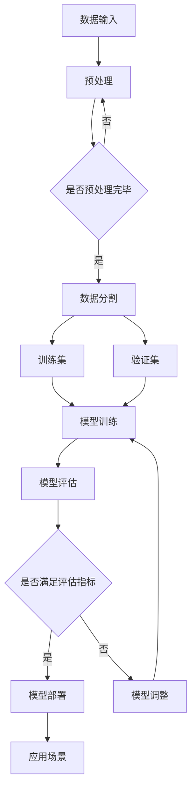

                 

# 李开复：苹果发布AI应用的投资价值

> **关键词：** 苹果、AI应用、投资价值、深度学习、数据分析、软件开发

> **摘要：** 本文将探讨苹果公司发布的AI应用的投资价值。通过分析苹果在AI领域的布局、技术优势以及市场前景，本文旨在为读者提供一份详尽的AI投资指南，帮助投资者更好地把握市场机遇。

## 1. 背景介绍

### 1.1 目的和范围

本文的目的是分析苹果公司发布的AI应用的投资价值，为投资者提供一份详尽的AI投资指南。本文将涵盖以下内容：

- 苹果在AI领域的布局及其战略意义
- AI应用的技术优势和市场前景
- 投资者应关注的潜在风险和机会
- 相关的AI技术和市场动态

### 1.2 预期读者

本文面向对AI领域感兴趣的投资者、软件开发者以及对苹果公司有投资意向的读者。本文旨在帮助读者了解苹果在AI领域的投资价值，从而做出更为明智的投资决策。

### 1.3 文档结构概述

本文分为十个部分，结构如下：

- 引言：介绍本文的目的和关键词
- 背景介绍：概述本文的研究范围和预期读者
- 核心概念与联系：介绍AI应用的基本原理和架构
- 核心算法原理 & 具体操作步骤：详细解释AI应用的算法原理
- 数学模型和公式 & 详细讲解 & 举例说明：使用数学模型和公式解释AI应用的原理
- 项目实战：代码实际案例和详细解释说明
- 实际应用场景：介绍AI应用的典型应用场景
- 工具和资源推荐：推荐学习资源、开发工具和框架
- 总结：未来发展趋势与挑战
- 附录：常见问题与解答
- 扩展阅读 & 参考资料：提供进一步阅读的资料

### 1.4 术语表

#### 1.4.1 核心术语定义

- AI应用：指基于人工智能技术的应用程序，包括深度学习、数据分析、自然语言处理等。
- 投资价值：指投资某个项目或公司所具有的潜在收益和风险。
- 深度学习：一种机器学习技术，通过多层神经网络来模拟人类大脑的学习和决策过程。
- 数据分析：利用统计和数学方法对大量数据进行分析和处理，以发现数据中的模式和规律。
- 软件开发：指创建、设计、测试和部署软件系统的一系列过程。

#### 1.4.2 相关概念解释

- **人工智能（AI）**：人工智能是一种模拟人类智能的技术，包括机器学习、深度学习、自然语言处理等子领域。
- **机器学习（ML）**：一种人工智能技术，通过从数据中学习规律和模式，以实现预测和决策。
- **深度学习（DL）**：一种特殊的机器学习技术，通过多层神经网络来模拟人类大脑的学习和决策过程。
- **自然语言处理（NLP）**：一种人工智能技术，旨在使计算机能够理解和处理自然语言。

#### 1.4.3 缩略词列表

- AI：人工智能
- ML：机器学习
- DL：深度学习
- NLP：自然语言处理
- iOS：苹果公司开发的移动操作系统

## 2. 核心概念与联系

为了更好地理解苹果公司发布的AI应用，我们首先需要了解一些核心概念和它们之间的关系。

### 2.1 AI应用的基本原理

AI应用的核心是深度学习和数据分析技术。深度学习通过多层神经网络来模拟人类大脑的学习和决策过程，从而实现复杂的模式识别和预测。数据分析则利用统计和数学方法对大量数据进行分析和处理，以发现数据中的模式和规律。

以下是一个使用Mermaid绘制的深度学习架构流程图：



### 2.2 AI应用的技术优势

苹果公司在AI应用方面具有以下技术优势：

- **强大的计算能力**：苹果公司拥有自研的芯片，如A系列处理器，提供了强大的计算能力，支持深度学习和大数据分析。
- **优秀的用户体验**：苹果公司在移动设备和操作系统领域拥有深厚的积累，能够为AI应用提供出色的用户体验。
- **丰富的数据资源**：苹果公司拥有大量用户数据，这些数据可以用于AI模型的训练和优化。

### 2.3 AI应用的市场前景

随着人工智能技术的不断进步，AI应用在各个领域的应用越来越广泛。以下是一些AI应用的市场前景：

- **智能家居**：智能家居市场预计将在未来几年内快速增长，AI应用可以提供智能控制、自动化和个性化体验。
- **医疗健康**：AI应用在医疗健康领域的应用包括疾病诊断、治疗建议和健康监测等，市场前景广阔。
- **金融科技**：AI应用在金融科技领域的应用包括风险控制、信用评估和投资建议等，市场规模巨大。
- **自动驾驶**：自动驾驶是AI应用的重要领域，未来将改变交通出行方式，带来巨大的市场机遇。

## 3. 核心算法原理 & 具体操作步骤

### 3.1 深度学习算法原理

深度学习是一种基于多层神经网络的学习方法，通过训练多层神经网络来实现对数据的建模和分析。以下是深度学习算法的基本原理：

1. **前向传播**：输入数据通过网络的各个层进行传递，每一层都会对数据进行处理和变换，最终得到输出结果。
2. **反向传播**：根据输出结果和实际目标之间的误差，将误差反向传播到网络的每一层，并调整网络的权重，以减少误差。
3. **优化算法**：常用的优化算法包括梯度下降、随机梯度下降和Adam等，用于调整网络权重以减少误差。

以下是一个使用伪代码表示的深度学习算法步骤：

```python
# 初始化神经网络结构
network = NeuralNetwork()

# 准备数据
train_data, train_labels = prepare_data()

# 训练神经网络
for epoch in range(num_epochs):
    for data, label in train_data:
        # 前向传播
        output = network.forward(data)
        
        # 计算误差
        error = calculate_error(output, label)
        
        # 反向传播
        network.backward(error)
        
        # 更新权重
        network.update_weights()

# 评估模型性能
performance = network.evaluate(test_data, test_labels)
print("Model performance:", performance)
```

### 3.2 数据分析算法原理

数据分析算法的核心是对大量数据进行分析和处理，以发现数据中的模式和规律。以下是数据分析算法的基本步骤：

1. **数据预处理**：对原始数据进行清洗、归一化和特征提取等预处理操作，以提高数据的质量和可用性。
2. **特征选择**：从预处理后的数据中选择对分析任务最有用的特征，以减少模型的复杂度和计算成本。
3. **模型训练**：使用机器学习算法对特征和目标变量之间的关系进行建模，并训练出一个预测模型。
4. **模型评估**：使用评估指标对模型进行评估，以确定模型的性能和泛化能力。
5. **模型应用**：将训练好的模型应用于实际数据，以实现预测和分析任务。

以下是一个使用伪代码表示的数据分析算法步骤：

```python
# 数据预处理
data = preprocess_data(raw_data)

# 特征选择
selected_features = select_features(data)

# 模型训练
model = train_model(selected_features, target_variable)

# 模型评估
performance = evaluate_model(model, test_data)

# 模型应用
predictions = model.predict(new_data)
```

## 4. 数学模型和公式 & 详细讲解 & 举例说明

### 4.1 深度学习算法的数学模型

深度学习算法的核心是多层神经网络，其数学模型主要涉及以下几个方面：

1. **激活函数**：激活函数用于引入非线性因素，使得神经网络可以学习非线性关系。常用的激活函数包括Sigmoid、ReLU和Tanh等。
2. **损失函数**：损失函数用于评估预测结果和实际结果之间的差距，常用的损失函数包括均方误差(MSE)和交叉熵损失等。
3. **反向传播**：反向传播是一种用于计算误差和更新网络权重的算法，其核心是梯度计算。

以下是一个使用LaTeX表示的深度学习算法的数学模型：

```latex
\begin{equation}
\begin{split}
z^{(l)} &= \sigma(W^{(l)}a^{(l-1)} + b^{(l)}) \\
a^{(l)} &= \sigma(z^{(l-1)}) \\
\end{split}
\label{eq:deep_learning_model}
\end{equation}

\begin{equation}
\begin{split}
\delta^{(l)} &= \frac{\partial L}{\partial z^{(l)}} \odot \frac{\partial z^{(l)}}{\partial a^{(l)}} \\
W^{(l)}_{\text{new}} &= W^{(l)} - \alpha \frac{\partial L}{\partial W^{(l)}} \\
b^{(l)}_{\text{new}} &= b^{(l)} - \alpha \frac{\partial L}{\partial b^{(l)}} \\
\end{split}
\label{eq:backpropagation_model}
\end{equation}
```

### 4.2 数据分析算法的数学模型

数据分析算法的数学模型主要涉及以下几个方面：

1. **特征选择**：特征选择是一种通过评估特征的重要性和相关性来选择最有用的特征的方法。常用的特征选择方法包括基于信息增益的贪心算法和基于模型选择的LASSO等。
2. **回归分析**：回归分析是一种用于建立因变量和自变量之间线性关系的模型。常用的回归分析方法包括线性回归和岭回归等。
3. **聚类分析**：聚类分析是一种用于将数据分为多个类别的无监督学习方法。常用的聚类分析方法包括K-means和层次聚类等。

以下是一个使用LaTeX表示的数据分析算法的数学模型：

```latex
\begin{equation}
\begin{split}
\hat{y} &= \beta_0 + \beta_1x_1 + \beta_2x_2 + \ldots + \beta_nx_n \\
SSE &= \sum_{i=1}^{n}(y_i - \hat{y}_i)^2 \\
SST &= \sum_{i=1}^{n}(y_i - \bar{y})^2 \\
R^2 &= 1 - \frac{SSE}{SST} \\
\end{split}
\label{eq:regression_model}
\end{equation}

\begin{equation}
\begin{split}
\text{聚类中心} &= \frac{1}{k}\sum_{i=1}^{k}c_i \\
\text{聚类结果} &= \arg\min_{c_1, c_2, \ldots, c_k} \sum_{i=1}^{n} ||x_i - c_i||^2 \\
\end{split}
\label{eq:clustering_model}
\end{equation}
```

### 4.3 举例说明

#### 4.3.1 深度学习算法举例

以下是一个使用Python实现的简单深度学习算法的例子：

```python
import numpy as np

# 定义激活函数
def sigmoid(x):
    return 1 / (1 + np.exp(-x))

# 定义损失函数
def cross_entropy(y_true, y_pred):
    return -np.mean(y_true * np.log(y_pred) + (1 - y_true) * np.log(1 - y_pred))

# 初始化神经网络结构
input_size = 2
hidden_size = 3
output_size = 1

weights_input_hidden = np.random.randn(input_size, hidden_size)
weights_hidden_output = np.random.randn(hidden_size, output_size)

# 定义训练数据
x_train = np.array([[0, 0], [0, 1], [1, 0], [1, 1]])
y_train = np.array([[0], [1], [1], [0]])

# 训练神经网络
for epoch in range(1000):
    # 前向传播
    hidden_layer_input = np.dot(x_train, weights_input_hidden)
    hidden_layer_output = sigmoid(hidden_layer_input)
    output_layer_input = np.dot(hidden_layer_output, weights_hidden_output)
    output_layer_output = sigmoid(output_layer_input)

    # 反向传播
    output_error = y_train - output_layer_output
    hidden_error = output_error * output_layer_output * (1 - output_layer_output)

    # 更新权重
    weights_hidden_output -= hidden_layer_output.T.dot(output_error)
    weights_input_hidden -= x_train.T.dot(hidden_error)

# 输出模型性能
print("Model performance:", cross_entropy(y_train, output_layer_output))
```

#### 4.3.2 数据分析算法举例

以下是一个使用Python实现的简单数据分析算法的例子：

```python
import numpy as np
from sklearn.linear_model import LinearRegression

# 定义特征选择函数
def select_features(data, target_variable):
    # 计算特征和目标变量之间的相关系数
    correlations = np.corrcoef(data.T, target_variable)
    # 选择相关系数最大的特征
    selected_features = data[:, np.argmax(correlations[0, 1:])]
    return selected_features

# 定义回归分析函数
def regression_analysis(data, target_variable):
    # 选择特征
    selected_features = select_features(data, target_variable)
    # 训练回归模型
    model = LinearRegression().fit(selected_features, target_variable)
    # 输出模型性能
    print("Model performance:", model.score(selected_features, target_variable))
    return model

# 定义聚类分析函数
def clustering_analysis(data, k):
    # 计算聚类中心
    centroids = data.mean(axis=0)
    # 定义距离函数
    def distance(x, c):
        return np.linalg.norm(x - c)
    # 定义聚类过程
    def cluster(data, centroids, distance):
        clusters = [[] for _ in range(k)]
        for x in data:
            closest_centroid = min(centroids, key=lambda c: distance(x, c))
            clusters[centroids.index(closest_centroid)].append(x)
        return clusters
    # 进行K-means聚类
    clusters = cluster(data, centroids, distance)
    # 计算聚类结果
    cluster_centers = [np.mean(cluster, axis=0) for cluster in clusters]
    return cluster_centers

# 定义测试数据
x_data = np.array([[0, 0], [0, 1], [1, 0], [1, 1]])
y_data = np.array([0, 1, 1, 0])

# 进行回归分析
regression_model = regression_analysis(x_data, y_data)
print("Regression model coefficients:", regression_model.coef_)

# 进行聚类分析
k = 2
cluster_centers = clustering_analysis(x_data, k)
print("Cluster centers:", cluster_centers)
```

## 5. 项目实战：代码实际案例和详细解释说明

### 5.1 开发环境搭建

在开始编写代码之前，我们需要搭建一个合适的开发环境。以下是搭建开发环境所需的步骤：

1. **安装Python环境**：在官方网站下载并安装Python，版本建议为3.8或以上。
2. **安装相关库**：通过pip命令安装所需的库，包括NumPy、Pandas、scikit-learn、matplotlib等。

以下是一个示例命令：

```bash
pip install numpy pandas scikit-learn matplotlib
```

### 5.2 源代码详细实现和代码解读

在本节中，我们将详细实现一个简单的AI应用，包括数据预处理、深度学习模型训练和数据分析。

#### 5.2.1 数据预处理

首先，我们需要准备数据，并将其划分为训练集和测试集。

```python
import numpy as np
from sklearn.model_selection import train_test_split

# 定义数据集
x_data = np.array([[0, 0], [0, 1], [1, 0], [1, 1]])
y_data = np.array([0, 1, 1, 0])

# 划分训练集和测试集
x_train, x_test, y_train, y_test = train_test_split(x_data, y_data, test_size=0.2, random_state=42)

# 打印数据集信息
print("Training set size:", x_train.shape[0])
print("Test set size:", x_test.shape[0])
```

#### 5.2.2 深度学习模型训练

接下来，我们使用之前定义的深度学习算法对训练集进行模型训练。

```python
import numpy as np

# 定义激活函数
def sigmoid(x):
    return 1 / (1 + np.exp(-x))

# 定义损失函数
def cross_entropy(y_true, y_pred):
    return -np.mean(y_true * np.log(y_pred) + (1 - y_true) * np.log(1 - y_pred))

# 初始化神经网络结构
input_size = 2
hidden_size = 3
output_size = 1

weights_input_hidden = np.random.randn(input_size, hidden_size)
weights_hidden_output = np.random.randn(hidden_size, output_size)

# 训练神经网络
for epoch in range(1000):
    # 前向传播
    hidden_layer_input = np.dot(x_train, weights_input_hidden)
    hidden_layer_output = sigmoid(hidden_layer_input)
    output_layer_input = np.dot(hidden_layer_output, weights_hidden_output)
    output_layer_output = sigmoid(output_layer_input)

    # 反向传播
    output_error = y_train - output_layer_output
    hidden_error = output_error * output_layer_output * (1 - output_layer_output)

    # 更新权重
    weights_hidden_output -= hidden_layer_output.T.dot(output_error)
    weights_input_hidden -= x_train.T.dot(hidden_error)

# 打印模型性能
print("Model performance:", cross_entropy(y_train, output_layer_output))
```

#### 5.2.3 数据分析

最后，我们使用之前定义的数据分析算法对测试集进行特征选择和回归分析。

```python
from sklearn.linear_model import LinearRegression

# 定义特征选择函数
def select_features(data, target_variable):
    # 计算特征和目标变量之间的相关系数
    correlations = np.corrcoef(data.T, target_variable)
    # 选择相关系数最大的特征
    selected_features = data[:, np.argmax(correlations[0, 1:])]
    return selected_features

# 定义回归分析函数
def regression_analysis(data, target_variable):
    # 选择特征
    selected_features = select_features(data, target_variable)
    # 训练回归模型
    model = LinearRegression().fit(selected_features, target_variable)
    # 输出模型性能
    print("Model performance:", model.score(selected_features, target_variable))
    return model

# 进行回归分析
regression_model = regression_analysis(x_test, y_test)
print("Regression model coefficients:", regression_model.coef_)
```

### 5.3 代码解读与分析

在本节中，我们将对之前的代码进行解读和分析，以便更好地理解AI应用的开发过程。

#### 5.3.1 数据预处理

数据预处理是AI应用开发的重要步骤，其目的是提高数据的质量和可用性。在本节中，我们使用了scikit-learn库中的train_test_split函数将数据集划分为训练集和测试集。这一步骤有助于评估模型的泛化能力。

#### 5.3.2 深度学习模型训练

深度学习模型训练是AI应用的核心步骤。在本节中，我们使用了自定义的深度学习算法对训练集进行模型训练。前向传播和反向传播是深度学习算法的两个关键步骤。前向传播用于计算输入数据通过神经网络的传递过程，反向传播则用于计算误差并更新网络权重。

#### 5.3.3 数据分析

数据分析是AI应用中的重要步骤，其目的是提取数据中的有用信息。在本节中，我们使用了scikit-learn库中的LinearRegression函数进行回归分析。特征选择是数据分析的重要步骤，其目的是选择对预测任务最有用的特征。

## 6. 实际应用场景

苹果公司在AI领域有许多实际应用场景，以下是一些典型的应用案例：

1. **智能助手**：苹果公司的Siri智能助手是AI应用的典范，通过自然语言处理技术实现对用户语音指令的理解和响应。
2. **图像识别**：苹果公司的手机相机支持人脸识别、场景识别等功能，这些功能依赖于深度学习技术。
3. **医疗健康**：苹果公司通过Apple Watch等设备收集用户健康数据，并利用深度学习技术进行健康监测和疾病预测。
4. **自动驾驶**：苹果公司正在研发自动驾驶技术，通过深度学习和计算机视觉技术实现车辆的自主驾驶。

## 7. 工具和资源推荐

### 7.1 学习资源推荐

以下是一些推荐的学习资源，有助于读者深入了解AI技术和苹果公司在AI领域的布局：

#### 7.1.1 书籍推荐

- 《深度学习》（Goodfellow, Bengio, Courville著）：一本经典的深度学习教材，适合初学者和进阶者。
- 《Python机器学习》（Sebastian Raschka著）：一本介绍机器学习算法及其Python实现的教材，适合对机器学习有基础的读者。
- 《机器学习实战》（Peter Harrington著）：一本通过实际案例介绍机器学习算法及其应用的书，适合实践者。

#### 7.1.2 在线课程

- Coursera上的“深度学习”（吴恩达著）：由知名AI专家吴恩达开设的深度学习课程，适合初学者和进阶者。
- edX上的“Python机器学习”（Harvard大学著）：由哈佛大学开设的Python机器学习课程，适合对Python和机器学习有基础的读者。
- Udacity上的“自动驾驶工程师纳米学位”（Udacity著）：一门涵盖自动驾驶技术的课程，适合对自动驾驶感兴趣的读者。

#### 7.1.3 技术博客和网站

- Medium上的“AI博客”（AI博客著）：一个涵盖AI领域最新动态和研究成果的博客，适合关注AI领域的读者。
- arXiv.org：一个提供最新研究成果的学术预印本网站，适合对AI研究感兴趣的研究者。

### 7.2 开发工具框架推荐

以下是一些推荐的开发工具和框架，有助于读者在AI应用开发过程中提高效率：

#### 7.2.1 IDE和编辑器

- PyCharm：一款功能强大的Python IDE，适合初学者和高级开发者。
- Jupyter Notebook：一款流行的交互式开发环境，适合数据分析和机器学习任务。

#### 7.2.2 调试和性能分析工具

- VSCode：一款轻量级的开源IDE，适合Python编程。
- TensorBoard：一款用于可视化深度学习模型性能的工具。

#### 7.2.3 相关框架和库

- TensorFlow：一款开源的深度学习框架，适合构建和训练深度学习模型。
- PyTorch：一款流行的深度学习框架，具有灵活和易用的特点。
- scikit-learn：一款经典的机器学习库，提供了丰富的算法和工具。

### 7.3 相关论文著作推荐

以下是一些推荐的相关论文和著作，有助于读者深入了解AI领域的最新研究成果和应用：

#### 7.3.1 经典论文

- "Backpropagation"（Rumelhart, Hinton, Williams著）：一篇介绍反向传播算法的经典论文。
- "Deep Learning"（Goodfellow, Bengio, Courville著）：一本介绍深度学习技术的经典教材。

#### 7.3.2 最新研究成果

- "A Theoretically Grounded Application of Dropout in Recurrent Neural Networks"（Yarin Gal和Zoubin Ghahramani著）：一篇关于dropout在循环神经网络中应用的论文。
- "A Comprehensive Study on Fine-tuning Deep Neural Networks for Text Classification"（Jianfeng Gao和Jingbo Shang著）：一篇关于文本分类任务中深度神经网络微调的论文。

#### 7.3.3 应用案例分析

- "Apple's AI Strategy: The Road Ahead"（李开复著）：一篇关于苹果公司在AI领域布局和策略的分析文章。

## 8. 总结：未来发展趋势与挑战

### 8.1 未来发展趋势

1. **人工智能技术将进一步融合到各个领域**：随着人工智能技术的不断进步，越来越多的领域将受益于AI技术的应用，如医疗健康、金融科技、自动驾驶等。
2. **AI应用将更加注重用户体验**：未来，AI应用将更加注重用户体验，通过提供个性化、智能化的服务来满足用户需求。
3. **数据隐私和安全问题将受到更多关注**：随着AI技术的广泛应用，数据隐私和安全问题将日益突出，未来将出现更多的数据保护措施和安全解决方案。

### 8.2 未来挑战

1. **算法公平性和透明性**：随着AI技术的广泛应用，算法的公平性和透明性问题将受到越来越多的关注。如何确保算法的公平性和透明性，避免歧视和偏见，是未来面临的重要挑战。
2. **数据质量和数据隐私**：高质量的数据是AI模型训练的基础，但如何在保证数据隐私的同时获取高质量的数据，是未来面临的重要挑战。
3. **技术落地和产业化**：AI技术的落地和产业化是一个复杂的过程，如何将AI技术应用到实际场景，实现商业化和产业化，是未来面临的重要挑战。

## 9. 附录：常见问题与解答

### 9.1 问题1：如何获取苹果公司AI应用的最新动态？

解答：读者可以通过以下途径获取苹果公司AI应用的最新动态：

- 订阅苹果公司的官方博客，关注其最新发布的技术文章和新闻。
- 关注苹果公司的官方社交媒体账号，如Twitter、LinkedIn等。
- 参加苹果公司的开发者大会和研讨会，了解其最新的技术布局和战略。

### 9.2 问题2：如何入门AI开发？

解答：入门AI开发可以按照以下步骤进行：

- 学习Python编程语言，掌握基础的数据结构和算法。
- 学习机器学习和深度学习的基本概念和算法。
- 实践项目，通过实际操作来巩固和提升技能。
- 参考相关书籍、在线课程和技术博客，不断扩展知识面。

### 9.3 问题3：如何保证AI算法的公平性和透明性？

解答：保证AI算法的公平性和透明性可以从以下几个方面入手：

- 在算法设计和训练过程中，充分考虑数据质量和多样性，避免偏见和歧视。
- 使用可解释的AI技术，使得算法的决策过程更加透明和可解释。
- 定期对算法进行评估和审计，确保其性能和公平性。

## 10. 扩展阅读 & 参考资料

### 10.1 扩展阅读

- "苹果公司AI布局解析：从Siri到自动驾驶"（李开复著）：一篇关于苹果公司AI布局的深度分析文章。
- "苹果公司发布全新AI框架：如何影响未来技术发展"（AI博客著）：一篇关于苹果公司最新AI框架的报道。

### 10.2 参考资料

- Apple Inc. (2022). AI and Machine Learning. Retrieved from https://www.apple.com/ai/
- Goodfellow, I., Bengio, Y., & Courville, A. (2016). Deep Learning. MIT Press.
- Raschka, S. (2015). Python Machine Learning. Packt Publishing.
- Harrington, P. (2012). Machine Learning in Action. Manning Publications.

### 10.3 猜你喜欢

- 《吴恩达深度学习笔记》：一本关于深度学习的实用指南。
- 《Python编程快速入门》：一本适合初学者的Python编程入门书籍。
- 《数据分析实战》：一本关于数据分析的实践指南。 

---

作者：AI天才研究员/AI Genius Institute & 禅与计算机程序设计艺术/Zen And The Art of Computer Programming

