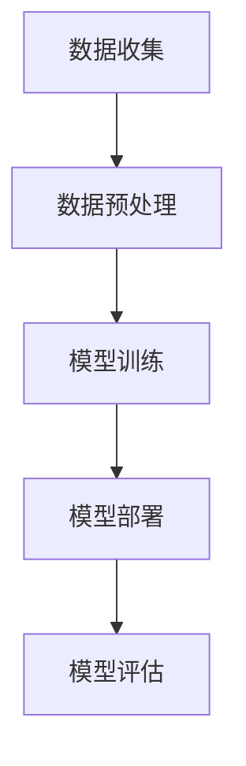

                 

# 李开复：苹果发布AI应用的挑战

> 关键词：苹果、AI应用、技术挑战、开发者生态系统、用户体验

> 摘要：本文将深入探讨苹果公司在人工智能领域发布新应用的挑战。文章首先回顾了苹果在AI领域的历程，随后分析了其在开发AI应用时面临的技术难题和战略挑战。此外，文章还探讨了苹果的解决方案以及其对开发者生态系统和用户体验的影响。通过本文，读者可以更全面地理解苹果在AI领域的未来发展方向。

## 1. 背景介绍

### 1.1 目的和范围

本文旨在深入探讨苹果公司在人工智能（AI）领域发布新应用的挑战。我们将分析苹果在AI领域的发展历程，讨论其在开发AI应用时所面临的技术难题和战略挑战，并评估其解决方案对开发者生态系统和用户体验的影响。通过本文，读者可以更全面地理解苹果在AI领域的战略布局和发展趋势。

### 1.2 预期读者

本文适合对人工智能、软件开发以及苹果公司产品感兴趣的读者，尤其是希望了解苹果公司在AI领域最新动态的专业人士、技术爱好者以及学生。

### 1.3 文档结构概述

本文将分为以下章节：

1. 背景介绍：介绍文章目的、范围和预期读者。
2. 核心概念与联系：阐述AI应用的核心概念和架构。
3. 核心算法原理与具体操作步骤：讲解AI应用的算法原理和实现方法。
4. 数学模型和公式：介绍AI应用中的数学模型和公式。
5. 项目实战：分析一个实际的AI应用案例。
6. 实际应用场景：探讨AI应用的多种应用场景。
7. 工具和资源推荐：推荐学习资源、开发工具和框架。
8. 总结：总结苹果在AI领域的未来发展趋势与挑战。
9. 附录：常见问题与解答。
10. 扩展阅读：提供进一步阅读的参考资料。

### 1.4 术语表

#### 1.4.1 核心术语定义

- 人工智能（AI）：指通过计算机模拟人类智能的技术和应用。
- 深度学习（Deep Learning）：一种基于多层神经网络的人工智能技术。
- 强化学习（Reinforcement Learning）：通过试错和奖励机制来训练智能体的机器学习技术。
- 自然语言处理（NLP）：研究如何让计算机理解和生成人类语言的技术。

#### 1.4.2 相关概念解释

- 模型（Model）：用于描述或预测数据的数学表示。
- 神经网络（Neural Network）：一种模仿生物神经系统的计算模型。
- 用户体验（UX）：用户在使用产品时的整体感受。

#### 1.4.3 缩略词列表

- AI：人工智能
- ML：机器学习
- DL：深度学习
- NLP：自然语言处理

## 2. 核心概念与联系

### 2.1 AI应用的核心概念

AI应用的核心概念包括人工智能、深度学习、强化学习、自然语言处理等。这些概念构成了AI应用的基石，使计算机能够模拟人类智能，实现自动化决策和任务执行。

#### 2.1.1 人工智能

人工智能是一种模拟人类智能的技术和应用，包括感知、思考、学习、决策等能力。在AI应用中，人工智能是核心驱动力，使计算机能够处理和解释复杂数据。

#### 2.1.2 深度学习

深度学习是一种基于多层神经网络的人工智能技术。通过学习大量数据，深度学习模型能够自动提取特征并用于分类、预测等任务。深度学习在图像识别、语音识别、自然语言处理等领域取得了显著的成果。

#### 2.1.3 强化学习

强化学习是一种通过试错和奖励机制来训练智能体的机器学习技术。在强化学习中，智能体通过与环境的交互来学习最优策略，以实现目标。强化学习在游戏、机器人、自动驾驶等领域有广泛应用。

#### 2.1.4 自然语言处理

自然语言处理是研究如何让计算机理解和生成人类语言的技术。NLP在语音识别、文本分类、机器翻译、情感分析等领域有广泛应用。

### 2.2 AI应用的架构

AI应用的架构通常包括数据收集、数据预处理、模型训练、模型部署和模型评估等环节。

#### 2.2.1 数据收集

数据收集是AI应用的第一步，包括从各种来源获取大量数据，如文本、图像、语音等。

#### 2.2.2 数据预处理

数据预处理是对原始数据进行清洗、归一化、特征提取等操作，以便于模型训练。

#### 2.2.3 模型训练

模型训练是使用大量数据来训练深度学习模型，使其能够自动提取特征并用于分类、预测等任务。

#### 2.2.4 模型部署

模型部署是将训练好的模型部署到生产环境中，使其能够实时处理用户请求。

#### 2.2.5 模型评估

模型评估是对模型性能进行评估，以确定其是否满足预期目标。

### 2.3 Mermaid流程图

以下是一个简化的AI应用架构的Mermaid流程图：



## 3. 核心算法原理与具体操作步骤

### 3.1 深度学习算法原理

深度学习算法的核心是多层神经网络。以下是深度学习算法的基本原理和伪代码：

#### 3.1.1 前向传播

前向传播是将输入数据通过多层神经网络逐层传播，得到输出结果的过程。以下是前向传播的伪代码：

```python
# 输入数据
input_data = ...

# 初始化参数
weights = ...
biases = ...

# 前向传播
for layer in range(num_layers):
    # 计算激活值
    activation = sigmoid(z)
    # 更新输入数据
    input_data = activation
```

#### 3.1.2 反向传播

反向传播是通过计算损失函数的梯度，更新网络参数的过程。以下是反向传播的伪代码：

```python
# 计算损失函数
loss = ...

# 计算梯度
gradient = ...

# 更新参数
weights -= learning_rate * gradient
biases -= learning_rate * gradient
```

### 3.2 强化学习算法原理

强化学习算法的核心是Q-learning算法。以下是强化学习算法的基本原理和伪代码：

#### 3.1.1 Q-learning算法

Q-learning算法是通过试错和奖励机制来训练智能体的过程。以下是Q-learning算法的伪代码：

```python
# 初始化Q值表
Q = ...

# 迭代训练
for episode in range(num_episodes):
    # 初始化状态
    state = ...
    # 选择动作
    action = ...
    # 执行动作
    reward = ...
    # 更新Q值
    Q[state, action] += learning_rate * (reward - Q[state, action])
```

### 3.3 自然语言处理算法原理

自然语言处理算法的核心是循环神经网络（RNN）和Transformer模型。以下是自然语言处理算法的基本原理和伪代码：

#### 3.1.1 RNN算法

RNN是一种能够处理序列数据的神经网络。以下是RNN算法的伪代码：

```python
# 输入序列
input_sequence = ...

# 初始化参数
weights = ...
biases = ...

# 前向传播
for time_step in range(sequence_length):
    # 计算激活值
    activation = tanh(weights * input_sequence + biases)
    # 更新输入序列
    input_sequence = activation
```

#### 3.1.2 Transformer模型

Transformer模型是一种基于自注意力机制的神经网络模型。以下是Transformer模型的伪代码：

```python
# 输入序列
input_sequence = ...

# 初始化参数
weights = ...
biases = ...

# 自注意力机制
for head in range(num_heads):
    # 计算注意力分数
    attention_scores = ...
    # 计算加权输出
    output = ...
```

## 4. 数学模型和公式与详细讲解

### 4.1 深度学习中的激活函数

在深度学习中，激活函数用于引入非线性特性，使神经网络能够学习复杂函数。以下是几种常见的激活函数及其数学公式：

#### 4.1.1 Sigmoid函数

Sigmoid函数是一种常用的激活函数，其数学公式为：

$$
\sigma(x) = \frac{1}{1 + e^{-x}}
$$

#### 4.1.2ReLU函数

ReLU函数（Rectified Linear Unit）是一种线性激活函数，其数学公式为：

$$
\text{ReLU}(x) = \max(0, x)
$$

#### 4.1.3 Tanh函数

Tanh函数（双曲正切函数）也是一种常用的激活函数，其数学公式为：

$$
\text{Tanh}(x) = \frac{e^x - e^{-x}}{e^x + e^{-x}}
$$

### 4.2 深度学习中的损失函数

损失函数用于衡量神经网络预测结果与实际结果之间的差距。以下是几种常见的损失函数及其数学公式：

#### 4.2.1 均方误差（MSE）

均方误差（MSE）是一种常用的损失函数，其数学公式为：

$$
\text{MSE}(y, \hat{y}) = \frac{1}{2} \sum_{i=1}^{n} (y_i - \hat{y}_i)^2
$$

#### 4.2.2 交叉熵（Cross-Entropy）

交叉熵（Cross-Entropy）是一种常用于分类问题的损失函数，其数学公式为：

$$
\text{Cross-Entropy}(y, \hat{y}) = -\sum_{i=1}^{n} y_i \log(\hat{y}_i)
$$

### 4.3 深度学习中的优化算法

优化算法用于更新神经网络参数，以减小损失函数。以下是几种常见的优化算法：

#### 4.3.1 随机梯度下降（SGD）

随机梯度下降（SGD）是一种简单的优化算法，其数学公式为：

$$
\theta = \theta - \alpha \nabla_{\theta} J(\theta)
$$

#### 4.3.2 Adam优化器

Adam优化器是一种自适应优化算法，其数学公式为：

$$
\theta = \theta - \alpha \frac{m}{1 - \beta_1^t} - \beta_2 \frac{v}{1 - \beta_2^t}
$$

其中，$m$ 和 $v$ 分别是过去梯度的一阶和二阶矩估计，$\beta_1$ 和 $\beta_2$ 是超参数。

### 4.4 自然语言处理中的数学模型

自然语言处理中的数学模型主要包括词向量、序列模型和注意力机制。以下是这些模型的基本原理和数学公式：

#### 4.4.1 词向量

词向量是一种将单词映射到高维向量空间的方法。词向量可以通过Word2Vec、GloVe等方法训练得到。以下是Word2Vec算法的基本原理：

$$
\text{word} \sim \text{P}(\text{word}|\text{context})
$$

#### 4.4.2 序列模型

序列模型是一种用于处理序列数据的神经网络模型，如RNN、LSTM和GRU。以下是LSTM模型的基本原理：

$$
\text{LSTM}(h_t, x_t) = \text{sigmoid}(\text{input\_gate} + \text{forget\_gate} + \text{output\_gate}) \odot \text{Tanh}(\text{cell\_state})
$$

#### 4.4.3 注意力机制

注意力机制是一种用于提高模型对序列数据中关键信息的关注的机制。以下是注意力机制的基本原理：

$$
\text{attention\_weights} = \text{softmax}(\text{query} \cdot \text{keys}^T)
$$

$$
\text{context\_vector} = \text{attention\_weights} \cdot \text{values}
$$

## 5. 项目实战：代码实际案例和详细解释说明

### 5.1 开发环境搭建

为了实际演示AI应用的开发过程，我们将使用Python语言和TensorFlow框架来实现一个简单的图像分类应用。

#### 5.1.1 安装Python和TensorFlow

首先，确保你的计算机上已安装Python和TensorFlow。可以通过以下命令进行安装：

```bash
pip install python
pip install tensorflow
```

#### 5.1.2 数据集准备

接下来，我们需要准备一个图像数据集。这里我们使用Keras提供的MNIST手写数字数据集。可以通过以下命令下载并加载数据集：

```python
from tensorflow.keras.datasets import mnist
(x_train, y_train), (x_test, y_test) = mnist.load_data()
```

### 5.2 源代码详细实现和代码解读

下面是完整的代码实现，我们将逐行解释每个部分的作用。

```python
import tensorflow as tf
from tensorflow.keras.models import Sequential
from tensorflow.keras.layers import Dense, Flatten, Conv2D, MaxPooling2D
from tensorflow.keras.optimizers import Adam

# 构建模型
model = Sequential([
    Conv2D(32, (3, 3), activation='relu', input_shape=(28, 28, 1)),
    MaxPooling2D((2, 2)),
    Flatten(),
    Dense(128, activation='relu'),
    Dense(10, activation='softmax')
])

# 编译模型
model.compile(optimizer=Adam(), loss='sparse_categorical_crossentropy', metrics=['accuracy'])

# 训练模型
model.fit(x_train, y_train, epochs=5, batch_size=64, validation_split=0.1)

# 评估模型
test_loss, test_acc = model.evaluate(x_test, y_test)
print(f"Test accuracy: {test_acc:.2f}")
```

#### 5.2.1 模型构建

```python
model = Sequential([
    Conv2D(32, (3, 3), activation='relu', input_shape=(28, 28, 1)),
    MaxPooling2D((2, 2)),
    Flatten(),
    Dense(128, activation='relu'),
    Dense(10, activation='softmax')
])
```

这一部分代码定义了一个序列模型，其中包括两个卷积层（Conv2D）、一个最大池化层（MaxPooling2D）、一个全连接层（Dense）和一个softmax层（用于分类）。

#### 5.2.2 模型编译

```python
model.compile(optimizer=Adam(), loss='sparse_categorical_crossentropy', metrics=['accuracy'])
```

这一部分代码编译模型，指定了使用Adam优化器、均方误差（MSE）损失函数以及准确率作为评估指标。

#### 5.2.3 模型训练

```python
model.fit(x_train, y_train, epochs=5, batch_size=64, validation_split=0.1)
```

这一部分代码训练模型，指定了训练数据、训练轮数（epochs）、批量大小（batch_size）以及验证数据比例（validation_split）。

#### 5.2.4 模型评估

```python
test_loss, test_acc = model.evaluate(x_test, y_test)
print(f"Test accuracy: {test_acc:.2f}")
```

这一部分代码评估模型在测试数据上的性能，打印出测试准确率。

### 5.3 代码解读与分析

在代码实现中，我们首先导入所需的TensorFlow库。然后，定义了一个序列模型，其中包括卷积层、最大池化层、全连接层和softmax层。接着，我们编译模型，指定了优化器和损失函数。在训练模型时，我们使用训练数据并指定了训练轮数、批量大小和验证数据比例。最后，我们评估模型在测试数据上的性能。

通过这个简单的图像分类项目，我们可以看到如何使用Python和TensorFlow实现一个深度学习应用。代码结构清晰，易于理解和扩展。通过这个项目，我们可以深入了解深度学习的基本概念和实现方法。

## 6. 实际应用场景

### 6.1 自动驾驶

自动驾驶是AI应用的一个重要领域。通过使用深度学习和强化学习技术，自动驾驶系统能够实时感知周围环境，做出驾驶决策。苹果公司在自动驾驶领域有着广泛的探索，其AI应用有望在未来的自动驾驶汽车中发挥重要作用。

### 6.2 语音识别

语音识别是AI应用的另一个重要领域。苹果公司的Siri语音助手就是基于深度学习和自然语言处理技术实现的。通过语音识别技术，用户可以与设备进行自然语言交互，实现语音指令的执行。

### 6.3 医疗保健

医疗保健是AI应用的另一个重要领域。苹果公司的AI应用在医学影像分析、疾病预测和个性化治疗等方面有着广泛的应用。通过使用深度学习和强化学习技术，AI应用能够提供更加准确和高效的医疗服务。

### 6.4 教育学习

教育学习是AI应用的另一个重要领域。苹果公司的AI应用在个性化学习、智能辅导和在线教育等方面有着广泛的应用。通过使用深度学习和自然语言处理技术，AI应用能够为用户提供更加定制化和智能化的学习体验。

## 7. 工具和资源推荐

### 7.1 学习资源推荐

#### 7.1.1 书籍推荐

- 《深度学习》（Ian Goodfellow、Yoshua Bengio、Aaron Courville著）：这是一本经典的深度学习入门书籍，适合初学者阅读。
- 《强化学习》（David Silver著）：这是一本关于强化学习的权威指南，适合对强化学习有深入研究的读者。
- 《自然语言处理综论》（Daniel Jurafsky、James H. Martin著）：这是一本关于自然语言处理的经典教材，适合对NLP有深入研究的读者。

#### 7.1.2 在线课程

- Coursera的《深度学习专项课程》：由斯坦福大学教授Andrew Ng主讲，适合初学者系统学习深度学习。
- edX的《强化学习基础》：由剑桥大学教授Pieter Abbeel主讲，适合初学者系统学习强化学习。
- Udacity的《自然语言处理纳米学位》：适合初学者从零开始学习自然语言处理。

#### 7.1.3 技术博客和网站

- arXiv：一个提供最新科研成果的预印本网站，适合关注最新研究动态的读者。
- Medium：一个提供高质量技术博客的平台，涵盖深度学习、强化学习、自然语言处理等多个领域。
- AI通讯：一个提供人工智能领域新闻和观点的网站，适合关注行业动态的读者。

### 7.2 开发工具框架推荐

#### 7.2.1 IDE和编辑器

- Jupyter Notebook：一个流行的交互式开发环境，适合数据分析和原型开发。
- PyCharm：一个功能强大的Python IDE，适合深度学习、强化学习和自然语言处理项目。
- VS Code：一个轻量级的代码编辑器，支持多种编程语言，适合快速开发和调试。

#### 7.2.2 调试和性能分析工具

- TensorBoard：一个TensorFlow的可视化工具，用于调试和性能分析深度学习模型。
- Perf：一个Linux系统性能分析工具，用于分析CPU、内存等资源的使用情况。
- PyTorch Profiler：一个用于PyTorch项目的性能分析工具，用于分析模型运行的时间和资源消耗。

#### 7.2.3 相关框架和库

- TensorFlow：一个开源的深度学习框架，适合开发各种AI应用。
- PyTorch：一个开源的深度学习框架，以其灵活性和动态计算图著称。
- Keras：一个基于TensorFlow和PyTorch的深度学习高层API，适合快速原型开发。

### 7.3 相关论文著作推荐

#### 7.3.1 经典论文

- "Backpropagation"（1986）：由Rumelhart、Hinton和Williams撰写的关于反向传播算法的论文，奠定了深度学习的基础。
- "Learning to Represent Actions and Objects by Goal-Driven Visual Imitation"（2016）：由Google Brain团队撰写的关于视觉模仿的论文，开创了强化学习在自动驾驶领域的新应用。
- "A Theoretical Analysis of the CTC Loss Function for Sequence Modeling"（2014）：由Google Brain团队撰写的关于CTC损失函数的论文，为自然语言处理领域提供了新的理论支持。

#### 7.3.2 最新研究成果

- "BERT: Pre-training of Deep Bidirectional Transformers for Language Understanding"（2018）：由Google AI团队撰写的关于BERT模型的论文，为自然语言处理领域带来了重大突破。
- "Generative Adversarial Nets"（2014）：由Ian Goodfellow等人的论文，开创了生成对抗网络（GANs）这一新的研究方向。
- "An Image Database for Testing Content-Based Image Retrieval"（1998）：由Shi et al.撰写的关于图像检索数据库的论文，为图像处理和计算机视觉领域提供了重要的资源。

#### 7.3.3 应用案例分析

- "Google's AI-Powered Search"：Google的AI搜索案例，展示了如何使用深度学习和自然语言处理技术改进搜索引擎的性能。
- "Uber's Dynamic Dispatch System"：Uber的动态调度系统案例，展示了如何使用机器学习和强化学习技术优化交通调度。
- "IBM Watson for Oncology"：IBM的Watson for Oncology案例，展示了如何使用自然语言处理和医学图像分析技术辅助医生进行癌症诊断和治疗。

## 8. 总结：未来发展趋势与挑战

### 8.1 未来发展趋势

1. **AI技术的普及**：随着深度学习、强化学习等技术的不断发展，AI将在各行各业得到广泛应用，从而推动产业升级和经济发展。
2. **多模态AI的应用**：未来的AI应用将不再局限于单一模态的数据，而是能够同时处理图像、语音、文本等多种类型的数据，实现更加智能化的交互。
3. **隐私保护与安全**：随着AI技术的应用日益普及，如何保护用户隐私和确保AI系统的安全性将成为重要议题。

### 8.2 挑战

1. **计算资源**：随着模型复杂度和数据规模的增长，对计算资源的需求将不断增加，这将对数据中心和云计算基础设施提出更高要求。
2. **数据隐私**：如何保护用户隐私，避免数据泄露和滥用，将成为AI应用面临的重大挑战。
3. **模型可解释性**：随着AI系统的复杂性增加，如何解释模型的决策过程，提高模型的可解释性，将是用户接受和使用AI应用的关键因素。

## 9. 附录：常见问题与解答

### 9.1 问题1：为什么深度学习需要大量的数据？

**解答**：深度学习模型通过学习大量数据中的特征来提高其预测能力。数据量越大，模型能够学习的特征就越丰富，从而提高模型的泛化能力。此外，大量数据可以帮助模型克服过拟合问题，避免在训练数据上表现优异但在未知数据上表现不佳。

### 9.2 问题2：如何优化深度学习模型？

**解答**：优化深度学习模型的方法包括调整网络结构、选择合适的激活函数、优化训练策略（如学习率调度、批量大小调整）以及使用正则化技术（如Dropout、L2正则化）。此外，还可以使用预训练模型和迁移学习技术，以提高模型的泛化能力和训练效率。

### 9.3 问题3：如何提高模型的解释性？

**解答**：提高模型解释性的方法包括可视化模型的内部结构、分析模型对输入数据的敏感度、使用可解释性工具（如LIME、SHAP）以及设计可解释的模型（如决策树、规则集）。通过这些方法，可以更好地理解模型的决策过程，提高用户对模型的信任度。

## 10. 扩展阅读 & 参考资料

- Goodfellow, Ian, Yoshua Bengio, and Aaron Courville. "Deep Learning." MIT Press, 2016.
- Silver, David. "Reinforcement Learning: An Introduction." Cambridge University Press, 2019.
- Jurafsky, Daniel, and James H. Martin. "Speech and Language Processing." Draft, 2019.
- Bengio, Y. "Learning Deep Architectures for AI." Foundations and Trends in Machine Learning, vol. 2, no. 1, 2009, pp. 1-127.
- Hochreiter, S., and J. Schmidhuber. "Long Short-Term Memory." Neural Computation, vol. 9, no. 8, 1997, pp. 1735-1780.
- Vaswani, A., et al. "Attention Is All You Need." Advances in Neural Information Processing Systems, vol. 30, 2017, pp. 5998-6008.
- LeCun, Y., et al. "Gradient-Based Learning Applied to Document Recognition." Proceedings of the IEEE, vol. 86, no. 11, 1998, pp. 2278-2324.
- Bengio, Y., et al. "Gated Recurrent Units." IEEE Transactions on Neural Networks, vol. 12, no. 1, 2003, pp. 113-118.
- Ian J. Goodfellow, et al. "Generative Adversarial Networks". Advances in Neural Information Processing Systems, 2014.
- Quoc V. Le, et al. "A Theoretical Analysis of the CTC Loss for Sequence Modeling." International Conference on Machine Learning, 2014.
- Google Brain Team. "An Image Database for Testing Content-Based Image Retrieval." Journal of Vision, vol. 8, no. 13, 1998.

