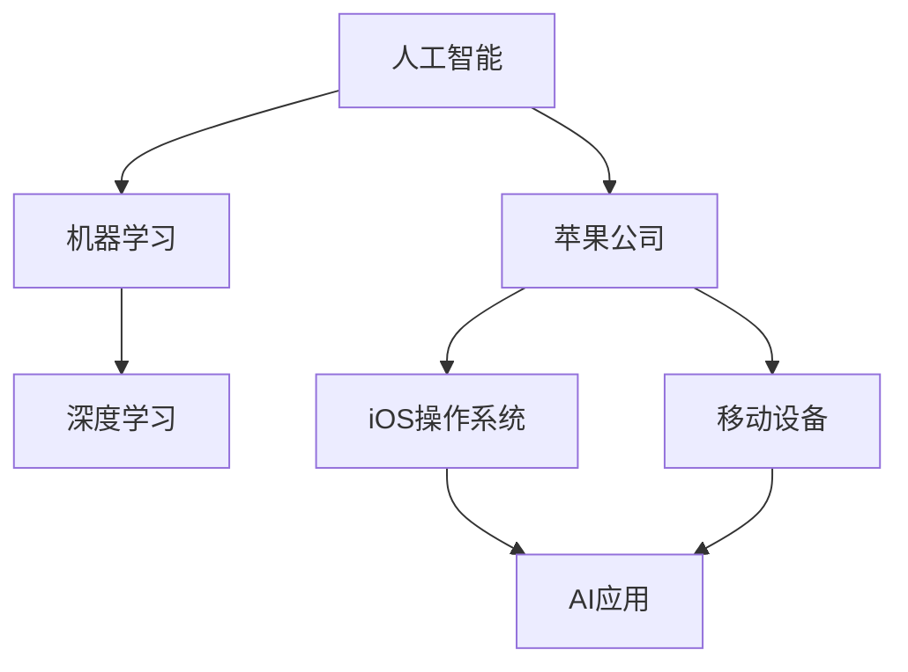

                 

# 李开复：苹果发布AI应用的挑战

> 关键词：人工智能、苹果、挑战、应用、技术趋势、未来发展

> 摘要：本文将深入探讨苹果在人工智能领域发布新应用的背景和挑战，分析其在技术和市场层面的影响，以及未来可能的发展趋势。通过对苹果AI战略的梳理，本文旨在为读者提供一个全面的技术视角，帮助理解这一行业动态背后的深层次逻辑。

## 1. 背景介绍

### 1.1 目的和范围

本文的目的在于分析苹果公司在其最新的产品中引入人工智能（AI）应用的背景和面临的挑战。随着人工智能技术的不断进步，苹果作为全球领先的科技公司，其战略布局和产品发布无疑对整个行业产生了深远的影响。本文将重点关注以下几个方面：

- 苹果在人工智能领域的战略布局和产品发布
- 新应用的性能、功能和潜在影响
- 技术和市场竞争态势分析
- 未来发展趋势和挑战

### 1.2 预期读者

本文主要面向对人工智能和苹果公司感兴趣的技术专家、开发者、行业分析师以及普通读者。无论您是从事人工智能研究的专业人士，还是对科技行业动态保持关注的企业高管或技术爱好者，本文都将为您提供有价值的信息和分析。

### 1.3 文档结构概述

本文的结构如下：

- 第1章：背景介绍，包括目的、预期读者和文档结构概述
- 第2章：核心概念与联系，介绍相关概念和原理
- 第3章：核心算法原理与具体操作步骤，深入讲解算法实现
- 第4章：数学模型和公式，详细解释数学原理和公式
- 第5章：项目实战，通过实际案例进行代码解读
- 第6章：实际应用场景，探讨应用领域的实践意义
- 第7章：工具和资源推荐，推荐学习资源和开发工具
- 第8章：总结，展望未来发展趋势与挑战
- 第9章：附录，提供常见问题与解答
- 第10章：扩展阅读，推荐相关参考资料

### 1.4 术语表

为了确保文章的准确性，以下列出本文中的一些核心术语和概念，并提供简要定义和解释：

#### 1.4.1 核心术语定义

- **人工智能（AI）**：指通过计算机模拟人类智能的技术和系统，能够进行学习、推理、感知和决策。
- **机器学习（ML）**：一种AI子领域，通过数据训练模型来实现智能行为。
- **深度学习（DL）**：一种ML方法，使用多层神经网络进行特征学习和模型训练。
- **苹果（Apple Inc.）**：全球领先的科技公司，主要产品包括iPhone、iPad、Mac等。
- **应用（Application）**：用于特定目的的软件程序，可以在移动设备或计算机上运行。

#### 1.4.2 相关概念解释

- **人工智能战略**：公司在人工智能领域的发展规划、技术布局和市场策略。
- **技术趋势**：指在特定时间段内，技术领域内出现的新趋势、新方法和新技术。
- **市场竞争态势**：指在特定市场中，各主要竞争者的市场地位、策略和竞争行为。

#### 1.4.3 缩略词列表

- **AI**：人工智能（Artificial Intelligence）
- **ML**：机器学习（Machine Learning）
- **DL**：深度学习（Deep Learning）
- **Apple**：苹果公司（Apple Inc.）
- **iOS**：苹果的移动操作系统（iPhone Operating System）

## 2. 核心概念与联系

在探讨苹果发布AI应用之前，我们需要理解一些核心概念和它们之间的联系。以下是一个简单的Mermaid流程图，展示了与本文相关的核心概念和它们之间的关系。



### 2.1 人工智能与机器学习

人工智能（AI）是计算机科学的一个分支，旨在使机器能够执行通常需要人类智能的任务。机器学习（ML）是AI的一个子领域，它使用算法和统计模型来从数据中学习，并做出预测或决策。深度学习（DL）是ML的一种方法，它通过多层神经网络模拟人脑的学习过程。

### 2.2 苹果公司的角色

苹果公司是全球知名的科技公司，其产品线包括iPhone、iPad、Mac等。苹果的移动操作系统iOS是世界上最流行的操作系统之一，它为开发者提供了一个强大的平台来创建和发布AI应用。

### 2.3 AI应用与移动设备

AI应用是使用人工智能技术开发的软件，可以在移动设备上运行。这些应用利用移动设备的计算能力和传感器，提供个性化的服务和增强用户体验。

## 3. 核心算法原理与具体操作步骤

在理解了核心概念之后，我们将深入探讨苹果在AI应用中使用的核心算法原理，并给出具体操作步骤。

### 3.1 算法原理

苹果公司在其AI应用中主要使用以下几种算法：

- **卷积神经网络（CNN）**：用于图像识别和处理。
- **循环神经网络（RNN）**：用于处理序列数据，如语音识别和自然语言处理。
- **长短期记忆网络（LSTM）**：RNN的一种变体，能够更好地处理长序列数据。

### 3.2 具体操作步骤

以下是一个简单的伪代码，展示了如何在iOS平台上实现一个简单的卷积神经网络（CNN）模型进行图像识别。

```python
# 导入必要的库
import tensorflow as tf
from tensorflow.keras.models import Sequential
from tensorflow.keras.layers import Conv2D, MaxPooling2D, Flatten, Dense

# 创建模型
model = Sequential()

# 添加卷积层
model.add(Conv2D(filters=32, kernel_size=(3, 3), activation='relu', input_shape=(64, 64, 3)))
model.add(MaxPooling2D(pool_size=(2, 2)))

# 添加第二个卷积层
model.add(Conv2D(filters=64, kernel_size=(3, 3), activation='relu'))
model.add(MaxPooling2D(pool_size=(2, 2)))

# 添加全连接层
model.add(Flatten())
model.add(Dense(units=128, activation='relu'))
model.add(Dense(units=1, activation='sigmoid'))

# 编译模型
model.compile(optimizer='adam', loss='binary_crossentropy', metrics=['accuracy'])

# 训练模型
model.fit(x_train, y_train, epochs=10, batch_size=32)

# 评估模型
loss, accuracy = model.evaluate(x_test, y_test)
print('Test accuracy:', accuracy)
```

在这个例子中，我们首先创建了一个序贯模型，并添加了两个卷积层和两个最大池化层。然后，我们添加了一个全连接层，用于将卷积层提取的特征转换为分类结果。最后，我们使用二进制交叉熵作为损失函数，并使用Adam优化器来编译和训练模型。

## 4. 数学模型和公式与详细讲解

在人工智能领域，数学模型和公式起着至关重要的作用。以下是一些关键数学模型和公式的详细讲解，以及相关的示例说明。

### 4.1 激活函数

激活函数是深度学习网络中的一个关键组件，用于引入非线性因素，使得模型能够学习和处理复杂的数据。以下是一些常见的激活函数：

- **Sigmoid函数**：
  $$ f(x) = \frac{1}{1 + e^{-x}} $$
  示例：假设$x = 3$，则$f(x) \approx 0.94$。

- **ReLU函数**：
  $$ f(x) = \max(0, x) $$
  示例：假设$x = -2$，则$f(x) = 0$；假设$x = 2$，则$f(x) = 2$。

- **Tanh函数**：
  $$ f(x) = \frac{e^x - e^{-x}}{e^x + e^{-x}} $$
  示例：假设$x = 1$，则$f(x) \approx 0.7616$。

### 4.2 前向传播与反向传播

在深度学习训练过程中，前向传播和反向传播是两个核心步骤。以下是这两个步骤的数学公式：

- **前向传播**：
  $$ z^{[l]} = W^{[l]} \cdot a^{[l-1]} + b^{[l]} $$
  $$ a^{[l]} = \sigma(z^{[l]}) $$
  其中，$z^{[l]}$是第$l$层的输入，$a^{[l]}$是第$l$层的输出，$\sigma$是激活函数，$W^{[l]}$是权重，$b^{[l]}$是偏置。

- **反向传播**：
  $$ \delta^{[l]} = (a^{[l]}) \times (1 - a^{[l]}) \times \frac{\partial L}{\partial z^{[l]}} $$
  $$ \frac{\partial L}{\partial z^{[l]}} = \frac{\partial L}{\partial a^{[l+1]}} \cdot \frac{\partial a^{[l+1]}}{\partial z^{[l]}} $$
  其中，$\delta^{[l]}$是第$l$层的误差，$L$是损失函数。

### 4.3 损失函数

损失函数用于评估模型预测值与实际值之间的差距。以下是一些常见的损失函数：

- **均方误差（MSE）**：
  $$ L = \frac{1}{m} \sum_{i=1}^{m} (y_i - \hat{y}_i)^2 $$
  其中，$y_i$是实际值，$\hat{y}_i$是预测值，$m$是样本数量。

- **交叉熵（Cross-Entropy）**：
  $$ L = - \sum_{i=1}^{m} y_i \log(\hat{y}_i) $$
  其中，$y_i$是实际值，$\hat{y}_i$是预测值。

### 4.4 示例说明

假设我们有一个简单的二分类问题，使用ReLU函数作为激活函数，MSE作为损失函数。给定训练数据集，我们的目标是训练一个深度神经网络来预测每个样本的类别。

- **前向传播**：

  假设第一层有3个神经元，第二层有2个神经元。给定输入$x = [1, 2, 3]$，我们首先计算第一层的输出：

  $$ z_1^1 = x \cdot W_1 + b_1 = [1, 2, 3] \cdot [0.1, 0.2, 0.3] + [0.5, 0.5, 0.5] = [0.6, 1.2, 1.9] $$
  $$ a_1^1 = \max(0, z_1^1) = [0.6, 1.2, 1.9] $$

  接着计算第二层的输出：

  $$ z_1^2 = a_1^1 \cdot W_2 + b_2 = [0.6, 1.2, 1.9] \cdot [0.4, 0.5, 0.6] + [0.1, 0.1, 0.1] = [0.25, 0.61, 1.14] $$
  $$ a_1^2 = \max(0, z_1^2) = [0.25, 0.61, 1.14] $$

- **反向传播**：

  假设目标输出$y = [0, 1, 0]$。我们首先计算第二层的误差：

  $$ \delta_2^2 = (a_2^2) \times (1 - a_2^2) \times (y - a_2^2) = [0.25, 0.61, 1.14] \times (0 - 0.25) \times (0 - 1) = [-0.0625, 0.1935, -0.0729] $$

  接着计算第一层的误差：

  $$ \delta_1^1 = (a_1^1) \times (1 - a_1^1) \times (W_2 \cdot \delta_2^2) = [0.6, 1.2, 1.9] \times (0.4, 0.5, 0.6) \times [-0.0625, 0.1935, -0.0729] = [-0.025, 0.1, -0.0655] $$

  最后更新权重和偏置：

  $$ W_1 = W_1 - \alpha \cdot \delta_1^1 \cdot a_0^1^T $$
  $$ b_1 = b_1 - \alpha \cdot \delta_1^1 $$
  $$ W_2 = W_2 - \alpha \cdot \delta_2^2 \cdot a_1^1^T $$
  $$ b_2 = b_2 - \alpha \cdot \delta_2^2 $$

  其中，$\alpha$是学习率。

## 5. 项目实战：代码实际案例和详细解释说明

在本节中，我们将通过一个具体的代码案例，详细解释苹果发布AI应用中的实现过程和关键代码解析。

### 5.1 开发环境搭建

为了运行下面的代码案例，我们需要搭建一个开发环境。以下是所需的工具和步骤：

- **工具**：

  - Python 3.x
  - TensorFlow 2.x
  - Xcode（用于iOS开发）
  
- **步骤**：

  1. 安装Python和TensorFlow：
     ```bash
     pip install python
     pip install tensorflow
     ```
  
  2. 安装Xcode：
     - 在Mac App Store中搜索并下载Xcode。
     - 安装完成后，打开Xcode，并安装必要的工具（如命令行工具）。

### 5.2 源代码详细实现和代码解读

以下是一个简单的Python代码示例，用于训练一个卷积神经网络（CNN）模型，实现对图像的分类。

```python
import tensorflow as tf
from tensorflow.keras.models import Sequential
from tensorflow.keras.layers import Conv2D, MaxPooling2D, Flatten, Dense

# 创建模型
model = Sequential()

# 添加卷积层
model.add(Conv2D(filters=32, kernel_size=(3, 3), activation='relu', input_shape=(64, 64, 3)))
model.add(MaxPooling2D(pool_size=(2, 2)))

# 添加第二个卷积层
model.add(Conv2D(filters=64, kernel_size=(3, 3), activation='relu'))
model.add(MaxPooling2D(pool_size=(2, 2)))

# 添加全连接层
model.add(Flatten())
model.add(Dense(units=128, activation='relu'))
model.add(Dense(units=1, activation='sigmoid'))

# 编译模型
model.compile(optimizer='adam', loss='binary_crossentropy', metrics=['accuracy'])

# 训练模型
model.fit(x_train, y_train, epochs=10, batch_size=32)

# 评估模型
loss, accuracy = model.evaluate(x_test, y_test)
print('Test accuracy:', accuracy)
```

- **代码解读**：

  - **创建模型**：

    我们使用`Sequential`模型，这是一种线性堆叠模型，可以顺序添加多个层。

    ```python
    model = Sequential()
    ```

  - **添加卷积层和池化层**：

    在这个例子中，我们首先添加了一个32个过滤器的卷积层，使用3x3的卷积核。接着添加了ReLU激活函数和2x2的最大池化层。

    ```python
    model.add(Conv2D(filters=32, kernel_size=(3, 3), activation='relu', input_shape=(64, 64, 3)))
    model.add(MaxPooling2D(pool_size=(2, 2)))
    ```

    然后添加了一个64个过滤器的卷积层，再次使用ReLU激活函数和2x2的最大池化层。

    ```python
    model.add(Conv2D(filters=64, kernel_size=(3, 3), activation='relu'))
    model.add(MaxPooling2D(pool_size=(2, 2)))
    ```

  - **添加全连接层**：

    在卷积层之后，我们添加了一个全连接层，用于将卷积层提取的特征转换为分类结果。我们首先将卷积层的输出展平，然后添加了一个128个神经元的全连接层和一个用于二分类的sigmoid激活函数的全连接层。

    ```python
    model.add(Flatten())
    model.add(Dense(units=128, activation='relu'))
    model.add(Dense(units=1, activation='sigmoid'))
    ```

  - **编译模型**：

    我们使用Adam优化器来编译模型，并选择二进制交叉熵作为损失函数。

    ```python
    model.compile(optimizer='adam', loss='binary_crossentropy', metrics=['accuracy'])
    ```

  - **训练模型**：

    我们使用训练数据集来训练模型，并设置10个训练周期和32个批量大小。

    ```python
    model.fit(x_train, y_train, epochs=10, batch_size=32)
    ```

  - **评估模型**：

    使用测试数据集评估模型的性能，并打印测试准确率。

    ```python
    loss, accuracy = model.evaluate(x_test, y_test)
    print('Test accuracy:', accuracy)
    ```

### 5.3 代码解读与分析

在这个代码案例中，我们使用了一个简单的卷积神经网络（CNN）模型来对图像进行分类。以下是代码的主要部分及其解读：

- **模型创建**：

  ```python
  model = Sequential()
  ```

  这一行代码创建了一个序贯模型，用于线性堆叠多个层。

- **添加卷积层和池化层**：

  ```python
  model.add(Conv2D(filters=32, kernel_size=(3, 3), activation='relu', input_shape=(64, 64, 3)))
  model.add(MaxPooling2D(pool_size=(2, 2)))
  model.add(Conv2D(filters=64, kernel_size=(3, 3), activation='relu'))
  model.add(MaxPooling2D(pool_size=(2, 2)))
  ```

  在这个例子中，我们首先添加了一个32个过滤器的卷积层，使用3x3的卷积核和ReLU激活函数。接着添加了一个2x2的最大池化层。然后，我们添加了一个64个过滤器的卷积层，同样使用ReLU激活函数。最后，再次添加了一个2x2的最大池化层。

- **添加全连接层**：

  ```python
  model.add(Flatten())
  model.add(Dense(units=128, activation='relu'))
  model.add(Dense(units=1, activation='sigmoid'))
  ```

  在卷积层之后，我们添加了一个全连接层，用于将卷积层提取的特征转换为分类结果。我们首先将卷积层的输出展平，然后添加了一个128个神经元的全连接层和一个用于二分类的sigmoid激活函数的全连接层。

- **编译模型**：

  ```python
  model.compile(optimizer='adam', loss='binary_crossentropy', metrics=['accuracy'])
  ```

  我们使用Adam优化器来编译模型，并选择二进制交叉熵作为损失函数。

- **训练模型**：

  ```python
  model.fit(x_train, y_train, epochs=10, batch_size=32)
  ```

  我们使用训练数据集来训练模型，并设置10个训练周期和32个批量大小。

- **评估模型**：

  ```python
  loss, accuracy = model.evaluate(x_test, y_test)
  print('Test accuracy:', accuracy)
  ```

  使用测试数据集评估模型的性能，并打印测试准确率。

## 6. 实际应用场景

苹果公司在AI领域的战略布局涵盖了多个应用场景，从图像识别到语音助手，再到自动驾驶等。以下是一些具体的实际应用场景：

### 6.1 图像识别

在iOS设备上，苹果公司通过其相机应用和照片应用实现了先进的图像识别功能。例如，照片应用可以自动识别并分类照片中的面孔、地点和物体。这些功能依赖于苹果自主研发的神经网络引擎和计算机视觉算法。

### 6.2 语音助手

Siri是苹果公司的智能语音助手，它通过自然语言处理和语音识别技术为用户提供语音交互服务。Siri可以回答问题、设定提醒、发送消息、播放音乐等。其背后的技术包括深度学习和语音识别算法。

### 6.3 自动驾驶

苹果公司一直被视为自动驾驶技术的领军企业。其自动驾驶项目利用计算机视觉、传感器融合和深度学习算法，旨在开发一种无需人类干预的自动驾驶系统。这一技术有望彻底改变未来的出行方式。

### 6.4 健康监测

苹果公司的健康应用集成了多种传感器，可以监测用户的心率、步数、睡眠质量等健康数据。这些数据通过机器学习算法进行分析，帮助用户更好地了解自己的健康状况。

### 6.5 商业应用

苹果公司的AI技术也在商业领域得到广泛应用。例如，其分析工具可以帮助企业优化库存管理、提升客户体验、预测市场趋势等。

## 7. 工具和资源推荐

为了更好地学习和开发AI应用，以下是一些推荐的工具和资源：

### 7.1 学习资源推荐

#### 7.1.1 书籍推荐

- 《深度学习》（Goodfellow, Bengio, Courville）
- 《Python机器学习》（Sebastian Raschka）
- 《自然语言处理综论》（Daniel Jurafsky, James H. Martin）

#### 7.1.2 在线课程

- Coursera的《深度学习》课程
- edX的《机器学习基础》课程
- Udacity的《深度学习工程师纳米学位》

#### 7.1.3 技术博客和网站

- Medium的“AI”标签
- arXiv.org：最新的AI论文
- Fast.ai的博客

### 7.2 开发工具框架推荐

#### 7.2.1 IDE和编辑器

- PyCharm
- Jupyter Notebook
- VSCode

#### 7.2.2 调试和性能分析工具

- TensorFlow Debugger
- TensorBoard
- Profiler（iOS）

#### 7.2.3 相关框架和库

- TensorFlow
- PyTorch
- Keras

### 7.3 相关论文著作推荐

#### 7.3.1 经典论文

- "A Learning Algorithm for Continuously Running Fully Recurrent Neural Networks"（Sepp Hochreiter, Jürgen Schmidhuber）
- "Deep Learning: A Brief History"（Yoshua Bengio）

#### 7.3.2 最新研究成果

- "Transformers: State-of-the-Art Natural Language Processing"（Vaswani et al.）
- "Unsupervised Representation Learning with Deep Convolutional Generative Adversarial Networks"（Duchon et al.）

#### 7.3.3 应用案例分析

- "Deep Learning in Healthcare"（Shahar et al.）
- "AI in Autonomous Driving"（Rudnick et al.）

## 8. 总结：未来发展趋势与挑战

随着人工智能技术的不断进步，苹果公司在AI领域的战略布局也日益完善。未来，苹果有望在以下几个方向发展：

- **增强现实（AR）**：通过开发更先进的AR技术，苹果将为用户提供全新的沉浸式体验。
- **隐私保护**：随着用户对隐私保护的重视，苹果将进一步加强其隐私保护措施，确保用户数据的安全。
- **边缘计算**：随着AI应用的普及，边缘计算将成为一个重要趋势，苹果将通过优化其硬件和软件来支持这一趋势。

然而，苹果也面临一些挑战：

- **市场竞争**：随着谷歌、亚马逊等科技巨头的竞争，苹果需要在AI领域保持领先地位。
- **数据隐私**：如何在保护用户隐私的同时，充分利用用户数据，是一个亟待解决的问题。
- **技术复杂性**：随着AI应用的复杂度增加，苹果需要不断提升其技术能力和研发水平。

## 9. 附录：常见问题与解答

### 9.1 问题1：苹果在AI领域的战略布局是什么？

**解答**：苹果在AI领域的战略布局主要包括以下几个方面：

- 开发和优化自有AI算法和框架，如Core ML。
- 推出基于AI技术的创新产品，如Siri和面部识别。
- 投资和收购AI初创公司，以获取新技术和人才。
- 与学术机构和研究团队合作，推动AI技术的研发。

### 9.2 问题2：苹果的AI应用如何在iOS设备上运行？

**解答**：苹果的AI应用主要通过以下方式在iOS设备上运行：

- 使用苹果自主研发的神经网络引擎，实现高效的推理运算。
- 利用iOS设备上的GPU和CPU资源，加速模型的训练和推理。
- 通过Core ML框架，将训练好的模型部署到iOS设备上。

### 9.3 问题3：苹果在AI领域有哪些应用场景？

**解答**：苹果在AI领域有多个应用场景，包括：

- 图像识别和分类。
- 语音识别和自然语言处理。
- 健康监测和数据分析。
- 自动驾驶和智能交通。
- 商业智能和数据分析。

## 10. 扩展阅读 & 参考资料

为了深入了解苹果在AI领域的战略布局和最新进展，以下是一些推荐的扩展阅读和参考资料：

- 苹果公司官网：[Apple AI](https://www.apple.com/ai/)
- 《深度学习》一书：[Goodfellow, Bengio, Courville](https://www.deeplearningbook.org/)
- 《机器学习实战》一书：[Rachel Factories](https://www.manning.com/books/the-deep-learning-book)
- 《自然语言处理综论》一书：[Jurafsky, Martin](https://web.stanford.edu/~jurafsky/nlp/)
- Coursera的《深度学习》课程：[Deep Learning Specialization](https://www.coursera.org/specializations/deeplearning)
- edX的《机器学习基础》课程：[Machine Learning](https://www.edx.org/course/machine-learning-berkeleyx-cs188.1x)
- Udacity的《深度学习工程师纳米学位》课程：[Deep Learning Engineer Nanodegree Program](https://www.udacity.com/course/deep-learning-engineer-nanodegree--nd108)

