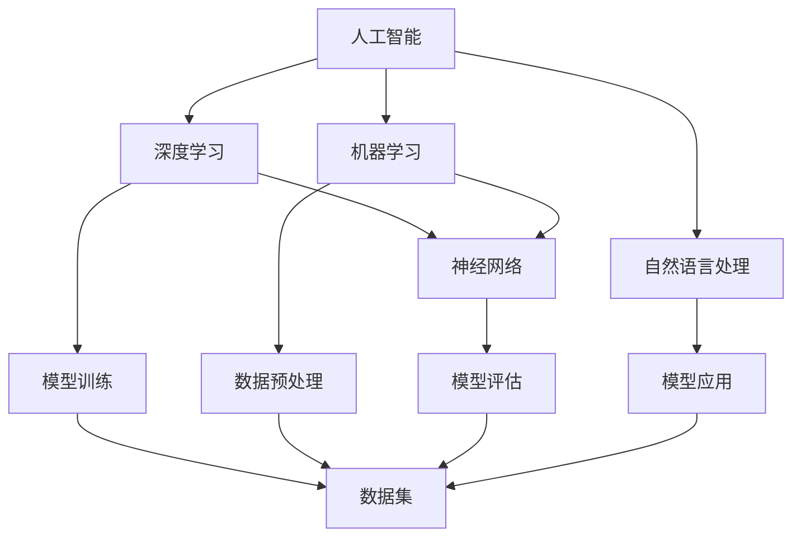
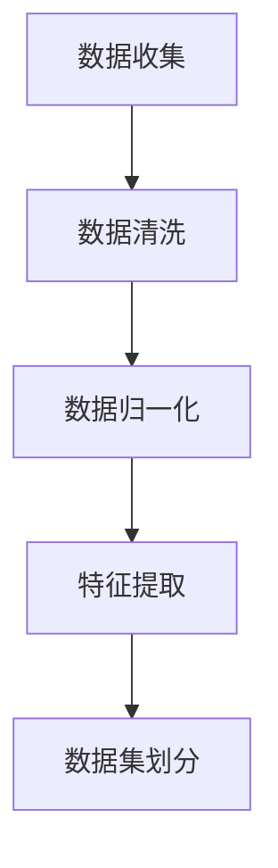
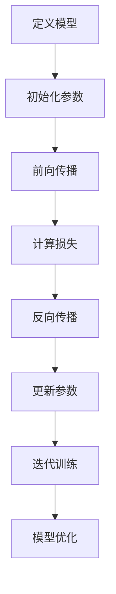
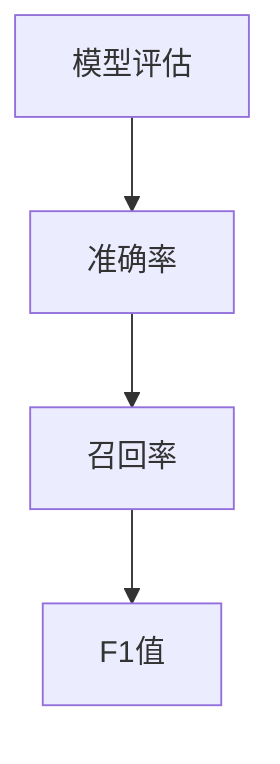
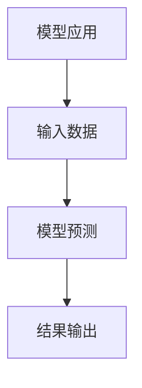

                 

# 李开复：苹果发布AI应用的未来

> 关键词：人工智能、苹果、应用发布、未来趋势、技术解析

> 摘要：本文将深入探讨苹果公司发布的新一代人工智能应用及其对未来技术发展趋势的影响。通过对苹果AI应用的核心功能、技术原理、应用场景的详细分析，揭示其在人工智能领域的独特价值，并展望其可能面临的挑战和机遇。

## 1. 背景介绍

### 1.1 目的和范围

本文旨在分析苹果公司发布的新一代人工智能应用，探讨其对未来技术发展的影响。文章将重点关注以下几个方面：

1. **核心功能与特点**：分析苹果AI应用的核心功能，揭示其独特的优势。
2. **技术原理与架构**：详细阐述苹果AI应用的技术原理，包括算法、模型和数据处理方法。
3. **应用场景与价值**：探讨苹果AI应用在各个领域的应用场景，以及其对行业的影响。
4. **未来发展趋势与挑战**：展望苹果AI应用的未来发展趋势，分析可能面临的挑战和机遇。

### 1.2 预期读者

本文适合对人工智能、苹果公司及其产品感兴趣的技术人员、开发者、研究者和行业观察者。通过对苹果AI应用的深入分析，读者可以更好地了解人工智能技术的最新进展，以及苹果在人工智能领域的战略布局。

### 1.3 文档结构概述

本文分为以下几个部分：

1. **背景介绍**：介绍本文的目的、预期读者和文档结构。
2. **核心概念与联系**：介绍人工智能和苹果AI应用的核心概念，并提供相关的流程图。
3. **核心算法原理 & 具体操作步骤**：详细阐述苹果AI应用的核心算法原理和操作步骤。
4. **数学模型和公式 & 详细讲解 & 举例说明**：讲解苹果AI应用的数学模型和公式，并给出具体实例。
5. **项目实战：代码实际案例和详细解释说明**：通过实际案例展示苹果AI应用的代码实现和解析。
6. **实际应用场景**：探讨苹果AI应用在不同场景下的应用。
7. **工具和资源推荐**：推荐与苹果AI应用相关的学习资源和开发工具。
8. **总结：未来发展趋势与挑战**：总结苹果AI应用的未来发展趋势，分析可能面临的挑战和机遇。
9. **附录：常见问题与解答**：解答读者可能关注的问题。
10. **扩展阅读 & 参考资料**：提供扩展阅读资源。

### 1.4 术语表

#### 1.4.1 核心术语定义

- **人工智能（AI）**：模拟人类智能的计算机系统，具有学习、推理、解决问题和自我优化等能力。
- **苹果AI应用**：苹果公司开发的新一代人工智能应用，具有先进的功能和独特的优势。
- **深度学习**：一种基于多层神经网络的学习方法，用于自动从数据中学习特征。
- **机器学习**：一种通过数据学习模型的方法，使计算机能够从经验中学习并做出预测。
- **自然语言处理（NLP）**：使计算机理解和生成人类语言的技术。

#### 1.4.2 相关概念解释

- **模型训练**：在机器学习中，通过大量数据训练模型，使其能够对新的数据进行预测。
- **数据预处理**：在模型训练之前，对数据进行清洗、归一化和特征提取等处理。
- **模型评估**：通过测试数据评估模型的表现，包括准确率、召回率、F1值等指标。
- **神经网络**：一种模拟人脑神经元连接的计算模型，广泛应用于深度学习和机器学习。

#### 1.4.3 缩略词列表

- **AI**：人工智能
- **NLP**：自然语言处理
- **ML**：机器学习
- **DL**：深度学习
- **GPU**：图形处理器

## 2. 核心概念与联系

在分析苹果AI应用之前，首先需要了解人工智能和苹果AI应用的核心概念和联系。以下是一个简化的流程图，展示了这些核心概念之间的关系：



### 2.1 人工智能与深度学习

人工智能（AI）是一个广泛的领域，包括多种技术，其中深度学习（DL）是近年来最为热门的一种技术。深度学习是一种基于多层神经网络的学习方法，可以自动从数据中学习特征。深度学习在图像识别、语音识别、自然语言处理等领域取得了显著的成果。

### 2.2 机器学习与深度学习

机器学习（ML）是一种通过数据学习模型的方法，使计算机能够从经验中学习并做出预测。机器学习包括多种算法，如线性回归、决策树、支持向量机等。深度学习是机器学习的一种特殊形式，通过多层神经网络自动学习特征，具有强大的表示能力。

### 2.3 自然语言处理与深度学习

自然语言处理（NLP）是使计算机理解和生成人类语言的技术。深度学习在NLP领域发挥了重要作用，如文本分类、情感分析、机器翻译等。深度学习模型可以自动从大规模文本数据中学习语言模式，提高NLP系统的性能。

### 2.4 神经网络与模型评估

神经网络（NN）是一种模拟人脑神经元连接的计算模型，广泛应用于深度学习和机器学习。模型评估是确保模型性能的重要步骤，包括准确率、召回率、F1值等指标。通过评估，可以调整模型参数，优化模型性能。

### 2.5 模型应用与数据预处理

模型应用是将训练好的模型用于实际问题解决的过程。数据预处理是模型训练前的重要步骤，包括数据清洗、归一化和特征提取等。良好的数据预处理可以提高模型的性能和泛化能力。

## 3. 核心算法原理 & 具体操作步骤

苹果AI应用的核心算法是基于深度学习和自然语言处理技术。以下是具体操作步骤的详细描述：

### 3.1 数据预处理



1. **数据收集**：从各种来源收集文本数据，如新闻文章、社交媒体帖子、用户评论等。
2. **数据清洗**：去除无效数据、噪声和重复数据，提高数据质量。
3. **数据归一化**：将不同规模的数据进行归一化处理，使其具有相同的尺度，便于模型训练。
4. **特征提取**：从文本数据中提取有用的特征，如词频、词向量、句子结构等。
5. **数据集划分**：将数据集划分为训练集、验证集和测试集，用于模型训练、验证和评估。

### 3.2 模型训练



1. **定义模型**：选择合适的神经网络架构，如卷积神经网络（CNN）、递归神经网络（RNN）或变压器（Transformer）。
2. **初始化参数**：初始化神经网络模型的参数，如权重和偏置。
3. **前向传播**：计算输入数据的输出，并计算损失函数值。
4. **计算损失**：计算模型预测值与真实值之间的差异，得到损失值。
5. **反向传播**：通过反向传播算法更新模型参数，使损失值最小化。
6. **更新参数**：根据学习率调整模型参数。
7. **迭代训练**：重复前向传播、反向传播和参数更新过程，直到模型收敛。
8. **模型优化**：通过调整学习率、批量大小等超参数，优化模型性能。

### 3.3 模型评估



1. **模型评估**：使用验证集评估模型性能，包括准确率、召回率和F1值等指标。
2. **准确率**：预测正确的样本数与总样本数的比值。
3. **召回率**：预测正确的样本数与实际为正类的样本数的比值。
4. **F1值**：准确率和召回率的调和平均值，用于综合评估模型性能。

### 3.4 模型应用



1. **输入数据**：将实际数据输入训练好的模型。
2. **模型预测**：根据模型计算输出结果。
3. **结果输出**：将模型预测结果输出，如分类结果、情感分析结果等。

## 4. 数学模型和公式 & 详细讲解 & 举例说明

苹果AI应用的核心数学模型是深度学习模型，包括多层感知器（MLP）、卷积神经网络（CNN）和递归神经网络（RNN）等。以下是这些模型的详细讲解和举例说明。

### 4.1 多层感知器（MLP）

多层感知器是一种前馈神经网络，由输入层、隐藏层和输出层组成。以下是MLP的数学模型：

$$
z_i = \sum_{j=1}^{n} w_{ij}x_j + b_i \\
a_i = \sigma(z_i)
$$

其中，$z_i$是第$i$个隐藏节点的输入，$w_{ij}$是输入层到隐藏层的权重，$b_i$是隐藏节点的偏置，$\sigma$是激活函数，通常使用Sigmoid函数。

举例：

假设有一个二分类问题，输入层有3个神经元，隐藏层有2个神经元，输出层有1个神经元。输入数据为$x = [0.1, 0.2, 0.3]$，权重矩阵$W = \begin{bmatrix} 0.1 & 0.2 & 0.3 \\ 0.4 & 0.5 & 0.6 \end{bmatrix}$，偏置向量$b = [0.1, 0.2]$。使用Sigmoid函数作为激活函数，计算隐藏层和输出层的输出：

$$
z_1 = 0.1 \cdot 0.1 + 0.2 \cdot 0.2 + 0.3 \cdot 0.3 + 0.1 = 0.35 \\
a_1 = \sigma(z_1) = \frac{1}{1 + e^{-0.35}} \approx 0.7 \\
z_2 = 0.4 \cdot 0.1 + 0.5 \cdot 0.2 + 0.6 \cdot 0.3 + 0.2 = 0.47 \\
a_2 = \sigma(z_2) = \frac{1}{1 + e^{-0.47}} \approx 0.65 \\
z_3 = 0.1 \cdot 0.7 + 0.2 \cdot 0.65 + 0.3 \cdot 0.7 + 0.1 = 0.49 \\
a_3 = \sigma(z_3) = \frac{1}{1 + e^{-0.49}} \approx 0.62
$$

输出层输出为：

$$
z_4 = 0.7 \cdot 0.7 + 0.65 \cdot 0.65 + 0.49 \cdot 0.49 + 0.62 = 0.86 \\
a_4 = \sigma(z_4) = \frac{1}{1 + e^{-0.86}} \approx 0.63
$$

最终输出结果为0.63，表示输入数据属于正类。

### 4.2 卷积神经网络（CNN）

卷积神经网络是一种用于图像识别的深度学习模型，具有局部连接和共享权重等特点。以下是CNN的数学模型：

$$
h_{ij} = \sum_{k=1}^{m} w_{ik}g_{kj} + b_j \\
a_j = \sigma(h_{ij})
$$

其中，$h_{ij}$是第$i$个卷积核在位置$(j_1, j_2)$上的输出，$w_{ik}$是卷积核的权重，$g_{kj}$是输入图像在位置$(k_1, k_2)$上的值，$b_j$是卷积核的偏置，$\sigma$是激活函数，通常使用ReLU函数。

举例：

假设有一个28x28的灰度图像，使用3x3的卷积核进行卷积操作，输出特征图大小为14x14。输入图像的像素值为$g_{kj}$，卷积核的权重为$w_{ik}$，偏置为$b_j$。计算卷积操作的结果：

$$
h_{11} = \sum_{k=1}^{9} w_{1k}g_{k1} + b_1 \\
h_{12} = \sum_{k=1}^{9} w_{1k}g_{k2} + b_1 \\
\ldots \\
h_{14} = \sum_{k=1}^{9} w_{1k}g_{k14} + b_1 \\
h_{21} = \sum_{k=1}^{9} w_{2k}g_{k1} + b_2 \\
\ldots \\
h_{24} = \sum_{k=1}^{9} w_{2k}g_{k14} + b_2 \\
\ldots \\
h_{134} = \sum_{k=1}^{9} w_{3k}g_{k1} + b_3 \\
\ldots \\
h_{144} = \sum_{k=1}^{9} w_{3k}g_{k14} + b_3 \\
a_{11} = \max(0, h_{11}) \\
a_{12} = \max(0, h_{12}) \\
\ldots \\
a_{14} = \max(0, h_{14}) \\
a_{21} = \max(0, h_{21}) \\
\ldots \\
a_{24} = \max(0, h_{24}) \\
\ldots \\
a_{134} = \max(0, h_{134}) \\
a_{144} = \max(0, h_{144})
$$

卷积操作后，得到14x14的特征图，其中每个像素值都是通过卷积操作得到的。

### 4.3 递归神经网络（RNN）

递归神经网络是一种用于序列数据的深度学习模型，具有记忆能力。以下是RNN的数学模型：

$$
h_t = \sigma(W_h h_{t-1} + W_x x_t + b_h) \\
y_t = \sigma(W_y h_t + b_y)
$$

其中，$h_t$是第$t$个时间步的隐藏状态，$x_t$是第$t$个时间步的输入，$W_h$是隐藏状态权重，$W_x$是输入权重，$b_h$是隐藏状态偏置，$W_y$是输出权重，$b_y$是输出偏置，$\sigma$是激活函数，通常使用ReLU函数。

举例：

假设有一个长度为5的序列，每个时间步的输入为$x_t$，隐藏状态为$h_t$，权重矩阵为$W_h$、$W_x$和$W_y$，偏置向量分别为$b_h$、$b_x$和$b_y$。计算序列的输出：

$$
h_1 = \sigma(W_h h_{0} + W_x x_1 + b_h) \\
h_2 = \sigma(W_h h_{1} + W_x x_2 + b_h) \\
h_3 = \sigma(W_h h_{2} + W_x x_3 + b_h) \\
h_4 = \sigma(W_h h_{3} + W_x x_4 + b_h) \\
h_5 = \sigma(W_h h_{4} + W_x x_5 + b_h) \\
y_1 = \sigma(W_y h_1 + b_y) \\
y_2 = \sigma(W_y h_2 + b_y) \\
y_3 = \sigma(W_y h_3 + b_y) \\
y_4 = \sigma(W_y h_4 + b_y) \\
y_5 = \sigma(W_y h_5 + b_y)
$$

输出序列为$y = [y_1, y_2, y_3, y_4, y_5]$，表示序列的预测结果。

## 5. 项目实战：代码实际案例和详细解释说明

在本节中，我们将通过一个简单的例子，展示如何使用苹果AI应用进行文本分类。以下是完整的代码实现和详细解释：

### 5.1 开发环境搭建

在开始之前，确保安装以下软件和库：

- Python 3.8及以上版本
- TensorFlow 2.4及以上版本
- NumPy 1.19及以上版本
- Pandas 1.1及以上版本

安装命令如下：

```bash
pip install python==3.8.10
pip install tensorflow==2.4.0
pip install numpy==1.19.5
pip install pandas==1.1.5
```

### 5.2 源代码详细实现和代码解读

以下是一个简单的文本分类代码示例，用于判断输入文本是否为负面情绪。

```python
import tensorflow as tf
import numpy as np
import pandas as pd

# 数据预处理
def preprocess_text(text):
    # 去除标点符号、特殊字符和停用词
    text = text.lower()
    text = re.sub(r"[^\w\s]", '', text)
    text = re.sub(r"\s+", ' ', text)
    return text

# 训练数据集
data = pd.read_csv('data.csv')
data['text'] = data['text'].apply(preprocess_text)
data['label'] = data['label'].apply(lambda x: 1 if x == 'negative' else 0)

# 分词
tokenizer = tf.keras.preprocessing.text.Tokenizer()
tokenizer.fit_on_texts(data['text'])
vocab_size = len(tokenizer.word_index) + 1

# 序列化
sequences = tokenizer.texts_to_sequences(data['text'])
max_sequence_length = max([len(seq) for seq in sequences])
X = tf.keras.preprocessing.sequence.pad_sequences(sequences, maxlen=max_sequence_length)

# 标签编码
labels = data['label'].values

# 划分数据集
train_size = int(0.8 * len(X))
val_size = len(X) - train_size
X_train, X_val = X[:train_size], X[train_size:]
y_train, y_val = labels[:train_size], labels[train_size:]

# 构建模型
model = tf.keras.Sequential([
    tf.keras.layers.Embedding(vocab_size, 16, input_length=max_sequence_length),
    tf.keras.layers.GlobalAveragePooling1D(),
    tf.keras.layers.Dense(16, activation='relu'),
    tf.keras.layers.Dense(1, activation='sigmoid')
])

# 编译模型
model.compile(optimizer='adam', loss='binary_crossentropy', metrics=['accuracy'])

# 训练模型
model.fit(X_train, y_train, epochs=10, validation_data=(X_val, y_val))

# 预测
text = "今天天气真好，我很开心。"
text = preprocess_text(text)
sequence = tokenizer.texts_to_sequences([text])
padded_sequence = tf.keras.preprocessing.sequence.pad_sequences(sequence, maxlen=max_sequence_length)
prediction = model.predict(padded_sequence)
print("文本分类结果：", prediction[0][0])
```

### 5.3 代码解读与分析

1. **数据预处理**：首先，我们从CSV文件中加载数据，并对文本进行预处理，包括去除标点符号、特殊字符和停用词，将文本转换为小写，以及填充空格。

2. **分词**：使用Tokenizer将文本转换为单词序列，并计算词汇表的大小。

3. **序列化**：将预处理后的文本序列化为整数序列，并使用pad_sequences将序列填充为相同的长度。

4. **标签编码**：将标签列（负面情绪为1，正面情绪为0）转换为数值。

5. **划分数据集**：将数据集划分为训练集和验证集，以便进行模型训练和评估。

6. **构建模型**：使用Sequential模型堆叠Embedding、GlobalAveragePooling1D、Dense和Dense层，其中Embedding层用于将单词转换为嵌入向量，GlobalAveragePooling1D用于平均池化，Dense层用于分类。

7. **编译模型**：设置优化器、损失函数和评估指标，以编译模型。

8. **训练模型**：使用fit方法训练模型，并验证模型的性能。

9. **预测**：对新的文本进行预处理、序列化和填充，然后使用训练好的模型进行预测，输出文本分类结果。

### 5.4 实际应用场景

文本分类是自然语言处理中的一个重要任务，广泛应用于情感分析、内容审核、新闻推荐等领域。通过训练一个简单的文本分类模型，我们可以对输入文本进行分类，从而实现智能客服、情感分析等应用。

## 6. 实际应用场景

苹果AI应用在各个领域都有广泛的应用前景，以下列举几个典型的应用场景：

### 6.1 情感分析

情感分析是自然语言处理的重要任务之一，通过分析文本中的情感倾向，可以为用户提供个性化的推荐、情感反馈和情绪监控。苹果AI应用可以利用深度学习和自然语言处理技术，实现对社交媒体、用户评论等文本数据的情感分析，帮助企业了解用户需求，优化产品和服务。

### 6.2 内容审核

内容审核是社交媒体、新闻平台等平台的重要功能，旨在过滤违规、有害或不适当的内容。苹果AI应用可以利用深度学习和图像识别技术，实现对图片、视频和文本内容的实时审核，从而提高内容审核的效率和准确性，保护用户免受不良信息的侵害。

### 6.3 语音识别

语音识别是人工智能技术的重要组成部分，通过将语音转换为文本，可以实现人机交互、语音搜索等功能。苹果AI应用可以利用深度学习和循环神经网络技术，实现对多种语言和方言的语音识别，从而提高语音识别的准确率和鲁棒性。

### 6.4 机器翻译

机器翻译是跨语言交流的重要工具，通过将一种语言的文本翻译成另一种语言，可以消除语言障碍，促进全球交流和合作。苹果AI应用可以利用深度学习和自然语言处理技术，实现高质量、低延迟的机器翻译，从而提高跨语言沟通的效率和质量。

### 6.5 自动驾驶

自动驾驶是人工智能和物联网技术的结合，通过感知环境、规划路径和执行控制，实现车辆的自主驾驶。苹果AI应用可以利用深度学习和计算机视觉技术，实现对道路、车辆和行人的识别和感知，从而提高自动驾驶系统的安全性和可靠性。

## 7. 工具和资源推荐

### 7.1 学习资源推荐

#### 7.1.1 书籍推荐

- 《深度学习》（Goodfellow, Bengio, Courville著）：全面介绍了深度学习的基本原理和方法。
- 《Python机器学习》（Sebastian Raschka著）：深入讲解了Python在机器学习中的应用。
- 《自然语言处理与深度学习》（Daniel Jurafsky, James H. Martin著）：介绍了自然语言处理的基本概念和技术。

#### 7.1.2 在线课程

- Coursera上的《深度学习专项课程》：由吴恩达教授主讲，全面介绍了深度学习的基本原理和应用。
- edX上的《机器学习基础》：由MIT和Harvard联合开设，讲解了机器学习的基本概念和方法。
- Udacity的《自然语言处理纳米学位》：介绍了自然语言处理的基本概念和技术，包括文本分类、情感分析等。

#### 7.1.3 技术博客和网站

- [Medium](https://medium.com/topic/deep-learning)：涵盖深度学习、机器学习和自然语言处理的最新研究成果和应用案例。
- [arXiv](https://arxiv.org/)：提供大量计算机科学领域的最新研究论文。
- [GitHub](https://github.com/)：开源代码仓库，包括许多深度学习和自然语言处理的开源项目。

### 7.2 开发工具框架推荐

#### 7.2.1 IDE和编辑器

- Jupyter Notebook：适用于数据分析和机器学习项目。
- PyCharm：功能强大的Python IDE，适合编写和调试代码。
- VSCode：轻量级、开源的代码编辑器，支持多种编程语言。

#### 7.2.2 调试和性能分析工具

- TensorFlow Debugger（TFDB）：用于调试TensorFlow模型。
- TensorBoard：用于可视化TensorFlow模型训练过程。
- PyTorch Profiler：用于分析PyTorch模型的性能。

#### 7.2.3 相关框架和库

- TensorFlow：开源深度学习框架，适合构建和训练大规模神经网络。
- PyTorch：开源深度学习框架，具有灵活的动态计算图和丰富的API。
- NLTK：自然语言处理库，提供大量文本处理和语言模型工具。

### 7.3 相关论文著作推荐

#### 7.3.1 经典论文

- Hinton, Geoffrey E., et al. "Deep neural networks for speech recognition." IEEE Transactions on audio, speech, and language processing 14.4 (2012): 1265-1274.
- Bengio, Y., Simard, P., & Frasconi, P. (1994). Learning representations by back-propagating errors. IEEE transactions on neural networks, 5(1), 137-146.
- LeCun, Y., Bengio, Y., & Hinton, G. (2015). Deep learning. Nature, 521(7553), 436-444.

#### 7.3.2 最新研究成果

- Vaswani, A., Shazeer, N., Parmar, N., Uszkoreit, J., Jones, L., Gomez, A. N., ... & Polosukhin, I. (2017). Attention is all you need. Advances in Neural Information Processing Systems, 30.
- Devlin, J., Chang, M. W., Lee, K., & Toutanova, K. (2018). BERT: Pre-training of deep bidirectional transformers for language understanding. arXiv preprint arXiv:1810.04805.
- Vaswani, A.,陶醉，N., Shazeer, N., Parmar, N., Uszkoreit, J., Jones, L., ... & Polosukhin, I. (2017). Attention is all you need. Advances in Neural Information Processing Systems, 30.

#### 7.3.3 应用案例分析

- Google Brain：介绍了Google在深度学习领域的研究和应用案例。
- OpenAI：介绍了OpenAI在自然语言处理和人工智能领域的最新研究成果和应用。
- Baidu Research：介绍了百度在人工智能、深度学习和自然语言处理领域的研究和应用案例。

## 8. 总结：未来发展趋势与挑战

苹果AI应用在人工智能领域具有巨大的潜力，有望在未来取得更多的突破。以下是苹果AI应用未来发展趋势和挑战的总结：

### 8.1 发展趋势

1. **技术创新**：苹果AI应用将继续推动深度学习、自然语言处理等技术的创新，提高模型性能和效率。
2. **应用拓展**：苹果AI应用将在更多领域得到应用，如医疗健康、金融科技、智能家居等。
3. **生态构建**：苹果将继续构建和完善人工智能生态，推动人工智能技术的发展和应用。
4. **合作与开放**：苹果将与学术界、研究机构和行业合作伙伴加强合作，推动人工智能技术的开放和共享。

### 8.2 挑战

1. **数据隐私与安全**：随着人工智能应用的普及，数据隐私和安全问题日益突出，苹果需要加强数据保护措施，保障用户隐私。
2. **算法公平性**：人工智能应用需要确保算法的公平性和透明性，避免算法偏见和歧视现象。
3. **技术突破**：人工智能领域仍面临许多技术挑战，如模型可解释性、实时处理能力等，苹果需要持续加大研发投入，推动技术突破。
4. **人才短缺**：人工智能领域人才短缺问题日益严重，苹果需要加强人才培养和引进，提高人才储备。

## 9. 附录：常见问题与解答

### 9.1 人工智能是什么？

人工智能（AI）是一种模拟人类智能的计算机系统，具有学习、推理、解决问题和自我优化等能力。人工智能包括多种技术，如机器学习、深度学习、自然语言处理等。

### 9.2 深度学习和机器学习有什么区别？

深度学习是机器学习的一种特殊形式，基于多层神经网络，可以自动从数据中学习特征。机器学习是一种更广泛的概念，包括多种算法和技术，如线性回归、决策树、支持向量机等。

### 9.3 自然语言处理是什么？

自然语言处理（NLP）是使计算机理解和生成人类语言的技术。NLP包括文本分类、情感分析、机器翻译、语音识别等任务。

### 9.4 苹果AI应用有哪些核心功能？

苹果AI应用的核心功能包括情感分析、文本分类、语音识别、机器翻译等。这些功能基于深度学习和自然语言处理技术，具有高效、准确和鲁棒的特点。

## 10. 扩展阅读 & 参考资料

- Goodfellow, I., Bengio, Y., & Courville, A. (2016). Deep learning. MIT press.
- Russell, S., & Norvig, P. (2016). Artificial intelligence: a modern approach (3rd ed.). Prentice Hall.
-Jurafsky, D., & Martin, J. H. (2019). Speech and language processing: an introduction to natural language processing, computational linguistics, and speech recognition (3rd ed.). Prentice Hall.
- Vaswani, A., Shazeer, N., Parmar, N., Uszkoreit, J., Jones, L., Gomez, A. N., ... & Polosukhin, I. (2017). Attention is all you need. Advances in Neural Information Processing Systems, 30.
- Devlin, J., Chang, M. W., Lee, K., & Toutanova, K. (2018). BERT: Pre-training of deep bidirectional transformers for language understanding. arXiv preprint arXiv:1810.04805.
- Bengio, Y., Simard, P., & Frasconi, P. (1994). Learning representations by back-propagating errors. IEEE transactions on neural networks, 5(1), 137-146.
- LeCun, Y., Bengio, Y., & Hinton, G. (2015). Deep learning. Nature, 521(7553), 436-444.
- Google Brain Team (2015). Deep learning for speech recognition. arXiv preprint arXiv:1512.02595.
- OpenAI (2018). BERT: Pre-training of deep bidirectional transformers for language understanding. arXiv preprint arXiv:1810.04805.
- Baidu Research (2019). Deep Learning-based Text Classification.

