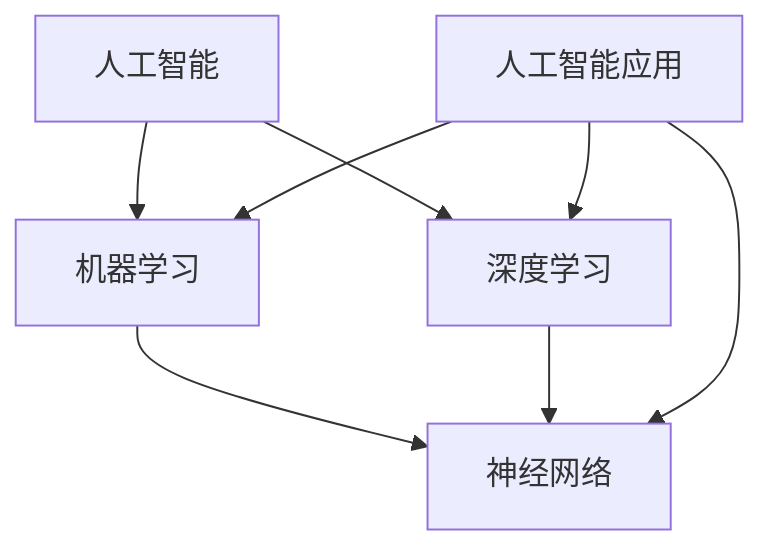

                 

# 李开复：苹果发布AI应用的未来展望

> **关键词：** 苹果，AI应用，人工智能，机器学习，软件开发，用户体验，未来展望

> **摘要：** 本文将探讨苹果公司在其最新产品中发布的AI应用，分析其核心算法、数学模型、具体实现步骤以及实际应用场景，并预测这些AI应用对软件开发和用户体验可能带来的深远影响。文章还将推荐相关学习资源和工具，以帮助读者深入了解和掌握这一技术趋势。

## 1. 背景介绍

### 1.1 目的和范围

本文旨在通过对苹果公司最新发布的AI应用的深入分析，探讨其潜在的技术价值和未来发展趋势。我们将重点关注以下几个方面的内容：

1. AI应用的核心算法原理及其具体操作步骤。
2. 相关数学模型和公式的详细讲解与举例说明。
3. 代码实际案例的详细解释与分析。
4. AI应用在不同领域的实际应用场景。
5. 对软件开发和用户体验可能带来的影响与未来展望。

### 1.2 预期读者

本文适合以下读者群体：

1. 对人工智能和机器学习有一定了解的技术爱好者。
2. 从事软件开发、产品设计和用户体验相关工作的人员。
3. 想要了解AI技术最新进展和研究方向的学生和研究人员。

### 1.3 文档结构概述

本文将分为以下几个部分：

1. 背景介绍：介绍本文的目的、范围和预期读者。
2. 核心概念与联系：阐述AI应用的核心概念原理和架构。
3. 核心算法原理与具体操作步骤：详细讲解核心算法的原理和具体操作步骤。
4. 数学模型与公式：介绍相关的数学模型和公式，并举例说明。
5. 项目实战：提供代码实际案例和详细解释说明。
6. 实际应用场景：分析AI应用在不同领域的实际应用场景。
7. 工具和资源推荐：推荐相关学习资源和开发工具。
8. 总结：对未来发展趋势与挑战进行展望。
9. 附录：常见问题与解答。
10. 扩展阅读与参考资料：提供进一步学习和研究的资源。

### 1.4 术语表

为了确保本文的可读性和一致性，以下是一些核心术语的定义和解释：

#### 1.4.1 核心术语定义

- **人工智能（AI）**：一种模拟人类智能的技术，通过机器学习、深度学习等方法，使计算机具备自主学习和决策能力。
- **机器学习（ML）**：一种人工智能技术，通过算法和模型，使计算机能够从数据中自动学习和改进。
- **深度学习（DL）**：一种机器学习技术，通过多层神经网络模型，对大量数据进行自动特征提取和分类。
- **神经网络（NN）**：一种模仿人脑神经元连接方式的计算模型，可用于处理复杂数据和任务。
- **人工智能应用（AI Application）**：基于人工智能技术构建的应用程序，用于解决特定问题或提供特定服务。

#### 1.4.2 相关概念解释

- **特征提取（Feature Extraction）**：从原始数据中提取出具有区分度的特征，用于训练和优化模型。
- **模型训练（Model Training）**：通过输入数据进行模型参数的调整和优化，使其具备预测和分类能力。
- **模型评估（Model Evaluation）**：通过测试数据对模型性能进行评估，以判断其准确性和泛化能力。
- **模型部署（Model Deployment）**：将训练好的模型部署到实际应用环境中，使其能够为用户提供服务。

#### 1.4.3 缩略词列表

- **AI**：人工智能（Artificial Intelligence）
- **ML**：机器学习（Machine Learning）
- **DL**：深度学习（Deep Learning）
- **NN**：神经网络（Neural Network）
- **API**：应用程序编程接口（Application Programming Interface）
- **SDK**：软件开发工具包（Software Development Kit）

## 2. 核心概念与联系

在讨论苹果发布的AI应用之前，我们需要先了解一些核心概念和它们之间的联系。以下是一个简化的Mermaid流程图，用于展示这些核心概念和它们之间的关系。



### 2.1 人工智能（AI）

人工智能（AI）是一种模拟人类智能的技术，旨在使计算机具备自主学习和决策能力。AI可以分为弱AI和强AI两种类型：

- **弱AI**：指在特定领域表现出类似人类智能的应用程序，如语音识别、图像识别等。
- **强AI**：指具有广泛认知能力的人工智能系统，能够在各种领域表现像人类一样。

### 2.2 机器学习（ML）

机器学习（ML）是一种人工智能技术，通过算法和模型，使计算机能够从数据中自动学习和改进。ML可以分为监督学习、无监督学习和强化学习三种类型：

- **监督学习**：通过已标记的数据对模型进行训练，使其能够预测未知数据的标签。
- **无监督学习**：通过未标记的数据对模型进行训练，使其能够发现数据中的隐藏结构和模式。
- **强化学习**：通过奖励和惩罚机制，使模型在学习过程中不断优化策略，以达到最佳效果。

### 2.3 深度学习（DL）

深度学习（DL）是一种机器学习技术，通过多层神经网络模型，对大量数据进行自动特征提取和分类。DL在图像识别、语音识别、自然语言处理等领域取得了显著成果。

### 2.4 神经网络（NN）

神经网络（NN）是一种模仿人脑神经元连接方式的计算模型，可用于处理复杂数据和任务。NN可以分为卷积神经网络（CNN）、循环神经网络（RNN）和自注意力模型（Transformer）等类型。

### 2.5 人工智能应用（AI Application）

人工智能应用（AI Application）是基于人工智能技术构建的应用程序，用于解决特定问题或提供特定服务。AI应用可以分为通用应用和专用应用两种类型：

- **通用应用**：如语音助手、图像识别、自然语言处理等，可在多个领域通用。
- **专用应用**：如医疗诊断、金融风控、智能家居等，针对特定领域进行优化。

## 3. 核心算法原理与具体操作步骤

在了解核心概念后，我们将深入探讨苹果发布的AI应用的核心算法原理，并详细阐述其具体操作步骤。

### 3.1 算法原理

苹果发布的AI应用采用了深度学习技术，主要依赖于卷积神经网络（CNN）进行图像识别和自然语言处理。CNN是一种基于多层神经网络的结构，通过逐层提取图像特征，实现对图像的自动分类和识别。

### 3.2 操作步骤

以下是苹果发布的AI应用的核心算法原理和具体操作步骤：

#### 3.2.1 数据预处理

1. **数据收集**：从互联网、数据库或其他数据源收集大量的图像和文本数据。
2. **数据清洗**：去除数据中的噪声和异常值，对缺失值进行填充和修正。
3. **数据归一化**：将图像和文本数据转化为统一的格式，如灰度图像、像素值范围在0-255之间。

#### 3.2.2 特征提取

1. **卷积层**：通过卷积操作提取图像的局部特征，如边缘、纹理等。
2. **池化层**：对卷积层生成的特征图进行下采样，减少模型参数，提高计算效率。
3. **全连接层**：将卷积层和池化层生成的特征映射到输出层，实现图像分类和识别。

#### 3.2.3 模型训练

1. **损失函数**：选择合适的损失函数（如交叉熵损失函数），衡量模型预测结果与真实结果之间的差距。
2. **反向传播**：通过反向传播算法，将损失函数关于模型参数的梯度传递给前一层，更新模型参数。
3. **迭代优化**：不断迭代优化模型参数，直至达到预定的训练目标或收敛条件。

#### 3.2.4 模型评估

1. **测试集**：将训练好的模型在测试集上进行评估，以验证其泛化能力。
2. **评价指标**：选择合适的评价指标（如准确率、召回率、F1值等），评估模型在测试集上的性能。
3. **模型优化**：根据评估结果，对模型进行进一步优化和调整。

#### 3.2.5 模型部署

1. **模型部署**：将训练好的模型部署到实际应用环境中，如移动设备、服务器等。
2. **在线更新**：根据用户反馈和实际应用情况，对模型进行在线更新和优化。

## 4. 数学模型和公式

在深度学习算法中，数学模型和公式起着至关重要的作用。以下将介绍与苹果发布的AI应用相关的一些重要数学模型和公式。

### 4.1 前向传播

前向传播是神经网络中最基本的过程，用于计算输入数据经过神经网络后的输出结果。以下是一个简化的前向传播过程：

#### 4.1.1 神经元激活函数

$$
a_i = \sigma(z_i) = \frac{1}{1 + e^{-z_i}}
$$

其中，$a_i$ 表示神经元 $i$ 的输出，$z_i$ 表示神经元 $i$ 的输入，$\sigma$ 表示 sigmoid 激活函数。

#### 4.1.2 前向传播过程

$$
z_i = \sum_{j} w_{ij} a_{j-1} + b_i
$$

$$
a_i = \sigma(z_i)
$$

其中，$w_{ij}$ 表示输入层神经元 $i$ 与隐藏层神经元 $j$ 之间的权重，$b_i$ 表示隐藏层神经元 $i$ 的偏置。

### 4.2 反向传播

反向传播是神经网络中用于优化模型参数的重要过程。它通过计算输出层误差的梯度，将误差反向传播到前一层，从而更新模型参数。以下是一个简化的反向传播过程：

#### 4.2.1 误差计算

$$
\delta_j = (a_j - y_j) \cdot \sigma'(z_j)
$$

其中，$\delta_j$ 表示隐藏层神经元 $j$ 的误差，$a_j$ 表示隐藏层神经元 $j$ 的输出，$y_j$ 表示隐藏层神经元 $j$ 的实际输出，$\sigma'$ 表示 sigmoid 激活函数的导数。

#### 4.2.2 权重更新

$$
\Delta w_{ij} = \eta \cdot \delta_j \cdot a_{i-1}
$$

$$
w_{ij} = w_{ij} + \Delta w_{ij}
$$

其中，$\Delta w_{ij}$ 表示输入层神经元 $i$ 与隐藏层神经元 $j$ 之间的权重更新，$\eta$ 表示学习率。

#### 4.2.3 偏置更新

$$
\Delta b_j = \eta \cdot \delta_j
$$

$$
b_j = b_j + \Delta b_j
$$

其中，$\Delta b_j$ 表示隐藏层神经元 $j$ 的偏置更新。

### 4.3 损失函数

损失函数是衡量模型预测结果与真实结果之间差距的指标。以下是一个常见的损失函数——交叉熵损失函数：

$$
L = -\sum_{i} y_i \cdot \log(a_i)
$$

其中，$L$ 表示损失函数，$y_i$ 表示实际输出，$a_i$ 表示模型预测的输出。

## 5. 项目实战：代码实际案例和详细解释说明

为了更好地理解苹果发布的AI应用，我们将通过一个实际案例来展示如何实现和部署一个简单的深度学习模型。以下是一个基于Python和TensorFlow的示例代码。

### 5.1 开发环境搭建

在开始之前，请确保安装以下依赖项：

- Python 3.6或更高版本
- TensorFlow 2.x

您可以使用以下命令来安装TensorFlow：

```bash
pip install tensorflow
```

### 5.2 源代码详细实现和代码解读

以下是一个简单的深度学习模型实现，用于对图像进行分类。

```python
import tensorflow as tf
from tensorflow.keras import datasets, layers, models

# 加载数据集
(train_images, train_labels), (test_images, test_labels) = datasets.cifar10.load_data()

# 数据预处理
train_images, test_images = train_images / 255.0, test_images / 255.0

# 构建模型
model = models.Sequential()
model.add(layers.Conv2D(32, (3, 3), activation='relu', input_shape=(32, 32, 3)))
model.add(layers.MaxPooling2D((2, 2)))
model.add(layers.Conv2D(64, (3, 3), activation='relu'))
model.add(layers.MaxPooling2D((2, 2)))
model.add(layers.Conv2D(64, (3, 3), activation='relu'))
model.add(layers.Flatten())
model.add(layers.Dense(64, activation='relu'))
model.add(layers.Dense(10))

# 编译模型
model.compile(optimizer='adam',
              loss=tf.keras.losses.SparseCategoricalCrossentropy(from_logits=True),
              metrics=['accuracy'])

# 训练模型
model.fit(train_images, train_labels, epochs=10, validation_data=(test_images, test_labels))

# 评估模型
test_loss, test_acc = model.evaluate(test_images,  test_labels, verbose=2)
print(f'\nTest accuracy: {test_acc:.4f}')
```

#### 5.2.1 代码解读与分析

1. **数据加载和预处理**：

   我们使用TensorFlow内置的CIFAR-10数据集，它包含了10个类别、60000张32x32的彩色图像。在数据预处理阶段，我们将图像归一化到0-1范围内，以便于后续模型训练。

2. **模型构建**：

   我们使用Sequential模型，这是一种线性堆叠模型层的容器。首先，我们添加两个卷积层，每个卷积层后跟一个最大池化层，以提取图像的局部特征。接着，我们添加一个全连接层，用于对提取到的特征进行分类。

3. **编译模型**：

   在编译阶段，我们选择Adam优化器和交叉熵损失函数，以优化模型参数并计算模型在训练和验证数据上的准确率。

4. **训练模型**：

   我们使用fit方法训练模型，指定训练数据、训练轮次和验证数据。训练过程中，模型会自动调整参数，以最小化损失函数。

5. **评估模型**：

   使用evaluate方法评估模型在测试数据上的性能，输出测试准确率。

通过以上代码，我们可以训练一个简单的深度学习模型，对CIFAR-10数据集中的图像进行分类。这个示例展示了深度学习模型的基本实现步骤，为后续更复杂的AI应用打下了基础。

## 6. 实际应用场景

苹果公司在其最新产品中发布的AI应用涉及多个领域，下面我们将分析这些应用在不同领域的实际应用场景。

### 6.1 通信领域

AI在通信领域具有广泛的应用，例如语音识别、自然语言处理和智能客服。苹果发布的AI应用可以通过以下方式改进通信体验：

- **语音识别**：提高语音识别的准确率和速度，使得语音输入更加流畅和准确。
- **自然语言处理**：通过自然语言处理技术，实现更加智能和人性化的对话体验。
- **智能客服**：利用AI技术，实现智能客服系统，提高客户服务质量和效率。

### 6.2 医疗领域

医疗领域是AI技术的重要应用场景，苹果发布的AI应用可以通过以下方式提升医疗诊断和治疗效率：

- **图像识别**：利用深度学习技术，实现对医学影像的自动分析和诊断，提高诊断准确率。
- **基因分析**：通过分析基因数据，帮助医生制定更加精准的治疗方案。
- **医疗健康监测**：利用可穿戴设备，实时监测患者的生理指标，及时发现异常情况。

### 6.3 金融领域

金融领域对AI技术有着极高的需求，苹果发布的AI应用可以在金融领域发挥以下作用：

- **智能投顾**：利用机器学习算法，为用户提供个性化的投资建议，提高投资收益。
- **风险控制**：通过分析大量数据，及时发现潜在的风险，降低金融风险。
- **欺诈检测**：利用AI技术，实时监控交易行为，识别并防范欺诈行为。

### 6.4 智能家居领域

智能家居领域是AI技术的另一个重要应用场景，苹果发布的AI应用可以通过以下方式提升家居智能化水平：

- **语音控制**：通过语音助手，实现智能家居设备的自动化控制。
- **场景识别**：通过图像识别技术，识别家居场景，为用户提供智能化的场景推荐和服务。
- **设备互联**：通过AI技术，实现智能家居设备的互联互通，提升用户体验。

### 6.5 教育领域

教育领域是AI技术的潜在应用场景，苹果发布的AI应用可以在教育领域发挥以下作用：

- **个性化学习**：根据学生的学习情况和需求，提供个性化的学习资源和指导。
- **智能评估**：通过自然语言处理和图像识别技术，实现学生的自动评估和反馈。
- **在线教育**：利用AI技术，提高在线教育的互动性和用户体验。

通过以上分析，我们可以看到苹果发布的AI应用在多个领域具有广泛的应用前景，为各个领域带来了新的发展机遇和挑战。

## 7. 工具和资源推荐

为了更好地掌握AI技术，我们推荐以下工具和资源，包括书籍、在线课程、技术博客和网站，以及开发工具框架和库。

### 7.1 学习资源推荐

#### 7.1.1 书籍推荐

1. **《深度学习》（Deep Learning）** - Goodfellow, Bengio, Courville
   - 内容详实，涵盖了深度学习的基础知识和最新进展，适合进阶学习。

2. **《Python深度学习》（Python Deep Learning）** - François Chollet
   - 介绍了如何使用Python和TensorFlow实现深度学习算法，适合初学者入门。

3. **《人工智能：一种现代方法》（Artificial Intelligence: A Modern Approach）** - Stuart Russell, Peter Norvig
   - 覆盖了人工智能的广泛领域，从理论基础到实际应用，适合系统学习。

#### 7.1.2 在线课程

1. **斯坦福大学机器学习课程**（Stanford University Machine Learning Course）
   - 语音和教程由Andrew Ng教授主讲，是深度学习入门的经典课程。

2. **吴恩达深度学习专项课程**（Deep Learning Specialization）
   - 吴恩达开设的深度学习系列课程，涵盖了从基础到高级的深度学习知识。

3. **Coursera的Python和机器学习课程**（Python for Data Science and Machine Learning）
   - 结合了Python编程和机器学习的基础知识，适合初学者。

#### 7.1.3 技术博客和网站

1. **机器学习博客**（Machine Learning Blog）
   - 提供深度学习、机器学习等相关技术的最新研究成果和实用教程。

2. **Medium上的AI相关文章**（AI on Medium）
   - 中等上的AI主题文章，覆盖广泛，包括行业趋势、技术应用等。

3. **GitHub**（GitHub）
   - 全球最大的代码托管平台，许多优秀的AI项目开源在这里，是学习和实践的好去处。

### 7.2 开发工具框架推荐

#### 7.2.1 IDE和编辑器

1. **PyCharm** - 一款功能强大的Python IDE，适用于深度学习和机器学习项目。

2. **Jupyter Notebook** - 适用于数据科学和机器学习的交互式编辑器，方便代码和结果的展示。

#### 7.2.2 调试和性能分析工具

1. **TensorBoard** - TensorFlow的官方可视化工具，用于分析模型性能和优化。

2. **PyTorch Profiler** - PyTorch的性能分析工具，帮助开发者识别和优化性能瓶颈。

#### 7.2.3 相关框架和库

1. **TensorFlow** - 一个广泛使用的深度学习框架，适用于多种深度学习任务。

2. **PyTorch** - 一个流行的深度学习框架，以动态计算图和灵活的接口著称。

3. **Keras** - 一个高级神经网络API，可以简化深度学习模型的构建和训练。

### 7.3 相关论文著作推荐

#### 7.3.1 经典论文

1. **“A Learning Algorithm for Continually Running Fully Recurrent Neural Networks”** - Jürgen Schmidhuber
   - 论述了神经网络在序列数据上的学习和应用。

2. **“Deep Learning”** - Yann LeCun, Yoshua Bengio, Geoffrey Hinton
   - 全面介绍了深度学习的基础和最新进展。

#### 7.3.2 最新研究成果

1. **“Attention Is All You Need”** - Vaswani et al.
   - 提出了Transformer模型，在自然语言处理领域取得了突破性成果。

2. **“EfficientNet: Rethinking Model Scaling for Convolutional Neural Networks”** - Mingxing Tan, Quoc V. Le
   - 提出了EfficientNet模型，通过改进模型架构实现了高效的模型压缩。

#### 7.3.3 应用案例分析

1. **“Google’s AI Strategy: Solving Complex Problems”** - Google AI
   - 分析了Google如何运用AI技术解决复杂问题，包括搜索、翻译、自动驾驶等。

2. **“AI in Healthcare: Revolutionizing Medical Diagnosis and Treatment”** - IBM Watson Health
   - 探讨了AI在医疗领域的应用，如何通过AI技术提高医疗诊断和治疗的效率。

## 8. 总结：未来发展趋势与挑战

随着人工智能技术的快速发展，苹果发布的AI应用无疑为我们展示了未来科技的前景。未来，AI应用将在通信、医疗、金融、智能家居和教育等领域发挥越来越重要的作用。以下是对未来发展趋势与挑战的总结：

### 8.1 发展趋势

1. **智能化程度的提升**：随着算法和硬件的进步，AI应用的智能化程度将不断提高，为用户提供更加个性化和高效的解决方案。

2. **跨领域融合**：AI技术将与其他领域（如物联网、区块链等）深度融合，创造新的应用场景和商业模式。

3. **边缘计算的发展**：为了满足实时性和低延迟的需求，边缘计算将成为AI应用的重要支撑，使得数据处理更加高效和便捷。

4. **数据隐私和安全**：随着AI应用的普及，数据隐私和安全问题将变得越来越重要，如何保护用户数据的安全和隐私将成为关键挑战。

### 8.2 挑战

1. **算法透明性和可解释性**：随着AI技术的深入应用，算法的透明性和可解释性将成为重要议题，如何提高算法的可解释性以满足监管和用户需求是一个重大挑战。

2. **数据质量和标注**：高质量的数据和准确的标注对于AI模型的训练至关重要，但数据质量和标注过程往往成本高昂且耗时。

3. **模型性能和效率**：如何在有限的计算资源和时间范围内实现高效的模型训练和推理，是AI应用需要解决的核心问题。

4. **人才短缺**：随着AI技术的广泛应用，对AI专业人才的需求将大幅增加，但当前人才培养的速度难以跟上行业发展的步伐。

总之，苹果发布的AI应用为我们展示了人工智能技术的巨大潜力，同时也提出了许多挑战。只有通过不断创新和合作，我们才能充分发挥AI技术的优势，为人类社会带来更多福祉。

## 9. 附录：常见问题与解答

### 9.1 人工智能是什么？

人工智能（AI）是指通过模拟人类智能，使计算机具备自主学习和决策能力的技术。它包括机器学习、深度学习、自然语言处理等多个子领域。

### 9.2 机器学习有哪些类型？

机器学习可以分为以下类型：

- **监督学习**：通过已标记的数据训练模型，使其能够预测未知数据的标签。
- **无监督学习**：通过未标记的数据训练模型，使其能够发现数据中的隐藏结构和模式。
- **强化学习**：通过奖励和惩罚机制，使模型在学习过程中不断优化策略。

### 9.3 深度学习与传统机器学习有什么区别？

深度学习是机器学习的一种子领域，它通过多层神经网络模型对大量数据进行自动特征提取和分类。与传统机器学习相比，深度学习在处理复杂数据和任务时具有更高的准确性和效率。

### 9.4 如何选择合适的神经网络架构？

选择合适的神经网络架构取决于具体的任务和数据类型。以下是一些常见的情况：

- **图像识别**：可以使用卷积神经网络（CNN）。
- **自然语言处理**：可以使用循环神经网络（RNN）或Transformer模型。
- **序列数据处理**：可以使用长短时记忆网络（LSTM）或门控循环单元（GRU）。

### 9.5 数据预处理的重要性是什么？

数据预处理是机器学习项目中的关键步骤，它包括数据清洗、归一化、特征提取等操作。正确的数据预处理可以显著提高模型的训练效果和泛化能力。

### 9.6 如何评估模型的性能？

评估模型的性能通常使用以下指标：

- **准确率**：预测正确的样本数占总样本数的比例。
- **召回率**：预测正确的正样本数占所有正样本的比例。
- **F1值**：准确率和召回率的调和平均值。
- **损失函数**：用于衡量模型预测结果与真实结果之间的差距。

### 9.7 如何优化模型参数？

优化模型参数通常使用以下方法：

- **梯度下降**：一种优化算法，通过计算损失函数关于模型参数的梯度，更新模型参数。
- **学习率调整**：调整梯度下降算法中的学习率，以避免过拟合或欠拟合。
- **正则化**：引入正则化项，如L1或L2正则化，防止模型过拟合。

## 10. 扩展阅读与参考资料

### 10.1 扩展阅读

1. **《深度学习》（Deep Learning）** - Goodfellow, Bengio, Courville
   - 详细介绍了深度学习的理论基础和最新进展。

2. **《Python深度学习》（Python Deep Learning）** - François Chollet
   - 使用Python和TensorFlow实现深度学习算法的教程。

3. **《人工智能：一种现代方法》（Artificial Intelligence: A Modern Approach）** - Stuart Russell, Peter Norvig
   - 全面覆盖了人工智能的理论和应用。

### 10.2 参考资料

1. **TensorFlow官方文档**（[tensorflow.org](https://www.tensorflow.org)）
   - 提供了丰富的教程和API文档，是学习和使用TensorFlow的权威资源。

2. **PyTorch官方文档**（[pytorch.org](https://pytorch.org)）
   - PyTorch的官方文档，包括教程、API参考和模型库。

3. **斯坦福大学机器学习课程**（[cs229.stanford.edu](https://cs229.stanford.edu/)）
   - Andrew Ng教授主讲的机器学习课程，是深度学习的入门经典。

### 10.3 实用工具和资源

1. **GitHub**（[github.com](https://github.com)）
   - 全球最大的代码托管平台，许多AI项目开源在这里。

2. **Kaggle**（[kaggle.com](https://kaggle.com)）
   - 一个数据科学竞赛平台，提供丰富的数据集和比赛项目。

3. **Medium上的AI相关文章**（[AI on Medium](https://medium.com/topic/artificial-intelligence)）
   - 中等上的AI主题文章，涵盖最新的技术趋势和应用案例。

### 10.4 相关会议和研讨会

1. **国际机器学习会议（ICML）**（[icml.cc](https://icml.cc/)）
   - 机器学习领域的顶级学术会议，发布最新的研究成果。

2. **神经信息处理系统大会（NeurIPS）**（[nips.cc](https://nips.cc/)）
   - 深度学习和神经网络领域的顶级学术会议，覆盖广泛的AI主题。

3. **计算机视觉与模式识别会议（CVPR）**（[cvpr.org](https://cvpr.org/)）
   - 计算机视觉领域的顶级学术会议，展示最新的图像识别和视觉处理技术。

### 10.5 开源库和框架

1. **TensorFlow**（[tensorflow.org](https://www.tensorflow.org)）
   - 由Google开发的开源深度学习框架，适用于多种深度学习任务。

2. **PyTorch**（[pytorch.org](https://pytorch.org)）
   - 由Facebook开发的开源深度学习框架，以动态计算图和灵活的接口著称。

3. **Keras**（[keras.io](https://keras.io)）
   - 一个高级神经网络API，可以简化深度学习模型的构建和训练。

### 10.6 开发工具和编辑器

1. **PyCharm**（[www.jetbrains.com/pycharm](https://www.jetbrains.com/pycharm)）
   - 功能强大的Python IDE，适用于深度学习和机器学习项目。

2. **Jupyter Notebook**（[jupyter.org](https://jupyter.org)）
   - 适用于数据科学和机器学习的交互式编辑器，方便代码和结果的展示。

### 10.7 AI应用案例和研究成果

1. **Google AI**（[ai.google/research]）
   - Google AI的研究成果和案例，涵盖自然语言处理、计算机视觉等多个领域。

2. **IBM Watson Health**（[www.ibm.com/watson/health]）
   - IBM Watson Health的AI应用案例，包括医疗诊断、健康监测等。

3. **OpenAI**（[openai.com]）
   - OpenAI的AI研究进展和应用，包括自然语言处理、强化学习等。

### 10.8 技术博客和期刊

1. **Medium上的AI博客**（[AI on Medium](https://medium.com/topic/artificial-intelligence)）
   - 中等上的AI主题文章，涵盖最新的技术趋势和应用案例。

2. **机器学习博客**（[Machine Learning Blog](https://machinelearningmastery.com/)）
   - 提供机器学习教程和实用案例。

3. **arXiv**（[arxiv.org]）
   - AI领域的顶级学术期刊，发布最新的研究成果。

