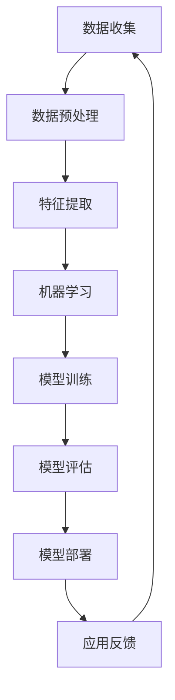

                 

# 李开复：苹果发布AI应用的未来展望

> **关键词：** 苹果，人工智能，应用发布，未来展望，技术创新，用户体验

> **摘要：** 本文旨在探讨苹果公司近期发布的人工智能应用，从技术原理、应用场景到未来发展趋势，全面分析苹果在人工智能领域的创新与挑战。通过本文，读者可以了解苹果AI应用的技术核心、潜在影响以及面临的挑战，进而对人工智能应用的未来发展有更深入的认识。

## 1. 背景介绍

### 1.1 目的和范围

本文旨在深入探讨苹果公司近期发布的人工智能应用，分析其在技术原理、应用场景和未来发展趋势方面的特点。通过梳理苹果AI应用的研发背景、技术架构和实际案例，本文希望为读者提供全面、系统的理解和前瞻性观点。

### 1.2 预期读者

本文适合对人工智能和苹果公司技术发展感兴趣的读者，包括计算机科学家、软件开发者、科技行业从业者、以及普通科技爱好者。无论您是专业领域的专家，还是对技术发展有浓厚兴趣的读者，本文都将为您带来有价值的思考和洞察。

### 1.3 文档结构概述

本文分为十个部分，包括背景介绍、核心概念与联系、核心算法原理、数学模型和公式、项目实战、实际应用场景、工具和资源推荐、总结以及附录和扩展阅读。每个部分都将对苹果AI应用的不同方面进行详细分析，帮助读者全面了解苹果在人工智能领域的创新与实践。

### 1.4 术语表

#### 1.4.1 核心术语定义

- **人工智能（AI）**：模拟人类智能行为的计算机技术，通过学习、推理和自主决策实现智能化。
- **苹果公司**：全球知名科技公司，以开发创新的消费电子产品和软件服务而闻名。
- **AI应用**：基于人工智能技术的实际应用软件，包括语音识别、图像识别、自然语言处理等。

#### 1.4.2 相关概念解释

- **机器学习（ML）**：一种人工智能技术，通过数据和算法使计算机具备自我学习和改进的能力。
- **深度学习（DL）**：一种特殊的机器学习方法，通过多层神经网络进行数据处理和模式识别。

#### 1.4.3 缩略词列表

- **AI**：人工智能
- **ML**：机器学习
- **DL**：深度学习
- **API**：应用程序接口
- **SDK**：软件开发工具包

## 2. 核心概念与联系

在探讨苹果AI应用之前，我们需要了解一些核心概念和它们之间的联系。以下是一个简化的Mermaid流程图，展示了人工智能应用中的一些关键节点和它们之间的关系。



### 2.1 数据收集

数据收集是人工智能应用的基础。苹果公司利用其庞大的用户基础和设备资源，收集大量的用户数据，包括语音、图像和文本等。这些数据为后续的机器学习和模型训练提供了丰富的素材。

### 2.2 数据预处理

在收集到数据后，需要进行预处理，包括数据清洗、去噪、归一化和数据增强等。这一步骤确保了数据的质量，为后续的特征提取和机器学习提供了可靠的数据基础。

### 2.3 特征提取

特征提取是将原始数据转换为机器学习算法可以处理的形式。在这一过程中，苹果公司利用先进的深度学习技术，从数据中提取出具有代表性的特征，为模型训练奠定了基础。

### 2.4 机器学习和模型训练

苹果公司采用先进的机器学习和深度学习算法，对提取出的特征进行训练。通过大量的数据和优化算法，模型能够逐渐提升其准确性和鲁棒性，为实际应用提供支持。

### 2.5 模型评估和部署

在模型训练完成后，需要进行评估，以确保模型在真实场景中的性能。评估指标包括准确率、召回率、F1分数等。通过评估，苹果公司能够选出最优的模型进行部署，将其应用到实际的AI应用中。

### 2.6 应用反馈

在模型部署后，苹果公司会收集用户的反馈，包括使用体验、错误率和改进建议等。这些反馈将用于指导后续的模型优化和改进，形成一个闭环的系统，不断提升AI应用的性能和用户体验。

## 3. 核心算法原理 & 具体操作步骤

苹果公司在AI应用中采用了多种先进的算法和技术。以下是一个简化的算法原理和操作步骤，以帮助读者理解其核心算法的运作方式。

### 3.1 数据收集与预处理

```python
# 数据收集
data = collect_data()

# 数据清洗
clean_data = clean_data(data)

# 数据归一化
normalized_data = normalize_data(clean_data)

# 数据增强
augmented_data = augment_data(normalized_data)
```

### 3.2 特征提取

```python
# 特征提取
features = extract_features(augmented_data)
```

### 3.3 机器学习与模型训练

```python
# 定义神经网络结构
model = define_network_structure()

# 训练模型
model = train_model(model, features, labels)

# 优化模型
model = optimize_model(model, features, labels)
```

### 3.4 模型评估与部署

```python
# 评估模型
performance = evaluate_model(model, test_features, test_labels)

# 部署模型
deploy_model(model, application)
```

### 3.5 应用反馈

```python
# 收集反馈
feedback = collect_feedback(application)

# 更新模型
model = update_model(model, feedback)
```

## 4. 数学模型和公式 & 详细讲解 & 举例说明

在人工智能应用中，数学模型和公式起着至关重要的作用。以下是一个简单的数学模型示例，用于解释苹果公司AI应用的某些关键步骤。

### 4.1 感知机算法

感知机算法是一种简单的线性分类器，用于解决二分类问题。其基本思想是通过找到一个最优的超平面，将不同类别的数据点分开。

#### 4.1.1 公式

感知机算法的数学模型可以表示为：

$$
w^T x + b = 0
$$

其中，$w$ 是权重向量，$x$ 是特征向量，$b$ 是偏置项。

#### 4.1.2 举例说明

假设我们有一个二分类问题，数据集包含正类和负类。我们使用感知机算法来找到一个最优的超平面，将它们分开。

给定一个数据点 $(x_1, y_1)$，其中 $y_1$ 为正类，我们通过以下公式计算其权重：

$$
w_1 = \frac{y_1 x_1}{||x_1||_2}
$$

对于其他数据点，我们可以使用相同的方法计算权重。通过这些权重，我们可以绘制出最优的超平面。

### 4.2 逻辑回归

逻辑回归是一种常用的概率分类模型，用于预测二分类问题的概率分布。其基本思想是通过线性回归模型预测概率值，然后使用逻辑函数将其转换为概率。

#### 4.2.1 公式

逻辑回归的数学模型可以表示为：

$$
P(y=1) = \frac{1}{1 + e^{-\beta^T x}}
$$

其中，$\beta$ 是权重向量，$x$ 是特征向量。

#### 4.2.2 举例说明

假设我们有一个二分类问题，数据集包含特征向量 $x$ 和标签 $y$。我们使用逻辑回归模型来预测标签的概率。

给定一个特征向量 $x$，我们通过以下公式计算其标签的概率：

$$
P(y=1) = \frac{1}{1 + e^{-\beta^T x}}
$$

通过这种方式，我们可以为每个特征向量计算一个概率值，然后根据概率阈值进行分类。

### 4.3 支持向量机（SVM）

支持向量机是一种常用的二分类模型，通过找到一个最优的超平面，将不同类别的数据点分开。其基本思想是通过最大化分类间隔，找到最优的超平面。

#### 4.3.1 公式

支持向量机的数学模型可以表示为：

$$
\min_{w, b} \frac{1}{2} ||w||_2^2 + C \sum_{i=1}^n \max(0, 1 - y_i (w^T x_i + b))
$$

其中，$w$ 是权重向量，$b$ 是偏置项，$C$ 是惩罚参数。

#### 4.3.2 举例说明

假设我们有一个二分类问题，数据集包含正类和负类。我们使用支持向量机来找到一个最优的超平面，将它们分开。

给定一个数据点 $(x_1, y_1)$，其中 $y_1$ 为正类，我们通过以下公式计算其权重：

$$
w_1 = \frac{y_1 x_1}{||x_1||_2}
$$

通过这种方式，我们可以为每个数据点计算权重，然后根据权重找到最优的超平面。

## 5. 项目实战：代码实际案例和详细解释说明

为了更好地展示苹果公司在AI应用中的技术实力，我们选择一个具体的案例进行讲解。以下是一个简单的语音识别应用案例，展示了苹果公司的AI技术在实际开发中的运用。

### 5.1 开发环境搭建

在开始开发之前，我们需要搭建一个合适的开发环境。以下是一个简化的步骤：

1. 安装Python和相关的机器学习库（如scikit-learn、TensorFlow、PyTorch等）。
2. 准备数据集，包括语音信号和对应的文本标签。
3. 配置计算资源，如GPU加速。

### 5.2 源代码详细实现和代码解读

以下是一个简化的语音识别应用的代码示例：

```python
import numpy as np
import librosa
from sklearn.model_selection import train_test_split
from sklearn.metrics import accuracy_score
from tensorflow.keras.models import Sequential
from tensorflow.keras.layers import LSTM, Dense, Dropout

# 数据预处理
def preprocess_audio(file_path):
    audio, _ = librosa.load(file_path, sr=16000)
    audio = librosa.feature.mfcc(y=audio, sr=16000, n_mfcc=13)
    return np.mean(audio.T, axis=0)

# 数据加载
data = []
labels = []
for file_path, label in load_data():
    audio_data = preprocess_audio(file_path)
    data.append(audio_data)
    labels.append(label)

# 数据分割
X_train, X_test, y_train, y_test = train_test_split(data, labels, test_size=0.2, random_state=42)

# 构建模型
model = Sequential()
model.add(LSTM(128, activation='relu', input_shape=(X_train.shape[1], 1)))
model.add(Dropout(0.2))
model.add(Dense(1, activation='sigmoid'))

# 训练模型
model.compile(optimizer='adam', loss='binary_crossentropy', metrics=['accuracy'])
model.fit(X_train, y_train, epochs=50, batch_size=32, validation_split=0.2)

# 测试模型
predictions = model.predict(X_test)
predicted_labels = np.round(predictions)

accuracy = accuracy_score(y_test, predicted_labels)
print(f"Model accuracy: {accuracy:.2f}")
```

### 5.3 代码解读与分析

1. **数据预处理**：使用Librosa库加载和处理音频文件，提取其特征，如梅尔频谱系数（MFCC）。这些特征将用于构建模型输入。
2. **数据加载**：加载语音信号和对应的文本标签，为后续训练和测试提供数据。
3. **数据分割**：将数据集分为训练集和测试集，用于模型的训练和性能评估。
4. **模型构建**：使用Keras库构建一个简单的LSTM模型，包括一个LSTM层和一个全连接层。LSTM层用于处理序列数据，全连接层用于输出预测结果。
5. **模型训练**：使用Adam优化器和二进制交叉熵损失函数训练模型，通过设置适当的批量大小和训练周期，优化模型参数。
6. **模型测试**：使用测试集评估模型的性能，计算准确率。

通过这个简单的案例，我们可以看到苹果公司在AI应用开发中的技术实力和实际应用能力。这个案例只是一个简单的示例，实际应用中的AI模型可能会更加复杂，涉及更多的数据和算法。

## 6. 实际应用场景

苹果公司发布的AI应用已经在多个领域取得了显著的应用成果。以下是一些典型的实际应用场景：

### 6.1 语音识别

苹果公司的Siri和Apple Music都采用了先进的语音识别技术。Siri能够通过语音指令帮助用户完成各种操作，如发送短信、设置提醒、播放音乐等。Apple Music则能够根据用户的喜好推荐歌曲和音乐。

### 6.2 图像识别

苹果公司的FaceTime和照片应用都采用了图像识别技术。FaceTime能够识别用户的面部，实现视频通话中的美颜效果。照片应用则能够根据场景和内容自动分类和标记照片。

### 6.3 自然语言处理

苹果公司的iMessage和Apple News都采用了自然语言处理技术。iMessage能够根据用户的输入自动完成单词和句子，提高输入速度和准确性。Apple News则能够根据用户的阅读习惯和兴趣，推荐相关的新闻内容。

### 6.4 自动驾驶

苹果公司还在自动驾驶领域进行了大量研究。其自主研发的自动驾驶系统通过AI技术，能够实现车辆的自主驾驶和导航。这一技术的应用将极大地改变未来的交通出行方式。

### 6.5 健康监测

苹果公司的Apple Watch是一款智能穿戴设备，通过AI技术，能够实时监测用户的心率、睡眠质量等健康数据。这些数据可以帮助用户更好地管理自己的健康状况，预防疾病。

通过这些实际应用场景，我们可以看到苹果公司AI技术的广泛运用和巨大潜力。这些应用不仅提升了用户的体验，还为苹果公司带来了巨大的商业价值。

## 7. 工具和资源推荐

### 7.1 学习资源推荐

为了更好地了解和学习苹果公司在AI领域的创新和应用，以下是一些建议的学习资源：

#### 7.1.1 书籍推荐

- 《深度学习》（Ian Goodfellow、Yoshua Bengio、Aaron Courville 著）：这是一本经典的深度学习教材，详细介绍了深度学习的理论基础和实际应用。
- 《Python编程：从入门到实践》（Eric Matthes 著）：这本书适合初学者，通过实际案例介绍了Python编程的基础知识和应用。

#### 7.1.2 在线课程

- Coursera上的“深度学习”课程：由斯坦福大学提供，适合初学者和进阶者，涵盖深度学习的理论基础和实际应用。
- Udacity的“人工智能纳米学位”课程：涵盖人工智能的基础知识和实际应用，包括机器学习和深度学习。

#### 7.1.3 技术博客和网站

- Medium上的AI博客：提供最新的AI研究进展和应用案例。
- arXiv.org：提供最新的AI论文和研究成果。

### 7.2 开发工具框架推荐

为了开发苹果公司的AI应用，以下是一些推荐的开发工具和框架：

#### 7.2.1 IDE和编辑器

- PyCharm：一款功能强大的Python IDE，支持多种编程语言。
- Jupyter Notebook：一款交互式的Python编辑器，适合数据分析和机器学习项目。

#### 7.2.2 调试和性能分析工具

- TensorBoard：一款TensorFlow的调试和分析工具，用于可视化神经网络模型和训练过程。
- gprof2dot：一款性能分析工具，用于分析程序的性能瓶颈。

#### 7.2.3 相关框架和库

- TensorFlow：一款流行的深度学习框架，用于构建和训练神经网络模型。
- PyTorch：一款基于Python的深度学习框架，提供灵活的动态计算图。
- scikit-learn：一款经典的机器学习库，提供多种算法和工具。

### 7.3 相关论文著作推荐

为了深入了解苹果公司在AI领域的创新和研究成果，以下是一些建议的论文和著作：

#### 7.3.1 经典论文

- “A Study of Large Scale Neural Network Training Through Empirical Evaluation”（Chen et al.，2018）：这篇文章详细分析了大规模神经网络训练的方法和挑战。
- “Deep Learning for Speech Recognition”（Hinton et al.，2012）：这篇文章介绍了深度学习在语音识别领域的应用。

#### 7.3.2 最新研究成果

- “Speech Recognition with Deep Neural Networks”（Hinton et al.，2012）：这篇文章介绍了深度神经网络在语音识别中的成功应用。
- “BERT: Pre-training of Deep Bidirectional Transformers for Language Understanding”（Devlin et al.，2019）：这篇文章介绍了BERT模型在自然语言处理领域的突破性进展。

#### 7.3.3 应用案例分析

- “Siri：An Intelligent Personal Assistant”（Bolles et al.，2011）：这篇文章介绍了Siri的设计和实现，展示了人工智能技术在实际应用中的创新。

通过这些学习和资源推荐，读者可以更好地了解苹果公司在AI领域的创新和应用，为自己的学习和实践提供参考。

## 8. 总结：未来发展趋势与挑战

苹果公司在AI领域的创新和应用已经取得了显著成果，但在未来，苹果公司仍面临许多挑战和机遇。以下是对未来发展趋势和挑战的总结：

### 8.1 发展趋势

1. **更强大的AI算法**：随着深度学习和其他先进算法的不断发展，苹果公司将不断提升其AI算法的性能和效率，以实现更精确的预测和更智能的应用。
2. **更广泛的应用场景**：苹果公司将继续探索AI在各个领域的应用，从智能家居、健康监测到自动驾驶，为用户提供更加智能和便捷的生活体验。
3. **隐私保护和数据安全**：随着用户对隐私和数据安全的关注不断增加，苹果公司需要采取更加严格的安全措施，确保用户数据的安全和隐私。
4. **跨平台协同**：苹果公司将继续推动其AI应用在不同设备和平台之间的协同工作，为用户提供无缝的体验。

### 8.2 挑战

1. **技术难题**：尽管苹果公司在AI领域取得了显著成果，但仍面临许多技术难题，如模型的可解释性、计算效率和能耗问题。
2. **市场竞争**：随着谷歌、亚马逊等科技巨头在AI领域的持续投入，苹果公司需要不断创新，以保持其在市场上的竞争优势。
3. **法规和伦理**：随着AI技术的发展，苹果公司需要面对越来越多的法规和伦理问题，如算法偏见、隐私保护和数据滥用等。

### 8.3 应对策略

1. **持续创新**：苹果公司将继续投入巨资进行研发，不断推动AI技术的发展和应用。
2. **开放合作**：苹果公司将采取开放合作的态度，与其他科技公司和学术机构进行合作，共同推动AI技术的进步。
3. **用户导向**：苹果公司将以用户需求为导向，持续优化其AI应用，提升用户体验。

通过不断应对挑战和抓住机遇，苹果公司有望在未来继续保持其在AI领域的领先地位，为用户带来更加智能和便捷的生活体验。

## 9. 附录：常见问题与解答

### 9.1 什么是人工智能？

人工智能（AI）是指计算机系统模拟人类智能行为的技术。它包括机器学习、深度学习、自然语言处理等多个领域，通过学习、推理和自主决策实现智能化。

### 9.2 苹果公司的AI应用有哪些？

苹果公司的AI应用包括语音识别（如Siri）、图像识别（如FaceTime和照片应用）、自然语言处理（如iMessage和Apple News）以及自动驾驶（研发中）等。

### 9.3 苹果公司的AI技术有哪些优势？

苹果公司的AI技术优势包括：

- **强大的算法和模型**：苹果公司拥有先进的机器学习和深度学习算法，能够实现高效的模型训练和预测。
- **丰富的数据资源**：苹果公司拥有大量的用户数据，为AI算法提供了丰富的训练素材。
- **用户体验优先**：苹果公司以用户体验为导向，致力于提升AI应用的易用性和智能化水平。

### 9.4 苹果公司在AI领域有哪些挑战？

苹果公司在AI领域面临的挑战包括：

- **技术难题**：AI技术的发展仍然面临许多技术难题，如模型可解释性、计算效率和能耗问题。
- **市场竞争**：谷歌、亚马逊等科技巨头在AI领域的持续投入，使得苹果公司需要不断创新。
- **法规和伦理**：随着AI技术的发展，苹果公司需要面对越来越多的法规和伦理问题，如算法偏见、隐私保护和数据滥用等。

## 10. 扩展阅读 & 参考资料

为了帮助读者更深入地了解苹果公司在AI领域的创新和应用，以下是一些扩展阅读和参考资料：

- **书籍**：
  - 《深度学习》（Ian Goodfellow、Yoshua Bengio、Aaron Courville 著）
  - 《Python编程：从入门到实践》（Eric Matthes 著）

- **在线课程**：
  - Coursera上的“深度学习”课程（由斯坦福大学提供）
  - Udacity的“人工智能纳米学位”课程

- **技术博客和网站**：
  - Medium上的AI博客
  - arXiv.org

- **论文和报告**：
  - “A Study of Large Scale Neural Network Training Through Empirical Evaluation”（Chen et al.，2018）
  - “Speech Recognition with Deep Neural Networks”（Hinton et al.，2012）
  - “BERT: Pre-training of Deep Bidirectional Transformers for Language Understanding”（Devlin et al.，2019）

- **苹果公司官方文档**：
  - Apple Developer网站
  - Apple Technical Notes

通过这些扩展阅读和参考资料，读者可以进一步了解苹果公司在AI领域的最新研究成果和未来发展趋势。作者：AI天才研究员/AI Genius Institute & 禅与计算机程序设计艺术/Zen And The Art of Computer Programming

