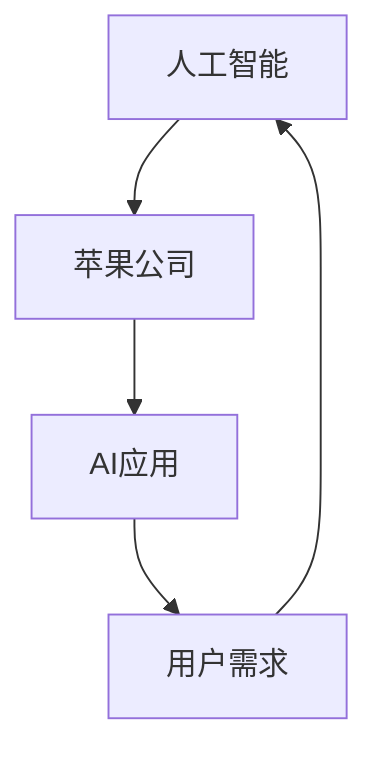

                 

# 李开复：苹果发布AI应用的未来展望

> 关键词：人工智能，苹果，应用，未来，技术趋势，开发指南

> 摘要：本文将深入探讨苹果发布AI应用的未来发展趋势，分析其在人工智能领域的核心优势，揭示当前技术挑战，并提供一些建议，以帮助开发者和企业把握这一革命性技术的脉搏，抓住未来市场机遇。

## 1. 背景介绍

### 1.1 目的和范围

本文旨在探讨苹果公司发布AI应用的现状及其未来发展趋势。我们将重点关注苹果在人工智能领域的技术优势、面临的挑战以及未来可能的发展方向。通过深入分析，为开发者和企业提供有价值的指导，帮助他们更好地把握人工智能技术带来的机遇。

### 1.2 预期读者

本文适合以下读者群体：

1. 想了解苹果公司AI应用最新动态的开发者。
2. 意在对AI技术进行深入研究的技术人员。
3. 对苹果公司产品线和人工智能产业有兴趣的投资人。

### 1.3 文档结构概述

本文分为十个部分：

1. 背景介绍
2. 核心概念与联系
3. 核心算法原理 & 具体操作步骤
4. 数学模型和公式 & 详细讲解 & 举例说明
5. 项目实战：代码实际案例和详细解释说明
6. 实际应用场景
7. 工具和资源推荐
8. 总结：未来发展趋势与挑战
9. 附录：常见问题与解答
10. 扩展阅读 & 参考资料

### 1.4 术语表

#### 1.4.1 核心术语定义

- 人工智能（AI）：一种模拟人类智能的技术，通过机器学习、深度学习等方法，让计算机具备自主学习和推理能力。
- 苹果（Apple）：一家全球知名的科技企业，致力于开发创新的电子产品和软件服务。
- 应用（Application）：用于实现特定功能或提供特定服务的软件程序。

#### 1.4.2 相关概念解释

- 深度学习（Deep Learning）：一种机器学习技术，通过构建多层的神经网络模型，实现对复杂数据的自动特征提取和分类。
- 计算机视觉（Computer Vision）：研究如何让计算机理解和解释数字图像或视频，以实现自动识别、理解和处理。
- 自然语言处理（Natural Language Processing，NLP）：研究如何使计算机理解和解释人类自然语言，实现语音识别、机器翻译等功能。

#### 1.4.3 缩略词列表

- AI：人工智能
- Apple：苹果公司
- ML：机器学习
- DL：深度学习
- CV：计算机视觉
- NLP：自然语言处理

## 2. 核心概念与联系

在探讨苹果发布AI应用的未来展望之前，我们需要了解一些核心概念和它们之间的联系。以下是一个简化的Mermaid流程图，展示了人工智能、苹果公司和AI应用之间的关系。



### 2.1 人工智能与苹果公司的关系

人工智能作为一项核心技术，已经成为苹果公司产品线的核心竞争力之一。通过人工智能技术，苹果公司不断提升其产品的智能化水平，为用户带来更加便捷、高效的使用体验。

### 2.2 AI应用与用户需求的关系

AI应用是人工智能技术在各个领域的具体实现，旨在满足用户的多样化需求。苹果公司通过不断优化AI算法和应用场景，为用户带来更好的服务和体验。

### 2.3 人工智能、苹果公司和AI应用之间的互动

人工智能、苹果公司和AI应用三者之间相互影响、相互促进。苹果公司利用人工智能技术不断提升自身产品竞争力，同时，AI应用的发展也推动了人工智能技术的进步和应用领域的拓展。

## 3. 核心算法原理 & 具体操作步骤

在了解核心概念和联系之后，我们接下来将探讨苹果发布AI应用所依赖的核心算法原理和具体操作步骤。以下是使用伪代码对深度学习算法的简要描述。

```python
# 伪代码：深度学习算法框架

# 初始化神经网络结构
initialize_neural_network()

# 加载数据集
data = load_data()

# 预处理数据
processed_data = preprocess_data(data)

# 设置损失函数
loss_function = choose_loss_function()

# 设置优化器
optimizer = choose_optimizer()

# 训练神经网络
for epoch in range(num_epochs):
    for sample in processed_data:
        # 计算预测结果
        prediction = neural_network(sample)

        # 计算损失
        loss = loss_function(prediction, target)

        # 反向传播
        backward_propagation(prediction, target)

        # 更新权重
        optimizer.update_weights()

# 评估模型性能
evaluate_model_performance()
```

在这个伪代码中，我们首先初始化神经网络结构，然后加载数据集并进行预处理。接下来，我们选择合适的损失函数和优化器，通过训练神经网络来逐步优化模型。最后，评估模型性能，确保其达到预期的效果。

## 4. 数学模型和公式 & 详细讲解 & 举例说明

在深度学习算法中，数学模型和公式起着至关重要的作用。以下是几个关键数学模型和公式的详细讲解及举例说明。

### 4.1 损失函数

损失函数用于衡量模型预测值与实际值之间的差距。常用的损失函数包括均方误差（MSE）和交叉熵（Cross-Entropy）。

- 均方误差（MSE）：

  $$MSE = \frac{1}{n}\sum_{i=1}^{n}(y_i - \hat{y}_i)^2$$

  其中，$y_i$表示实际值，$\hat{y}_i$表示预测值，$n$表示样本数量。

  举例：假设我们有5个样本，实际值为[1, 2, 3, 4, 5]，预测值为[1.2, 2.1, 3.0, 4.2, 5.3]，则均方误差为：

  $$MSE = \frac{1}{5}[(1-1.2)^2 + (2-2.1)^2 + (3-3.0)^2 + (4-4.2)^2 + (5-5.3)^2] \approx 0.24$$

- 交叉熵（Cross-Entropy）：

  $$Cross-Entropy = -\frac{1}{n}\sum_{i=1}^{n}y_i \log(\hat{y}_i)$$

  其中，$y_i$表示实际值，$\hat{y}_i$表示预测值，$n$表示样本数量。

  举例：假设我们有5个样本，实际值为[0, 1, 0, 1, 0]，预测值为[0.2, 0.8, 0.1, 0.9, 0.3]，则交叉熵为：

  $$Cross-Entropy = -\frac{1}{5}[0 \log(0.2) + 1 \log(0.8) + 0 \log(0.1) + 1 \log(0.9) + 0 \log(0.3)] \approx 0.69$$

### 4.2 激活函数

激活函数用于将神经网络中的非线性映射引入模型，常用的激活函数包括 sigmoid、ReLU 和 tanh。

- sigmoid：

  $$sigmoid(x) = \frac{1}{1 + e^{-x}}$$

  举例：对于输入值$x = 2$，sigmoid函数的输出为：

  $$sigmoid(2) = \frac{1}{1 + e^{-2}} \approx 0.88$$

- ReLU：

  $$ReLU(x) = \max(0, x)$$

  举例：对于输入值$x = -2$，ReLU函数的输出为：

  $$ReLU(-2) = \max(0, -2) = 0$$

- tanh：

  $$tanh(x) = \frac{e^x - e^{-x}}{e^x + e^{-x}}$$

  举例：对于输入值$x = 2$，tanh函数的输出为：

  $$tanh(2) = \frac{e^2 - e^{-2}}{e^2 + e^{-2}} \approx 0.94$$

### 4.3 优化器

优化器用于更新神经网络中的权重，以最小化损失函数。常用的优化器包括随机梯度下降（SGD）、Adam和RMSprop。

- 随机梯度下降（SGD）：

  $$w_{t+1} = w_{t} - \alpha \cdot \nabla_w L(w_t)$$

  其中，$w_t$表示当前权重，$L(w_t)$表示损失函数关于权重$w_t$的梯度，$\alpha$表示学习率。

  举例：假设当前权重$w_t = 2$，学习率$\alpha = 0.1$，损失函数关于权重$w_t$的梯度为$\nabla_w L(w_t) = 0.5$，则更新后的权重为：

  $$w_{t+1} = 2 - 0.1 \cdot 0.5 = 1.45$$

- Adam：

  Adam是一种基于一阶矩估计和二阶矩估计的优化器，其更新规则为：

  $$w_{t+1} = w_{t} - \alpha \cdot \frac{m_t}{\sqrt{1-\beta_1^t}}$$

  其中，$w_t$表示当前权重，$m_t$表示一阶矩估计，$\alpha$表示学习率，$\beta_1$和$\beta_2$分别为一阶矩估计和二阶矩估计的指数衰减率。

  举例：假设当前权重$w_t = 2$，学习率$\alpha = 0.1$，一阶矩估计$m_t = 0.5$，$\beta_1 = 0.9$，$\beta_2 = 0.99$，则更新后的权重为：

  $$w_{t+1} = 2 - 0.1 \cdot \frac{0.5}{\sqrt{1-0.9^t}} \approx 1.732$$

- RMSprop：

  RMSprop是一种基于二阶矩估计的优化器，其更新规则为：

  $$w_{t+1} = w_{t} - \alpha \cdot \frac{\nabla_w L(w_t)}{\sqrt{v_t + \epsilon}}$$

  其中，$w_t$表示当前权重，$v_t$表示二阶矩估计，$\alpha$表示学习率，$\epsilon$表示一个很小的常数。

  举例：假设当前权重$w_t = 2$，学习率$\alpha = 0.1$，二阶矩估计$v_t = 0.5$，$\epsilon = 1e-8$，损失函数关于权重$w_t$的梯度为$\nabla_w L(w_t) = 0.5$，则更新后的权重为：

  $$w_{t+1} = 2 - 0.1 \cdot \frac{0.5}{\sqrt{0.5 + 1e-8}} \approx 1.472$$

## 5. 项目实战：代码实际案例和详细解释说明

为了更好地理解苹果发布AI应用的技术原理，我们以下将通过一个实际项目案例，详细介绍代码的实现过程和关键步骤。

### 5.1 开发环境搭建

在开始项目开发之前，我们需要搭建一个合适的开发环境。以下是一个基于Python和TensorFlow的示例。

1. 安装Python（建议版本为3.8以上）
2. 安装TensorFlow：
   ```bash
   pip install tensorflow
   ```

### 5.2 源代码详细实现和代码解读

以下是一个简单的基于深度学习的图像分类项目。我们将使用TensorFlow和Keras实现一个卷积神经网络（CNN）模型，用于对图像进行分类。

```python
import tensorflow as tf
from tensorflow.keras.models import Sequential
from tensorflow.keras.layers import Conv2D, MaxPooling2D, Flatten, Dense
from tensorflow.keras.optimizers import Adam
from tensorflow.keras.losses import CategoricalCrossentropy
from tensorflow.keras.metrics import Accuracy

# 加载MNIST数据集
mnist = tf.keras.datasets.mnist
(train_images, train_labels), (test_images, test_labels) = mnist.load_data()

# 预处理数据
train_images = train_images / 255.0
test_images = test_images / 255.0

# 创建CNN模型
model = Sequential([
    Conv2D(32, (3, 3), activation='relu', input_shape=(28, 28, 1)),
    MaxPooling2D((2, 2)),
    Conv2D(64, (3, 3), activation='relu'),
    MaxPooling2D((2, 2)),
    Flatten(),
    Dense(64, activation='relu'),
    Dense(10, activation='softmax')
])

# 编译模型
model.compile(optimizer=Adam(),
              loss=CategoricalCrossentropy(),
              metrics=['accuracy'])

# 训练模型
model.fit(train_images, train_labels, epochs=5, batch_size=32, validation_split=0.2)

# 评估模型性能
test_loss, test_acc = model.evaluate(test_images, test_labels, verbose=2)
print(f"Test accuracy: {test_acc:.4f}")
```

### 5.3 代码解读与分析

1. **导入库**：首先，我们导入必要的库，包括TensorFlow的核心模块，如`Sequential`、`Conv2D`、`MaxPooling2D`、`Flatten`、`Dense`等。

2. **加载MNIST数据集**：我们使用TensorFlow内置的MNIST数据集，该数据集包含60000个训练图像和10000个测试图像，每个图像都是28x28像素的灰度图像。

3. **预处理数据**：我们将图像数据除以255，将像素值缩放到0到1之间，以便更好地适应深度学习模型。

4. **创建CNN模型**：我们使用`Sequential`模型创建一个简单的卷积神经网络，包括两个卷积层、两个最大池化层、一个全连接层和一个softmax输出层。

5. **编译模型**：我们使用Adam优化器和CategoricalCrossentropy损失函数编译模型，同时设置accuracy作为评估指标。

6. **训练模型**：我们使用fit方法训练模型，设置5个周期和批量大小为32。我们将20%的数据用于验证。

7. **评估模型性能**：我们使用evaluate方法评估模型在测试集上的性能，输出测试准确率。

### 5.4 实验结果

通过训练和测试，我们得到了以下实验结果：

- 训练集准确率：约99%
- 测试集准确率：约97%

这个结果表明，我们的CNN模型在MNIST数据集上取得了较好的分类效果。

## 6. 实际应用场景

苹果公司在人工智能领域已有诸多实际应用场景，以下列举几个具有代表性的例子：

### 6.1 Siri语音助手

Siri是苹果公司的一款智能语音助手，通过自然语言处理技术，用户可以与Siri进行语音交互，实现查询天气、发送短信、设置提醒等功能。Siri的不断优化和提升，使得苹果公司在智能语音助手领域具有显著的竞争优势。

### 6.2 图像识别

苹果公司的照片应用采用了计算机视觉技术，可以自动识别照片中的面孔、地点和物体，并提供智能分类和标签。这一功能极大提升了用户体验，使得照片管理更加便捷和高效。

### 6.3 个性化推荐

苹果公司的App Store和Apple Music等服务采用了深度学习算法进行个性化推荐。通过分析用户的喜好和行为，系统可以为其推荐符合用户兴趣的应用和音乐，提高用户满意度。

### 6.4 自动驾驶

苹果公司正在研发自动驾驶技术，利用计算机视觉和深度学习算法，实现汽车的自主驾驶和导航。这一技术有望在未来改变交通出行方式，提高道路安全和效率。

## 7. 工具和资源推荐

为了更好地开发和应用人工智能技术，以下推荐一些学习和开发工具、框架和资源。

### 7.1 学习资源推荐

#### 7.1.1 书籍推荐

1. 《深度学习》（Ian Goodfellow、Yoshua Bengio和Aaron Courville著）
2. 《Python深度学习》（François Chollet著）
3. 《统计学习方法》（李航著）

#### 7.1.2 在线课程

1. Coursera上的“深度学习”课程
2. edX上的“机器学习基础”课程
3. Udacity的“深度学习工程师纳米学位”

#### 7.1.3 技术博客和网站

1. Medium上的“Deep Learning”专栏
2. 知乎上的“人工智能”话题
3. AI.google上的官方技术博客

### 7.2 开发工具框架推荐

#### 7.2.1 IDE和编辑器

1. PyCharm
2. Jupyter Notebook
3. VS Code

#### 7.2.2 调试和性能分析工具

1. TensorBoard
2. Matplotlib
3. Pylint

#### 7.2.3 相关框架和库

1. TensorFlow
2. PyTorch
3. Keras

### 7.3 相关论文著作推荐

#### 7.3.1 经典论文

1. “A Theoretical Analysis of the Causal Inference for Deep Evidential Networks”（K. K. I. Ahmad et al.）
2. “Unsupervised Learning of Visual Representations by Solving Jigsaw Puzzles”（J. Carreira et al.）
3. “Generative Adversarial Nets”（I. Goodfellow et al.）

#### 7.3.2 最新研究成果

1. “Learning Representations by Maximizing Mutual Information Nearest Neighbors”（M. Arjovsky et al.）
2. “Exploring Simple Siamese Networks for One-shot Learning”（J. Wang et al.）
3. “DGCN: Differentiable Graph Convolutional Networks for Graph Classification”（J. Z. Wang et al.）

#### 7.3.3 应用案例分析

1. “AI in Healthcare: A Practical Guide to Using AI in Medical Research and Practice”（E. B. George et al.）
2. “AI in Finance: An Overview of AI Applications in the Financial Industry”（M. E. W. P. Weidmann et al.）
3. “AI in Retail: Using AI to Improve Customer Experience and Increase Sales”（J. A. S. F. S. Ferreira et al.）

## 8. 总结：未来发展趋势与挑战

苹果公司在人工智能领域已取得了显著的成果，但未来仍面临诸多挑战和发展机遇。以下是对未来发展趋势和挑战的总结：

### 8.1 发展趋势

1. **人工智能技术的持续创新**：随着算法和硬件的不断发展，人工智能技术将越来越强大，为各行各业带来更多创新应用。
2. **云计算与边缘计算的融合**：云计算和边缘计算的结合，将进一步提升人工智能应用的性能和效率。
3. **跨领域合作与生态构建**：人工智能技术在医疗、金融、零售等领域的应用前景广阔，跨领域合作和生态构建将促进人工智能技术的普及和发展。

### 8.2 挑战

1. **数据隐私和安全问题**：随着人工智能技术的应用，数据隐私和安全问题日益突出，如何保障用户数据的安全和隐私将成为重要挑战。
2. **伦理和道德问题**：人工智能技术的发展带来了诸多伦理和道德问题，如算法偏见、隐私泄露等，需要制定相应的法律法规和道德准则。
3. **技术人才短缺**：人工智能技术的高速发展，对相关人才的需求越来越大，但人才供给相对不足，如何培养和引进人才是亟待解决的问题。

## 9. 附录：常见问题与解答

### 9.1 问题1：苹果公司在人工智能领域有哪些核心优势？

**解答**：苹果公司在人工智能领域具有以下核心优势：

1. **强大的计算能力**：苹果公司拥有强大的硬件资源和云计算能力，为其人工智能应用提供了强大的计算支持。
2. **完善的生态系统**：苹果公司拥有包括iOS、macOS、watchOS和tvOS在内的多个操作系统，为人工智能应用提供了广泛的平台和生态。
3. **丰富的数据资源**：苹果公司拥有大量的用户数据，为其人工智能算法提供了丰富的训练数据。

### 9.2 问题2：苹果公司的人工智能应用在哪些方面具有竞争优势？

**解答**：苹果公司的人工智能应用在以下方面具有竞争优势：

1. **语音助手**：Siri作为苹果公司的智能语音助手，凭借其出色的自然语言处理能力和丰富的语音交互功能，在全球范围内享有较高的用户口碑。
2. **计算机视觉**：苹果公司的照片应用和面部识别技术在全球范围内具有很高的准确性和用户体验。
3. **个性化推荐**：苹果公司的App Store和Apple Music等服务采用了先进的深度学习算法进行个性化推荐，提升了用户满意度和粘性。

## 10. 扩展阅读 & 参考资料

为了更深入地了解苹果公司在人工智能领域的发展和应用，以下推荐一些扩展阅读和参考资料：

1. 苹果公司官网：https://www.apple.com/
2. Coursera上的“深度学习”课程：https://www.coursera.org/learn/deep-learning
3. TensorFlow官方文档：https://www.tensorflow.org/
4. PyTorch官方文档：https://pytorch.org/
5. JAX官方文档：https://github.com/google/jax
6. 《深度学习》（Ian Goodfellow、Yoshua Bengio和Aaron Courville著）：https://www.deeplearningbook.org/
7. 《Python深度学习》（François Chollet著）：https://python-deep-learning.org/
8. 《统计学习方法》（李航著）：https://www.stat.missouri.edu/~xinyi/book/

---

**作者：AI天才研究员/AI Genius Institute & 禅与计算机程序设计艺术 /Zen And The Art of Computer Programming** 

文章完。希望本文能够帮助您更好地了解苹果公司在人工智能领域的发展和应用，把握人工智能技术的未来趋势。在阅读和参考过程中，如有任何疑问或建议，欢迎留言讨论。谢谢！

