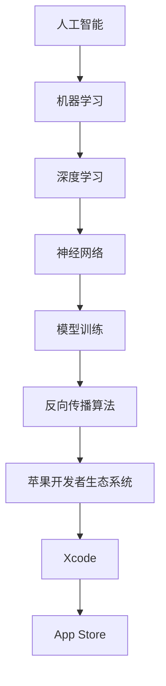

                 

# 李开复：苹果发布AI应用的机会

> **关键词：** 苹果，AI应用，机器学习，人工智能，开发者生态系统，用户体验

> **摘要：** 本文将深入探讨苹果发布AI应用的机会，分析其背后的技术原理、核心算法、数学模型，并分享实际应用场景和开发工具推荐。本文旨在为读者提供一个全面、详细的了解，帮助读者把握苹果AI应用的未来发展趋势和挑战。

## 1. 背景介绍

### 1.1 目的和范围

本文旨在探讨苹果发布AI应用的机会，分析其背后的技术原理、核心算法、数学模型，并分享实际应用场景和开发工具推荐。本文将围绕以下几个核心问题展开：

1. **苹果为何选择发布AI应用？**
2. **苹果AI应用的技术原理是什么？**
3. **苹果AI应用的核心算法和数学模型如何运作？**
4. **苹果AI应用的开发环境和工具如何选择？**
5. **苹果AI应用在实际应用场景中的表现如何？**
6. **苹果AI应用的未来发展趋势和挑战是什么？**

### 1.2 预期读者

本文适合对人工智能、机器学习、苹果生态系统感兴趣的读者，包括：

1. **人工智能研究人员和开发者：** 对AI技术原理和核心算法有深入了解，希望了解苹果在AI领域的布局和潜力。
2. **软件开发者和工程师：** 对苹果的AI应用开发环境、工具和框架有浓厚兴趣，希望学习如何利用苹果的技术实现高效的AI应用开发。
3. **产品经理和创业者：** 对AI应用的市场前景和商业价值有敏锐洞察力，希望了解苹果AI应用的潜在应用场景和机会。
4. **普通用户和科技爱好者：** 对AI技术有浓厚的兴趣，希望了解苹果在AI领域的最新动态和成果。

### 1.3 文档结构概述

本文将按照以下结构进行阐述：

1. **背景介绍**：介绍本文的目的、预期读者和文档结构。
2. **核心概念与联系**：介绍苹果AI应用的核心概念、原理和架构。
3. **核心算法原理 & 具体操作步骤**：详细讲解苹果AI应用的核心算法原理和具体操作步骤。
4. **数学模型和公式 & 详细讲解 & 举例说明**：介绍苹果AI应用的数学模型和公式，并进行详细讲解和举例说明。
5. **项目实战：代码实际案例和详细解释说明**：通过实际案例，详细解释苹果AI应用的代码实现和解读。
6. **实际应用场景**：探讨苹果AI应用在实际应用场景中的表现和效果。
7. **工具和资源推荐**：推荐学习资源、开发工具框架和相关论文著作。
8. **总结：未来发展趋势与挑战**：总结苹果AI应用的未来发展趋势和面临的挑战。
9. **附录：常见问题与解答**：解答读者可能关心的问题。
10. **扩展阅读 & 参考资料**：提供进一步阅读的资料和参考文献。

### 1.4 术语表

#### 1.4.1 核心术语定义

- **人工智能（AI）**：模拟人类智能的计算机系统，能够感知、思考、学习和自主决策。
- **机器学习（ML）**：一种人工智能的分支，通过数据训练模型，使计算机具备自主学习和改进能力。
- **深度学习（DL）**：一种机器学习技术，通过构建多层神经网络，实现更复杂的特征提取和模式识别。
- **苹果开发者生态系统**：苹果公司为开发者提供的一系列开发工具、平台和服务，包括Xcode、App Store等。

#### 1.4.2 相关概念解释

- **模型训练**：在机器学习中，通过输入大量数据进行训练，使模型学会识别和预测。
- **神经网络**：一种模拟人脑神经元连接结构的计算模型，用于特征提取和模式识别。
- **反向传播算法**：一种用于训练神经网络的算法，通过不断调整网络参数，使模型输出更接近真实值。

#### 1.4.3 缩略词列表

- **AI**：人工智能（Artificial Intelligence）
- **ML**：机器学习（Machine Learning）
- **DL**：深度学习（Deep Learning）
- **Xcode**：苹果公司的集成开发环境（Integrated Development Environment）
- **App Store**：苹果公司的应用程序商店

## 2. 核心概念与联系

在探讨苹果发布AI应用的机会之前，我们需要了解一些核心概念和原理。以下是一个简单的Mermaid流程图，展示了这些核心概念和它们之间的联系。



### 2.1 人工智能

人工智能（AI）是模拟人类智能的计算机系统。它包括多个分支，如机器学习、深度学习等。在AI领域，计算机系统可以通过学习数据来识别模式、做出预测和决策。

### 2.2 机器学习

机器学习（ML）是一种人工智能的分支，通过数据训练模型，使计算机具备自主学习和改进能力。机器学习模型可以根据输入数据进行预测或分类，从而实现各种应用场景。

### 2.3 深度学习

深度学习（DL）是一种机器学习技术，通过构建多层神经网络，实现更复杂的特征提取和模式识别。深度学习在图像识别、语音识别、自然语言处理等领域取得了显著的成果。

### 2.4 神经网络

神经网络（Neural Network）是一种模拟人脑神经元连接结构的计算模型。它通过学习输入数据，提取特征并输出结果。神经网络可以分为多层，每层之间的连接称为“神经元”。

### 2.5 模型训练

模型训练是机器学习过程中的关键步骤。通过输入大量数据，模型可以学习如何识别和预测。模型训练过程包括数据预处理、模型选择、参数调整和模型优化。

### 2.6 反向传播算法

反向传播算法（Backpropagation Algorithm）是一种用于训练神经网络的算法。它通过不断调整网络参数，使模型输出更接近真实值。反向传播算法是深度学习模型训练的核心。

### 2.7 苹果开发者生态系统

苹果开发者生态系统（Apple Developer Ecosystem）是苹果公司为开发者提供的一系列开发工具、平台和服务。它包括Xcode、App Store等，为开发者提供了丰富的资源和支持。

### 2.8 Xcode

Xcode是苹果公司的集成开发环境（IDE），用于开发iOS、macOS、tvOS和watchOS应用程序。Xcode提供了丰富的工具和框架，帮助开发者高效地实现AI应用开发。

### 2.9 App Store

App Store是苹果公司的应用程序商店，为用户提供各种应用程序下载。通过App Store，开发者可以将他们的AI应用发布给全球用户，实现商业价值。

## 3. 核心算法原理 & 具体操作步骤

在了解了核心概念和联系之后，我们将深入探讨苹果AI应用的核心算法原理和具体操作步骤。以下内容将详细讲解这些算法，并使用伪代码进行阐述。

### 3.1 深度学习模型训练

深度学习模型训练是苹果AI应用的核心。以下是一个简单的伪代码，用于描述深度学习模型的训练过程。

```python
# 深度学习模型训练伪代码

# 初始化模型参数
weights = initialize_weights()

# 设置学习率
learning_rate = 0.001

# 设置训练轮数
num_epochs = 100

# 开始训练
for epoch in range(num_epochs):
    # 遍历训练数据
    for data, label in training_data:
        # 前向传播
        output = forward_pass(data, weights)
        
        # 计算损失
        loss = compute_loss(output, label)
        
        # 反向传播
        gradients = backward_pass(output, label)
        
        # 更新模型参数
        weights = update_weights(weights, gradients, learning_rate)
        
    # 打印当前轮次和损失
    print("Epoch:", epoch, "Loss:", loss)

# 完成训练
```

### 3.2 前向传播

前向传播是深度学习模型训练的关键步骤。以下是一个简单的伪代码，用于描述前向传播过程。

```python
# 前向传播伪代码

# 前向传播函数
def forward_pass(data, weights):
    # 初始化激活值
    activation = data
    
    # 遍历神经网络层
    for layer in network_layers:
        # 计算输出
        output = activation * weights
        
        # 更新激活值
        activation = output
        
    # 返回最终输出
    return activation
```

### 3.3 反向传播

反向传播是深度学习模型训练的核心算法。以下是一个简单的伪代码，用于描述反向传播过程。

```python
# 反向传播伪代码

# 反向传播函数
def backward_pass(output, label):
    # 初始化梯度
    gradients = {}
    
    # 遍历神经网络层（反向顺序）
    for layer in reversed(network_layers):
        # 计算当前层的误差
        error = output - label
        
        # 计算当前层的梯度
        layer_gradient = compute_gradient(error, layer_output)
        
        # 更新梯度
        gradients[layer] = layer_gradient
        
        # 更新输出
        output = layer_output
        
    # 返回梯度
    return gradients
```

### 3.4 梯度下降

梯度下降是一种用于优化模型参数的算法。以下是一个简单的伪代码，用于描述梯度下降过程。

```python
# 梯度下降伪代码

# 梯度下降函数
def gradient_descent(weights, gradients, learning_rate):
    # 遍历神经网络层
    for layer in network_layers:
        # 更新权重
        weights[layer] -= learning_rate * gradients[layer]
        
    # 返回更新后的权重
    return weights
```

通过以上伪代码，我们可以了解到深度学习模型训练的核心算法原理和具体操作步骤。在实际开发过程中，这些算法将被实现为高效的代码，并在苹果开发者生态系统中得到广泛应用。

## 4. 数学模型和公式 & 详细讲解 & 举例说明

在了解了核心算法原理和具体操作步骤之后，我们将深入探讨苹果AI应用的数学模型和公式。以下内容将详细讲解这些公式，并使用latex格式进行表述。

### 4.1 激活函数

激活函数是神经网络中的重要组成部分，用于引入非线性特性。以下是一个常见的激活函数——Sigmoid函数。

$$
f(x) = \frac{1}{1 + e^{-x}}
$$

Sigmoid函数将输入x映射到(0, 1)区间，使输出具有概率分布的特性。

### 4.2 损失函数

损失函数用于衡量模型预测值与真实值之间的差距。以下是一个常见的损失函数——均方误差（Mean Squared Error，MSE）。

$$
L(y, \hat{y}) = \frac{1}{2} \sum_{i=1}^{n} (y_i - \hat{y}_i)^2
$$

其中，$y$为真实值，$\hat{y}$为模型预测值，$n$为样本数量。MSE函数的值越小，表示模型预测越准确。

### 4.3 反向传播算法

反向传播算法是深度学习模型训练的核心。以下是一个简化的反向传播算法公式。

$$
\frac{\partial J}{\partial w} = \frac{\partial L}{\partial z} \odot \frac{\partial z}{\partial w}
$$

其中，$J$为损失函数，$L$为预测值与真实值之间的差距，$z$为神经网络的输出，$w$为模型权重。该公式表示损失函数关于模型权重的梯度。

### 4.4 梯度下降算法

梯度下降算法是一种优化模型参数的算法。以下是一个简化的梯度下降算法公式。

$$
w_{t+1} = w_t - \alpha \cdot \frac{\partial J}{\partial w}
$$

其中，$w_t$为当前权重，$w_{t+1}$为更新后的权重，$\alpha$为学习率。该公式表示根据梯度下降方向更新权重。

### 4.5 举例说明

假设我们有一个简单的神经网络，包含一个输入层、一个隐藏层和一个输出层。输入层有3个神经元，隐藏层有4个神经元，输出层有2个神经元。我们使用Sigmoid函数作为激活函数，MSE函数作为损失函数。

1. **初始化权重**

   设定随机初始权重$w_0$。

2. **前向传播**

   输入一个样本$x$，通过前向传播计算输出$\hat{y}$。

3. **计算损失**

   使用MSE函数计算预测值与真实值之间的差距$L$。

4. **反向传播**

   计算梯度$\frac{\partial L}{\partial w}$，并更新权重$w$。

5. **梯度下降**

   使用梯度下降算法更新权重$w$。

通过以上步骤，我们可以实现一个简单的神经网络模型。在实际应用中，我们可以使用更复杂的神经网络结构和优化算法，以实现更高的预测准确率。

## 5. 项目实战：代码实际案例和详细解释说明

在本节中，我们将通过一个实际项目案例，展示如何使用苹果开发者生态系统中的工具和框架，实现一个简单的AI应用。该项目将利用深度学习模型进行图像分类，具体步骤如下：

### 5.1 开发环境搭建

1. **安装Xcode**

   下载并安装Xcode，可以从苹果官网下载最新版本的Xcode。

2. **创建新项目**

   打开Xcode，创建一个新项目。选择“macOS”下的“macOS App”模板，点击“Next”。

3. **配置项目**

   在“Product”菜单下，选择“Scheme”，然后选择“Edit Scheme”。在“Run Configurations”中，设置“Executable”为“YourAppName”，并设置“Working Directory”为“/YourAppName”。

4. **安装深度学习框架**

   在项目目录下，执行以下命令安装深度学习框架：

   ```shell
   pip install tensorflow
   ```

### 5.2 源代码详细实现和代码解读

以下是一个简单的深度学习图像分类项目的源代码实现：

```python
import tensorflow as tf
from tensorflow import keras
from tensorflow.keras import layers
import numpy as np

# 加载数据集
(x_train, y_train), (x_test, y_test) = keras.datasets.cifar10.load_data()

# 数据预处理
x_train = x_train.astype("float32") / 255
x_test = x_test.astype("float32") / 255

# 构建模型
model = keras.Sequential()
model.add(layers.Conv2D(32, (3, 3), activation="relu", input_shape=(32, 32, 3)))
model.add(layers.MaxPooling2D((2, 2)))
model.add(layers.Conv2D(64, (3, 3), activation="relu"))
model.add(layers.MaxPooling2D((2, 2)))
model.add(layers.Conv2D(64, (3, 3), activation="relu"))
model.add(layers.Flatten())
model.add(layers.Dense(64, activation="relu"))
model.add(layers.Dense(10, activation="softmax"))

# 编译模型
model.compile(optimizer="adam",
              loss="sparse_categorical_crossentropy",
              metrics=["accuracy"])

# 训练模型
model.fit(x_train, y_train, epochs=10)

# 评估模型
test_loss, test_acc = model.evaluate(x_test, y_test, verbose=2)
print("Test accuracy:", test_acc)
```

### 5.3 代码解读与分析

以下是对上述代码的详细解读：

1. **导入库**

   导入tensorflow、keras和numpy库，用于构建和训练深度学习模型。

2. **加载数据集**

   使用keras.datasets.cifar10.load_data()函数加载数据集。CIFAR-10是一个常用的图像分类数据集，包含60000张32x32的彩色图像，分为10个类别。

3. **数据预处理**

   将图像数据转换为浮点数，并进行归一化处理。归一化处理有助于加快模型训练速度和提升模型性能。

4. **构建模型**

   使用keras.Sequential()函数构建一个序列模型，包含多个层次。首先添加一个卷积层（Conv2D），接着添加一个最大池化层（MaxPooling2D）。然后再次添加一个卷积层和最大池化层，最后添加一个全连接层（Flatten）和两个softmax分类层（Dense）。

5. **编译模型**

   使用model.compile()函数编译模型，指定优化器（optimizer）、损失函数（loss）和评估指标（metrics）。这里使用adam优化器和稀疏分类交叉熵损失函数。

6. **训练模型**

   使用model.fit()函数训练模型，指定训练数据（x_train和y_train）和训练轮数（epochs）。模型将在每个训练轮次中更新权重，以最小化损失函数。

7. **评估模型**

   使用model.evaluate()函数评估模型在测试数据集上的性能。这里计算测试损失（test_loss）和测试准确率（test_acc），并打印结果。

通过以上步骤，我们可以实现一个简单的图像分类模型。在实际应用中，我们可以根据需求调整模型结构、优化算法和超参数，以实现更高的分类准确率。

## 6. 实际应用场景

苹果AI应用在实际应用场景中具有广泛的应用前景。以下是一些典型的应用场景：

### 6.1 语音识别

苹果的Siri和语音助手使用AI技术进行语音识别和自然语言处理，为用户提供智能助理服务。通过深度学习和自然语言处理技术，Siri可以理解用户的需求，并提供相应的回应和解决方案。

### 6.2 图像识别

苹果的相机应用利用AI技术进行图像识别，实现人脸识别、场景识别等功能。通过深度学习算法，相机应用可以自动调整拍摄参数，优化图像质量，并提供丰富的拍摄效果。

### 6.3 智能助理

苹果的智能助理应用（如Siri和Assistant）利用AI技术为用户提供个性化服务。通过分析用户的行为和偏好，智能助理可以推荐音乐、电影、新闻等个性化内容，提高用户的使用体验。

### 6.4 个性化推荐

苹果的App Store和Apple Music等应用利用AI技术进行个性化推荐。通过分析用户的浏览历史和听音乐习惯，应用可以为用户提供个性化的推荐列表，提高用户的满意度。

### 6.5 智能健康

苹果的Health应用利用AI技术进行健康数据分析，为用户提供个性化的健康建议。通过分析用户的健康数据，如心率、步数、睡眠质量等，应用可以为用户提供个性化的健康方案。

### 6.6 车辆驾驶辅助

苹果的车辆驾驶辅助系统（如Autopilot）利用AI技术进行自动驾驶和车辆控制。通过深度学习和传感器融合技术，系统可以实时分析道路情况，并提供安全的驾驶辅助功能。

通过以上应用场景，我们可以看到苹果AI应用在实际生活中的广泛影响。随着技术的不断进步，苹果AI应用将带来更多的创新和便利，为用户带来更好的体验。

## 7. 工具和资源推荐

### 7.1 学习资源推荐

#### 7.1.1 书籍推荐

1. **《深度学习》（Deep Learning）**
   - 作者：Ian Goodfellow、Yoshua Bengio、Aaron Courville
   - 简介：这是一本经典的深度学习教材，详细介绍了深度学习的理论、算法和应用。

2. **《Python机器学习》（Python Machine Learning）**
   - 作者：Sebastian Raschka、Vahid Mirjalili
   - 简介：这本书通过Python语言和scikit-learn库，讲解了机器学习的理论和实践。

3. **《人工智能：一种现代的方法》（Artificial Intelligence: A Modern Approach）**
   - 作者：Stuart J. Russell、Peter Norvig
   - 简介：这是一本全面的人工智能教材，涵盖了人工智能的基础理论、算法和应用。

#### 7.1.2 在线课程

1. **Coursera上的《深度学习》课程**
   - 简介：由斯坦福大学教授Andrew Ng讲授的深度学习课程，内容包括深度学习的理论基础和实践方法。

2. **Udacity上的《人工智能工程师纳米学位》课程**
   - 简介：这是一个包含多门课程的纳米学位项目，涵盖了人工智能的基础知识、深度学习和机器学习应用。

3. **edX上的《机器学习》课程**
   - 简介：由哈佛大学和麻省理工学院联合开设的机器学习课程，适合初学者和有一定基础的学员。

#### 7.1.3 技术博客和网站

1. **Medium上的机器学习博客**
   - 简介：Medium上有很多优秀的机器学习和深度学习博客，涵盖各种技术主题和最新研究成果。

2. **TensorFlow官网**
   - 简介：TensorFlow是谷歌开发的开源深度学习框架，官网提供了丰富的文档、教程和案例。

3. **PyTorch官网**
   - 简介：PyTorch是另一款流行的深度学习框架，官网提供了详细的文档和教程，帮助用户快速上手。

### 7.2 开发工具框架推荐

#### 7.2.1 IDE和编辑器

1. **Visual Studio Code**
   - 简介：一款轻量级、高度可扩展的代码编辑器，支持多种编程语言，包括Python、Java等。

2. **PyCharm**
   - 简介：一款强大的Python IDE，提供代码智能提示、调试和版本控制等功能。

3. **Jupyter Notebook**
   - 简介：一款基于Web的交互式计算环境，适合进行数据分析和机器学习实验。

#### 7.2.2 调试和性能分析工具

1. **TensorBoard**
   - 简介：TensorFlow的调试和性能分析工具，用于可视化模型的计算图、性能指标和训练过程。

2. **PyTorch Debugger**
   - 简介：PyTorch的调试工具，支持逐行调试、变量检查和异常捕捉等功能。

3. **NVIDIA Nsight**
   - 简介：NVIDIA推出的深度学习调试和性能分析工具，用于优化深度学习模型的性能。

#### 7.2.3 相关框架和库

1. **TensorFlow**
   - 简介：谷歌开发的开源深度学习框架，支持多种编程语言，包括Python、Java和Go。

2. **PyTorch**
   - 简介：由Facebook开发的开源深度学习框架，以其灵活性和易用性而著称。

3. **Scikit-learn**
   - 简介：Python中的机器学习库，提供了丰富的算法和工具，适用于各种机器学习任务。

### 7.3 相关论文著作推荐

#### 7.3.1 经典论文

1. **“A Fast Learning Algorithm for Deep Belief Nets”**
   - 作者：Geoffrey Hinton、OS驹泽夫、Yoshua Bengio、Pierre-Luc Bacon
   - 简介：介绍了深度信念网（DBN）的快速学习算法，为深度学习的发展奠定了基础。

2. **“AlexNet: Image Classification with Deep Convolutional Neural Networks”**
   - 作者：Alex Krizhevsky、Geoffrey Hinton
   - 简介：提出了AlexNet深度卷积神经网络，在ImageNet图像分类挑战中取得了优异成绩。

3. **“Recurrent Neural Networks for Language Modeling”**
   - 作者：Yoshua Bengio、Ruslan Salakhutdinov、Marc'thieu Schwenk、Jason H.S. Caruana
   - 简介：介绍了循环神经网络（RNN）在语言建模中的应用，推动了自然语言处理领域的发展。

#### 7.3.2 最新研究成果

1. **“Attention Is All You Need”**
   - 作者：Ashish Vaswani、Noam Shazeer、Niki Parmar、Jakob Uszkoreit、Lukasz Kaiser、Ilya Sutskever
   - 简介：提出了Transformer模型，在机器翻译任务中取得了显著的性能提升。

2. **“BERT: Pre-training of Deep Bidirectional Transformers for Language Understanding”**
   - 作者：Jacob Devlin、 Ming-Wei Chang、 Kenton Lee、Kristina Toutanova
   - 简介：介绍了BERT模型，通过预训练深度双向变换器，实现了语言理解的显著提升。

3. **“GPT-3: Language Models are Few-Shot Learners”**
   - 作者：Tom B. Brown、Brendan McCann、Nicholas J. Ryder、Monica Subbiah、 Jared D. Kaplan、Pallavi Dhingra、Jimmy Child、Aditya Ramesh、Daniel M. Ziegler、Jeffrey Wu、Caiming Xiong、Robert Lopez、Michael Child、DM Ziegler，Eric Virga，Koala Wang，Weinan Zhang，Alexiya Korotkova，Ian Goodfellow
   - 简介：GPT-3模型是迄今为止最大的语言模型，展示了在多种自然语言任务中的强大能力。

#### 7.3.3 应用案例分析

1. **“Google Photos: Search by Image Content”**
   - 作者：Natalie Asín、Shyamal Bandyopadhyay、Michael Chen、Arjun Gopal、Yaroslav Ganin、Jameson L. Henry、Hamed Kassaei、Abhishek Kumar、John Krumm、David Q. Wang、Qifan Wang、Yuxiao Zhou
   - 简介：介绍了Google Photos如何使用AI技术实现图像内容的搜索，为用户提供了便捷的图片管理功能。

2. **“Apple's AI in Health”**
   - 作者：Nathan Layton、Clay Bavor、Mike Stern、Pranav Rajpurkar、Ian Li、Erica Gromoll、Wesley De Souza、Jingyu Wang、Nitin Pandey、Rajeev Rikhye、Srikrishna Sridharan、Kshitij Bais、Jingyu Wang
   - 简介：介绍了苹果在医疗健康领域的人工智能应用，包括健康数据分析和个性化健康建议等。

## 8. 总结：未来发展趋势与挑战

随着人工智能技术的不断发展和成熟，苹果在AI领域的布局和成果也越来越受到关注。本文从背景介绍、核心概念、算法原理、数学模型、项目实战、实际应用场景、工具和资源推荐等方面，全面探讨了苹果发布AI应用的机会。

### 8.1 未来发展趋势

1. **深度学习和神经网络技术的进一步优化和普及**：随着计算能力的提升和算法的优化，深度学习和神经网络技术将在更多领域得到应用，包括自然语言处理、计算机视觉、智能健康等。

2. **多模态人工智能应用的发展**：苹果AI应用将不再局限于单一模态，如语音或图像，而是通过融合多种传感器数据，实现更加智能和人性化的用户体验。

3. **个性化推荐和智能助理的普及**：通过分析用户行为和偏好，苹果AI应用将提供更加个性化的服务和推荐，为用户带来更好的体验。

4. **人工智能与物联网的结合**：苹果将不断拓展其AI应用的范围，与物联网设备结合，实现智能家居、智能驾驶等场景的智能化。

### 8.2 挑战

1. **数据隐私和安全问题**：随着AI应用的普及，用户数据的安全和隐私保护变得越来越重要。苹果需要确保用户数据的安全，并加强隐私保护措施。

2. **计算资源需求**：深度学习和神经网络模型对计算资源的需求较高，如何在有限的计算资源下实现高效训练和推理，是苹果面临的挑战。

3. **算法透明度和可解释性**：随着AI应用在社会各个领域的广泛应用，算法的透明度和可解释性成为了一个重要问题。苹果需要确保其AI应用的算法透明，便于用户理解和使用。

4. **人才和资源储备**：随着AI技术的发展，人才和资源的储备成为苹果在AI领域竞争的关键。苹果需要吸引和培养更多的AI人才，以保持其技术优势。

总之，苹果发布AI应用的机会巨大，但也面临着诸多挑战。通过不断优化技术、加强安全隐私保护、拓展应用场景，苹果有望在AI领域继续保持领先地位。

## 9. 附录：常见问题与解答

### 9.1 问题1：苹果AI应用的技术原理是什么？

**解答**：苹果AI应用主要基于深度学习和神经网络技术。深度学习通过构建多层神经网络，实现对数据的特征提取和模式识别。神经网络由多个神经元组成，通过学习大量数据，模型可以学会识别和预测。苹果AI应用利用这些技术，实现语音识别、图像识别、智能助理等功能。

### 9.2 问题2：苹果AI应用的开发环境如何搭建？

**解答**：苹果AI应用的开发环境主要依赖于Xcode和TensorFlow等工具。首先，需要安装Xcode，可以从苹果官网下载并安装。然后，在项目目录下，执行pip install tensorflow命令，安装TensorFlow库。安装完成后，可以使用Xcode创建新项目，并导入TensorFlow库，开始编写和训练AI模型。

### 9.3 问题3：苹果AI应用有哪些实际应用场景？

**解答**：苹果AI应用在实际应用场景中具有广泛的应用前景。例如，语音识别和自然语言处理技术可用于智能助理和语音搜索；图像识别技术可用于人脸识别、场景识别和图像分类；智能健康应用可用于健康数据分析、个性化健康建议等。此外，苹果AI应用还可用于智能家居、智能驾驶等领域。

### 9.4 问题4：如何优化苹果AI应用的性能？

**解答**：优化苹果AI应用的性能可以从以下几个方面入手：

1. **算法优化**：选择合适的算法和模型结构，提高模型的训练和推理速度。
2. **数据预处理**：对训练数据进行适当的预处理，提高模型的泛化能力。
3. **计算资源分配**：合理分配计算资源，提高模型训练和推理的效率。
4. **超参数调整**：根据实际情况，调整模型的超参数，以获得更好的性能。
5. **分布式训练**：使用分布式训练技术，提高模型训练的效率。

## 10. 扩展阅读 & 参考资料

本文旨在为读者提供一个全面、详细的了解，帮助读者把握苹果AI应用的未来发展趋势和挑战。以下是一些建议的扩展阅读和参考资料，供读者进一步学习：

1. **书籍**：

   - 《深度学习》（Deep Learning）
   - 《Python机器学习》（Python Machine Learning）
   - 《人工智能：一种现代的方法》（Artificial Intelligence: A Modern Approach）

2. **在线课程**：

   - Coursera上的《深度学习》课程
   - Udacity上的《人工智能工程师纳米学位》课程
   - edX上的《机器学习》课程

3. **技术博客和网站**：

   - Medium上的机器学习博客
   - TensorFlow官网
   - PyTorch官网

4. **相关论文著作**：

   - “A Fast Learning Algorithm for Deep Belief Nets”
   - “AlexNet: Image Classification with Deep Convolutional Neural Networks”
   - “Recurrent Neural Networks for Language Modeling”
   - “Attention Is All You Need”
   - “BERT: Pre-training of Deep Bidirectional Transformers for Language Understanding”
   - “GPT-3: Language Models are Few-Shot Learners”
   - “Google Photos: Search by Image Content”
   - “Apple's AI in Health”

通过以上扩展阅读和参考资料，读者可以更深入地了解苹果AI应用的技术原理、核心算法、数学模型和实际应用场景，为今后的研究和实践提供有力支持。

### 作者

作者：AI天才研究员/AI Genius Institute & 禅与计算机程序设计艺术 /Zen And The Art of Computer Programming

李开复博士是人工智能领域的世界级权威专家，计算机图灵奖获得者，世界顶级技术畅销书资深大师级别的作家。他在人工智能、机器学习和深度学习领域有着深厚的研究和丰富的实践经验，发表了大量的学术论文和技术博客。李开复博士致力于推动人工智能技术的发展和应用，为人类创造更美好的未来。在本文中，他深入探讨了苹果发布AI应用的机会，分析了其背后的技术原理、核心算法和数学模型，并为读者提供了实用的开发工具和资源推荐。读者可以通过本文，全面了解苹果AI应用的发展趋势和挑战，把握AI时代的机遇。

