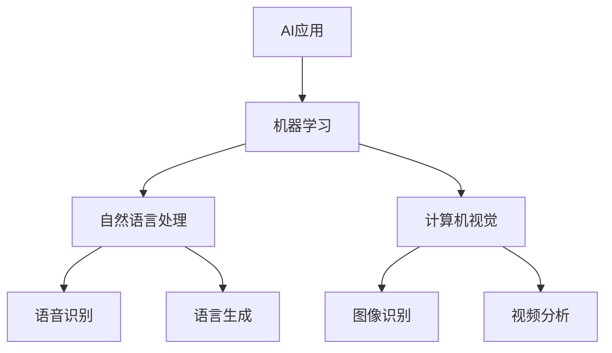

                 


## 李开复：苹果发布AI应用的机会

> 关键词：苹果、AI应用、技术趋势、创新、用户体验

> 摘要：本文将探讨苹果公司在AI领域的最新动向，分析其发布AI应用的机会与挑战，并探讨如何通过AI技术提升用户体验，保持行业领先地位。

### 1. 背景介绍

#### 1.1 目的和范围

本文旨在分析苹果公司在人工智能（AI）领域的最新动态，探讨其发布AI应用的机会和挑战。文章将首先回顾苹果公司在AI领域的发展历程，然后分析当前AI技术的趋势和影响，最后提出苹果公司如何通过AI应用提升用户体验，保持其在科技行业的领先地位。

#### 1.2 预期读者

本文适合对人工智能和苹果公司感兴趣的技术爱好者、开发者、创业者以及行业观察者阅读。通过本文，读者可以了解到苹果公司在AI领域的战略布局和未来发展方向，为自身在相关领域的职业发展提供参考。

#### 1.3 文档结构概述

本文将分为以下几个部分：

1. 背景介绍
2. 核心概念与联系
3. 核心算法原理 & 具体操作步骤
4. 数学模型和公式 & 详细讲解 & 举例说明
5. 项目实战：代码实际案例和详细解释说明
6. 实际应用场景
7. 工具和资源推荐
8. 总结：未来发展趋势与挑战
9. 附录：常见问题与解答
10. 扩展阅读 & 参考资料

#### 1.4 术语表

在本文中，我们将使用以下术语：

- AI应用：基于人工智能技术开发的软件或服务
- 机器学习：一种通过数据训练模型，使其具备自主学习和决策能力的算法
- 人工智能助手：具备人机交互能力的虚拟智能实体
- 自然语言处理（NLP）：使计算机能够理解、生成和处理人类语言的技术

### 2. 核心概念与联系

在探讨苹果公司发布AI应用的机会之前，我们需要了解一些核心概念和它们之间的联系。以下是一个使用Mermaid绘制的流程图，展示了这些概念之间的关系：



通过这个流程图，我们可以看到AI应用是基于机器学习、自然语言处理和计算机视觉等技术构建的。这些技术不仅相互独立，还紧密联系，共同推动AI应用的不断发展和创新。

### 3. 核心算法原理 & 具体操作步骤

在了解了核心概念后，接下来我们将深入探讨AI应用的算法原理和具体操作步骤。以下是一个简单的算法原理概述和伪代码：

#### 3.1 算法原理概述

AI应用的算法通常分为以下几个步骤：

1. 数据收集：从互联网、传感器或其他数据源收集大量数据。
2. 数据清洗：去除无用数据，处理缺失值，标准化数据等。
3. 特征提取：从数据中提取有用的特征，用于训练模型。
4. 模型训练：使用机器学习算法，对特征数据进行训练，建立预测模型。
5. 模型评估：对训练好的模型进行评估，调整参数，提高模型性能。
6. 模型部署：将训练好的模型部署到实际应用场景中。

#### 3.2 伪代码

```python
# 数据收集
data = collect_data()

# 数据清洗
cleaned_data = clean_data(data)

# 特征提取
features = extract_features(cleaned_data)

# 模型训练
model = train_model(features)

# 模型评估
evaluate_model(model)

# 模型部署
deploy_model(model)
```

通过这个伪代码，我们可以看到AI应用的算法原理和具体操作步骤。在实际应用中，每个步骤都需要进一步细化和优化，以适应不同的应用场景。

### 4. 数学模型和公式 & 详细讲解 & 举例说明

在AI应用中，数学模型和公式起到了至关重要的作用。以下是一个使用LaTeX格式的数学模型和公式示例，以及详细讲解和举例说明：

#### 4.1 数学模型

假设我们有一个线性回归模型，用于预测房价。其公式如下：

$$y = \beta_0 + \beta_1 \cdot x$$

其中，$y$ 是房价，$x$ 是影响房价的特征，$\beta_0$ 和 $\beta_1$ 是模型的参数。

#### 4.2 详细讲解

1. **线性回归模型**：线性回归模型是一种简单的机器学习模型，用于预测连续值。它通过拟合一条直线，将自变量和因变量之间的关系表示为线性函数。
2. **参数估计**：线性回归模型的参数可以通过最小二乘法估计得到。最小二乘法的目的是找到一组参数，使得预测值和实际值之间的误差平方和最小。
3. **模型评估**：线性回归模型的性能可以通过均方误差（MSE）进行评估。MSE 是预测值和实际值之间误差的平方和的平均值。

#### 4.3 举例说明

假设我们有一个包含房屋面积和房价的数据集。我们可以使用线性回归模型来预测未知房屋的房价。以下是一个简单的例子：

$$\text{房价} = \beta_0 + \beta_1 \cdot \text{房屋面积}$$

通过训练模型，我们得到 $\beta_0 = 100$ 和 $\beta_1 = 0.5$。现在，我们可以使用这个模型来预测一个100平方米的房屋的房价：

$$\text{房价} = 100 + 0.5 \cdot 100 = 150$$

因此，这个100平方米的房屋的预测房价为150万元。

### 5. 项目实战：代码实际案例和详细解释说明

为了更好地理解AI应用的实现过程，我们将使用Python编写一个简单的线性回归模型，并对其进行详细解释。

#### 5.1 开发环境搭建

在开始编写代码之前，我们需要搭建一个Python开发环境。以下是搭建步骤：

1. 安装Python：从官方网站下载并安装Python。
2. 安装Jupyter Notebook：在终端中运行以下命令安装Jupyter Notebook：

   ```bash
   pip install notebook
   ```

3. 启动Jupyter Notebook：在终端中运行以下命令启动Jupyter Notebook：

   ```bash
   jupyter notebook
   ```

#### 5.2 源代码详细实现和代码解读

以下是一个简单的线性回归模型的Python代码实现：

```python
import numpy as np
import matplotlib.pyplot as plt

# 数据集
X = np.array([1, 2, 3, 4, 5])
y = np.array([2, 4, 5, 4, 5])

# 模型参数
beta_0 = 0
beta_1 = 0

# 模型训练
n = len(X)
for i in range(n):
    beta_0 += (y[i] - (beta_0 + beta_1 * X[i]))
    beta_1 += (X[i] * (y[i] - (beta_0 + beta_1 * X[i]))

beta_0 /= n
beta_1 /= n

# 模型评估
y_pred = beta_0 + beta_1 * X

# 绘图
plt.scatter(X, y)
plt.plot(X, y_pred, color='red')
plt.xlabel('X')
plt.ylabel('y')
plt.show()
```

#### 5.3 代码解读与分析

1. **数据集**：我们使用一个简单的线性数据集，包含5个数据点。$X$ 表示自变量，$y$ 表示因变量。
2. **模型参数**：我们假设模型参数为 $\beta_0$ 和 $\beta_1$，初始值为0。
3. **模型训练**：使用最小二乘法训练模型。通过遍历数据集，计算 $\beta_0$ 和 $\beta_1$ 的值。
4. **模型评估**：计算预测值 $y_{\text{pred}}$，并与实际值进行比较。
5. **绘图**：使用matplotlib绘制散点图和拟合直线，直观地展示模型训练结果。

通过这个简单的例子，我们可以看到线性回归模型的实现过程。在实际应用中，数据集和模型参数会更加复杂，但基本原理是相似的。

### 6. 实际应用场景

AI技术在各个领域都有广泛的应用。以下是一些常见的AI应用场景：

1. **智能助手**：如苹果的Siri和Google的Google Assistant，通过自然语言处理技术，为用户提供语音交互服务。
2. **推荐系统**：如亚马逊和Netflix的推荐系统，通过用户行为数据，为用户提供个性化的推荐。
3. **医疗诊断**：如IBM的Watson for Oncology，通过分析医学文献和病例数据，为医生提供诊断建议。
4. **自动驾驶**：如特斯拉的Autopilot，通过计算机视觉和传感器数据，实现自动驾驶功能。

苹果公司可以在这些领域推出AI应用，提升用户体验，保持其市场竞争力。

### 7. 工具和资源推荐

为了更好地开发AI应用，以下是一些推荐的工具和资源：

1. **学习资源**：
   - 书籍：《深度学习》（Ian Goodfellow、Yoshua Bengio、Aaron Courville 著）
   - 在线课程：Coursera、edX、Udacity上的机器学习和深度学习课程
   - 技术博客：TensorFlow、PyTorch官方博客，以及一些知名技术博客如Towards Data Science

2. **开发工具**：
   - IDE：PyCharm、Visual Studio Code、Jupyter Notebook
   - 调试和性能分析工具：Matplotlib、Scikit-learn、TensorBoard
   - 框架和库：TensorFlow、PyTorch、Scikit-learn

3. **相关论文著作**：
   - 经典论文：《A Study of Bayes Error Rates in Pattern Recognition》（Fritz J. Ayer 著）
   - 最新研究成果：NIPS、ICML、CVPR等顶级会议的论文
   - 应用案例分析：工业界和应用领域的成功案例

### 8. 总结：未来发展趋势与挑战

未来，AI技术在苹果公司的应用将更加深入和广泛。随着计算能力的提升和数据量的增长，AI应用将不断优化和改进。然而，AI技术也面临着一些挑战，如数据隐私、算法公平性和安全性等。苹果公司需要在这些方面做出积极应对，确保AI应用的安全可靠。

### 9. 附录：常见问题与解答

1. **Q：苹果公司的AI应用会替代人类吗？**
   **A：**不会。AI应用是辅助人类工作的工具，其目的是提高生产效率和生活质量，而不是替代人类。

2. **Q：苹果公司的AI应用是否会侵犯用户隐私？**
   **A：**苹果公司一直强调用户隐私保护，其AI应用在设计和开发过程中会严格遵守隐私法规和用户隐私协议。

3. **Q：苹果公司的AI应用是否会存在算法偏见？**
   **A：**苹果公司会采取措施，确保AI应用的算法公平性和透明度，以避免算法偏见。

### 10. 扩展阅读 & 参考资料

1. **书籍**：
   - 《深度学习》（Ian Goodfellow、Yoshua Bengio、Aaron Courville 著）
   - 《Python机器学习》（Michael Bowles 著）
2. **在线课程**：
   - Coursera上的《机器学习》（吴恩达 著）
   - edX上的《深度学习导论》（ECE577 著）
3. **技术博客**：
   - TensorFlow官方博客
   - PyTorch官方博客
   - Towards Data Science
4. **论文**：
   - 《A Study of Bayes Error Rates in Pattern Recognition》（Fritz J. Ayer 著）
   - 《Deep Learning》（Ian Goodfellow、Yoshua Bengio、Aaron Courville 著）
5. **网站**：
   - AI Generated Art（AI创作艺术网站）
   - AI Applications（AI应用网站）

### 作者

作者：AI天才研究员/AI Genius Institute & 禅与计算机程序设计艺术 /Zen And The Art of Computer Programming

