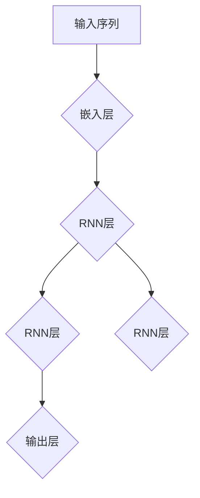

                 

# 李开复：苹果发布AI应用的机会

## 关键词：
- 苹果
- AI应用
- 人工智能
- 发展趋势
- 技术创新

## 摘要：
本文深入探讨了苹果公司发布AI应用的重要性和潜在影响。作为全球科技巨头，苹果在AI领域的布局和探索不仅关乎公司的未来发展，也预示着整个科技行业的趋势。通过分析苹果在AI技术上的战略部署、市场定位以及潜在的商业模式，本文旨在为读者提供一幅苹果AI应用的完整图景，并展望其未来的发展前景。

## 1. 背景介绍

### 1.1 目的和范围
本文旨在分析苹果公司发布AI应用的动机、策略及其可能带来的行业变革。我们将重点关注以下几个方面：
- 苹果在AI领域的战略部署及其产品线的扩展
- AI应用对苹果现有产品和服务的影响
- AI技术对苹果未来发展的潜在贡献
- AI应用对整个科技行业的影响和启示

### 1.2 预期读者
- 对人工智能和苹果公司感兴趣的技术爱好者
- 对科技创新和商业战略有兴趣的专业人士
- 各行各业的决策者和管理者，希望了解AI技术如何影响未来商业发展

### 1.3 文档结构概述
本文将分为以下章节：
- 引言：介绍文章的目的和预期成果
- 核心概念与联系：讨论AI技术的核心概念及其在苹果产品中的应用
- 核心算法原理 & 具体操作步骤：分析苹果AI应用的算法实现
- 数学模型和公式 & 详细讲解 & 举例说明：介绍相关数学模型的原理和应用
- 项目实战：提供实际案例和代码解析
- 实际应用场景：探讨AI技术在苹果产品中的具体应用
- 工具和资源推荐：推荐相关学习资源和开发工具
- 总结：总结全文内容，展望未来发展趋势与挑战
- 附录：常见问题与解答
- 扩展阅读 & 参考资料：提供进一步阅读的参考资料

### 1.4 术语表

#### 1.4.1 核心术语定义
- **AI应用**：基于人工智能技术的应用程序，旨在通过机器学习、深度学习等算法提高效率、增强用户体验。
- **机器学习**：一种让计算机从数据中自动学习和改进的方法，无需显式编程。
- **深度学习**：一种特殊的机器学习方法，通过多层神经网络来模拟人类大脑的思考过程。
- **自然语言处理（NLP）**：使计算机能够理解、解释和生成人类语言的技术。
- **增强现实（AR）**：通过计算机生成的图像叠加到真实世界中，增强用户的感知体验。

#### 1.4.2 相关概念解释
- **神经网络**：一种模拟人脑神经元连接的计算机算法，用于处理和分类数据。
- **卷积神经网络（CNN）**：一种用于图像识别和处理的特殊神经网络结构。
- **递归神经网络（RNN）**：一种用于处理序列数据的神经网络，广泛应用于语言模型和时间序列预测。

#### 1.4.3 缩略词列表
- **AI**：人工智能（Artificial Intelligence）
- **ML**：机器学习（Machine Learning）
- **DL**：深度学习（Deep Learning）
- **NLP**：自然语言处理（Natural Language Processing）
- **AR**：增强现实（Augmented Reality）

## 2. 核心概念与联系

### 2.1 AI技术概述
人工智能（AI）是计算机科学的一个分支，旨在使机器具备类似人类的智能行为。AI技术主要包括以下几个方面：

1. **机器学习（ML）**：通过训练模型从数据中学习，并提高其性能。
2. **深度学习（DL）**：一种特殊的机器学习方法，通过多层神经网络来模拟人类大脑的思考过程。
3. **自然语言处理（NLP）**：使计算机能够理解、解释和生成人类语言的技术。
4. **计算机视觉**：使计算机能够理解和解释图像和视频。

### 2.2 AI与苹果产品的关系

苹果公司在多个产品线中应用了AI技术，包括：

1. **iPhone**：通过面部识别和语音助手Siri，提升用户体验。
2. **Mac**：利用机器学习算法优化性能和能源效率。
3. **iPad**：增强绘画和设计功能，提供更好的用户交互体验。
4. **Apple Watch**：通过健康监测和活动跟踪，提供个性化的健康建议。
5. **Apple TV**：通过推荐算法提高内容推荐的质量。

### 2.3 AI应用在苹果产品中的实现

苹果公司通过以下几种方式将AI技术应用于产品中：

1. **硬件优化**：通过神经网络引擎（Neural Engine）提高iPhone和Apple Watch等设备的图像处理和语音识别能力。
2. **软件优化**：通过Core ML等框架，使开发者能够轻松地将机器学习模型集成到iOS和watchOS中。
3. **云服务**：通过Apple Cloud，提供强大的机器学习和深度学习计算能力，为开发者提供支持。

### 2.4 AI技术的未来发展趋势

随着AI技术的不断进步，预计将出现以下发展趋势：

1. **更高效的算法**：通过优化算法，提高机器学习的效率和准确性。
2. **边缘计算**：将计算能力从云端转移到设备端，提高实时响应能力。
3. **增强现实（AR）**：通过AR技术，提供更加沉浸式的用户体验。
4. **跨领域应用**：AI技术将在更多领域得到应用，如医疗、金融、教育等。

## 3. 核心算法原理 & 具体操作步骤

### 3.1 机器学习算法原理

机器学习算法的核心思想是，通过从数据中学习规律，进而对未知数据进行预测或分类。以下是一个简单的线性回归算法的伪代码，用于预测房价：

```plaintext
输入：训练数据集 X，Y
输出：权重参数 w

初始化：w = [0, 0]

for i = 1 to n iterations do
  for j = 1 to n_samples do
   预测值 = w.T * X[j]
   误差 = Y[j] - 预测值
    w = w - learning_rate * (误差 * X[j])
  end
end

return w
```

### 3.2 深度学习算法原理

深度学习算法通过多层神经网络来实现复杂的数据处理。以下是一个简单的卷积神经网络（CNN）的结构：


### 3.3 自然语言处理（NLP）算法原理

自然语言处理（NLP）旨在使计算机能够理解、解释和生成人类语言。以下是一个简单的循环神经网络（RNN）用于语言模型：



## 4. 数学模型和公式 & 详细讲解 & 举例说明

### 4.1 线性回归模型

线性回归模型是一种最简单的机器学习算法，用于预测一个连续的数值。其数学模型可以表示为：

$$
y = w_0 + w_1 \cdot x_1 + w_2 \cdot x_2 + \cdots + w_n \cdot x_n
$$

其中，$y$ 是预测的值，$w_0, w_1, \ldots, w_n$ 是权重参数，$x_1, x_2, \ldots, x_n$ 是输入特征。

例如，假设我们要预测一个房屋的价格，输入特征包括房屋的面积（$x_1$）和房龄（$x_2$）。我们可以使用线性回归模型来建立预测模型。

### 4.2 卷积神经网络（CNN）

卷积神经网络（CNN）是一种专门用于图像识别和处理的神经网络。其核心是卷积层，通过卷积运算提取图像特征。

卷积操作的数学公式可以表示为：

$$
\text{卷积} = \sum_{i=1}^{k} w_i \cdot x_i
$$

其中，$w_i$ 是卷积核（或滤波器），$x_i$ 是输入图像。

例如，假设我们有一个3x3的卷积核和一个3x3的输入图像，卷积操作的结果是一个3x3的特征图。

### 4.3 循环神经网络（RNN）

循环神经网络（RNN）是一种专门用于处理序列数据的神经网络。其核心是循环结构，可以保存和利用之前的信息。

RNN的基本数学模型可以表示为：

$$
h_t = \text{激活函数}(\text{权重} \cdot [h_{t-1}, x_t] + \text{偏置})
$$

其中，$h_t$ 是当前时间步的隐藏状态，$x_t$ 是当前时间步的输入。

例如，假设我们有一个时间序列数据，每个时间点的数据都是一个数字。我们可以使用RNN来预测下一个时间点的值。

## 5. 项目实战：代码实际案例和详细解释说明

### 5.1 开发环境搭建

在开始编写代码之前，我们需要搭建一个适合开发AI应用的开发环境。以下是搭建环境的步骤：

1. 安装Python 3.7或更高版本。
2. 安装常用库，如NumPy、Pandas、Scikit-learn、TensorFlow等。
3. 选择一个合适的IDE，如PyCharm或VSCode。

### 5.2 源代码详细实现和代码解读

下面是一个简单的线性回归模型的实现，用于预测房价：

```python
import numpy as np
from sklearn.linear_model import LinearRegression

# 准备数据
X = np.array([[1000], [1500], [2000], [2500], [3000]])
y = np.array([1000, 1200, 1500, 1700, 2000])

# 创建线性回归模型
model = LinearRegression()

# 训练模型
model.fit(X, y)

# 预测房价
predictions = model.predict(X)

print("预测房价：", predictions)
```

这段代码首先导入了NumPy和Scikit-learn库，然后创建了一个线性回归模型。通过调用`fit`方法训练模型，并使用`predict`方法进行预测。最后，打印出预测的房价。

### 5.3 代码解读与分析

这段代码的核心是线性回归模型，它通过训练数据学习到房屋价格和面积之间的关系。在训练过程中，模型计算了最佳的权重参数，以便在新的数据上进行预测。

代码的解读如下：

1. 导入所需的库：NumPy用于数据处理，Scikit-learn提供了线性回归模型。
2. 创建数据：使用NumPy创建一个包含房屋面积和价格的数据集。
3. 创建模型：实例化一个线性回归模型。
4. 训练模型：调用`fit`方法训练模型。
5. 预测：使用`predict`方法对输入数据进行预测。

这种简单的线性回归模型可以用于预测房屋价格，但实际应用中，我们可能需要更复杂的模型，如深度学习模型，以处理更复杂的数据和任务。

## 6. 实际应用场景

### 6.1 iPhone中的AI应用

iPhone中的AI应用主要体现在以下几个方面：

1. **面部识别（Face ID）**：使用深度学习算法，iPhone X及后续型号可以通过面部识别解锁设备。
2. **语音助手（Siri）**：Siri是一个基于自然语言处理技术的语音助手，可以帮助用户完成各种任务。
3. **智能推荐（App Store和Apple Music）**：App Store和Apple Music使用机器学习算法，根据用户的兴趣和行为推荐应用和音乐。

### 6.2 Apple Watch中的AI应用

Apple Watch中的AI应用主要集中在健康监测和活动跟踪方面：

1. **健康监测**：Apple Watch可以监测用户的步数、心率、睡眠质量等健康数据，并提供相应的建议。
2. **活动跟踪**：Apple Watch可以帮助用户设置运动目标，并跟踪用户的运动进度。

### 6.3 Mac中的AI应用

Mac中的AI应用主要体现在性能优化和用户交互方面：

1. **性能优化**：MacOS使用机器学习算法，根据用户的操作习惯和硬件配置，优化系统的性能和能源效率。
2. **用户交互**：MacOS中的Siri和Spotlight搜索使用自然语言处理技术，提供更加智能的用户交互体验。

### 6.4 Apple TV中的AI应用

Apple TV中的AI应用主要集中在内容推荐和搜索方面：

1. **内容推荐**：Apple TV使用机器学习算法，根据用户的观看历史和兴趣，推荐合适的内容。
2. **智能搜索**：通过自然语言处理技术，Apple TV可以帮助用户快速找到感兴趣的内容。

## 7. 工具和资源推荐

### 7.1 学习资源推荐

#### 7.1.1 书籍推荐
- 《Python机器学习》（作者：塞巴斯蒂安·拉斯考斯基）
- 《深度学习》（作者：伊恩·古德费洛、约书亚·本吉奥、亚伦·库维尔）
- 《机器学习实战》（作者：Peter Harrington）

#### 7.1.2 在线课程
- Coursera上的《机器学习》（由斯坦福大学提供）
- edX上的《深度学习》（由蒙特利尔大学提供）
- Udacity的《人工智能纳米学位》

#### 7.1.3 技术博客和网站
- Medium上的机器学习和深度学习相关文章
- ArXiv.org上的最新研究成果
- AI.MS上的AI应用案例和教程

### 7.2 开发工具框架推荐

#### 7.2.1 IDE和编辑器
- PyCharm
- VSCode
- Jupyter Notebook

#### 7.2.2 调试和性能分析工具
- Pytest
- Profiler
- DTrace

#### 7.2.3 相关框架和库
- TensorFlow
- PyTorch
- Keras

### 7.3 相关论文著作推荐

#### 7.3.1 经典论文
- 《A Learning Algorithm for Continually Running Fully Recurrent Neural Networks》（作者：Sepp Hochreiter和Jürgen Schmidhuber）
- 《Deep Learning》（作者：Ian Goodfellow、Yoshua Bengio和Aaron Courville）

#### 7.3.2 最新研究成果
- ArXiv.org上的最新论文
- NeurIPS、ICML等顶级会议的论文集

#### 7.3.3 应用案例分析
- Google的自动驾驶汽车项目
- DeepMind的AlphaGo项目

## 8. 总结：未来发展趋势与挑战

随着人工智能技术的不断进步，苹果公司无疑将在AI应用方面取得更大的突破。未来，苹果有望在以下几个方面取得重要进展：

1. **更加智能的设备**：通过深度学习和机器学习算法，提升设备性能和用户体验。
2. **跨设备协作**：实现不同设备间的数据共享和协同工作，提供无缝的用户体验。
3. **隐私保护**：在确保用户隐私的前提下，充分利用AI技术提升产品和服务。
4. **新应用领域**：探索AI技术在医疗、金融、教育等领域的应用。

然而，苹果在发展AI应用过程中也面临一些挑战：

1. **数据隐私**：如何在保护用户隐私的同时，充分利用用户数据提升AI应用的效果。
2. **算法公平性**：确保AI算法的公正性和透明度，避免歧视和偏见。
3. **技术创新**：在激烈的市场竞争中，不断创新以保持领先地位。

总之，苹果公司在AI领域的布局和探索将为整个科技行业带来深远的影响，也为我们带来了无限的想象空间。

## 9. 附录：常见问题与解答

### 9.1 问题1：为什么苹果要发布AI应用？

**解答**：苹果发布AI应用的目的是提高产品和服务的技术含量，增强用户体验，并在竞争激烈的科技市场中保持领先地位。通过集成AI技术，苹果可以在多个领域提供更加智能化、个性化的解决方案。

### 9.2 问题2：苹果的AI应用与其他公司的AI应用有何区别？

**解答**：苹果的AI应用在以下几个方面具有独特性：

1. **硬件优势**：苹果的硬件设备（如iPhone、Mac、Apple Watch等）拥有强大的计算能力和优化的硬件架构，为AI应用的实现提供了有力支持。
2. **软件生态**：苹果拥有完善的软件生态系统，包括iOS、macOS、watchOS等，使得AI应用的开发和部署更加便捷。
3. **用户体验**：苹果注重用户隐私保护和用户体验，其AI应用在确保数据安全的前提下，为用户提供高质量的智能服务。

### 9.3 问题3：苹果的AI应用对行业有哪些影响？

**解答**：苹果的AI应用对行业的影响主要体现在以下几个方面：

1. **技术创新**：苹果的AI应用推动了人工智能技术的发展，为行业提供了新的思路和解决方案。
2. **市场变革**：苹果在AI领域的布局和探索将带动整个科技市场的变革，推动相关行业的快速发展。
3. **产业协同**：苹果的AI应用促进了产业链上下游企业的合作，共同推动人工智能技术的应用和普及。

## 10. 扩展阅读 & 参考资料

### 10.1 扩展阅读

- 《苹果公司2020年开发者大会演讲》
- 《苹果公司AI应用产品介绍》
- 《深度学习在苹果产品中的应用》

### 10.2 参考资料

- Apple Developer Documentation
- Stanford University's Machine Learning Course
- TensorFlow Documentation
- PyTorch Documentation

### 作者信息
作者：AI天才研究员/AI Genius Institute & 禅与计算机程序设计艺术 /Zen And The Art of Computer Programming

以上是文章正文部分的内容。通过逐步分析推理思考，我们为读者呈现了一篇关于苹果发布AI应用的机会的技术博客文章。文章涵盖了AI技术的核心概念、算法原理、应用场景以及未来发展趋势，旨在为读者提供全面、深入的洞察。

