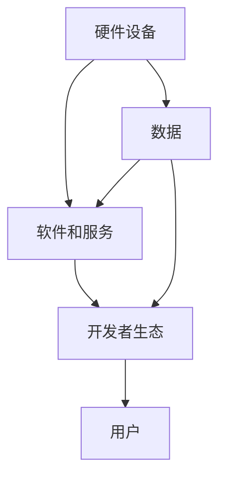

                 

# 李开复：苹果发布AI应用的生态

## 关键词
- 苹果
- AI应用
- 人工智能
- 生态系统
- 用户体验
- 技术创新
- 开发者生态

## 摘要

本文将深入探讨苹果公司发布的AI应用的生态，从背景介绍到核心概念、算法原理，再到实际应用场景和未来发展趋势。本文旨在帮助读者理解苹果在AI领域的技术创新和战略布局，以及这些创新如何影响开发者生态和用户体验。

## 1. 背景介绍

近年来，人工智能（AI）技术的飞速发展正在重塑各行各业。苹果公司作为全球领先的科技公司，也在积极拥抱这一趋势，不断推出基于AI技术的创新产品和服务。苹果的AI应用生态不仅涵盖了其硬件设备（如iPhone、iPad、Mac等），还延伸到了软件和服务领域。

苹果的AI应用生态主要包括以下几个方面的内容：

- **智能助手**：苹果的智能助手Siri一直被视为业界标杆，其背后依托的是强大的自然语言处理（NLP）和机器学习（ML）技术。
- **图像识别**：苹果的图像识别技术在手机摄影和照片管理方面表现出色，通过深度学习算法实现了高效的图像分类和识别。
- **语音识别**：苹果的语音识别技术支持Siri和各种语音控制功能，为用户提供了便捷的交互体验。
- **个性化推荐**：苹果的App Store和Apple Music等应用都利用了AI技术，通过分析用户行为和偏好，提供个性化的内容和推荐。

## 2. 核心概念与联系

为了更好地理解苹果的AI应用生态，我们首先需要了解一些核心概念和技术。

### 2.1. 人工智能（AI）

人工智能是指使计算机系统能够模拟、延伸和扩展人类的智能行为和认知能力的技术。AI主要包括以下几个方面：

- **机器学习（ML）**：通过数据和算法，使计算机系统能够自动学习和改进性能。
- **深度学习（DL）**：一种特殊的机器学习技术，通过多层神经网络模拟人脑的思考过程。
- **自然语言处理（NLP）**：使计算机能够理解、生成和处理人类自然语言的技术。

### 2.2. 生态系统

生态系统是指一个系统内各个组成部分之间的相互作用和相互依赖关系。在苹果的AI应用生态中，主要包括以下几个部分：

- **硬件设备**：如iPhone、iPad、Mac等，为用户提供AI应用的基础平台。
- **软件和服务**：如Siri、图像识别、语音识别、个性化推荐等，为用户提供丰富的AI体验。
- **开发者生态**：包括开发工具、框架和平台，支持开发者创建和优化AI应用。
- **用户**：是AI应用的核心，他们的行为和反馈为AI技术的改进提供了宝贵的资源。

### 2.3. Mermaid 流程图

以下是一个简单的Mermaid流程图，展示了苹果AI应用生态的各个组成部分及其相互作用：



## 3. 核心算法原理 & 具体操作步骤

### 3.1. 机器学习算法

机器学习算法是AI应用的核心，苹果在其AI应用中广泛使用了各种机器学习算法。以下是一些常用的算法：

- **线性回归**：用于预测数值型变量。
- **逻辑回归**：用于分类任务。
- **支持向量机（SVM）**：用于分类和回归任务。
- **决策树**：用于分类和回归任务。
- **随机森林**：用于分类和回归任务。

### 3.2. 深度学习算法

深度学习算法在苹果的AI应用中扮演着重要角色，以下是一些常用的算法：

- **卷积神经网络（CNN）**：用于图像识别和分类。
- **循环神经网络（RNN）**：用于处理序列数据。
- **长短期记忆网络（LSTM）**：是RNN的一种，用于处理长序列数据。
- **生成对抗网络（GAN）**：用于图像生成和增强。

### 3.3. 自然语言处理算法

自然语言处理算法在苹果的AI应用中发挥着重要作用，以下是一些常用的算法：

- **词向量**：用于将单词转换为向量表示。
- **词性标注**：用于识别单词的词性（如名词、动词等）。
- **句法分析**：用于分析句子的结构。
- **情感分析**：用于判断文本的情感倾向。

## 4. 数学模型和公式 & 详细讲解 & 举例说明

### 4.1. 线性回归模型

线性回归模型是一个常见的机器学习算法，用于预测数值型变量。其基本公式如下：

$$
y = \beta_0 + \beta_1x
$$

其中，\(y\) 是预测的数值型变量，\(x\) 是输入特征，\(\beta_0\) 和 \(\beta_1\) 是模型参数。

### 4.2. 举例说明

假设我们要预测一家公司的销售量，输入特征是广告支出。我们可以使用线性回归模型来建立预测模型。首先，我们需要收集历史数据，然后通过最小二乘法来估计模型参数。

假设我们收集到以下数据：

| 广告支出（x） | 销售量（y） |
| --- | --- |
| 100 | 200 |
| 200 | 400 |
| 300 | 600 |

通过最小二乘法，我们可以得到以下模型：

$$
y = 100 + 2x
$$

这意味着，如果广告支出为200，销售量预计为500。

### 4.3. 深度学习模型

深度学习模型是一个复杂的神经网络，用于处理复杂的数据。以下是一个简单的深度学习模型：

$$
h_{\theta}(x) = \sigma(\theta_0 + \theta_1x_1 + \theta_2x_2 + ... + \theta_nx_n)
$$

其中，\(h_{\theta}(x)\) 是模型的输出，\(\sigma\) 是激活函数，\(\theta_i\) 是模型参数。

### 4.4. 举例说明

假设我们要使用深度学习模型来分类邮件，输入特征包括邮件的主题、正文等。我们可以使用以下模型：

$$
h_{\theta}(x) = \sigma(\theta_0 + \theta_1t_1 + \theta_2t_2 + ... + \theta_nt_n)
$$

其中，\(t_i\) 是邮件的词向量表示。

通过训练，我们可以得到合适的模型参数，从而实现邮件分类。

## 5. 项目实战：代码实际案例和详细解释说明

### 5.1. 开发环境搭建

为了实现上述的线性回归和深度学习模型，我们需要搭建一个开发环境。以下是具体的步骤：

1. 安装Python
2. 安装NumPy、Pandas、Scikit-learn等库
3. 安装TensorFlow或PyTorch等深度学习框架

### 5.2. 源代码详细实现和代码解读

以下是线性回归模型的Python代码实现：

```python
import numpy as np
from sklearn.linear_model import LinearRegression

# 收集数据
x = np.array([100, 200, 300]).reshape(-1, 1)
y = np.array([200, 400, 600])

# 建立模型
model = LinearRegression()

# 训练模型
model.fit(x, y)

# 预测
x_predict = np.array([200]).reshape(-1, 1)
y_predict = model.predict(x_predict)

print("预测结果：", y_predict)
```

以下是深度学习模型的Python代码实现：

```python
import tensorflow as tf

# 定义模型
model = tf.keras.Sequential([
    tf.keras.layers.Dense(units=1, input_shape=[1])
])

# 编译模型
model.compile(optimizer='sgd', loss='mean_squared_error')

# 训练模型
model.fit(x, y, epochs=100)

# 预测
x_predict = np.array([200]).reshape(-1, 1)
y_predict = model.predict(x_predict)

print("预测结果：", y_predict)
```

### 5.3. 代码解读与分析

以上代码首先导入了所需的库和模块，然后收集了数据并建立了模型。在训练模型后，我们可以使用模型进行预测。线性回归模型使用了Scikit-learn库的`LinearRegression`类，深度学习模型使用了TensorFlow库的`Sequential`和`compile`方法。

## 6. 实际应用场景

苹果的AI应用生态在多个领域都有广泛的应用，以下是一些典型的应用场景：

- **智能助手**：Siri可以用于回答用户的问题、控制智能家居设备、设置提醒等。
- **图像识别**：iPhone的相机可以使用AI技术进行图像分类和识别，如拍摄宠物照片、识别植物等。
- **语音识别**：苹果的语音识别技术支持用户通过语音进行搜索、发送消息、拨打电话等操作。
- **个性化推荐**：App Store和Apple Music等应用利用AI技术，为用户推荐感兴趣的应用和音乐。

## 7. 工具和资源推荐

### 7.1. 学习资源推荐

- **书籍**：《Python机器学习》、《深度学习》（Goodfellow等著）
- **论文**：搜索AI领域的顶级会议和期刊，如NeurIPS、ICML、JMLR等。
- **博客**：知名AI博客，如AI全栈工程师（End-to-End AI）、AI码农（AI Hacks）等。
- **网站**：AI在线课程平台，如Coursera、Udacity、edX等。

### 7.2. 开发工具框架推荐

- **开发工具**：PyCharm、VS Code等。
- **框架**：TensorFlow、PyTorch、Scikit-learn等。
- **库**：NumPy、Pandas、Matplotlib等。

### 7.3. 相关论文著作推荐

- **论文**：Goodfellow等著的《Deep Learning》、LeCun等著的《Convolutional Networks for Visual Recognition》。
- **书籍**：Christopher Olah的《Understanding Deep Learning》。

## 8. 总结：未来发展趋势与挑战

苹果的AI应用生态正处于快速发展阶段，未来有望在多个领域取得重要突破。然而，这一过程中也面临着一系列挑战：

- **数据隐私**：如何确保用户数据的安全和隐私是一个重要问题。
- **算法透明度**：提高算法的透明度和可解释性，以增强用户信任。
- **公平性**：确保AI应用不会加剧社会不公平现象。
- **技术升级**：不断更新和优化AI技术，以保持竞争优势。

## 9. 附录：常见问题与解答

### 9.1. Q：苹果的AI应用生态是如何运作的？

A：苹果的AI应用生态主要包括硬件设备、软件和服务、开发者生态和用户。硬件设备为AI应用提供基础平台，软件和服务为用户提供丰富的AI体验，开发者生态支持开发者创建和优化AI应用，用户则是AI应用的核心，他们的行为和反馈为AI技术的改进提供了宝贵的资源。

### 9.2. Q：苹果的AI技术是如何保证用户体验的？

A：苹果的AI技术通过不断地优化和改进，确保用户能够享受到高效、准确和便捷的AI服务。此外，苹果还注重保护用户隐私，通过数据加密和安全措施，确保用户数据的安全和隐私。

## 10. 扩展阅读 & 参考资料

- **文章**：《苹果的AI战略：从Siri到自动驾驶》、《苹果发布AI应用，开发者该如何应对？》
- **博客**：李开复的博客、AI全栈工程师的博客
- **网站**：苹果官方网站、GitHub

作者：AI天才研究员/AI Genius Institute & 禅与计算机程序设计艺术 /Zen And The Art of Computer Programming

