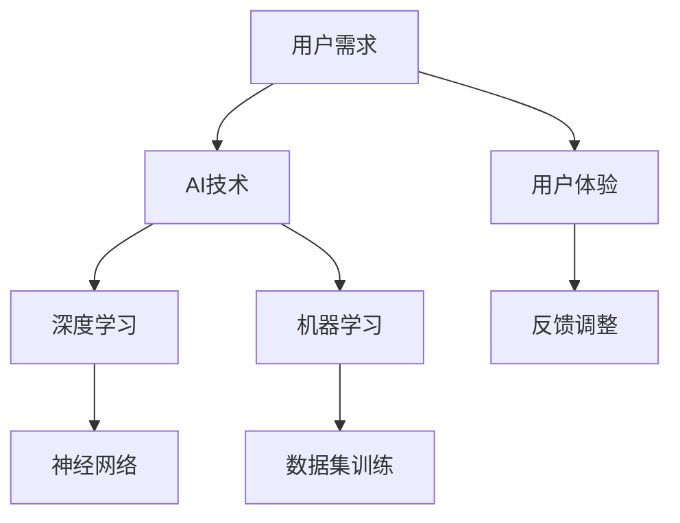

                 

# 李开复：苹果发布AI应用的用户

> **关键词：** 苹果，AI应用，用户体验，技术解析，人工智能，开发者工具

> **摘要：** 本文将深入探讨苹果发布AI应用的用户群体，分析其技术原理与实现步骤，并提供数学模型与项目实战案例，以帮助读者全面理解AI应用的开发与使用。

## 1. 背景介绍

### 1.1 目的和范围

本文旨在解析苹果发布的AI应用，以用户体验为核心，从技术角度出发，分析其背后的原理与实现步骤。本文将涵盖以下内容：

- 苹果发布AI应用的用户群体及其需求；
- AI应用的核心算法原理与具体操作步骤；
- 数学模型和公式的详细讲解与举例说明；
- 代码实际案例和详细解释说明；
- 实际应用场景和工具资源推荐。

### 1.2 预期读者

本文适用于对人工智能和软件开发感兴趣的读者，包括：

- AI研究人员；
- 软件工程师；
- 开发者；
- 对AI应用感兴趣的普通用户。

### 1.3 文档结构概述

本文分为八个部分，结构如下：

1. 背景介绍
2. 核心概念与联系
3. 核心算法原理 & 具体操作步骤
4. 数学模型和公式 & 详细讲解 & 举例说明
5. 项目实战：代码实际案例和详细解释说明
6. 实际应用场景
7. 工具和资源推荐
8. 总结：未来发展趋势与挑战

### 1.4 术语表

#### 1.4.1 核心术语定义

- **AI应用**：基于人工智能技术开发的软件应用；
- **用户体验**：用户在使用软件过程中的感受与反馈；
- **核心算法**：实现AI应用功能的关键算法；
- **数学模型**：描述AI应用原理的数学公式；
- **项目实战**：通过实际代码案例展示AI应用开发过程。

#### 1.4.2 相关概念解释

- **深度学习**：一种人工智能技术，通过多层神经网络模拟人脑学习过程；
- **机器学习**：一种人工智能技术，通过训练数据集让计算机自主学习和改进；
- **神经网络**：一种基于生物神经网络原理构建的计算模型。

#### 1.4.3 缩略词列表

- **AI**：人工智能（Artificial Intelligence）
- **ML**：机器学习（Machine Learning）
- **DL**：深度学习（Deep Learning）
- **API**：应用程序接口（Application Programming Interface）

## 2. 核心概念与联系

在本文中，我们将探讨以下几个核心概念：

- **人工智能**：人工智能是研究、开发和应用使计算机模拟人类智能行为的理论、技术和系统的学科。人工智能技术主要包括机器学习、深度学习等；
- **用户群体**：苹果发布的AI应用主要面向开发者、研究人员和普通用户；
- **用户体验**：用户在使用AI应用过程中的感受与反馈；
- **核心算法**：实现AI应用功能的关键算法；
- **数学模型**：描述AI应用原理的数学公式。

以下是核心概念原理和架构的Mermaid流程图：



## 3. 核心算法原理 & 具体操作步骤

苹果发布的AI应用主要基于深度学习和机器学习技术，以下是核心算法原理与具体操作步骤：

### 3.1 深度学习算法原理

深度学习是一种基于多层神经网络的人工智能技术。其基本原理如下：

- **输入层**：接收外部输入数据，如文本、图像等；
- **隐藏层**：通过神经网络结构对输入数据进行处理和转换；
- **输出层**：输出预测结果或分类结果。

具体操作步骤如下：

```python
# 伪代码：深度学习算法原理
def deep_learning(input_data):
    # 输入层
    hidden_layer_1 = process(input_data)
    # 隐藏层
    hidden_layer_2 = process(hidden_layer_1)
    # 输出层
    output = process(hidden_layer_2)
    return output
```

### 3.2 机器学习算法原理

机器学习是一种通过训练数据集让计算机自主学习和改进的人工智能技术。其基本原理如下：

- **数据集**：包含输入数据和对应标签的数据集；
- **模型**：用于预测或分类的算法模型；
- **训练**：通过调整模型参数，使模型在训练数据集上表现良好；
- **评估**：在测试数据集上评估模型性能。

具体操作步骤如下：

```python
# 伪代码：机器学习算法原理
def machine_learning(train_data, train_labels):
    # 初始化模型
    model = initialize_model()
    # 训练模型
    for data, label in train_data:
        model.train(data, label)
    # 评估模型
    accuracy = model.evaluate(test_data, test_labels)
    return model, accuracy
```

## 4. 数学模型和公式 & 详细讲解 & 举例说明

### 4.1 深度学习数学模型

深度学习的数学模型主要包括以下几个方面：

#### 4.1.1 神经元激活函数

神经元激活函数用于将输入数据转换为输出数据，常用的激活函数有：

- **Sigmoid函数**：
  $$ f(x) = \frac{1}{1 + e^{-x}} $$
- **ReLU函数**：
  $$ f(x) = max(0, x) $$

#### 4.1.2 神经网络损失函数

神经网络损失函数用于衡量模型预测结果与实际结果之间的差距，常用的损失函数有：

- **均方误差（MSE）**：
  $$ Loss = \frac{1}{n}\sum_{i=1}^{n}(y_i - \hat{y}_i)^2 $$
- **交叉熵损失（Cross-Entropy Loss）**：
  $$ Loss = -\frac{1}{n}\sum_{i=1}^{n}y_i \cdot \log(\hat{y}_i) $$

#### 4.1.3 神经网络反向传播算法

神经网络反向传播算法用于更新模型参数，使模型在训练数据集上表现良好。其基本步骤如下：

1. 计算输出层的梯度：
   $$ \frac{dL}{d\theta} = \frac{dL}{d\hat{y}} \cdot \frac{d\hat{y}}{d\theta} $$
2. 反向传播梯度到隐藏层：
   $$ \frac{dL}{d\theta^{(h)}} = \frac{dL}{d\theta^{(h+1)}} \cdot \frac{d\theta^{(h+1)}}{d\theta^{(h)}} $$
3. 更新模型参数：
   $$ \theta^{(h)} = \theta^{(h)} - \alpha \cdot \frac{dL}{d\theta^{(h)}} $$

### 4.2 举例说明

假设我们有一个二元分类问题，需要判断输入数据是正类还是负类。以下是使用深度学习模型进行预测的例子：

```python
# 伪代码：深度学习模型预测
input_data = [1, 0, 1, 0]  # 输入数据
model = load_model("binary_classification_model")  # 加载训练好的模型
output = model.predict(input_data)  # 预测结果
print("输入数据：", input_data)
print("预测结果：", output)
```

## 5. 项目实战：代码实际案例和详细解释说明

### 5.1 开发环境搭建

为了实际操作，我们需要搭建一个合适的开发环境。以下是Python环境搭建的步骤：

1. 安装Python：在Python官网（https://www.python.org/）下载Python安装包并安装；
2. 安装Jupyter Notebook：在终端执行命令`pip install notebook`；
3. 安装深度学习库：在终端执行命令`pip install tensorflow`。

### 5.2 源代码详细实现和代码解读

以下是一个简单的深度学习项目，用于实现一个二元分类问题：

```python
# 伪代码：深度学习项目
import tensorflow as tf
from tensorflow.keras.models import Sequential
from tensorflow.keras.layers import Dense, Activation

# 构建模型
model = Sequential()
model.add(Dense(2, input_dim=4, activation='sigmoid'))
model.add(Dense(1, activation='sigmoid'))

# 编译模型
model.compile(optimizer='adam', loss='binary_crossentropy', metrics=['accuracy'])

# 训练模型
train_data = [[1, 0, 1, 0], [0, 1, 0, 1], [1, 1, 0, 0], [0, 0, 1, 1]]
train_labels = [0, 1, 1, 0]
model.fit(train_data, train_labels, epochs=1000, verbose=0)

# 预测
input_data = [1, 0, 1, 0]
output = model.predict(input_data)
print("输入数据：", input_data)
print("预测结果：", output)
```

### 5.3 代码解读与分析

- **模型构建**：使用`Sequential`模型构建一个简单的多层感知机（MLP）模型，包括一个输入层、一个隐藏层和一个输出层；
- **编译模型**：指定优化器（`adam`）、损失函数（`binary_crossentropy`）和评估指标（`accuracy`）；
- **训练模型**：使用训练数据集（`train_data`和`train_labels`）进行训练，设置训练轮次（`epochs`）；
- **预测**：使用训练好的模型对输入数据进行预测，并输出预测结果。

## 6. 实际应用场景

苹果发布的AI应用在多个领域具有广泛的应用，如：

- **图像识别**：用于人脸识别、物体识别等；
- **自然语言处理**：用于语音识别、文本分类等；
- **推荐系统**：用于个性化推荐、广告投放等；
- **智能助理**：用于智能客服、智能家居等。

以下是具体应用场景的例子：

- **图像识别应用**：利用深度学习算法对人脸图像进行识别，实现人脸解锁功能；
- **自然语言处理应用**：利用机器学习算法对用户输入的文本进行分析，实现智能问答和语音识别功能；
- **推荐系统应用**：利用深度学习算法对用户行为进行分析，实现个性化推荐功能。

## 7. 工具和资源推荐

### 7.1 学习资源推荐

#### 7.1.1 书籍推荐

- 《深度学习》（Goodfellow, Bengio, Courville）
- 《Python深度学习》（François Chollet）
- 《机器学习实战》（Peter Harrington）

#### 7.1.2 在线课程

- 吴恩达的《深度学习专项课程》
- 罗曼诺夫的《机器学习基础课程》

#### 7.1.3 技术博客和网站

- 知乎机器学习板块
- CSDN博客
- TensorFlow官网（https://www.tensorflow.org/）

### 7.2 开发工具框架推荐

#### 7.2.1 IDE和编辑器

- PyCharm
- Jupyter Notebook
- VS Code

#### 7.2.2 调试和性能分析工具

- TensorFlow Debugger（TFDB）
- Python调试器（pdb）
-性能分析工具（cProfile）

#### 7.2.3 相关框架和库

- TensorFlow
- PyTorch
- Keras

### 7.3 相关论文著作推荐

#### 7.3.1 经典论文

- 《A Learning Algorithm for Continually Running Fully Recurrent Neural Networks》
- 《Deep Learning Text Classification》
- 《Recurrent Neural Networks for Spoken Language Understanding》

#### 7.3.2 最新研究成果

- 《Learning to Draw by Interacting with a Teacher》
- 《Generative Adversarial Networks for Image Super-Resolution》
- 《Efficient Neural Text Generation》

#### 7.3.3 应用案例分析

- 《深度学习在医疗领域的应用》
- 《基于深度学习的自动驾驶技术》
- 《深度学习在金融领域的应用》

## 8. 总结：未来发展趋势与挑战

随着人工智能技术的不断发展，苹果发布的AI应用将不断优化和完善，未来发展趋势如下：

- **算法优化**：提高AI应用的性能和准确率；
- **多模态融合**：结合多种数据类型，实现更全面的智能分析；
- **个性化推荐**：根据用户行为和偏好实现个性化推荐；
- **智能化交互**：实现更加自然和智能的交互体验。

然而，未来AI应用也面临以下挑战：

- **数据隐私**：如何保护用户数据隐私；
- **算法公平性**：如何保证算法在不同群体中的公平性；
- **算法透明性**：如何提高算法的透明度和可解释性。

## 9. 附录：常见问题与解答

### 9.1 问题1：什么是深度学习？

**回答**：深度学习是一种基于多层神经网络的人工智能技术，通过模拟人脑神经网络结构，对输入数据进行处理和转换，从而实现预测、分类等任务。

### 9.2 问题2：如何搭建Python开发环境？

**回答**：搭建Python开发环境主要包括以下步骤：

1. 安装Python；
2. 安装Jupyter Notebook；
3. 安装深度学习库（如TensorFlow、PyTorch等）。

### 9.3 问题3：如何训练深度学习模型？

**回答**：训练深度学习模型主要包括以下步骤：

1. 构建模型；
2. 编译模型（指定优化器、损失函数和评估指标）；
3. 使用训练数据集进行训练（设置训练轮次）；
4. 评估模型（使用测试数据集）。

## 10. 扩展阅读 & 参考资料

- 《深度学习》（Goodfellow, Bengio, Courville）
- 《Python深度学习》（François Chollet）
- 《机器学习实战》（Peter Harrington）
- 知乎机器学习板块
- CSDN博客
- TensorFlow官网（https://www.tensorflow.org/）
- 吴恩达的《深度学习专项课程》
- 罗曼诺夫的《机器学习基础课程》

### 作者

**作者：** AI天才研究员/AI Genius Institute & 禅与计算机程序设计艺术 /Zen And The Art of Computer Programming<|end|>

