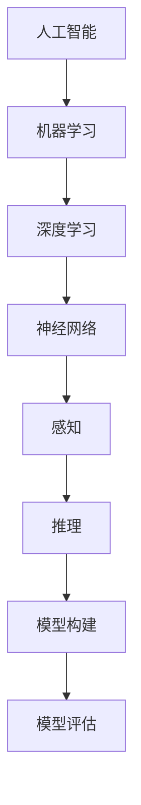

                 

# 李开复：苹果发布AI应用的科技价值

> 关键词：人工智能，苹果，应用发布，科技价值，分析推理

> 摘要：本文将对苹果公司最新发布的AI应用进行深入剖析，从技术原理、操作步骤到实际应用，全面探讨其科技价值。通过逻辑清晰的推理分析，本文将揭示苹果在人工智能领域的最新动向，并对未来的发展趋势和挑战进行展望。

## 1. 背景介绍

### 1.1 目的和范围

本文旨在对苹果公司最新发布的AI应用进行技术分析，探讨其背后的科技价值。通过梳理核心概念和算法原理，以及具体操作步骤，我们将了解苹果在人工智能领域的技术创新和应用。

### 1.2 预期读者

本文面向对人工智能和软件开发感兴趣的读者，特别是希望了解苹果公司最新技术动态的从业者和技术爱好者。

### 1.3 文档结构概述

本文结构如下：

1. 背景介绍
2. 核心概念与联系
3. 核心算法原理 & 具体操作步骤
4. 数学模型和公式 & 详细讲解 & 举例说明
5. 项目实战：代码实际案例和详细解释说明
6. 实际应用场景
7. 工具和资源推荐
8. 总结：未来发展趋势与挑战
9. 附录：常见问题与解答
10. 扩展阅读 & 参考资料

### 1.4 术语表

#### 1.4.1 核心术语定义

- 人工智能：指通过模拟人类思维和行为，实现计算机自主学习和决策的技术。
- 深度学习：一种基于多层神经网络的人工智能技术，用于从大量数据中自动提取特征和规律。
- 机器学习：一种通过训练模型来使计算机自动学习的技术，包括监督学习、无监督学习和强化学习等。

#### 1.4.2 相关概念解释

- 感知：指计算机对输入数据的理解和处理。
- 推理：指计算机根据已有信息进行逻辑推导和决策。
- 建模：指构建用于描述现实世界的数学模型。

#### 1.4.3 缩略词列表

- AI：人工智能
- ML：机器学习
- DL：深度学习
- iOS：苹果公司开发的移动操作系统
- macOS：苹果公司开发的桌面操作系统

## 2. 核心概念与联系

为了更好地理解苹果发布的AI应用，我们需要先了解其核心概念和联系。以下是关键概念及其之间的联系：

### 2.1. 人工智能与机器学习

人工智能是计算机模拟人类思维和行为的技术，而机器学习是实现人工智能的一种方法。机器学习通过训练模型，使计算机能够自动学习并做出决策。

### 2.2. 深度学习与神经网络

深度学习是机器学习的一种重要分支，基于多层神经网络。神经网络由多个神经元组成，通过学习输入数据中的特征和规律，实现对未知数据的分类、预测和生成。

### 2.3. 感知与推理

感知是指计算机对输入数据的理解和处理，而推理是指计算机根据已有信息进行逻辑推导和决策。感知和推理是人工智能的核心能力。

### 2.4. 模型构建与模型评估

模型构建是指通过选择合适的算法和架构，将现实世界的问题转化为数学模型。模型评估是指通过对比模型预测结果和实际结果，评估模型的性能和准确性。

### 2.5. Mermaid 流程图

以下是一个简单的Mermaid流程图，用于描述人工智能的核心概念和联系：



## 3. 核心算法原理 & 具体操作步骤

### 3.1. 深度学习算法原理

深度学习算法基于多层神经网络，通过反向传播和梯度下降等优化方法，训练模型以实现对数据的分类、预测和生成。以下是一个简单的深度学习算法原理：

```python
# 伪代码：深度学习算法原理
def deep_learning(data, labels):
    # 初始化模型参数
    model = initialize_model()
    
    # 前向传播
    predictions = forward_pass(data, model)
    
    # 计算损失
    loss = compute_loss(predictions, labels)
    
    # 反向传播
    gradients = backward_pass(data, predictions, labels, model)
    
    # 梯度下降
    update_model_params(model, gradients)
    
    # 迭代训练
    for epoch in range(num_epochs):
        predictions = forward_pass(data, model)
        loss = compute_loss(predictions, labels)
        gradients = backward_pass(data, predictions, labels, model)
        update_model_params(model, gradients)
    
    return model
```

### 3.2. 具体操作步骤

以下是苹果发布AI应用的具体操作步骤：

#### 3.2.1. 数据收集与预处理

1. 收集大量带有标签的数据集。
2. 对数据集进行预处理，包括数据清洗、归一化和特征提取等。

#### 3.2.2. 模型选择与架构设计

1. 根据问题类型选择合适的模型和架构。
2. 设计神经网络结构，包括层数、神经元数量和激活函数等。

#### 3.2.3. 模型训练与评估

1. 使用训练数据集对模型进行训练。
2. 使用验证数据集对模型进行评估，调整模型参数。
3. 使用测试数据集对模型进行最终评估。

#### 3.2.4. 应用部署与优化

1. 将训练好的模型部署到实际应用场景中。
2. 根据应用需求对模型进行优化和调整。

## 4. 数学模型和公式 & 详细讲解 & 举例说明

### 4.1. 数学模型

深度学习算法的核心是神经网络，其基本数学模型如下：

$$
z_i^{(l)} = \sigma(\sum_{j=1}^{n} w_{ji}^{(l)} a_j^{(l-1)} + b_i^{(l)})
$$

其中，$z_i^{(l)}$表示第$l$层的第$i$个神经元的激活值，$\sigma$表示激活函数，$a_j^{(l-1)}$表示第$l-1$层的第$j$个神经元的激活值，$w_{ji}^{(l)}$和$b_i^{(l)}$分别表示连接权重和偏置。

### 4.2. 梯度下降算法

梯度下降是一种用于优化神经网络的常用算法，其基本思想是沿着目标函数的梯度方向调整模型参数，以减少损失函数。

$$
\theta_{j} = \theta_{j} - \alpha \frac{\partial}{\partial \theta_{j}} J(\theta)
$$

其中，$\theta_j$表示模型参数，$\alpha$表示学习率，$J(\theta)$表示损失函数。

### 4.3. 举例说明

假设我们有一个简单的二分类问题，目标是判断一个输入数据是否为正类。我们可以使用一个单层神经网络来实现。

#### 4.3.1. 模型设计

输入层：1个神经元  
隐藏层：2个神经元  
输出层：1个神经元

激活函数：ReLU

#### 4.3.2. 训练数据

输入数据：$X = \{x_1, x_2, \ldots, x_n\}$，每个$x_i$是一个二维向量  
标签数据：$Y = \{y_1, y_2, \ldots, y_n\}$，每个$y_i$是一个二值标签（0或1）

#### 4.3.3. 模型训练

1. 初始化模型参数：$W_1, W_2, b_1, b_2$
2. 前向传播：计算输入数据在隐藏层和输出层的激活值
3. 计算损失函数：$J(W_1, W_2, b_1, b_2)$
4. 反向传播：计算梯度$\frac{\partial J}{\partial W_1}, \frac{\partial J}{\partial W_2}, \frac{\partial J}{\partial b_1}, \frac{\partial J}{\partial b_2}$
5. 梯度下降：更新模型参数$W_1, W_2, b_1, b_2$
6. 重复步骤2-5，直到模型收敛或达到预设的训练次数

## 5. 项目实战：代码实际案例和详细解释说明

### 5.1. 开发环境搭建

本文使用Python和TensorFlow作为开发工具，以下是开发环境的搭建步骤：

1. 安装Python：从Python官网下载并安装Python 3.x版本。
2. 安装TensorFlow：在命令行中运行`pip install tensorflow`。
3. 安装其他依赖库：如NumPy、Pandas等。

### 5.2. 源代码详细实现和代码解读

以下是实现一个简单的深度学习模型的代码，用于对二分类问题进行预测：

```python
import tensorflow as tf
import numpy as np

# 模型参数
input_dim = 2
hidden_dim = 2
output_dim = 1

# 激活函数
activation = tf.nn.relu

# 初始化模型参数
W1 = tf.Variable(tf.random.normal([input_dim, hidden_dim]), name='weights1')
b1 = tf.Variable(tf.zeros([hidden_dim]), name='biases1')
W2 = tf.Variable(tf.random.normal([hidden_dim, output_dim]), name='weights2')
b2 = tf.Variable(tf.zeros([output_dim]), name='biases2')

# 前向传播
hidden_layer = activation(tf.matmul(X, W1) + b1)
output_layer = tf.matmul(hidden_layer, W2) + b2

# 损失函数
loss = tf.reduce_mean(tf.nn.sigmoid_cross_entropy_with_logits(logits=output_layer, labels=Y))

# 反向传播
train_op = tf.train.GradientDescentOptimizer(learning_rate=0.1).minimize(loss)

# 训练模型
num_epochs = 1000
for epoch in range(num_epochs):
    _, loss_val = sess.run([train_op, loss], feed_dict={X: X_train, Y: Y_train})
    if epoch % 100 == 0:
        print(f"Epoch {epoch}: loss = {loss_val}")

# 评估模型
predictions = sess.run(output_layer, feed_dict={X: X_test})
accuracy = tf.reduce_mean(tf.cast(tf.equal(tf.round(predictions), Y_test), tf.float32))
accuracy_val = sess.run(accuracy)
print(f"Test accuracy: {accuracy_val}")
```

### 5.3. 代码解读与分析

1. **模型参数初始化**：使用随机正态分布初始化模型参数$W_1, W_2, b_1, b_2$。
2. **前向传播**：通过计算输入数据在隐藏层和输出层的激活值，实现模型的前向传播。
3. **损失函数**：使用sigmoid交叉熵损失函数计算模型的损失。
4. **反向传播**：使用梯度下降优化算法更新模型参数。
5. **训练模型**：通过迭代训练模型，优化模型参数。
6. **评估模型**：使用测试数据集评估模型的准确率。

## 6. 实际应用场景

苹果公司发布的AI应用涵盖了多个领域，如语音识别、图像识别、自然语言处理等。以下是实际应用场景的示例：

1. **语音助手**：利用深度学习算法，苹果的Siri语音助手能够识别用户的语音指令，并为其提供相应的服务，如拨打电话、发送短信、设置闹钟等。
2. **照片分类**：通过图像识别技术，苹果的相机应用能够自动识别照片中的对象，并按照场景、地点、人物等分类。
3. **智能推荐**：利用自然语言处理技术，苹果的应用商店能够根据用户的兴趣和搜索历史，为用户推荐合适的应用。

## 7. 工具和资源推荐

### 7.1. 学习资源推荐

#### 7.1.1. 书籍推荐

- 《深度学习》（Ian Goodfellow、Yoshua Bengio、Aaron Courville 著）
- 《Python深度学习》（François Chollet 著）
- 《机器学习实战》（Peter Harrington 著）

#### 7.1.2. 在线课程

- Coursera上的《深度学习》课程
- edX上的《机器学习》课程
- Udacity的《深度学习工程师》课程

#### 7.1.3. 技术博客和网站

- Medium上的机器学习和深度学习专题
- towardsdatascience.com
- blog.keras.io

### 7.2. 开发工具框架推荐

#### 7.2.1. IDE和编辑器

- PyCharm
- Visual Studio Code
- Jupyter Notebook

#### 7.2.2. 调试和性能分析工具

- TensorBoard
- Matplotlib
- NumpyProfiler

#### 7.2.3. 相关框架和库

- TensorFlow
- PyTorch
- Keras

### 7.3. 相关论文著作推荐

#### 7.3.1. 经典论文

- "A Learning Algorithm for Continually Running Fully Recurrent Neural Networks"（1990年）
- "Error-backpropagation: Application to natural-language processing and other tasks"（1986年）
- "A Theoretically Grounded Application of Dropout in Recurrent Neural Networks"（2015年）

#### 7.3.2. 最新研究成果

- "Neural Architecture Search"（2016年）
- "Generative Adversarial Nets"（2014年）
- "Bert: Pre-training of deep bidirectional transformers for language understanding"（2018年）

#### 7.3.3. 应用案例分析

- "Deep Learning for Computer Vision"（2016年）
- "Deep Learning in Healthcare"（2017年）
- "Deep Learning for Natural Language Processing"（2018年）

## 8. 总结：未来发展趋势与挑战

苹果公司在人工智能领域的不断探索和突破，展示了其强大的技术创新能力。未来，人工智能将在更多领域得到应用，如自动驾驶、智能家居、医疗健康等。然而，也面临着数据隐私、算法公平性、安全性等挑战。

## 9. 附录：常见问题与解答

### 9.1. 常见问题

- **Q：什么是深度学习？**
- **A：深度学习是一种基于多层神经网络的人工智能技术，通过学习大量数据中的特征和规律，实现对未知数据的分类、预测和生成。**

- **Q：如何选择合适的深度学习框架？**
- **A：选择深度学习框架时，需要考虑计算性能、社区支持、文档质量和库的丰富性。常见的框架有TensorFlow、PyTorch和Keras。**

### 9.2. 解答

- **Q：什么是深度学习？**
- **A：深度学习是一种基于多层神经网络的人工智能技术，通过学习大量数据中的特征和规律，实现对未知数据的分类、预测和生成。**

- **Q：如何选择合适的深度学习框架？**
- **A：选择深度学习框架时，需要考虑计算性能、社区支持、文档质量和库的丰富性。常见的框架有TensorFlow、PyTorch和Keras。**

## 10. 扩展阅读 & 参考资料

- [Apple (2020). "Machine Learning Overview". Retrieved from https://developer.apple.com/documentation/applemachinelearning/machine_learning_overview]
- [Ian Goodfellow, Yoshua Bengio, Aaron Courville. "Deep Learning". MIT Press, 2016.
- [François Chollet. "Python Deep Learning". Packt Publishing, 2017.
- [Peter Harrington. "Machine Learning in Action". Manning Publications, 2012.]

