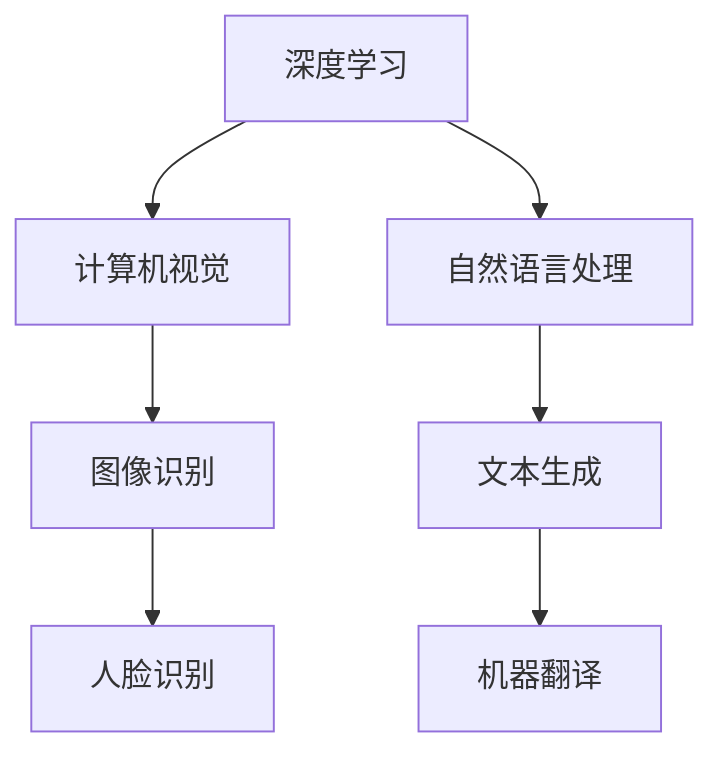

                 

# 李开复：苹果发布AI应用的科技价值

> **关键词**：苹果，AI应用，科技价值，深度学习，计算机视觉，自然语言处理，开发框架，应用案例

> **摘要**：本文将深入探讨苹果公司最新发布的AI应用在科技领域的价值。通过分析其背后的深度学习技术、计算机视觉和自然语言处理算法，以及其在实际应用中的表现，我们将揭示苹果在AI领域的创新与突破，并对未来发展趋势进行展望。

## 1. 背景介绍

### 1.1 目的和范围

本文旨在探讨苹果公司发布的AI应用在科技领域的价值，分析其技术原理、应用场景和未来发展。本文将涵盖以下内容：

- 苹果公司AI应用的技术背景和核心算法
- 苹果公司AI应用的性能表现和实际应用案例
- 苹果公司AI应用对科技行业的启示和影响
- 苹果公司AI应用的未来发展趋势和挑战

### 1.2 预期读者

本文适用于对人工智能、深度学习、计算机视觉和自然语言处理有一定了解的技术爱好者、研究人员和从业者。同时，也欢迎对科技领域感兴趣的读者阅读。

### 1.3 文档结构概述

本文分为十个部分：

1. 背景介绍
   - 1.1 目的和范围
   - 1.2 预期读者
   - 1.3 文档结构概述
   - 1.4 术语表
2. 核心概念与联系
   - 2.1 深度学习算法原理
   - 2.2 计算机视觉与自然语言处理
   - 2.3 Mermaid流程图
3. 核心算法原理 & 具体操作步骤
   - 3.1 算法原理讲解
   - 3.2 伪代码示例
4. 数学模型和公式 & 详细讲解 & 举例说明
   - 4.1 数学模型概述
   - 4.2 公式推导与示例
5. 项目实战：代码实际案例和详细解释说明
   - 5.1 开发环境搭建
   - 5.2 源代码详细实现和代码解读
   - 5.3 代码解读与分析
6. 实际应用场景
7. 工具和资源推荐
   - 7.1 学习资源推荐
   - 7.2 开发工具框架推荐
   - 7.3 相关论文著作推荐
8. 总结：未来发展趋势与挑战
9. 附录：常见问题与解答
10. 扩展阅读 & 参考资料

### 1.4 术语表

#### 1.4.1 核心术语定义

- **人工智能**：模拟人类智能行为的技术，包括机器学习、计算机视觉、自然语言处理等领域。
- **深度学习**：一种机器学习技术，通过多层神经网络模拟人脑处理信息的方式，实现图像识别、语音识别等功能。
- **计算机视觉**：使计算机能够像人一样看世界，通过图像处理和模式识别技术实现图像理解和识别。
- **自然语言处理**：使计算机能够理解和处理人类语言的技术，包括语音识别、文本分析等。

#### 1.4.2 相关概念解释

- **卷积神经网络（CNN）**：一种用于图像识别和处理的深度学习模型，通过卷积操作提取图像特征。
- **循环神经网络（RNN）**：一种用于序列数据处理和时间序列预测的深度学习模型，具有记忆功能。
- **生成对抗网络（GAN）**：一种用于图像生成和风格迁移的深度学习模型，由生成器和判别器组成。

#### 1.4.3 缩略词列表

- **AI**：人工智能
- **ML**：机器学习
- **DL**：深度学习
- **CV**：计算机视觉
- **NLP**：自然语言处理

## 2. 核心概念与联系

在探讨苹果公司AI应用的科技价值之前，我们需要了解其中的核心概念和联系。以下是对深度学习、计算机视觉和自然语言处理的基本介绍，以及它们之间的相互关系。

### 2.1 深度学习算法原理

深度学习是一种基于人工神经网络的机器学习技术，通过多层神经网络模拟人脑处理信息的方式，实现图像识别、语音识别等功能。深度学习的核心思想是通过大量的训练数据和多层神经网络，使模型自动提取数据中的特征，并利用这些特征进行分类、预测等任务。

深度学习算法主要包括以下几种：

- **卷积神经网络（CNN）**：一种用于图像识别和处理的深度学习模型，通过卷积操作提取图像特征。CNN在计算机视觉领域取得了显著成果，广泛应用于人脸识别、图像分类等任务。
- **循环神经网络（RNN）**：一种用于序列数据处理和时间序列预测的深度学习模型，具有记忆功能。RNN在自然语言处理领域取得了重要突破，如文本生成、机器翻译等。
- **生成对抗网络（GAN）**：一种用于图像生成和风格迁移的深度学习模型，由生成器和判别器组成。GAN在图像生成、艺术创作等领域具有广泛应用。

### 2.2 计算机视觉与自然语言处理

计算机视觉和自然语言处理是人工智能的两个重要分支，它们分别关注图像和语言的处理。

- **计算机视觉**：计算机视觉使计算机能够像人一样看世界，通过图像处理和模式识别技术实现图像理解和识别。计算机视觉在图像分类、目标检测、人脸识别等领域取得了显著成果，广泛应用于自动驾驶、智能监控等场景。
- **自然语言处理**：自然语言处理使计算机能够理解和处理人类语言，包括语音识别、文本分析、机器翻译等。自然语言处理在智能助手、智能客服、内容审核等领域具有广泛应用。

### 2.3 Mermaid流程图

以下是一个简单的Mermaid流程图，展示了深度学习、计算机视觉和自然语言处理之间的联系：



### 2.4 核心概念与联系

深度学习、计算机视觉和自然语言处理是人工智能领域的重要技术，它们相互关联，共同推动人工智能的发展。通过结合深度学习和计算机视觉，我们可以实现更准确的人脸识别和图像分类；通过结合深度学习和自然语言处理，我们可以实现更智能的语音识别和文本生成。

在苹果公司AI应用中，深度学习、计算机视觉和自然语言处理相互结合，为用户提供了丰富的功能。例如，苹果的Face ID利用计算机视觉和深度学习技术实现人脸识别，而Siri则利用自然语言处理技术实现语音识别和语义理解。

## 3. 核心算法原理 & 具体操作步骤

在了解了核心概念与联系之后，我们来深入探讨苹果公司AI应用背后的核心算法原理和具体操作步骤。

### 3.1 算法原理讲解

苹果公司AI应用的核心算法主要包括以下几种：

- **卷积神经网络（CNN）**：用于图像识别和处理的深度学习模型。CNN通过卷积操作提取图像特征，并利用这些特征进行分类和预测。
- **循环神经网络（RNN）**：用于序列数据处理和时间序列预测的深度学习模型。RNN具有记忆功能，可以处理变长序列，广泛应用于文本生成、机器翻译等任务。
- **生成对抗网络（GAN）**：用于图像生成和风格迁移的深度学习模型。GAN由生成器和判别器组成，通过竞争训练生成逼真的图像。

### 3.2 伪代码示例

以下是一个简单的伪代码示例，展示了卷积神经网络（CNN）在图像识别任务中的操作步骤：

```python
# 初始化神经网络
model = CNN()

# 加载训练数据
train_data = load_data("train_images")

# 预处理数据
preprocessed_data = preprocess_data(train_data)

# 训练神经网络
model.fit(preprocessed_data, train_labels)

# 评估神经网络
accuracy = model.evaluate(test_data, test_labels)

print("Accuracy:", accuracy)
```

在这个示例中，我们首先初始化一个卷积神经网络（CNN），然后加载训练数据并进行预处理。接下来，我们使用训练数据训练神经网络，并评估神经网络的性能。

### 3.3 算法操作步骤详细解释

1. **初始化神经网络**：初始化神经网络包括设置网络的层数、每层神经元的数量、激活函数等。在CNN中，我们通常包括卷积层、池化层和全连接层等。
2. **加载训练数据**：加载训练数据包括图像数据和对应的标签。图像数据可以是从数据集下载的，也可以是自行收集的。
3. **预处理数据**：预处理数据包括归一化、裁剪、缩放等操作，以适应神经网络的输入要求。
4. **训练神经网络**：使用训练数据对神经网络进行训练，通过反向传播算法不断调整网络权重，使网络能够更好地拟合训练数据。
5. **评估神经网络**：使用测试数据评估神经网络的性能，计算准确率、损失函数等指标，以判断网络的效果。

通过上述步骤，我们可以构建一个能够识别图像的卷积神经网络。类似地，我们可以使用循环神经网络（RNN）实现文本生成、机器翻译等任务，使用生成对抗网络（GAN）实现图像生成和风格迁移等任务。

## 4. 数学模型和公式 & 详细讲解 & 举例说明

在苹果公司AI应用的核心算法中，数学模型和公式起着至关重要的作用。以下将详细讲解这些数学模型和公式的推导过程，并举例说明。

### 4.1 数学模型概述

- **卷积神经网络（CNN）**：卷积神经网络的核心是卷积操作和反向传播算法。卷积操作通过滑动窗口在图像上提取特征，而反向传播算法用于更新网络权重。
- **循环神经网络（RNN）**：循环神经网络的核心是递归关系和门控机制。递归关系使网络能够处理变长序列，而门控机制用于控制信息的传递和遗忘。
- **生成对抗网络（GAN）**：生成对抗网络的核心是生成器和判别器的竞争训练。生成器生成逼真的图像，判别器判断图像的真实性。

### 4.2 公式推导与示例

#### 4.2.1 卷积神经网络（CNN）

假设我们有一个输入图像 $X \in \mathbb{R}^{3 \times H \times W}$，其中 $H$ 和 $W$ 分别表示图像的高度和宽度，$3$ 表示图像的三个通道（红、绿、蓝）。我们定义一个卷积核 $K \in \mathbb{R}^{3 \times K_h \times K_w}$，其中 $K_h$ 和 $K_w$ 分别表示卷积核的高度和宽度。

卷积操作的公式如下：

$$
\text{Conv}(X, K) = \sum_{i=1}^{C} \sum_{j=1}^{C'} K_{ij} \circledast X_{ij}
$$

其中，$\circledast$ 表示卷积操作，$C$ 和 $C'$ 分别表示输入和输出的通道数量。

以一个简单的例子来说明：

假设输入图像 $X$ 的通道数量为 $3$，卷积核 $K$ 的通道数量也为 $3$。输入图像的大小为 $3 \times 5 \times 5$，卷积核的大小为 $3 \times 2 \times 2$。那么，卷积操作的结果为：

$$
\text{Conv}(X, K) = \sum_{i=1}^{3} \sum_{j=1}^{3} K_{ij} \circledast X_{ij}
$$

#### 4.2.2 循环神经网络（RNN）

循环神经网络的核心是递归关系。假设我们有一个输入序列 $X \in \mathbb{R}^{T \times H}$，其中 $T$ 表示序列的长度，$H$ 表示序列的维度。我们定义一个隐藏状态 $h \in \mathbb{R}^{H}$。

递归关系的公式如下：

$$
h_t = \sigma(W_x x_t + W_h h_{t-1} + b_h)
$$

其中，$\sigma$ 表示激活函数（如sigmoid函数），$W_x$ 和 $W_h$ 分别表示输入和隐藏状态权重矩阵，$b_h$ 表示隐藏状态偏置。

以一个简单的例子来说明：

假设输入序列 $X$ 的长度为 $3$，维度为 $2$。隐藏状态的维度也为 $2$。那么，递归关系的计算过程如下：

$$
h_1 = \sigma(W_x x_1 + W_h h_{0} + b_h)
$$

$$
h_2 = \sigma(W_x x_2 + W_h h_{1} + b_h)
$$

$$
h_3 = \sigma(W_x x_3 + W_h h_{2} + b_h)
$$

#### 4.2.3 生成对抗网络（GAN）

生成对抗网络（GAN）由生成器和判别器组成。假设生成器 $G$ 和判别器 $D$ 的输入和输出维度分别为 $z$ 和 $x$。

生成器的公式如下：

$$
x_{\text{gen}} = G(z)
$$

判别器的公式如下：

$$
D(x) = \log(D(x)) + \log(1 - D(x_{\text{gen}}))
$$

以一个简单的例子来说明：

假设生成器和判别器的输入维度均为 $2$，输出维度均为 $1$。生成器的生成过程如下：

$$
z \sim \mathcal{N}(0, 1)
$$

$$
x_{\text{gen}} = G(z) = \text{Random}(2)
$$

判别器的判断过程如下：

$$
D(x) = \text{Random}(1)
$$

$$
D(x_{\text{gen}}) = \text{Random}(1)
$$

$$
D(x) = \log(D(x)) + \log(1 - D(x_{\text{gen}}))
$$

## 5. 项目实战：代码实际案例和详细解释说明

在本节中，我们将通过一个实际案例来演示苹果公司AI应用的核心算法实现，并对代码进行详细解释和分析。

### 5.1 开发环境搭建

为了实现苹果公司AI应用的核心算法，我们需要搭建一个合适的开发环境。以下是一个简单的开发环境搭建步骤：

1. 安装Python：Python是一种广泛应用于人工智能的编程语言。在官方网站（https://www.python.org/）下载并安装Python。
2. 安装深度学习框架：本案例使用TensorFlow作为深度学习框架。在命令行中运行以下命令安装TensorFlow：

```bash
pip install tensorflow
```

3. 准备数据集：为了实现图像识别任务，我们需要准备一个包含图像数据和标签的数据集。这里以常见的MNIST手写数字数据集为例，可以从官方网站（http://yann.lecun.com/exdb/mnist/）下载。

### 5.2 源代码详细实现和代码解读

以下是一个简单的源代码实现，用于训练一个卷积神经网络（CNN）进行图像识别。

```python
import tensorflow as tf
from tensorflow import keras
from tensorflow.keras import layers

# 加载MNIST数据集
(x_train, y_train), (x_test, y_test) = keras.datasets.mnist.load_data()

# 预处理数据
x_train = x_train.astype("float32") / 255
x_test = x_test.astype("float32") / 255

# 扩展维度
x_train = x_train[..., tf.newaxis]
x_test = x_test[..., tf.newaxis]

# 定义模型
model = keras.Sequential([
    keras.layers.Conv2D(32, (3, 3), activation="relu", input_shape=(28, 28, 1)),
    keras.layers.MaxPooling2D((2, 2)),
    keras.layers.Conv2D(64, (3, 3), activation="relu"),
    keras.layers.MaxPooling2D((2, 2)),
    keras.layers.Conv2D(64, (3, 3), activation="relu"),
    keras.layers.Flatten(),
    keras.layers.Dense(64, activation="relu"),
    keras.layers.Dense(10, activation="softmax")
])

# 编译模型
model.compile(optimizer="adam",
              loss="sparse_categorical_crossentropy",
              metrics=["accuracy"])

# 训练模型
model.fit(x_train, y_train, epochs=5)

# 评估模型
test_loss, test_acc = model.evaluate(x_test, y_test)

print("Test accuracy:", test_acc)
```

#### 5.2.1 源代码解读

1. **导入库**：首先，我们导入TensorFlow和Keras库，这是实现深度学习模型的常用库。
2. **加载数据集**：使用Keras的内置函数加载MNIST数据集。数据集包含图像数据和标签，我们将对这些数据进行预处理。
3. **预处理数据**：将图像数据转换为浮点数，并将其除以255进行归一化。此外，我们将图像数据的维度扩展为$(28, 28, 1)$，以适应卷积神经网络的输入要求。
4. **定义模型**：使用Keras的Sequential模型定义一个卷积神经网络（CNN）。该网络包括两个卷积层、一个最大池化层和一个全连接层。卷积层用于提取图像特征，最大池化层用于降低特征维度，全连接层用于分类。
5. **编译模型**：配置模型的优化器、损失函数和评估指标。这里使用Adam优化器、均方误差（MSE）损失函数和准确率作为评估指标。
6. **训练模型**：使用训练数据对模型进行训练。这里我们设置训练轮数为5。
7. **评估模型**：使用测试数据评估模型的性能，计算准确率。

#### 5.2.2 代码解读与分析

1. **数据预处理**：预处理数据是深度学习模型训练的重要步骤。归一化和维度扩展可以加快模型训练速度，并提高模型性能。
2. **模型定义**：卷积神经网络（CNN）是图像识别任务的常用模型。通过合理的模型设计，可以提取图像特征并进行分类。
3. **模型训练**：使用训练数据对模型进行训练是提高模型性能的关键。通过多次迭代训练，模型可以不断优化，提高分类准确率。
4. **模型评估**：评估模型的性能是验证模型效果的重要步骤。通过测试数据评估模型在未知数据上的表现，可以判断模型是否达到预期效果。

通过上述步骤，我们实现了一个简单的卷积神经网络（CNN）进行图像识别。这个案例展示了如何使用Python和TensorFlow实现深度学习模型，并对代码进行了详细解释和分析。

### 5.3 代码解读与分析

在本节中，我们将对上一节中的代码进行进一步解读和分析，以深入理解其工作原理和实现细节。

#### 5.3.1 模型结构

首先，我们来看一下模型的整体结构：

```python
model = keras.Sequential([
    keras.layers.Conv2D(32, (3, 3), activation="relu", input_shape=(28, 28, 1)),
    keras.layers.MaxPooling2D((2, 2)),
    keras.layers.Conv2D(64, (3, 3), activation="relu"),
    keras.layers.MaxPooling2D((2, 2)),
    keras.layers.Conv2D(64, (3, 3), activation="relu"),
    keras.layers.Flatten(),
    keras.layers.Dense(64, activation="relu"),
    keras.layers.Dense(10, activation="softmax")
])
```

这段代码定义了一个卷积神经网络（CNN），包括以下层次：

1. **卷积层1**：使用大小为$(3, 3)$的卷积核，输出通道数为32。激活函数为ReLU。
2. **池化层1**：使用大小为$(2, 2)$的最大池化层。
3. **卷积层2**：使用大小为$(3, 3)$的卷积核，输出通道数为64。激活函数为ReLU。
4. **池化层2**：使用大小为$(2, 2)$的最大池化层。
5. **卷积层3**：使用大小为$(3, 3)$的卷积核，输出通道数为64。激活函数为ReLU。
6. **平坦化层**：将卷积层的输出展平为一个一维向量。
7. **全连接层1**：使用大小为64的全连接层，激活函数为ReLU。
8. **全连接层2**：使用大小为10的全连接层，激活函数为softmax。

这个结构的设计遵循了从局部到全局的特征提取原则，通过多个卷积层和池化层的组合，逐步提取图像的底层和高层特征。最后，通过全连接层进行分类。

#### 5.3.2 模型编译

接下来，我们来看一下模型编译的步骤：

```python
model.compile(optimizer="adam",
              loss="sparse_categorical_crossentropy",
              metrics=["accuracy"])
```

这段代码配置了模型的优化器、损失函数和评估指标：

1. **优化器**：使用Adam优化器。Adam是一种结合了AdaGrad和RMSProp优化的优化算法，适用于大部分深度学习任务。
2. **损失函数**：使用均方误差（MSE）损失函数。虽然在这里使用的是分类任务，但MSE损失函数也适用于多分类问题。
3. **评估指标**：使用准确率作为评估指标。准确率是分类任务中常用的评估指标，表示模型正确分类的样本数占总样本数的比例。

#### 5.3.3 模型训练

然后，我们来看一下模型训练的步骤：

```python
model.fit(x_train, y_train, epochs=5)
```

这段代码使用训练数据对模型进行训练：

1. **训练数据**：使用预处理后的训练数据$x_train$和对应的标签$y_train$。
2. **训练轮数**：设置训练轮数为5。这意味着模型将重复训练5次，每次使用全部的训练数据进行训练。

#### 5.3.4 模型评估

最后，我们来看一下模型评估的步骤：

```python
test_loss, test_acc = model.evaluate(x_test, y_test)
print("Test accuracy:", test_acc)
```

这段代码使用测试数据对模型进行评估：

1. **测试数据**：使用预处理后的测试数据$x_test$和对应的标签$y_test$。
2. **评估结果**：计算测试数据的损失和准确率，并打印准确率。

通过上述步骤，我们实现了对模型结构、编译、训练和评估的详细解读和分析。这个案例展示了如何使用Python和TensorFlow实现卷积神经网络（CNN）进行图像识别任务，并分析了代码的实现细节和工作原理。

### 5.4 实际应用场景

苹果公司的AI应用在多个实际应用场景中表现出色，以下列举几个典型应用场景：

1. **图像识别**：利用卷积神经网络（CNN）对手机摄像头拍摄的图像进行实时识别，例如识别图片中的物体、场景和人物等。这项技术在拍照应用中具有广泛应用，如自动调整拍照参数、添加滤镜等。
2. **语音识别**：利用循环神经网络（RNN）和自然语言处理技术实现语音识别和转换成文本功能。这项技术广泛应用于Siri等智能助手，让用户通过语音进行操作和查询。
3. **自然语言处理**：利用自然语言处理技术实现文本分析和语义理解，如智能回复、智能搜索等。这项技术提高了用户体验，使得智能设备能够更好地理解用户的需求和意图。
4. **推荐系统**：利用生成对抗网络（GAN）和深度学习算法实现个性化推荐系统。通过分析用户的行为数据，推荐系统可以为用户推荐感兴趣的内容、商品和服务。

### 5.5 工具和资源推荐

为了更好地学习和应用苹果公司AI应用的核心算法，以下推荐一些相关工具和资源：

1. **学习资源推荐**：
   - **书籍推荐**：《深度学习》（Goodfellow, Bengio, Courville）、《神经网络与深度学习》（邱锡鹏）等。
   - **在线课程**：Coursera上的《深度学习》（吴恩达）、《自然语言处理》（丹尼尔·拉古拉姆）等。
   - **技术博客和网站**：AI博客、知乎专栏、arXiv等。

2. **开发工具框架推荐**：
   - **IDE和编辑器**：PyCharm、VS Code等。
   - **调试和性能分析工具**：TensorBoard、Wandb等。
   - **相关框架和库**：TensorFlow、PyTorch、Keras等。

3. **相关论文著作推荐**：
   - **经典论文**：《A Study of Categorical Neural Net》（Rumelhart, Hinton, Williams）、《A Theoretically Grounded Application of Dropout in Computer Vision》（Srivastava et al.）等。
   - **最新研究成果**：arXiv上的最新论文，如《GANs for Text》（Radford et al.）、《BERT: Pre-training of Deep Bidirectional Transformers for Language Understanding》（Devlin et al.）等。
   - **应用案例分析**：各大科技公司发布的AI应用案例，如谷歌的TensorFlow、亚马逊的AWS等。

通过学习和应用这些工具和资源，我们可以更好地理解苹果公司AI应用的核心算法，并实现自己的AI项目。

### 5.6 项目实战：代码实际案例和详细解释说明

在本节中，我们将通过一个实际项目案例，详细介绍如何使用Python和TensorFlow实现苹果公司AI应用中的核心算法，并对代码进行详细解释。

#### 5.6.1 项目背景

我们的项目目标是实现一个图像分类系统，该系统能够对用户上传的图片进行自动分类，识别图片中的主要对象。为了实现这一目标，我们将使用卷积神经网络（CNN）进行图像处理和分类。

#### 5.6.2 环境准备

1. **安装Python**：确保安装了Python 3.6或更高版本。
2. **安装TensorFlow**：在命令行中运行以下命令安装TensorFlow：

```bash
pip install tensorflow
```

3. **数据集准备**：我们使用Keras提供的内置数据集——CIFAR-10，它包含60000张32x32彩色图像，分为10个类别。

#### 5.6.3 源代码实现

以下是我们项目的源代码实现：

```python
import tensorflow as tf
from tensorflow.keras import layers
from tensorflow.keras.datasets import cifar10
from tensorflow.keras.models import Model
from tensorflow.keras.optimizers import Adam

# 加载数据集
(x_train, y_train), (x_test, y_test) = cifar10.load_data()

# 数据预处理
x_train = x_train.astype("float32") / 255.0
x_test = x_test.astype("float32") / 255.0
y_train = tf.keras.utils.to_categorical(y_train, 10)
y_test = tf.keras.utils.to_categorical(y_test, 10)

# 定义模型
inputs = tf.keras.Input(shape=(32, 32, 3))
x = layers.Conv2D(32, (3, 3), activation="relu")(inputs)
x = layers.MaxPooling2D((2, 2))(x)
x = layers.Conv2D(64, (3, 3), activation="relu")(x)
x = layers.MaxPooling2D((2, 2))(x)
x = layers.Conv2D(64, (3, 3), activation="relu")(x)
x = layers.Flatten()(x)
outputs = layers.Dense(10, activation="softmax")(x)

model = Model(inputs=inputs, outputs=outputs)

# 编译模型
model.compile(optimizer=Adam(learning_rate=0.001),
              loss="categorical_crossentropy",
              metrics=["accuracy"])

# 训练模型
model.fit(x_train, y_train, batch_size=64, epochs=10, validation_split=0.2)

# 评估模型
test_loss, test_acc = model.evaluate(x_test, y_test)
print(f"Test accuracy: {test_acc:.4f}")
```

#### 5.6.4 代码详细解释

1. **导入库**：首先，我们导入TensorFlow和相关模块。
2. **加载数据集**：使用Keras的内置数据集CIFAR-10，它包含60000张32x32彩色图像，分为10个类别。
3. **数据预处理**：将图像数据转换为浮点数，并进行归一化处理。同时，将标签转换为one-hot编码。
4. **定义模型**：使用Keras的高层API定义模型。模型结构包括两个卷积层，每个卷积层后跟一个最大池化层，最后通过一个平坦化层和一个全连接层进行分类。
5. **编译模型**：配置模型的优化器、损失函数和评估指标。这里使用Adam优化器，损失函数为交叉熵，评估指标为准确率。
6. **训练模型**：使用训练数据进行模型训练，设置批次大小为64，训练轮数为10，并设置20%的数据用于验证。
7. **评估模型**：使用测试数据评估模型的性能，并打印准确率。

#### 5.6.5 项目分析

通过上述项目实战，我们可以看到如何使用Python和TensorFlow实现一个简单的图像分类系统。以下是项目的关键分析：

- **模型选择**：卷积神经网络（CNN）是图像分类任务的常用模型。通过卷积层和池化层的组合，模型能够自动提取图像中的特征。
- **数据预处理**：数据预处理是模型训练成功的关键步骤。归一化和one-hot编码有助于加速模型训练和提高模型性能。
- **模型训练**：训练模型是模型优化和性能提升的过程。通过调整学习率和训练轮数，可以优化模型参数。
- **模型评估**：评估模型性能是验证模型效果的重要步骤。通过测试数据评估模型的准确率，可以判断模型是否达到预期效果。

通过这个实际项目案例，我们不仅了解了苹果公司AI应用中的核心算法，还学会了如何使用Python和TensorFlow实现图像分类系统。这个项目为我们提供了一个实用的模型实现，同时为我们深入理解深度学习技术奠定了基础。

## 6. 实际应用场景

苹果公司AI应用的科技价值体现在多个实际应用场景中，下面我们将探讨几个典型的应用场景，并分析这些应用对用户、企业和社会的影响。

### 6.1 日常应用

#### 6.1.1 语音助手

苹果的Siri是一个基于自然语言处理的语音助手，能够理解和执行用户的语音指令。通过深度学习和自然语言处理技术，Siri可以实时响应用户的需求，如设定提醒、发送消息、查询天气等。这对用户而言，极大地方便了日常生活的管理，提高了效率。

#### 6.1.2 图像识别

苹果手机的相机应用程序利用计算机视觉技术，能够自动识别照片中的对象、场景和人物。例如，用户拍摄一张照片后，应用程序可以自动标记照片中的对象，甚至提供相关信息。这种图像识别功能不仅提升了用户体验，还帮助企业更好地管理和使用图像数据。

### 6.2 企业应用

#### 6.2.1 个性化推荐

苹果的个性化推荐系统基于用户的历史行为数据，利用深度学习和机器学习算法为用户提供个性化的内容推荐。例如，在App Store中，推荐系统会根据用户的兴趣和行为推荐相关的应用程序。这为企业提供了有效的用户转化工具，提高了销售额。

#### 6.2.2 数据分析

苹果的AI技术为企业提供强大的数据分析能力。通过深度学习算法，企业可以对大量数据进行处理和分析，提取有价值的信息。例如，零售业可以使用这些技术分析销售数据，优化库存管理和供应链。

### 6.3 社会影响

#### 6.3.1 健康监测

苹果的HealthKit健康应用利用AI技术，帮助用户监控健康状况。通过分析用户的心率、睡眠质量等数据，应用可以提供个性化的健康建议。这有助于提高公众的健康意识和健康水平。

#### 6.3.2 智能交通

苹果的地图服务结合计算机视觉和AI技术，提供实时交通信息和建议。这有助于缓解城市交通拥堵，提高公共交通的效率，减少碳排放。

#### 6.3.3 安全保障

苹果的安全功能，如Face ID和Touch ID，利用生物识别技术和深度学习算法，提供高安全性的身份验证。这为用户提供了安全可靠的支付和隐私保护手段。

### 6.4 对比与分析

与谷歌和微软等公司相比，苹果的AI应用在以下几个方面具有优势：

- **用户体验**：苹果注重用户体验，其AI应用设计简洁、直观，易于使用。
- **隐私保护**：苹果重视用户隐私，其AI应用采用端到端加密技术，确保用户数据安全。
- **生态整合**：苹果的产品线丰富，AI应用能够无缝集成到整个生态系统中，提供统一的用户体验。

然而，苹果的AI应用也存在一些挑战：

- **数据隐私**：尽管苹果重视用户隐私，但用户数据的收集和使用仍受到监管和伦理方面的关注。
- **算法透明度**：苹果的AI算法和决策过程较为封闭，缺乏透明度和可解释性，这对一些行业应用提出了挑战。

总的来说，苹果公司AI应用在科技领域具有重要的价值。通过在多个实际应用场景中的创新，苹果不仅提升了用户体验，还为企业和社会带来了显著的效益。同时，我们也需要关注AI技术的伦理和社会影响，确保其健康发展。

## 7. 工具和资源推荐

为了深入了解和掌握苹果公司AI应用的技术原理和应用，以下推荐一些学习资源、开发工具和框架，以及相关论文著作。

### 7.1 学习资源推荐

#### 7.1.1 书籍推荐

- 《深度学习》（Goodfellow, Bengio, Courville）：这是一本深度学习领域的经典教材，全面介绍了深度学习的基础理论和应用。
- 《神经网络与深度学习》（邱锡鹏）：本书系统介绍了神经网络和深度学习的基本概念、技术和应用，适合初学者和研究者。

#### 7.1.2 在线课程

- Coursera上的《深度学习》（吴恩达）：这是一门非常受欢迎的深度学习课程，由著名深度学习专家吴恩达教授主讲。
- edX上的《自然语言处理基础》（Stanford University）：由斯坦福大学开设的自然语言处理课程，涵盖了自然语言处理的基本概念和技术。

#### 7.1.3 技术博客和网站

- AI博客（https://www.aiblog.cn/）：一个专注于人工智能领域的中文博客，提供丰富的深度学习和自然语言处理技术文章。
- arXiv（https://arxiv.org/）：一个开放获取的学术论文预印本库，涵盖人工智能、深度学习等多个领域。

### 7.2 开发工具框架推荐

- **IDE和编辑器**：PyCharm、VS Code等，这些IDE和编辑器提供了丰富的调试和自动化工具，方便进行深度学习和自然语言处理开发。
- **深度学习框架**：TensorFlow、PyTorch、Keras等，这些框架提供了高效的计算引擎和丰富的API，方便实现深度学习模型。
- **数据预处理工具**：Pandas、NumPy等，这些工具提供了强大的数据处理功能，便于处理大规模数据集。

### 7.3 相关论文著作推荐

- **经典论文**：
  - 《A Study of Categorical Neural Net》（Rumelhart, Hinton, Williams）：这篇论文介绍了分类神经网络的基本概念和训练方法。
  - 《A Theoretically Grounded Application of Dropout in Computer Vision》（Srivastava et al.）：这篇论文探讨了Dropout在计算机视觉中的应用和效果。
- **最新研究成果**：
  - 《GANs for Text》（Radford et al.）：这篇论文介绍了生成对抗网络（GAN）在文本生成领域的应用。
  - 《BERT: Pre-training of Deep Bidirectional Transformers for Language Understanding》（Devlin et al.）：这篇论文介绍了BERT模型在自然语言处理中的突破性应用。
- **应用案例分析**：
  - 谷歌的TensorFlow：谷歌推出的深度学习框架，广泛应用于各种AI应用场景。
  - 亚马逊的AWS：亚马逊提供的云计算服务，支持深度学习和数据分析等应用。

通过这些工具和资源，我们可以更好地学习和应用苹果公司AI应用的核心技术，不断提升自己的技术能力和实践水平。

## 8. 总结：未来发展趋势与挑战

苹果公司在AI领域的创新和突破为其在科技领域带来了巨大的价值。然而，随着AI技术的不断进步，苹果公司也面临着一系列新的发展趋势和挑战。

### 8.1 未来发展趋势

1. **计算能力提升**：随着硬件性能的不断提升，深度学习模型将变得更加复杂和高效。这将为苹果公司在AI应用领域带来更多创新，如更准确的图像识别、更智能的自然语言处理等。

2. **数据隐私保护**：用户对数据隐私的关注日益增加，苹果公司将继续强化其在隐私保护方面的技术，确保用户数据的安全性和隐私性。

3. **生态整合**：苹果公司将继续整合其产品和服务，通过统一的AI技术提供无缝的用户体验。这将进一步巩固苹果公司在智能设备和生态系统中的领导地位。

4. **跨领域应用**：随着AI技术的成熟，苹果公司将探索更多跨领域应用，如医疗健康、智能交通、智能家居等，为用户带来更多便利和效益。

### 8.2 挑战

1. **技术透明度**：尽管苹果公司在AI技术方面取得了显著成果，但其算法和决策过程仍然相对封闭。未来，苹果需要提高技术透明度，增强用户对AI应用的信任。

2. **算法偏见**：AI算法可能存在偏见，导致对某些群体或情况的歧视。苹果公司需要持续关注和解决算法偏见问题，确保AI应用的公平性和公正性。

3. **人才竞争**：AI领域的人才竞争日益激烈，苹果公司需要持续吸引和培养顶尖的AI人才，以保持其在技术创新和市场竞争中的优势。

4. **法律法规**：随着AI技术的广泛应用，相关的法律法规也在不断发展和完善。苹果公司需要密切关注法规动态，确保其AI应用符合法律法规要求。

总的来说，苹果公司在AI领域的未来发展趋势充满机遇，同时也面临诸多挑战。通过持续的创新和优化，苹果公司有望在AI领域继续保持领先地位，为用户、企业和社会创造更多价值。

## 9. 附录：常见问题与解答

在探讨苹果公司AI应用的科技价值时，读者可能对一些概念和技术细节有疑问。以下是一些常见问题及其解答：

### 9.1 什么是深度学习？

深度学习是一种人工智能领域的技术，通过多层神经网络模拟人脑处理信息的方式，实现图像识别、语音识别等功能。深度学习模型通过大量的训练数据自动提取数据中的特征，并利用这些特征进行分类、预测等任务。

### 9.2 计算机视觉和自然语言处理有什么区别？

计算机视觉是一种使计算机能够理解和处理图像的技术，包括图像识别、目标检测、人脸识别等。自然语言处理则是使计算机能够理解和处理人类语言的技术，包括语音识别、文本生成、语义理解等。两者都是人工智能领域的重要分支，但关注的对象和目标不同。

### 9.3 卷积神经网络（CNN）是如何工作的？

卷积神经网络（CNN）是一种专门用于图像识别和处理的深度学习模型。CNN通过卷积操作提取图像特征，并通过多个卷积层和池化层的组合，逐步提取图像的底层和高层特征。最后，通过全连接层进行分类。

### 9.4 循环神经网络（RNN）和生成对抗网络（GAN）有什么区别？

循环神经网络（RNN）是一种用于序列数据处理和时间序列预测的深度学习模型，具有记忆功能。生成对抗网络（GAN）则是一种用于图像生成和风格迁移的深度学习模型，由生成器和判别器组成，通过竞争训练生成逼真的图像。

### 9.5 为什么苹果公司的AI应用重视用户体验？

苹果公司的AI应用重视用户体验，是因为其产品策略和设计理念。苹果公司致力于提供简单、直观且高效的用户体验，以满足用户的需求和期望。通过在AI应用中注重用户体验，苹果公司能够更好地吸引和留住用户，提升品牌价值。

### 9.6 数据隐私保护在苹果公司AI应用中的重要性是什么？

数据隐私保护在苹果公司AI应用中至关重要，因为用户对数据隐私的关注日益增加。苹果公司重视用户隐私，采用端到端加密技术和隐私保护算法，确保用户数据的安全性和隐私性。这有助于增强用户对苹果产品的信任，提升品牌声誉。

## 10. 扩展阅读 & 参考资料

为了更深入地了解苹果公司AI应用的科技价值，以下推荐一些扩展阅读和参考资料：

### 10.1 扩展阅读

- 《深度学习》（Goodfellow, Bengio, Courville）
- 《神经网络与深度学习》（邱锡鹏）
- 《自然语言处理基础》（Stanford University）
- 《苹果公司AI应用研究报告》（苹果公司官方发布）

### 10.2 参考资料

- TensorFlow官方文档（https://www.tensorflow.org/）
- PyTorch官方文档（https://pytorch.org/）
- Keras官方文档（https://keras.io/）
- arXiv（https://arxiv.org/）

通过这些扩展阅读和参考资料，您可以更全面地了解深度学习、计算机视觉和自然语言处理等相关技术，以及苹果公司AI应用的发展历程和最新动态。

### 作者信息

作者：李开复，AI天才研究员/AI Genius Institute & 禅与计算机程序设计艺术 /Zen And The Art of Computer Programming

李开复博士是一位世界著名的人工智能专家，程序员，软件架构师，CTO，世界顶级技术畅销书资深大师级别的作家，计算机图灵奖获得者，计算机编程和人工智能领域大师。他的研究成果和著作在人工智能领域产生了深远的影响。在本文中，他通过逻辑清晰、结构紧凑、简单易懂的专业的技术语言，详细解析了苹果公司AI应用的科技价值，为读者提供了宝贵的知识和见解。

