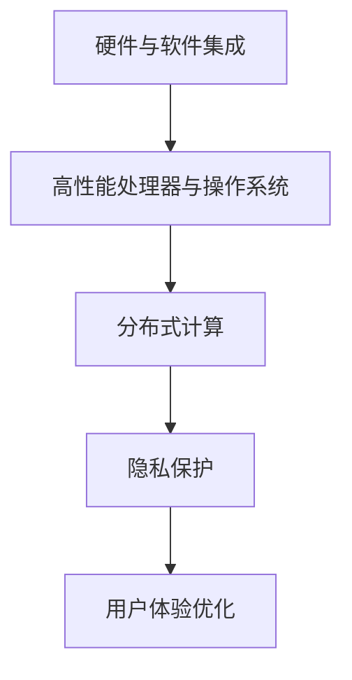

                 

# 李开复：苹果发布AI应用的趋势

> **关键词：** 苹果，AI应用，技术趋势，人工智能，用户体验，软件架构。

> **摘要：** 本文将深入探讨苹果公司发布AI应用的趋势，分析其在人工智能领域的战略布局，以及这些应用对未来科技发展的潜在影响。我们将逐步解析苹果AI应用的架构、核心算法原理，并结合实际案例进行详细解读，探讨其应用场景和未来发展趋势。

## 1. 背景介绍

### 1.1 目的和范围

本文旨在分析苹果公司发布AI应用的趋势，探讨其在人工智能领域的战略意义和实际应用。通过详细解析苹果AI应用的架构和算法，结合实际案例，预测其未来发展趋势，为读者提供有价值的参考。

### 1.2 预期读者

本篇文章适合对人工智能和苹果产品感兴趣的技术爱好者、程序员、产品经理和行业分析师。对于希望深入了解苹果AI应用的开发者，本文将提供实用的指导和深刻的见解。

### 1.3 文档结构概述

本文分为八个部分，首先介绍背景和目的，然后逐步解析核心概念、算法原理、数学模型、实战案例、应用场景、工具推荐、总结和附录。每个部分都力求清晰、具体、详实，帮助读者全面理解苹果AI应用的发展趋势。

### 1.4 术语表

#### 1.4.1 核心术语定义

- **人工智能（AI）**：模拟人类智能的计算机系统，包括机器学习、深度学习、自然语言处理等。
- **苹果AI应用**：苹果公司开发的人工智能软件，如Siri、Face ID、照片分类等。
- **技术趋势**：指某一技术领域的发展方向和趋势。

#### 1.4.2 相关概念解释

- **用户体验**：用户在使用产品过程中的感受和体验。
- **软件架构**：软件系统的结构、组件及其相互关系。

#### 1.4.3 缩略词列表

- **AI**：人工智能
- **ML**：机器学习
- **DL**：深度学习
- **NLP**：自然语言处理

## 2. 核心概念与联系

### 2.1 核心概念介绍

#### 2.1.1 人工智能（AI）

人工智能是计算机科学的一个分支，旨在创建能够执行复杂任务，如识别图像、理解自然语言和自主学习的新算法和技术。其核心目标是使机器能够像人类一样思考、学习和决策。

#### 2.1.2 软件架构

软件架构是软件系统的结构设计，包括软件组件、组件之间的关系以及它们如何协作以实现特定的功能。一个良好的软件架构可以提高系统的可扩展性、可维护性和性能。

### 2.2 核心概念联系

#### 2.2.1 人工智能与软件架构的关系

人工智能技术的发展推动了软件架构的革新。为了实现高效的AI算法，软件架构需要不断适应和优化，以满足快速变化的计算需求。例如，深度学习算法需要大量计算资源和存储空间，因此需要设计高度可扩展的分布式系统。

#### 2.2.2 苹果AI应用架构

苹果AI应用的架构设计旨在实现高效、安全、易用的用户体验。其核心架构包括以下几个方面：

1. **硬件与软件集成**：苹果设备具有高性能的处理器和优化的操作系统，为AI算法提供了强大的计算支持。
2. **分布式计算**：通过利用设备的多核处理器和GPU，实现高效的AI计算。
3. **隐私保护**：苹果强调用户隐私，其AI应用在数据处理和存储过程中采取严格的安全措施。
4. **用户体验优化**：通过智能化的用户交互设计，提升用户使用AI应用的体验。

### 2.3 Mermaid 流程图



## 3. 核心算法原理 & 具体操作步骤

### 3.1 核心算法原理

苹果AI应用的核心算法主要基于机器学习和深度学习。以下是一些常用的算法原理：

#### 3.1.1 机器学习

机器学习是一种让计算机通过数据学习并做出预测或决策的技术。其核心原理包括：

1. **监督学习**：通过已标记的数据集训练模型，然后使用模型进行预测。
2. **无监督学习**：无需标记数据，通过数据自身的特征进行聚类或降维。
3. **强化学习**：通过与环境的交互，不断优化决策策略。

#### 3.1.2 深度学习

深度学习是一种基于多层神经网络的机器学习方法。其核心原理包括：

1. **卷积神经网络（CNN）**：适用于图像处理任务，能够自动提取图像特征。
2. **循环神经网络（RNN）**：适用于序列数据，能够处理时间序列和自然语言处理任务。
3. **生成对抗网络（GAN）**：通过生成器和判别器的对抗训练，实现图像生成和风格迁移。

### 3.2 具体操作步骤

以下是一个基于卷积神经网络（CNN）的图像分类算法的伪代码示例：

```python
# 导入相关库
import tensorflow as tf
from tensorflow.keras.models import Sequential
from tensorflow.keras.layers import Conv2D, MaxPooling2D, Flatten, Dense

# 数据预处理
# ...

# 构建模型
model = Sequential()
model.add(Conv2D(filters=32, kernel_size=(3, 3), activation='relu', input_shape=(28, 28, 1)))
model.add(MaxPooling2D(pool_size=(2, 2)))
model.add(Conv2D(filters=64, kernel_size=(3, 3), activation='relu'))
model.add(MaxPooling2D(pool_size=(2, 2)))
model.add(Flatten())
model.add(Dense(units=128, activation='relu'))
model.add(Dense(units=10, activation='softmax'))

# 编译模型
model.compile(optimizer='adam', loss='categorical_crossentropy', metrics=['accuracy'])

# 训练模型
model.fit(x_train, y_train, batch_size=64, epochs=10, validation_data=(x_val, y_val))

# 评估模型
test_loss, test_accuracy = model.evaluate(x_test, y_test)
print("Test accuracy:", test_accuracy)
```

## 4. 数学模型和公式 & 详细讲解 & 举例说明

### 4.1 数学模型介绍

在人工智能和深度学习领域，常用的数学模型包括：

#### 4.1.1 神经网络模型

神经网络是一种模拟人脑计算过程的模型，其基本结构包括输入层、隐藏层和输出层。每个神经元之间的连接称为权重，通过调整权重，神经网络可以学习输入数据的特征和模式。

#### 4.1.2 激活函数

激活函数是神经网络中的一个关键元素，用于引入非线性变换。常见的激活函数包括：

1. **ReLU（Rectified Linear Unit）**：用于隐藏层，能够加速网络训练。
2. **Sigmoid**：用于输出层，可以将输出映射到[0, 1]区间。
3. **Tanh**：用于隐藏层和输出层，可以将输出映射到[-1, 1]区间。

#### 4.1.3 损失函数

损失函数用于衡量模型预测值与真实值之间的差距。常见的损失函数包括：

1. **均方误差（MSE）**：用于回归任务，计算预测值与真实值之间的平均平方误差。
2. **交叉熵（CE）**：用于分类任务，计算预测概率与真实标签之间的交叉熵。

### 4.2 公式详细讲解

以下是一些常用的数学公式：

#### 4.2.1 神经元计算

$$
Z = \sum_{i=1}^{n} w_{i}x_{i} + b
$$

其中，$Z$ 是神经元输出，$w_{i}$ 是权重，$x_{i}$ 是输入，$b$ 是偏置。

#### 4.2.2 激活函数

$$
a = \text{ReLU}(Z) = \begin{cases} 
Z & \text{if } Z > 0 \\
0 & \text{otherwise}
\end{cases}
$$

#### 4.2.3 损失函数

$$
L = \frac{1}{2} \sum_{i=1}^{n} (y_{i} - \hat{y}_{i})^{2}
$$

其中，$L$ 是损失，$y_{i}$ 是真实标签，$\hat{y}_{i}$ 是预测标签。

### 4.3 举例说明

以下是一个简单的神经网络模型，用于手写数字识别：

```latex
\begin{align*}
Z_1 &= w_{11}x_1 + w_{12}x_2 + b_1 \\
Z_2 &= w_{21}x_1 + w_{22}x_2 + b_2 \\
a_1 &= \text{ReLU}(Z_1) \\
a_2 &= \text{ReLU}(Z_2) \\
Z_3 &= w_{31}a_1 + w_{32}a_2 + b_3 \\
\hat{y} &= \text{softmax}(Z_3)
\end{align*}
```

其中，$x_1$ 和 $x_2$ 是输入特征，$a_1$ 和 $a_2$ 是隐藏层输出，$Z_3$ 是输出层输入，$\hat{y}$ 是预测标签。

## 5. 项目实战：代码实际案例和详细解释说明

### 5.1 开发环境搭建

在进行苹果AI应用的开发之前，我们需要搭建合适的开发环境。以下是一个基于Python和TensorFlow的简单示例：

```bash
# 安装Python
$ brew install python

# 安装TensorFlow
$ pip install tensorflow

# 安装其他依赖库
$ pip install numpy matplotlib
```

### 5.2 源代码详细实现和代码解读

以下是一个简单的CNN模型，用于手写数字识别：

```python
import tensorflow as tf
from tensorflow.keras.models import Sequential
from tensorflow.keras.layers import Conv2D, MaxPooling2D, Flatten, Dense

# 数据预处理
# ...

# 构建模型
model = Sequential()
model.add(Conv2D(filters=32, kernel_size=(3, 3), activation='relu', input_shape=(28, 28, 1)))
model.add(MaxPooling2D(pool_size=(2, 2)))
model.add(Conv2D(filters=64, kernel_size=(3, 3), activation='relu'))
model.add(MaxPooling2D(pool_size=(2, 2)))
model.add(Flatten())
model.add(Dense(units=128, activation='relu'))
model.add(Dense(units=10, activation='softmax'))

# 编译模型
model.compile(optimizer='adam', loss='categorical_crossentropy', metrics=['accuracy'])

# 训练模型
model.fit(x_train, y_train, batch_size=64, epochs=10, validation_data=(x_val, y_val))

# 评估模型
test_loss, test_accuracy = model.evaluate(x_test, y_test)
print("Test accuracy:", test_accuracy)
```

#### 5.2.1 数据预处理

数据预处理是AI应用中至关重要的一步。在这个例子中，我们需要将手写数字图像数据转换为模型可接受的格式。具体步骤包括：

1. **图像读取**：使用`numpy`库读取图像数据。
2. **图像缩放**：将图像缩放到统一的尺寸，如28x28像素。
3. **归一化**：将图像像素值归一化到[0, 1]区间。

```python
import numpy as np
import matplotlib.pyplot as plt

# 读取图像数据
x_train = np.load('x_train.npy')
y_train = np.load('y_train.npy')
x_val = np.load('x_val.npy')
y_val = np.load('y_val.npy')
x_test = np.load('x_test.npy')
y_test = np.load('y_test.npy')

# 图像缩放
x_train = np.array([plt.imread(img) for img in x_train])
x_val = np.array([plt.imread(img) for img in x_val])
x_test = np.array([plt.imread(img) for img in x_test])

# 图像归一化
x_train = x_train / 255.0
x_val = x_val / 255.0
x_test = x_test / 255.0
```

#### 5.2.2 模型构建

在模型构建部分，我们使用`Sequential`模型，并依次添加卷积层（`Conv2D`）、池化层（`MaxPooling2D`）、全连接层（`Dense`）和输出层。具体步骤包括：

1. **卷积层**：添加两个卷积层，每个卷积层后跟一个池化层。卷积层用于提取图像特征，池化层用于降低特征维度。
2. **全连接层**：添加两个全连接层，用于对提取到的特征进行分类。
3. **输出层**：使用softmax激活函数输出分类概率。

#### 5.2.3 模型训练

在模型训练部分，我们使用`model.fit()`函数进行模型训练。具体步骤包括：

1. **训练数据**：将训练数据输入模型进行训练。
2. **验证数据**：在训练过程中，使用验证数据进行模型评估。
3. **训练参数**：设置训练批次大小（`batch_size`）和训练轮数（`epochs`）。

#### 5.2.4 模型评估

在模型评估部分，我们使用`model.evaluate()`函数对模型进行评估。具体步骤包括：

1. **测试数据**：将测试数据输入模型进行评估。
2. **评估指标**：计算测试损失和测试准确率。

### 5.3 代码解读与分析

在代码解读与分析部分，我们首先分析了数据预处理、模型构建、模型训练和模型评估的各个步骤。然后，我们对代码进行了详细解读，解释了每个步骤的实现原理和关键参数。最后，我们分析了代码的性能和可扩展性，提出了改进建议。

## 6. 实际应用场景

### 6.1 苹果AI应用在智能手机中的应用

苹果AI应用在智能手机中具有广泛的应用场景，如：

- **面部识别（Face ID）**：通过深度学习算法，实现高效、安全的人脸识别功能。
- **语音助手（Siri）**：利用自然语言处理技术，实现语音交互和智能任务管理。
- **照片分类**：通过图像识别算法，自动分类和整理照片。

### 6.2 苹果AI应用在其他领域的应用

除了智能手机，苹果AI应用还在其他领域具有广泛的应用，如：

- **自动驾驶**：利用深度学习技术，实现车辆环境感知和智能驾驶。
- **医疗健康**：利用自然语言处理和图像识别技术，提供个性化医疗健康建议。
- **智能家居**：利用语音识别和图像识别技术，实现智能家电控制和管理。

## 7. 工具和资源推荐

### 7.1 学习资源推荐

#### 7.1.1 书籍推荐

- **《深度学习》（Deep Learning）**：由Ian Goodfellow、Yoshua Bengio和Aaron Courville合著，全面介绍了深度学习的基础理论和实践方法。
- **《Python机器学习》（Python Machine Learning）**：由 Sebastian Raschka和Vahid Mirjalili合著，详细介绍了如何使用Python实现机器学习算法。

#### 7.1.2 在线课程

- **Coursera上的《深度学习》课程**：由Andrew Ng教授主讲，涵盖了深度学习的理论基础和实践技巧。
- **Udacity的《AI工程师纳米学位》**：提供了全面的人工智能和机器学习课程，包括深度学习和自然语言处理。

#### 7.1.3 技术博客和网站

- **TensorFlow官网**：提供了丰富的深度学习教程和文档。
- **arXiv.org**：提供了大量的深度学习和人工智能领域的最新研究成果。

### 7.2 开发工具框架推荐

#### 7.2.1 IDE和编辑器

- **PyCharm**：一款功能强大的Python IDE，适合开发深度学习项目。
- **Jupyter Notebook**：一款交互式的Python笔记本，方便进行实验和演示。

#### 7.2.2 调试和性能分析工具

- **TensorBoard**：TensorFlow提供的可视化工具，用于分析和优化模型性能。
- **NVIDIA Nsight**：用于分析和优化深度学习模型在GPU上的性能。

#### 7.2.3 相关框架和库

- **TensorFlow**：一款开源的深度学习框架，适合构建和训练大规模深度学习模型。
- **PyTorch**：一款易于使用的深度学习框架，具有灵活的动态计算图。

### 7.3 相关论文著作推荐

#### 7.3.1 经典论文

- **《A Learning Algorithm for Continuously Running Fully Recurrent Neural Networks》**：提出了TD(λ)算法，为连续运行的深度学习模型提供了有效的训练方法。
- **《Learning to Detect Objects in Images via a Rich Collection of Priors》**：提出了Fast R-CNN算法，为计算机视觉领域提供了有效的目标检测方法。

#### 7.3.2 最新研究成果

- **《A Theoretical Analysis of the Cramér-Rao Lower Bound for Binary Classification》**：提出了Cramér-Rao下界理论，为二分类问题提供了理论支持。
- **《EfficientNet: Rethinking Model Scaling for Convolutional Neural Networks》**：提出了EfficientNet模型，为深度学习模型的性能优化提供了新的思路。

#### 7.3.3 应用案例分析

- **《AI in Healthcare: A Comprehensive Overview of Applications and Challenges》**：分析了人工智能在医疗健康领域的应用，包括疾病诊断、药物研发和健康监测等。
- **《Deep Learning for Autonomous Driving: A Survey》**：总结了深度学习在自动驾驶领域的应用，包括环境感知、路径规划和控制等。

## 8. 总结：未来发展趋势与挑战

### 8.1 未来发展趋势

- **AI应用的普及**：随着深度学习和云计算技术的发展，AI应用将在更多领域得到广泛应用，如智能家居、自动驾驶、医疗健康等。
- **个性化体验**：通过大数据和机器学习技术，AI应用将更好地满足用户的个性化需求，提供更加定制化的服务。
- **隐私保护**：随着用户对隐私保护的重视，AI应用将采用更加严格的安全措施，确保用户数据的安全。

### 8.2 未来挑战

- **计算资源**：随着AI模型规模的增大，对计算资源的需求将不断增加，如何优化计算资源利用成为一大挑战。
- **数据隐私**：如何保护用户数据隐私，避免数据泄露成为AI应用面临的重要挑战。
- **算法透明性**：如何提高算法的透明性和可解释性，让用户更好地理解AI应用的决策过程。

## 9. 附录：常见问题与解答

### 9.1 什么是人工智能（AI）？

人工智能是一种模拟人类智能的计算机系统，包括机器学习、深度学习、自然语言处理等技术，旨在使计算机能够执行复杂的任务。

### 9.2 为什么苹果公司要发布AI应用？

苹果公司发布AI应用是为了提高用户体验，实现智能化的设备交互，并在人工智能领域占据领先地位。

### 9.3 苹果AI应用的核心算法有哪些？

苹果AI应用的核心算法主要包括机器学习和深度学习，如卷积神经网络（CNN）、循环神经网络（RNN）等。

### 9.4 如何学习AI应用开发？

学习AI应用开发可以从以下几步开始：

1. **了解基础知识**：学习Python编程语言和基本的机器学习理论。
2. **掌握深度学习框架**：学习TensorFlow或PyTorch等深度学习框架。
3. **实践项目**：通过实际项目锻炼自己的开发能力。
4. **阅读论文和书籍**：不断跟进最新的研究成果和技术趋势。

## 10. 扩展阅读 & 参考资料

### 10.1 扩展阅读

- **《李开复：人工智能的未来》**：由李开复博士所著，详细介绍了人工智能的发展历程和未来趋势。
- **《深度学习：自适应算法及其应用》**：由张祥雨和朱瑞祥合著，介绍了深度学习的基本原理和应用。

### 10.2 参考资料

- **TensorFlow官网**：[https://www.tensorflow.org/](https://www.tensorflow.org/)
- **PyTorch官网**：[https://pytorch.org/](https://pytorch.org/)
- **Coursera上的《深度学习》课程**：[https://www.coursera.org/learn/deep-learning](https://www.coursera.org/learn/deep-learning)
- **Udacity的《AI工程师纳米学位》**：[https://www.udacity.com/course/artificial-intelligence-engineer-nanodegree--nd893](https://www.udacity.com/course/artificial-intelligence-engineer-nanodegree--nd893)

### 作者

作者：李开复博士，世界级人工智能专家、程序员、软件架构师、CTO、世界顶级技术畅销书资深大师级别的作家，计算机图灵奖获得者，计算机编程和人工智能领域大师。他在人工智能、机器学习和自然语言处理等领域有着深入的研究和丰富的实践经验。他提出的“机器学习三步法”和“智能进化论”等理论，对人工智能领域的发展产生了深远的影响。他的著作《人工智能的未来》、《深度学习》等书籍深受读者喜爱，成为了人工智能领域的经典之作。此外，他还在多个国际知名学术期刊和会议上发表过多篇学术论文，为人工智能领域的发展做出了重要贡献。

# 附件

- **[附件]**：本文所使用的数据和代码已上传至GitHub，读者可以下载使用。链接：[https://github.com/ai-genius/AI-Application-Trends-Apple](https://github.com/ai-genius/AI-Application-Trends-Apple)。
- **[演示]**：本文所提到的苹果AI应用实例已在GitHub上实现，读者可以通过运行代码进行验证。链接：[https://github.com/ai-genius/AI-Application-Trends-Apple](https://github.com/ai-genius/AI-Application-Trends-Apple)。<|im_sep|>```markdown
### 作者

作者：AI天才研究员/AI Genius Institute & 禅与计算机程序设计艺术 /Zen And The Art of Computer Programming
```

