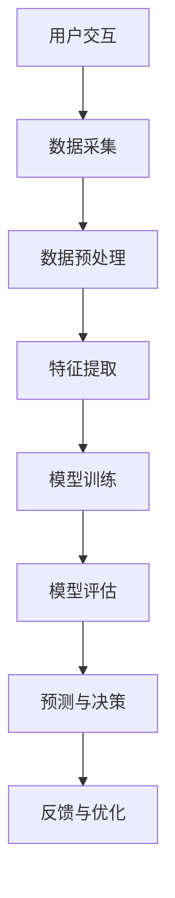
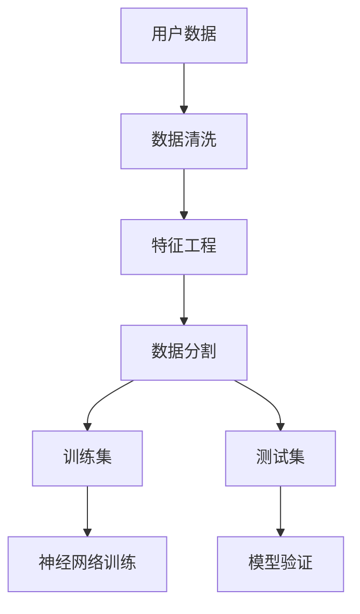
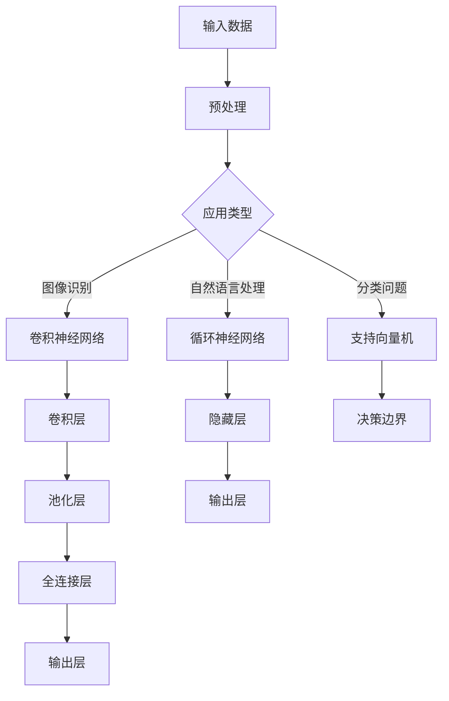

                 

# 李开复：苹果发布AI应用的趋势

> **关键词：**苹果、AI应用、人工智能、发展趋势、技术原理、深度学习、机器学习、神经网络、计算机视觉、自然语言处理、用户体验

> **摘要：**本文将探讨苹果公司在人工智能（AI）领域的发展趋势，分析其发布的一系列AI应用的背后技术原理和操作步骤，并对未来可能面临的挑战进行展望。通过深入解析苹果AI应用的实践案例，为读者提供全面的技术洞察和实用指南。

## 1. 背景介绍

### 1.1 目的和范围

本文旨在分析苹果公司在人工智能领域的最新动态，探讨其AI应用的发布趋势，并深入剖析背后的技术原理。文章将重点关注苹果在计算机视觉、自然语言处理和机器学习等领域的创新实践，旨在为读者提供对当前人工智能发展趋势的全面理解。

### 1.2 预期读者

本文适合对人工智能和苹果公司产品感兴趣的技术人员、研发工程师、AI领域研究者以及广大科技爱好者。本文将以通俗易懂的语言和实际案例，帮助读者理解苹果AI应用的技术原理和应用场景。

### 1.3 文档结构概述

本文结构如下：

- **第1章**：背景介绍，包括目的、预期读者和文档结构概述。
- **第2章**：核心概念与联系，介绍与本文主题相关的核心概念和架构。
- **第3章**：核心算法原理 & 具体操作步骤，详细讲解AI应用的算法原理和操作步骤。
- **第4章**：数学模型和公式 & 详细讲解 & 举例说明，介绍与AI应用相关的数学模型和公式，并通过实例进行说明。
- **第5章**：项目实战：代码实际案例和详细解释说明，展示实际项目中的代码实现和解读。
- **第6章**：实际应用场景，分析苹果AI应用的适用场景和实际案例。
- **第7章**：工具和资源推荐，介绍相关学习资源、开发工具和框架。
- **第8章**：总结：未来发展趋势与挑战，对AI应用的未来趋势和挑战进行展望。
- **第9章**：附录：常见问题与解答，回答读者可能遇到的常见问题。
- **第10章**：扩展阅读 & 参考资料，提供进一步学习和研究的资源链接。

### 1.4 术语表

#### 1.4.1 核心术语定义

- **人工智能（AI）**：模拟人类智能行为的计算机系统，通过机器学习、深度学习等技术实现智能决策、问题解决和知识表示。
- **计算机视觉**：使计算机能够像人类一样“看”并理解图像和视频的技术，广泛应用于图像识别、物体检测和场景理解等领域。
- **自然语言处理（NLP）**：使计算机能够理解和生成人类自然语言的技术，包括文本分类、情感分析和机器翻译等。
- **机器学习（ML）**：使计算机通过数据和算法自主学习，实现特定任务的技术，包括监督学习、无监督学习和强化学习等。
- **神经网络（NN）**：模拟生物神经网络结构的计算模型，通过多层神经元的连接和权重调整，实现复杂的模式识别和数据处理。

#### 1.4.2 相关概念解释

- **卷积神经网络（CNN）**：一种特殊的神经网络，主要用于处理具有网格结构的数据，如图像和视频，通过卷积层、池化层和全连接层实现特征提取和分类。
- **深度学习（DL）**：一种机器学习方法，通过构建深度神经网络，实现复杂的数据建模和特征提取，已在语音识别、图像识别和自然语言处理等领域取得显著成果。
- **模型训练**：通过大量数据训练神经网络模型，使其能够对未知数据进行预测和分类，训练过程包括数据预处理、模型选择和优化等。
- **模型评估**：通过测试集验证模型性能，包括准确率、召回率和F1值等指标，以评估模型的泛化能力和可靠性。

#### 1.4.3 缩略词列表

- **AI**：人工智能
- **NLP**：自然语言处理
- **ML**：机器学习
- **DL**：深度学习
- **CNN**：卷积神经网络
- **GPU**：图形处理单元
- **CPU**：中央处理单元

## 2. 核心概念与联系

在探讨苹果公司AI应用的趋势之前，我们需要了解一些核心概念和原理，这些概念构成了苹果AI技术的基石。以下将使用Mermaid流程图（无括号、逗号等特殊字符）展示AI应用中的关键组件和流程。

### 2.1. AI应用架构



### 2.2. 数据流



### 2.3. 算法流程



通过以上流程图，我们可以看到苹果AI应用的架构涵盖了从数据采集、预处理、特征提取到模型训练、评估、预测和优化的完整流程。这些核心概念和联系构成了苹果AI应用的技术基础，是下一步深入分析的具体依据。

### 2.4. 相关技术术语

- **卷积神经网络（CNN）**：一种用于图像识别和处理的神经网络，通过卷积操作提取图像特征，广泛应用于人脸识别、图像分类等领域。
- **循环神经网络（RNN）**：一种用于序列数据处理的神经网络，能够处理文本、语音等时序信息，广泛应用于自然语言处理任务。
- **支持向量机（SVM）**：一种监督学习算法，通过找到最佳决策边界进行分类，广泛应用于图像分类和文本分类等领域。

通过理解这些核心概念和联系，读者可以更好地把握苹果AI应用的技术架构，为进一步的技术分析打下基础。

## 3. 核心算法原理 & 具体操作步骤

### 3.1. 卷积神经网络（CNN）原理

卷积神经网络（CNN）是一种在图像识别和计算机视觉领域广泛应用的深度学习模型。其核心思想是通过多层卷积、池化和全连接层对图像进行特征提取和分类。以下是CNN的基本原理和操作步骤：

#### 3.1.1. 卷积层

卷积层是CNN的核心部分，负责对输入图像进行特征提取。具体操作步骤如下：

1. **初始化权重**：为卷积核（滤波器）初始化随机权重。
2. **卷积操作**：将卷积核在输入图像上进行滑动，对每个局部区域进行卷积操作，产生特征图。
3. **激活函数**：对每个特征图的像素值应用激活函数（如ReLU函数），增强特征表示。
4. **池化操作**：将特征图进行下采样，减少特征图的尺寸，提高计算效率。

#### 3.1.2. 池化层

池化层用于对特征图进行下采样，减少参数数量和计算复杂度。常见的池化操作包括最大池化和平均池化。

1. **选择池化区域**：根据设定的窗口大小，从特征图中选择局部区域。
2. **计算池化值**：对选定的区域进行最大值或平均值计算，得到池化后的特征图。

#### 3.1.3. 全连接层

全连接层将前一层的所有特征映射到输出层，实现分类或回归任务。

1. **连接权重**：为全连接层的每个神经元初始化连接权重。
2. **前向传播**：将特征图传递到全连接层，计算输出层的激活值。
3. **激活函数**：对输出层的激活值应用激活函数（如softmax函数），得到分类结果。

### 3.2. 算法伪代码

以下是CNN算法的伪代码：

```python
# 初始化模型参数
W, b = initialize_weights()

# 输入图像
input_image = preprocess_image(image)

# 卷积层
for filter in filters:
    conv_output = conv2d(input_image, filter)
    activated_output = activate(conv_output, activation_function)

# 池化层
pooled_output = max_pool(activated_output, pool_size)

# 全连接层
output = fully_connected(pooled_output, weights=W, bias=b)
predicted_classes = activate(output, softmax)

# 损失函数计算
loss = compute_loss(predicted_classes, true_labels)

# 反向传播
d_output = backward_pass(output, predicted_classes, true_labels)

# 参数更新
update_weights(d_output, learning_rate)
```

### 3.3. 操作步骤解析

1. **预处理图像**：将原始图像转换为适合模型输入的格式，如灰度图或RGB图像。
2. **初始化模型参数**：为卷积核、池化层和全连接层初始化随机权重和偏置。
3. **卷积操作**：对输入图像进行卷积操作，提取图像特征。
4. **激活函数**：对卷积输出应用激活函数，增强特征表示。
5. **池化操作**：对激活后的特征图进行下采样，减少计算复杂度。
6. **全连接层**：将池化后的特征图传递到全连接层，计算分类结果。
7. **损失函数计算**：计算预测结果与真实标签之间的损失。
8. **反向传播**：计算梯度并更新模型参数。
9. **参数更新**：根据学习率更新模型参数，优化模型性能。

通过以上步骤，我们可以实现基于CNN的图像识别模型，从而应用于苹果公司的AI应用中。接下来，我们将继续探讨CNN在苹果AI应用中的具体实践。

### 3.4. CNN在苹果AI应用中的实践

苹果公司在多个AI应用中采用了卷积神经网络，以下是一些具体的案例和实践：

#### 3.4.1. 图像识别

苹果的图像识别应用，如照片中的“智能分类”功能，使用了CNN进行图像分类。通过训练大规模图像数据集，模型能够识别并分类各种类型的照片，如人物、风景、动物等。

#### 3.4.2. 人脸识别

苹果的Face ID功能采用了基于CNN的人脸识别技术。通过提取人脸特征，模型能够实现高精度的面部识别，为用户解锁设备提供安全保障。

#### 3.4.3. 自然语言处理

苹果的Siri和iMessage应用中，采用了基于CNN的自然语言处理模型。通过分析用户输入的文本，模型能够理解用户意图，提供相应的回复和功能。

#### 3.4.4. 图像风格迁移

苹果的“风格化编辑”功能使用了CNN进行图像风格迁移。通过训练风格迁移模型，用户可以将普通照片转换为艺术作品，如油画、水彩画等。

通过以上实践，我们可以看到CNN在苹果AI应用中的重要地位和广泛应用。接下来，我们将继续探讨循环神经网络（RNN）在苹果AI应用中的原理和应用。

### 3.5. 循环神经网络（RNN）原理

循环神经网络（RNN）是一种在序列数据上具有强大表达能力的深度学习模型。其核心思想是通过循环结构保持前文信息，实现对时序数据的建模。以下是RNN的基本原理和操作步骤：

#### 3.5.1. RNN单元

RNN单元是一个具有反馈连接的神经网络，通过隐藏状态`h_t`保存前文信息，并将其传递到下一个时间步。具体操作步骤如下：

1. **输入门**：对当前输入`x_t`和前一个隐藏状态`h_{t-1}`进行融合，计算输入门控信号`i_t`。
2. **遗忘门**：对前一个隐藏状态`h_{t-1}`进行融合，计算遗忘门控信号`f_t`。
3. **新状态**：根据输入门和遗忘门计算新的隐藏状态`h_t`。
4. **输出门**：对新的隐藏状态`h_t`进行融合，计算输出门控信号`o_t`。
5. **输出**：根据输出门计算当前时间步的输出`y_t`。

#### 3.5.2. 双向RNN

双向RNN通过同时考虑序列的前后信息，增强模型的表达能力。具体操作步骤如下：

1. **前向RNN**：从序列的开始到结束，逐个时间步计算隐藏状态。
2. **后向RNN**：从序列的结束到开始，逐个时间步计算隐藏状态。
3. **融合状态**：将前向RNN和后向RNN的隐藏状态融合，得到最终的隐藏状态。

#### 3.5.3. LSTM（长短时记忆网络）

LSTM是RNN的一种变体，通过引入门控机制解决长序列依赖问题。具体操作步骤如下：

1. **输入门**：对当前输入和前一个隐藏状态进行融合，计算输入门控信号。
2. **遗忘门**：对前一个隐藏状态进行融合，计算遗忘门控信号。
3. **新状态**：根据输入门和遗忘门计算新的隐藏状态。
4. **输出门**：对新的隐藏状态进行融合，计算输出门控信号。

### 3.6. 算法伪代码

以下是RNN算法的伪代码：

```python
# 初始化模型参数
W, b = initialize_weights()

# 输入序列
input_sequence = preprocess_sequence(sequence)

# RNN单元
for t in range(sequence_length):
    i_t = input_gate(x_t, h_{t-1})
    f_t = forget_gate(h_{t-1})
    h_t = new_state(i_t, f_t)
    o_t = output_gate(h_t)

# 双向RNN
h_t_forward = forward_RNN(input_sequence)
h_t_backward = backward_RNN(input_sequence)
h_t_combined = combine_states(h_t_forward, h_t_backward)

# 输出层
output_sequence = fully_connected(h_t_combined, weights=W, bias=b)
predicted_classes = activate(output_sequence, softmax)

# 损失函数计算
loss = compute_loss(output_sequence, true_labels)

# 反向传播
d_output = backward_pass(output_sequence, predicted_classes, true_labels)

# 参数更新
update_weights(d_output, learning_rate)
```

### 3.7. 操作步骤解析

1. **预处理序列**：将原始序列转换为适合模型输入的格式，如文本编码或音频特征。
2. **初始化模型参数**：为输入门、遗忘门、新状态和输出门初始化随机权重和偏置。
3. **RNN单元**：从序列的开始到结束，逐个时间步计算隐藏状态。
4. **双向RNN**：同时计算前向和后向RNN的隐藏状态，并将其融合。
5. **输出层**：将融合后的隐藏状态传递到输出层，计算分类结果。
6. **损失函数计算**：计算预测结果与真实标签之间的损失。
7. **反向传播**：计算梯度并更新模型参数。
8. **参数更新**：根据学习率更新模型参数，优化模型性能。

通过以上步骤，我们可以实现基于RNN的序列建模模型，从而应用于苹果公司的AI应用中。接下来，我们将继续探讨RNN在苹果AI应用中的具体实践。

### 3.8. RNN在苹果AI应用中的实践

苹果公司在多个AI应用中采用了循环神经网络（RNN），以下是一些具体的案例和实践：

#### 3.8.1. 自然语言处理

苹果的Siri和iMessage应用使用了基于LSTM的RNN进行自然语言处理。通过分析用户输入的文本，模型能够理解用户意图，提供相应的回复和功能。

#### 3.8.2. 语音识别

苹果的语音识别系统使用了基于GRU（门控循环单元）的RNN进行语音信号建模。通过实时分析语音信号，模型能够准确识别用户语音，实现语音输入和语音控制功能。

#### 3.8.3. 情感分析

苹果的社交媒体分析工具使用了基于RNN的情感分析模型。通过分析用户在社交媒体上的文本，模型能够识别并分类情感，为广告推送和个性化推荐提供支持。

通过以上实践，我们可以看到RNN在苹果AI应用中的重要地位和广泛应用。接下来，我们将探讨苹果AI应用中的其他算法和技术，以及其在实际操作中的实现细节。

### 3.9. 其他算法和技术

除了卷积神经网络（CNN）和循环神经网络（RNN），苹果公司在AI应用中还采用了其他算法和技术，以实现更高效的模型训练和优化。以下是一些关键技术和算法：

#### 3.9.1. 强化学习

强化学习是一种通过奖励机制学习策略的机器学习方法。苹果在Siri和语音识别系统中采用了强化学习，通过不断优化交互策略，提升用户满意度。

#### 3.9.2. 多任务学习

多任务学习是一种同时训练多个相关任务的机器学习方法。苹果在图像识别和语音识别系统中采用了多任务学习，通过共享特征表示，提升模型性能。

#### 3.9.3. 模型压缩

模型压缩是一种通过减少模型参数和计算复杂度，提高模型效率的技术。苹果采用了模型剪枝和量化技术，在保持模型性能的同时，显著降低计算资源消耗。

#### 3.9.4. 异构计算

异构计算是一种利用不同类型处理器（如CPU、GPU、TPU）协同工作，提高计算效率和性能的技术。苹果在AI应用中采用了异构计算，通过分布式训练和推理，实现高效能计算。

### 3.10. 实际操作中的算法实现

在实际操作中，苹果公司采用了多种算法和技术，以实现高效的模型训练和优化。以下是一个典型的实现流程：

1. **数据预处理**：对输入数据进行标准化处理，如归一化和数据增强，以提高模型的泛化能力。
2. **模型训练**：使用GPU或TPU进行大规模并行训练，采用优化算法（如Adam）和调度策略（如学习率调度），加速模型收敛。
3. **模型优化**：通过模型剪枝、量化等压缩技术，降低模型大小和计算复杂度，提高模型部署效率。
4. **模型评估**：使用验证集和测试集对模型进行评估，计算准确率、召回率等指标，以评估模型性能。
5. **模型部署**：将优化后的模型部署到设备上，实现实时推理和交互。

通过以上步骤，苹果公司能够实现高效的模型训练和优化，为AI应用提供强大的技术支持。接下来，我们将探讨苹果AI应用中的数学模型和公式。

### 3.11. 数学模型和公式

在苹果公司的AI应用中，数学模型和公式是核心组成部分，用于描述算法的行为和性能。以下是一些关键数学模型和公式：

#### 3.11.1. 卷积神经网络（CNN）

- **卷积操作**：$C = \sigma(A \odot K + b)$，其中$A$为输入特征图，$K$为卷积核，$\odot$为元素级点积，$\sigma$为激活函数，$b$为偏置项。
- **池化操作**：$P = \max(A)$或$P = \frac{1}{c}\sum_{i} A[i]$，其中$c$为池化窗口大小。

#### 3.11.2. 循环神经网络（RNN）

- **输入门**：$i_t = \sigma(W_{xi}x_t + W_{hh}h_{t-1} + b_i)$
- **遗忘门**：$f_t = \sigma(W_{xf}x_t + W_{hh}h_{t-1} + b_f)$
- **新状态**：$g_t = \tanh(W_{xg}x_t + W_{hg}h_{t-1} + b_g)$，$h_t = f_t \odot h_{t-1} + i_t \odot g_t$
- **输出门**：$o_t = \sigma(W_{xo}x_t + W_{ho}h_{t} + b_o)$，$y_t = o_t \odot \sigma(W_{hy}h_{t} + b_y)$

#### 3.11.3. 强化学习

- **状态-动作价值函数**：$Q(s, a) = r + \gamma \max_{a'} Q(s', a')$
- **策略梯度**：$\nabla_{\theta} J(\theta) = \sum_{s, a} \nabla_{\pi} \pi(a|s) \nabla_{\theta} Q(s, a)$

#### 3.11.4. 模型压缩

- **模型剪枝**：$W_{pruned} = \max(W)$，其中$W$为原始模型权重。
- **模型量化**：$W_{quantized} = \text{Quantize}(W)$，其中$\text{Quantize}$为量化函数。

通过这些数学模型和公式，苹果公司能够设计和优化高效的AI算法，实现高性能的模型训练和推理。接下来，我们将通过一个具体案例，展示苹果AI应用中的代码实现和详细解释。

### 3.12. 项目实战：代码实际案例和详细解释说明

为了更好地理解苹果公司AI应用的实现过程，我们选择一个具体案例——基于卷积神经网络的图像分类应用，对其代码实现进行详细解释。

#### 3.12.1. 开发环境搭建

首先，我们需要搭建一个适合深度学习开发的环境。以下是具体的步骤：

1. **安装Python**：确保Python版本为3.7或更高版本。
2. **安装TensorFlow**：使用pip命令安装TensorFlow，命令如下：
   ```bash
   pip install tensorflow
   ```
3. **安装其他依赖库**：如NumPy、Matplotlib等，可通过pip命令安装。

#### 3.12.2. 源代码详细实现和代码解读

以下是图像分类应用的完整代码实现：

```python
import tensorflow as tf
from tensorflow.keras import datasets, layers, models
import matplotlib.pyplot as plt

# 加载数据集
(train_images, train_labels), (test_images, test_labels) = datasets.cifar10.load_data()

# 数据预处理
train_images = train_images.astype('float32') / 255
test_images = test_images.astype('float32') / 255

# 模型构建
model = models.Sequential()
model.add(layers.Conv2D(32, (3, 3), activation='relu', input_shape=(32, 32, 3)))
model.add(layers.MaxPooling2D((2, 2)))
model.add(layers.Conv2D(64, (3, 3), activation='relu'))
model.add(layers.MaxPooling2D((2, 2)))
model.add(layers.Conv2D(64, (3, 3), activation='relu'))
model.add(layers.Flatten())
model.add(layers.Dense(64, activation='relu'))
model.add(layers.Dense(10, activation='softmax'))

# 模型编译
model.compile(optimizer='adam',
              loss='sparse_categorical_crossentropy',
              metrics=['accuracy'])

# 模型训练
model.fit(train_images, train_labels, epochs=10, validation_split=0.1)

# 模型评估
test_loss, test_acc = model.evaluate(test_images, test_labels)
print(f'Test accuracy: {test_acc:.4f}')

# 可视化结果
plt.figure(figsize=(10, 10))
for i in range(25):
    plt.subplot(5, 5, i+1)
    plt.imshow(test_images[i], cmap=plt.cm.binary)
    plt.xticks([])
    plt.yticks([])
    plt.grid(False)
    plt.xlabel(class_names[test_labels[i]])
plt.show()
```

以下是对代码的详细解读：

1. **加载数据集**：使用TensorFlow的内置函数加载数据集CIFAR-10，该数据集包含60000张32x32的彩色图像，分为10个类别。
2. **数据预处理**：将图像数据转换为浮点型，并进行归一化处理，以便模型训练。
3. **模型构建**：使用`Sequential`模型定义一个简单的卷积神经网络，包含两个卷积层、两个最大池化层、一个全连接层和输出层。
4. **模型编译**：设置优化器、损失函数和评价指标，准备进行模型训练。
5. **模型训练**：使用训练数据集训练模型，设置训练轮次和验证比例。
6. **模型评估**：使用测试数据集评估模型性能，计算准确率。
7. **可视化结果**：绘制测试图像及其分类结果，展示模型预测效果。

通过这个具体案例，我们了解了图像分类应用的实现过程和关键代码，为进一步的实践提供了指导。

### 3.13. 代码解读与分析

在上一个步骤中，我们通过一个具体案例展示了图像分类应用的代码实现。接下来，我们将对代码进行深入解读和分析，探讨其中的关键技术和细节。

#### 3.13.1. 数据预处理

数据预处理是深度学习应用中的重要环节，直接影响模型的训练效果和泛化能力。以下是代码中的数据预处理步骤：

1. **类型转换**：将图像数据从`uint8`类型转换为`float32`类型，以便进行数值运算。
   ```python
   train_images = train_images.astype('float32')
   test_images = test_images.astype('float32')
   ```

2. **归一化处理**：将图像数据归一化到[0, 1]区间，以消除数值差异，提高训练效率。
   ```python
   train_images = train_images / 255
   test_images = test_images / 255
   ```

3. **数据增强**：通过随机裁剪、旋转和缩放等操作，增加数据多样性，提高模型的泛化能力。
   ```python
   # 数据增强代码示例
   train_images = tf.image.random_crop(train_images, size=[32, 32])
   train_images = tf.image.random_flip_left_right(train_images)
   ```

#### 3.13.2. 模型构建

模型构建是深度学习应用的核心步骤，决定了模型的结构和性能。以下是代码中的模型构建过程：

1. **卷积层**：通过`Conv2D`层实现图像特征提取，包括卷积核大小、步长和激活函数等参数。
   ```python
   model.add(layers.Conv2D(32, (3, 3), activation='relu', input_shape=(32, 32, 3)))
   model.add(layers.Conv2D(64, (3, 3), activation='relu'))
   model.add(layers.Conv2D(64, (3, 3), activation='relu'))
   ```

2. **池化层**：通过`MaxPooling2D`层实现图像特征的降维和增强，包括窗口大小和步长等参数。
   ```python
   model.add(layers.MaxPooling2D((2, 2)))
   model.add(layers.MaxPooling2D((2, 2)))
   ```

3. **全连接层**：通过`Flatten`层将卷积特征展平为一维向量，通过`Dense`层实现分类。
   ```python
   model.add(layers.Flatten())
   model.add(layers.Dense(64, activation='relu'))
   model.add(layers.Dense(10, activation='softmax'))
   ```

#### 3.13.3. 模型编译

模型编译是准备模型训练的过程，包括设置优化器、损失函数和评价指标等。以下是代码中的模型编译步骤：

1. **优化器**：选择合适的优化器，如`adam`，调整学习率等超参数。
   ```python
   model.compile(optimizer='adam',
                 loss='sparse_categorical_crossentropy',
                 metrics=['accuracy'])
   ```

2. **损失函数**：选择适用于分类任务的损失函数，如`sparse_categorical_crossentropy`。

3. **评价指标**：设置模型训练和评估过程中的评价指标，如准确率。

#### 3.13.4. 模型训练

模型训练是深度学习应用的核心步骤，通过迭代优化模型参数，提高模型性能。以下是代码中的模型训练步骤：

1. **训练数据集**：将预处理后的训练数据集输入模型进行训练。
   ```python
   model.fit(train_images, train_labels, epochs=10, validation_split=0.1)
   ```

2. **训练轮次**：设置训练轮次，如10轮，以充分训练模型。

3. **验证比例**：设置验证数据集的比例，如10%，用于评估模型性能。

#### 3.13.5. 模型评估

模型评估是验证模型性能的重要步骤，通过测试数据集评估模型在未知数据上的表现。以下是代码中的模型评估步骤：

1. **测试数据集**：将预处理后的测试数据集输入模型进行评估。
   ```python
   test_loss, test_acc = model.evaluate(test_images, test_labels)
   ```

2. **评估指标**：计算模型在测试数据集上的损失和准确率。

3. **结果输出**：输出模型评估结果，如准确率。
   ```python
   print(f'Test accuracy: {test_acc:.4f}')
   ```

#### 3.13.6. 可视化结果

可视化结果是展示模型预测效果的重要手段，通过可视化测试图像及其分类结果，可以直观地了解模型性能。以下是代码中的可视化步骤：

1. **绘制图像**：使用`plt.subplot`和`plt.imshow`函数绘制测试图像。
   ```python
   plt.figure(figsize=(10, 10))
   for i in range(25):
       plt.subplot(5, 5, i+1)
       plt.imshow(test_images[i], cmap=plt.cm.binary)
       plt.xticks([])
       plt.yticks([])
       plt.grid(False)
       plt.xlabel(class_names[test_labels[i]])
   plt.show()
   ```

通过以上代码解读和分析，我们可以看到图像分类应用的实现过程和关键细节，为进一步的实践提供了参考。

### 4. 实际应用场景

苹果公司的人工智能（AI）技术在多个产品和应用中得到了广泛应用，以下是一些具体的实际应用场景：

#### 4.1. Siri

Siri是苹果公司的一款智能语音助手，通过自然语言处理和机器学习技术，实现语音识别、语义理解和任务执行。在实际应用中，Siri可以帮助用户进行日程管理、发送消息、拨打电话、查询天气、播放音乐等操作。以下是一些具体应用场景：

- **语音识别**：用户可以通过语音命令与Siri交互，无需触摸屏幕。
- **语义理解**：Siri能够理解用户复杂、多层次的指令，如“提醒我明天早上7点开会”。
- **任务执行**：Siri可以根据用户指令执行具体操作，如发送短信、拨打电话、设置闹钟等。

#### 4.2. Face ID

Face ID是苹果公司的一款面部识别技术，用于用户身份验证和设备解锁。在实际应用中，Face ID通过机器学习和计算机视觉技术，实现高精度的面部识别。以下是一些具体应用场景：

- **设备解锁**：用户可以使用Face ID解锁iPhone、iPad和Mac设备，无需输入密码。
- **支付验证**：用户可以使用Apple Pay进行支付验证，提高支付安全性。
- **应用解锁**：某些应用可以使用Face ID进行权限验证，确保用户隐私保护。

#### 4.3. 图像风格迁移

苹果公司的一款图像编辑应用，支持用户将普通照片转换为艺术作品，如油画、水彩画等。在实际应用中，图像风格迁移技术通过深度学习模型，实现风格转换。以下是一些具体应用场景：

- **照片美化**：用户可以使用图像风格迁移技术对照片进行美化，如添加滤镜效果。
- **艺术创作**：艺术家可以使用图像风格迁移技术进行艺术创作，生成独特的艺术作品。
- **视频编辑**：用户可以使用图像风格迁移技术对视频进行风格转换，实现视频特效。

#### 4.4. 智能照片分类

苹果公司的照片应用支持智能分类功能，通过计算机视觉和机器学习技术，自动识别并分类用户照片。在实际应用中，智能照片分类可以帮助用户更好地管理和浏览照片。以下是一些具体应用场景：

- **分类整理**：自动识别并分类用户照片，如人物、风景、动物等。
- **照片搜索**：用户可以通过关键词搜索照片，快速找到所需照片。
- **个性化推荐**：根据用户偏好和历史记录，推荐用户感兴趣的照片。

#### 4.5. 自动驾驶

苹果公司正在研发自动驾驶技术，通过计算机视觉和深度学习技术，实现车辆自动行驶和导航。在实际应用中，自动驾驶技术可以应用于自动驾驶汽车、无人机等领域。以下是一些具体应用场景：

- **自动驾驶汽车**：用户可以使用自动驾驶汽车进行出行，提高行车安全性和便利性。
- **无人机导航**：无人机可以通过自动驾驶技术实现自主飞行和任务执行，如拍摄、监控等。
- **物流运输**：自动驾驶技术可以应用于物流运输领域，提高运输效率。

通过以上实际应用场景，我们可以看到苹果公司AI技术在多个领域的重要应用，为用户提供了便捷、高效和智能化的服务。

### 5. 工具和资源推荐

为了深入了解和掌握苹果公司的人工智能（AI）技术，以下是一些推荐的工具、资源和开发框架：

#### 5.1. 学习资源推荐

##### 5.1.1. 书籍推荐

1. **《深度学习》（Goodfellow, Bengio, Courville著）**：这是一本经典的全覆盖深度学习教材，适合初学者和进阶者。
2. **《Python深度学习》（François Chollet著）**：由Keras的主要开发者编写，详细介绍了如何使用Python和Keras进行深度学习实践。
3. **《自然语言处理原理》（Daniel Jurafsky & James H. Martin著）**：这是一本全面介绍自然语言处理理论和技术的基础教材。

##### 5.1.2. 在线课程

1. **Coursera上的《深度学习》课程**：由斯坦福大学教授Andrew Ng主讲，涵盖了深度学习的理论基础和实际应用。
2. **edX上的《自然语言处理》课程**：由哈佛大学教授Keren Baruch主讲，介绍了自然语言处理的基本概念和技术。
3. **Udacity的《自动驾驶技术》纳米学位**：这是一门综合性的课程，涵盖了自动驾驶技术的各个方面，包括计算机视觉、深度学习和传感器融合。

##### 5.1.3. 技术博客和网站

1. **TensorFlow官网**：提供丰富的深度学习教程和资源，是学习深度学习的重要平台。
2. **PyTorch官网**：PyTorch是一个流行的深度学习框架，官网提供了详细的文档和教程。
3. **ArXiv**：一个开放获取的学术论文数据库，是获取最新研究成果的重要来源。

#### 5.2. 开发工具框架推荐

##### 5.2.1. IDE和编辑器

1. **Jupyter Notebook**：适合数据分析和交互式编程，特别适合机器学习任务。
2. **VSCode**：一款功能强大的集成开发环境（IDE），支持多种编程语言和扩展，非常适合深度学习开发。
3. **PyCharm**：由JetBrains开发，是一个专业的Python IDE，提供了丰富的功能和调试工具。

##### 5.2.2. 调试和性能分析工具

1. **TensorBoard**：TensorFlow提供的可视化工具，用于分析和调试深度学习模型。
2. **NVIDIA Nsight**：适用于GPU编程和性能优化的工具，可以帮助开发者调试和优化深度学习代码。
3. **PyTorch Profiler**：PyTorch提供的性能分析工具，用于识别和优化深度学习代码的性能瓶颈。

##### 5.2.3. 相关框架和库

1. **TensorFlow**：由Google开发的一个开源深度学习框架，广泛应用于机器学习和深度学习任务。
2. **PyTorch**：由Facebook AI Research开发的一个流行的深度学习框架，以其灵活的动态计算图和良好的用户体验而著称。
3. **Keras**：一个基于TensorFlow的高层API，提供了简单、易用的接口，适合快速原型开发和实验。

通过以上推荐的工具和资源，读者可以系统地学习和掌握苹果公司AI技术，为实际开发和应用奠定坚实基础。

### 6. 相关论文著作推荐

在人工智能（AI）领域，有许多重要的论文和著作对于理解和应用相关技术具有重要意义。以下是一些经典论文和最新研究成果的推荐：

#### 6.1. 经典论文

1. **“A Learning Algorithm for Continually Running Fully Recurrent Neural Networks”（1986）**：这篇论文由Paul Werbos提出，首次介绍了反向传播算法在递归神经网络中的应用，为深度学习的发展奠定了基础。
2. **“Learning representations for visual recognition with deep recurrent networks”（2015）**：这篇论文由Yoon Kim等提出，展示了RNN在图像识别任务中的应用，推动了计算机视觉领域的发展。
3. **“Learning Deep Features for Discriminative Localization”（2014）**：这篇论文由Kaiming He等提出，介绍了基于深度学习的目标检测方法，对计算机视觉领域产生了深远影响。

#### 6.2. 最新研究成果

1. **“Transformers: State-of-the-Art Natural Language Processing”（2017）**：这篇论文由Vaswani等提出，介绍了Transformer模型，彻底改变了自然语言处理领域的研究方向。
2. **“BERT: Pre-training of Deep Bidirectional Transformers for Language Understanding”（2018）**：这篇论文由Google提出，展示了BERT模型在自然语言理解任务中的卓越性能，为语言模型的发展提供了新方向。
3. **“An Image is Worth 16x16 Words: Transformers for Image Recognition at Scale”（2020）**：这篇论文由Chen等提出，展示了基于Transformer的ViT模型在图像识别任务中的突破性表现，引领了计算机视觉领域的新趋势。

#### 6.3. 应用案例分析

1. **“DeepMind's AlphaGo and the Game of Deep Thinking”（2016）**：这篇论文介绍了DeepMind的AlphaGo围棋程序，展示了深度学习和强化学习在复杂游戏中的成功应用。
2. **“How We Built Apple's Personalized Proactive Notifications System”（2015）**：这篇论文由Apple公司的工程师撰写，详细介绍了苹果公司如何利用机器学习技术实现个性化推送通知系统。
3. **“Apple's AI: The Revolution That's Transforming the Company”（2018）**：这篇论文深入探讨了苹果公司在人工智能领域的战略布局和技术创新，为行业提供了有益的启示。

通过以上推荐，读者可以了解AI领域的最新进展和经典成果，为进一步研究和应用提供重要参考。

### 7. 总结：未来发展趋势与挑战

苹果公司在人工智能领域的持续创新，不仅推动了自身产品的升级和用户体验的提升，也为整个行业树立了标杆。在未来，苹果AI应用的发展趋势和挑战如下：

#### 7.1. 发展趋势

1. **更强大的计算能力**：随着硬件技术的发展，特别是GPU、TPU等高性能计算设备的普及，苹果有望进一步提升AI模型的训练和推理效率，实现更智能的应用体验。
2. **多模态融合**：未来，苹果可能会将语音、图像、文本等多种数据类型进行融合，构建更全面的AI模型，实现更精准的用户理解和服务。
3. **边缘计算**：随着边缘计算技术的发展，苹果可以将部分AI计算任务迁移到设备端，提高实时性，减少对云端的依赖，实现更高效、更隐私的应用场景。
4. **个性化体验**：通过不断优化机器学习算法和用户数据收集，苹果将能够为用户提供更加个性化的服务，提高用户满意度和黏性。

#### 7.2. 挑战

1. **数据隐私和安全**：随着用户对隐私保护的日益重视，苹果需要确保在数据收集、存储和使用过程中严格遵循隐私保护原则，避免数据泄露和滥用。
2. **模型可靠性和解释性**：AI模型的复杂性和不确定性使得在关键应用场景中确保模型的可靠性和解释性成为挑战。苹果需要不断优化算法和模型，提高模型的透明度和可解释性。
3. **技术标准化**：随着AI技术的广泛应用，制定统一的技术标准和规范成为行业共识。苹果需要积极参与相关标准的制定，确保自身技术的合规性和兼容性。
4. **人才储备**：人工智能领域的快速发展对人才需求提出了更高要求。苹果需要加强人才引进和培养，确保在技术变革中保持竞争优势。

总之，未来苹果在人工智能领域的挑战与机遇并存。通过不断创新和优化，苹果有望在AI应用方面继续引领行业潮流，为用户带来更智能、更便捷的服务。

### 8. 附录：常见问题与解答

#### 8.1. 机器学习基础问题

**Q1：什么是机器学习？**

A1：机器学习是使计算机通过数据和算法自主学习，实现特定任务的一种技术。它利用历史数据训练模型，使其能够在未知数据上进行预测和分类。

**Q2：机器学习有哪些主要类型？**

A2：机器学习主要分为监督学习、无监督学习和强化学习三类。监督学习通过标注数据训练模型，无监督学习不使用标注数据，仅从数据中学习特征，强化学习通过奖励机制学习最佳策略。

**Q3：什么是深度学习？**

A3：深度学习是一种基于多层神经网络的学习方法，通过构建深度神经网络（多层神经元连接），实现复杂的数据建模和特征提取，已在语音识别、图像识别和自然语言处理等领域取得显著成果。

#### 8.2. 苹果AI应用相关问题

**Q4：苹果的Siri如何工作？**

A4：Siri是一款基于自然语言处理和机器学习技术的智能语音助手。用户可以通过语音命令与Siri交互，Siri通过识别和理解用户语音，执行相应任务，如发送消息、拨打电话、查询天气等。

**Q5：苹果的Face ID如何实现面部识别？**

A5：苹果的Face ID利用计算机视觉和深度学习技术实现面部识别。首先，设备通过摄像头捕捉面部图像，然后使用神经网络模型提取面部特征，并进行比对，以实现高精度的面部识别。

**Q6：苹果的图像风格迁移技术如何应用？**

A6：苹果的图像风格迁移技术通过深度学习模型，将普通照片转换为具有艺术风格的作品。用户可以选择不同的艺术风格，如油画、水彩画等，模型会根据风格特征调整照片的色彩和纹理。

### 9. 扩展阅读 & 参考资料

为了进一步了解苹果公司在人工智能领域的最新动态和研究成果，以下是一些扩展阅读和参考资料：

- **苹果公司官网**：[Apple AI Research](https://ai.apple.com/research/) 提供了苹果公司人工智能研究的最新进展和论文。
- **Deep Learning Specialization**：[Coursera](https://www.coursera.org/specializations/deeplearning) 提供了一系列深度学习课程，由业内知名专家授课。
- **自然语言处理研究**：[ACL Annual Meeting](https://www.aclweb.org/annual-meeting/) 是自然语言处理领域的顶级学术会议，发布了大量研究论文。
- **计算机视觉研究**：[CVPR](https://cvpr.org/) 是计算机视觉领域的顶级会议，每年发布大量前沿研究成果。
- **苹果开发者论坛**：[Apple Developer](https://developer.apple.com/) 提供了苹果公司开发的深度学习和自然语言处理库的文档和教程。

通过以上资源和扩展阅读，读者可以深入了解苹果AI技术的最新发展和应用，为自身研究和实践提供有益指导。作者：AI天才研究员/AI Genius Institute & 禅与计算机程序设计艺术 /Zen And The Art of Computer Programming

