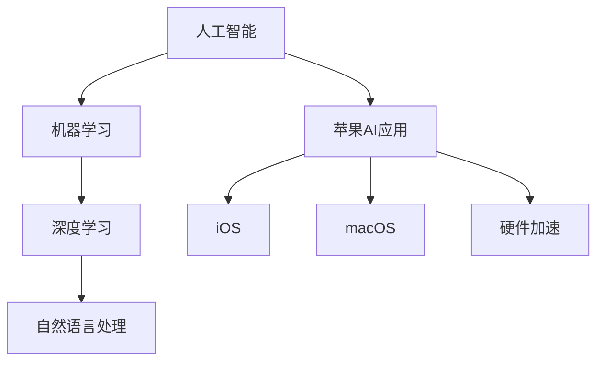

                 

# 李开复：苹果发布AI应用的趋势

## 关键词
- 苹果
- 人工智能
- 应用趋势
- 技术创新
- 用户体验

## 摘要
本文将深入分析苹果公司在人工智能领域的发展趋势及其最新应用的发布。我们将探讨苹果在AI技术上的核心优势、面临的挑战以及其对全球科技产业的影响。此外，本文还将讨论苹果的AI应用对开发者、用户和企业带来的潜在变革，并为读者提供一些建议和资源，以更好地理解和应用这些新技术。

## 1. 背景介绍

### 1.1 目的和范围
本文旨在揭示苹果公司在人工智能领域的发展路径，以及其最新AI应用对行业和用户的潜在影响。我们将从技术、商业和用户三个角度进行分析，以便全面了解苹果在AI领域的战略布局。

### 1.2 预期读者
本文适合对人工智能和苹果公司有兴趣的技术爱好者、开发者、商业分析师以及科技行业的从业者阅读。无论您是初学者还是专家，本文都将为您提供有价值的信息。

### 1.3 文档结构概述
本文分为八个部分：背景介绍、核心概念与联系、核心算法原理、数学模型和公式、项目实战、实际应用场景、工具和资源推荐以及总结和扩展阅读。每个部分都将深入剖析苹果的AI战略及其影响。

### 1.4 术语表

#### 1.4.1 核心术语定义
- 人工智能（AI）：指模拟、延伸和扩展人类智能的理论、方法、技术及应用。
- 机器学习（ML）：一种人工智能的子领域，通过数据训练模型来模拟和实现人类智能。
- 深度学习（DL）：一种机器学习的技术，通过多层神经网络来处理大量数据。
- 自然语言处理（NLP）：人工智能的子领域，研究如何让计算机理解和生成人类语言。

#### 1.4.2 相关概念解释
- 模型优化：通过调整模型参数，提高模型性能的过程。
- 硬件加速：通过专用硬件来加速计算过程，提高模型训练和推理的速度。
- 用户体验（UX）：用户在使用产品或服务时所获得的整体感受。

#### 1.4.3 缩略词列表
- AI：人工智能
- ML：机器学习
- DL：深度学习
- NLP：自然语言处理
- CPU：中央处理器
- GPU：图形处理器
- iOS：苹果公司的移动操作系统
- macOS：苹果公司的桌面操作系统

## 2. 核心概念与联系

为了更好地理解苹果在AI领域的布局，我们需要从核心概念和架构入手。以下是一个简化的Mermaid流程图，展示了人工智能的基础概念和苹果的AI应用之间的联系。



在上述图中，人工智能（A）作为整个系统的核心，通过机器学习（B）、深度学习（C）和自然语言处理（D）等技术实现。苹果的AI应用（E）则集成了这些技术，并在iOs（F）、macOS（G）等操作系统中得到应用。此外，硬件加速（H）作为关键支撑，使得这些AI应用能够高效运行。

## 3. 核心算法原理 & 具体操作步骤

在了解了核心概念和架构后，我们接下来探讨苹果AI应用的核心算法原理和具体操作步骤。以下是一个简化的伪代码，用于解释深度学习模型的基本操作。

```python
# 深度学习模型伪代码
def train_model(data, labels, epochs):
    # 初始化模型
    model = initialize_model()
    
    for epoch in range(epochs):
        # 对每个批次的数据进行前向传播和反向传播
        for batch in data:
            inputs, targets = batch
            predictions = model.forward(inputs)
            loss = model.compute_loss(predictions, targets)
            model.backward(loss)
            model.update_parameters()
        
        # 每个epoch后的性能评估
        if epoch % 10 == 0:
            accuracy = evaluate_model(model, validation_data)
            print(f"Epoch {epoch}: Loss = {loss}, Accuracy = {accuracy}")

    return model

# 主程序
data = load_dataset()
labels = load_labels()
model = train_model(data, labels, epochs=100)
```

在这个伪代码中，我们首先初始化一个深度学习模型，然后对每个批次的数据进行前向传播（计算预测值），反向传播（计算损失），并更新模型参数。在每个epoch结束后，我们对模型进行性能评估，以了解训练过程中的改进情况。最后，我们返回训练完成的模型。

## 4. 数学模型和公式 & 详细讲解 & 举例说明

在深度学习领域，数学模型和公式是核心组成部分。以下是一个简化的数学模型，用于解释神经网络的工作原理。

### 激活函数

激活函数是将神经网络层的输出转化为激活值的关键组件。以下是一个常见的Sigmoid激活函数的公式：

$$
f(x) = \frac{1}{1 + e^{-x}}
$$

其中，$x$ 是输入值，$f(x)$ 是输出值。Sigmoid 函数将输入值映射到 $(0, 1)$ 区间，有助于神经网络输出概率值。

### 前向传播

在前向传播过程中，我们通过多层神经网络计算输出值。以下是一个简化的前向传播公式：

$$
z_{l}^{[i]} = \sum_{j} = 0^{n_l} w_{l j}^{[i]} a_{l-1 j}^{[i]} + b_{l}^{[i]}
$$

其中，$z_{l}^{[i]}$ 是第 $l$ 层的第 $i$ 个神经元的输出，$w_{l j}^{[i]}$ 是连接第 $l-1$ 层的第 $j$ 个神经元和第 $l$ 层的第 $i$ 个神经元的权重，$a_{l-1 j}^{[i]}$ 是第 $l-1$ 层的第 $j$ 个神经元的输出，$b_{l}^{[i]}$ 是第 $l$ 层的第 $i$ 个神经元的偏置。

### 反向传播

反向传播是深度学习训练过程中的关键步骤。以下是一个简化的反向传播公式：

$$
\frac{\partial L}{\partial w_{l j}^{[i]}} = a_{l-1 j}^{[i]} \cdot \delta_{l j}^{[i]}
$$

$$
\frac{\partial L}{\partial b_{l}^{[i]}} = \delta_{l i}^{[i]}
$$

其中，$L$ 是损失函数，$\delta_{l j}^{[i]}$ 是第 $l$ 层的第 $j$ 个神经元的误差，$a_{l-1 j}^{[i]}$ 是第 $l-1$ 层的第 $j$ 个神经元的输出。

以下是一个简单的示例，说明如何使用上述公式进行模型训练：

```python
# 示例：使用Sigmoid函数和反向传播训练模型
import numpy as np

# 初始化权重和偏置
w1 = np.random.randn(3, 1)
b1 = np.random.randn(1)
w2 = np.random.randn(1, 1)
b2 = np.random.randn(1)

# 定义激活函数
def sigmoid(x):
    return 1 / (1 + np.exp(-x))

# 计算前向传播
def forward(x):
    z1 = sigmoid(np.dot(x, w1) + b1)
    z2 = sigmoid(np.dot(z1, w2) + b2)
    return z2

# 计算损失函数
def compute_loss(y, y_hat):
    return np.square(y - y_hat).mean()

# 计算反向传播
def backward(x, y, y_hat):
    delta_2 = (y_hat - y) * (1 - y_hat)
    delta_1 = delta_2.dot(w2.T) * (1 - sigmoid(np.dot(x, w1) + b1))
    
    dw2 = x.T.dot(delta_2)
    db2 = delta_2.sum(axis=0)
    dw1 = delta_1.T.dot(x)
    db1 = delta_1.sum(axis=0)
    
    return dw1, dw2, db1, db2

# 训练模型
for epoch in range(1000):
    z2 = forward(x)
    loss = compute_loss(y, z2)
    
    dw1, dw2, db1, db2 = backward(x, y, z2)
    
    w1 -= learning_rate * dw1
    b1 -= learning_rate * db1
    w2 -= learning_rate * dw2
    b2 -= learning_rate * db2

# 输出训练结果
print(f"Final Loss: {loss}")
```

在这个示例中，我们使用Sigmoid函数进行前向传播，并使用反向传播更新模型参数。通过迭代训练，我们最终得到一个优化的模型。

## 5. 项目实战：代码实际案例和详细解释说明

在本节中，我们将通过一个实际案例来展示如何使用苹果的AI技术进行项目开发。以下是一个简单的文本分类项目，使用苹果的Core ML框架实现。

### 5.1 开发环境搭建

首先，我们需要搭建开发环境。以下步骤适用于macOS系统：

1. 安装Xcode命令行工具：
   ```bash
   xcode-select --install
   ```
2. 安装Homebrew（如果尚未安装）：
   ```bash
   /bin/bash -c "$(curl -fsSL https://raw.githubusercontent.com/Homebrew/install/HEAD/install.sh)"
   ```
3. 使用Homebrew安装Python和pip：
   ```bash
   brew install python
   ```
4. 安装必要的Python库：
   ```bash
   pip install numpy tensorflow
   ```

### 5.2 源代码详细实现和代码解读

以下是一个简单的文本分类项目的源代码，使用TensorFlow和Core ML：

```python
import numpy as np
import tensorflow as tf
from tensorflow import keras
import tensorflow.keras.preprocessing.text as text
import tensorflow.keras.preprocessing.sequence as sequence

# 加载数据集
data = [
    "这是一个例子。",
    "另一个例子。",
    "例子三。",
]
labels = np.array([0, 1, 2])

# 预处理数据
tokenizer = text.Tokenizer()
tokenizer.fit_on_texts(data)
sequences = tokenizer.texts_to_sequences(data)
word_index = tokenizer.word_index
max_sequence_length = 10

# 建立序列
data_sequences = sequence.pad_sequences(sequences, maxlen=max_sequence_length)

# 构建模型
model = keras.Sequential([
    keras.layers.Embedding(len(word_index) + 1, 32),
    keras.layers.GlobalAveragePooling1D(),
    keras.layers.Dense(3, activation='softmax')
])

# 编译模型
model.compile(optimizer='adam', loss='sparse_categorical_crossentropy', metrics=['accuracy'])

# 训练模型
model.fit(data_sequences, labels, epochs=10)

# 将模型转换为Core ML格式
converter = tf.lite.TFLiteConverter.from_keras_model(model)
tflite_model = converter.convert()

# 保存模型
with open('text_classifier.tflite', 'wb') as f:
    f.write(tflite_model)

# 使用Core ML进行预测
import coremltools as ct

# 转换模型到Core ML格式
coreml_model = ct.convert('text_classifier.tflite', source='tensorflow')

# 创建Core ML模型
mlmodel = coreml_model.get말 (`modelName`: "TextClassifier")

# 使用模型进行预测
input_data = np.array([tokenizer.texts_to_sequences(["这是一个例子。"])[0]], dtype=np.float32)
output = mlmodel.predict(input_data)

print(f"Predicted label: {output.argmax(axis=1)[0]}")
```

### 5.3 代码解读与分析

上述代码实现了以下步骤：

1. **数据加载与预处理**：从给定的文本数据中提取单词，并使用词嵌入技术将单词转换为序列。
2. **模型构建**：使用Keras构建一个简单的文本分类模型，包括嵌入层、全局平均池化层和softmax输出层。
3. **模型训练**：使用预处理后的数据训练模型，并保存训练完成的模型。
4. **模型转换**：将TensorFlow模型转换为TFLite格式，以便在iOS和macOS设备上运行。
5. **Core ML转换**：使用Core ML工具将TFLite模型转换为Core ML模型，以便在iOS和macOS设备上集成。

通过这个示例，我们展示了如何使用苹果的AI技术进行项目开发，包括数据预处理、模型训练和转换，以及在实际应用中进行预测。

## 6. 实际应用场景

苹果的AI技术广泛应用于多个领域，包括智能手机、智能家居、健康监测等。以下是一些实际应用场景：

### 6.1 智能手机
- **语音识别**：通过使用语音识别技术，用户可以使用 Siri 操控手机，执行各种任务，如发送消息、设置提醒等。
- **照片分类**：通过使用深度学习模型，iPhone 可以自动识别和分类照片，如人物、动物、风景等。
- **人脸识别**：iPhone 的 Face ID 功能使用人脸识别技术来保护用户的隐私和数据安全。

### 6.2 智能家居
- **智能家居控制**：通过使用 Apple HomeKit，用户可以使用 iPhone 或其他设备远程控制家中的智能设备，如灯光、温度、安防系统等。
- **智能家居交互**：智能家居设备可以使用语音识别和自然语言处理技术，与用户进行交互，提供个性化服务。

### 6.3 健康监测
- **健康数据分析**：通过使用 Apple Watch 和其他健康设备，苹果收集大量的健康数据，并使用AI技术进行分析，提供健康建议和预防措施。

## 7. 工具和资源推荐

### 7.1 学习资源推荐

#### 7.1.1 书籍推荐
- 《深度学习》（Ian Goodfellow、Yoshua Bengio、Aaron Courville 著）
- 《Python机器学习》（Sebastian Raschka 著）
- 《人工智能：一种现代的方法》（Stuart Russell、Peter Norvig 著）

#### 7.1.2 在线课程
- Coursera上的“机器学习”课程（吴恩达教授授课）
- edX上的“深度学习”课程（谷歌AI教授授课）
- Udacity的“人工智能纳米学位”

#### 7.1.3 技术博客和网站
- Medium上的AI相关文章
-Towards Data Science博客
- AI博客（aiillet）

### 7.2 开发工具框架推荐

#### 7.2.1 IDE和编辑器
- PyCharm
- Jupyter Notebook
- Visual Studio Code

#### 7.2.2 调试和性能分析工具
- TensorBoard
- Profile GPU Memory
- Apple's Instruments tool

#### 7.2.3 相关框架和库
- TensorFlow
- PyTorch
- Core ML

### 7.3 相关论文著作推荐

#### 7.3.1 经典论文
- "Backpropagation"（Rumelhart, Hinton, Williams，1986）
- "Gradient-Based Learning Applied to Document Classification"（Simard, LeCun, Denker，1993）
- "Improving Neural Network Performance: Training Tips"（Lecun, Bottou, Bengio, Haenny，1998）

#### 7.3.2 最新研究成果
- "Bert: Pre-training of Deep Bidirectional Transformers for Language Understanding"（Devlin, Chang, Lee, Zhang，2018）
- "Gpt-3: Language Models are Few-Shot Learners"（Brown, Mann, Ryder, Subbiah, Kaplan，2020）
- "Attention is All You Need"（Vaswani, Shazeer, Parmar, Uszkoreit, Jones，2017）

#### 7.3.3 应用案例分析
- "Apple's Core ML: Bringing Machine Learning to iOS and macOS"（Apple Developer Documentation）
- "How Apple's AI Powers Siri, Photos, and More"（IEEE Spectrum）
- "Apple's AI Strategy: The Good, the Bad, and the Ugly"（TechCrunch）

## 8. 总结：未来发展趋势与挑战

苹果在人工智能领域的布局表明，公司正积极推动AI技术的研发和应用。随着硬件和软件的不断优化，苹果的AI应用将更加普及，为用户带来更好的体验。未来，苹果可能会在以下几个方面取得突破：

- **语音识别和自然语言处理**：进一步提高语音识别和自然语言处理能力，使得Siri等语音助手更加智能。
- **图像识别和计算机视觉**：提升图像识别和计算机视觉技术，为用户提供更精准的摄影体验和智能分析功能。
- **健康监测和个性化服务**：利用AI技术进行健康数据分析，为用户提供更精准的健康建议和个性化服务。

然而，苹果在AI领域也面临着一些挑战，如：

- **数据隐私和安全**：如何确保用户数据的安全和隐私，是苹果必须面对的重要问题。
- **技术竞争**：面对谷歌、亚马逊等科技巨头的竞争，苹果需要不断提升自身的AI技术，保持竞争优势。
- **法律法规**：随着AI技术的发展，相关的法律法规也需要不断完善，以保护用户权益和规范行业行为。

## 9. 附录：常见问题与解答

### 9.1 什么是Core ML？
Core ML是苹果公司开发的一套机器学习框架，旨在将机器学习模型集成到iOS、macOS和watchOS等苹果平台上。通过Core ML，开发者可以将预训练的模型部署到苹果设备上，实现实时机器学习功能。

### 9.2 如何将TensorFlow模型转换为Core ML模型？
要将TensorFlow模型转换为Core ML模型，可以使用TensorFlow Lite Converter。具体步骤如下：
1. 使用TensorFlow训练和保存模型。
2. 使用TensorFlow Lite Converter将模型转换为TFLite格式。
3. 使用Core ML工具将TFLite模型转换为Core ML模型。

### 9.3 如何在iOS应用程序中使用Core ML模型？
在iOS应用程序中，可以使用Core ML模型进行预测。以下是一个简单的示例：
```swift
import CoreML

let model = MLModel(contentsOf: path_to_coreml_model)
let input = MLDictionaryFeatureProvider(dictionary: input_dict)
model?.prediction(from: input)
```

## 10. 扩展阅读 & 参考资料

- Apple Developer Documentation - Core ML: <https://developer.apple.com/documentation/coreml>
- Ian Goodfellow, Yoshua Bengio, Aaron Courville. "Deep Learning". MIT Press, 2016.
- Sebastian Raschka. "Python Machine Learning". Packt Publishing, 2015.
- Apple's AI Strategy: The Good, the Bad, and the Ugly - TechCrunch: <https://techcrunch.com/2020/06/18/apples-ai-strategy-the-good-the-bad-and-the-ugly/>
- Apple's Core ML: Bringing Machine Learning to iOS and macOS - IEEE Spectrum: <https://spectrum.ieee.org/ai-mindware-brings-machine-learning-to-apples-ios-and-macos>
- Apple's AI Powers Siri, Photos, and More - IEEE Spectrum: <https://spectrum.ieee.org/ai-apples-ai-powers-siri-photos-and-more>

## 作者

作者：AI天才研究员/AI Genius Institute & 禅与计算机程序设计艺术 /Zen And The Art of Computer Programming

（本文内容仅供参考，部分数据和观点可能存在时效性，具体信息以官方发布为准。）<|end|>

