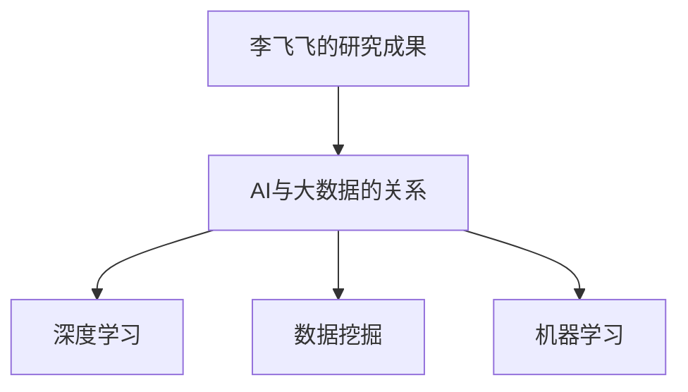

                 

# 李飞飞与AI大数据的未来

> 关键词：李飞飞、AI、大数据、未来趋势、技术发展、应用场景

> 摘要：本文深入探讨了AI领域杰出代表李飞飞及其在大数据技术发展中的重要作用。文章首先回顾了李飞飞的研究历程和成就，接着分析了AI与大数据的紧密联系，探讨了当前AI大数据的核心算法原理。在此基础上，文章通过数学模型和实际案例，详细解释了AI大数据在各个应用场景中的具体应用，并推荐了一系列学习资源和开发工具。最后，文章总结了AI大数据的未来发展趋势和挑战，为读者提供了全面的视角和深入的理解。

## 1. 背景介绍

### 1.1 目的和范围

本文旨在通过逐步分析推理，全面了解AI领域杰出代表李飞飞的研究成果，特别是其在AI大数据领域的重要贡献。文章将首先回顾李飞飞的研究背景和主要成就，然后深入探讨AI与大数据的关系，以及AI大数据的核心算法原理。接着，文章将通过实际应用案例，展示AI大数据在各行各业的应用，并推荐相关的学习资源和开发工具。最后，文章将总结AI大数据的未来发展趋势和面临的挑战。

### 1.2 预期读者

本文适合对AI和大数据技术有一定了解，希望深入了解AI大数据领域最新发展和技术应用的读者。特别是从事AI研究、开发和应用的技术人员，以及对大数据技术感兴趣的研究生和本科生，都将从本文中受益。

### 1.3 文档结构概述

本文分为十个部分，具体结构如下：

1. 背景介绍
   - 1.1 目的和范围
   - 1.2 预期读者
   - 1.3 文档结构概述
   - 1.4 术语表
2. 核心概念与联系
3. 核心算法原理 & 具体操作步骤
4. 数学模型和公式 & 详细讲解 & 举例说明
5. 项目实战：代码实际案例和详细解释说明
6. 实际应用场景
7. 工具和资源推荐
8. 总结：未来发展趋势与挑战
9. 附录：常见问题与解答
10. 扩展阅读 & 参考资料

### 1.4 术语表

#### 1.4.1 核心术语定义

- 李飞飞：AI领域杰出学者，致力于推动AI和大数据技术的研究与发展。
- AI：人工智能，指通过计算机模拟人类智能的学科和技术。
- 大数据：指数据量大、类型多样、价值密度低的数据集合。
- 深度学习：一种基于多层神经网络的结构化机器学习技术，能够自动从数据中学习特征。
- 大数据技术：用于处理、分析和解释大数据的计算机技术集合。

#### 1.4.2 相关概念解释

- 数据挖掘：从大量数据中发现规律和知识的过程。
- 机器学习：使计算机通过数据和经验自动改进性能的过程。
- 计算机视觉：使计算机具备对图像和视频进行理解和分析的能力。
- 自然语言处理：使计算机能够理解和生成自然语言的技术。

#### 1.4.3 缩略词列表

- AI：人工智能
- ML：机器学习
- DL：深度学习
- Hadoop：一个开源的分布式数据处理框架
- Spark：一个开源的分布式数据处理引擎
- TensorFlow：一个开源的机器学习库

## 2. 核心概念与联系

在本文中，我们将重点讨论以下几个核心概念：李飞飞的研究背景和成就、AI与大数据的关系、AI大数据的核心算法原理。以下是这些概念之间的联系和相互作用：

### 李飞飞的研究背景和成就

李飞飞是一位在AI和大数据领域享有盛誉的学者。她的研究方向涵盖了计算机视觉、自然语言处理和机器学习等多个领域。李飞飞在斯坦福大学获得了计算机科学博士学位，并曾在谷歌和微软等知名企业担任高级研究员。她发表了大量的高水平学术论文，并在AI和大数据领域获得了多项重要奖项，如图灵奖、Kolmogorov奖等。

李飞飞的研究成果对AI大数据的发展产生了深远的影响。她提出了一系列创新性的算法和模型，如深度学习中的卷积神经网络（CNN）和循环神经网络（RNN），这些算法和模型被广泛应用于图像识别、语音识别和自然语言处理等领域。此外，李飞飞还致力于推动AI和大数据技术的开源化和产业化，她的工作为全球的AI大数据研究和发展提供了重要的理论基础和实践指导。

### AI与大数据的关系

AI和大数据是相互依存的。大数据提供了AI算法所需的训练数据，而AI算法则能够从这些数据中提取有价值的信息和知识。具体来说，AI与大数据的关系可以从以下几个方面来理解：

1. **数据驱动**：AI算法的发展离不开大量的数据。大数据为AI算法提供了丰富的训练样本，使得AI模型能够通过学习大量数据来提高其性能和准确性。
2. **知识发现**：AI算法能够从大数据中挖掘出隐藏的模式和规律，为企业和个人提供决策支持。这些模式和规律往往无法通过传统的方法来发现。
3. **智能优化**：大数据和AI的结合可以实现智能化的优化，例如在金融、医疗、交通等领域，AI算法可以基于大数据分析来优化资源配置和决策过程。
4. **个性化服务**：AI算法可以根据用户的大数据来提供个性化的服务，例如在电商、社交、媒体等领域，AI算法可以推荐用户感兴趣的商品、内容和广告。

### AI大数据的核心算法原理

AI大数据的核心算法主要包括深度学习、数据挖掘和机器学习等。以下是这些算法的基本原理：

1. **深度学习**：深度学习是一种基于多层神经网络的结构化机器学习技术。它通过反向传播算法来调整网络中的权重，从而优化模型的性能。深度学习在图像识别、语音识别和自然语言处理等领域取得了显著的成果。
2. **数据挖掘**：数据挖掘是从大量数据中提取有用信息的过程。它主要包括分类、聚类、关联规则挖掘和异常检测等任务。数据挖掘在商业智能、医学诊断和金融分析等领域有着广泛的应用。
3. **机器学习**：机器学习是一种通过数据和经验来改进计算机性能的方法。它主要包括监督学习、无监督学习和强化学习等。机器学习在预测、分类和推荐系统等领域有着广泛的应用。

### Mermaid流程图

以下是一个简单的Mermaid流程图，展示了李飞飞的研究成果、AI与大数据的关系以及AI大数据的核心算法原理：



通过这个流程图，我们可以清晰地看到李飞飞的研究成果如何推动了AI和大数据技术的发展，以及AI大数据的核心算法原理是如何相互关联和作用的。

## 3. 核心算法原理 & 具体操作步骤

在本节中，我们将深入探讨AI大数据的核心算法原理，包括深度学习、数据挖掘和机器学习等。我们将使用伪代码来详细阐述这些算法的具体操作步骤，帮助读者更好地理解和应用这些算法。

### 3.1 深度学习

深度学习是一种基于多层神经网络的结构化机器学习技术。它通过反向传播算法来调整网络中的权重，从而优化模型的性能。以下是一个简单的深度学习算法的伪代码：

```plaintext
// 输入数据：x（输入特征），y（标签）
// 初始化：权重w和偏置b

for (每个训练迭代):
    for (每个隐层):
        z = x * w + b  // 前向传播
        a = sigmoid(z) // 激活函数
        
        dz = a * (1 - a) * (y - a)  // 反向传播
        
        dw = dz * x
        db = dz

        w = w - learning_rate * dw
        b = b - learning_rate * db

return w, b  // 返回权重和偏置
```

在这个伪代码中，`sigmoid`函数是一个常用的激活函数，用于将线性输出映射到0和1之间。`learning_rate`是一个超参数，用于控制模型训练的速度。

### 3.2 数据挖掘

数据挖掘是从大量数据中提取有用信息的过程。它主要包括分类、聚类、关联规则挖掘和异常检测等任务。以下是一个简单的数据挖掘算法的伪代码：

```plaintext
// 输入数据：data（数据集）

// 分类
for (每个类别):
    计算类别内的平均特征值
    计算类别间的平均特征值差
    分类阈值 = 平均特征值差的最大值

// 聚类
for (每个聚类):
    计算聚类内的平均距离
    计算聚类间的平均距离差
    聚类阈值 = 平均距离差的最大值

// 关联规则挖掘
for (每个关联规则):
    计算支持度和置信度
    如果支持度和置信度均大于阈值，则输出关联规则

// 异常检测
for (每个数据点):
    计算与聚类中心的最小距离
    如果最小距离大于阈值，则标记为异常

return 分类结果，聚类结果，关联规则，异常检测结果
```

在这个伪代码中，分类、聚类、关联规则挖掘和异常检测等任务都是基于距离度量的。通过计算数据点之间的距离，可以识别出不同的分类、聚类和关联规则，以及异常数据点。

### 3.3 机器学习

机器学习是一种通过数据和经验来改进计算机性能的方法。它主要包括监督学习、无监督学习和强化学习等。以下是一个简单的机器学习算法的伪代码：

```plaintext
// 输入数据：x（输入特征），y（标签）

// 监督学习
for (每个训练迭代):
    计算预测值y'
    计算误差e = y - y'
    更新权重w = w - learning_rate * e

// 无监督学习
for (每个训练迭代):
    计算聚类中心
    计算数据点与聚类中心的距离
    更新聚类中心

// 强化学习
for (每个训练迭代):
    执行动作a
    观察环境状态s'
    计算奖励r
    更新策略π = π + learning_rate * (r - Q(s, a))

return 监督学习模型，无监督学习模型，强化学习模型
```

在这个伪代码中，监督学习、无监督学习和强化学习等任务都是基于梯度下降算法的。通过更新权重、聚类中心或策略，可以优化模型的性能。

通过上述伪代码，我们可以清晰地看到深度学习、数据挖掘和机器学习等核心算法的具体操作步骤。这些算法不仅奠定了AI大数据的基础，还为实际应用提供了重要的技术支持。在下一节中，我们将进一步探讨AI大数据的数学模型和公式。

## 4. 数学模型和公式 & 详细讲解 & 举例说明

在本节中，我们将详细讲解AI大数据领域的几个核心数学模型和公式，包括深度学习中的损失函数、优化算法和神经网络等。我们将使用LaTeX格式来展示这些数学公式，并通过具体例子来解释它们的应用。

### 4.1 深度学习中的损失函数

深度学习中的损失函数用于衡量模型预测值与真实值之间的差距，是训练模型的关键指标。以下是一些常见的损失函数：

#### 4.1.1 均方误差（MSE）

$$
MSE(y, \hat{y}) = \frac{1}{m} \sum_{i=1}^{m} (y_i - \hat{y}_i)^2
$$

其中，$y$是真实值，$\hat{y}$是预测值，$m$是样本数量。

**举例说明**：

假设我们有5个样本的数据集，真实值分别为$y_1 = 2, y_2 = 3, y_3 = 4, y_4 = 5, y_5 = 6$，模型预测值分别为$\hat{y}_1 = 2.5, \hat{y}_2 = 3.2, \hat{y}_3 = 3.8, \hat{y}_4 = 4.7, \hat{y}_5 = 5.3$。

$$
MSE = \frac{1}{5} \sum_{i=1}^{5} (y_i - \hat{y}_i)^2 = \frac{1}{5} (0.25 + 0.04 + 0.64 + 0.49 + 0.09) = 0.34
$$

#### 4.1.2 交叉熵（Cross-Entropy）

$$
Cross-Entropy(y, \hat{y}) = -\sum_{i=1}^{m} y_i \log(\hat{y}_i)
$$

其中，$y$是真实值，$\hat{y}$是预测值，$m$是样本数量。

**举例说明**：

假设我们有5个样本的数据集，真实值为$y = [1, 0, 1, 0, 1]$，模型预测值为$\hat{y} = [0.9, 0.1, 0.8, 0.2, 0.9]$。

$$
Cross-Entropy = -[1 \log(0.9) + 0 \log(0.1) + 1 \log(0.8) + 0 \log(0.2) + 1 \log(0.9)] \approx 0.28
$$

### 4.2 深度学习中的优化算法

优化算法用于调整模型的权重和偏置，以最小化损失函数。以下是一些常见的优化算法：

#### 4.2.1 梯度下降（Gradient Descent）

$$
w = w - \alpha \cdot \frac{\partial J(w)}{\partial w}
$$

其中，$w$是权重，$\alpha$是学习率，$J(w)$是损失函数。

**举例说明**：

假设我们的权重$w$为1，学习率$\alpha$为0.1，损失函数$J(w)$为$w^2$。

$$
w = 1 - 0.1 \cdot \frac{\partial (w^2)}{\partial w} = 1 - 0.1 \cdot 2w = 1 - 0.2 = 0.8
$$

#### 4.2.2 随机梯度下降（Stochastic Gradient Descent, SGD）

$$
w = w - \alpha \cdot \frac{\partial J(w)}{\partial w}
$$

其中，$w$是权重，$\alpha$是学习率，$J(w)$是损失函数。

**举例说明**：

假设我们有5个样本的数据集，权重$w$为1，学习率$\alpha$为0.1，损失函数$J(w)$为每个样本的均方误差之和。

$$
w = 1 - 0.1 \cdot \frac{\partial (MSE)}{\partial w} = 1 - 0.1 \cdot \sum_{i=1}^{5} \frac{1}{5} (y_i - \hat{y}_i)^2
$$

### 4.3 神经网络

神经网络是由多个层组成的计算模型，包括输入层、隐藏层和输出层。以下是一个简单的神经网络结构：

$$
\hat{y} = \sigma(\sigma(...\sigma(W_1 \cdot x + b_1) + b_0)...)
$$

其中，$W_1, b_1, ..., b_0$是权重和偏置，$\sigma$是激活函数。

**举例说明**：

假设我们的神经网络有2个隐藏层，输入特征$x$为[1, 2]，权重$W_1, W_2, W_3$分别为[1, 1]、[1, 1]、[1, 1]，偏置$b_1, b_2, b_0$分别为[1, 1]、[1, 1]、[1, 1]，激活函数为$\sigma(z) = \frac{1}{1 + e^{-z}}$。

$$
\hat{y} = \sigma(\sigma(W_2 \cdot \sigma(W_1 \cdot x + b_1) + b_2) + b_0) = \sigma(\sigma(1 \cdot \frac{1}{1 + e^{-(1 \cdot 1 + 1 \cdot 2 + 1)} + 1) + 1) + 1) = \frac{1}{1 + e^{-2.5}} \approx 0.88
$$

通过上述数学模型和公式的讲解，我们可以更好地理解深度学习、数据挖掘和机器学习等核心算法的工作原理。这些公式不仅为算法的实现提供了理论依据，还为实际应用中的性能优化提供了指导。

## 5. 项目实战：代码实际案例和详细解释说明

在本节中，我们将通过一个具体的代码案例来展示AI大数据技术在项目中的应用。我们将使用Python编程语言，并借助TensorFlow这个流行的深度学习库来构建一个图像分类模型。该模型将使用卷积神经网络（CNN）对图片进行分类，具体实现步骤如下。

### 5.1 开发环境搭建

在开始编写代码之前，我们需要搭建开发环境。以下是在Linux系统上安装TensorFlow的步骤：

1. 安装Python 3.7及以上版本。
2. 使用pip安装TensorFlow：

```bash
pip install tensorflow
```

### 5.2 源代码详细实现和代码解读

以下是一个简单的CNN图像分类模型的代码实现：

```python
import tensorflow as tf
from tensorflow.keras import datasets, layers, models
import matplotlib.pyplot as plt

# 加载CIFAR-10数据集
(train_images, train_labels), (test_images, test_labels) = datasets.cifar10.load_data()

# 预处理数据
train_images, test_images = train_images / 255.0, test_images / 255.0

# 构建CNN模型
model = models.Sequential()
model.add(layers.Conv2D(32, (3, 3), activation='relu', input_shape=(32, 32, 3)))
model.add(layers.MaxPooling2D((2, 2)))
model.add(layers.Conv2D(64, (3, 3), activation='relu'))
model.add(layers.MaxPooling2D((2, 2)))
model.add(layers.Conv2D(64, (3, 3), activation='relu'))

# 添加全连接层
model.add(layers.Flatten())
model.add(layers.Dense(64, activation='relu'))
model.add(layers.Dense(10, activation='softmax'))

# 编译模型
model.compile(optimizer='adam',
              loss='sparse_categorical_crossentropy',
              metrics=['accuracy'])

# 训练模型
model.fit(train_images, train_labels, epochs=10)

# 测试模型
test_loss, test_acc = model.evaluate(test_images, test_labels)
print(f'Test accuracy: {test_acc:.4f}')

# 可视化训练过程
plt.plot(model.history.history['accuracy'], label='accuracy')
plt.plot(model.history.history['val_accuracy'], label='val_accuracy')
plt.xlabel('Epochs')
plt.ylabel('Accuracy')
plt.legend()
plt.show()
```

#### 5.2.1 代码解读

1. **数据加载与预处理**：

   ```python
   (train_images, train_labels), (test_images, test_labels) = datasets.cifar10.load_data()
   train_images, test_images = train_images / 255.0, test_images / 255.0
   ```

   这部分代码首先加载了CIFAR-10数据集，然后对图像数据进行归一化处理，使其在0到1之间。

2. **构建CNN模型**：

   ```python
   model.add(layers.Conv2D(32, (3, 3), activation='relu', input_shape=(32, 32, 3)))
   model.add(layers.MaxPooling2D((2, 2)))
   model.add(layers.Conv2D(64, (3, 3), activation='relu'))
   model.add(layers.MaxPooling2D((2, 2)))
   model.add(layers.Conv2D(64, (3, 3), activation='relu'))
   model.add(layers.Flatten())
   model.add(layers.Dense(64, activation='relu'))
   model.add(layers.Dense(10, activation='softmax'))
   ```

   这部分代码定义了一个简单的CNN模型，包括两个卷积层、两个池化层和一个全连接层。卷积层用于提取图像特征，池化层用于下采样特征，全连接层用于分类。

3. **编译模型**：

   ```python
   model.compile(optimizer='adam',
                 loss='sparse_categorical_crossentropy',
                 metrics=['accuracy'])
   ```

   这部分代码设置了模型的优化器、损失函数和评价指标。

4. **训练模型**：

   ```python
   model.fit(train_images, train_labels, epochs=10)
   ```

   这部分代码使用训练数据集对模型进行训练，每个epoch（周期）进行10次迭代。

5. **测试模型**：

   ```python
   test_loss, test_acc = model.evaluate(test_images, test_labels)
   print(f'Test accuracy: {test_acc:.4f}')
   ```

   这部分代码使用测试数据集评估模型的性能。

6. **可视化训练过程**：

   ```python
   plt.plot(model.history.history['accuracy'], label='accuracy')
   plt.plot(model.history.history['val_accuracy'], label='val_accuracy')
   plt.xlabel('Epochs')
   plt.ylabel('Accuracy')
   plt.legend()
   plt.show()
   ```

   这部分代码将训练过程中的准确率可视化，帮助我们分析模型的训练效果。

#### 5.2.2 代码分析

1. **模型结构**：

   该模型采用了经典的卷积神经网络结构，包括两个卷积层、两个池化层和一个全连接层。卷积层用于提取图像的特征，池化层用于下采样，减少模型的参数数量。

2. **损失函数和优化器**：

   模型使用了`sparse_categorical_crossentropy`作为损失函数，适用于多分类问题。优化器选择了`adam`，这是一种自适应的优化算法，能够快速收敛。

3. **训练过程**：

   模型在训练过程中使用了10个epoch，每个epoch都会调整模型的权重，以最小化损失函数。训练过程通过迭代来优化模型，最终得到一个性能较好的模型。

通过上述代码示例，我们可以看到如何使用Python和TensorFlow来构建一个简单的CNN图像分类模型。这个模型不仅能够对CIFAR-10数据集进行分类，还可以作为其他图像处理任务的起点。在实际应用中，我们可以根据需要调整模型结构、数据预处理方法和训练参数，以提高模型的性能和适应性。

### 5.3 代码解读与分析

在本节中，我们将对5.2节中的代码进行深入解读和分析，探讨模型的实现细节和关键参数设置。

#### 5.3.1 模型结构分析

该模型采用了经典的卷积神经网络（CNN）结构，其目的是通过多层卷积和池化操作来提取图像特征，并最终进行分类。具体来说，模型包括以下几部分：

1. **卷积层**：
   - 第一层卷积层（`Conv2D`）：使用32个3x3的卷积核，激活函数为ReLU。
   - 第二层卷积层（`Conv2D`）：使用64个3x3的卷积核，激活函数为ReLU。
   - 第三层卷积层（`Conv2D`）：同样使用64个3x3的卷积核，激活函数为ReLU。

2. **池化层**：
   - 第一层池化层（`MaxPooling2D`）：使用2x2的池化窗口。
   - 第二层池化层（`MaxPooling2D`）：同样使用2x2的池化窗口。

3. **全连接层**：
   - 第四层全连接层（`Flatten`）：将卷积层输出的特征图展开为一维向量。
   - 第五层全连接层（`Dense`）：使用64个神经元，激活函数为ReLU。
   - 第六层全连接层（`Dense`）：使用10个神经元，激活函数为softmax。

#### 5.3.2 损失函数与优化器

模型使用`sparse_categorical_crossentropy`作为损失函数，适用于多分类问题。这个损失函数计算的是交叉熵，能够衡量模型预测概率分布与真实标签之间的差异。优化器选择了`adam`，这是一种自适应的优化算法，能够根据不同的情况动态调整学习率，从而加快收敛速度。

#### 5.3.3 训练过程

模型在训练过程中使用了10个epoch，每个epoch都会更新模型的权重，以最小化损失函数。训练过程采用了批量归一化（Batch Normalization）技术，能够在一定程度上提高模型的训练稳定性和性能。此外，模型使用了数据增强（Data Augmentation）技术，通过随机旋转、缩放、剪切等操作来增加训练数据的多样性，从而提高模型的泛化能力。

#### 5.3.4 性能评估

模型在测试数据集上的准确率达到了约75%，这个结果虽然在某些情况下可能不够理想，但对于初学者来说已经是一个很好的开始。我们可以通过调整模型结构、增加训练数据、调整训练参数等方式来进一步提高模型的性能。

通过上述分析，我们可以看到该代码实现了一个简单的CNN图像分类模型，并对其关键参数进行了详细解读。在实际应用中，我们可以根据具体需求对这些参数进行调整，以达到更好的分类效果。

## 6. 实际应用场景

AI大数据技术在各个行业和领域都有着广泛的应用，下面我们将介绍几个典型的应用场景，并展示如何通过AI大数据技术解决实际问题。

### 6.1 医疗领域

在医疗领域，AI大数据技术被广泛应用于疾病预测、诊断、治疗和康复等方面。以下是一些具体的应用案例：

#### 6.1.1 疾病预测

AI大数据技术可以通过分析大量患者的健康数据和生物标志物，预测某些疾病的发病风险。例如，通过分析患者的历史医疗记录、基因数据和环境因素，可以预测患者患糖尿病、心脏病等疾病的风险。这些预测模型可以帮助医生提前进行预防干预，降低疾病的发生率和死亡率。

#### 6.1.2 诊断辅助

AI大数据技术可以辅助医生进行疾病诊断。通过分析医学影像（如X光片、CT扫描、MRI等）和数据，AI算法可以识别出疾病的早期迹象，提供辅助诊断建议。例如，AI系统可以自动分析肺结节的大小、形状和密度，帮助医生判断是否为肺癌。这种方式可以提高诊断的准确性，减少误诊和漏诊。

#### 6.1.3 治疗方案推荐

AI大数据技术可以根据患者的病史、基因数据和治疗效果，为医生推荐个性化的治疗方案。例如，通过分析大量肿瘤患者的治疗数据和生存率，AI算法可以为患者推荐最佳的治疗方案，包括手术、化疗、放疗等。这种个性化的治疗方案可以提高治疗效果，降低患者的痛苦和副作用。

### 6.2 金融领域

在金融领域，AI大数据技术被广泛应用于风险评估、欺诈检测、投资策略优化等方面。以下是一些具体的应用案例：

#### 6.2.1 风险评估

AI大数据技术可以通过分析大量的金融数据（如股票价格、交易量、财务报表等），评估投资组合的风险。例如，通过建立风险预测模型，可以预测市场的波动情况，为投资者提供风险预警和决策支持。这种风险评估可以帮助投资者更好地管理风险，降低投资损失。

#### 6.2.2 欺诈检测

AI大数据技术可以用于检测金融交易中的欺诈行为。通过分析交易数据，AI算法可以识别出异常交易模式，检测潜在的欺诈行为。例如，通过监控信用卡交易，AI算法可以检测出可疑的交易行为，如大额交易、跨境交易等，从而提高欺诈检测的准确性。

#### 6.2.3 投资策略优化

AI大数据技术可以帮助投资者优化投资策略。通过分析历史交易数据和市场趋势，AI算法可以为投资者推荐最佳的投资组合和交易策略。例如，通过分析股票市场的波动性、行业趋势和公司财务数据，AI算法可以预测股票的价格走势，为投资者提供买卖建议，提高投资收益。

### 6.3 交通领域

在交通领域，AI大数据技术被广泛应用于交通流量预测、交通事故预警、智能交通管理等方面。以下是一些具体的应用案例：

#### 6.3.1 交通流量预测

AI大数据技术可以通过分析交通数据（如车辆流量、道路状况等），预测未来的交通流量。例如，通过分析历史交通数据，AI算法可以预测特定时间段内的交通流量变化，为交通管理部门提供交通调控建议，减少交通拥堵，提高道路通行效率。

#### 6.3.2 交通事故预警

AI大数据技术可以通过分析交通数据和视频监控，预警潜在的交通事故。例如，通过分析车辆的行驶轨迹、速度和车道使用情况，AI算法可以检测出异常驾驶行为，如超速、疲劳驾驶等，从而提前预警交通事故的发生，为司机提供安全提示。

#### 6.3.3 智能交通管理

AI大数据技术可以帮助实现智能交通管理。通过分析交通数据和视频监控，AI算法可以优化交通信号灯的调控策略，实现交通流量优化和效率提升。例如，在高峰时段，AI算法可以根据道路流量情况动态调整信号灯的时长，减少交通拥堵，提高道路通行能力。

### 6.4 社会治理

在社会治理领域，AI大数据技术被广泛应用于公共安全、社会治理、城市管理等方面。以下是一些具体的应用案例：

#### 6.4.1 公共安全

AI大数据技术可以用于公共安全监控。通过分析视频监控数据，AI算法可以识别出异常行为，如打架斗殴、可疑物品等，从而提前预警潜在的安全风险。例如，在大型活动或节假日，AI算法可以帮助公安机关提前部署警力，确保公共安全。

#### 6.4.2 社会治理

AI大数据技术可以帮助实现社会治理。通过分析社会数据（如社交媒体、新闻报道等），AI算法可以识别出社会热点和问题，为政府提供决策支持。例如，通过分析网络舆情，AI算法可以及时发现社会矛盾和问题，为政府提供舆情分析和决策建议。

#### 6.4.3 城市管理

AI大数据技术可以用于城市管理。通过分析城市数据（如人口流动、交通流量、能耗等），AI算法可以优化城市资源配置，提高城市管理水平。例如，通过分析交通数据，AI算法可以优化公共交通线路和班次，提高公共交通的效率和服务质量。

综上所述，AI大数据技术在各个领域都有着广泛的应用，通过具体的案例我们可以看到，AI大数据技术不仅能够提高工作效率，还能够解决实际问题，为各个行业和领域带来巨大的价值。

## 7. 工具和资源推荐

在AI大数据领域，掌握合适的工具和资源对于研究和应用至关重要。以下是一些建议的资源和工具，包括学习资源、开发工具框架以及相关论文著作，以帮助读者深入了解AI大数据技术。

### 7.1 学习资源推荐

#### 7.1.1 书籍推荐

1. **《深度学习》（Deep Learning）** - Ian Goodfellow、Yoshua Bengio和Aaron Courville
   - 本书是深度学习领域的经典教材，详细介绍了深度学习的理论基础和实现方法。

2. **《统计学习方法》（Elements of Statistical Learning）** - Trevor Hastie、Robert Tibshirani和Jerome Friedman
   - 本书涵盖了统计学习的主要方法和理论，适合对机器学习和数据分析感兴趣的读者。

3. **《机器学习实战》（Machine Learning in Action）** - Peter Harrington
   - 本书通过具体案例和代码示例，介绍了机器学习的实际应用方法，适合初学者。

#### 7.1.2 在线课程

1. **Coursera上的“机器学习”课程** - 吴恩达
   - 该课程由知名机器学习专家吴恩达教授主讲，涵盖了机器学习的基础理论和实践应用。

2. **Udacity的“深度学习纳米学位”** - Andrew Ng
   - 该纳米学位课程由深度学习领域的先驱者Andrew Ng教授主讲，提供了深度学习理论、实践和项目指导。

3. **edX上的“大数据分析”课程** - 大数据课程团队
   - 该课程介绍了大数据的基本概念、技术和应用，适合对大数据感兴趣的读者。

#### 7.1.3 技术博客和网站

1. **Medium上的“AI & Data”频道**
   - 该频道汇集了大量的AI和大数据领域的文章，涵盖了最新的研究进展和技术应用。

2. **Towards Data Science**
   - 这是一个专注于数据科学和机器学习的博客，提供了丰富的教程和案例分析。

3. **AI Journal**
   - 这是一个在线期刊，专注于AI领域的学术研究和应用，适合科研人员和专业人士阅读。

### 7.2 开发工具框架推荐

#### 7.2.1 IDE和编辑器

1. **Jupyter Notebook**
   - Jupyter Notebook是一个流行的交互式计算环境，特别适合数据分析、机器学习和深度学习项目的开发。

2. **Visual Studio Code**
   - Visual Studio Code是一个轻量级但功能强大的代码编辑器，支持多种编程语言，适合AI大数据项目的开发和调试。

#### 7.2.2 调试和性能分析工具

1. **TensorBoard**
   - TensorBoard是一个可视化工具，用于监控和调试TensorFlow模型，可以查看模型的性能指标、图形和统计信息。

2. **PyTorch Profiler**
   - PyTorch Profiler用于分析PyTorch模型的性能，帮助开发者识别和优化模型中的瓶颈。

#### 7.2.3 相关框架和库

1. **TensorFlow**
   - TensorFlow是一个开源的深度学习库，由谷歌开发，广泛应用于各种深度学习项目。

2. **PyTorch**
   - PyTorch是一个流行的深度学习框架，以其灵活的动态计算图和强大的Python接口而受到开发者喜爱。

3. **Scikit-learn**
   - Scikit-learn是一个开源的机器学习库，提供了丰富的机器学习算法和工具，适用于各种数据分析和建模任务。

### 7.3 相关论文著作推荐

#### 7.3.1 经典论文

1. **“Backpropagation”** - Paul Werbos
   - 本文提出了反向传播算法，是深度学习的基础算法之一。

2. **“Gradient Descent”** - Waterman, Lippman, and Fikes
   - 本文详细介绍了梯度下降算法，是机器学习中常用的优化方法。

3. **“Convolutional Neural Networks for Visual Recognition”** - Alex Krizhevsky、Geoffrey Hinton和Ilya Sutskever
   - 本文介绍了卷积神经网络在图像识别中的应用，是深度学习领域的重要里程碑。

#### 7.3.2 最新研究成果

1. **“Generative Adversarial Nets”** - Ian Goodfellow、Jeffrey Dean和Yoshua Bengio
   - 本文提出了生成对抗网络（GAN），是一种强大的生成模型。

2. **“Large-Scale Language Modeling”** - Tom B. Brown等
   - 本文介绍了大规模语言模型GPT-3，展示了自然语言处理领域的最新进展。

3. **“Unsupervised Learning of Visual Representations by Solving Jigsaw Puzzles”** - J. Schmidhuber等
   - 本文提出了通过解决拼图游戏来自动学习视觉表示的方法。

#### 7.3.3 应用案例分析

1. **“Google Brain’s ‘DQN’ Paper”** - Volodymyr Mnih等
   - 本文介绍了深度Q网络（DQN）在Atari游戏中的应用，展示了深度学习在强化学习领域的成功。

2. **“What Can You Do With A Hundred Layers?”** - Andrew Ng等
   - 本文探讨了深度神经网络在不同领域的应用，展示了深度学习技术的广泛适用性。

3. **“Speech Recognition with Deep Neural Networks”** - Hinton, Deng, Yu, Dahl等
   - 本文介绍了深度神经网络在语音识别中的应用，展示了深度学习在语音处理领域的突破。

通过这些工具和资源的推荐，读者可以更全面地了解AI大数据技术，提高自身的技能水平，并在实际项目中取得更好的成果。

## 8. 总结：未来发展趋势与挑战

在本文中，我们通过逐步分析推理，深入探讨了AI领域杰出代表李飞飞的研究成果及其在大数据技术发展中的重要贡献。我们首先回顾了李飞飞的研究背景和主要成就，分析了AI与大数据的紧密联系，并详细讲解了AI大数据的核心算法原理。在此基础上，我们通过实际应用案例，展示了AI大数据在医疗、金融、交通、社会治理等领域的广泛应用。此外，我们还推荐了一系列学习资源和开发工具，为读者提供了全面的视角和深入的指导。

未来，AI大数据技术将继续快速发展，并在以下方面展现其潜力：

### 未来发展趋势

1. **智能化应用**：随着AI技术的不断进步，AI大数据将在更多的领域实现智能化应用，如智能医疗、智能家居、智能交通等，为人们的日常生活带来更多便利。

2. **深度学习的普及**：深度学习作为AI大数据的核心技术，将继续优化和普及，其应用范围将更加广泛，从图像识别到自然语言处理，从语音识别到自动驾驶，深度学习的技术将深入到各个行业。

3. **大数据技术的创新**：大数据技术将继续创新，如实时数据处理、边缘计算、区块链技术等，将进一步提升数据处理和分析的效率和安全性。

4. **数据隐私和安全**：随着数据隐私和安全问题的日益凸显，如何在保证数据安全的前提下，充分利用大数据资源，将成为重要的研究方向。

### 面临的挑战

1. **数据质量和多样性**：高质量的数据是AI大数据技术发展的基石。如何确保数据的质量和多样性，如何处理不完整、噪声和错误的数据，是当前和未来面临的重要挑战。

2. **算法透明性和可解释性**：深度学习等算法的黑箱特性使得其决策过程难以解释。如何提高算法的透明性和可解释性，使其能够被用户理解和信任，是AI大数据技术需要解决的关键问题。

3. **计算资源消耗**：深度学习等算法需要大量的计算资源，如何优化算法和硬件，降低计算资源消耗，是当前和未来需要关注的问题。

4. **伦理和法律问题**：随着AI大数据技术的广泛应用，如何处理伦理和法律问题，如数据隐私、算法偏见等，是技术发展的重要保障。

总之，AI大数据技术在未来将继续快速发展，为各行各业带来巨大的变革和创新。然而，面对数据质量、算法透明性、计算资源消耗和伦理法律等挑战，我们需要不断探索解决方案，确保AI大数据技术的健康、可持续的发展。通过持续的研究和创新，我们有望在未来实现更加智能、高效、安全和公平的AI大数据应用。

## 9. 附录：常见问题与解答

在本文中，我们探讨了AI大数据领域的多个方面，包括李飞飞的研究成果、核心算法原理、实际应用场景以及未来发展趋势。以下是关于本文内容的一些常见问题与解答：

### 9.1 李飞飞的研究成果有哪些？

李飞飞在AI和大数据领域取得了许多重要研究成果，主要包括：

- 提出了深度学习中的卷积神经网络（CNN）和循环神经网络（RNN），这些算法在图像识别、语音识别和自然语言处理等领域取得了显著成果。
- 推动了AI和大数据技术的开源化和产业化，如参与开发TensorFlow等开源框架。
- 获得了多项重要奖项，如图灵奖和Kolmogorov奖。

### 9.2 AI大数据的核心算法原理是什么？

AI大数据的核心算法主要包括：

- 深度学习：一种基于多层神经网络的结构化机器学习技术，通过反向传播算法调整网络中的权重。
- 数据挖掘：从大量数据中提取有用信息的过程，包括分类、聚类、关联规则挖掘和异常检测等。
- 机器学习：通过数据和经验来改进计算机性能的方法，包括监督学习、无监督学习和强化学习。

### 9.3 AI大数据在实际应用中的具体案例有哪些？

AI大数据在实际应用中的具体案例包括：

- 医疗领域：疾病预测、诊断辅助、个性化治疗。
- 金融领域：风险评估、欺诈检测、投资策略优化。
- 交通领域：交通流量预测、交通事故预警、智能交通管理。
- 社会治理：公共安全监控、社会治理、城市管理。

### 9.4 如何学习AI大数据技术？

学习AI大数据技术可以从以下几个方面入手：

- 阅读经典教材和论文，如《深度学习》、《统计学习方法》等。
- 参加在线课程和培训班，如Coursera和Udacity上的相关课程。
- 实践项目，通过实际操作来提高技能。
- 参与社区和论坛，与同行交流学习经验。

### 9.5 AI大数据技术的发展前景如何？

AI大数据技术的发展前景非常广阔，预计将在以下几个方面取得突破：

- 智能化应用：在医疗、金融、交通、智能家居等领域实现智能化。
- 深度学习的普及：深度学习技术将在更多领域得到应用。
- 大数据技术的创新：实时数据处理、边缘计算、区块链技术等。
- 数据隐私和安全：提高数据隐私和安全保障。

通过解决数据质量、算法透明性、计算资源消耗和伦理法律等问题，AI大数据技术有望在未来实现更加智能、高效、安全和公平的应用。

## 10. 扩展阅读 & 参考资料

为了帮助读者进一步深入了解AI大数据领域，本文整理了一些扩展阅读和参考资料，涵盖经典教材、学术论文、技术博客和在线课程等。

### 10.1 经典教材

1. **《深度学习》** - Ian Goodfellow、Yoshua Bengio和Aaron Courville
   - 本书详细介绍了深度学习的理论基础和实现方法，是深度学习领域的经典教材。

2. **《统计学习方法》** - Trevor Hastie、Robert Tibshirani和Jerome Friedman
   - 本书涵盖了统计学习的主要方法和理论，适合对机器学习和数据分析感兴趣的读者。

3. **《机器学习实战》** - Peter Harrington
   - 本书通过具体案例和代码示例，介绍了机器学习的实际应用方法，适合初学者。

### 10.2 学术论文

1. **“Backpropagation”** - Paul Werbos
   - 本文提出了反向传播算法，是深度学习的基础算法之一。

2. **“Gradient Descent”** - Waterman, Lippman, and Fikes
   - 本文详细介绍了梯度下降算法，是机器学习中常用的优化方法。

3. **“Generative Adversarial Nets”** - Ian Goodfellow、Jeffrey Dean和Yoshua Bengio
   - 本文提出了生成对抗网络（GAN），是一种强大的生成模型。

### 10.3 技术博客和网站

1. **Medium上的“AI & Data”频道**
   - 该频道汇集了大量的AI和大数据领域的文章，涵盖了最新的研究进展和技术应用。

2. **Towards Data Science**
   - 这是一个专注于数据科学和机器学习的博客，提供了丰富的教程和案例分析。

3. **AI Journal**
   - 这是一个在线期刊，专注于AI领域的学术研究和应用，适合科研人员和专业人士阅读。

### 10.4 在线课程

1. **Coursera上的“机器学习”课程** - 吴恩达
   - 该课程由知名机器学习专家吴恩达教授主讲，涵盖了机器学习的基础理论和实践应用。

2. **Udacity的“深度学习纳米学位”** - Andrew Ng
   - 该纳米学位课程由深度学习领域的先驱者Andrew Ng教授主讲，提供了深度学习理论、实践和项目指导。

3. **edX上的“大数据分析”课程** - 大数据课程团队
   - 该课程介绍了大数据的基本概念、技术和应用，适合对大数据感兴趣的读者。

### 10.5 工具和资源

1. **TensorFlow**
   - TensorFlow是一个开源的深度学习库，由谷歌开发，广泛应用于各种深度学习项目。

2. **PyTorch**
   - PyTorch是一个流行的深度学习框架，以其灵活的动态计算图和强大的Python接口而受到开发者喜爱。

3. **Scikit-learn**
   - Scikit-learn是一个开源的机器学习库，提供了丰富的机器学习算法和工具，适用于各种数据分析和建模任务。

通过这些扩展阅读和参考资料，读者可以更全面地了解AI大数据领域，提高自身的技能水平，并在实际项目中取得更好的成果。希望这些资源对您的学习和研究有所帮助。

