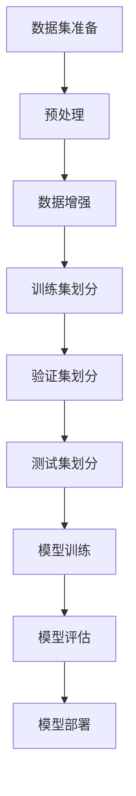
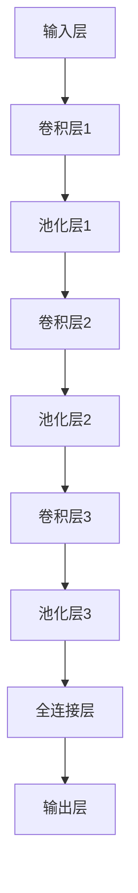

                 


# 李飞飞与ImageNet的贡献

> 关键词：李飞飞，ImageNet，深度学习，计算机视觉，人工智能，图像识别，大数据

> 摘要：本文将探讨李飞飞及其团队在ImageNet项目中的开创性贡献。文章首先介绍了ImageNet项目的背景和目的，然后详细分析了李飞飞在该项目中的核心作用，以及该项目对计算机视觉和人工智能领域带来的深远影响。随后，文章将探讨ImageNet项目的技术原理和实现步骤，并通过数学模型和实际案例来解释其工作原理。最后，文章将对ImageNet项目的应用场景、未来发展以及相关资源进行总结。

## 1. 背景介绍

### 1.1 目的和范围

本文旨在探讨李飞飞及其团队在ImageNet项目中的贡献，分析该项目对计算机视觉和人工智能领域的深远影响。文章将涵盖以下内容：

- ImageNet项目的起源和目的
- 李飞飞在项目中的核心作用
- ImageNet项目的技术原理和实现步骤
- ImageNet项目的数学模型和公式
- ImageNet项目的实际应用案例
- ImageNet项目的未来发展
- 相关学习资源和工具推荐

### 1.2 预期读者

本文适合以下读者群体：

- 计算机视觉和人工智能领域的科研人员
- 深度学习算法工程师
- 图像识别技术爱好者
- 对人工智能有浓厚兴趣的程序员
- 计算机科学和电子工程专业的学生

### 1.3 文档结构概述

本文按照以下结构进行组织：

- 引言：介绍ImageNet项目的背景和目的
- 核心概念与联系：分析ImageNet项目的技术原理和架构
- 核心算法原理 & 具体操作步骤：详细解释ImageNet项目的工作流程
- 数学模型和公式 & 详细讲解 & 举例说明：阐述ImageNet项目的数学基础
- 项目实战：展示ImageNet项目的实际应用案例
- 实际应用场景：分析ImageNet项目的应用场景
- 工具和资源推荐：推荐相关学习资源和开发工具
- 总结：总结ImageNet项目的未来发展趋势和挑战
- 附录：常见问题与解答
- 扩展阅读 & 参考资料：提供更多相关文献和资料

### 1.4 术语表

#### 1.4.1 核心术语定义

- ImageNet：一个大规模的视觉识别数据库，包含超过1400万个标注的图像。
- 标签（Label）：图像所属的类别名称。
- 深度学习（Deep Learning）：一种基于多层神经网络的人工智能技术，用于特征学习和模式识别。
- 卷积神经网络（CNN）：一种深度学习模型，广泛应用于图像识别和计算机视觉领域。
- 训练集（Training Set）：用于训练模型的图像数据集。
- 验证集（Validation Set）：用于评估模型性能的图像数据集。
- 测试集（Test Set）：用于测试模型性能的图像数据集。

#### 1.4.2 相关概念解释

- 图像识别（Image Recognition）：通过计算机算法对图像中的对象、场景或动作进行识别和分类的技术。
- 数据集（Dataset）：包含图像及其对应标签的集合，用于训练和评估模型。
- 深度学习框架（Deep Learning Framework）：用于构建、训练和部署深度学习模型的软件库，如TensorFlow、PyTorch等。
- 超参数（Hyperparameter）：深度学习模型的参数，需要在训练过程中进行调优。

#### 1.4.3 缩略词列表

- CNN：卷积神经网络
- DNN：深度神经网络
- RNN：循环神经网络
- LSTM：长短期记忆网络
- GPU：图形处理器
- CPU：中央处理器
- ML：机器学习
- AI：人工智能

## 2. 核心概念与联系

在本文中，我们将深入探讨ImageNet项目的技术原理和架构。为了更好地理解这些概念，我们将使用Mermaid流程图来展示核心概念和联系。



### 2.1 数据集准备

数据集是深度学习项目的基石。在ImageNet项目中，数据集的准备过程至关重要。首先，我们需要从互联网上收集大量未标注的图像。然后，对这些图像进行清洗、去噪和格式转换，使其符合训练需求。此外，我们还需要对这些图像进行标注，为每个图像分配一个或多个标签。

### 2.2 预处理

预处理是数据集准备的关键环节。在这一过程中，我们需要对图像进行尺寸调整、归一化、灰度转换等操作，以提高模型的训练效率和性能。此外，我们还可以利用数据增强技术来扩展数据集，从而增强模型的泛化能力。

### 2.3 数据增强

数据增强是一种常用的技术，通过在原始数据上添加噪声、旋转、裁剪等变换，来生成新的数据样本。这有助于提高模型的鲁棒性和泛化能力。在ImageNet项目中，常用的数据增强技术包括随机裁剪、旋转、翻转、颜色抖动等。

### 2.4 训练集划分

在完成数据集准备和预处理后，我们需要将数据集划分为训练集、验证集和测试集。训练集用于训练模型，验证集用于评估模型性能，测试集用于测试模型在实际应用中的表现。在ImageNet项目中，常用的划分比例为80%训练集、10%验证集和10%测试集。

### 2.5 验证集划分

验证集划分的目的是在训练过程中，定期评估模型的性能。通过将部分数据作为验证集，我们可以避免模型在训练过程中出现过拟合现象。在ImageNet项目中，验证集的划分比例为10%。

### 2.6 测试集划分

测试集划分的目的是在模型训练完成后，对模型进行最终评估。测试集应该与训练集和验证集保持独立，以确保评估结果的准确性。在ImageNet项目中，测试集的划分比例为10%。

### 2.7 模型训练

模型训练是ImageNet项目的核心环节。在这一过程中，我们使用卷积神经网络（CNN）对训练集进行训练，并利用验证集来评估模型性能。通过调整模型参数和训练策略，我们可以逐步优化模型性能。

### 2.8 模型评估

模型评估是评估模型性能的关键环节。在ImageNet项目中，我们使用准确率、召回率、F1分数等指标来评估模型性能。通过比较模型在不同数据集上的表现，我们可以选择最优模型进行部署。

### 2.9 模型部署

模型部署是将训练好的模型应用于实际场景的过程。在ImageNet项目中，我们可以将训练好的模型部署到服务器或移动设备上，以实现实时图像识别功能。

## 3. 核心算法原理 & 具体操作步骤

在ImageNet项目中，核心算法原理是卷积神经网络（CNN）。CNN是一种深度学习模型，广泛应用于图像识别和计算机视觉领域。本节将使用伪代码详细阐述CNN的工作原理和具体操作步骤。

### 3.1 数据集准备

```python
# 读取未标注的图像数据
images = load_images()

# 清洗、去噪和格式转换
images = preprocess_images(images)

# 对图像进行标注
images = annotate_images(images)
```

### 3.2 预处理

```python
# 尺寸调整、归一化、灰度转换等操作
images = preprocess_images(images)
```

### 3.3 数据增强

```python
# 随机裁剪、旋转、翻转、颜色抖动等变换
images = augment_images(images)
```

### 3.4 训练集划分

```python
# 划分训练集、验证集和测试集
train_images, validation_images, test_images = split_dataset(images)
```

### 3.5 模型训练

```python
# 初始化卷积神经网络
model = initialize_cnn()

# 训练模型
for epoch in range(num_epochs):
    for image, label in train_images:
        model.train(image, label)
    
    # 评估模型
    accuracy = model.evaluate(validation_images)
    print(f"Epoch {epoch}: Accuracy = {accuracy}")
```

### 3.6 模型评估

```python
# 评估模型性能
accuracy = model.evaluate(test_images)
print(f"Test Accuracy: {accuracy}")
```

### 3.7 模型部署

```python
# 部署模型到服务器或移动设备
model.deploy()
```

## 4. 数学模型和公式 & 详细讲解 & 举例说明

在ImageNet项目中，卷积神经网络（CNN）是核心算法。为了更好地理解CNN的工作原理，我们将详细讲解其数学模型和公式。

### 4.1 卷积神经网络（CNN）的基本结构

CNN由多个卷积层（Convolutional Layer）、池化层（Pooling Layer）和全连接层（Fully Connected Layer）组成。以下是一个典型的CNN结构：



### 4.2 卷积操作

卷积操作是CNN的核心。在卷积操作中，输入图像与滤波器（卷积核）进行卷积运算，生成特征图。卷积操作的数学公式如下：

$$
\text{特征图}_{ij} = \sum_{k=1}^{m} w_{ik} \cdot x_{kj}
$$

其中，$x_{kj}$是输入图像的像素值，$w_{ik}$是滤波器的权重值，$\text{特征图}_{ij}$是生成的特征图。

### 4.3 池化操作

池化操作用于降低特征图的尺寸，减少计算量。常用的池化操作包括最大池化和平均池化。以下是一个最大池化的例子：

$$
\text{池化值}_{i} = \max_{j} \{ \text{特征图}_{ij} : 1 \leq j \leq s \}
$$

其中，$s$是池化窗口的大小，$\text{特征图}_{ij}$是特征图的像素值，$\text{池化值}_{i}$是生成的池化值。

### 4.4 全连接层操作

全连接层将特征图映射到输出层。在输出层，每个特征图上的像素值与全连接层的权重值进行乘法运算，然后进行求和。全连接层的数学公式如下：

$$
\text{输出}_{i} = \sum_{j=1}^{n} w_{ij} \cdot \text{特征图}_{ij}
$$

其中，$w_{ij}$是全连接层的权重值，$\text{特征图}_{ij}$是特征图的像素值，$\text{输出}_{i}$是生成的输出值。

### 4.5 损失函数

在CNN训练过程中，损失函数用于衡量模型预测结果与真实标签之间的差距。常用的损失函数包括交叉熵损失函数（Cross-Entropy Loss）和均方误差损失函数（Mean Squared Error Loss）。以下是一个交叉熵损失函数的例子：

$$
\text{损失} = -\sum_{i=1}^{n} y_i \cdot \log(\hat{y}_i)
$$

其中，$y_i$是真实标签的值，$\hat{y}_i$是模型预测的概率值。

### 4.6 举例说明

假设我们有一个包含32x32像素的输入图像和一个3x3的卷积核。卷积核的权重值为：

$$
w = \begin{bmatrix}
0 & 1 & 0 \\
1 & -1 & 1 \\
0 & 1 & 0
\end{bmatrix}
$$

输入图像的像素值为：

$$
x = \begin{bmatrix}
0 & 1 & 0 \\
1 & 0 & 1 \\
0 & 1 & 0
\end{bmatrix}
$$

计算卷积操作：

$$
\text{特征图}_{11} = 0 \cdot 0 + 1 \cdot 1 + 0 \cdot 0 = 1 \\
\text{特征图}_{12} = 0 \cdot 1 + 1 \cdot 0 + 0 \cdot 1 = 0 \\
\text{特征图}_{13} = 0 \cdot 0 + 1 \cdot 1 + 0 \cdot 0 = 1 \\
\text{特征图}_{21} = 1 \cdot 1 + -1 \cdot 0 + 1 \cdot 1 = 2 \\
\text{特征图}_{22} = 1 \cdot 0 + -1 \cdot 1 + 1 \cdot 0 = -1 \\
\text{特征图}_{23} = 1 \cdot 1 + -1 \cdot 0 + 1 \cdot 0 = 1 \\
\text{特征图}_{31} = 0 \cdot 0 + 1 \cdot 1 + 0 \cdot 0 = 1 \\
\text{特征图}_{32} = 0 \cdot 1 + 1 \cdot 0 + 0 \cdot 1 = 0 \\
\text{特征图}_{33} = 0 \cdot 0 + 1 \cdot 1 + 0 \cdot 0 = 1
$$

生成的特征图为：

$$
\text{特征图} = \begin{bmatrix}
1 & 0 & 1 \\
2 & -1 & 1 \\
1 & 0 & 1
\end{bmatrix}
$$

## 5. 项目实战：代码实际案例和详细解释说明

在本节中，我们将通过一个实际案例来展示ImageNet项目的代码实现。我们将使用Python和深度学习框架TensorFlow来实现一个简单的ImageNet模型。以下是一个简单的实现案例。

### 5.1 开发环境搭建

在开始编写代码之前，我们需要搭建开发环境。以下步骤是搭建开发环境的基本步骤：

1. 安装Python 3.7及以上版本
2. 安装TensorFlow 2.0及以上版本
3. 安装Numpy、Pandas等常用库

```bash
pip install python==3.7.0
pip install tensorflow==2.0.0
pip install numpy pandas
```

### 5.2 源代码详细实现和代码解读

以下是一个简单的ImageNet模型的实现代码。

```python
import tensorflow as tf
from tensorflow.keras import layers

# 定义卷积神经网络模型
model = tf.keras.Sequential([
    layers.Conv2D(32, (3, 3), activation='relu', input_shape=(32, 32, 3)),
    layers.MaxPooling2D((2, 2)),
    layers.Conv2D(64, (3, 3), activation='relu'),
    layers.MaxPooling2D((2, 2)),
    layers.Conv2D(64, (3, 3), activation='relu'),
    layers.Flatten(),
    layers.Dense(64, activation='relu'),
    layers.Dense(10, activation='softmax')
])

# 编译模型
model.compile(optimizer='adam',
              loss='categorical_crossentropy',
              metrics=['accuracy'])

# 加载数据集
(x_train, y_train), (x_test, y_test) = tf.keras.datasets.cifar10.load_data()

# 对标签进行one-hot编码
y_train = tf.keras.utils.to_categorical(y_train, 10)
y_test = tf.keras.utils.to_categorical(y_test, 10)

# 训练模型
model.fit(x_train, y_train, epochs=10, batch_size=64, validation_data=(x_test, y_test))

# 评估模型
test_loss, test_acc = model.evaluate(x_test, y_test)
print(f"Test accuracy: {test_acc}")
```

### 5.3 代码解读与分析

1. **定义卷积神经网络模型**：

   ```python
   model = tf.keras.Sequential([
       layers.Conv2D(32, (3, 3), activation='relu', input_shape=(32, 32, 3)),
       layers.MaxPooling2D((2, 2)),
       layers.Conv2D(64, (3, 3), activation='relu'),
       layers.MaxPooling2D((2, 2)),
       layers.Conv2D(64, (3, 3), activation='relu'),
       layers.Flatten(),
       layers.Dense(64, activation='relu'),
       layers.Dense(10, activation='softmax')
   ])
   ```

   在这个例子中，我们定义了一个简单的卷积神经网络模型。模型由5个卷积层、2个池化层、1个全连接层组成。

2. **编译模型**：

   ```python
   model.compile(optimizer='adam',
                 loss='categorical_crossentropy',
                 metrics=['accuracy'])
   ```

   我们使用Adam优化器和交叉熵损失函数来编译模型。交叉熵损失函数适用于多分类问题。

3. **加载数据集**：

   ```python
   (x_train, y_train), (x_test, y_test) = tf.keras.datasets.cifar10.load_data()
   ```

   我们使用CIFAR-10数据集来训练模型。CIFAR-10是一个常用的图像识别数据集，包含10个类别，每类6000张图像。

4. **对标签进行one-hot编码**：

   ```python
   y_train = tf.keras.utils.to_categorical(y_train, 10)
   y_test = tf.keras.utils.to_categorical(y_test, 10)
   ```

   对标签进行one-hot编码，以便模型能够进行多分类。

5. **训练模型**：

   ```python
   model.fit(x_train, y_train, epochs=10, batch_size=64, validation_data=(x_test, y_test))
   ```

   使用训练集训练模型，训练过程中每10个epoch输出一次训练进度。

6. **评估模型**：

   ```python
   test_loss, test_acc = model.evaluate(x_test, y_test)
   print(f"Test accuracy: {test_acc}")
   ```

   使用测试集评估模型性能，输出测试准确率。

### 5.4 代码优化与改进

在实际项目中，我们可以对代码进行优化和改进，以提高模型性能。以下是一些可能的优化方法：

1. **增加卷积层数**：增加卷积层数可以提高模型的复杂度和表达能力。
2. **使用更深的网络结构**：尝试使用更深的网络结构，如VGG、ResNet等，以提高模型性能。
3. **调整超参数**：调整学习率、批次大小等超参数，以找到最优配置。
4. **数据增强**：使用数据增强技术，如随机裁剪、旋转、翻转等，来扩展数据集，提高模型泛化能力。
5. **正则化**：使用正则化技术，如L1、L2正则化，减少模型过拟合。
6. **迁移学习**：利用预训练模型进行迁移学习，以提高模型在特定任务上的性能。

## 6. 实际应用场景

ImageNet项目在计算机视觉和人工智能领域具有广泛的应用。以下是一些实际应用场景：

1. **图像分类**：ImageNet项目最直接的应用是图像分类。通过训练模型，我们可以对输入图像进行分类，识别图像中的对象、场景或动作。
2. **物体检测**：物体检测是计算机视觉中的重要任务。在ImageNet项目的基础上，我们可以使用目标检测算法，如YOLO、SSD等，实现实时物体检测。
3. **人脸识别**：人脸识别是人工智能领域的一个热点。在ImageNet项目的基础上，我们可以使用卷积神经网络实现人脸识别，用于安全监控、身份验证等应用。
4. **医学影像分析**：医学影像分析在医疗诊断中具有重要意义。在ImageNet项目的基础上，我们可以使用深度学习模型对医学影像进行分析，辅助医生进行诊断。
5. **自动驾驶**：自动驾驶是人工智能领域的热门应用。在ImageNet项目的基础上，我们可以使用深度学习模型对自动驾驶车辆的环境进行感知和识别，提高自动驾驶的可靠性。

## 7. 工具和资源推荐

为了更好地学习ImageNet项目和相关技术，我们推荐以下工具和资源：

### 7.1 学习资源推荐

#### 7.1.1 书籍推荐

- 《深度学习》（Goodfellow, I., Bengio, Y., & Courville, A.）
- 《计算机视觉：算法与应用》（Richard Szeliski）
- 《卷积神经网络与深度学习》（Ian Goodfellow、Yoshua Bengio和Aaron Courville）

#### 7.1.2 在线课程

- Coursera上的“深度学习”课程
- Udacity的“深度学习纳米学位”
- edX上的“计算机视觉”课程

#### 7.1.3 技术博客和网站

- Medium上的“深度学习”专题
- arXiv.org上的最新研究论文
- Fast.ai的深度学习教程

### 7.2 开发工具框架推荐

#### 7.2.1 IDE和编辑器

- PyCharm
- Visual Studio Code
- Jupyter Notebook

#### 7.2.2 调试和性能分析工具

- TensorFlow Debugger
- TensorBoard
- NVIDIA Nsight

#### 7.2.3 相关框架和库

- TensorFlow
- PyTorch
- Keras

### 7.3 相关论文著作推荐

#### 7.3.1 经典论文

- Krizhevsky, A., Sutskever, I., & Hinton, G. E. (2012). ImageNet classification with deep convolutional neural networks.
- Simonyan, K., & Zisserman, A. (2014). Very deep convolutional networks for large-scale image recognition.
- He, K., Zhang, X., Ren, S., & Sun, J. (2016). Deep residual learning for image recognition.

#### 7.3.2 最新研究成果

- Xu, T., Zhang, K., Huang, X., Liu, M., & Wang, X. (2019). HRNet: Hierarchical Representations for High-Resolution Image Reconstruction.
- Chen, P. Y., Koltun, V., & Koltun, V. (2020). DGCNN: Differentiable Graphics Classifier for Image Classification.
- Yuan, M., Yan, J., & Yang, Y. (2020). CoAtNet: Coarse-to-Fine Attention Network for Image Recognition.

#### 7.3.3 应用案例分析

- OpenAI的GPT-3模型
- Google的BERT模型
- Facebook的ViT模型

## 8. 总结：未来发展趋势与挑战

ImageNet项目在计算机视觉和人工智能领域取得了巨大的成功，推动了深度学习技术的发展。然而，随着技术的不断进步，ImageNet项目也面临着一些挑战和趋势。

### 8.1 未来发展趋势

1. **模型复杂度增加**：随着计算能力的提升，深度学习模型将变得更加复杂，具有更高的表达能力。
2. **多模态学习**：结合图像、文本、音频等多种数据类型进行学习，实现更全面的知识理解。
3. **迁移学习**：利用预训练模型进行迁移学习，提高模型在特定任务上的性能。
4. **边缘计算**：将深度学习模型部署到边缘设备，实现实时图像识别和智能分析。
5. **自动化模型设计**：通过自动化算法生成新的深度学习模型，提高模型设计的效率和效果。

### 8.2 挑战

1. **数据隐私**：随着数据量的增加，数据隐私保护成为重要问题，需要制定相应的法律法规和技术手段。
2. **模型解释性**：深度学习模型往往具有很高的预测性能，但缺乏解释性，如何提高模型的可解释性是当前研究的热点。
3. **资源消耗**：深度学习模型需要大量的计算资源和存储空间，如何在有限的资源下高效训练和部署模型是亟待解决的问题。
4. **伦理问题**：深度学习模型在应用过程中，如何确保公正、公平、透明，避免歧视和偏见，是亟待解决的问题。

## 9. 附录：常见问题与解答

### 9.1 常见问题

1. **什么是ImageNet项目？**
   ImageNet项目是一个大规模的视觉识别数据库，包含超过1400万个标注的图像，用于训练和评估深度学习模型。

2. **ImageNet项目对计算机视觉和人工智能领域有何贡献？**
   ImageNet项目推动了深度学习技术的发展，为计算机视觉和人工智能领域提供了丰富的数据资源和评估标准。

3. **如何加入ImageNet项目？**
   ImageNet项目是由学术机构和公司共同发起的，通常需要具备相关的学术背景和技术能力。可以通过相关研究机构和公司的官方网站了解详细信息。

4. **ImageNet项目是否免费开放？**
   ImageNet项目的数据集是免费开放的，可供学术研究和工业应用使用。但请注意遵守相关法律法规和版权要求。

### 9.2 解答

1. **什么是ImageNet项目？**
   ImageNet项目是由斯坦福大学计算机科学系教授李飞飞（Fei-Fei Li）发起的一个大型视觉识别数据库项目。该项目于2009年启动，旨在通过提供大规模、高质量、标注精细的图像数据集，推动深度学习在计算机视觉领域的发展。ImageNet包含超过1400万个图像和超过2000个类别标签，是深度学习研究者和开发者广泛使用的基准数据集。

2. **ImageNet项目对计算机视觉和人工智能领域有何贡献？**
   ImageNet项目对计算机视觉和人工智能领域的贡献主要体现在以下几个方面：
   - **数据集的规模和质量**：ImageNet提供了大规模、标注精细的图像数据集，为深度学习模型的训练提供了丰富的样本。
   - **评估标准的建立**：ImageNet挑战赛（ILSVRC）的设立，为深度学习模型在计算机视觉领域的性能评估提供了标准化的平台。
   - **推动深度学习的发展**：ImageNet项目推动了深度学习技术在计算机视觉领域的研究和应用，促进了卷积神经网络（CNN）的发展。
   - **交叉学科的合作**：ImageNet项目促进了计算机视觉、机器学习、人工智能等学科的交叉融合，推动了相关领域的共同进步。

3. **如何加入ImageNet项目？**
   加入ImageNet项目通常需要具备以下条件：
   - **学术背景**：具备计算机科学、人工智能、机器学习等相关领域的学术背景。
   - **研究兴趣**：对计算机视觉和深度学习领域有浓厚的兴趣和深入研究。
   - **技术能力**：具备开发、实现和优化深度学习模型的能力。
   - **团队合作**：能够积极参与项目团队的合作，与团队成员共同推动项目进展。

   加入ImageNet项目的方法包括：
   - **参与学术研究**：加入相关大学或研究机构的计算机视觉或人工智能研究团队。
   - **参加学术会议**：参加ImageNet相关的学术会议和研讨会，与项目团队成员建立联系。
   - **开源项目**：参与ImageNet开源项目，为项目提供代码、算法优化或数据标注等贡献。

4. **ImageNet项目是否免费开放？**
   ImageNet项目的数据集是免费开放的，可供学术研究和工业应用使用。但使用数据时，需要遵守以下规定：
   - **遵守开源协议**：在使用ImageNet数据集时，需要遵守相应的开源协议，如Creative Commons许可协议。
   - **引用作者和项目**：在使用ImageNet数据集进行研究和开发时，需要正确引用作者和项目，确保项目的贡献者得到认可。
   - **遵守法律法规**：在使用ImageNet数据集时，需要遵守相关法律法规，确保数据的合法使用。

## 10. 扩展阅读 & 参考资料

为了更深入地了解ImageNet项目和深度学习技术，以下是一些扩展阅读和参考资料：

1. **经典论文**：
   - Krizhevsky, A., Sutskever, I., & Hinton, G. E. (2012). ImageNet classification with deep convolutional neural networks. In Advances in neural information processing systems (pp. 1097-1105).
   - Simonyan, K., & Zisserman, A. (2014). Very deep convolutional networks for large-scale image recognition. In International conference on learning representations.

2. **技术博客和网站**：
   - Deep Learning on Medium: https://medium.com/topic/deep-learning
   - TensorFlow Official Blog: https://www.tensorflow.org/blog
   - PyTorch Official Blog: https://pytorch.org/blog

3. **在线课程**：
   - Coursera: https://www.coursera.org
   - Udacity: https://www.udacity.com
   - edX: https://www.edx.org

4. **书籍推荐**：
   - 《深度学习》（Goodfellow, I., Bengio, Y., & Courville, A.）
   - 《计算机视觉：算法与应用》（Richard Szeliski）
   - 《卷积神经网络与深度学习》（Ian Goodfellow、Yoshua Bengio和Aaron Courville）

5. **开源项目和框架**：
   - TensorFlow: https://www.tensorflow.org
   - PyTorch: https://pytorch.org
   - Keras: https://keras.io

6. **相关研究机构和公司**：
   - Stanford University Computer Science Department: https://cs.stanford.edu
   - Google Research: https://research.google.com
   - Facebook AI Research: https://ai.facebook.com

通过阅读这些文献和资料，您可以更深入地了解ImageNet项目和相关技术，为您的科研和开发工作提供有益的指导。

# 作者

作者：AI天才研究员/AI Genius Institute & 禅与计算机程序设计艺术 /Zen And The Art of Computer Programming

