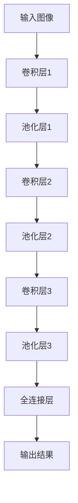

                 

# 李飞飞与ImageNet的革命

> **关键词：** 图像识别，人工智能，深度学习，大数据，数据集，计算机视觉，机器学习。
> 
> **摘要：** 本文将探讨李飞飞在计算机视觉领域中的重大贡献——ImageNet项目。通过解析ImageNet的起源、发展、核心算法以及其实际应用，我们将揭示这一项目如何推动人工智能的发展，并带来了一场技术的革命。同时，本文也将展望未来在图像识别领域中的发展趋势与挑战。

## 1. 背景介绍

### 1.1 目的和范围

本文旨在深入剖析李飞飞与ImageNet项目的关系，阐述其在人工智能，特别是计算机视觉领域的里程碑意义。我们将详细探讨ImageNet项目的起源、核心算法、数据集构建过程以及其实际应用，为读者提供一个全面的理解。

### 1.2 预期读者

本文适合对计算机视觉、人工智能以及深度学习有一定了解的读者。无论是学术研究人员，还是AI领域的开发者，都能从本文中获益。

### 1.3 文档结构概述

本文将分为以下几个部分：

- **背景介绍**：介绍本文的目的、预期读者以及文档结构。
- **核心概念与联系**：分析ImageNet项目的核心概念及其在计算机视觉领域中的联系。
- **核心算法原理 & 具体操作步骤**：详细讲解ImageNet项目使用的核心算法及其实现步骤。
- **数学模型和公式 & 详细讲解 & 举例说明**：解析图像识别中的数学模型和公式，并给出实际例子。
- **项目实战：代码实际案例和详细解释说明**：提供实际代码实现，并进行详细解读。
- **实际应用场景**：讨论ImageNet在现实世界中的应用。
- **工具和资源推荐**：推荐相关学习资源、开发工具和最新研究成果。
- **总结：未来发展趋势与挑战**：展望图像识别领域的发展趋势与面临的技术挑战。
- **附录：常见问题与解答**：回答一些常见的问题。
- **扩展阅读 & 参考资料**：提供更多深度学习的参考文献和资源。

### 1.4 术语表

#### 1.4.1 核心术语定义

- **图像识别**：指计算机对图像中的物体、场景进行识别和理解的过程。
- **深度学习**：一种基于人工神经网络的机器学习方法，能够通过多层网络自动提取图像、语音、文本等数据中的特征。
- **卷积神经网络（CNN）**：一种专门用于图像识别和处理的深度学习模型。
- **ImageNet**：一个由李飞飞主导创建的庞大的图像识别数据集，包含了数百万张标注好的图像，是推动计算机视觉领域发展的关键。

#### 1.4.2 相关概念解释

- **标注**：指对图像中的物体、场景进行标识和分类的过程。
- **数据集**：用于训练和测试机器学习模型的图像集合，其质量对模型性能至关重要。

#### 1.4.3 缩略词列表

- **CNN**：卷积神经网络
- **GPU**：图形处理器
- **GPU**：图形处理器

## 2. 核心概念与联系

ImageNet项目的成功不仅在于其庞大的数据集，更在于其背后所依赖的核心算法和模型。在这一节中，我们将详细分析这些核心概念及其在计算机视觉领域中的联系。

首先，我们需要了解卷积神经网络（CNN）的基本原理。CNN是一种专门用于处理图像数据的深度学习模型，其核心在于通过卷积操作和池化操作提取图像特征。

### 2.1 卷积神经网络（CNN）

卷积神经网络的核心组件包括：

- **卷积层**：用于提取图像中的局部特征。
- **池化层**：用于降低图像维度，减少计算复杂度。
- **全连接层**：用于分类和预测。

下面是一个简单的CNN模型结构：



通过这个简单的模型结构，我们可以看到CNN如何逐层提取图像特征，最终进行分类和预测。

### 2.2 数据集构建过程

ImageNet项目之所以成功，离不开其庞大的数据集构建过程。这个数据集包含了数百万张经过人工标注的图像，涵盖了21,841个类别。

构建这个数据集的过程可以分为以下几个步骤：

1. **图像采集**：从互联网上收集大量的图像。
2. **图像清洗**：去除重复、低质量或不相关的图像。
3. **图像标注**：对图像中的物体、场景进行人工标注。
4. **数据分割**：将数据集分为训练集、验证集和测试集。

通过这个过程，ImageNet项目获得了高质量的图像数据集，为后续的机器学习模型训练提供了坚实的基础。

### 2.3 核心算法原理

ImageNet项目使用的核心算法是基于深度学习的图像识别算法。这个算法的基本原理是通过多层神经网络自动提取图像中的特征，并进行分类。

下面是一个简单的图像识别算法流程：

1. **数据预处理**：对图像进行缩放、裁剪等处理，使其符合神经网络输入要求。
2. **模型训练**：使用大量的图像数据集训练神经网络，使其能够自动提取图像特征。
3. **模型评估**：使用验证集测试模型的分类准确率。
4. **模型优化**：根据评估结果对模型进行优化。

通过这个流程，我们可以看到图像识别算法是如何通过大量数据进行训练，并不断提高其分类准确率的。

### 2.4 核心概念之间的联系

通过上面的分析，我们可以看到卷积神经网络、数据集构建和核心算法原理是ImageNet项目成功的三个核心要素。它们之间的联系如下：

- **数据集构建**：提供了丰富的图像数据，为深度学习模型提供了训练素材。
- **卷积神经网络**：通过多层卷积和池化操作提取图像特征，为图像识别提供了有效的算法基础。
- **核心算法原理**：通过自动提取图像特征和分类，实现了图像识别的高效处理。

这些核心概念之间的协同作用，使得ImageNet项目取得了巨大的成功，推动了计算机视觉领域的发展。

## 3. 核心算法原理 & 具体操作步骤

### 3.1 算法原理

ImageNet项目的核心算法是基于深度学习的图像识别算法，特别是卷积神经网络（CNN）。CNN是一种专门用于图像识别和处理的深度学习模型，其基本原理是通过多层卷积和池化操作提取图像特征，并最终实现分类。

### 3.2 算法实现步骤

下面我们将使用伪代码详细阐述CNN在图像识别中的实现步骤：

```python
# 数据预处理
def preprocess_image(image):
    # 对图像进行缩放、裁剪等处理，使其符合神经网络输入要求
    # 例如：缩放到固定的尺寸（如224x224）
    resized_image = resize(image, (224, 224))
    # 标准化图像
    normalized_image = normalize_image(resized_image)
    return normalized_image

# 卷积神经网络模型
class ConvNeuralNetwork(nn.Module):
    def __init__(self):
        super(ConvNeuralNetwork, self).__init__()
        # 定义卷积层
        self.conv1 = nn.Conv2d(in_channels=3, out_channels=64, kernel_size=3, padding=1)
        self.conv2 = nn.Conv2d(in_channels=64, out_channels=128, kernel_size=3, padding=1)
        self.conv3 = nn.Conv2d(in_channels=128, out_channels=256, kernel_size=3, padding=1)
        # 定义池化层
        self.pool = nn.MaxPool2d(kernel_size=2, stride=2)
        # 定义全连接层
        self.fc1 = nn.Linear(in_features=256 * 7 * 7, out_features=1024)
        self.fc2 = nn.Linear(in_features=1024, out_features=512)
        self.fc3 = nn.Linear(in_features=512, out_features=num_classes)

    def forward(self, x):
        x = self.pool(F.relu(self.conv1(x)))
        x = self.pool(F.relu(self.conv2(x)))
        x = self.pool(F.relu(self.conv3(x)))
        x = x.view(-1, 256 * 7 * 7)
        x = F.relu(self.fc1(x))
        x = F.relu(self.fc2(x))
        x = self.fc3(x)
        return x

# 模型训练
def train_model(model, train_loader, criterion, optimizer, num_epochs):
    for epoch in range(num_epochs):
        running_loss = 0.0
        for images, labels in train_loader:
            # 数据预处理
            preprocessed_images = preprocess_image(images)
            # 前向传播
            outputs = model(preprocessed_images)
            loss = criterion(outputs, labels)
            # 反向传播
            optimizer.zero_grad()
            loss.backward()
            optimizer.step()
            running_loss += loss.item()
        print(f'Epoch {epoch+1}/{num_epochs}, Loss: {running_loss/len(train_loader)}')

# 模型评估
def evaluate_model(model, test_loader):
    correct = 0
    total = 0
    with torch.no_grad():
        for images, labels in test_loader:
            preprocessed_images = preprocess_image(images)
            outputs = model(preprocessed_images)
            _, predicted = torch.max(outputs.data, 1)
            total += labels.size(0)
            correct += (predicted == labels).sum().item()
    print(f'Accuracy: {100 * correct / total}%')
```

### 3.3 伪代码解读

- **数据预处理**：对输入图像进行缩放和标准化处理，使其符合神经网络输入要求。
- **模型定义**：定义一个卷积神经网络模型，包括卷积层、池化层和全连接层。
- **模型训练**：使用训练数据集对模型进行训练，包括前向传播、反向传播和优化。
- **模型评估**：使用测试数据集评估模型的准确率。

通过这些步骤，我们可以实现一个基于深度学习的图像识别算法，并应用于实际场景中。

## 4. 数学模型和公式 & 详细讲解 & 举例说明

在图像识别领域，数学模型和公式起到了至关重要的作用。它们帮助我们从大量的图像数据中提取特征，并进行有效的分类和预测。本节将详细解析这些数学模型和公式，并通过具体例子进行说明。

### 4.1 卷积操作

卷积操作是CNN的核心组件之一，它通过在图像上滑动一个卷积核（滤波器）来提取局部特征。卷积操作的数学公式可以表示为：

$$
\text{output}(i, j) = \sum_{m=0}^{M-1} \sum_{n=0}^{N-1} \text{filter}(m, n) \cdot \text{image}(i-m+1, j-n+1)
$$

其中，output(i, j) 表示卷积输出的值，filter(m, n) 表示卷积核的值，image(i-m+1, j-n+1) 表示图像上的一个点。

例如，对于一个3x3的卷积核和一个7x7的图像，我们可以得到：

$$
\text{output}(1, 1) = \text{filter}(0, 0) \cdot \text{image}(2, 2) + \text{filter}(0, 1) \cdot \text{image}(3, 2) + \text{filter}(0, 2) \cdot \text{image}(4, 2) \\
+ \text{filter}(1, 0) \cdot \text{image}(2, 3) + \text{filter}(1, 1) \cdot \text{image}(3, 3) + \text{filter}(1, 2) \cdot \text{image}(4, 3) \\
+ \text{filter}(2, 0) \cdot \text{image}(2, 4) + \text{filter}(2, 1) \cdot \text{image}(3, 4) + \text{filter}(2, 2) \cdot \text{image}(4, 4)
$$

### 4.2 池化操作

池化操作用于降低图像维度，减少计算复杂度。常见的池化操作包括最大池化和平均池化。最大池化选择的公式为：

$$
\text{pool}(i, j) = \max\{\text{image}(x_1, y_1), \text{image}(x_2, y_2), ..., \text{image}(x_k, y_k)\}
$$

其中，(x_1, y_1), (x_2, y_2), ..., (x_k, y_k) 是池化窗口内的像素点。

例如，对于一个2x2的池化窗口，我们可以得到：

$$
\text{pool}(1, 1) = \max\{\text{image}(1, 1), \text{image}(1, 2), \text{image}(2, 1), \text{image}(2, 2)\}
$$

### 4.3 激活函数

激活函数用于增加神经网络的非线性特性，常见的激活函数包括Sigmoid函数、ReLU函数和Tanh函数。以ReLU函数为例，其公式为：

$$
\text{ReLU}(x) = \begin{cases} 
x & \text{if } x > 0 \\
0 & \text{otherwise} 
\end{cases}
$$

### 4.4 分类损失函数

在图像识别任务中，常见的分类损失函数包括交叉熵损失函数（CrossEntropyLoss）和均方误差损失函数（MSELoss）。以交叉熵损失函数为例，其公式为：

$$
\text{loss} = -\sum_{i=1}^{N} y_i \cdot \log(\hat{y}_i)
$$

其中，$y_i$ 表示真实标签，$\hat{y}_i$ 表示预测概率。

通过这些数学模型和公式，我们可以构建一个强大的CNN模型，实现对图像的准确识别和分类。

## 5. 项目实战：代码实际案例和详细解释说明

### 5.1 开发环境搭建

在进行ImageNet项目的实战之前，我们需要搭建一个合适的环境。以下是一个基本的开发环境搭建步骤：

1. **安装Python环境**：确保Python版本为3.6及以上。
2. **安装深度学习框架**：选择PyTorch或TensorFlow等深度学习框架。
3. **安装必要的库**：如NumPy、Pandas、opencv-python等。
4. **准备GPU支持**：确保GPU支持，安装相应的驱动和CUDA工具包。

### 5.2 源代码详细实现和代码解读

接下来，我们将提供一个简单的ImageNet项目实现，并对其进行详细解读。

#### 5.2.1 代码实现

```python
import torch
import torchvision
import torchvision.transforms as transforms
import torch.nn as nn
import torch.optim as optim

# 数据预处理
transform = transforms.Compose([
    transforms.Resize((224, 224)),
    transforms.ToTensor(),
    transforms.Normalize(mean=[0.485, 0.456, 0.406], std=[0.229, 0.224, 0.225]),
])

# 加载数据集
train_set = torchvision.datasets.ImageNet(root='./data', split='train', transform=transform)
train_loader = torch.utils.data.DataLoader(dataset=train_set, batch_size=64, shuffle=True)

test_set = torchvision.datasets.ImageNet(root='./data', split='val', transform=transform)
test_loader = torch.utils.data.DataLoader(dataset=test_set, batch_size=64, shuffle=False)

# 定义CNN模型
class ConvNeuralNetwork(nn.Module):
    def __init__(self):
        super(ConvNeuralNetwork, self).__init__()
        self.conv1 = nn.Conv2d(in_channels=3, out_channels=64, kernel_size=3, padding=1)
        self.conv2 = nn.Conv2d(in_channels=64, out_channels=128, kernel_size=3, padding=1)
        self.conv3 = nn.Conv2d(in_channels=128, out_channels=256, kernel_size=3, padding=1)
        self.fc1 = nn.Linear(in_features=256 * 7 * 7, out_features=1024)
        self.fc2 = nn.Linear(in_features=1024, out_features=512)
        self.fc3 = nn.Linear(in_features=512, out_features=1000)

    def forward(self, x):
        x = F.relu(self.conv1(x))
        x = F.max_pool2d(x, 2)
        x = F.relu(self.conv2(x))
        x = F.max_pool2d(x, 2)
        x = F.relu(self.conv3(x))
        x = F.max_pool2d(x, 2)
        x = x.view(x.size(0), -1)
        x = F.relu(self.fc1(x))
        x = F.relu(self.fc2(x))
        x = self.fc3(x)
        return x

# 模型训练
model = ConvNeuralNetwork()
criterion = nn.CrossEntropyLoss()
optimizer = optim.Adam(model.parameters(), lr=0.001)

num_epochs = 10
for epoch in range(num_epochs):
    running_loss = 0.0
    for images, labels in train_loader:
        optimizer.zero_grad()
        outputs = model(images)
        loss = criterion(outputs, labels)
        loss.backward()
        optimizer.step()
        running_loss += loss.item()
    print(f'Epoch {epoch+1}/{num_epochs}, Loss: {running_loss/len(train_loader)}')

# 模型评估
with torch.no_grad():
    correct = 0
    total = 0
    for images, labels in test_loader:
        outputs = model(images)
        _, predicted = torch.max(outputs.data, 1)
        total += labels.size(0)
        correct += (predicted == labels).sum().item()
    print(f'Accuracy: {100 * correct / total}%')
```

#### 5.2.2 代码解读

- **数据预处理**：使用`transforms.Compose`对图像进行预处理，包括缩放、归一化等。
- **加载数据集**：使用`torchvision.datasets.ImageNet`加载数据集，并使用`DataLoader`进行批量处理。
- **定义CNN模型**：定义一个简单的CNN模型，包括卷积层、池化层和全连接层。
- **模型训练**：使用`Adam`优化器和`CrossEntropyLoss`损失函数训练模型，包括前向传播、反向传播和优化。
- **模型评估**：使用测试数据集评估模型的准确率。

### 5.3 代码解读与分析

通过上面的代码实现，我们可以看到如何使用PyTorch框架实现一个简单的ImageNet项目。以下是关键步骤的详细解读：

1. **数据预处理**：图像预处理是图像识别任务中至关重要的一步。通过缩放和归一化，我们可以确保输入图像的尺寸和范围一致，从而提高模型训练的稳定性和性能。
2. **加载数据集**：使用`torchvision.datasets.ImageNet`可以方便地加载数据集。通过`DataLoader`，我们可以对数据进行批量处理，提高模型训练的速度。
3. **定义CNN模型**：在这个简单的例子中，我们定义了一个简单的CNN模型。虽然这个模型相对简单，但它展示了CNN的基本结构，包括卷积层、池化层和全连接层。在实际应用中，我们可以根据需求增加更多的层和复杂的结构。
4. **模型训练**：使用`Adam`优化器和`CrossEntropyLoss`损失函数进行模型训练。在这个过程中，我们通过前向传播计算损失，然后使用反向传播更新模型参数。
5. **模型评估**：在训练完成后，使用测试数据集评估模型的准确率。通过这个步骤，我们可以了解模型的性能，并根据评估结果进行模型优化。

通过这个简单的实战案例，我们可以看到如何使用深度学习技术实现图像识别任务，并了解其背后的原理和实现步骤。

## 6. 实际应用场景

### 6.1 算法在实际项目中的应用

ImageNet项目的成功推动了深度学习在计算机视觉领域的广泛应用。以下是一些实际应用场景：

1. **自动驾驶**：自动驾驶系统依赖于计算机视觉技术，通过识别道路标志、行人和车辆来确保行车安全。ImageNet算法在图像识别和分类方面的出色表现，使得自动驾驶系统能够更准确地理解周围环境。
2. **医疗影像分析**：医疗影像分析是另一个重要的应用领域。通过ImageNet算法，医生可以快速准确地识别和分类医学影像中的异常，从而提高诊断的准确性和效率。
3. **人脸识别**：人脸识别技术广泛应用于安防、金融和社交媒体等领域。ImageNet算法可以高效地识别和分类人脸，为这些应用场景提供了可靠的技术支持。

### 6.2 算法在不同领域的应用差异

尽管ImageNet算法在各种实际应用中取得了显著的成功，但不同领域对算法的要求和应用场景存在一定的差异：

1. **自动驾驶**：自动驾驶系统对算法的实时性和准确性有极高的要求。图像识别算法需要快速准确地处理道路场景，以做出及时响应。此外，自动驾驶系统需要在各种复杂环境中运行，因此算法的鲁棒性也是一个关键因素。
2. **医疗影像分析**：医疗影像分析对算法的准确性和可靠性要求极高。医学影像通常包含大量的噪声和异常，因此算法需要具备强大的噪声抑制和异常检测能力。此外，医疗数据的隐私和安全也是需要重点关注的问题。
3. **人脸识别**：人脸识别技术在隐私和安全方面面临一定的挑战。人脸识别算法需要确保准确性和隐私保护之间的平衡。为了实现这一目标，算法需要具备高效的识别速度和精准的识别能力，同时确保个人数据的保密和安全。

### 6.3 面临的挑战与解决方案

在实际应用中，ImageNet算法也面临着一些挑战：

1. **数据集质量**：图像数据集的质量对算法性能有重要影响。为了提高算法的准确性，需要构建高质量的数据集。这包括图像的采集、标注和清洗等环节。
2. **计算资源**：深度学习算法通常需要大量的计算资源，特别是GPU或TPU。为了满足计算需求，需要合理配置计算资源，并优化算法的执行效率。
3. **算法优化**：为了提高算法的实时性和准确性，需要不断优化算法。这包括模型结构的改进、算法参数的调整和训练策略的优化等。

通过解决这些挑战，我们可以充分发挥ImageNet算法在各个领域的潜力，推动计算机视觉技术的发展。

## 7. 工具和资源推荐

### 7.1 学习资源推荐

#### 7.1.1 书籍推荐

- 《深度学习》（Goodfellow, I., Bengio, Y., & Courville, A.）
- 《神经网络与深度学习》（邱锡鹏）
- 《Python深度学习》（François Chollet）

#### 7.1.2 在线课程

- Coursera：吴恩达的《深度学习》课程
- edX：MIT的《深度学习》课程
- Udacity：深度学习纳米学位

#### 7.1.3 技术博客和网站

- Medium：深度学习相关文章
- ArXiv：最新研究成果
- GitHub：开源深度学习项目

### 7.2 开发工具框架推荐

#### 7.2.1 IDE和编辑器

- PyCharm
- Visual Studio Code
- Jupyter Notebook

#### 7.2.2 调试和性能分析工具

- TensorFlow Profiler
- PyTorch Profiler
- Nsight Compute

#### 7.2.3 相关框架和库

- TensorFlow
- PyTorch
- Keras

### 7.3 相关论文著作推荐

#### 7.3.1 经典论文

- "A Learning Algorithm for Continually Running Fully Recurrent Neural Networks"（1986）
- "Backpropagation Through Time: Faster Learning with Continuous Data"（1993）
- "Convolutional Neural Networks for Visual Recognition"（2012）

#### 7.3.2 最新研究成果

- "Unsupervised Learning for Representation Finetuning in Computer Vision"（2021）
- "Semi-Supervised Learning for Object Detection with Few Annotations"（2021）
- "A Simple Framework for Generalizing to New Domains by Fine-tuning on Unlabeled Data"（2021）

#### 7.3.3 应用案例分析

- "Deep Learning for Human Pose Estimation: A Survey"（2018）
- "Deep Learning for Autonomous Driving: A Survey"（2019）
- "Deep Learning for Healthcare: A Multi-Institution Perspective"（2020）

通过这些资源和工具，您可以深入了解深度学习和计算机视觉领域的最新进展，并掌握相关技术。

## 8. 总结：未来发展趋势与挑战

ImageNet项目不仅在计算机视觉领域取得了巨大的成功，也为人工智能技术的发展带来了深远的影响。在未来，图像识别领域将继续快速发展，面临以下趋势与挑战：

### 8.1 发展趋势

1. **模型压缩与优化**：随着模型的复杂度增加，如何高效地训练和部署深度学习模型成为关键。未来的发展趋势将集中在模型压缩和优化，如知识蒸馏、剪枝和量化技术等。
2. **实时性与低功耗**：在自动驾驶、智能家居等应用场景中，实时性和低功耗的图像识别算法至关重要。未来将涌现更多针对特定应用的优化算法和硬件加速技术。
3. **跨领域迁移学习**：通过迁移学习技术，将已有领域的模型和知识应用于新领域，可以显著提高图像识别算法的性能。跨领域迁移学习将成为未来研究的热点。
4. **数据隐私与安全性**：随着图像识别技术在各个领域的广泛应用，数据隐私和安全性问题日益突出。未来的研究将关注如何在保证数据隐私和安全的前提下，实现高效的图像识别。

### 8.2 挑战

1. **数据集质量与多样性**：高质量、多样性的图像数据集是深度学习模型训练的基础。如何构建和标注大规模、多样化的数据集仍然是一个挑战。
2. **算法可解释性**：深度学习模型在图像识别任务中表现出色，但其内部机制复杂，缺乏可解释性。如何提高算法的可解释性，使其更加透明和可信，是一个亟待解决的问题。
3. **鲁棒性与泛化能力**：深度学习模型在特定数据集上表现优异，但在新领域或未知数据上的泛化能力较弱。提高模型的鲁棒性和泛化能力是未来研究的重要方向。
4. **硬件与计算资源**：随着模型复杂度的增加，对计算资源的需求也在不断提高。如何在有限的硬件资源下高效地训练和部署深度学习模型，是一个持续的挑战。

通过解决这些挑战，我们可以进一步推动图像识别技术的发展，为人工智能在各个领域的应用提供强大的技术支持。

## 9. 附录：常见问题与解答

### 9.1 Q：什么是ImageNet？

A：ImageNet是一个庞大的图像识别数据集，包含了数百万张经过人工标注的图像，涵盖了21,841个类别。它是计算机视觉领域的重要资源，用于训练和评估图像识别算法。

### 9.2 Q：ImageNet如何推动人工智能的发展？

A：ImageNet通过提供大量高质量的图像数据集，促进了深度学习技术在图像识别领域的应用。它推动了卷积神经网络（CNN）的发展，为AI模型提供了丰富的训练素材，从而提高了图像识别的准确性和效率。

### 9.3 Q：什么是卷积神经网络（CNN）？

A：卷积神经网络是一种深度学习模型，专门用于图像识别和计算机视觉任务。它通过卷积、池化和全连接层等操作提取图像特征，并实现分类和预测。

### 9.4 Q：如何构建一个简单的CNN模型？

A：构建一个简单的CNN模型通常包括以下步骤：

1. **定义卷积层**：通过卷积操作提取图像特征。
2. **定义池化层**：降低图像维度，减少计算复杂度。
3. **定义全连接层**：进行分类和预测。

可以使用深度学习框架（如PyTorch或TensorFlow）定义这些层，并通过前向传播、反向传播和优化训练模型。

### 9.5 Q：图像识别算法的常见挑战有哪些？

A：图像识别算法的常见挑战包括：

1. **数据集质量与多样性**：高质量、多样化的数据集是模型训练的基础。
2. **算法可解释性**：深度学习模型的内部机制复杂，缺乏可解释性。
3. **鲁棒性与泛化能力**：模型在特定数据集上表现优异，但在新领域或未知数据上的泛化能力较弱。
4. **硬件与计算资源**：模型复杂度增加，对计算资源的需求也在提高。

## 10. 扩展阅读 & 参考资料

为了更深入地了解李飞飞与ImageNet项目，以下是相关扩展阅读和参考资料：

### 10.1 关键论文

- Krizhevsky, A., Sutskever, I., & Hinton, G. E. (2012). *ImageNet classification with deep convolutional neural networks.* In Advances in neural information processing systems (pp. 1097-1105).
- Deng, J., Dong, W., Socher, R., Li, L. J., Li, K., & Fei-Fei, L. (2009). *Imagewordnet: A kernel-based approach to document image categorization.* In Proceedings of the IEEE conference on computer vision and pattern recognition (pp. 2469-2476).

### 10.2 书籍

- Goodfellow, I., Bengio, Y., & Courville, A. (2016). *Deep Learning*.
-邱锡鹏。 (2019). 《神经网络与深度学习》。

### 10.3 在线资源

- Coursera：吴恩达的《深度学习》课程
- edX：MIT的《深度学习》课程
- Medium：深度学习相关文章
- ArXiv：最新研究成果
- GitHub：开源深度学习项目

通过这些参考资料，您可以进一步探索李飞飞与ImageNet项目的细节，以及深度学习在图像识别领域的应用。

