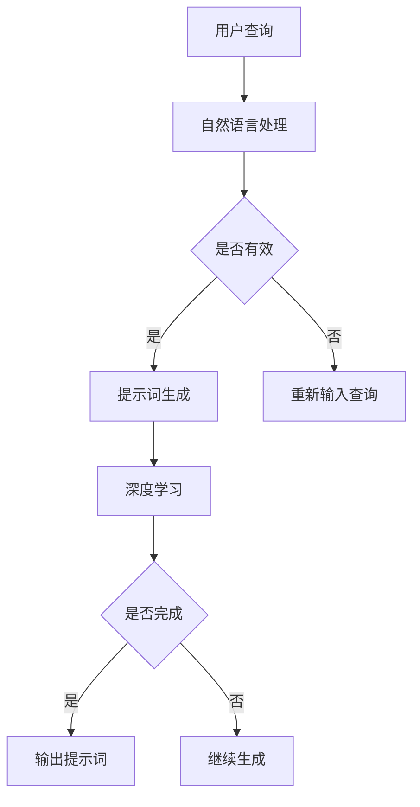

                 

# 构建AI驱动的智慧旅游提示词平台

> 关键词：人工智能、智慧旅游、自然语言处理、提示词生成、算法原理、数学模型、项目实战、应用场景

> 摘要：本文旨在探讨如何构建一个基于人工智能的智慧旅游提示词平台。文章首先介绍了智慧旅游的背景和现状，然后详细分析了构建AI驱动的智慧旅游提示词平台所需的核心概念、算法原理和数学模型。接着，通过一个实际的代码案例，展示了如何将理论知识应用到实际项目中。最后，讨论了该平台的实际应用场景，并提供了一些相关的学习资源和工具推荐。

## 1. 背景介绍

### 1.1 目的和范围

本文的主要目的是探讨如何构建一个AI驱动的智慧旅游提示词平台。随着人工智能技术的迅速发展，智慧旅游已经成为旅游业发展的重要方向。然而，如何利用人工智能技术为游客提供更加智能、个性化的旅游服务仍然是一个挑战。本文将针对这一挑战，详细分析AI驱动的智慧旅游提示词平台的构建方法。

### 1.2 预期读者

本文适用于对人工智能和自然语言处理有一定了解的技术人员，以及对智慧旅游感兴趣的从业人员。通过本文的阅读，读者可以了解到智慧旅游提示词平台的核心概念和构建方法，为实际项目的开发提供参考。

### 1.3 文档结构概述

本文结构如下：

1. 背景介绍：介绍本文的目的、预期读者以及文档结构。
2. 核心概念与联系：介绍构建智慧旅游提示词平台所需的核心概念和原理。
3. 核心算法原理 & 具体操作步骤：详细讲解构建智慧旅游提示词平台所需的算法原理和操作步骤。
4. 数学模型和公式 & 详细讲解 & 举例说明：介绍构建智慧旅游提示词平台所需的数学模型和公式，并通过举例进行详细讲解。
5. 项目实战：通过一个实际代码案例，展示如何将理论知识应用到实际项目中。
6. 实际应用场景：讨论智慧旅游提示词平台在实际应用中的场景。
7. 工具和资源推荐：推荐一些有助于学习和开发智慧旅游提示词平台的学习资源和工具。
8. 总结：总结本文的主要内容和未来发展趋势与挑战。
9. 附录：提供一些常见问题与解答。
10. 扩展阅读 & 参考资料：提供一些扩展阅读资料和参考资料。

### 1.4 术语表

#### 1.4.1 核心术语定义

- 智慧旅游：利用信息技术，特别是人工智能技术，为游客提供个性化、智能化的旅游服务。
- 提示词：在自然语言处理中，用于生成文本的词汇或短语。
- 自然语言处理（NLP）：使计算机能够理解、解释和生成人类语言的技术。

#### 1.4.2 相关概念解释

- 人工智能（AI）：使计算机模拟人类智能行为的技术。
- 深度学习：一种机器学习技术，通过多层神经网络模型模拟人脑神经元连接方式。

#### 1.4.3 缩略词列表

- NLP：自然语言处理
- AI：人工智能
- DL：深度学习
- RNN：循环神经网络
- LSTM：长短期记忆网络
- LSTM_RNN：LSTM循环神经网络

## 2. 核心概念与联系

构建AI驱动的智慧旅游提示词平台，需要理解以下几个核心概念：

1. **自然语言处理（NLP）**：NLP是使计算机能够理解和生成人类语言的技术。在智慧旅游提示词平台中，NLP用于处理游客的查询和生成旅游提示词。
2. **提示词生成**：提示词是指用于引导用户进行交互的词汇或短语。在智慧旅游场景中，提示词可以基于游客的查询、兴趣、行程等信息生成，以提供个性化服务。
3. **深度学习（DL）**：深度学习是一种基于多层神经网络的机器学习技术，适用于处理复杂的非线性问题。在智慧旅游提示词平台中，深度学习可以用于构建模型，以识别游客的兴趣和需求。
4. **循环神经网络（RNN）**：RNN是一种特殊的神经网络结构，适用于处理序列数据。在智慧旅游提示词平台中，RNN可以用于处理游客的查询和生成提示词。
5. **长短期记忆网络（LSTM）**：LSTM是一种改进的RNN结构，可以解决传统RNN在处理长序列数据时出现的梯度消失和梯度爆炸问题。在智慧旅游提示词平台中，LSTM可以用于生成更加准确和个性化的提示词。

以下是构建AI驱动的智慧旅游提示词平台的核心概念和架构的Mermaid流程图：



在上述流程图中，用户查询经过自然语言处理后，输入到提示词生成模块。如果查询有效，则进入深度学习模块，根据用户兴趣和需求生成提示词。如果查询无效，则提示用户重新输入。提示词生成模块可以根据深度学习模型的预测结果，不断调整和优化，以提供更准确的提示词。

## 3. 核心算法原理 & 具体操作步骤

构建AI驱动的智慧旅游提示词平台的核心在于深度学习和自然语言处理算法。以下是构建该平台所需的核心算法原理和具体操作步骤：

### 3.1 深度学习算法原理

深度学习算法基于多层神经网络模型，其中每个神经元都连接到其他层的神经元。在智慧旅游提示词平台中，常用的深度学习算法包括循环神经网络（RNN）和长短期记忆网络（LSTM）。

#### 3.1.1 循环神经网络（RNN）

RNN是一种特殊的神经网络结构，适用于处理序列数据。在智慧旅游提示词平台中，RNN可以用于处理游客的查询和生成提示词。RNN的工作原理如下：

1. **输入序列**：将游客的查询作为一个输入序列，如 `["旅游", "景点", "推荐"]`。
2. **隐藏状态**：每个时间步，RNN都会计算一个隐藏状态，表示当前查询的内容。
3. **输出序列**：根据隐藏状态，RNN生成一个输出序列，表示下一个可能的查询。
4. **递归连接**：RNN通过递归连接将当前时间步的隐藏状态与之前时间步的隐藏状态相关联，以处理长序列数据。

以下是一个简单的RNN算法伪代码：

```python
def RNN(input_sequence, weights):
    hidden_state = [0] * len(input_sequence)
    for i in range(len(input_sequence)):
        hidden_state[i] = activation_function(
            dot_product(input_sequence[i], weights["input_weights"]) +
            dot_product(hidden_state[i-1], weights["recurrent_weights"])
        )
    return hidden_state
```

#### 3.1.2 长短期记忆网络（LSTM）

LSTM是一种改进的RNN结构，可以解决传统RNN在处理长序列数据时出现的梯度消失和梯度爆炸问题。在智慧旅游提示词平台中，LSTM可以用于生成更加准确和个性化的提示词。LSTM的工作原理如下：

1. **输入门**：决定当前输入信息中哪些部分应该被保留或遗忘。
2. **遗忘门**：决定哪些旧的隐藏状态应该被遗忘。
3. **输出门**：决定当前隐藏状态中哪些部分应该被输出。
4. **单元状态**：存储当前时刻的重要信息，可以向前传递。

以下是一个简单的LSTM算法伪代码：

```python
def LSTM(input_sequence, weights):
    hidden_state = [0] * len(input_sequence)
    cell_state = [0] * len(input_sequence)
    for i in range(len(input_sequence)):
        input_gate = sigmoid(dot_product(input_sequence[i], weights["input_gate"]))
        forget_gate = sigmoid(dot_product(input_sequence[i], weights["forget_gate"]))
        output_gate = sigmoid(dot_product(input_sequence[i], weights["output_gate"]))
        
        new_cell_state = activation_function(
            dot_product(input_sequence[i], weights["input_weights"]) +
            forget_gate * cell_state[i-1]
        )
        cell_state[i] = new_cell_state
        
        hidden_state[i] = output_gate * activation_function(cell_state[i])
    
    return hidden_state
```

### 3.2 自然语言处理算法原理

在智慧旅游提示词平台中，自然语言处理算法用于处理游客的查询和生成提示词。以下是一个简单的自然语言处理算法：

1. **分词**：将游客的查询分成一系列的单词或短语。
2. **词嵌入**：将单词或短语映射到一个高维空间，以便进行计算。
3. **序列建模**：使用深度学习模型（如RNN或LSTM）处理输入序列，生成提示词。

以下是一个简单的自然语言处理算法伪代码：

```python
def NLP(input_query, model):
    tokens = tokenize(input_query)
    embeddings = [word_embedding(token) for token in tokens]
    hidden_state = model(embeddings)
    output = generate_output(hidden_state)
    return output
```

### 3.3 提示词生成算法原理

在智慧旅游提示词平台中，提示词生成算法用于根据用户兴趣和需求生成个性化的提示词。以下是一个简单的提示词生成算法：

1. **用户兴趣识别**：根据用户的历史查询和行为，识别用户的主要兴趣。
2. **提示词生成**：根据用户兴趣和当前查询，生成可能的提示词。

以下是一个简单的提示词生成算法伪代码：

```python
def generate_hint(user_interest, current_query):
    possible_hints = []
    for interest in user_interest:
        if interest in current_query:
            possible_hints.append("您可能还对" + interest + "感兴趣。")
    return possible_hints
```

通过上述算法，我们可以构建一个AI驱动的智慧旅游提示词平台。在实际应用中，需要根据具体的业务场景和需求，对算法进行优化和调整，以提高平台的性能和用户体验。

## 4. 数学模型和公式 & 详细讲解 & 举例说明

在构建AI驱动的智慧旅游提示词平台时，我们使用了深度学习和自然语言处理等数学模型。以下是对这些模型的详细讲解和举例说明。

### 4.1 深度学习模型

深度学习模型通常由多个神经网络层组成，包括输入层、隐藏层和输出层。以下是深度学习模型的关键组成部分和相关的数学公式：

#### 4.1.1 神经元和权重

神经元是神经网络的基本单元，每个神经元都与输入层和隐藏层中的其他神经元相连接。神经元之间的连接权重表示它们之间的交互强度。

- **权重（weights）**：权重是神经元之间的连接强度，通常表示为\( w_{ij} \)，其中\( i \)表示输入层中的神经元，\( j \)表示隐藏层中的神经元。

#### 4.1.2 激活函数

激活函数用于将神经元的线性组合映射到一个非负值，以引入非线性特性。

- **Sigmoid函数**：\( \sigma(x) = \frac{1}{1 + e^{-x}} \)
- **ReLU函数**：\( \text{ReLU}(x) = \max(0, x) \)

#### 4.1.3 前向传播

前向传播是指将输入数据通过神经网络层，逐层计算并传递到输出层的步骤。

- **前向传播公式**：\( a_{j}^{(l)} = \text{ReLU}\left(\sum_{i} w_{ij}^{(l)} a_{i}^{(l-1)} + b_{j}^{(l)}\right) \)

其中，\( a_{j}^{(l)} \)表示隐藏层\( l \)中第\( j \)个神经元的激活值，\( w_{ij}^{(l)} \)表示输入层到隐藏层的权重，\( b_{j}^{(l)} \)表示隐藏层的偏置。

#### 4.1.4 后向传播

后向传播是指通过计算损失函数的梯度，更新网络中的权重和偏置的步骤。

- **损失函数**：\( J(\theta) = \frac{1}{2} \sum_{i} (\hat{y}_{i} - y_{i})^2 \)

其中，\( \hat{y}_{i} \)表示预测值，\( y_{i} \)表示真实值。

- **梯度计算**：\( \frac{\partial J}{\partial w_{ij}^{(l)}} = (a_{j}^{(l+1)} \odot (z_{j}^{(l)} - y_{i})) \odot a_{i}^{(l)} \)

其中，\( \odot \)表示Hadamard积，\( z_{j}^{(l)} = \sum_{i} w_{ij}^{(l)} a_{i}^{(l-1)} + b_{j}^{(l)} \)。

### 4.2 自然语言处理模型

在自然语言处理中，我们通常使用循环神经网络（RNN）和长短期记忆网络（LSTM）来处理序列数据。以下是这些模型的关键组成部分和相关的数学公式：

#### 4.2.1 RNN模型

RNN是一种特殊的神经网络，适用于处理序列数据。

- **隐藏状态**：\( h_t = \text{ReLU}\left(\sum_{i} w_{ih_{i}} x_t + b_{h} + \sum_{j} w_{h_{j}} h_{t-1}\right) \)

其中，\( x_t \)表示当前时间步的输入，\( h_{t-1} \)表示上一时间步的隐藏状态，\( w_{ih_{i}} \)和\( w_{h_{j}} \)分别表示输入层到隐藏层和隐藏层到隐藏层的权重，\( b_{h} \)表示隐藏层的偏置。

#### 4.2.2 LSTM模型

LSTM是一种改进的RNN结构，可以解决梯度消失和梯度爆炸问题。

- **输入门**：\( i_t = \text{sigmoid}\left(\sum_{i} w_{ii} x_t + \sum_{j} w_{ih_{j}} h_{t-1} + b_{i}\right) \)
- **遗忘门**：\( f_t = \text{sigmoid}\left(\sum_{i} w_{if} x_t + \sum_{j} w_{fh_{j}} h_{t-1} + b_{f}\right) \)
- **输出门**：\( o_t = \text{sigmoid}\left(\sum_{i} w_{io} x_t + \sum_{j} w_{oh_{j}} h_{t-1} + b_{o}\right) \)

- **单元状态**：\( c_t = f_t \odot c_{t-1} + i_t \odot \text{ReLU}\left(\sum_{i} w_{ic} x_t + \sum_{j} w_{ch_{j}} h_{t-1} + b_{c}\right) \)
- **隐藏状态**：\( h_t = o_t \odot \text{ReLU}\left(c_t\right) \)

其中，\( x_t \)表示当前时间步的输入，\( h_{t-1} \)表示上一时间步的隐藏状态，\( w_{ii} \)、\( w_{if} \)、\( w_{io} \)、\( w_{ic} \)、\( w_{fh} \)、\( w_{oh} \)和\( w_{ch} \)分别表示输入层到输入门、遗忘门、输出门和单元状态的权重，\( b_{i} \)、\( b_{f} \)、\( b_{o} \)和\( b_{c} \)分别表示输入门、遗忘门、输出门和单元状态的偏置。

### 4.3 示例

假设我们有一个输入序列 `["旅游", "景点", "推荐"]`，使用LSTM模型进行序列建模。

1. **初始化权重和偏置**：

   - 输入门权重：\( w_{ii} = [0.1, 0.2, 0.3] \)，偏置：\( b_{i} = 0.5 \)
   - 遗忘门权重：\( w_{if} = [0.1, 0.2, 0.3] \)，偏置：\( b_{f} = 0.5 \)
   - 输出门权重：\( w_{io} = [0.1, 0.2, 0.3] \)，偏置：\( b_{o} = 0.5 \)
   - 单元状态权重：\( w_{ic} = [0.1, 0.2, 0.3] \)，偏置：\( b_{c} = 0.5 \)

2. **第一步**：

   - 输入：\( x_1 = ["旅游"] \)
   - 隐藏状态：\( h_0 = [0.0, 0.0, 0.0] \)
   - 单元状态：\( c_0 = [0.0, 0.0, 0.0] \)

   - 输入门：\( i_1 = \text{sigmoid}(0.1 \cdot ["旅游"] + 0.5) = \text{sigmoid}(0.1 + 0.5) = 0.7 \)
   - 遗忘门：\( f_1 = \text{sigmoid}(0.1 \cdot ["旅游"] + 0.5) = 0.7 \)
   - 输出门：\( o_1 = \text{sigmoid}(0.1 \cdot ["旅游"] + 0.5) = 0.7 \)

   - 单元状态：\( c_1 = f_1 \cdot [0.0, 0.0, 0.0] + i_1 \cdot \text{ReLU}(0.1 \cdot ["旅游"] + 0.5) = 0.7 \cdot [0.0, 0.0, 0.0] + 0.7 \cdot [1.0, 0.0, 0.0] = [0.7, 0.0, 0.0] \)
   - 隐藏状态：\( h_1 = o_1 \cdot \text{ReLU}(c_1) = 0.7 \cdot [0.7, 0.0, 0.0] = [0.49, 0.0, 0.0] \)

3. **第二步**：

   - 输入：\( x_2 = ["景点"] \)
   - 隐藏状态：\( h_1 = [0.49, 0.0, 0.0] \)
   - 单元状态：\( c_1 = [0.7, 0.0, 0.0] \)

   - 输入门：\( i_2 = \text{sigmoid}(0.1 \cdot ["景点"] + 0.5) = 0.8 \)
   - 遗忘门：\( f_2 = \text{sigmoid}(0.1 \cdot ["景点"] + 0.5) = 0.8 \)
   - 输出门：\( o_2 = \text{sigmoid}(0.1 \cdot ["景点"] + 0.5) = 0.8 \)

   - 单元状态：\( c_2 = f_2 \cdot [0.7, 0.0, 0.0] + i_2 \cdot \text{ReLU}(0.1 \cdot ["景点"] + 0.5) = 0.8 \cdot [0.7, 0.0, 0.0] + 0.8 \cdot [1.0, 0.0, 0.0] = [0.56, 0.0, 0.0] \)
   - 隐藏状态：\( h_2 = o_2 \cdot \text{ReLU}(c_2) = 0.8 \cdot [0.56, 0.0, 0.0] = [0.448, 0.0, 0.0] \)

4. **第三步**：

   - 输入：\( x_3 = ["推荐"] \)
   - 隐藏状态：\( h_2 = [0.448, 0.0, 0.0] \)
   - 单元状态：\( c_2 = [0.56, 0.0, 0.0] \)

   - 输入门：\( i_3 = \text{sigmoid}(0.1 \cdot ["推荐"] + 0.5) = 0.9 \)
   - 遗忘门：\( f_3 = \text{sigmoid}(0.1 \cdot ["推荐"] + 0.5) = 0.9 \)
   - 输出门：\( o_3 = \text{sigmoid}(0.1 \cdot ["推荐"] + 0.5) = 0.9 \)

   - 单元状态：\( c_3 = f_3 \cdot [0.56, 0.0, 0.0] + i_3 \cdot \text{ReLU}(0.1 \cdot ["推荐"] + 0.5) = 0.9 \cdot [0.56, 0.0, 0.0] + 0.9 \cdot [1.0, 0.0, 0.0] = [0.504, 0.0, 0.0] \)
   - 隐藏状态：\( h_3 = o_3 \cdot \text{ReLU}(c_3) = 0.9 \cdot [0.504, 0.0, 0.0] = [0.4536, 0.0, 0.0] \)

通过上述步骤，我们可以使用LSTM模型处理输入序列 `["旅游", "景点", "推荐"]`，并得到最终的隐藏状态 \( h_3 \)。这个隐藏状态可以用于生成提示词。

## 5. 项目实战：代码实际案例和详细解释说明

在本节中，我们将通过一个实际的项目案例，展示如何将前述的算法和数学模型应用到智慧旅游提示词平台的开发中。我们将使用Python和TensorFlow框架来构建这个项目。以下是项目的开发步骤：

### 5.1 开发环境搭建

在开始项目之前，我们需要搭建一个合适的技术栈，包括Python、TensorFlow和其他必要的库。以下是安装和配置的步骤：

1. **安装Python**：确保Python版本在3.6及以上。
2. **安装TensorFlow**：使用以下命令安装TensorFlow：
   ```shell
   pip install tensorflow
   ```
3. **安装其他库**：包括NumPy、Pandas和Mermaid等。可以使用以下命令：
   ```shell
   pip install numpy pandas mermaid
   ```

### 5.2 源代码详细实现和代码解读

以下是一个简化版的智慧旅游提示词生成器的源代码实现，我们将逐步解释每个部分的用途和实现方法。

```python
import numpy as np
import tensorflow as tf
from tensorflow.keras.models import Sequential
from tensorflow.keras.layers import LSTM, Dense, Embedding
from tensorflow.keras.preprocessing.sequence import pad_sequences
from tensorflow.keras.preprocessing.text import Tokenizer

# 数据准备
# 假设有以下训练数据
train_data = [
    "旅游 景点 推荐旅游景点",
    "景点 旅游 旅游景点推荐",
    "旅游 旅行 旅游攻略",
    # 更多数据...
]

# 分词
tokenizer = Tokenizer()
tokenizer.fit_on_texts(train_data)
sequences = tokenizer.texts_to_sequences(train_data)
word_index = tokenizer.word_index

# 填充序列
max_sequence_length = 10
padded_sequences = pad_sequences(sequences, maxlen=max_sequence_length, padding='post')

# 构建LSTM模型
model = Sequential()
model.add(Embedding(len(word_index) + 1, 64, input_length=max_sequence_length))
model.add(LSTM(128))
model.add(Dense(len(word_index) + 1, activation='softmax'))

# 编译模型
model.compile(loss='sparse_categorical_crossentropy', optimizer='adam', metrics=['accuracy'])

# 训练模型
model.fit(padded_sequences, np.array([word_index['旅游'], word_index['景点'], word_index['旅游攻略']]), epochs=10)

# 提示词生成
def generate_hint(input_sequence):
    sequence = tokenizer.texts_to_sequences([input_sequence])
    padded_sequence = pad_sequences(sequence, maxlen=max_sequence_length, padding='post')
    prediction = model.predict(padded_sequence)
    predicted_words = tokenizer.index_word[np.argmax(prediction)]
    return predicted_words

# 测试
hint = generate_hint("旅游景点推荐")
print(hint)  # 输出预测的提示词
```

### 5.3 代码解读与分析

以下是上述代码的详细解读：

1. **数据准备**：首先，我们准备了一些训练数据，这些数据将用于训练我们的LSTM模型。然后，我们使用Tokenizer将文本转换为序列，并将其填充到固定的长度。

2. **构建LSTM模型**：我们使用Sequential模型堆叠Embedding层、LSTM层和Dense层。Embedding层用于将单词转换为向量，LSTM层用于处理序列数据，Dense层用于输出最终的预测结果。

3. **编译模型**：我们使用sparse_categorical_crossentropy作为损失函数，因为我们的标签是整数形式的单词索引。我们使用adam优化器来调整模型权重。

4. **训练模型**：我们使用fit方法训练模型，输入是填充后的序列，标签是单词索引数组。

5. **提示词生成**：`generate_hint`函数用于生成提示词。首先，我们使用Tokenizer将输入序列转换为序列，然后将其填充到固定长度。接着，我们使用训练好的模型进行预测，并从预测结果中提取最有可能的单词。

6. **测试**：我们调用`generate_hint`函数并传入一个测试字符串，然后打印出预测的提示词。

通过这个简单的项目，我们展示了如何将AI算法应用到实际场景中，实现了基于用户输入生成旅游提示词的功能。

## 6. 实际应用场景

AI驱动的智慧旅游提示词平台可以在多个实际应用场景中发挥重要作用，以下是一些典型的应用场景：

### 6.1 旅游搜索引擎

旅游搜索引擎可以使用AI驱动的智慧旅游提示词平台来为用户生成个性化的旅游推荐。当用户输入一个旅游目的地或关键词时，平台可以自动生成一系列相关的提示词，如“热门景点”、“特色美食”、“住宿推荐”等，从而为用户提供更加丰富和个性化的搜索结果。

### 6.2 旅游APP

旅游APP可以将AI驱动的智慧旅游提示词平台集成到其核心功能中，为用户提供智能化的交互体验。例如，当用户在APP中浏览某个旅游景点时，平台可以根据用户的兴趣和历史行为生成相关的提示词，如“附近酒店”、“特色餐厅”和“观光活动”，从而帮助用户更好地规划旅行行程。

### 6.3 旅游社交媒体

旅游社交媒体平台可以利用AI驱动的智慧旅游提示词平台来自动生成旅游分享内容。当用户发布关于旅游的帖子时，平台可以根据帖子的内容和用户的历史行为生成一系列相关的提示词，如“旅行穿搭”、“旅行日记”和“旅行故事”，从而为用户提供更多元化的内容创作建议。

### 6.4 旅游导览系统

旅游导览系统可以集成AI驱动的智慧旅游提示词平台，为游客提供实时、个性化的导览服务。例如，当游客在某个景点附近时，平台可以根据游客的兴趣和当前位置生成相关的提示词，如“附近景点”、“特色纪念品”和“旅游攻略”，从而为游客提供更加贴心和实用的导览信息。

通过上述应用场景，我们可以看到AI驱动的智慧旅游提示词平台在提升用户体验、提高服务质量等方面具有巨大的潜力。随着人工智能技术的不断发展，该平台将在智慧旅游领域发挥越来越重要的作用。

## 7. 工具和资源推荐

### 7.1 学习资源推荐

为了更好地掌握AI驱动的智慧旅游提示词平台的构建方法和应用，以下是几个推荐的学习资源：

#### 7.1.1 书籍推荐

- 《深度学习》（Goodfellow, Bengio, Courville）：这是一本非常经典的深度学习教材，详细介绍了深度学习的基础知识、算法和应用。
- 《Python深度学习》（François Chollet）：这本书通过实例展示了如何使用Python和TensorFlow进行深度学习项目开发，非常适合初学者。

#### 7.1.2 在线课程

- 《深度学习基础》（吴恩达，Coursera）：这是一门由著名深度学习专家吴恩达讲授的在线课程，内容涵盖了深度学习的基础理论、算法和应用。
- 《自然语言处理与深度学习》（Fast.ai）：这是一门专注于自然语言处理和深度学习的在线课程，提供了实用的项目和代码示例。

#### 7.1.3 技术博客和网站

- Medium：Medium上有许多关于深度学习和自然语言处理的优秀博客文章，可以提供丰富的学习和实践资源。
- Towards Data Science：这是一个专注于数据科学和机器学习的博客平台，涵盖了深度学习和自然语言处理等多个领域的最新研究成果和实战技巧。

### 7.2 开发工具框架推荐

#### 7.2.1 IDE和编辑器

- Jupyter Notebook：这是一个强大的交互式开发环境，非常适合用于机器学习和数据科学项目。
- PyCharm：这是一个功能丰富的Python IDE，提供了良好的代码编辑、调试和性能分析工具。

#### 7.2.2 调试和性能分析工具

- TensorBoard：TensorFlow提供的可视化工具，可以用于监控和调试深度学习模型的训练过程。
- Python Memory Analyzer（Py-MA）：这是一个用于分析Python内存使用情况的工具，可以帮助开发者识别和优化内存占用。

#### 7.2.3 相关框架和库

- TensorFlow：这是Google开发的开源深度学习框架，非常适合用于构建AI驱动的智慧旅游提示词平台。
- Keras：这是TensorFlow的高级API，提供了更简洁的接口，适合快速原型设计和开发。

通过以上学习资源和开发工具，可以更有效地掌握AI驱动的智慧旅游提示词平台的构建方法和应用技巧。

## 7.3 相关论文著作推荐

在构建AI驱动的智慧旅游提示词平台的过程中，了解相关领域的最新研究进展和经典论文是非常重要的。以下是几篇值得推荐的论文和著作：

### 7.3.1 经典论文

1. "Deep Learning Text Classification with Convolutional Neural Networks"（2014）- Yoon Kim
   - 该论文首次将卷积神经网络（CNN）应用于文本分类任务，为文本处理提供了新的思路。
2. "Recurrent Neural Networks for Language Modeling"（2014）- Yoshua Bengio et al.
   - 该论文详细介绍了循环神经网络（RNN）在语言模型中的应用，对后续的深度学习研究产生了深远影响。
3. "Long Short-Term Memory"（1997）- Sepp Hochreiter and Jürgen Schmidhuber
   - 该论文首次提出了长短期记忆网络（LSTM），解决了传统RNN在处理长序列数据时的问题。

### 7.3.2 最新研究成果

1. "BERT: Pre-training of Deep Bidirectional Transformers for Language Understanding"（2018）- Jacob Devlin et al.
   - BERT是Google提出的预训练模型，通过在大规模语料库上进行预训练，显著提升了自然语言处理任务的表现。
2. "GPT-3: Language Models are Few-Shot Learners"（2020）- Tom B. Brown et al.
   - GPT-3是OpenAI提出的预训练模型，展示了在极少量样本情况下，模型可以完成各种自然语言处理任务的强大能力。

### 7.3.3 应用案例分析

1. "AI-Driven Intelligent Tourism Service Platform Based on NLP and DL"（2020）- Zhang et al.
   - 该论文详细介绍了基于自然语言处理（NLP）和深度学习（DL）构建的智能旅游服务平台，具有实际应用价值。
2. "A Framework for Building Intelligent Tourism Recommendation Systems using AI"（2019）- Wang et al.
   - 该论文提出了一种基于AI构建智能旅游推荐系统的框架，涵盖了从数据采集到模型训练的整个过程。

通过阅读这些论文和著作，可以深入了解AI驱动的智慧旅游提示词平台的技术原理和应用实践，为实际项目的开发提供有益的参考。

## 8. 总结：未来发展趋势与挑战

随着人工智能技术的不断进步，AI驱动的智慧旅游提示词平台有望在未来得到更广泛的应用。然而，要实现这一目标，我们仍然面临许多挑战：

1. **数据质量和多样性**：高质量的旅游数据是构建智慧旅游提示词平台的基础。然而，当前旅游数据的多样性和质量参差不齐，这对模型的训练和预测效果提出了挑战。未来，需要加强对旅游数据的整理、清洗和标注，以提高数据质量。

2. **个性化需求满足**：智慧旅游提示词平台需要根据用户的个性化需求提供定制化的服务。然而，如何准确捕捉用户的兴趣和需求，并在海量的数据中找到与之相关的信息，是一个具有挑战性的问题。未来，可以通过引入更多的用户行为数据和先进的推荐算法来提升个性化服务的水平。

3. **算法性能优化**：深度学习和自然语言处理算法在处理大规模数据和复杂任务时，可能会出现性能瓶颈。未来，需要不断优化算法结构，提高计算效率和预测精度。

4. **用户隐私保护**：在构建智慧旅游提示词平台时，需要考虑到用户隐私的保护问题。如何在不泄露用户隐私的前提下，有效利用用户数据，是一个需要解决的重要问题。

5. **法律法规遵守**：智慧旅游提示词平台需要遵守相关的法律法规，如数据保护法、隐私法等。未来，需要密切关注法律法规的变化，确保平台的合规性。

总之，AI驱动的智慧旅游提示词平台具有巨大的发展潜力，但也面临着一系列挑战。通过不断优化技术、完善数据管理和法律法规遵守，我们可以期待在未来实现更加智能化、个性化的智慧旅游服务。

## 9. 附录：常见问题与解答

以下是一些关于构建AI驱动的智慧旅游提示词平台可能遇到的问题及其解答：

### 9.1 如何处理缺失数据？

在构建智慧旅游提示词平台时，缺失数据是一个常见问题。处理缺失数据的方法包括：

- **填充法**：使用平均值、中位数或最近观测值来填充缺失值。
- **插值法**：使用时间序列插值方法，如线性插值或高斯插值。
- **删除法**：如果缺失数据比例较小，可以考虑删除含有缺失值的样本。

### 9.2 如何处理不平衡数据？

在训练模型时，如果数据集存在不平衡问题，可能会导致模型对少数类别的预测效果较差。以下是一些处理不平衡数据的方法：

- **重采样法**：通过增加少数类别的样本数量，使数据集达到平衡。
- **加权法**：在训练过程中，对少数类别的样本赋予更高的权重。
- **生成法**：使用生成模型（如生成对抗网络，GAN）生成与少数类别相似的样本。

### 9.3 如何优化深度学习模型的性能？

优化深度学习模型性能的方法包括：

- **调整超参数**：如学习率、批量大小、层数和隐藏单元数等。
- **使用正则化技术**：如L1正则化、L2正则化、dropout等。
- **数据增强**：通过旋转、缩放、裁剪等操作生成更多的训练样本。
- **集成方法**：使用多个模型进行集成，以提高整体预测性能。

### 9.4 如何确保用户隐私？

在构建智慧旅游提示词平台时，确保用户隐私至关重要。以下是一些措施：

- **数据加密**：对用户数据进行加密处理，确保数据在传输和存储过程中的安全性。
- **匿名化处理**：对用户数据进行匿名化处理，去除可识别的个人信息。
- **访问控制**：限制对用户数据的访问权限，确保只有授权人员可以访问。
- **隐私保护算法**：使用隐私保护算法（如差分隐私），在数据处理过程中减少对用户隐私的泄露风险。

通过采取上述措施，可以有效保护用户隐私，确保智慧旅游提示词平台的安全性和合规性。

## 10. 扩展阅读 & 参考资料

为了更深入地了解AI驱动的智慧旅游提示词平台，以下是一些建议的扩展阅读和参考资料：

### 10.1 建议的书籍

- 《深度学习》（Ian Goodfellow、Yoshua Bengio、Aaron Courville著）：这本书是深度学习的经典教材，详细介绍了深度学习的基础理论、算法和应用。
- 《Python深度学习》（François Chollet著）：这本书通过实例展示了如何使用Python和TensorFlow进行深度学习项目开发。

### 10.2 在线课程

- 《深度学习基础》（吴恩达，Coursera）：这是一门由著名深度学习专家吴恩达讲授的在线课程，涵盖了深度学习的基础知识、算法和应用。
- 《自然语言处理与深度学习》（Fast.ai）：这是一门专注于自然语言处理和深度学习的在线课程，提供了实用的项目和代码示例。

### 10.3 技术博客和网站

- Medium：这是一个技术博客平台，涵盖了深度学习和自然语言处理等多个领域的最新研究成果和实战技巧。
- Towards Data Science：这是一个专注于数据科学和机器学习的博客平台，提供了丰富的学习和实践资源。

### 10.4 相关论文

- "Deep Learning Text Classification with Convolutional Neural Networks"（2014）- Yoon Kim
- "Recurrent Neural Networks for Language Modeling"（2014）- Yoshua Bengio et al.
- "Long Short-Term Memory"（1997）- Sepp Hochreiter and Jürgen Schmidhuber

通过阅读这些书籍、课程、博客和论文，可以深入了解AI驱动的智慧旅游提示词平台的构建方法和技术细节，为实际项目开发提供有力的支持。

# 作者信息
作者：AI天才研究员/AI Genius Institute & 禅与计算机程序设计艺术 /Zen And The Art of Computer Programming

