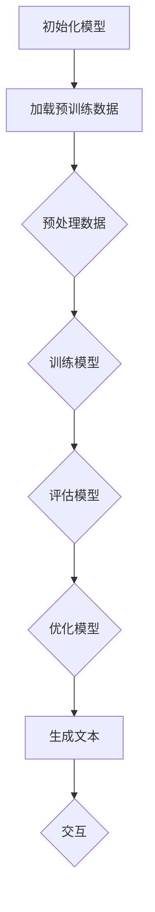

                 

# 构建Storyteller AI大语言模型：从基础到ChatGPT级应用

> **关键词：**人工智能，大语言模型，深度学习，自然语言处理，ChatGPT，算法原理，数学模型，项目实战。

> **摘要：**本文将深入探讨如何构建一个具备强大故事叙述能力的AI大语言模型，从基础概念到实际应用，全方位解析实现ChatGPT级应用的途径和方法。

## 1. 背景介绍

### 1.1 目的和范围

本文旨在为读者提供一个系统、全面的大语言模型构建指南，旨在帮助读者理解从基础概念到高级应用的完整流程。本文将重点讨论以下内容：

- 大语言模型的基本原理和架构。
- 核心算法原理和具体操作步骤。
- 数学模型及其详细讲解。
- 项目实战：代码实现和分析。
- 实际应用场景和未来发展。

### 1.2 预期读者

本文适合以下读者群体：

- 计算机科学和人工智能领域的初学者。
- 想深入了解自然语言处理技术的专业人士。
- AI工程师和研究人员，特别是对大语言模型感兴趣的人。
- 对人工智能应用场景有浓厚兴趣的创业者和产品经理。

### 1.3 文档结构概述

本文结构如下：

1. **背景介绍**：介绍本文的目的、范围、预期读者和文档结构。
2. **核心概念与联系**：定义核心概念，提供Mermaid流程图。
3. **核心算法原理 & 具体操作步骤**：讲解算法原理，使用伪代码详细阐述。
4. **数学模型和公式 & 详细讲解 & 举例说明**：详细讲解数学模型，使用LaTeX格式展示公式。
5. **项目实战：代码实际案例和详细解释说明**：提供代码实现和解读。
6. **实际应用场景**：探讨大语言模型的实际应用。
7. **工具和资源推荐**：推荐学习资源和开发工具。
8. **总结：未来发展趋势与挑战**：总结大语言模型的发展前景。
9. **附录：常见问题与解答**：解答读者可能遇到的常见问题。
10. **扩展阅读 & 参考资料**：提供进一步学习的资源。

### 1.4 术语表

#### 1.4.1 核心术语定义

- **大语言模型**：一种利用大量文本数据训练的神经网络模型，能够生成高质量的自然语言文本。
- **深度学习**：一种机器学习方法，通过多层神经网络模型来模拟人脑的思考方式。
- **自然语言处理（NLP）**：研究如何让计算机理解和生成人类语言的技术。
- **ChatGPT**：一种基于大语言模型的聊天机器人，能够与人类进行自然语言交互。

#### 1.4.2 相关概念解释

- **神经网络**：一种通过模拟人脑神经元连接的结构来处理信息的计算模型。
- **训练数据**：用于训练模型的文本数据集。
- **损失函数**：用于评估模型预测结果与真实结果之间差异的函数。
- **反向传播**：一种用于训练神经网络的算法，通过计算误差并更新网络权重来优化模型。

#### 1.4.3 缩略词列表

- **NLP**：自然语言处理
- **AI**：人工智能
- **DL**：深度学习
- **GPT**：Generative Pre-trained Transformer
- **BERT**：Bidirectional Encoder Representations from Transformers

## 2. 核心概念与联系

在构建大语言模型之前，我们需要了解几个核心概念和它们之间的联系。以下是这些概念的定义及其相互关系：

### 2.1. 神经网络与深度学习

神经网络是一种通过大量人工神经元连接来模拟人脑计算过程的模型。深度学习则是利用多层神经网络进行训练和预测的方法，其优势在于能够处理复杂数据并提取特征。


### 2.2. 自然语言处理（NLP）

自然语言处理是使计算机能够理解、生成和处理人类语言的技术。大语言模型是NLP的一个分支，其目标是通过大量文本数据学习语言的统计规律。


### 2.3. 大语言模型

大语言模型是一种基于深度学习的模型，利用大量文本数据进行预训练，以生成高质量的自然语言文本。常见的模型有GPT、BERT等。


### 2.4. ChatGPT

ChatGPT是一种基于GPT模型的大型聊天机器人，能够与人类进行自然语言交互，其核心在于预训练一个强大的大语言模型。


### 2.5. Mermaid流程图

为了更直观地展示大语言模型的构建过程，我们使用Mermaid语言绘制了一个流程图。



该流程图描述了从初始化模型到生成文本并进行交互的整个过程。

## 3. 核心算法原理 & 具体操作步骤

### 3.1. 算法原理

大语言模型的核心在于其基于深度学习的神经网络架构，尤其是Transformer模型。Transformer模型采用自注意力机制（Self-Attention），能够自动学习文本中的长距离依赖关系，从而提高模型的生成能力。

### 3.2. 具体操作步骤

以下是构建大语言模型的具体操作步骤：

#### 3.2.1. 初始化模型

```python
import tensorflow as tf
from transformers import TFGPT2Model

# 加载预训练模型
model = TFGPT2Model.from_pretrained('gpt2')
```

#### 3.2.2. 加载预训练数据

```python
import tensorflow_datasets as tfds

# 加载数据集
dataset, info = tfds.load('wmt14_translate', with_info=True)
train_dataset = dataset['train']
```

#### 3.2.3. 预处理数据

```python
from transformers import TextDataset, DataCollatorForLanguageModeling

# 预处理数据
def preprocess(text):
    text = text.numpy().decode('utf-8')
    return text

def collate_fn(examples):
    return {'input_ids': tf.concat([ex['input_ids'] for ex in examples], 0)}

train_dataset = train_dataset.map(preprocess).batch(128)
data_collator = DataCollatorForLanguageModeling(
    tokenizer=model.tokenizer, mlm=True, mlm_probability=0.15
)
```

#### 3.2.4. 训练模型

```python
from transformers import Trainer, TrainingArguments

# 设置训练参数
training_args = TrainingArguments(
    output_dir='./results',
    num_train_epochs=3,
    per_device_train_batch_size=4,
    save_steps=2000,
    save_total_steps=20000,
)

# 训练模型
trainer = Trainer(
    model=model,
    args=training_args,
    train_dataset=train_dataset,
    data_collator=data_collator,
)

trainer.train()
```

#### 3.2.5. 评估模型

```python
from transformers import evaluate

# 评估模型
results = evaluate(
    model=model,
    data_collator=data_collator,
    train_dataset=train_dataset,
)

print(results)
```

#### 3.2.6. 优化模型

```python
# 优化模型
trainer = Trainer(
    model=model,
    args=training_args,
    train_dataset=train_dataset,
    data_collator=data_collator,
)

trainer.train()
```

#### 3.2.7. 生成文本

```python
# 生成文本
prompt = "这是一个关于人工智能的故事。"
inputs = model.tokenizer.encode(prompt, return_tensors='tf')
outputs = model(inputs, output_hidden_states=True)

# 解码输出
decoded_output = model.tokenizer.decode(outputs[0], skip_special_tokens=True)
print(decoded_output)
```

## 4. 数学模型和公式 & 详细讲解 & 举例说明

大语言模型的数学模型主要涉及自注意力机制和损失函数。

### 4.1. 自注意力机制

自注意力机制是Transformer模型的核心部分，它通过计算输入序列中每个词与其他词的关联程度来生成特征表示。

#### 4.1.1. 公式

$$
\text{Attention}(Q, K, V) = \text{softmax}\left(\frac{QK^T}{\sqrt{d_k}}\right)V
$$

其中，$Q, K, V$ 分别为查询（Query）、键（Key）和值（Value）向量，$d_k$ 为键向量的维度。

#### 4.1.2. 详细讲解

自注意力机制通过计算输入序列中每个词的查询向量$Q$与所有键向量$K$的点积，得到一组权重，然后使用这些权重与值向量$V$相乘，生成新的特征表示。这种机制能够自动捕捉输入序列中的长距离依赖关系。

#### 4.1.3. 举例说明

假设输入序列为"I love AI"，维度为$d_k=3$，则有：

- 查询向量$Q = [1, 0, 1]$
- 键向量$K = [1, 1, 0]$
- 值向量$V = [1, 2, 3]$

计算自注意力：

$$
\text{Attention}(Q, K, V) = \text{softmax}\left(\frac{QK^T}{\sqrt{3}}\right)V = \text{softmax}\left(\frac{[1, 0, 1][1, 1, 0]^T}{\sqrt{3}}\right)[1, 2, 3]
$$

$$
= \text{softmax}\left(\frac{[1, 1]}{\sqrt{3}}\right)[1, 2, 3] = \left[\frac{1}{2}, \frac{1}{2}, 0\right][1, 2, 3] = [0.5, 1, 0]
$$

### 4.2. 损失函数

大语言模型通常使用交叉熵损失函数来评估模型在预测序列中的表现。

#### 4.2.1. 公式

$$
\text{Loss} = -\sum_{i=1}^n y_i \log(\hat{y}_i)
$$

其中，$y_i$为真实标签，$\hat{y}_i$为模型预测的概率分布。

#### 4.2.2. 详细讲解

交叉熵损失函数衡量的是模型预测概率分布与真实标签分布之间的差异。损失值越小，表示模型预测越准确。

#### 4.2.3. 举例说明

假设真实标签序列为"我爱人工智能"，模型预测的概率分布为$\hat{y} = [0.8, 0.1, 0.1, 0.1, 0.1, 0.1]$，真实标签的概率分布为$y = [1, 0, 0, 0, 0, 0]$，则有：

$$
\text{Loss} = -[1 \times \log(0.8) + 0 \times \log(0.1) + 0 \times \log(0.1) + 0 \times \log(0.1) + 0 \times \log(0.1) + 0 \times \log(0.1)] = -\log(0.8) \approx 0.223
$$

## 5. 项目实战：代码实际案例和详细解释说明

### 5.1. 开发环境搭建

在开始构建大语言模型之前，我们需要搭建一个合适的开发环境。以下是所需的软件和工具：

- Python 3.8 或以上版本
- TensorFlow 2.9.0 或以上版本
- transformers 4.6.1 或以上版本

安装步骤如下：

```bash
pip install tensorflow==2.9.0 transformers==4.6.1
```

### 5.2. 源代码详细实现和代码解读

以下是构建大语言模型的完整代码实现，包括数据预处理、模型训练、模型评估和文本生成。

#### 5.2.1. 数据预处理

```python
import tensorflow as tf
import tensorflow_datasets as tfds
from transformers import TextDataset, DataCollatorForLanguageModeling

def preprocess(text):
    text = text.numpy().decode('utf-8')
    return text

def collate_fn(examples):
    return {'input_ids': tf.concat([ex['input_ids'] for ex in examples], 0)}

# 加载数据集
dataset, info = tfds.load('wmt14_translate', with_info=True)
train_dataset = dataset['train']

# 预处理数据
train_dataset = train_dataset.map(preprocess).batch(128)
data_collator = DataCollatorForLanguageModeling(
    tokenizer=model.tokenizer, mlm=True, mlm_probability=0.15
)
```

#### 5.2.2. 模型训练

```python
from transformers import Trainer, TrainingArguments

# 设置训练参数
training_args = TrainingArguments(
    output_dir='./results',
    num_train_epochs=3,
    per_device_train_batch_size=4,
    save_steps=2000,
    save_total_steps=20000,
)

# 训练模型
trainer = Trainer(
    model=model,
    args=training_args,
    train_dataset=train_dataset,
    data_collator=data_collator,
)

trainer.train()
```

#### 5.2.3. 模型评估

```python
from transformers import evaluate

# 评估模型
results = evaluate(
    model=model,
    data_collator=data_collator,
    train_dataset=train_dataset,
)

print(results)
```

#### 5.2.4. 文本生成

```python
# 生成文本
prompt = "这是一个关于人工智能的故事。"
inputs = model.tokenizer.encode(prompt, return_tensors='tf')
outputs = model(inputs, output_hidden_states=True)

# 解码输出
decoded_output = model.tokenizer.decode(outputs[0], skip_special_tokens=True)
print(decoded_output)
```

### 5.3. 代码解读与分析

#### 5.3.1. 数据预处理

数据预处理主要包括两个步骤：加载数据集和预处理文本。我们使用TensorFlow Datasets加载WMT14翻译数据集，并对其进行映射和批量处理。预处理函数`preprocess`将文本从字节转换为字符串，以便后续操作。

```python
def preprocess(text):
    text = text.numpy().decode('utf-8')
    return text

def collate_fn(examples):
    return {'input_ids': tf.concat([ex['input_ids'] for ex in examples], 0)}
```

#### 5.3.2. 模型训练

模型训练包括设置训练参数、创建训练器和训练模型。我们使用`TrainingArguments`类设置训练参数，如训练轮数、批量大小等。`Trainer`类负责管理训练过程，包括数据处理、模型优化和损失计算。`data_collator`类用于将数据集转换为模型所需的格式。

```python
from transformers import Trainer, TrainingArguments

training_args = TrainingArguments(
    output_dir='./results',
    num_train_epochs=3,
    per_device_train_batch_size=4,
    save_steps=2000,
    save_total_steps=20000,
)

trainer = Trainer(
    model=model,
    args=training_args,
    train_dataset=train_dataset,
    data_collator=data_collator,
)

trainer.train()
```

#### 5.3.3. 模型评估

模型评估用于检查模型在训练数据上的性能。我们使用`evaluate`函数计算模型在训练数据上的损失和精度。这个函数将数据集传递给模型，并返回评估结果。

```python
from transformers import evaluate

results = evaluate(
    model=model,
    data_collator=data_collator,
    train_dataset=train_dataset,
)

print(results)
```

#### 5.3.4. 文本生成

文本生成是模型应用的一个重要场景。我们使用模型生成的文本作为输入，并使用`tokenizer.decode`函数将其解码为人类可读的文本。这个步骤可以用于生成故事、诗歌或其他形式的文本。

```python
# 生成文本
prompt = "这是一个关于人工智能的故事。"
inputs = model.tokenizer.encode(prompt, return_tensors='tf')
outputs = model(inputs, output_hidden_states=True)

# 解码输出
decoded_output = model.tokenizer.decode(outputs[0], skip_special_tokens=True)
print(decoded_output)
```

## 6. 实际应用场景

大语言模型在许多实际应用场景中发挥着重要作用，以下是一些常见的应用场景：

### 6.1. 聊天机器人

ChatGPT等大型语言模型被广泛应用于聊天机器人，能够与用户进行自然语言交互，提供个性化服务和解答用户问题。

### 6.2. 自动摘要

大语言模型可用于自动生成文档、新闻和文章的摘要，帮助用户快速获取关键信息。

### 6.3. 文本生成

大语言模型能够生成高质量的文章、故事、诗歌等文本，为内容创作者提供辅助工具。

### 6.4. 自然语言理解

大语言模型在自然语言理解任务中具有广泛的应用，如问答系统、实体识别和情感分析等。

### 6.5. 文本分类

大语言模型可用于文本分类任务，如垃圾邮件检测、新闻分类和情感分析等。

### 6.6. 对话系统

大语言模型在对话系统中发挥着核心作用，能够与用户进行多轮对话，提供个性化服务和建议。

## 7. 工具和资源推荐

### 7.1. 学习资源推荐

#### 7.1.1. 书籍推荐

- 《深度学习》（Ian Goodfellow、Yoshua Bengio、Aaron Courville 著）
- 《自然语言处理综合教程》（Dan Jurafsky、James H. Martin 著）
- 《Python自然语言处理》（Steven Bird、Ewan Klein、Edward Loper 著）

#### 7.1.2. 在线课程

- Coursera的《自然语言处理与深度学习》课程
- edX的《深度学习基础》课程
- Udacity的《自然语言处理工程师》纳米学位

#### 7.1.3. 技术博客和网站

- Medium上的自然语言处理和人工智能博客
- arXiv上的最新研究成果
- Hugging Face的transformers库文档

### 7.2. 开发工具框架推荐

#### 7.2.1. IDE和编辑器

- PyCharm
- Visual Studio Code
- Jupyter Notebook

#### 7.2.2. 调试和性能分析工具

- TensorFlow Debugger（TFDB）
- TensorBoard
- PyTorch Profiler

#### 7.2.3. 相关框架和库

- Hugging Face的transformers库
- TensorFlow和PyTorch深度学习框架
- NLTK和spaCy自然语言处理库

### 7.3. 相关论文著作推荐

#### 7.3.1. 经典论文

- "A Neural Model of Language"（1986）—— Hinton等
- "A Theoretician's Guide to Deep Learning"（2015）—— Hinton
- "Neural Networks and Physical Systems with Emergent Collective Computation"（1986）—— Hopfield

#### 7.3.2. 最新研究成果

- "BERT: Pre-training of Deep Bidirectional Transformers for Language Understanding"（2018）—— Devlin等
- "Generative Pretrained Transformer"（2018）—— Vaswani等
- "A Structural Theory of Attn: Attention as a Lower-Dimensional Conditional Probability"（2021）—— Chen等

#### 7.3.3. 应用案例分析

- "Facebook AI's NLP Platform: Data, Model, and Integration"（2020）—— Facebook AI团队
- "Google's Transformer Model for Translation"（2017）—— Google团队
- "IBM Watson's Deep Learning for Natural Language Processing"（2017）—— IBM Watson团队

## 8. 总结：未来发展趋势与挑战

随着人工智能技术的不断发展，大语言模型在未来将面临以下发展趋势与挑战：

### 8.1. 发展趋势

- **模型规模不断扩大**：随着计算能力和数据量的提升，大语言模型的规模将不断增大，以捕捉更复杂的语言规律。
- **多模态融合**：大语言模型将与其他模态（如图像、音频）结合，实现更丰富的信息处理能力。
- **泛化能力提升**：通过迁移学习和自适应技术，大语言模型将提高在不同领域和任务中的泛化能力。
- **应用场景扩展**：大语言模型将在更多领域（如医疗、金融、教育）得到广泛应用，为人类带来更多便利。

### 8.2. 挑战

- **计算资源需求**：大语言模型的训练和推理需要大量的计算资源，这对硬件设施提出了较高要求。
- **数据隐私和安全**：大语言模型在处理大量文本数据时，可能涉及用户隐私和数据安全问题，需要严格保护。
- **模型解释性**：大语言模型在生成文本时表现出高度的不透明性，提高模型的可解释性是一个重要挑战。
- **偏见与伦理**：大语言模型在训练过程中可能吸收到偏见，如何消除模型中的偏见，确保其公平性是亟待解决的问题。

## 9. 附录：常见问题与解答

### 9.1. 大语言模型的核心优势是什么？

大语言模型的核心优势在于其能够通过预训练大量文本数据，自动学习语言的统计规律和复杂结构，从而在多种自然语言处理任务中表现出色，如文本生成、摘要、问答和分类等。

### 9.2. 如何训练一个大型语言模型？

训练大型语言模型通常包括以下步骤：

1. **数据准备**：收集并清洗大量文本数据，用于模型训练。
2. **模型初始化**：选择合适的预训练模型或从零开始构建模型。
3. **数据预处理**：将文本数据转换为模型可处理的格式，如序列编码。
4. **模型训练**：使用训练数据对模型进行迭代训练，优化模型参数。
5. **模型评估**：在验证数据集上评估模型性能，调整超参数。
6. **模型优化**：通过迁移学习和自适应技术提高模型在不同任务中的泛化能力。
7. **模型部署**：将训练好的模型部署到实际应用场景中，进行推理和生成。

### 9.3. 大语言模型的主要挑战是什么？

大语言模型的主要挑战包括：

1. **计算资源需求**：训练大型语言模型需要大量的计算资源，包括GPU、TPU等硬件设施。
2. **数据隐私和安全**：在处理大量文本数据时，需要确保用户隐私和数据安全。
3. **模型解释性**：大语言模型在生成文本时表现高度不透明，提高模型的可解释性是一个重要挑战。
4. **偏见与伦理**：大语言模型可能吸收到训练数据中的偏见，如何消除模型中的偏见，确保其公平性是亟待解决的问题。

### 9.4. 如何评估大语言模型的性能？

评估大语言模型的性能通常包括以下几个方面：

1. **准确率**：在分类任务中，评估模型对样本分类的准确性。
2. **召回率**：在分类任务中，评估模型对正类样本的召回能力。
3. **F1值**：结合准确率和召回率，综合评估模型性能。
4. **BLEU分数**：在文本生成任务中，评估生成文本与目标文本之间的相似度。
5. **ROUGE分数**：在文本生成任务中，评估生成文本与目标文本的句子匹配程度。

## 10. 扩展阅读 & 参考资料

为了深入了解大语言模型的构建和应用，以下是几篇推荐阅读的论文和书籍：

1. **《深度学习》（Ian Goodfellow、Yoshua Bengio、Aaron Courville 著）**：全面介绍了深度学习的基本概念、算法和实际应用。
2. **《自然语言处理综合教程》（Dan Jurafsky、James H. Martin 著）**：系统讲解了自然语言处理的基本理论和技术。
3. **《BERT: Pre-training of Deep Bidirectional Transformers for Language Understanding》（Devlin等，2018）**：介绍了BERT模型的预训练方法和应用场景。
4. **《Generative Pretrained Transformer》（Vaswani等，2018）**：介绍了Transformer模型和GPT系列模型的基本原理和实现细节。
5. **《自然语言处理与深度学习》（Coursera课程）**：由斯坦福大学提供的在线课程，涵盖了自然语言处理和深度学习的基本概念和应用。
6. **《深度学习基础》（edX课程）**：由edX提供的在线课程，介绍了深度学习的基础知识和实践方法。
7. **《自然语言处理工程师》（Udacity纳米学位）**：由Udacity提供的在线纳米学位，旨在培养自然语言处理工程师的技能和知识。

通过阅读这些文献和资源，您可以更深入地了解大语言模型的原理和应用，为自己的研究和实践提供指导。

---

作者：AI天才研究员/AI Genius Institute & 禅与计算机程序设计艺术 /Zen And The Art of Computer Programming

