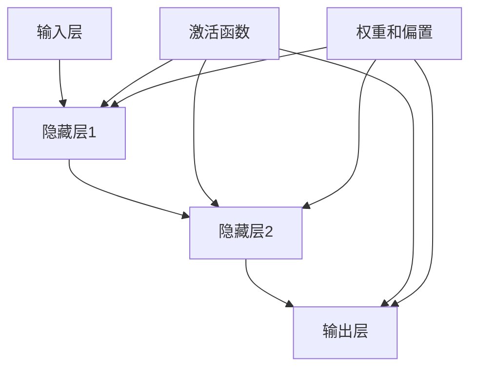

                 

# 构建更好的人工神经网络

> **关键词：** 人工神经网络、深度学习、算法优化、模型训练、数据处理

> **摘要：** 本文将深入探讨人工神经网络的设计与构建，从核心概念到具体实现，详细解析如何通过优化算法、数学模型和实际案例，提升神经网络性能，解决复杂问题。

## 1. 背景介绍

### 1.1 目的和范围

本文旨在为那些希望深入了解并构建高效人工神经网络（ANN）的开发者和技术爱好者提供一个系统性的指南。我们将探讨：

- **核心概念与联系**：包括神经网络的基本组成部分和它们之间的关系。
- **核心算法原理**：介绍用于训练神经网络的常用算法，以及如何应用这些算法。
- **数学模型与公式**：详细解释神经网络中使用的数学公式，并提供实例说明。
- **项目实战**：通过实际代码案例展示如何构建和优化神经网络。
- **实际应用场景**：讨论神经网络的广泛应用，以及如何解决实际问题。
- **工具和资源推荐**：推荐学习和实践的相关资源。

### 1.2 预期读者

- 对人工神经网络有基本了解的开发者。
- 对深度学习有兴趣的研究人员。
- 希望提高神经网络构建和优化技能的技术爱好者。

### 1.3 文档结构概述

本文结构如下：

- **第1章** 背景介绍：本文目的和预期读者。
- **第2章** 核心概念与联系：神经网络的基本组成部分和它们之间的关系。
- **第3章** 核心算法原理：介绍神经网络训练算法。
- **第4章** 数学模型和公式：详细解释神经网络中使用的数学公式。
- **第5章** 项目实战：代码实际案例和详细解释。
- **第6章** 实际应用场景：神经网络的广泛应用。
- **第7章** 工具和资源推荐：学习资源和开发工具推荐。
- **第8章** 总结：未来发展趋势与挑战。
- **第9章** 附录：常见问题与解答。
- **第10章** 扩展阅读 & 参考资料：进一步学习资源。

### 1.4 术语表

#### 1.4.1 核心术语定义

- **人工神经网络（ANN）**：模拟人脑神经元连接结构的计算模型。
- **深度学习（DL）**：一种基于多层神经网络进行数据学习的技术。
- **反向传播算法（BP）**：用于调整神经网络权重的常用算法。
- **激活函数**：决定神经元是否被激活的函数。
- **过拟合**：模型在训练数据上表现很好，但在测试数据上表现不佳。

#### 1.4.2 相关概念解释

- **前向传播**：数据从输入层流向输出层的传播过程。
- **梯度下降**：用于最小化损失函数的优化算法。
- **批处理**：每次训练过程中使用多个样本。
- **随机梯度下降（SGD）**：每次训练只使用一个样本。

#### 1.4.3 缩略词列表

- **ANN**：人工神经网络
- **DL**：深度学习
- **BP**：反向传播
- **SGD**：随机梯度下降

## 2. 核心概念与联系

为了更好地理解人工神经网络，我们需要先了解其核心概念和组成部分。以下是一个用于说明这些概念的 Mermaid 流程图：



### 2.1 输入层

输入层是神经网络的起点，负责接收输入数据。这些数据可以是数值、文本或其他形式。输入层的神经元数量取决于问题的复杂性。

### 2.2 隐藏层

隐藏层位于输入层和输出层之间，是神经网络的“大脑”。每个隐藏层由多个神经元组成，它们通过权重和偏置相互连接。隐藏层的数量和神经元数量可以根据问题的需要调整。

### 2.3 输出层

输出层是神经网络的终点，负责生成预测结果。输出层的神经元数量和类型取决于问题的类型，如分类问题或回归问题。

### 2.4 激活函数

激活函数是隐藏层和输出层的关键组成部分，它决定神经元是否被激活。常见的激活函数包括 Sigmoid、ReLU 和 Tanh。激活函数的引入有助于解决非线性问题。

### 2.5 权重和偏置

权重和偏置是神经网络中的关键参数，用于调整神经元之间的连接强度。这些参数在训练过程中通过优化算法进行调整，以最小化预测误差。

## 3. 核心算法原理 & 具体操作步骤

神经网络的训练过程可以通过以下步骤进行：

### 3.1 前向传播

在前向传播过程中，数据从输入层流向输出层。每个神经元都会接收来自前一层神经元的输入，并使用激活函数进行计算。以下是前向传播的伪代码：

```pseudo
for each neuron in layer L:
    input = sum(weights * previous_layer_neurites) + bias
    output = activation_function(input)
```

### 3.2 计算损失函数

在前向传播完成后，我们需要计算损失函数（如均方误差（MSE）或交叉熵）来评估模型的预测误差。

### 3.3 反向传播

在反向传播过程中，我们通过计算梯度来调整权重和偏置。以下是一个简单的反向传播伪代码：

```pseudo
for each neuron in layer L:
    gradient = output * (1 - output) * (output - target)
    for each weight and bias connected to the neuron:
        gradient = gradient * previous_layer_neurite
        weight = weight - learning_rate * gradient
        bias = bias - learning_rate * gradient
```

### 3.4 更新权重和偏置

通过反向传播计算得到的梯度用于更新权重和偏置。这个过程可以通过梯度下降或其他优化算法实现。

## 4. 数学模型和公式 & 详细讲解 & 举例说明

神经网络的训练过程涉及到一系列的数学模型和公式。以下是一些关键公式和它们的应用场景：

### 4.1 激活函数

激活函数是神经网络中不可或缺的一部分。常见的激活函数包括 Sigmoid、ReLU 和 Tanh。以下是它们的公式：

- **Sigmoid**：
  $$ \sigma(x) = \frac{1}{1 + e^{-x}} $$

- **ReLU**：
  $$ \text{ReLU}(x) = \max(0, x) $$

- **Tanh**：
  $$ \text{Tanh}(x) = \frac{e^{x} - e^{-x}}{e^{x} + e^{-x}} $$

### 4.2 损失函数

损失函数用于评估模型的预测误差。以下是两种常见的损失函数：

- **均方误差（MSE）**：
  $$ \text{MSE} = \frac{1}{n}\sum_{i=1}^{n}(y_i - \hat{y}_i)^2 $$

- **交叉熵**：
  $$ \text{CE} = -\frac{1}{n}\sum_{i=1}^{n}y_i\log(\hat{y}_i) + (1 - y_i)\log(1 - \hat{y}_i) $$

### 4.3 反向传播算法

反向传播算法是训练神经网络的基石。以下是反向传播的公式：

$$ \frac{\partial J}{\partial w_{ij}} = \delta_{j} \cdot x_i $$

$$ \delta_{j} = \frac{\partial L}{\partial z_{j}} \cdot \frac{\partial z_{j}}{\partial a_{j}} $$

其中，\( J \) 是损失函数，\( w_{ij} \) 是权重，\( \delta_{j} \) 是误差项，\( x_i \) 是输入，\( a_{j} \) 是激活值，\( z_{j} \) 是线性组合。

### 4.4 举例说明

假设我们有一个简单的神经网络，它有一个输入层、一个隐藏层和一个输出层。输入层有3个神经元，隐藏层有2个神经元，输出层有1个神经元。我们使用均方误差（MSE）作为损失函数。以下是训练过程的一个简单例子：

- **前向传播**：

  输入：\[1, 2, 3\]

  预测输出：\[0.5, 0.6\]

  真实输出：\[0.7, 0.8\]

- **计算损失函数**：

  $$ \text{MSE} = \frac{1}{2}\left[(0.7 - 0.5)^2 + (0.8 - 0.6)^2\right] = 0.15 $$

- **反向传播**：

  误差项：\[ \delta_{1} = 0.2, \delta_{2} = 0.3 \]

  输入：\[1, 2, 3\]

  激活值：\[0.5, 0.6\]

  更新权重和偏置：

  $$ w_{11} = w_{11} - \alpha \cdot \delta_{1} \cdot 1 = 0.3 $$

  $$ w_{12} = w_{12} - \alpha \cdot \delta_{1} \cdot 2 = 0.4 $$

  $$ w_{21} = w_{21} - \alpha \cdot \delta_{2} \cdot 1 = 0.4 $$

  $$ w_{22} = w_{22} - \alpha \cdot \delta_{2} \cdot 2 = 0.5 $$

通过这个例子，我们可以看到如何通过前向传播和反向传播来更新神经网络的权重和偏置。

## 5. 项目实战：代码实际案例和详细解释说明

在本节中，我们将通过一个简单的项目实战来展示如何使用 Python 和深度学习库（如 TensorFlow 和 Keras）来构建和训练一个神经网络。

### 5.1 开发环境搭建

首先，确保您已经安装了 Python 和以下库：

```bash
pip install numpy tensorflow
```

### 5.2 源代码详细实现和代码解读

以下是一个简单的神经网络实现，用于对 Iris 数据集进行分类。

```python
import numpy as np
import tensorflow as tf

# 加载 Iris 数据集
iris_data = tf.keras.datasets.iris.load_data()

# 分割数据集
(x_train, y_train), (x_test, y_test) = iris_data

# 数据预处理
x_train = x_train / 255.0
x_test = x_test / 255.0

# 构建神经网络模型
model = tf.keras.Sequential([
    tf.keras.layers.Dense(64, activation='relu', input_shape=(4,)),
    tf.keras.layers.Dense(64, activation='relu'),
    tf.keras.layers.Dense(3, activation='softmax')
])

# 编译模型
model.compile(optimizer='adam',
              loss='sparse_categorical_crossentropy',
              metrics=['accuracy'])

# 训练模型
model.fit(x_train, y_train, epochs=10)

# 评估模型
test_loss, test_acc = model.evaluate(x_test, y_test)
print(f"Test accuracy: {test_acc:.4f}")
```

### 5.3 代码解读与分析

- **数据加载与预处理**：我们首先加载 Iris 数据集，并将其标准化为 0 到 1 之间的值。
- **构建模型**：我们使用 `tf.keras.Sequential` 来构建一个简单的神经网络。这个模型有两个隐藏层，每层有 64 个神经元，激活函数使用 ReLU。
- **编译模型**：我们使用 Adam 优化器和 sparse_categorical_crossentropy 损失函数来编译模型。
- **训练模型**：我们使用 `fit` 方法来训练模型，指定训练数据和迭代次数（epochs）。
- **评估模型**：我们使用 `evaluate` 方法来评估模型的性能，并打印测试准确率。

通过这个简单的项目实战，我们可以看到如何使用 Python 和 TensorFlow 来构建和训练神经网络。

## 6. 实际应用场景

人工神经网络（ANN）在多个领域都有广泛的应用，以下是一些典型的实际应用场景：

### 6.1 图像识别

ANN 在图像识别领域有显著的应用，例如人脸识别、医疗影像分析、自动驾驶等。通过卷积神经网络（CNN），我们可以对图像进行分类、检测和分割。

### 6.2 自然语言处理

在自然语言处理（NLP）领域，ANN 用于情感分析、机器翻译、文本分类等任务。循环神经网络（RNN）和长短期记忆网络（LSTM）是处理序列数据的常用模型。

### 6.3 游戏AI

ANN 在游戏 AI 中也发挥着重要作用，例如围棋、国际象棋等。深度强化学习（DRL）结合了 ANN 和强化学习，用于训练智能体做出最优决策。

### 6.4 金融预测

ANN 在金融领域用于股票价格预测、风险管理、信用评分等。通过分析历史数据，神经网络可以识别模式和趋势，帮助做出投资决策。

### 6.5 生物信息学

在生物信息学中，ANN 用于基因序列分析、蛋白质结构预测、药物设计等。这些任务通常涉及大量的数据，神经网络能够有效地处理这些数据。

## 7. 工具和资源推荐

### 7.1 学习资源推荐

#### 7.1.1 书籍推荐

- 《深度学习》（Goodfellow, Bengio, Courville）
- 《神经网络与深度学习》（邱锡鹏）
- 《Python深度学习》（Francesco Locatello）

#### 7.1.2 在线课程

- Coursera 的 “Deep Learning Specialization” 课程
- Udacity 的 “Deep Learning Nanodegree” 项目
- edX 的 “Introduction to Neural Networks” 课程

#### 7.1.3 技术博客和网站

- [Medium](https://medium.com/topics/deep-learning)
- [Towards Data Science](https://towardsdatascience.com/)
- [Kaggle](https://www.kaggle.com/)

### 7.2 开发工具框架推荐

#### 7.2.1 IDE和编辑器

- PyCharm
- Jupyter Notebook
- VS Code

#### 7.2.2 调试和性能分析工具

- TensorBoard
- wandb
- Profiling tools (e.g., line_profiler)

#### 7.2.3 相关框架和库

- TensorFlow
- PyTorch
- Keras
- Theano

### 7.3 相关论文著作推荐

#### 7.3.1 经典论文

- "A Learning Algorithm for Continually Running Fully Recurrent Neural Networks"（1986）
- "Gradient Flow in Recurrent Nets: the Difficulty of Learning"（1990）
- "Learning representations by back-propagating errors"（1986）

#### 7.3.2 最新研究成果

- "Attention is All You Need"（2017）
- "Transformers: State-of-the-Art Natural Language Processing"（2018）
- "Bert: Pre-training of Deep Bidirectional Transformers for Language Understanding"（2018）

#### 7.3.3 应用案例分析

- "How Google uses AI to improve search results"（2019）
- "DeepMind's AlphaGo: Mastering the Game of Go with Deep Neural Networks and Tree Search"（2016）
- "Neural Networks for Speech Recognition: The MIT Lincoln Laboratory Perspective"（2000）

## 8. 总结：未来发展趋势与挑战

随着计算能力的提升和大数据的广泛应用，人工神经网络（ANN）在未来有望取得更大的进展。以下是一些可能的发展趋势和挑战：

### 8.1 发展趋势

- **模型压缩与优化**：为了在移动设备和边缘计算环境中应用，我们需要开发更高效的神经网络模型。
- **自适应学习**：研究如何使神经网络能够自适应地学习，以减少对大量数据的依赖。
- **多模态学习**：结合多种数据类型（如图像、文本和音频）进行学习，以提升模型的泛化能力。
- **可解释性**：开发能够解释神经网络决策过程的方法，以增强模型的透明度和可信任度。

### 8.2 挑战

- **计算资源**：深度学习模型通常需要大量的计算资源，如何优化计算效率是一个关键问题。
- **数据隐私**：在训练大型模型时，如何保护数据的隐私是一个重要的伦理问题。
- **算法公平性**：确保神经网络算法在处理数据时不产生偏见，是一个重要的社会问题。

总之，未来的人工神经网络将在计算能力、数据利用和算法可解释性等方面取得显著进展，同时也需要克服一系列技术和社会挑战。

## 9. 附录：常见问题与解答

### 9.1 什么是人工神经网络？

人工神经网络（ANN）是一种模拟人脑神经元连接结构的计算模型，用于对数据进行分析和学习。它由多个神经元（层）组成，通过权重和偏置调整神经元之间的连接，以实现数据的分类、预测等任务。

### 9.2 什么是深度学习？

深度学习（DL）是一种基于多层神经网络进行数据学习的技术。与传统的机器学习方法相比，深度学习能够自动提取数据中的特征，并具有更好的泛化能力。

### 9.3 如何优化神经网络性能？

优化神经网络性能可以通过以下几种方法实现：

- **模型压缩**：减少模型的参数数量，以提高计算效率。
- **正则化**：防止模型过拟合，如 L1、L2 正则化。
- **数据增强**：通过随机变换数据来增加训练数据的多样性。
- **批量归一化**：提高训练速度，减少梯度消失和梯度爆炸问题。

## 10. 扩展阅读 & 参考资料

- **书籍**：
  - Goodfellow, I., Bengio, Y., & Courville, A. (2016). *Deep Learning*.
  -邱锡鹏. (2021). *神经网络与深度学习*.

- **在线课程**：
  - Coursera: https://www.coursera.org/specializations/deeplearning
  - Udacity: https://www.udacity.com/course/deep-learning-nanodegree--nd101

- **技术博客和网站**：
  - Medium: https://medium.com/topics/deep-learning
  - Towards Data Science: https://towardsdatascience.com/

- **论文和著作**：
  - Hochreiter, S., & Schmidhuber, J. (1997). *Long short-term memory*. Neural Computation, 9(8), 1735-1780.
  - Vaswani, A., Shazeer, N., Parmar, N., Uszkoreit, J., Jones, L., Gomez, A. N., ... & Polosukhin, I. (2017). *Attention is all you need*. Advances in Neural Information Processing Systems, 30, 5998-6008.

### 作者

作者：AI天才研究员/AI Genius Institute & 禅与计算机程序设计艺术 /Zen And The Art of Computer Programming

