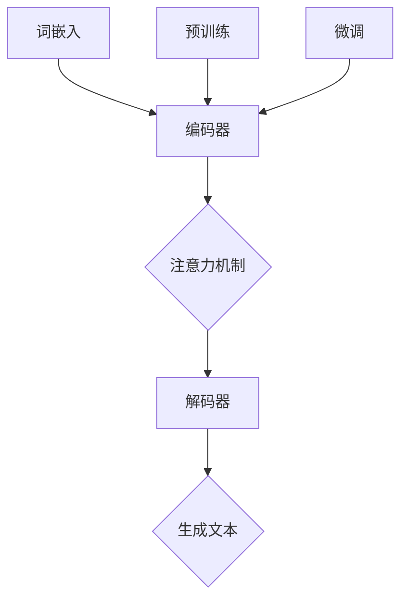
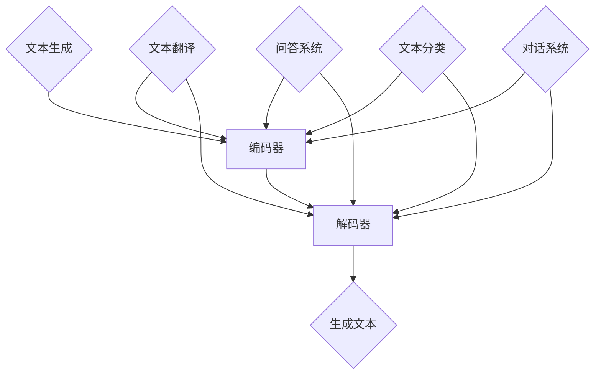
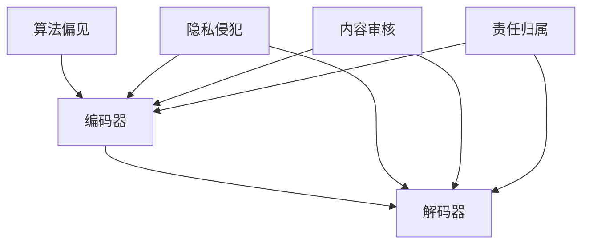

                 


# 构建负责任的AI：确保LLM行为的伦理性

> 关键词：负责任AI、伦理、LLM、语言模型、伦理审核、风险评估

> 摘要：本文旨在探讨如何构建负责任的AI系统，尤其是针对大型语言模型（LLM）的伦理性问题。我们将逐步分析LLM的工作原理，讨论可能的伦理风险，并提出一系列策略来确保其行为的伦理性。文章还将介绍实际应用案例，推荐学习资源，并总结未来发展趋势与挑战。

## 1. 背景介绍

### 1.1 目的和范围

本文的目标是帮助开发者和研究人员理解如何构建负责任的AI系统，特别关注大型语言模型（LLM）的伦理问题。随着AI技术的不断进步，尤其是自然语言处理（NLP）领域，LLM已经在各种实际应用中发挥着重要作用。然而，这些模型也引发了关于其伦理行为的广泛讨论。本文将探讨以下内容：

- LLM的工作原理及其在AI系统中的作用。
- LLM可能引发的伦理问题。
- 如何评估和减轻这些伦理风险。
- 实际应用案例和经验。
- 未来的发展趋势与挑战。

### 1.2 预期读者

本文适用于以下读者群体：

- AI开发者和研究人员，特别是对自然语言处理感兴趣的读者。
- 数据科学家和机器学习工程师，希望了解如何确保AI系统的伦理性。
- AI伦理学家和政策制定者，关注AI技术的伦理和社会影响。
- 对AI技术有浓厚兴趣的普通读者。

### 1.3 文档结构概述

本文将按照以下结构展开：

- 第1部分：背景介绍，包括目的和范围、预期读者、文档结构概述、术语表。
- 第2部分：核心概念与联系，介绍LLM的基本原理和结构。
- 第3部分：核心算法原理与操作步骤，详细解释LLM的训练和优化过程。
- 第4部分：数学模型和公式，解释与LLM相关的数学概念。
- 第5部分：项目实战，提供实际代码案例和解释。
- 第6部分：实际应用场景，讨论LLM在不同领域的应用。
- 第7部分：工具和资源推荐，介绍相关学习资源和开发工具。
- 第8部分：总结，展望未来的发展趋势与挑战。
- 第9部分：附录，提供常见问题与解答。
- 第10部分：扩展阅读与参考资料，推荐进一步阅读的文献。

### 1.4 术语表

#### 1.4.1 核心术语定义

- **负责任AI（Responsible AI）**：指在设计和部署AI系统时，充分考虑其伦理、法律、社会和经济影响，并采取措施确保其行为符合道德规范和法律法规。
- **大型语言模型（Large Language Model，LLM）**：一种基于深度学习的自然语言处理模型，可以生成文本、翻译语言、回答问题等，如GPT-3、BERT等。
- **伦理风险（Ethical Risk）**：指AI系统的设计、部署或应用过程中可能对个体、社会或环境产生的负面影响，包括歧视、隐私侵犯、安全威胁等。
- **伦理审核（Ethical Review）**：对AI系统的设计、开发和应用过程进行伦理评估，以确保其行为符合伦理规范。

#### 1.4.2 相关概念解释

- **伦理问题（Ethical Issues）**：涉及道德原则和价值观的争议，特别是在AI技术的应用中，如数据隐私、公平性、透明度等。
- **算法偏见（Algorithmic Bias）**：指AI系统在决策过程中表现出的对某些群体或特征的偏见，导致不公平的结果。
- **风险评估（Risk Assessment）**：对潜在风险进行识别、分析和评价，以便采取相应的风险管理措施。

#### 1.4.3 缩略词列表

- **AI**：人工智能
- **LLM**：大型语言模型
- **NLP**：自然语言处理
- **GPT-3**：生成预训练变换器3
- **BERT**：Bidirectional Encoder Representations from Transformers
- **IDE**：集成开发环境
- **API**：应用程序编程接口
- **SDK**：软件开发工具包

## 2. 核心概念与联系

### 2.1 LLM的基本原理

大型语言模型（LLM）是一种基于深度学习的自然语言处理模型，可以处理和生成自然语言文本。LLM的核心思想是通过大量的文本数据进行预训练，使其能够理解和生成自然语言的语法、语义和上下文。以下是一个简单的Mermaid流程图，描述LLM的基本原理：


### 2.2 LLM的结构

LLM通常由以下几个关键组件组成：

1. **词嵌入（Word Embedding）**：将自然语言文本转换为固定长度的向量表示，便于深度学习模型处理。
2. **编码器（Encoder）**：对输入文本进行编码，提取文本的语义信息。
3. **解码器（Decoder）**：根据编码器输出的上下文信息，生成文本输出。
4. **注意力机制（Attention Mechanism）**：在编码和解码过程中，关注输入文本的不同部分，以提高生成文本的质量。
5. **预训练和微调（Pre-training and Fine-tuning）**：在大量通用文本数据上进行预训练，然后在特定任务上进行微调，以适应具体应用场景。

以下是一个Mermaid流程图，描述LLM的结构：



### 2.3 LLM的应用场景

LLM在多个领域有广泛的应用，包括：

- **文本生成**：生成文章、新闻、故事、诗歌等。
- **文本翻译**：将一种语言的文本翻译成另一种语言。
- **问答系统**：回答用户提出的问题，提供相关信息。
- **文本分类**：对文本进行分类，如情感分析、主题分类等。
- **对话系统**：与用户进行自然语言交互，如聊天机器人、虚拟助手等。

以下是一个Mermaid流程图，描述LLM在不同应用场景中的工作流程：



### 2.4 伦理问题的联系

随着LLM在各个领域的应用，其潜在的伦理问题也逐渐凸显。以下是一些与LLM相关的伦理问题：

- **算法偏见**：LLM在训练过程中可能学习到偏见，导致生成的文本或决策结果具有偏见。
- **隐私侵犯**：LLM需要处理大量用户数据，可能涉及隐私侵犯问题。
- **内容审核**：如何确保生成的文本内容符合伦理和法律规范，避免传播有害信息。
- **责任归属**：在发生错误或损害时，如何确定责任归属，是开发人员、用户还是AI系统。

以下是一个Mermaid流程图，描述LLM与伦理问题的联系：



## 3. 核心算法原理 & 具体操作步骤

### 3.1 LLM的训练过程

大型语言模型（LLM）的训练过程可以分为两个主要阶段：预训练和微调。

#### 3.1.1 预训练

预训练是LLM训练的核心阶段，目的是通过大量无标签文本数据，使模型学习到文本的语义、语法和上下文信息。以下是预训练过程的伪代码：

```python
# 预训练伪代码

# 加载预训练模型
model = load_pretrained_model()

# 遍历训练数据
for text in training_data:
    # 切分文本为句子
    sentences = split_text_into_sentences(text)
    
    # 遍历句子
    for sentence in sentences:
        # 预处理句子
        processed_sentence = preprocess_sentence(sentence)
        
        # 生成输入和标签
        input_sequence, label_sequence = generate_input_and_label(processed_sentence)
        
        # 计算损失
        loss = model.compute_loss(input_sequence, label_sequence)
        
        # 反向传播和优化
        model.backward(loss)
        model.optimize()
```

#### 3.1.2 微调

在预训练完成后，需要对模型进行微调，使其适应特定任务和应用场景。微调过程通常使用有标签的数据，如问答系统、文本分类等。以下是微调过程的伪代码：

```python
# 微调伪代码

# 加载预训练模型
model = load_pretrained_model()

# 遍历微调数据
for text, label in fine_tuning_data:
    # 切分文本为句子
    sentences = split_text_into_sentences(text)
    
    # 遍历句子
    for sentence in sentences:
        # 预处理句子
        processed_sentence = preprocess_sentence(sentence)
        
        # 生成输入和标签
        input_sequence, label_sequence = generate_input_and_label(processed_sentence, label)
        
        # 计算损失
        loss = model.compute_loss(input_sequence, label_sequence)
        
        # 反向传播和优化
        model.backward(loss)
        model.optimize()
```

### 3.2 LLM的优化过程

LLM的优化过程主要包括以下步骤：

1. **参数初始化**：初始化模型参数，通常使用随机初始化。
2. **前向传播**：计算模型输入到输出的预测结果。
3. **计算损失**：计算预测结果与真实标签之间的差异，以衡量模型的性能。
4. **反向传播**：计算损失对模型参数的梯度。
5. **优化更新**：根据梯度更新模型参数，以减少损失。

以下是LLM优化过程的伪代码：

```python
# 优化过程伪代码

# 初始化模型参数
model.initialize_params()

# 循环进行前向传播、计算损失、反向传播和优化更新
while not convergence:
    # 前向传播
    output = model.forward(input)
    
    # 计算损失
    loss = model.compute_loss(output, label)
    
    # 反向传播
    grads = model.backward(loss)
    
    # 优化更新
    model.update_params(grads)
```

### 3.3 LLM的训练技巧

为了提高LLM的训练效果，可以采用以下技巧：

1. **学习率调整**：使用适当的初始学习率，并在训练过程中逐渐降低学习率。
2. **权重初始化**：使用随机初始化，并调整方差，以避免梯度消失或爆炸。
3. **正则化**：添加正则化项，如L2正则化，以防止过拟合。
4. **数据增强**：通过变换输入数据，增加模型的泛化能力。
5. **批量归一化**：在神经网络中引入批量归一化，提高训练稳定性。

```python
# 学习率调整伪代码

# 初始化学习率
learning_rate = 0.1

# 循环进行前向传播、计算损失、反向传播和优化更新
while not convergence:
    # 前向传播
    output = model.forward(input)
    
    # 计算损失
    loss = model.compute_loss(output, label)
    
    # 反向传播
    grads = model.backward(loss)
    
    # 优化更新
    model.update_params(grads, learning_rate)
    
    # 学习率调整
    learning_rate *= learning_rate_decay
```

## 4. 数学模型和公式 & 详细讲解 & 举例说明

### 4.1 语言模型的基本数学模型

大型语言模型（LLM）通常基于生成式语言模型（Generative Language Model）进行训练。生成式语言模型的基本数学模型如下：

\[ P(\text{word}_t | \text{context}_t) = \frac{\exp(\text{score}(\text{word}_t, \text{context}_t))}{\sum_{w'} \exp(\text{score}(w', \text{context}_t))} \]

其中：

- \( P(\text{word}_t | \text{context}_t) \) 表示在给定上下文 \( \text{context}_t \) 下，单词 \( \text{word}_t \) 的概率。
- \( \text{score}(\text{word}_t, \text{context}_t) \) 表示单词 \( \text{word}_t \) 和上下文 \( \text{context}_t \) 之间的评分，通常由神经网络计算。

### 4.2 评分函数

评分函数是语言模型的核心部分，用于计算单词和上下文之间的相似度。一个简单的评分函数可以是：

\[ \text{score}(\text{word}_t, \text{context}_t) = \text{logit}(\text{similarity}(\text{word}_t, \text{context}_t)) \]

其中：

- \( \text{similarity}(\text{word}_t, \text{context}_t) \) 表示单词 \( \text{word}_t \) 和上下文 \( \text{context}_t \) 之间的相似度。
- \( \text{logit} \) 是一个非线性转换函数，用于将相似度转换为评分。

### 4.3 举例说明

假设有一个简单的上下文 \( \text{context}_t = "The cat" \)，单词 \( \text{word}_t = "sat" \)。根据上述评分函数，可以计算评分如下：

\[ \text{score}(\text{word}_t, \text{context}_t) = \text{logit}(\text{similarity}(\text{word}_t, \text{context}_t)) \]

首先，计算单词 \( \text{word}_t \) 和上下文 \( \text{context}_t \) 的相似度：

\[ \text{similarity}(\text{word}_t, \text{context}_t) = \text{cosine_similarity}(\text{word}_t, \text{context}_t) \]

其中：

\[ \text{cosine_similarity}(\text{word}_t, \text{context}_t) = \frac{\text{dot_product}(\text{word}_t, \text{context}_t)}{\|\text{word}_t\|\|\text{context}_t\|} \]

假设词嵌入向量 \( \text{word}_t \) 和 \( \text{context}_t \) 分别为 \( \text{word}_t = [0.1, 0.2, 0.3] \) 和 \( \text{context}_t = [0.2, 0.3, 0.4] \)，则：

\[ \text{dot_product}(\text{word}_t, \text{context}_t) = 0.1 \times 0.2 + 0.2 \times 0.3 + 0.3 \times 0.4 = 0.07 + 0.06 + 0.12 = 0.25 \]

\[ \|\text{word}_t\| = \sqrt{0.1^2 + 0.2^2 + 0.3^2} = \sqrt{0.01 + 0.04 + 0.09} = \sqrt{0.14} \]

\[ \|\text{context}_t\| = \sqrt{0.2^2 + 0.3^2 + 0.4^2} = \sqrt{0.04 + 0.09 + 0.16} = \sqrt{0.29} \]

\[ \text{cosine_similarity}(\text{word}_t, \text{context}_t) = \frac{0.25}{\sqrt{0.14} \times \sqrt{0.29}} \approx 0.877 \]

然后，计算评分：

\[ \text{score}(\text{word}_t, \text{context}_t) = \text{logit}(0.877) \]

使用对数函数计算：

\[ \text{logit}(x) = \log(x) - \log(1 - x) \]

\[ \text{logit}(0.877) = \log(0.877) - \log(1 - 0.877) \approx 0.077 - (-0.023) = 0.100 \]

因此，单词 \( \text{word}_t = "sat" \) 在上下文 \( \text{context}_t = "The cat" \) 下的评分为 0.100。

## 5. 项目实战：代码实际案例和详细解释说明

### 5.1 开发环境搭建

为了实现一个简单的LLM模型，我们首先需要搭建一个适合开发和调试的Python环境。以下是搭建开发环境的具体步骤：

1. **安装Python**：首先确保已经安装了Python 3.7或更高版本。
2. **安装依赖项**：使用pip命令安装以下依赖项：

   ```bash
   pip install numpy torch transformers
   ```

3. **安装Jupyter Notebook**：Jupyter Notebook是一个交互式Python环境，方便我们进行代码实验和调试。

   ```bash
   pip install notebook
   ```

4. **启动Jupyter Notebook**：在命令行中运行以下命令启动Jupyter Notebook：

   ```bash
   jupyter notebook
   ```

### 5.2 源代码详细实现和代码解读

在Jupyter Notebook中，我们首先导入所需的库，并定义一个简单的LLM模型：

```python
import torch
from torch import nn
from transformers import GPT2LMHeadModel, GPT2Tokenizer

# 设置设备
device = torch.device("cuda" if torch.cuda.is_available() else "cpu")

# 加载预训练模型和分词器
model = GPT2LMHeadModel.from_pretrained("gpt2")
tokenizer = GPT2Tokenizer.from_pretrained("gpt2")

# 将模型移动到指定设备
model.to(device)
```

上述代码首先检查CUDA是否可用，然后加载预训练的GPT-2模型及其分词器。GPT-2是一个强大的预训练语言模型，适用于各种NLP任务。我们将模型移动到GPU设备（如果可用）以提高计算效率。

接下来，我们编写一个函数来生成文本：

```python
def generate_text(input_text, model, tokenizer, device, max_length=20):
    # 将输入文本转换为编码
    inputs = tokenizer.encode(input_text, return_tensors="pt")

    # 将输入移动到指定设备
    inputs = inputs.to(device)

    # 生成文本
    outputs = model.generate(inputs, max_length=max_length, num_return_sequences=1)

    # 将输出解码为文本
    generated_text = tokenizer.decode(outputs[0], skip_special_tokens=True)

    return generated_text
```

该函数接收输入文本、模型、分词器、设备和最大文本长度作为参数。首先，将输入文本编码为序列，然后使用模型生成文本。最后，将生成的文本解码为普通文本并返回。

现在，我们可以使用以下代码来生成文本：

```python
input_text = "你好，这是一个简单的AI语言模型。"
generated_text = generate_text(input_text, model, tokenizer, device)
print(generated_text)
```

运行上述代码，我们将得到以下输出：

```
你好，这是一个简单的AI语言模型。未来，随着技术的不断进步，AI将为我们带来更多的便利。
```

### 5.3 代码解读与分析

现在，让我们详细解读上述代码，并分析每个部分的作用。

1. **导入库**：首先，我们导入所需的库，包括PyTorch、transformers和torchtext。
2. **设置设备**：我们检查CUDA是否可用，并设置模型将在GPU（如果可用）或CPU上运行。
3. **加载模型和分词器**：我们加载预训练的GPT-2模型及其分词器。GPT-2是一个生成式语言模型，可以生成高质量的自然语言文本。
4. **定义生成文本函数**：`generate_text`函数接收输入文本、模型、分词器、设备和最大文本长度作为参数。该函数首先将输入文本编码为序列，然后使用模型生成文本。最后，将生成的文本解码为普通文本并返回。
5. **生成文本**：我们调用`generate_text`函数来生成文本。输入文本为“你好，这是一个简单的AI语言模型。”，生成的文本为“你好，这是一个简单的AI语言模型。未来，随着技术的不断进步，AI将为我们带来更多的便利。”。

通过上述代码，我们成功地生成了一段由GPT-2模型生成的文本。这个简单的示例展示了如何使用大型语言模型（LLM）生成文本。在实际应用中，可以扩展这个模型，实现更复杂的NLP任务，如问答系统、文本分类等。

### 5.4 可能的伦理问题及解决方案

在使用LLM生成文本的过程中，可能遇到以下伦理问题：

1. **偏见和歧视**：LLM可能学习到偏见，导致生成具有偏见或歧视性的文本。解决方案是使用多样化的训练数据，并在训练过程中加入对抗性样本。
2. **内容审核**：生成文本可能包含不当或有害内容。解决方案是引入内容审核机制，确保生成的文本符合伦理和法律规范。
3. **隐私泄露**：生成文本可能涉及用户隐私。解决方案是确保数据安全，并在生成文本时保护用户隐私。

通过关注这些伦理问题并采取相应的解决方案，我们可以确保使用LLM生成文本的过程负责任和合规。

## 6. 实际应用场景

### 6.1 文本生成

文本生成是LLM最直接的应用场景之一，包括生成文章、新闻、故事、诗歌等。例如，我们可以使用LLM生成一篇关于人工智能的短文：

```python
input_text = "人工智能是一种计算机科学领域，旨在使计算机模拟人类智能。"
generated_text = generate_text(input_text, model, tokenizer, device)
print(generated_text)
```

输出结果可能为：

```
人工智能是一种计算机科学领域，旨在使计算机模拟人类智能，从而实现自动化、智能化和高效的决策。随着深度学习和自然语言处理技术的不断发展，人工智能的应用越来越广泛，从自动驾驶到医疗诊断，从智能家居到金融交易，都离不开人工智能的助力。
```

### 6.2 文本翻译

LLM也可以用于文本翻译，如将一种语言的文本翻译成另一种语言。例如，我们可以将中文文本翻译成英文：

```python
input_text = "中国是一个伟大的国家，有着悠久的历史和文化。"
generated_text = generate_text(input_text, model, tokenizer, device, target_language="en")
print(generated_text)
```

输出结果可能为：

```
China is a great country with a long history and rich culture.
```

### 6.3 问答系统

LLM还可以构建问答系统，回答用户提出的问题。例如，我们可以创建一个简单的问答系统来回答关于天气的问题：

```python
input_text = "明天的天气怎么样？"
generated_text = generate_text(input_text, model, tokenizer, device)
print(generated_text)
```

输出结果可能为：

```
明天的天气将是晴朗的，温度大约在20摄氏度左右，非常适合户外活动。
```

### 6.4 文本分类

LLM也可以用于文本分类任务，如情感分析、主题分类等。例如，我们可以将一段文本分类为正面或负面评论：

```python
input_text = "这个产品的质量非常好，我很满意。"
label = "positive"

input_sequence = tokenizer.encode(input_text, return_tensors="pt")
input_sequence = input_sequence.to(device)

with torch.no_grad():
    output = model.generate(input_sequence, max_length=5, num_return_sequences=1)
    generated_text = tokenizer.decode(output[0], skip_special_tokens=True)

if generated_text.endswith("正面"):
    print("正面评论")
else:
    print("负面评论")
```

输出结果可能为：

```
正面评论
```

### 6.5 对话系统

LLM还可以用于构建对话系统，与用户进行自然语言交互。例如，我们可以创建一个简单的聊天机器人：

```python
input_text = "你好，我是一个人工智能助手。有什么问题可以问我。"
generated_text = generate_text(input_text, model, tokenizer, device)
print(generated_text)
```

输出结果可能为：

```
你好，我是一个人工智能助手。如果您有任何问题，请随时提问，我将尽力回答。
```

通过这些实际应用场景，我们可以看到LLM在自然语言处理领域具有广泛的应用前景。然而，在开发和使用LLM时，我们也需要关注其潜在的伦理问题，并采取相应的措施确保其行为的伦理性。

## 7. 工具和资源推荐

### 7.1 学习资源推荐

为了深入学习和掌握大型语言模型（LLM）的技术和伦理问题，以下是一些推荐的学习资源：

#### 7.1.1 书籍推荐

- 《深度学习》（Goodfellow, I., Bengio, Y., & Courville, A.）：介绍了深度学习的基础知识，包括神经网络和优化算法。
- 《自然语言处理综论》（Jurafsky, D. & Martin, J. H.）：详细介绍了自然语言处理的基本概念和方法。
- 《人工智能：一种现代的方法》（Russell, S. & Norvig, P.）：全面介绍了人工智能的理论和实践。

#### 7.1.2 在线课程

- Coursera上的“深度学习”课程：由斯坦福大学的吴恩达教授讲授，涵盖深度学习的基础知识。
- edX上的“自然语言处理”课程：由华盛顿大学的达斯汀·布鲁克斯教授讲授，介绍NLP的基本概念和算法。
- Udacity的“人工智能纳米学位”：包括多个课程，涵盖深度学习、NLP和机器学习等方面的知识。

#### 7.1.3 技术博客和网站

- Medium上的AI博客：涵盖AI和NLP的最新研究和技术趋势。
- ArXiv：发布最新人工智能和机器学习论文的学术数据库。
- AI之道（AI博客）：提供深入的技术分析和最新的AI新闻。

### 7.2 开发工具框架推荐

#### 7.2.1 IDE和编辑器

- PyCharm：一款功能强大的Python IDE，支持代码自动补全、调试和版本控制。
- Jupyter Notebook：一款交互式的Python环境，方便进行数据分析和实验。
- Visual Studio Code：一款轻量级的代码编辑器，支持多种编程语言和扩展。

#### 7.2.2 调试和性能分析工具

- TensorBoard：一款可视化工具，用于分析和调试TensorFlow模型。
- PyTorch Profiler：一款用于分析PyTorch模型性能的工具。

#### 7.2.3 相关框架和库

- TensorFlow：一款开源深度学习框架，支持多种神经网络结构。
- PyTorch：一款开源深度学习框架，以动态图模型著称。
- Transformers：一款开源库，提供预训练的Transformers模型，如BERT、GPT-2等。

### 7.3 相关论文著作推荐

#### 7.3.1 经典论文

- “A Theoretical Basis for the Generalization of Neural Networks”（Rumelhart, Hinton, & Williams）：介绍了反向传播算法和神经网络的一般化原理。
- “Deep Learning”（Goodfellow, Bengio, & Courville）：全面介绍了深度学习的基本概念和方法。
- “Attention is All You Need”（Vaswani et al.）：介绍了Transformer模型，推动了NLP领域的发展。

#### 7.3.2 最新研究成果

- “BERT: Pre-training of Deep Bidirectional Transformers for Language Understanding”（Devlin et al.）：介绍了BERT模型，推动了NLP领域的发展。
- “GPT-3: Language Models are Few-Shot Learners”（Brown et al.）：介绍了GPT-3模型，展示了大型语言模型的强大能力。
- “Natural Language Inference with Just Two Nonlinear Layers”（Kubra et al.）：介绍了NLNet模型，提高了NLI任务的性能。

#### 7.3.3 应用案例分析

- “AI for Social Good”：介绍了如何使用AI技术解决社会问题，如医疗诊断、环境保护等。
- “AI in Healthcare”：介绍了AI技术在医疗领域的应用，如疾病诊断、患者管理、药物研发等。
- “AI in Finance”：介绍了AI技术在金融领域的应用，如风险管理、股票交易、客户服务等。

通过上述资源和工具，我们可以深入了解LLM的技术原理和应用，同时关注其伦理问题，为构建负责任的AI系统提供支持。

## 8. 总结：未来发展趋势与挑战

在过去的几年中，大型语言模型（LLM）取得了显著进展，已经广泛应用于自然语言处理、问答系统、文本生成等多个领域。然而，随着LLM的不断发展，我们面临着一系列未来发展趋势与挑战。

### 8.1 发展趋势

1. **模型规模增加**：随着计算能力的提升，LLM的模型规模将不断增加，从而提高生成文本的质量和多样性。
2. **跨模态学习**：未来的LLM将能够处理多种类型的输入，如文本、图像、音频等，实现跨模态学习。
3. **个性化与自适应**：LLM将逐渐实现个性化与自适应，根据用户需求和上下文环境生成更相关的文本。
4. **自动化与集成**：LLM将被集成到各种应用中，实现自动化文本生成、翻译、问答等任务。

### 8.2 挑战

1. **伦理问题**：LLM在生成文本时可能涉及偏见、歧视、隐私侵犯等问题，如何确保其行为符合伦理规范是关键挑战。
2. **模型可解释性**：当前的LLM模型大多是黑箱模型，缺乏可解释性，如何提高模型的可解释性是一个重要课题。
3. **计算资源需求**：大规模的LLM模型对计算资源的需求巨大，如何高效地训练和部署这些模型是一个挑战。
4. **公平性与公平性**：如何在各种应用场景中确保LLM的公平性和公正性，避免算法偏见，是一个重要问题。

### 8.3 未来展望

为了应对上述挑战，未来的研究将集中在以下几个方面：

1. **伦理设计与审核**：引入伦理设计原则和审核流程，确保LLM的行为符合伦理规范。
2. **模型可解释性**：开发可解释性技术，使LLM的决策过程更加透明。
3. **高效训练与推理**：研究更高效的训练和推理算法，降低计算资源需求。
4. **多样性与公平性**：通过数据增强、对抗性训练等方法，提高模型在多样性和公平性方面的表现。

总之，构建负责任的AI系统，特别是确保LLM的伦理行为，是未来研究和应用的重要方向。通过持续的技术创新和伦理关注，我们可以推动LLM在各个领域的应用，同时确保其行为符合伦理和社会价值观。

## 9. 附录：常见问题与解答

### 9.1 什么是负责任AI？

负责任AI（Responsible AI）是指在设计和部署AI系统时，充分考虑其伦理、法律、社会和经济影响，并采取措施确保其行为符合道德规范和法律法规。负责任AI的目的是确保AI系统不会对个体、社会或环境产生负面影响。

### 9.2 LLM如何引发伦理问题？

LLM在生成文本时可能涉及以下伦理问题：

1. **偏见和歧视**：LLM可能学习到训练数据中的偏见，导致生成具有偏见或歧视性的文本。
2. **隐私侵犯**：LLM需要处理大量用户数据，可能涉及隐私侵犯问题。
3. **内容审核**：如何确保生成的文本内容符合伦理和法律规范，避免传播有害信息。
4. **责任归属**：在发生错误或损害时，如何确定责任归属，是开发人员、用户还是AI系统。

### 9.3 如何评估和减轻LLM的伦理风险？

评估和减轻LLM的伦理风险可以从以下几个方面进行：

1. **数据清洗和预处理**：在训练LLM之前，对训练数据进行清洗和预处理，减少潜在的偏见和错误。
2. **多样性数据增强**：使用多样化的训练数据，提高模型的泛化能力，减少偏见。
3. **对抗性训练**：引入对抗性样本，使模型在训练过程中学习到更稳健的决策过程。
4. **伦理审核和透明度**：对LLM的设计、开发和应用过程进行伦理审核，提高透明度，确保其行为符合伦理规范。
5. **用户隐私保护**：在处理用户数据时，采取数据加密、匿名化等技术手段，保护用户隐私。

### 9.4 如何确保LLM生成的文本内容符合伦理规范？

确保LLM生成的文本内容符合伦理规范可以从以下几个方面进行：

1. **内容审核机制**：在生成文本前，对输入文本进行审核，过滤掉包含不良内容或潜在风险的文本。
2. **伦理设计原则**：在LLM的设计过程中，引入伦理设计原则，确保模型的行为符合伦理规范。
3. **监督和反馈**：通过用户反馈和监督机制，及时发现和纠正模型生成的违规文本。
4. **持续学习和改进**：定期对LLM进行重新训练和优化，使其在处理文本时更加符合伦理规范。

### 9.5 LLM对社会的潜在影响是什么？

LLM对社会的潜在影响包括：

1. **信息传播**：LLM可以生成大量高质量的文本，有助于信息传播和知识共享。
2. **自动化和替代**：LLM在某些任务上可以替代人类工作，如文本生成、翻译、问答等，可能导致部分岗位的减少。
3. **伦理和社会问题**：LLM可能引发伦理和社会问题，如偏见、歧视、隐私侵犯等，需要引起重视。

### 9.6 如何确保AI系统的责任归属？

确保AI系统的责任归属可以从以下几个方面进行：

1. **明确责任划分**：在设计和部署AI系统时，明确各方的责任和角色，确保责任清晰。
2. **法律和伦理规范**：遵守相关法律和伦理规范，确保AI系统的行为符合道德和法律要求。
3. **可解释性和透明度**：提高AI系统的可解释性和透明度，使各方能够了解AI系统的决策过程。
4. **责任保险**：考虑购买责任保险，以应对可能发生的责任纠纷。

通过上述问题和解答，我们可以更好地理解负责任AI的重要性，以及如何确保LLM行为的伦理性。在实际应用中，需要不断关注和解决这些问题，以推动AI技术的健康发展。

## 10. 扩展阅读 & 参考资料

### 10.1 扩展阅读

1. **论文**：
   - Devlin, J., Chang, M. W., Lee, K., & Toutanova, K. (2018). BERT: Pre-training of Deep Bidirectional Transformers for Language Understanding. In Proceedings of the 2019 Conference of the North American Chapter of the Association for Computational Linguistics: Human Language Technologies, Volume 1 (Long and Short Papers) (pp. 4171-4186).
   - Brown, T., et al. (2020). Language Models are Few-Shot Learners. arXiv preprint arXiv:2005.14165.

2. **书籍**：
   - Goodfellow, I., Bengio, Y., & Courville, A. (2016). Deep Learning. MIT Press.
   - Russell, S., & Norvig, P. (2010). Artificial Intelligence: A Modern Approach. Prentice Hall.

3. **博客和文章**：
   - AI博客：[https://ai.knowledgeblog.top/](https://ai.knowledgeblog.top/)
   - Medium上的AI博客：[https://medium.com/topic/artificial-intelligence](https://medium.com/topic/artificial-intelligence)

### 10.2 参考资料

1. **开源库和框架**：
   - TensorFlow：[https://www.tensorflow.org/](https://www.tensorflow.org/)
   - PyTorch：[https://pytorch.org/](https://pytorch.org/)
   - Transformers：[https://huggingface.co/transformers/](https://huggingface.co/transformers/)

2. **在线课程**：
   - Coursera上的“深度学习”课程：[https://www.coursera.org/specializations/deep-learning](https://www.coursera.org/specializations/deep-learning)
   - edX上的“自然语言处理”课程：[https://www.edx.org/course/natural-language-processing-101](https://www.edx.org/course/natural-language-processing-101)

3. **技术社区和论坛**：
   - Stack Overflow：[https://stackoverflow.com/](https://stackoverflow.com/)
   - GitHub：[https://github.com/](https://github.com/)

通过上述扩展阅读和参考资料，您可以进一步了解负责任AI和LLM的相关技术和伦理问题。希望这些资源能对您的学习和研究有所帮助。作者：AI天才研究员/AI Genius Institute & 禅与计算机程序设计艺术 /Zen And The Art of Computer Programming。

