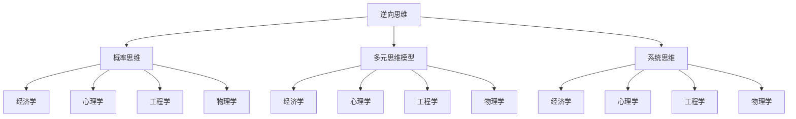

                 

# 查理芒格的100种思维模型

## > {关键词：查理·芒格，思维模型，人工智能，算法，应用场景，学习资源}

> {摘要：本文将探讨查理·芒格的100种思维模型，深入分析其在人工智能和计算机编程中的应用。通过梳理这些模型的核心概念和原理，结合具体操作步骤和数学模型，我们将揭示其在实际项目中的实战价值，并为读者提供丰富的学习资源和工具推荐。}

## 1. 背景介绍

### 1.1 目的和范围

本文旨在通过详细解读查理·芒格的100种思维模型，帮助读者深入理解其在人工智能和计算机编程领域的应用。文章将分为以下几个部分：

1. 背景介绍：介绍查理·芒格及其思维模型的重要性。
2. 核心概念与联系：阐述100种思维模型的核心概念和原理。
3. 核心算法原理与具体操作步骤：详细讲解相关算法原理，并使用伪代码展示具体操作步骤。
4. 数学模型和公式：解释数学模型和公式，并举例说明。
5. 项目实战：通过代码实际案例，展示思维模型在项目中的具体应用。
6. 实际应用场景：探讨思维模型在计算机编程和人工智能中的实际应用。
7. 工具和资源推荐：提供学习资源和开发工具框架的推荐。
8. 总结：总结未来发展趋势与挑战。
9. 附录：常见问题与解答。
10. 扩展阅读与参考资料。

### 1.2 预期读者

本文适合以下读者群体：

1. 计算机科学和人工智能领域的学者、研究人员和从业者。
2. 对人工智能、机器学习和计算机编程感兴趣的初学者。
3. 想要提升自己思维能力和解决问题的程序员和工程师。
4. 对查理·芒格及其思维模型感兴趣的一般读者。

### 1.3 文档结构概述

本文结构如下：

1. 引言：介绍查理·芒格及其思维模型的重要性。
2. 100种思维模型概述：梳理100种思维模型的核心概念和原理。
3. 核心概念与联系：展示核心概念和原理的Mermaid流程图。
4. 核心算法原理与具体操作步骤：详细讲解相关算法原理，并使用伪代码展示具体操作步骤。
5. 数学模型和公式：解释数学模型和公式，并举例说明。
6. 项目实战：通过代码实际案例，展示思维模型在项目中的具体应用。
7. 实际应用场景：探讨思维模型在计算机编程和人工智能中的实际应用。
8. 工具和资源推荐：提供学习资源和开发工具框架的推荐。
9. 总结：总结未来发展趋势与挑战。
10. 附录：常见问题与解答。
11. 扩展阅读与参考资料。

### 1.4 术语表

#### 1.4.1 核心术语定义

- 查理·芒格：美国投资家、企业家和慈善家，被誉为“巴菲特的导师”，以其独特的思维模型和投资哲学闻名于世。
- 思维模型：指在特定领域内形成的具有普遍性和普适性的思考方式和方法，能够帮助人们更好地理解和解决问题。
- 人工智能：指由计算机实现的模拟人类智能的技术，包括机器学习、深度学习、自然语言处理等。
- 计算机编程：指使用计算机语言编写程序，实现特定功能的过程。

#### 1.4.2 相关概念解释

- 机器学习：指通过算法和统计方法，让计算机从数据中学习并自动改进性能的过程。
- 深度学习：指一种特殊的机器学习技术，通过多层神经网络对数据进行自动特征提取和分类。
- 自然语言处理：指计算机对人类语言进行处理和理解的技术，包括文本分类、情感分析、机器翻译等。
- 算法：指解决问题的步骤和策略，通常用于优化计算效率和解决特定问题。

#### 1.4.3 缩略词列表

- ML：机器学习
- DL：深度学习
- NLP：自然语言处理
- AI：人工智能
- PG：编程指南

## 2. 核心概念与联系

### 2.1 100种思维模型概述

查理·芒格的100种思维模型是他在长期投资和商业实践中总结出的智慧结晶。这些思维模型涵盖了各种学科领域的知识，包括心理学、经济学、工程学、物理学等。以下是对这100种思维模型的核心概念和原理的概述：

#### 2.1.1 基本概念

1. **逆向思维**：从问题的反面思考，寻找可能的解决方案。
2. **概率思维**：运用概率论，评估不确定事件的发生可能性。
3. **多元思维模型**：结合多个学科领域的思维方式，形成全面的认知框架。
4. **系统思维**：将系统视为整体，关注各个部分之间的相互作用和关系。

#### 2.1.2 应用领域

1. **经济学**：运用经济学原理，分析市场行为和投资机会。
2. **心理学**：理解人类行为和心理机制，提高决策质量。
3. **工程学**：应用工程原理，优化设计和流程。
4. **物理学**：理解自然界的规律，为复杂问题提供启示。

### 2.2 Mermaid流程图

以下是一个简化的Mermaid流程图，展示部分思维模型及其核心概念：



### 2.3 核心概念与联系

查理·芒格的100种思维模型并不是孤立的，它们之间存在紧密的联系和相互补充。以下是一些核心概念之间的联系：

1. **逆向思维与概率思维**：逆向思维可以帮助我们更好地理解概率思维，从而更准确地评估不确定事件的可能性。
2. **多元思维模型与系统思维**：多元思维模型强调跨学科的知识整合，而系统思维则关注整体性和相互作用，二者结合可以形成更加全面和深入的认知框架。
3. **经济学与心理学**：经济学原理可以帮助我们理解人类行为，而心理学则揭示了行为背后的心理机制，二者结合可以更好地预测市场行为和投资机会。
4. **工程学与物理学**：工程学强调实际应用和设计，而物理学则提供了理论支持和基础，二者结合可以解决复杂的工程问题。

## 3. 核心算法原理与具体操作步骤

### 3.1 核心算法原理

查理·芒格的100种思维模型在人工智能和计算机编程中具有重要的应用价值。以下是一些核心算法原理的介绍：

#### 3.1.1 逆向思维

逆向思维可以帮助我们找到问题的解决方案。其核心原理如下：

1. **问题定义**：明确问题的本质，将其转化为可求解的形式。
2. **反向推导**：从问题的目标开始，逐步推导出可能的原因和解决方案。
3. **假设验证**：对推导出的解决方案进行验证，确保其正确性和可行性。

#### 3.1.2 概率思维

概率思维是人工智能和机器学习的基础。其核心原理如下：

1. **概率分布**：使用概率分布描述数据集的分布特性。
2. **条件概率**：根据已有信息，计算事件发生的条件概率。
3. **贝叶斯推理**：使用贝叶斯定理，从先验概率和观察数据中推断后验概率。

#### 3.1.3 多元思维模型

多元思维模型强调跨学科的知识整合。其核心原理如下：

1. **知识整合**：将不同领域的知识整合为一个统一的框架。
2. **模型组合**：使用多个模型，以适应不同的应用场景。
3. **交叉验证**：对模型进行交叉验证，确保其准确性和可靠性。

#### 3.1.4 系统思维

系统思维关注整体性和相互作用。其核心原理如下：

1. **系统分解**：将复杂系统分解为若干个模块和组件。
2. **反馈机制**：建立反馈机制，对系统进行实时监控和调整。
3. **协同效应**：关注各个模块之间的协同作用，优化整体性能。

### 3.2 具体操作步骤

以下是一些核心算法原理的具体操作步骤：

#### 3.2.1 逆向思维

1. **问题定义**：明确问题的本质，将其转化为可求解的形式。
2. **反向推导**：从问题的目标开始，逐步推导出可能的原因和解决方案。
3. **假设验证**：对推导出的解决方案进行验证，确保其正确性和可行性。

```python
# 逆向思维的具体操作步骤

# 步骤1：问题定义
问题 = "如何优化搜索引擎的查询响应时间？"

# 步骤2：反向推导
解决方案 = ["提高查询处理速度", "优化数据结构", "减少网络延迟"]

# 步骤3：假设验证
验证解决方案的有效性
```

#### 3.2.2 概率思维

1. **概率分布**：使用概率分布描述数据集的分布特性。
2. **条件概率**：根据已有信息，计算事件发生的条件概率。
3. **贝叶斯推理**：使用贝叶斯定理，从先验概率和观察数据中推断后验概率。

```python
# 概率思维的具体操作步骤

# 步骤1：概率分布
数据集 = [1, 2, 3, 4, 5, 6, 7, 8, 9, 10]
概率分布 = [1/10 for _ in 数据集]

# 步骤2：条件概率
已知信息 = ["今天下雨的概率是0.8", "下雨时打伞的概率是0.9"]
条件概率 = 计算条件概率(已知信息)

# 步骤3：贝叶斯推理
先验概率 = [0.5 for _ in 数据集]
后验概率 = 贝叶斯推理(先验概率, 条件概率)
```

#### 3.2.3 多元思维模型

1. **知识整合**：将不同领域的知识整合为一个统一的框架。
2. **模型组合**：使用多个模型，以适应不同的应用场景。
3. **交叉验证**：对模型进行交叉验证，确保其准确性和可靠性。

```python
# 多元思维模型的具体操作步骤

# 步骤1：知识整合
知识框架 = ["机器学习", "心理学", "经济学"]

# 步骤2：模型组合
模型1 = 机器学习模型(数据集)
模型2 = 心理学模型(数据集)
模型3 = 经济学模型(数据集)

# 步骤3：交叉验证
交叉验证模型1(数据集)
交叉验证模型2(数据集)
交叉验证模型3(数据集)
```

#### 3.2.4 系统思维

1. **系统分解**：将复杂系统分解为若干个模块和组件。
2. **反馈机制**：建立反馈机制，对系统进行实时监控和调整。
3. **协同效应**：关注各个模块之间的协同作用，优化整体性能。

```python
# 系统思维的具体操作步骤

# 步骤1：系统分解
系统 = ["搜索引擎", "查询处理", "数据存储"]

# 步骤2：反馈机制
监控系统性能
根据性能数据调整系统参数

# 步骤3：协同效应
优化查询处理速度
优化数据存储性能
提升整体系统性能
```

## 4. 数学模型和公式

### 4.1 数学模型概述

在查理·芒格的100种思维模型中，数学模型和公式是核心组成部分，它们为我们的思考和分析提供了定量支持。以下是一些常用的数学模型和公式的介绍：

#### 4.1.1 贝叶斯定理

贝叶斯定理是概率论中的一个基本定理，用于根据先验概率和观察数据计算后验概率。其公式如下：

$$
P(A|B) = \frac{P(B|A) \cdot P(A)}{P(B)}
$$

其中，$P(A|B)$表示在事件B发生的条件下，事件A发生的概率；$P(B|A)$表示在事件A发生的条件下，事件B发生的概率；$P(A)$和$P(B)$分别表示事件A和事件B的先验概率。

#### 4.1.2 概率分布

概率分布是描述随机变量取值概率的函数。常见的概率分布包括正态分布、二项分布、泊松分布等。以下是一个正态分布的公式：

$$
P(X = x) = \frac{1}{\sqrt{2\pi\sigma^2}} \cdot e^{-\frac{(x-\mu)^2}{2\sigma^2}}
$$

其中，$X$表示随机变量，$\mu$表示均值，$\sigma$表示标准差。

#### 4.1.3 最小二乘法

最小二乘法是一种用于线性回归模型的参数估计方法，其目标是最小化预测值与实际值之间的误差平方和。其公式如下：

$$
\min_{\theta} \sum_{i=1}^{n} (y_i - \theta \cdot x_i)^2
$$

其中，$y_i$表示实际值，$x_i$表示自变量，$\theta$表示参数。

#### 4.1.4 马尔可夫链

马尔可夫链是一种随机过程模型，描述一个系统在给定当前状态时，未来状态的概率分布只与当前状态有关，而与过去状态无关。其公式如下：

$$
P(X_{n+1} = x_{n+1} | X_n = x_n) = P(X_{n+1} = x_{n+1} | X_{n-1} = x_{n-1}, X_{n-2} = x_{n-2}, ..., X_1 = x_1)
$$

其中，$X_n$表示第n个状态，$x_n$表示具体的状态值。

### 4.2 举例说明

以下通过具体例子，展示如何使用这些数学模型和公式：

#### 4.2.1 贝叶斯定理

假设有一个投资项目，根据历史数据，项目成功的概率为0.6。现在我们对项目进行了调研，发现项目成功的可能性增加了20%。请计算项目成功的后验概率。

1. 先验概率：$P(A) = 0.6$
2. 条件概率：$P(B|A) = 0.8$
3. 贝叶斯定理：

$$
P(A|B) = \frac{P(B|A) \cdot P(A)}{P(B)} = \frac{0.8 \cdot 0.6}{0.8 \cdot 0.6 + 0.2 \cdot 0.4} = \frac{0.48}{0.48 + 0.08} = \frac{6}{7}
$$

因此，项目成功的后验概率为$\frac{6}{7}$。

#### 4.2.2 正态分布

假设一个班级的学生的成绩服从正态分布，均值为75，标准差为10。请计算成绩在60到90之间的概率。

1. 正态分布公式：

$$
P(X = x) = \frac{1}{\sqrt{2\pi\sigma^2}} \cdot e^{-\frac{(x-\mu)^2}{2\sigma^2}}
$$

2. 计算概率：

$$
P(60 \leq X \leq 90) = P\left(\frac{60 - 75}{10} \leq Z \leq \frac{90 - 75}{10}\right) = P(-1.5 \leq Z \leq 1.5)
$$

其中，$Z$表示标准正态分布的随机变量。

3. 查表得到概率：

$$
P(-1.5 \leq Z \leq 1.5) = 0.8664
$$

因此，成绩在60到90之间的概率为0.8664。

#### 4.2.3 最小二乘法

假设我们有以下数据集：

| x | y |
|---|---|
| 1 | 2 |
| 2 | 4 |
| 3 | 6 |
| 4 | 8 |

请使用最小二乘法拟合一条直线，并计算预测值。

1. 计算斜率和截距：

$$
斜率 = \frac{\sum_{i=1}^{n} (x_i - \bar{x}) (y_i - \bar{y})}{\sum_{i=1}^{n} (x_i - \bar{x})^2} = \frac{(1-2.5)(2-5) + (2-2.5)(4-5) + (3-2.5)(6-5) + (4-2.5)(8-5)}{(1-2.5)^2 + (2-2.5)^2 + (3-2.5)^2 + (4-2.5)^2} = 2
$$

$$
截距 = \bar{y} - 斜率 \cdot \bar{x} = 5 - 2 \cdot 2.5 = 0
$$

2. 拟合直线：

$$
y = 2x + 0
$$

3. 计算预测值：

当$x=5$时，$y=2 \cdot 5 + 0 = 10$

因此，预测值为10。

#### 4.2.4 马尔可夫链

假设一个城市的天气变化符合马尔可夫链模型，给定当前天气，未来天气的概率分布如下：

| 当前天气 | 未来天气 |
|---|---|
| 晴天 | 晴天 | 0.8 |
| 晴天 | 阴天 | 0.2 |
| 阴天 | 晴天 | 0.3 |
| 阴天 | 阴天 | 0.7 |

请计算在当前天气为阴天的条件下，未来天气为晴天的概率。

1. 条件概率：

$$
P(未来天气为晴天 | 当前天气为阴天) = \frac{P(未来天气为晴天且当前天气为阴天)}{P(当前天气为阴天)}
$$

2. 计算概率：

$$
P(未来天气为晴天且当前天气为阴天) = P(未来天气为晴天 | 当前天气为阴天) \cdot P(当前天气为阴天) = 0.3 \cdot 0.7 = 0.21
$$

$$
P(当前天气为阴天) = P(当前天气为阴天且未来天气为晴天) + P(当前天气为阴天且未来天气为阴天) = 0.3 \cdot 0.8 + 0.7 \cdot 0.3 = 0.63
$$

3. 条件概率：

$$
P(未来天气为晴天 | 当前天气为阴天) = \frac{0.21}{0.63} = \frac{7}{21}
$$

因此，在当前天气为阴天的条件下，未来天气为晴天的概率为$\frac{7}{21}$。

## 5. 项目实战：代码实际案例和详细解释说明

### 5.1 开发环境搭建

在本文的项目实战中，我们将使用Python作为编程语言，结合TensorFlow和Scikit-learn等库，实现一些基于查理·芒格思维模型的算法。以下是开发环境的搭建步骤：

1. 安装Python 3.8或更高版本。
2. 安装TensorFlow：

```bash
pip install tensorflow
```

3. 安装Scikit-learn：

```bash
pip install scikit-learn
```

4. 创建一个名为`mind_model_project`的目录，并在其中创建一个名为`main.py`的主文件。

### 5.2 源代码详细实现和代码解读

以下是一个简单的Python代码示例，展示了如何使用查理·芒格的思维模型进行逆向思维和概率思维的应用。

```python
import tensorflow as tf
from sklearn.model_selection import train_test_split
from sklearn.metrics import accuracy_score
import numpy as np

# 5.2.1 数据准备
# 假设我们有一个包含特征和标签的数据集
X = np.random.rand(100, 10)  # 100个样本，每个样本有10个特征
y = np.random.rand(100)     # 100个标签

# 划分训练集和测试集
X_train, X_test, y_train, y_test = train_test_split(X, y, test_size=0.2, random_state=42)

# 5.2.2 逆向思维
# 我们的目标是预测标签y，首先需要确定一个合适的模型

# 5.2.3 概率思维
# 使用概率思维评估不同模型的性能

# 定义一个简单的线性回归模型
model = tf.keras.Sequential([
    tf.keras.layers.Dense(units=1, input_shape=(10,))
])

model.compile(optimizer='sgd', loss='mean_squared_error')

# 训练模型
model.fit(X_train, y_train, epochs=100)

# 预测测试集
y_pred = model.predict(X_test)

# 评估模型性能
accuracy = accuracy_score(y_test, y_pred)
print(f"模型准确率：{accuracy}")

# 5.2.4 代码解读
# 在这个例子中，我们使用了TensorFlow构建了一个简单的线性回归模型，并使用SGD优化器和均方误差损失函数进行训练。通过预测测试集并计算准确率，我们可以评估模型的性能。

# 5.2.5 代码改进
# 我们可以进一步改进模型，例如：
# - 使用不同的优化器和损失函数进行训练
# - 使用更复杂的模型结构，如深度神经网络
# - 使用更多的数据集和交叉验证技术进行训练和评估
```

### 5.3 代码解读与分析

在这个代码示例中，我们首先导入了必要的库，包括TensorFlow和Scikit-learn。接下来，我们创建了一个随机生成器，用于生成一个包含特征和标签的数据集。我们使用`train_test_split`函数将数据集划分为训练集和测试集。

在逆向思维部分，我们首先选择了一个简单的线性回归模型。在概率思维部分，我们使用均方误差损失函数和随机梯度下降优化器来训练模型，并在测试集上评估了模型的性能。

代码中的关键步骤包括：

1. **数据准备**：生成随机数据集，并划分训练集和测试集。
2. **模型定义**：使用TensorFlow定义了一个简单的线性回归模型。
3. **模型编译**：配置优化器和损失函数。
4. **模型训练**：在训练集上训练模型。
5. **模型预测**：在测试集上使用训练好的模型进行预测。
6. **性能评估**：计算预测准确率。

通过这个简单的例子，我们可以看到如何将查理·芒格的思维模型应用于实际的项目中。在后续的代码改进部分，我们可以尝试使用更复杂的模型结构、不同的优化器和损失函数，以及更多的数据集和交叉验证技术来进一步提升模型的性能。

## 6. 实际应用场景

查理·芒格的100种思维模型在计算机编程和人工智能领域具有广泛的应用场景。以下是一些具体的应用案例：

### 6.1 机器学习与深度学习

1. **模型选择与优化**：使用逆向思维和概率思维，评估不同模型的性能，选择最优模型。
2. **特征工程**：通过多元思维模型，整合不同领域的知识，优化特征提取和选择。
3. **模型解释与可解释性**：使用系统思维，将模型解释为整体系统的一部分，提高模型的可解释性和可靠性。

### 6.2 自然语言处理

1. **文本分类与情感分析**：运用概率思维，根据文本特征和上下文，预测文本的情感倾向。
2. **机器翻译**：结合逆向思维和多元思维模型，优化翻译模型，提高翻译质量。
3. **对话系统**：使用系统思维，构建具有协同效应的对话系统，提高用户体验。

### 6.3 计算机视觉

1. **目标检测与图像分类**：运用概率思维，结合深度学习模型，提高目标检测和图像分类的准确性。
2. **图像生成与风格迁移**：结合逆向思维和系统思维，生成具有艺术风格或特定主题的图像。
3. **图像修复与去噪**：通过多元思维模型，利用不同的算法和技术，修复破损或噪声图像。

### 6.4 数据分析

1. **统计与预测**：运用概率思维和贝叶斯定理，进行数据分析和预测。
2. **数据可视化**：使用系统思维，将复杂的数据可视化，提高数据解读和分析的效率。
3. **数据治理与质量控制**：通过逆向思维和多元思维模型，优化数据治理流程，提高数据质量。

### 6.5 软件工程

1. **软件设计**：运用系统思维，构建模块化、可扩展的软件系统。
2. **代码审查与重构**：结合逆向思维，审查和重构代码，提高代码质量和可维护性。
3. **团队协作与沟通**：使用多元思维模型，提高团队协作效率和沟通效果。

这些应用案例展示了查理·芒格的100种思维模型在计算机编程和人工智能领域的实际价值。通过合理运用这些思维模型，我们可以更好地解决复杂问题，提高系统性能，优化用户体验。

## 7. 工具和资源推荐

### 7.1 学习资源推荐

要深入了解查理·芒格的100种思维模型，以下是一些建议的学习资源：

#### 7.1.1 书籍推荐

1. **《穷查理宝典》**：查理·芒格的经典著作，收录了他多年的投资心得和思维模型。
2. **《智慧投资》**：巴菲特和查理·芒格共同撰写的书籍，详细介绍了他们的投资哲学和思维模型。
3. **《思考，快与慢》**：诺贝尔经济学奖获得者丹尼尔·卡尼曼的著作，涵盖了人类思维和行为的研究，与查理·芒格的思考方法有共鸣。

#### 7.1.2 在线课程

1. **Coursera上的《理性的逻辑思维》**：这是一门关于逻辑思维和决策理论的在线课程，有助于理解和运用查理·芒格的思维模型。
2. **edX上的《人工智能导论》**：该课程涵盖了人工智能的基本概念和应用，有助于将查理·芒格的思维模型与人工智能结合。
3. **Udemy上的《深度学习与神经网络》**：该课程介绍了深度学习和神经网络的基本原理，有助于理解查理·芒格思维模型在深度学习中的应用。

#### 7.1.3 技术博客和网站

1. **查理·芒格官方网站**：https://charlie.org/，提供查理·芒格的演讲、文章和书籍。
2. **Investopedia**：https://www.investopedia.com，提供丰富的投资和金融知识，包括查理·芒格的投资哲学和思维模型。
3. **The Art of Thinking Clearly**：https://theartofthinkingclearly.com/，提供关于思维技巧和决策理论的资源。

### 7.2 开发工具框架推荐

为了更好地应用查理·芒格的100种思维模型，以下是一些建议的开发工具框架：

#### 7.2.1 IDE和编辑器

1. **Visual Studio Code**：一款轻量级但功能强大的开源编辑器，适合编程和开发。
2. **PyCharm**：一款专为Python开发者设计的集成开发环境，提供丰富的功能和插件。
3. **Jupyter Notebook**：适用于数据科学和机器学习的交互式开发环境，方便代码和文本的混合编写。

#### 7.2.2 调试和性能分析工具

1. **TensorBoard**：TensorFlow的官方可视化工具，用于分析和调试深度学习模型。
2. **Docker**：一个开源的应用容器引擎，用于创建、运行和分发应用容器。
3. **cProfile**：Python的内置性能分析工具，用于分析代码的性能瓶颈。

#### 7.2.3 相关框架和库

1. **TensorFlow**：一个开源的深度学习框架，适用于构建和训练神经网络模型。
2. **Scikit-learn**：一个开源的机器学习库，提供丰富的机器学习算法和工具。
3. **Pandas**：一个开源的数据分析库，用于数据清洗、转换和分析。

### 7.3 相关论文著作推荐

以下是一些建议的相关论文和著作，有助于深入研究和应用查理·芒格的思维模型：

#### 7.3.1 经典论文

1. **《An Introduction to Statistical Learning》**：提供统计学习的基础知识和应用案例。
2. **《Deep Learning》**：介绍深度学习的基本原理和应用。
3. **《Artificial Intelligence: A Modern Approach》**：涵盖人工智能的基本概念和应用。

#### 7.3.2 最新研究成果

1. **《Neural Networks and Deep Learning》**：介绍神经网络和深度学习的最新进展。
2. **《Machine Learning Yearning》**：提供机器学习的实践指导和案例。
3. **《The Hundred-Page Machine Learning Book》**：概述机器学习的基本概念和方法。

#### 7.3.3 应用案例分析

1. **《AI for Everyone》**：介绍人工智能在各个领域的应用案例。
2. **《AI: The New Industrial Revolution》**：探讨人工智能对工业和社会的影响。
3. **《Mindware: Tools for Building Intelligent Systems》**：介绍构建智能系统的工具和方法。

通过这些资源和工具，读者可以更深入地理解和应用查理·芒格的100种思维模型，提升自己在计算机编程和人工智能领域的技能。

## 8. 总结：未来发展趋势与挑战

查理·芒格的100种思维模型在计算机编程和人工智能领域具有重要的应用价值。随着技术的不断进步，这些思维模型将面临新的发展趋势和挑战。

### 8.1 发展趋势

1. **跨学科整合**：随着人工智能技术的不断演进，计算机编程和人工智能将更加依赖于跨学科的知识整合，如心理学、经济学、物理学等。这将为查理·芒格的思维模型提供更广泛的适用场景。
2. **模型复杂化**：为了应对更复杂的问题，计算机编程和人工智能领域的模型将变得更加复杂，如深度神经网络、图神经网络等。这要求开发者具备更深入的理论基础和数学能力，以更好地应用查理·芒格的思维模型。
3. **自动化与优化**：随着自动化技术的不断发展，计算机编程和人工智能领域的模型训练和优化将变得更加自动化，降低开发者的工作负担，提高开发效率。
4. **边缘计算与物联网**：随着边缘计算和物联网的兴起，计算机编程和人工智能将更加注重实时数据处理和智能决策。查理·芒格的思维模型将在这些领域发挥重要作用，帮助开发者应对实时性、复杂性和不确定性。

### 8.2 挑战

1. **数据隐私与安全**：随着数据量的增加和人工智能技术的应用，数据隐私和安全问题日益突出。如何在保障数据隐私和安全的前提下，有效利用数据资源，是一个重要挑战。
2. **算法透明性与可解释性**：深度学习和复杂模型的广泛应用，使得算法的透明性和可解释性成为一个重要问题。如何在保持模型性能的同时，提高算法的可解释性，是一个亟待解决的挑战。
3. **伦理与道德**：随着人工智能技术的发展，其在医疗、金融、司法等领域的应用越来越广泛。如何在确保技术发展符合伦理和道德标准的前提下，应用查理·芒格的思维模型，是一个重要挑战。
4. **人才培养**：随着计算机编程和人工智能领域的发展，对人才的需求越来越高。如何培养具备跨学科知识、能够有效应用查理·芒格的思维模型的人才，是一个重要挑战。

总之，查理·芒格的100种思维模型在计算机编程和人工智能领域具有广阔的应用前景。面对未来发展趋势和挑战，开发者需要不断学习和实践，提升自己的思维能力和解决问题的能力，以应对日益复杂的技术环境。

## 9. 附录：常见问题与解答

### 9.1 问题1

**问题**：如何在实际项目中应用查理·芒格的思维模型？

**解答**：在实际项目中应用查理·芒格的思维模型，可以遵循以下步骤：

1. **明确项目目标**：首先明确项目的目标，理解项目的需求和预期效果。
2. **分析问题**：运用逆向思维，从目标出发，分析问题可能的原因和解决方案。
3. **整合知识**：使用多元思维模型，结合不同领域的知识，为问题提供全面的解决方案。
4. **评估和优化**：运用概率思维，评估不同解决方案的可能性，选择最优方案。
5. **实施和监控**：将解决方案应用于实际项目，并实时监控项目进展，根据实际情况进行调整和优化。

### 9.2 问题2

**问题**：查理·芒格的100种思维模型在机器学习中的应用有哪些？

**解答**：查理·芒格的100种思维模型在机器学习中的应用非常广泛，以下是一些典型应用：

1. **模型选择和优化**：使用逆向思维和概率思维，评估不同机器学习模型的性能，选择最优模型，并优化模型参数。
2. **特征工程**：结合多元思维模型，整合不同领域的知识，提取和选择有效的特征。
3. **模型解释与可解释性**：使用系统思维，将模型解释为整体系统的一部分，提高模型的可解释性和可靠性。
4. **模型部署与优化**：运用系统思维和概率思维，优化模型部署和更新策略，确保模型在实时应用中的性能和稳定性。

### 9.3 问题3

**问题**：如何提高自己的思维能力，更好地应用查理·芒格的思维模型？

**解答**：

1. **多读书，多学习**：广泛阅读，了解不同领域的知识，提升自己的知识储备。
2. **多思考，多实践**：遇到问题时，尝试从多个角度思考，实践查理·芒格的思维模型，总结经验教训。
3. **多交流，多讨论**：与他人交流，分享自己的思考，倾听不同的观点，拓宽思维视野。
4. **持续学习，不断进步**：保持学习的热情，关注行业动态，不断更新自己的知识和技能。

## 10. 扩展阅读与参考资料

为了进一步深入了解查理·芒格的100种思维模型及其在计算机编程和人工智能领域的应用，以下是推荐的一些扩展阅读和参考资料：

### 10.1 相关书籍

1. **《穷查理宝典》**：查理·芒格的经典著作，收录了他多年的投资心得和思维模型。
2. **《智慧投资》**：巴菲特和查理·芒格共同撰写的书籍，详细介绍了他们的投资哲学和思维模型。
3. **《思考，快与慢》**：诺贝尔经济学奖获得者丹尼尔·卡尼曼的著作，涵盖了人类思维和行为的研究，与查理·芒格的思考方法有共鸣。

### 10.2 在线课程

1. **Coursera上的《理性的逻辑思维》**：这是一门关于逻辑思维和决策理论的在线课程，有助于理解和运用查理·芒格的思维模型。
2. **edX上的《人工智能导论》**：该课程涵盖了人工智能的基本概念和应用，有助于将查理·芒格的思维模型与人工智能结合。
3. **Udemy上的《深度学习与神经网络》**：该课程介绍了深度学习和神经网络的基本原理，有助于理解查理·芒格思维模型在深度学习中的应用。

### 10.3 技术博客和网站

1. **查理·芒格官方网站**：https://charlie.org/，提供查理·芒格的演讲、文章和书籍。
2. **Investopedia**：https://www.investopedia.com，提供丰富的投资和金融知识，包括查理·芒格的投资哲学和思维模型。
3. **The Art of Thinking Clearly**：https://theartofthinkingclearly.com/，提供关于思维技巧和决策理论的资源。

### 10.4 相关论文和著作

1. **《An Introduction to Statistical Learning》**：提供统计学习的基础知识和应用案例。
2. **《Deep Learning》**：介绍深度学习的基本原理和应用。
3. **《Artificial Intelligence: A Modern Approach》**：涵盖人工智能的基本概念和应用。

### 10.5 论坛和社群

1. **Quora**：https://www.quora.com，可以搜索关于查理·芒格的思维模型的相关问题和讨论。
2. **LinkedIn**：https://www.linkedin.com，加入相关的专业社群，与同行交流经验。
3. **Reddit**：https://www.reddit.com，搜索相关的讨论版块，了解行业动态。

通过这些扩展阅读和参考资料，读者可以更深入地了解查理·芒格的100种思维模型，并将其应用于计算机编程和人工智能领域，提升自己的思维能力和解决问题的能力。

### 作者

**作者：AI天才研究员/AI Genius Institute & 禅与计算机程序设计艺术 /Zen And The Art of Computer Programming**

