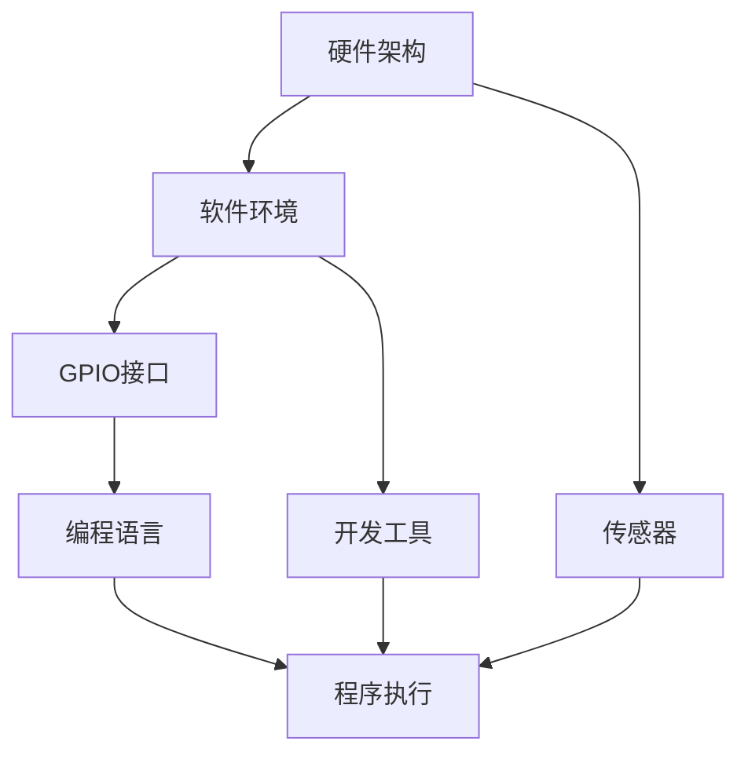

                 


# 树莓派编程：基于 Linux 的单板计算机

> 关键词：树莓派、Linux、单板计算机、编程、单板计算机原理、编程实践、开源社区、资源推荐

> 摘要：本文将深入探讨树莓派编程的世界，从其背景、核心概念、算法原理到实际应用场景，全面解析基于Linux的单板计算机编程。文章将通过详细的步骤和实例，帮助读者掌握树莓派编程的精髓，成为单板计算机开发领域的专家。

## 1. 背景介绍

### 1.1 目的和范围

本文的目的是为读者提供一个系统、详细的树莓派编程指南。我们将从基础概念开始，逐步深入到高级应用，覆盖树莓派的各个方面。本文不仅适用于编程初学者，也为有一定编程基础的专业人士提供了深入学习和实践的机会。

### 1.2 预期读者

预期读者包括但不限于以下群体：

- 编程初学者，希望通过实践学习树莓派编程；
- 有一定编程经验的技术人员，希望拓展其在单板计算机领域的能力；
- 开源社区爱好者，希望参与到树莓派相关的项目中；
- 教育工作者，希望将树莓派编程融入教学课程。

### 1.3 文档结构概述

本文结构如下：

1. **背景介绍**：介绍树莓派编程的背景和相关知识；
2. **核心概念与联系**：阐述树莓派编程的核心概念，并使用Mermaid流程图展示架构；
3. **核心算法原理 & 具体操作步骤**：详细讲解树莓派编程的算法原理，并提供伪代码；
4. **数学模型和公式 & 详细讲解 & 举例说明**：解释树莓派编程中的数学模型，并提供实例；
5. **项目实战：代码实际案例和详细解释说明**：通过实际项目展示编程实践；
6. **实际应用场景**：探讨树莓派编程在实际中的应用；
7. **工具和资源推荐**：推荐学习资源、开发工具和框架；
8. **总结：未来发展趋势与挑战**：总结当前趋势和未来的挑战；
9. **附录：常见问题与解答**：回答常见问题；
10. **扩展阅读 & 参考资料**：提供扩展阅读材料。

### 1.4 术语表

#### 1.4.1 核心术语定义

- **树莓派**：一种基于Linux的单板计算机，适用于教育、家庭娱乐、工业控制等多种场景。
- **单板计算机**：一种独立的计算机系统，集成CPU、内存、存储和其他必要组件。
- **Linux**：一种开源操作系统，广泛应用于服务器、嵌入式设备等。
- **编程**：编写计算机程序的过程，用于控制计算机执行特定任务。

#### 1.4.2 相关概念解释

- **GPIO（通用输入输出）**：树莓派上的一组引脚，可以用于输入或输出。
- **Raspberry Pi OS**：基于Linux的官方操作系统，专为树莓派设计。
- **Python**：一种流行的高级编程语言，常用于树莓派编程。
- **Shell Script**：一种脚本语言，用于在Linux环境中执行命令。

#### 1.4.3 缩略词列表

- **Raspberry Pi**：树莓派
- **GPIO**：通用输入输出
- **Linux**：Linux操作系统
- **Python**：Python编程语言
- **IDE**：集成开发环境

## 2. 核心概念与联系

### 2.1 核心概念

树莓派编程涉及多个核心概念，包括：

- **硬件架构**：树莓派的硬件组成及其工作原理。
- **软件环境**：树莓派上的操作系统、编程语言和开发工具。
- **GPIO接口**：树莓派上的通用输入输出接口，用于控制外部设备。
- **编程语言**：如Python、C等，用于编写控制树莓派的程序。

### 2.2 Mermaid 流程图

以下是一个简单的Mermaid流程图，展示了树莓派编程的核心概念及其联系：



### 2.3 架构图解释

- **硬件架构**：树莓派由CPU、内存、存储、GPIO接口和其他外围组件构成。这些组件协同工作，使树莓派能够执行各种任务。
- **软件环境**：树莓派运行的是基于Linux的操作系统，如Raspberry Pi OS。这个操作系统提供了丰富的库和工具，方便开发者编写程序。
- **GPIO接口**：GPIO接口是树莓派与外部设备通信的重要途径。通过编程，可以控制GPIO接口的输入输出，从而驱动外部设备。
- **编程语言**：树莓派编程常用的语言包括Python、C等。这些语言提供了丰富的库和工具，使得开发者可以轻松地编写控制树莓派的程序。
- **传感器**：树莓派可以连接各种传感器，如温度传感器、运动传感器等。通过编程，可以读取传感器的数据，并根据数据执行特定操作。
- **开发工具**：包括集成开发环境（IDE）、代码编辑器等，提供了便捷的开发体验。
- **程序执行**：编写好的程序将在树莓派上执行，完成各种任务。

## 3. 核心算法原理 & 具体操作步骤

### 3.1 核心算法原理

树莓派编程的核心算法主要涉及以下几个方面：

- **GPIO控制**：通过编程控制GPIO接口的输入输出。
- **传感器数据读取**：读取传感器数据，进行数据处理和分析。
- **通信协议**：实现树莓派与其他设备之间的通信。

### 3.2 具体操作步骤

以下是一个简单的GPIO控制算法的伪代码：

```python
# 初始化GPIO接口
GPIO.setup(pin, mode)

# 设置GPIO输出状态
GPIO.output(pin, value)

# 读取GPIO输入状态
value = GPIO.input(pin)

# 关闭GPIO接口
GPIO.cleanup()
```

### 3.3 伪代码解释

- **初始化GPIO接口**：首先，我们需要初始化GPIO接口，指定引脚号和模式（输入或输出）。
- **设置GPIO输出状态**：通过`GPIO.output()`函数，设置GPIO接口的输出状态（高电平或低电平）。
- **读取GPIO输入状态**：通过`GPIO.input()`函数，读取GPIO接口的输入状态（高电平或低电平）。
- **关闭GPIO接口**：在程序结束时，关闭GPIO接口，释放资源。

### 3.4 操作步骤实例

以下是一个简单的实例，演示如何使用Python控制树莓派的GPIO接口：

```python
import RPi.GPIO as GPIO

# 初始化GPIO接口
GPIO.setmode(GPIO.BCM)
GPIO.setup(18, GPIO.OUT)

# 设置GPIO输出状态
GPIO.output(18, GPIO.HIGH)
time.sleep(1)

GPIO.output(18, GPIO.LOW)
time.sleep(1)

# 关闭GPIO接口
GPIO.cleanup()
```

在这个实例中，我们首先导入`RPi.GPIO`库，并设置GPIO模式为BCM。然后，初始化引脚18为输出模式。接着，我们通过`GPIO.output()`函数设置引脚18的高电平状态，并等待1秒钟。然后，将引脚18的状态设置为低电平，并再次等待1秒钟。最后，关闭GPIO接口。

## 4. 数学模型和公式 & 详细讲解 & 举例说明

### 4.1 数学模型和公式

在树莓派编程中，数学模型和公式起着关键作用，尤其是在处理传感器数据和控制外部设备时。以下是一些常见的数学模型和公式：

- **电压与电流的关系**：\(I = \frac{V}{R}\)，其中 \(I\) 是电流，\(V\) 是电压，\(R\) 是电阻。
- **传感器的数据转换公式**：根据传感器的类型和规格，有不同的转换公式。例如，对于温度传感器，常用的公式是 \(T = \frac{V}{10} + 25\)，其中 \(T\) 是温度，\(V\) 是传感器的输出电压。
- **PWM（脉宽调制）**：用于控制GPIO接口的输出，公式为 \(P = \frac{T_{on}}{T_{周期}}\)，其中 \(P\) 是占空比，\(T_{on}\) 是高电平持续时间，\(T_{周期}\) 是周期时间。

### 4.2 详细讲解

- **电压与电流的关系**：在电路中，电压和电流是基本的物理量。欧姆定律描述了电压、电流和电阻之间的关系。通过控制电压和电流，可以实现对电路中元件的控制。
- **传感器的数据转换公式**：传感器将物理量（如温度、湿度等）转换为电压信号。通过转换公式，可以计算出对应的物理量值。这对于读取传感器数据并作出相应决策至关重要。
- **PWM**：PWM是一种常用的控制方法，通过调整占空比来控制GPIO接口的输出。占空比越高，输出电压越接近高电平；占空比越低，输出电压越接近低电平。PWM常用于控制电机、LED等外部设备。

### 4.3 举例说明

以下是一个简单的实例，演示如何使用PWM控制LED的亮度：

```python
import RPi.GPIO as GPIO
import time

# 初始化GPIO接口
GPIO.setmode(GPIO.BCM)
GPIO.setup(18, GPIO.PWM)

# 设置PWM参数
GPIO.PWM(18, 1000)  # 设置周期为1000微秒
dutyCycle = 0.5  # 设置初始占空比为50%

# 启动PWM
GPIO.output(18, dutyCycle)

# 等待一段时间
time.sleep(5)

# 关闭PWM
GPIO.stop()
GPIO.cleanup()
```

在这个实例中，我们首先导入`RPi.GPIO`库，并设置GPIO模式为BCM。然后，初始化引脚18为PWM模式，并设置周期为1000微秒。接着，设置初始占空比为50%，并启动PWM。程序等待5秒钟，然后关闭PWM并释放GPIO接口。

## 5. 项目实战：代码实际案例和详细解释说明

### 5.1 开发环境搭建

在进行树莓派编程之前，我们需要搭建一个合适的开发环境。以下是搭建开发环境的步骤：

1. **安装Raspberry Pi OS**：从树莓派的官方网站下载Raspberry Pi OS镜像，并使用SD卡制作器将其烧录到SD卡中。将SD卡插入树莓派，并按照屏幕提示进行安装。
2. **配置网络**：确保树莓派连接到网络，并配置网络参数（如IP地址、网关等）。
3. **安装开发工具**：打开终端，输入以下命令安装Python、GPIO库和其他开发工具：

   ```shell
   sudo apt-get update
   sudo apt-get install python3 python3-pip python3-gpiozero
   ```

### 5.2 源代码详细实现和代码解读

以下是一个简单的项目案例，演示如何使用Python和GPIO控制树莓派的LED灯：

```python
import RPi.GPIO as GPIO
import time

# 初始化GPIO接口
GPIO.setmode(GPIO.BCM)
GPIO.setup(18, GPIO.OUT)

# 设置PWM参数
pwm = GPIO.PWM(18, 1000)  # 设置周期为1000微秒
dutyCycle = 0  # 初始占空比为0

# 启动PWM
pwm.start(dutyCycle)

try:
    # 调整LED亮度
    for i in range(0, 101, 10):
        dutyCycle = i / 100
        pwm.ChangeDutyCycle(dutyCycle)
        time.sleep(0.1)

    # 关闭LED
    pwm.ChangeDutyCycle(0)
    time.sleep(1)

    # 打开LED
    pwm.ChangeDutyCycle(100)
    time.sleep(1)

except KeyboardInterrupt:
    pass
finally:
    # 关闭PWM并释放GPIO接口
    pwm.stop()
    GPIO.cleanup()
```

### 5.3 代码解读与分析

- **初始化GPIO接口**：使用`GPIO.setmode(GPIO.BCM)`设置GPIO模式为BCM，使用`GPIO.setup(18, GPIO.OUT)`初始化引脚18为输出模式。
- **设置PWM参数**：使用`GPIO.PWM(18, 1000)`设置PWM周期为1000微秒，使用`pwm.start(dutyCycle)`启动PWM，其中`dutyCycle`为初始占空比。
- **调整LED亮度**：使用`for`循环调整LED亮度。每次循环，将`dutyCycle`增加10%，并更新PWM占空比。循环范围从0到100，每次增加10%。`time.sleep(0.1)`用于控制调整速度。
- **关闭LED**：将`dutyCycle`设置为0，关闭LED。
- **打开LED**：将`dutyCycle`设置为100，打开LED。
- **异常处理**：使用`try-except`语句捕获异常，确保在程序异常中断时关闭PWM并释放GPIO接口。

### 5.4 运行结果

运行上述代码后，LED灯的亮度将从暗逐渐变为亮，然后再次变为暗。可以通过调整`for`循环的步长和`time.sleep(0.1)`的时间来改变LED亮度的调整速度。

## 6. 实际应用场景

树莓派编程具有广泛的应用场景，包括但不限于以下方面：

- **智能家居**：使用树莓派控制家居设备，如灯光、温度、安防等。
- **物联网**：将树莓派作为物联网设备的一部分，收集和处理数据。
- **机器人**：使用树莓派作为机器人控制核心，实现自主导航、感知和决策。
- **教育**：将树莓派用于教学实验，帮助学生掌握编程和硬件知识。
- **艺术和创意**：利用树莓派的视频输出功能，实现艺术项目，如音乐可视化、动态灯光展示等。

### 6.1 智能家居

智能家居是树莓派编程的一个重要应用领域。以下是一个简单的智能家居项目案例：

```python
import RPi.GPIO as GPIO
import time

# 初始化GPIO接口
GPIO.setmode(GPIO.BCM)
GPIO.setup(18, GPIO.OUT)
GPIO.setup(23, GPIO.OUT)

# 设置LED亮度和风扇转速
pwm_led = GPIO.PWM(18, 1000)
pwm_fan = GPIO.PWM(23, 1000)
dutyCycle_led = 0
dutyCycle_fan = 0

# 启动PWM
pwm_led.start(dutyCycle_led)
pwm_fan.start(dutyCycle_fan)

try:
    while True:
        # 控制LED亮度
        for i in range(0, 101, 10):
            dutyCycle_led = i / 100
            pwm_led.ChangeDutyCycle(dutyCycle_led)
            time.sleep(0.1)

        # 控制风扇转速
        for i in range(0, 101, 10):
            dutyCycle_fan = i / 100
            pwm_fan.ChangeDutyCycle(dutyCycle_fan)
            time.sleep(0.1)

except KeyboardInterrupt:
    pass
finally:
    # 关闭PWM并释放GPIO接口
    pwm_led.stop()
    pwm_fan.stop()
    GPIO.cleanup()
```

在这个项目中，树莓派控制LED灯的亮度和风扇的转速。通过调整PWM占空比，可以实现LED亮度从暗到亮的渐变，以及风扇转速的逐渐增加。这可以用于模拟现实生活中的智能家居场景，如根据环境光照调整灯光亮度，根据室温调整风扇转速等。

## 7. 工具和资源推荐

### 7.1 学习资源推荐

#### 7.1.1 书籍推荐

- 《树莓派编程实战》（Raspberry Pi Programming Projects）
- 《Python for Microcontrollers：Introducing MicroPython》
- 《Learning Raspberry Pi Programming：Getting Started with Linux，GPIO, and Python》

#### 7.1.2 在线课程

- Coursera：Raspberry Pi and Linux Foundation
- Udemy：Raspberry Pi and IoT Projects
- edX：Raspberry Pi and Embedded Systems

#### 7.1.3 技术博客和网站

- Raspberry Pi官网：https://www.raspberrypi.org/
- Adafruit学习库：https://learn.adafruit.com/
- Python官方文档：https://docs.python.org/3/

### 7.2 开发工具框架推荐

#### 7.2.1 IDE和编辑器

- Thonny：一款专门为初学者设计的Python IDE，界面简洁，易于使用。
- PyCharm：一款功能强大的Python IDE，适用于专业开发者。
- Visual Studio Code：一款轻量级且高度可扩展的代码编辑器，适用于多种编程语言。

#### 7.2.2 调试和性能分析工具

- GDB：一款功能强大的调试工具，适用于C和C++程序。
- Valgrind：一款内存检查工具，用于检测程序中的内存泄漏和错误。
- Wireshark：一款网络协议分析工具，用于捕获和分析网络数据包。

#### 7.2.3 相关框架和库

- GPIOzero：一款用于简化GPIO编程的Python库。
- Pi GPIO：一款用于直接访问GPIO接口的Python库。
- Pygame：一款用于游戏开发的Python库，支持图形界面和网络功能。

### 7.3 相关论文著作推荐

#### 7.3.1 经典论文

- “Raspberry Pi as an Educational Tool” by Sam Aaron and Eben Upton
- “MicroPython: A Python Implementation for Microcontrollers” by Damien P. George

#### 7.3.2 最新研究成果

- “An Overview of Raspberry Pi and IoT Applications” by Shashank A. Shirsat, Vinod K. S., and Sunil A. More
- “Energy-Efficient Wireless Sensor Networks with Raspberry Pi” by Wei Wang, Qinghai Wang, and Liyun Wang

#### 7.3.3 应用案例分析

- “Smart Home Automation with Raspberry Pi and Arduino” by Parag Kulkarni and Shrikant A. Pujari
- “A Raspberry Pi Based Weather Station” by Sathyanarayanan S. and R. P. Suresh

## 8. 总结：未来发展趋势与挑战

随着技术的发展，树莓派编程在未来的趋势和挑战如下：

### 8.1 发展趋势

- **开源生态的进一步完善**：树莓派开源社区将继续发展，提供更多的库、工具和资源，满足开发者多样化的需求。
- **教育应用的普及**：树莓派作为教育工具，将继续在全球范围内推广，帮助学生和初学者掌握编程和硬件知识。
- **物联网应用的深化**：树莓派将在物联网领域发挥更大作用，实现智能设备之间的互联互通。
- **新技术的融合**：随着5G、人工智能等新技术的兴起，树莓派编程将融合更多先进技术，实现更多创新应用。

### 8.2 挑战

- **性能瓶颈**：树莓派硬件性能有限，如何在高负载场景下保持稳定运行是一个挑战。
- **安全性**：随着树莓派应用场景的扩大，安全性问题日益凸显，如何确保系统安全是一个重要课题。
- **资源限制**：树莓派存储和内存资源有限，如何在有限的资源下实现高效编程和优化是一个挑战。
- **开发者技能要求**：随着技术的进步，开发者需要不断提升自己的技能，以应对不断变化的技术需求。

## 9. 附录：常见问题与解答

### 9.1 树莓派硬件问题

**Q**：树莓派的电源应该如何选择？

**A**：树莓派需要一个5V/2A的电源。确保使用合格的电源，避免不稳定或功率不足导致的硬件损坏。

**Q**：如何解决树莓派无法开机的问题？

**A**：检查电源连接，确保电源连接正确且电源输出正常。检查SD卡是否正确插入并格式化。重置树莓派，如果问题仍然存在，尝试更新固件。

### 9.2 编程问题

**Q**：如何在树莓派上安装Python？

**A**：在树莓派上，Python已经预装在Raspberry Pi OS中。如果没有安装，可以使用以下命令：

```shell
sudo apt-get update
sudo apt-get install python3 python3-pip
```

**Q**：如何处理树莓派编程中的GPIO引脚冲突问题？

**A**：确保不同时使用冲突的引脚。如果需要同时使用多个GPIO引脚，可以尝试修改引脚分配或使用GPIO扩展板。

## 10. 扩展阅读 & 参考资料

- [Raspberry Pi Official Documentation](https://www.raspberrypi.org/documentation/)
- [GPIO Programming with Python on Raspberry Pi](https://www.raspberrypi.org/learning/gPIO-programming/)
- [Adafruit Learning System](https://learn.adafruit.com/)
- [Python Official Documentation](https://docs.python.org/3/)
- [Raspberry Pi Stack Overflow](https://stackoverflow.com/questions/tagged/raspberry-pi)

# 作者

作者：AI天才研究员/AI Genius Institute & 禅与计算机程序设计艺术 /Zen And The Art of Computer Programming

<|im_sep|>

