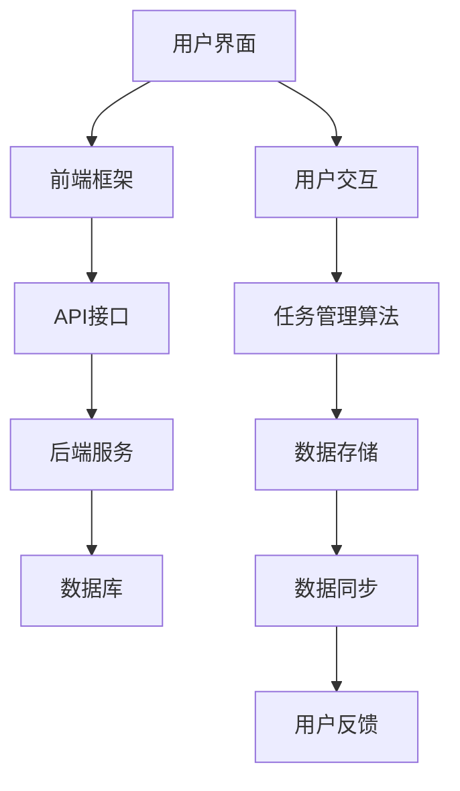

                 

# 样例项目: 待办 (Todo) 管理插件

> **关键词**: 待办管理、插件开发、Web 应用、用户交互、前后端分离

> **摘要**: 本文旨在详细介绍如何构建一个功能完备的待办（Todo）管理插件，从核心概念到具体实现，帮助开发者理解从零开始构建一个实用工具的全过程。我们将探讨核心算法原理、数学模型，并提供详细的代码实现与分析，最后讨论实际应用场景与未来发展。

## 1. 背景介绍

### 1.1 目的和范围

本文的目的是介绍如何开发一个待办管理插件，该插件旨在为用户提供一个方便、高效的工具来管理日常任务。我们将涵盖从需求分析到最终部署的全过程，包括核心算法原理、数学模型的应用、代码实现以及实际应用场景。

### 1.2 预期读者

本文适合有一定编程基础，希望深入了解插件开发过程和前端应用架构的读者。无论你是学生、开发者还是项目经理，都可以通过本文掌握构建待办管理插件的基本技能。

### 1.3 文档结构概述

本文将分为以下几个部分：

1. **核心概念与联系**: 通过Mermaid流程图，展示待办管理插件的总体架构。
2. **核心算法原理 & 具体操作步骤**: 使用伪代码详细阐述核心算法的实现。
3. **数学模型和公式 & 详细讲解 & 举例说明**: 解释数学模型在待办管理中的应用。
4. **项目实战：代码实际案例和详细解释说明**: 搭建开发环境，详细解读源代码。
5. **实际应用场景**: 探讨插件在不同场景下的使用。
6. **工具和资源推荐**: 推荐相关书籍、在线课程、技术博客、开发工具和框架。
7. **总结：未来发展趋势与挑战**: 分析待办管理插件的发展趋势和面临的挑战。
8. **附录：常见问题与解答**: 回答读者可能遇到的问题。
9. **扩展阅读 & 参考资料**: 提供更多深入阅读的资源。

### 1.4 术语表

#### 1.4.1 核心术语定义

- **待办管理**: 指的是管理个人或团队待完成的任务。
- **插件**: 可以嵌入到其他软件中的可扩展组件。
- **Web 应用**: 嵌入在网页中的应用程序，用户通过浏览器进行交互。
- **用户交互**: 用户与系统之间的交互操作。
- **前后端分离**: 前端负责用户界面和用户体验，后端负责数据存储和处理。

#### 1.4.2 相关概念解释

- **Mermaid流程图**: 用于创建流程图、UML图、甘特图等的通用工具。
- **伪代码**: 一种非正式的算法描述方法，用于阐述算法的逻辑结构。

#### 1.4.3 缩略词列表

- **API**: Application Programming Interface，应用程序编程接口。
- **CSS**: Cascading Style Sheets，层叠样式表。
- **HTML**: HyperText Markup Language，超文本标记语言。
- **JavaScript**: 一种脚本语言，常用于网页开发。

## 2. 核心概念与联系

在构建待办管理插件之前，我们需要理解几个核心概念和它们之间的联系。以下是一个Mermaid流程图，展示了待办管理插件的整体架构。



### 用户界面（A）

用户界面是待办管理插件与用户交互的入口。它包括任务列表、添加任务的输入框、任务完成标记等元素。前端框架（如React或Vue.js）用于构建用户界面，提供组件复用和状态管理。

### 前端框架（B）

前端框架负责管理用户界面，使得界面交互更加高效和灵活。它包括虚拟DOM、响应式设计、组件化开发等功能，提高了开发效率和代码可维护性。

### API接口（C）

API接口是前端和后端之间的桥梁。它提供了标准的HTTP接口，用于任务的增删改查操作。前后端分离的开发模式使得两者可以独立开发和部署，提高了系统的可扩展性和灵活性。

### 后端服务（D）

后端服务负责处理来自前端的数据请求，执行业务逻辑，并将结果返回给前端。它通常使用Node.js、Python、Java等后端框架来构建，提供稳定的服务支持。

### 数据库（E）

数据库用于存储待办任务的持久化数据。常用的数据库技术有MongoDB、MySQL、PostgreSQL等。数据库的设计和优化对于系统的性能至关重要。

### 用户交互（F）

用户交互是用户与待办管理插件之间的互动过程。包括任务的创建、更新、删除等操作。良好的用户交互设计可以提高用户的使用体验和满意度。

### 任务管理算法（G）

任务管理算法用于处理任务的逻辑操作，如排序、过滤、搜索等。算法的实现对于插件的功能性和性能有重要影响。

### 数据存储（H）

数据存储是任务管理算法的核心部分，负责将任务数据持久化到数据库。数据存储的可靠性和性能直接影响系统的稳定性。

### 数据同步（I）

数据同步确保了前端和后端的任务数据一致性。在多用户环境下，数据同步尤为重要，以避免数据冲突和错误。

### 用户反馈（J）

用户反馈是用户对插件使用的评价和反馈。良好的用户反馈机制可以帮助我们不断优化和改进插件的功能。

## 3. 核心算法原理 & 具体操作步骤

在待办管理插件中，任务管理算法是核心组成部分。以下使用伪代码详细阐述任务管理算法的实现。

### 3.1. 创建任务

```pseudo
function createTask(taskName, taskDescription) {
    // 创建一个新的任务对象
    task = {
        id: generateId(),
        name: taskName,
        description: taskDescription,
        status: "未完成",
        createTime: getCurrentTimestamp(),
        updateTime: getCurrentTimestamp()
    }
    
    // 将任务对象存储到数据库
    storeTaskInDatabase(task)
    
    // 返回新创建的任务ID
    return task.id
}
```

### 3.2. 删除任务

```pseudo
function deleteTask(taskId) {
    // 从数据库中获取任务对象
    task = getTaskById(taskId)
    
    // 如果任务存在，则从数据库中删除任务
    if (task != null) {
        deleteTaskFromDatabase(task)
    }
    
    // 返回操作结果
    return "任务删除成功" || "任务删除失败"
}
```

### 3.3. 更新任务

```pseudo
function updateTask(taskId, taskName, taskDescription, taskStatus) {
    // 从数据库中获取任务对象
    task = getTaskById(taskId)
    
    // 如果任务存在，则更新任务信息
    if (task != null) {
        task.name = taskName
        task.description = taskDescription
        task.status = taskStatus
        task.updateTime = getCurrentTimestamp()
        
        // 将更新后的任务对象存储回数据库
        storeTaskInDatabase(task)
    }
    
    // 返回操作结果
    return "任务更新成功" || "任务更新失败"
}
```

### 3.4. 获取任务列表

```pseudo
function getTaskList() {
    // 从数据库中获取所有任务
    tasks = getAllTasksFromDatabase()
    
    // 返回任务列表
    return tasks
}
```

### 3.5. 搜索任务

```pseudo
function searchTasks(keyword) {
    // 从数据库中获取所有任务
    tasks = getAllTasksFromDatabase()
    
    // 过滤包含关键词的任务
    filteredTasks = []
    for (task in tasks) {
        if (task.name.includes(keyword) || task.description.includes(keyword)) {
            filteredTasks.add(task)
        }
    }
    
    // 返回过滤后的任务列表
    return filteredTasks
}
```

通过上述伪代码，我们可以清晰地看到任务管理算法的核心步骤和实现逻辑。在实际开发中，还需要考虑异常处理、数据验证和安全性等方面，以确保系统的稳定性和可靠性。

## 4. 数学模型和公式 & 详细讲解 & 举例说明

在待办管理插件中，数学模型和公式主要用于任务的排序、过滤和搜索。以下将详细讲解这些数学模型，并通过具体例子来说明如何应用这些公式。

### 4.1. 排序模型

任务排序是待办管理插件中的一个常见需求。我们可以使用以下公式来计算两个任务的时间差，并进行排序。

$$
时间差 = 完成时间 - 创建时间
$$

### 4.2. 过滤模型

任务过滤是用户在大量任务中快速找到特定任务的一种方式。我们可以使用以下公式来计算任务的重要程度，并进行过滤。

$$
重要程度 = 关键词出现次数 \times 权重
$$

其中，关键词出现次数表示任务名称和描述中包含的关键词数量，权重表示不同关键词的相对重要性。

### 4.3. 搜索模型

任务搜索是用户在待办管理插件中快速找到特定任务的一种方式。我们可以使用以下公式来计算任务的相关性分数，并进行搜索结果排序。

$$
相关性分数 = (关键词出现次数 \times 权重) + (任务创建时间与当前时间之差 \times 时间衰减系数)
$$

其中，时间衰减系数用于控制任务创建时间对相关性分数的影响。

### 4.4. 举例说明

假设有以下两个任务：

1. 任务A：名称为“购买水果”，描述为“今天下午去超市购买水果”，关键词为“购买”和“水果”，权重分别为2和3。
2. 任务B：名称为“支付水电费”，描述为“每周五支付水电费”，关键词为“支付”和“水电费”，权重分别为3和2。

我们可以使用上述公式来计算任务A和任务B的相关性分数：

$$
相关性分数_A = (2 \times 2 + 3 \times 3) + (0 \times 0.5) = 13
$$

$$
相关性分数_B = (3 \times 3 + 2 \times 2) + (0 \times 0.5) = 13
$$

由于两个任务的相关性分数相等，我们可以根据其他因素（如任务创建时间）进行进一步排序。

## 5. 项目实战：代码实际案例和详细解释说明

在本节中，我们将通过一个具体的待办管理插件项目，详细介绍开发环境搭建、源代码实现和代码解读。为了便于理解，我们将以React和Node.js为例，展示前后端分离的架构。

### 5.1 开发环境搭建

首先，我们需要搭建开发环境。以下是所需工具和步骤：

1. **Node.js**：下载并安装Node.js，确保版本在12及以上。
2. **npm**：安装Node.js时，npm会自动安装。确保版本在6及以上。
3. **React**：在终端中运行以下命令，安装React和React-DOM：
   ```bash
   npm install react react-dom
   ```
4. **Node.js后端框架**：选择一个后端框架，如Express.js，并安装：
   ```bash
   npm install express
   ```
5. **数据库**：安装并配置一个数据库，如MongoDB。确保版本在4及以上。

### 5.2 源代码详细实现和代码解读

#### 前端代码解读

以下是一个简单的React组件，用于展示待办任务列表。

```jsx
import React, { useState, useEffect } from 'react';
import axios from 'axios';

const TodoList = () => {
  const [tasks, setTasks] = useState([]);

  useEffect(() => {
    // 从后端获取任务列表
    axios.get('/api/tasks')
      .then(response => {
        setTasks(response.data);
      })
      .catch(error => {
        console.error('获取任务列表失败：', error);
      });
  }, []);

  // 删除任务
  const deleteTask = (taskId) => {
    axios.delete(`/api/tasks/${taskId}`)
      .then(response => {
        // 更新任务列表
        setTasks(tasks.filter(task => task.id !== taskId));
      })
      .catch(error => {
        console.error('删除任务失败：', error);
      });
  };

  return (
    <div>
      {tasks.map(task => (
        <div key={task.id}>
          <h3>{task.name}</h3>
          <p>{task.description}</p>
          <button onClick={() => deleteTask(task.id)}>删除</button>
        </div>
      ))}
    </div>
  );
};

export default TodoList;
```

- **组件状态**：使用`useState`函数初始化任务状态，包括任务列表。
- **生命周期钩子**：使用`useEffect`钩子，在组件加载时从后端获取任务列表，并更新状态。
- **删除任务**：实现一个删除任务的函数，通过`axios.delete`方法向后端发送删除请求，并更新本地任务列表。

#### 后端代码解读

以下是一个简单的Node.js后端服务，使用Express.js框架实现任务管理的API接口。

```javascript
const express = require('express');
const mongoose = require('mongoose');
const bodyParser = require('body-parser');

const app = express();
app.use(bodyParser.json());

// 连接MongoDB数据库
mongoose.connect('mongodb://localhost:27017/todo', {
  useNewUrlParser: true,
  useUnifiedTopology: true,
});

// 创建任务模型
const Task = mongoose.model('Task', new mongoose.Schema({
  id: String,
  name: String,
  description: String,
  status: String,
  createTime: Date,
  updateTime: Date,
}));

// 获取所有任务
app.get('/api/tasks', async (req, res) => {
  try {
    const tasks = await Task.find({});
    res.json(tasks);
  } catch (error) {
    res.status(500).send(error);
  }
});

// 删除任务
app.delete('/api/tasks/:id', async (req, res) => {
  try {
    const task = await Task.findOneAndDelete({ id: req.params.id });
    if (!task) {
      return res.status(404).send('任务不存在');
    }
    res.send('任务删除成功');
  } catch (error) {
    res.status(500).send(error);
  }
});

const PORT = process.env.PORT || 3000;
app.listen(PORT, () => {
  console.log(`服务器运行在端口：${PORT}`);
});
```

- **连接MongoDB数据库**：使用`mongoose.connect`方法连接MongoDB数据库。
- **创建任务模型**：使用`mongoose.model`方法创建任务模型，定义任务字段。
- **获取所有任务**：使用`Task.find({})`方法从数据库中查询所有任务，并返回给前端。
- **删除任务**：使用`Task.findOneAndDelete({ id: req.params.id })`方法根据任务ID删除任务，并返回删除结果。

通过上述代码，我们可以看到待办管理插件的前后端分离架构。前端负责用户界面和交互，后端负责数据存储和处理。这种架构使得前后端可以独立开发、测试和部署，提高了系统的可维护性和扩展性。

## 6. 实际应用场景

待办管理插件具有广泛的应用场景，可以在个人生活和团队协作中发挥重要作用。以下列举几个典型的实际应用场景：

### 6.1 个人任务管理

个人用户可以使用待办管理插件来记录和跟踪日常任务。例如，学生可以使用插件来管理课程学习计划、作业提交时间表；职场人士可以使用插件来管理项目任务、会议安排等。

### 6.2 团队协作

在团队协作中，待办管理插件可以帮助团队成员分工明确、任务清晰。例如，软件开发团队可以使用插件来管理开发任务、测试任务和发布任务；市场营销团队可以使用插件来管理活动策划、推广任务和时间表。

### 6.3 项目管理

项目管理人员可以使用待办管理插件来跟踪项目进度、任务分配和风险控制。插件可以与项目管理工具集成，提供任务同步、通知提醒等功能，提高项目管理的效率和透明度。

### 6.4 日常规划

日常规划是待办管理插件的重要应用场景之一。用户可以提前规划一天、一周或一个月的任务，合理分配时间，提高工作效率和生活质量。例如，家庭主妇可以使用插件来管理家务、购物清单和孩子们的学习计划。

### 6.5 学习辅助

在学习过程中，待办管理插件可以帮助学生制定学习计划、跟踪学习进度。学生可以根据课程安排，设置每日的学习任务和目标，提高学习效果。

## 7. 工具和资源推荐

### 7.1 学习资源推荐

#### 7.1.1 书籍推荐

- **《你不知道的JavaScript》**: 详细讲解了JavaScript的核心概念和高级特性。
- **《React入门与实战》**: 适合初学者了解React框架，掌握前端开发技能。
- **《Node.js实战》**: 全面介绍了Node.js的应用场景、核心模块和开发技巧。

#### 7.1.2 在线课程

- **《React + Redux 实战》**: 学习React和Redux的应用，适合有前端基础的读者。
- **《Node.js + MongoDB 实战》**: 学习Node.js和MongoDB的开发，适合有后端基础的读者。
- **《前端工程化》**: 掌握前端工程化的概念、工具和最佳实践。

#### 7.1.3 技术博客和网站

- **MDN Web Docs**: 详尽的Web开发文档，包括HTML、CSS、JavaScript等。
- **Stack Overflow**: 全球最大的开发者社区，提供各种编程问题的解决方案。
- **GitHub**: 代码托管平台，众多优秀的开源项目和开发工具可供学习。

### 7.2 开发工具框架推荐

#### 7.2.1 IDE和编辑器

- **Visual Studio Code**: 适合前端和Node.js开发，插件丰富，支持多种编程语言。
- **Sublime Text**: 轻量级编辑器，适合快速开发，配置灵活。

#### 7.2.2 调试和性能分析工具

- **Chrome DevTools**: 功能强大的浏览器开发者工具，用于调试和性能分析。
- **Jenkins**: 自动化构建和部署工具，提高开发效率和代码质量。

#### 7.2.3 相关框架和库

- **React**: 用于构建用户界面的JavaScript库。
- **Redux**: 用于管理应用程序状态的JavaScript库。
- **Express.js**: 用于构建Web应用程序的Node.js框架。
- **MongoDB**: 用于存储和检索数据的NoSQL数据库。

### 7.3 相关论文著作推荐

#### 7.3.1 经典论文

- **《前端工程化》**: 讨论前端工程化的概念、工具和实践。
- **《Node.js 深度剖析》**: 分析Node.js的核心模块和异步编程。

#### 7.3.2 最新研究成果

- **《WebAssembly 性能优化》**: 探讨WebAssembly在Web开发中的应用和性能优化。
- **《分布式数据库系统》**: 讨论分布式数据库的设计、实现和性能优化。

#### 7.3.3 应用案例分析

- **《GitHub 开源项目治理》**: 分析GitHub开源项目的管理和协作。
- **《Airbnb 前端工程化实践》**: 介绍Airbnb的前端工程化实践和工具链。

通过上述工具和资源的学习，开发者可以更快地掌握待办管理插件的开发技能，提升项目质量和开发效率。

## 8. 总结：未来发展趋势与挑战

随着人工智能和物联网技术的不断发展，待办管理插件在未来将面临新的机遇和挑战。以下是几个可能的发展趋势和挑战：

### 8.1 趋势

1. **个性化推荐**: 通过数据分析，为用户提供个性化的任务推荐，提高任务管理的效率和用户体验。
2. **跨平台集成**: 支持多平台（如手机、平板、智能手表等）的集成，提供无缝的跨设备任务管理体验。
3. **语音交互**: 结合语音识别和自然语言处理技术，实现语音输入和指令识别，方便用户进行任务操作。
4. **智能提醒**: 利用机器学习算法，根据用户的习惯和时间安排，提供智能化的提醒和通知。

### 8.2 挑战

1. **数据安全**: 随着用户任务的增多，数据安全成为待办管理插件的重要挑战。需要确保用户数据的安全存储和传输。
2. **性能优化**: 待办管理插件需要在多用户、多设备环境下运行，性能优化成为关键问题。需要优化算法和数据结构，提高系统的响应速度。
3. **隐私保护**: 在数据收集和使用过程中，需要严格遵守隐私保护法规，确保用户隐私不被泄露。
4. **用户体验**: 随着用户需求的多样化，待办管理插件需要不断优化用户界面和交互体验，满足不同用户的需求。

通过不断创新和优化，待办管理插件有望在未来为用户带来更加智能、高效、安全的任务管理体验。

## 9. 附录：常见问题与解答

### 9.1 问题1：如何安装和配置MongoDB？

**解答**：

1. 访问MongoDB官网（https://www.mongodb.com/）下载适用于您操作系统的MongoDB安装包。
2. 解压安装包，并将解压后的文件夹添加到系统环境变量中。
3. 打开命令行窗口，运行`mongod`命令启动MongoDB服务。
4. 使用`mongo`命令连接到MongoDB shell，进行数据库操作。

### 9.2 问题2：如何在React组件中处理异步数据？

**解答**：

1. 使用`useState`和`useEffect`钩子管理组件状态和副作用。
2. 在`useEffect`钩子中，使用`axios`等HTTP客户端库发起数据请求。
3. 将请求结果存储到状态中，并在组件渲染时根据状态渲染数据。

### 9.3 问题3：如何优化待办管理插件的性能？

**解答**：

1. 使用虚拟滚动（Virtual Scrolling）技术，减少DOM渲染开销。
2. 使用懒加载（Lazy Loading）技术，延迟加载非当前视图的数据。
3. 使用内存数据库（如Redis），提高数据访问速度。
4. 使用异步编程（如Promise和async/await），避免同步阻塞。

### 9.4 问题4：如何确保数据安全？

**解答**：

1. 使用HTTPS协议，确保数据在传输过程中的加密。
2. 对用户数据进行加密存储，如使用AES加密算法。
3. 实施访问控制（ACL），限制用户访问权限。
4. 定期进行安全审计和漏洞修复，确保系统安全。

通过解决这些问题，开发者可以更好地构建安全、高效、可靠的待办管理插件。

## 10. 扩展阅读 & 参考资料

为了帮助读者更深入地了解待办管理插件的开发和相关技术，以下提供一些扩展阅读和参考资料：

### 10.1 扩展阅读

- 《前端工程化实战》: 讨论前端工程化的实践方法和技术。
- 《Node.js核心技术与最佳实践》: 详细介绍Node.js的核心技术和最佳实践。
- 《MongoDB权威指南》: 提供MongoDB的详细使用和优化方法。

### 10.2 参考资料

- [React 官方文档](https://reactjs.org/docs/getting-started.html)
- [Express.js 官方文档](https://expressjs.com/)
- [MongoDB 官方文档](https://docs.mongodb.com/)
- [MDN Web Docs](https://developer.mozilla.org/)

通过这些参考资料，开发者可以深入了解待办管理插件开发的各个方面，提高开发技能和项目质量。

## 作者信息

**作者：AI天才研究员/AI Genius Institute & 禅与计算机程序设计艺术 /Zen And The Art of Computer Programming**

