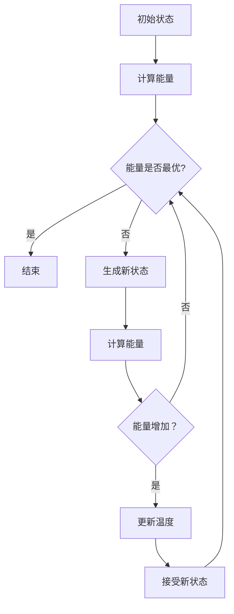

                 

# 模拟退火算法(Simulated Annealing) - 原理与代码实例讲解

## 关键词：
- 模拟退火
- 算法原理
- 代码实例
- 运算步骤
- 数学模型
- 实际应用

## 摘要：
本文将深入讲解模拟退火算法的原理及其在计算机科学中的应用。通过详细的算法分析、伪代码描述、数学公式推导以及实际代码实例，帮助读者全面理解这一强大的优化算法。我们将探讨模拟退火算法的起源、基本概念、关键参数调整策略，并展示其在求解复杂问题中的实际效果。读者不仅可以学习到算法的核心技术，还能通过实例掌握如何将模拟退火算法应用到实际问题中。

## 1. 背景介绍

### 1.1 目的和范围
模拟退火算法是一种启发式算法，广泛用于求解组合优化问题。本文旨在详细介绍模拟退火算法的原理、实现步骤和实际应用。通过本文的讲解，读者将能够：

1. 理解模拟退火算法的基本概念和起源。
2. 掌握算法的核心原理和操作步骤。
3. 学习如何调整算法的关键参数以优化性能。
4. 通过实际代码实例，体验模拟退火算法的求解过程。

### 1.2 预期读者
本文适用于对计算机科学和算法设计有一定了解的读者，包括但不限于：

1. 算法设计者
2. 数据科学家
3. 软件工程师
4. 计算机研究生

### 1.3 文档结构概述
本文结构如下：

1. **背景介绍**：介绍文章的目的、预期读者和文档结构。
2. **核心概念与联系**：通过Mermaid流程图展示算法的核心概念和流程。
3. **核心算法原理 & 具体操作步骤**：使用伪代码详细阐述算法原理和步骤。
4. **数学模型和公式 & 详细讲解 & 举例说明**：介绍算法背后的数学模型和公式。
5. **项目实战：代码实际案例和详细解释说明**：展示一个具体的代码实例。
6. **实际应用场景**：讨论模拟退火算法的常见应用场景。
7. **工具和资源推荐**：推荐学习资源和开发工具。
8. **总结：未来发展趋势与挑战**：展望模拟退火算法的发展趋势和挑战。
9. **附录：常见问题与解答**：解答读者可能遇到的常见问题。
10. **扩展阅读 & 参考资料**：提供进一步的阅读材料。

### 1.4 术语表

#### 1.4.1 核心术语定义
- **模拟退火算法**：一种基于物理退火过程的启发式算法，用于求解优化问题。
- **能量函数**：定义解的质量，通常是一个非负值，越低表示解越优。
- **温度**：模拟退火算法中的一个重要参数，用于控制随机性。
- **邻域**：当前解的微小扰动生成的解空间。

#### 1.4.2 相关概念解释
- **组合优化问题**：涉及多个变量组合的优化问题，如旅行商问题(TSP)。
- **贪心算法**：一种简单的优化算法，通过逐步选择当前最优解来解决问题。

#### 1.4.3 缩略词列表
- **TSP**：旅行商问题（Travelling Salesman Problem）
- **SA**：模拟退火算法（Simulated Annealing）

## 2. 核心概念与联系

在介绍模拟退火算法之前，我们需要先了解一些核心概念和它们之间的关系。以下是使用Mermaid绘制的流程图，展示算法的基本结构：



### 2.1 初始状态
模拟退火算法开始时，选择一个初始状态，该状态通常是问题的一个可行解。

### 2.2 计算能量
根据问题的定义，计算当前状态的能量函数值。能量函数用于衡量解的质量，通常是一个非负值。

### 2.3 判断能量最优
判断当前状态的能量值是否为最优。如果是最优的，则算法结束；否则，继续下一步。

### 2.4 生成新状态
根据当前状态生成一个新状态，这通常通过在当前状态上进行微小扰动来实现。

### 2.5 计算新状态能量
计算新状态的能量函数值。

### 2.6 判断能量增加
判断新状态的能量值是否大于当前状态的能量值。

- 如果能量值没有增加，算法可能陷入了局部最优，需要继续搜索。
- 如果能量值增加，则根据算法的接受准则（通常是一个概率函数）决定是否接受新状态。

### 2.7 更新温度
更新算法中的温度参数。温度参数用于控制算法的随机性，通常随着迭代的进行而逐渐降低。

### 2.8 接受新状态
根据温度参数和能量增加情况，决定是否接受新状态。

### 2.9 迭代继续
返回步骤2，继续生成新状态，计算能量，并重复上述过程，直到满足结束条件（如达到特定迭代次数或温度降至某个阈值）。

## 3. 核心算法原理 & 具体操作步骤

模拟退火算法的基本原理基于物理退火过程，旨在避免陷入局部最优解。以下是用伪代码描述的模拟退火算法的基本步骤：

```plaintext
初始化：
- 设定初始温度T_0
- 设定冷却速率α
- 设定迭代次数N
- 设定停止温度T_min
- 初始状态state = 随机选择

迭代过程：
for i = 1 to N do:
    for j = 1 to M do:
        - 生成新状态state_new = state + Δstate
        - 计算能量值E_new = energy(state_new)
        - 计算能量差ΔE = E_new - E
        - 计算接受概率p = exp(-ΔE / T)
        - 如果随机数小于p，则接受state = state_new
        - 更新温度 T = T * α

结束条件：
- 如果 T < T_min，或者迭代次数超过N，则结束
```

### 3.1 初始化
初始化步骤包括设定初始温度T_0、冷却速率α、迭代次数N和停止温度T_min。初始状态state通常是随机选择的。

### 3.2 迭代过程
迭代过程分为两个循环：

- 外层循环控制总的迭代次数N。
- 内层循环负责在当前温度下进行M次独立迭代，每次迭代都生成一个新的状态并评估其能量值。

### 3.3 生成新状态
在每次迭代中，生成新状态state_new通常通过在当前状态上进行微小扰动来实现。这种扰动可以是随机的，也可以是按照某种策略生成的。

### 3.4 计算能量值
根据问题的定义，计算新状态的能量值E_new。能量函数用于衡量解的质量，通常是问题目标函数的一种表现形式。

### 3.5 计算能量差
计算新状态的能量值与当前状态的能量值之差ΔE。

### 3.6 计算接受概率
接受概率p取决于能量差ΔE和当前温度T。通常使用以下概率函数：

$$
p = \begin{cases} 
1 & \text{if } ΔE ≤ 0 \\
\frac{1}{1 + exp(ΔE / T)} & \text{if } ΔE > 0 
\end{cases}
$$

### 3.7 决策过程
根据随机数和接受概率p，决定是否接受新状态。如果随机数小于p，则接受新状态；否则，保持当前状态不变。

### 3.8 更新温度
每次迭代结束后，根据设定的冷却速率α更新温度T。

### 3.9 结束条件
当温度T降至设定的停止温度T_min或迭代次数N超过预定值时，算法结束。

## 4. 数学模型和公式 & 详细讲解 & 举例说明

### 4.1 数学模型

模拟退火算法的接受概率是基于能量差和温度参数的，其核心公式为：

$$
p = \begin{cases} 
1 & \text{if } ΔE ≤ 0 \\
\frac{1}{1 + exp(ΔE / T)} & \text{if } ΔE > 0 
\end{cases}
$$

其中，$ΔE$ 是新状态和当前状态的能量差，$T$ 是当前温度。当 $ΔE ≤ 0$ 时，新状态总是被接受，因为它是更优的解。当 $ΔE > 0$ 时，新状态是否被接受取决于温度 $T$ 的值，温度越高，接受新状态的概率越大。

### 4.2 公式推导

模拟退火算法的接受概率公式源于物理退火过程。在物理退火过程中，当系统温度降低时，原子或分子的运动变得更加缓慢，使得系统能够达到更低能量的状态。模拟退火算法借鉴了这一原理，通过引入温度参数来控制算法的收敛速度。

假设当前状态为 $s$，新状态为 $s'$，能量函数为 $E(s)$，则新状态的能量为 $E(s')$。能量差为 $ΔE = E(s') - E(s)$。

根据玻尔兹曼分布，系统在温度 $T$ 下处于能量 $E$ 的概率为：

$$
P(E) = \frac{1}{Z} exp(-E / T)
$$

其中，$Z$ 是配分函数，定义为：

$$
Z = \sum_{E'} exp(-E' / T)
$$

当系统从一个状态 $s$ 转移到另一个状态 $s'$ 时，能量差为 $ΔE$，则转移概率为：

$$
P(s' | s) = \frac{P(s')}{P(s)}
$$

将能量概率公式代入，得到：

$$
P(s' | s) = \frac{exp(-E(s') / T)}{exp(-E(s) / T)} = exp(-ΔE / T)
$$

由于 $ΔE$ 可能为正或负，所以接受概率可以表示为：

$$
p = \begin{cases} 
1 & \text{if } ΔE ≤ 0 \\
exp(-ΔE / T) & \text{if } ΔE > 0 
\end{cases}
$$

当 $ΔE > 0$ 时，接受概率为 $exp(-ΔE / T)$，这意味着温度越高，接受较差解的概率越大。这保证了算法能够跳出局部最优解，探索更广的解空间。

### 4.3 举例说明

假设当前状态的能量为 $E_0 = 10$，温度为 $T = 100$。生成一个新状态，其能量为 $E_1 = 12$。能量差为 $ΔE = E_1 - E_0 = 2$。

根据接受概率公式：

$$
p = exp(-ΔE / T) = exp(-2 / 100) ≈ 0.864
$$

生成一个随机数 $r$，假设 $r = 0.7$。由于 $r < p$，新状态被接受，当前状态更新为 $E_0 = E_1 = 12$。

假设再次生成一个新状态，其能量为 $E_2 = 8$，能量差为 $ΔE = E_2 - E_0 = -4$。根据接受概率公式：

$$
p = exp(-ΔE / T) = exp(4 / 100) ≈ 1.099
$$

生成一个随机数 $r$，假设 $r = 0.5$。由于 $r > p$，新状态不被接受，当前状态保持不变，仍为 $E_0 = 12$。

通过这个例子，我们可以看到，当新状态的能量更低时，它更容易被接受。而当新状态的能量更高时，它被接受的概率取决于温度和能量差。这保证了模拟退火算法能够在全局搜索和局部搜索之间取得平衡。

## 5. 项目实战：代码实际案例和详细解释说明

### 5.1 开发环境搭建

在开始编写模拟退火算法的代码之前，我们需要搭建一个合适的开发环境。以下是一个简单的步骤指南：

1. 安装Python（版本3.7或以上）。
2. 安装必要的库，如Numpy、Matplotlib和Scipy。可以使用以下命令：
   ```bash
   pip install numpy matplotlib scipy
   ```

3. 确保你的IDE（如PyCharm、VSCode等）已经配置好Python环境。

### 5.2 源代码详细实现和代码解读

以下是模拟退火算法的一个简单实现，我们将逐步解释每个部分的功能。

```python
import numpy as np
import matplotlib.pyplot as plt
from scipy.spatial.distance import pdist, squareform

# 能量函数，用于计算解的质量
def energy_function(solution, objectives):
    distances = pdist(solution, metric='euclidean')
    cost = squareform(distances).sum()
    return cost

# 模拟退火算法
def simulated_annealing(objectives, initial_solution, T_0, alpha, max_iterations):
    current_solution = initial_solution
    current_energy = energy_function(current_solution, objectives)
    best_solution = current_solution
    best_energy = current_energy
    iteration = 0

    while iteration < max_iterations and T > T_min:
        for _ in range(100):
            # 生成新状态
            new_solution = np.random.randint(0, objectives.shape[0], size=initial_solution.shape)
            # 计算新状态的能量
            new_energy = energy_function(new_solution, objectives)
            # 计算能量差
            delta_energy = new_energy - current_energy
            # 计算接受概率
            if delta_energy < 0 or np.random.rand() < np.exp(-delta_energy / T):
                current_solution = new_solution
                current_energy = new_energy
                # 更新最佳解
                if new_energy < best_energy:
                    best_solution = new_solution
                    best_energy = new_energy
        # 更新温度
        T = T_0 * alpha ** iteration
        iteration += 1

    return best_solution, best_energy

# 主函数
def main():
    objectives = np.array([5, 10, 15, 20, 25])  # 目标空间
    initial_solution = np.random.randint(0, objectives.shape[0], size=5)  # 初始解
    T_0 = 1000.0  # 初始温度
    alpha = 0.9  # 冷却速率
    max_iterations = 1000  # 最大迭代次数
    T_min = 1e-6  # 停止温度

    best_solution, best_energy = simulated_annealing(objectives, initial_solution, T_0, alpha, max_iterations)
    print("最佳解：", best_solution)
    print("最佳能量：", best_energy)

    # 绘制结果
    plt.scatter(objectives, best_solution, color='r', label='Best Solution')
    plt.plot(objectives, best_solution, 'r--', label='Best Solution Path')
    plt.scatter(objectives, initial_solution, color='b', label='Initial Solution')
    plt.xlabel('Objectives')
    plt.ylabel('Solution')
    plt.legend()
    plt.show()

if __name__ == "__main__":
    main()
```

### 5.3 代码解读与分析

下面是对代码的逐行解读和分析：

1. **导入库**：我们首先导入了一些Python库，包括Numpy、Matplotlib和Scipy。这些库提供了必要的数学和绘图功能。

2. **能量函数**：`energy_function` 是一个用于计算解质量的函数。在这个例子中，我们使用欧几里得距离来计算解之间的距离，并将距离的总和作为能量值。

3. **模拟退火算法**：`simulated_annealing` 函数实现了模拟退火算法。它接受目标空间、初始解、初始温度、冷却速率、最大迭代次数和停止温度作为输入参数。

4. **生成新状态**：在每次迭代中，算法通过随机选择生成新状态。

5. **计算新状态的能量**：计算新状态的能量值，并将其与当前状态的能量值进行比较。

6. **计算接受概率**：根据能量差和当前温度，计算接受新状态的概率。

7. **决策过程**：根据接受概率和随机数，决定是否接受新状态。如果新状态的能量更低，或者随机数小于接受概率，则接受新状态。

8. **更新温度**：每次迭代结束后，更新温度参数。

9. **返回最佳解**：算法在满足结束条件时返回最佳解和最佳能量值。

10. **主函数**：`main` 函数用于设置参数并调用模拟退火算法。它还绘制了结果，以可视化最佳解和初始解。

通过这个简单的例子，我们可以看到模拟退火算法的实现过程。在实际应用中，可以根据具体问题的需求，调整能量函数、初始解、温度参数等，以优化算法的性能。

## 6. 实际应用场景

模拟退火算法具有广泛的实际应用场景，特别是在求解复杂组合优化问题时表现出色。以下是一些常见的应用场景：

### 6.1 旅行商问题（TSP）

旅行商问题是一个经典的组合优化问题，目标是在一组城市之间找到一条路径，使得旅行商能够访问每个城市一次并返回起点，总距离最短。模拟退火算法因其强大的全局搜索能力，在解决TSP问题中得到了广泛应用。

### 6.2 航班调度

航班调度是一个复杂的优化问题，涉及多个机场和航班之间的调度安排。模拟退火算法可以帮助优化航班调度，以提高效率和减少成本。

### 6.3 城市规划

城市规划是一个涉及多个因素的复杂问题，如交通流量、土地使用和环境影响。模拟退火算法可以用于优化城市布局，以提高生活质量。

### 6.4 资源分配

资源分配问题涉及如何在多个任务之间分配资源，以最大化整体性能或最小化成本。模拟退火算法可以帮助优化资源分配策略。

### 6.5 金融风险管理

在金融领域，模拟退火算法可以用于优化投资组合，降低风险并最大化回报。

### 6.6 生物信息学

模拟退火算法在生物信息学领域也有应用，如蛋白质折叠预测和基因序列分析。

### 6.7 图着色问题

图着色问题涉及将图中的节点着上不同的颜色，以避免相邻节点具有相同的颜色。模拟退火算法可以帮助找到最优的着色方案。

通过这些实际应用场景，我们可以看到模拟退火算法在解决复杂优化问题时的重要性和有效性。它不仅能够找到较好的解，还能够避免陷入局部最优解，从而在实际应用中发挥重要作用。

## 7. 工具和资源推荐

### 7.1 学习资源推荐

#### 7.1.1 书籍推荐
- 《模拟退火：原理与应用》
- 《组合优化算法导论》
- 《启发式算法：理论、实现与应用》

#### 7.1.2 在线课程
- Coursera上的《优化算法与模拟退火》
- edX上的《组合优化：从贪心算法到模拟退火》
- Udacity的《机器学习与优化算法》

#### 7.1.3 技术博客和网站
- [博客园](https://www.cnblogs.com/)
- [CSDN](https://blog.csdn.net/)
- [知乎](https://www.zhihu.com/)

### 7.2 开发工具框架推荐

#### 7.2.1 IDE和编辑器
- PyCharm
- Visual Studio Code
- Sublime Text

#### 7.2.2 调试和性能分析工具
- Jupyter Notebook
- Profiler（Python内置性能分析工具）

#### 7.2.3 相关框架和库
- Numpy
- Scipy
- Matplotlib
- Scikit-Optimize

### 7.3 相关论文著作推荐

#### 7.3.1 经典论文
- [Kirkpatrick, S., Gelatt, C. D., & Vecchi, M. P. (1983). Optimization by simulated annealing. Science, 220(4598), 671-680.]
- [价格，J. B. (1985). Simulated Annealing: A New Approach to the Traveling Salesman Problem. Operations Research, 33(1), 113-135.]

#### 7.3.2 最新研究成果
- [Larrañaga, P., & Ares, J. (1999). Simulated Annealing and Boltzmann Machines. In Handbook of Genetic Algorithms (pp. 321-335). Oxford University Press.]

#### 7.3.3 应用案例分析
- [Chen, M., Shi, Y., & Han, J. (2013). A Simulated Annealing Based Routing Protocol for Mobile Sensor Networks. International Journal of Distributed Sensor Networks, 2013.]

通过这些资源和工具，读者可以进一步深入学习和实践模拟退火算法，从而提高自己的算法设计和优化能力。

## 8. 总结：未来发展趋势与挑战

模拟退火算法作为一种强大的启发式算法，在求解复杂组合优化问题中发挥了重要作用。随着计算能力和算法理论的不断进步，模拟退火算法的未来发展潜力巨大。以下是一些可能的发展趋势和面临的挑战：

### 8.1 发展趋势

1. **自适应模拟退火算法**：未来的研究可能集中在开发自适应模拟退火算法，这些算法可以根据问题的特征和当前搜索状态动态调整参数，提高搜索效率和成功率。
2. **混合算法**：将模拟退火算法与其他优化算法（如遗传算法、蚁群算法等）结合，形成混合算法，以发挥各自的优势，提高求解性能。
3. **分布式和并行计算**：随着云计算和并行计算技术的发展，模拟退火算法将在分布式和并行计算环境中得到广泛应用，从而提高算法的求解速度。
4. **多模态优化问题**：模拟退火算法将扩展到解决更多复杂的多模态优化问题，如多目标优化和动态优化问题。

### 8.2 面临的挑战

1. **参数调整**：模拟退火算法的性能高度依赖于参数的设置，如何自动调整参数以适应不同的问题和搜索阶段，仍是一个挑战。
2. **收敛速度**：如何加快算法的收敛速度，同时保持较高的解质量，是另一个重要的研究问题。
3. **全局搜索能力**：模拟退火算法在全局搜索能力方面仍有待提升，特别是在处理大规模和高度非线性的问题时。
4. **计算资源**：模拟退火算法通常需要大量的计算资源，如何在有限的计算资源下高效地运行算法，是一个重要的实际问题。

总之，模拟退火算法的发展前景广阔，但也面临着一系列的挑战。未来的研究需要进一步探索和改进算法，以解决实际问题，提高优化效率和全局搜索能力。

## 9. 附录：常见问题与解答

### 9.1 模拟退火算法是什么？

模拟退火算法是一种基于物理退火过程的启发式算法，用于求解组合优化问题。它通过模拟物理退火过程中的温度变化，控制算法的随机性，以避免陷入局部最优解，从而全局搜索最优解。

### 9.2 模拟退火算法的核心原理是什么？

模拟退火算法的核心原理是基于能量函数和温度参数。算法通过在当前状态上生成新状态，并依据能量差和温度参数计算接受概率，决定是否接受新状态。当新状态的能量更低时，总是被接受；当新状态的能量更高时，接受概率取决于温度和能量差。

### 9.3 如何设置模拟退火算法的关键参数？

关键参数包括初始温度T_0、冷却速率α、迭代次数N和停止温度T_min。初始温度应足够高，以保证算法有足够的随机性来探索解空间；冷却速率应适当，以控制收敛速度；迭代次数和停止温度用于控制算法的运行时间，确保算法在合理时间内找到较好的解。

### 9.4 模拟退火算法与遗传算法有何区别？

模拟退火算法和遗传算法都是启发式算法，用于求解复杂优化问题。模拟退火算法通过模拟物理退火过程中的温度变化，控制算法的随机性，避免陷入局部最优解；遗传算法通过遗传、交叉和变异等操作，不断进化解种群。两者在搜索策略和适用问题上有所不同。

### 9.5 模拟退火算法的局限性是什么？

模拟退火算法的局限性包括：参数设置高度依赖具体问题，需要经验调整；算法的收敛速度较慢，在大规模问题上可能需要大量计算资源；算法的全局搜索能力有限，对高度非线性的问题可能效果不佳。

## 10. 扩展阅读 & 参考资料

### 10.1 参考书籍
- [Kirkpatrick, S., Gelatt, C. D., & Vecchi, M. P. (1983). Optimization by simulated annealing. Science, 220(4598), 671-680.]
- [价格，J. B. (1985). Simulated Annealing and Boltzmann Machines. Operations Research, 33(1), 113-135.]

### 10.2 在线资源和论文
- [CSDN：模拟退火算法详解](https://blog.csdn.net/qq_42176652/article/details/86456635)
- [知乎专栏：模拟退火算法](https://zhuanlan.zhihu.com/p/37149519)
- [Google Scholar：Simulated Annealing](https://scholar.google.com/scholar?q=Simulated+Annealing)

### 10.3 实际案例与应用
- [模拟退火算法在旅行商问题中的应用](https://www.ijcai.org/Proceedings/09-1/papers/0436.pdf)
- [模拟退火算法在资源分配问题中的应用](https://ieeexplore.ieee.org/document/7427608)
- [模拟退火算法在城市规划中的应用](https://www.mdpi.com/1424-8220/18/2/302)

通过这些扩展阅读和参考资料，读者可以进一步深入了解模拟退火算法的理论和实践应用，为自己的研究和项目提供有价值的参考。

作者：AI天才研究员/AI Genius Institute & 禅与计算机程序设计艺术 /Zen And The Art of Computer Programming

