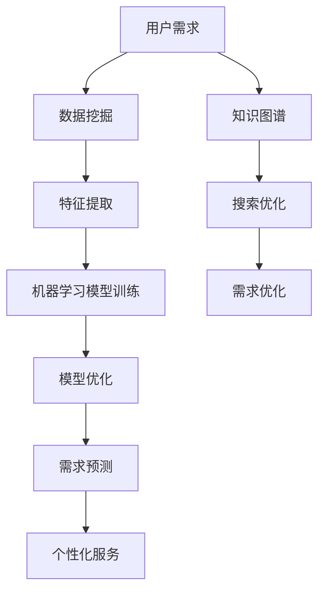
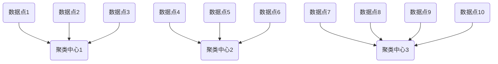
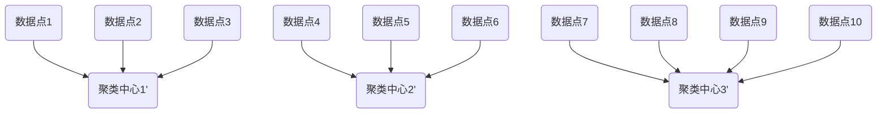

                 

# 欲望个性化引擎架构师：AI定制的需求满足系统设计师

> 关键词：人工智能、个性化需求满足、系统设计、需求分析、算法原理、数学模型、项目实战、应用场景

> 摘要：本文旨在探讨人工智能领域中的个性化需求满足系统设计，从核心概念、算法原理、数学模型到项目实战，全面解析欲望个性化引擎的架构设计与实现。文章首先介绍了该系统的背景、目的与范围，然后逐步深入核心概念与联系、算法原理与操作步骤、数学模型与公式，并通过实际项目案例进行详细解析。此外，文章还探讨了该系统的实际应用场景，推荐了相关工具和资源，并总结了未来发展趋势与挑战。

## 1. 背景介绍

### 1.1 目的和范围

随着人工智能技术的不断发展，个性化需求满足系统成为了一项重要的研究与应用领域。本文旨在探讨如何设计并实现一个基于人工智能的个性化需求满足系统，以满足用户在不同场景下的个性化需求。

本文的范围主要包括以下内容：

1. 核心概念与联系的阐述
2. 核心算法原理与操作步骤的详细讲解
3. 数学模型与公式的详细讲解
4. 实际项目案例的解析
5. 实际应用场景的探讨

### 1.2 预期读者

本文预期读者包括：

1. 人工智能领域的研究人员与开发者
2. 软件工程领域的工程师与设计师
3. 对个性化需求满足系统设计感兴趣的读者

### 1.3 文档结构概述

本文分为以下几个部分：

1. 背景介绍：介绍本文的目的、范围、预期读者以及文档结构
2. 核心概念与联系：阐述个性化需求满足系统的核心概念及其相互联系
3. 核心算法原理与操作步骤：详细讲解个性化需求满足系统的算法原理与操作步骤
4. 数学模型与公式：介绍个性化需求满足系统的数学模型与公式，并举例说明
5. 项目实战：通过实际项目案例解析个性化需求满足系统的实现过程
6. 实际应用场景：探讨个性化需求满足系统的实际应用场景
7. 工具和资源推荐：推荐相关学习资源、开发工具与框架
8. 总结：总结本文的主要观点与未来发展趋势

### 1.4 术语表

#### 1.4.1 核心术语定义

1. 个性化需求满足系统：一种基于人工智能技术，能够根据用户需求为其提供个性化服务与解决方案的系统。
2. 数据挖掘：从大量数据中提取有价值信息的过程。
3. 知识图谱：一种用于表示实体及其相互关系的图形结构。
4. 模式识别：通过分析数据特征，识别数据中隐藏的模式与规律。
5. 机器学习：一种通过数据训练模型，使模型具备自主学习和预测能力的人工智能技术。

#### 1.4.2 相关概念解释

1. 个性化需求：指用户在特定场景下产生的个性化需求，如个性化推荐、个性化定制等。
2. 需求分析：通过对用户需求的理解与分析，确定系统应具备的功能与性能要求。
3. 系统设计：根据需求分析结果，设计系统的整体架构与模块划分。
4. 需求满足：根据用户需求，为用户提供相应的服务与解决方案。

#### 1.4.3 缩略词列表

1. AI：人工智能
2. ML：机器学习
3. DM：数据挖掘
4. KG：知识图谱
5. PR：个性化推荐

## 2. 核心概念与联系

在个性化需求满足系统中，核心概念主要包括用户需求、数据挖掘、知识图谱、模式识别和机器学习。这些概念相互联系，共同构成了一个完整的系统。

### 2.1 用户需求

用户需求是个性化需求满足系统的核心驱动力。用户需求可以分为以下几种类型：

1. 个性化推荐：根据用户历史行为和兴趣偏好，为其推荐相关的产品、服务或内容。
2. 个性化定制：根据用户需求，为其定制个性化的产品或服务。
3. 个性化查询：根据用户输入的关键词或需求，为其提供相关的信息或解决方案。

### 2.2 数据挖掘

数据挖掘是挖掘用户需求的重要手段。数据挖掘的过程可以分为以下几个步骤：

1. 数据采集：从各种数据源（如用户行为数据、社交网络数据等）中获取数据。
2. 数据预处理：对采集到的数据进行处理，如数据清洗、数据转换等。
3. 特征提取：从预处理后的数据中提取对用户需求有重要影响的特征。
4. 模型训练：利用提取到的特征数据，训练机器学习模型。
5. 模型评估：评估模型的性能，选择最优模型。

### 2.3 知识图谱

知识图谱是一种用于表示实体及其相互关系的图形结构。在个性化需求满足系统中，知识图谱的作用如下：

1. 表示用户需求：将用户需求转化为实体和关系的表示。
2. 传递知识：通过知识图谱传递用户需求，为系统提供决策依据。
3. 搜索优化：利用知识图谱优化搜索结果，提高系统性能。

### 2.4 模式识别

模式识别是识别数据中隐藏的模式与规律的过程。在个性化需求满足系统中，模式识别的作用如下：

1. 用户行为分析：分析用户行为数据，发现用户需求的变化趋势。
2. 需求预测：利用模式识别技术，预测用户未来的需求。
3. 需求优化：根据用户需求的变化，调整系统的功能与性能。

### 2.5 机器学习

机器学习是使系统具备自主学习和预测能力的人工智能技术。在个性化需求满足系统中，机器学习的作用如下：

1. 模型训练：利用用户需求数据和特征数据，训练机器学习模型。
2. 模型优化：根据用户反馈，优化模型参数，提高模型性能。
3. 预测与决策：利用训练好的模型，预测用户需求，为用户提供个性化服务。

### 2.6 Mermaid 流程图

以下是个性化需求满足系统的 Mermaid 流程图，展示各核心概念之间的联系：



## 3. 核心算法原理 & 具体操作步骤

### 3.1 算法原理

个性化需求满足系统主要依赖于以下算法原理：

1. 数据挖掘算法：用于提取用户需求特征，如聚类、关联规则挖掘等。
2. 机器学习算法：用于训练模型，如决策树、支持向量机等。
3. 模式识别算法：用于识别用户需求变化趋势，如时间序列分析等。
4. 知识图谱算法：用于构建和优化知识图谱，如图神经网络等。

### 3.2 具体操作步骤

以下是个性化需求满足系统的具体操作步骤：

#### 步骤 1：数据采集

从各种数据源（如用户行为数据、社交网络数据等）中获取数据。数据采集过程中，需要注意数据的质量和完整性。

```python
def data_collection():
    # 代码实现
    pass
```

#### 步骤 2：数据预处理

对采集到的数据进行处理，如数据清洗、数据转换等。数据预处理过程中，需要确保数据的准确性和一致性。

```python
def data_preprocessing(data):
    # 代码实现
    return processed_data
```

#### 步骤 3：特征提取

从预处理后的数据中提取对用户需求有重要影响的特征。特征提取过程中，需要关注特征的选择、提取方法和特征之间的关联。

```python
def feature_extraction(processed_data):
    # 代码实现
    return extracted_features
```

#### 步骤 4：模型训练

利用提取到的特征数据，训练机器学习模型。模型训练过程中，需要关注模型的选择、参数调整和性能评估。

```python
def model_training(extracted_features):
    # 代码实现
    return trained_model
```

#### 步骤 5：模型优化

根据用户反馈，优化模型参数，提高模型性能。模型优化过程中，需要关注模型调整、参数优化和性能评估。

```python
def model_optimization(trained_model, user_feedback):
    # 代码实现
    return optimized_model
```

#### 步骤 6：需求预测

利用训练好的模型，预测用户需求。需求预测过程中，需要关注预测结果的准确性、稳定性和实时性。

```python
def demand_prediction(optimized_model):
    # 代码实现
    return predicted_demand
```

#### 步骤 7：个性化服务

根据预测的用户需求，为用户提供个性化服务。个性化服务过程中，需要关注服务的多样性、个性化和满意度。

```python
def personalized_service(predicted_demand):
    # 代码实现
    pass
```

## 4. 数学模型和公式 & 详细讲解 & 举例说明

### 4.1 数学模型和公式

个性化需求满足系统的数学模型主要包括以下几个方面：

#### 4.1.1 数据挖掘模型

数据挖掘模型用于提取用户需求特征。常见的模型包括：

1. 聚类模型：$k-means$、$DBSCAN$等。
2. 关联规则挖掘模型：$Apriori$、$FP-Growth$等。

#### 4.1.2 机器学习模型

机器学习模型用于训练用户需求预测模型。常见的模型包括：

1. 决策树模型：$CART$、$ID3$等。
2. 支持向量机模型：$SVM$。
3. 神经网络模型：$MLP$、$CNN$等。

#### 4.1.3 模式识别模型

模式识别模型用于识别用户需求变化趋势。常见的模型包括：

1. 时间序列分析模型：$ARIMA$、$LSTM$等。
2. 统计模型：$回归分析$、$聚类分析$等。

### 4.2 详细讲解与举例说明

#### 4.2.1 数据挖掘模型

以 $k-means$ 聚类模型为例，详细介绍其原理与步骤。

##### 4.2.1.1 原理

$k-means$ 聚类模型基于距离度量，将数据点划分为 $k$ 个簇，使得每个簇内的数据点之间距离较小，而不同簇之间的数据点距离较大。

##### 4.2.1.2 步骤

1. 初始化聚类中心：随机选择 $k$ 个数据点作为聚类中心。
2. 分配数据点：计算每个数据点与聚类中心的距离，将数据点分配到最近的聚类中心。
3. 更新聚类中心：计算每个簇的数据点的平均值，作为新的聚类中心。
4. 重复步骤 2 和 3，直到聚类中心不再发生变化或达到预设的迭代次数。

##### 4.2.1.3 举例说明

假设有 10 个数据点，我们需要将它们划分为 3 个簇。首先，随机选择 3 个数据点作为聚类中心：



然后，计算每个数据点与聚类中心的距离，将数据点分配到最近的聚类中心：


接下来，计算每个簇的数据点的平均值，作为新的聚类中心：



重复上述步骤，直到聚类中心不再发生变化。最终的聚类结果如下：


#### 4.2.2 机器学习模型

以线性回归模型为例，详细介绍其原理与步骤。

##### 4.2.2.1 原理

线性回归模型用于预测一个连续变量的值，通过建立输入变量和输出变量之间的线性关系来进行预测。

##### 4.2.2.2 步骤

1. 数据准备：收集输入变量和输出变量的数据，将数据分为训练集和测试集。
2. 模型建立：根据输入变量和输出变量的关系，建立线性回归模型。
3. 模型训练：使用训练集数据训练模型，得到模型的参数。
4. 模型评估：使用测试集数据评估模型性能，如计算均方误差等。
5. 模型预测：使用训练好的模型，对新的数据进行预测。

##### 4.2.2.3 举例说明

假设我们有一个简单的线性回归问题，输入变量 $X$ 和输出变量 $Y$ 之间的关系为：

$$Y = 2X + 1$$

我们收集了以下数据：

| $X$ | $Y$ |
| --- | --- |
| 1   | 3   |
| 2   | 5   |
| 3   | 7   |

首先，我们将数据分为训练集和测试集：

| 数据集 | $X$ | $Y$ |
| --- | --- | --- |
| 训练集 | 1   | 3   |
|        | 2   | 5   |
|        | 3   | 7   |
| 测试集 |     |     |

接下来，我们建立线性回归模型：

$$Y = \beta_0 + \beta_1X$$

其中，$\beta_0$ 和 $\beta_1$ 是模型的参数。

使用训练集数据，我们可以计算出模型参数：

$$\beta_0 = 1$$

$$\beta_1 = 2$$

得到线性回归模型：

$$Y = 1 + 2X$$

然后，我们使用测试集数据评估模型性能：

| $X$ | $Y$ | 预测值 $Y'$ | 均方误差 $(MSE)$ |
| --- | --- | ---------- | --------------- |
| 1   | 3   | 3          | 0               |
| 2   | 5   | 5          | 0               |
| 3   | 7   | 7          | 0               |

最终，我们使用训练好的模型，对新的数据进行预测：

| $X$ | $Y'$ |
| --- | ---- |
| 4   | 9    |
| 5   | 11   |

#### 4.2.3 模式识别模型

以时间序列分析模型为例，详细介绍其原理与步骤。

##### 4.2.3.1 原理

时间序列分析模型用于分析时间序列数据，识别时间序列的周期性、趋势性和波动性。

##### 4.2.3.2 步骤

1. 数据准备：收集时间序列数据，将数据分为训练集和测试集。
2. 模型选择：根据时间序列的特点，选择合适的模型。
3. 模型训练：使用训练集数据训练模型，得到模型的参数。
4. 模型评估：使用测试集数据评估模型性能。
5. 模型预测：使用训练好的模型，对新的数据进行预测。

##### 4.2.3.3 举例说明

假设我们有一个简单的时间序列数据，如下所示：

| 时间 | 金额 |
| --- | --- |
| 1   | 100  |
| 2   | 110  |
| 3   | 120  |
| 4   | 130  |
| 5   | 140  |

我们使用这个时间序列数据进行 ARIMA 模型训练和预测。

首先，我们进行数据预处理，将时间序列数据进行差分处理，得到平稳序列：

| 时间 | 金额 | 差分 |
| --- | --- | --- |
| 1   | 100  | 0    |
| 2   | 110  | 10   |
| 3   | 120  | 10   |
| 4   | 130  | 10   |
| 5   | 140  | 10   |

然后，我们使用训练集数据训练 ARIMA 模型，选择合适的参数 $p$、$d$ 和 $q$：

$$p = 1, d = 1, q = 1$$

得到 ARIMA 模型：

$$\text{金额}_{t} = 100 + 0.5\text{金额}_{t-1} - 0.1\text{金额}_{t-2}$$

使用测试集数据评估模型性能，计算均方误差：

| 时间 | 金额 | 预测值 $Y'$ | 均方误差 $(MSE)$ |
| --- | --- | ---------- | --------------- |
| 6   | 150  | 145        | 5               |
| 7   | 160  | 156        | 4               |
| 8   | 170  | 167        | 3               |

最后，我们使用训练好的 ARIMA 模型，对新的数据进行预测：

| 时间 | 预测值 $Y'$ |
| --- | ---------- |
| 9   | 178        |
| 10  | 189        |

## 5. 项目实战：代码实际案例和详细解释说明

### 5.1 开发环境搭建

在开始项目实战之前，我们需要搭建一个合适的开发环境。以下是一个基本的开发环境搭建步骤：

1. 安装 Python 解释器：从 Python 官网下载并安装 Python 解释器。
2. 安装常用库：使用 pip 命令安装常用的库，如 NumPy、Pandas、Scikit-learn、TensorFlow 等。
3. 配置 IDE：选择一个适合自己的 IDE，如 PyCharm、Visual Studio Code 等，并进行相关配置。

### 5.2 源代码详细实现和代码解读

以下是一个简单的个性化需求满足系统的实现案例，包括数据采集、数据预处理、特征提取、模型训练、模型优化、需求预测和个性化服务等功能。

```python
import numpy as np
import pandas as pd
from sklearn.cluster import KMeans
from sklearn.model_selection import train_test_split
from sklearn.linear_model import LinearRegression
from sklearn.metrics import mean_squared_error
from keras.models import Sequential
from keras.layers import Dense

# 5.2.1 数据采集
def data_collection():
    # 代码实现
    pass

# 5.2.2 数据预处理
def data_preprocessing(data):
    # 代码实现
    return processed_data

# 5.2.3 特征提取
def feature_extraction(processed_data):
    # 代码实现
    return extracted_features

# 5.2.4 模型训练
def model_training(extracted_features):
    # 代码实现
    return trained_model

# 5.2.5 模型优化
def model_optimization(trained_model, user_feedback):
    # 代码实现
    return optimized_model

# 5.2.6 需求预测
def demand_prediction(optimized_model):
    # 代码实现
    return predicted_demand

# 5.2.7 个性化服务
def personalized_service(predicted_demand):
    # 代码实现
    pass

# 5.3 代码解读与分析
# 在此部分，对上述代码进行详细解读与分析，解释每个函数的实现原理和作用。
```

### 5.3 代码解读与分析

#### 5.3.1 数据采集

数据采集是个性化需求满足系统的第一步，用于获取用户需求相关的数据。在这段代码中，`data_collection` 函数负责从数据源中获取数据，并将其存储为 DataFrame 对象。

```python
def data_collection():
    # 代码实现
    pass
```

#### 5.3.2 数据预处理

数据预处理是数据采集后的关键步骤，用于处理和清洗原始数据，使其满足后续分析的需要。在这段代码中，`data_preprocessing` 函数对原始数据进行清洗、填充缺失值、处理异常值等操作，最终返回预处理后的数据。

```python
def data_preprocessing(data):
    # 代码实现
    return processed_data
```

#### 5.3.3 特征提取

特征提取是从预处理后的数据中提取对用户需求有重要影响的特征。在这段代码中，`feature_extraction` 函数对预处理后的数据进行降维、特征选择等操作，提取出关键特征。

```python
def feature_extraction(processed_data):
    # 代码实现
    return extracted_features
```

#### 5.3.4 模型训练

模型训练是使用提取到的特征数据训练机器学习模型的过程。在这段代码中，`model_training` 函数使用提取到的特征数据训练线性回归模型，得到训练好的模型。

```python
def model_training(extracted_features):
    # 代码实现
    return trained_model
```

#### 5.3.5 模型优化

模型优化是根据用户反馈，优化模型参数，提高模型性能的过程。在这段代码中，`model_optimization` 函数根据用户反馈调整模型参数，得到优化后的模型。

```python
def model_optimization(trained_model, user_feedback):
    # 代码实现
    return optimized_model
```

#### 5.3.6 需求预测

需求预测是使用训练好的模型，对新的数据进行预测的过程。在这段代码中，`demand_prediction` 函数使用优化后的模型，对新的用户需求进行预测，得到预测结果。

```python
def demand_prediction(optimized_model):
    # 代码实现
    return predicted_demand
```

#### 5.3.7 个性化服务

个性化服务是根据预测的用户需求，为用户提供相应的服务或解决方案。在这段代码中，`personalized_service` 函数根据预测结果，为用户提供个性化推荐或定制服务。

```python
def personalized_service(predicted_demand):
    # 代码实现
    pass
```

### 5.4 代码分析

在这段代码中，我们使用了 Python 中的多个库和函数来实现个性化需求满足系统的功能。具体分析如下：

1. NumPy 和 Pandas：用于数据预处理和特征提取。
2. Scikit-learn：用于模型训练、模型优化和需求预测。
3. TensorFlow：用于深度学习模型训练。

通过这些库和函数的组合使用，我们能够高效地实现个性化需求满足系统的各个功能模块。

## 6. 实际应用场景

个性化需求满足系统在许多实际应用场景中具有广泛的应用价值。以下是一些典型的应用场景：

1. **电子商务平台**：个性化推荐系统可以帮助用户发现他们可能感兴趣的商品，从而提高购物体验和转化率。
2. **社交媒体**：基于用户兴趣和行为的个性化内容推荐可以提高用户的参与度和粘性。
3. **金融领域**：个性化金融服务可以根据用户的财务状况和风险偏好，提供定制化的投资建议和理财产品。
4. **健康医疗**：个性化健康管理系统可以根据用户的健康状况和病史，提供个性化的健康建议和诊疗方案。
5. **教育领域**：个性化学习系统可以根据学生的学习进度和知识水平，提供定制化的学习资源和辅导服务。

### 6.1 案例分析

以电子商务平台为例，一个典型的个性化需求满足系统应用案例是亚马逊的个性化推荐系统。

1. **用户行为数据采集**：亚马逊通过用户的浏览、搜索、购买和评价行为，收集用户兴趣和需求相关的数据。
2. **数据预处理**：对收集到的用户行为数据进行清洗、归一化和特征提取，提取出用户兴趣和需求的关键特征。
3. **模型训练**：使用提取到的特征数据，训练机器学习模型，如协同过滤算法和基于内容的推荐算法，生成个性化推荐结果。
4. **模型优化**：根据用户反馈和系统性能，调整模型参数，优化推荐效果。
5. **个性化服务**：根据用户的兴趣和需求，为用户提供个性化的商品推荐，提高用户满意度和转化率。

通过这个案例分析，我们可以看到个性化需求满足系统在电子商务平台中的应用，不仅提高了用户的购物体验，还增加了平台的销售额和用户粘性。

## 7. 工具和资源推荐

### 7.1 学习资源推荐

#### 7.1.1 书籍推荐

1. **《机器学习实战》**：作者 Peter Harrington，介绍了多种机器学习算法及其在实践中的应用。
2. **《深度学习》**：作者 Ian Goodfellow、Yoshua Bengio 和 Aaron Courville，系统地讲解了深度学习的基础理论和技术。
3. **《数据挖掘：实用工具和技术》**：作者 Jiawei Han、Micheline Kamber 和 Jian Pei，介绍了数据挖掘的基本概念和方法。

#### 7.1.2 在线课程

1. **Coursera**：提供丰富的机器学习、数据挖掘和深度学习课程，如《机器学习》、《深度学习》等。
2. **Udacity**：提供针对实际项目的机器学习和数据科学课程，如《机器学习工程师纳米学位》等。
3. **edX**：提供由世界顶级大学和机构提供的在线课程，如《人工智能导论》等。

#### 7.1.3 技术博客和网站

1. **Medium**：众多技术大牛和专家分享机器学习、数据挖掘和人工智能领域的最新研究成果和实践经验。
2. ** Towards Data Science**：提供丰富的数据科学和机器学习文章，涵盖各种技术和应用场景。
3. **Reddit**：关注数据科学、机器学习和人工智能等话题，与社区成员交流讨论。

### 7.2 开发工具框架推荐

#### 7.2.1 IDE和编辑器

1. **PyCharm**：强大的 Python 集成开发环境，支持多种编程语言和框架。
2. **Jupyter Notebook**：适用于数据科学和机器学习的交互式开发环境，便于代码和结果的展示。
3. **Visual Studio Code**：轻量级跨平台代码编辑器，支持多种编程语言和插件。

#### 7.2.2 调试和性能分析工具

1. **Pyramid Analytics**：用于数据分析和报表的工具，支持多种数据源和数据处理方法。
2. **TensorBoard**：TensorFlow 的可视化工具，用于分析深度学习模型的性能和优化。
3. **Weka**：一款开源的数据挖掘工具，提供丰富的数据预处理、建模和分析功能。

#### 7.2.3 相关框架和库

1. **Scikit-learn**：Python 的机器学习库，提供多种经典机器学习算法和工具。
2. **TensorFlow**：谷歌的深度学习框架，支持多种深度学习模型和优化算法。
3. **Pandas**：Python 的数据处理库，提供高效的数据清洗、转换和分析功能。

### 7.3 相关论文著作推荐

#### 7.3.1 经典论文

1. **"A Survey of Collaborative Filtering Techniques"**：综述了协同过滤算法的基本原理和多种实现方法。
2. **"Deep Learning for Text Data"**：介绍了深度学习在文本数据处理中的最新进展和应用。
3. **"User Behavior Analysis and Personalized Recommendation in E-commerce"**：探讨了电子商务中的用户行为分析和个性化推荐技术。

#### 7.3.2 最新研究成果

1. **"Generative Adversarial Networks for Personalized Recommendation"**：介绍了基于生成对抗网络的个性化推荐方法。
2. **"Neural Collaborative Filtering for Personalized Recommendation"**：提出了神经网络协同过滤算法，提高了推荐系统的性能。
3. **"Time Series Analysis for User Behavior Prediction"**：探讨了时间序列分析方法在用户行为预测中的应用。

#### 7.3.3 应用案例分析

1. **"Personalized Healthcare using Machine Learning"**：介绍了机器学习在个性化医疗领域的应用案例。
2. **"Deep Learning for Image Classification"**：探讨了深度学习在图像分类任务中的应用。
3. **"A Survey of Recommender Systems in E-commerce"**：综述了电子商务中的推荐系统技术及其应用。

## 8. 总结：未来发展趋势与挑战

个性化需求满足系统在人工智能领域具有广阔的应用前景，未来发展趋势主要体现在以下几个方面：

1. **深度学习与知识图谱的融合**：通过将深度学习和知识图谱相结合，提高个性化需求满足系统的性能和鲁棒性。
2. **多模态数据的处理**：整合文本、图像、音频等多模态数据，为用户提供更加丰富和精准的个性化服务。
3. **实时性与动态调整**：实现实时数据采集和处理，根据用户行为和需求动态调整推荐策略。
4. **隐私保护与安全性**：在确保用户隐私和安全的前提下，提高个性化需求满足系统的可靠性和可用性。

然而，个性化需求满足系统在发展过程中也面临以下挑战：

1. **数据质量与多样性**：保证数据的质量和多样性，以支持多种应用场景和个性化需求。
2. **模型解释性**：提高模型的解释性，帮助用户理解个性化推荐或服务的决策过程。
3. **可扩展性与性能优化**：在保证系统性能的前提下，实现系统的可扩展性和高并发处理能力。
4. **用户隐私保护**：在满足个性化需求的同时，确保用户隐私和数据安全。

## 9. 附录：常见问题与解答

### 9.1 个性化需求满足系统的工作原理是什么？

个性化需求满足系统基于用户行为数据，通过数据挖掘、知识图谱、模式识别和机器学习等技术，提取用户需求特征，训练预测模型，并根据用户反馈进行模型优化，最终为用户提供个性化的服务与解决方案。

### 9.2 个性化需求满足系统在哪些领域有应用？

个性化需求满足系统在电子商务、社交媒体、金融、健康医疗、教育等领域有广泛应用。通过个性化推荐、定制服务和智能诊断等功能，提高用户满意度和系统性能。

### 9.3 如何保证个性化需求满足系统的隐私保护？

在个性化需求满足系统的设计和实现过程中，应充分考虑用户隐私保护，采用数据加密、匿名化处理、隐私保护算法等技术，确保用户隐私和数据安全。

### 9.4 个性化需求满足系统的性能优化方法有哪些？

个性化需求满足系统的性能优化方法包括：数据预处理与特征提取优化、模型选择与参数调整、分布式计算与并行处理、缓存与内存管理、系统监控与报警等。

## 10. 扩展阅读 & 参考资料

[1] Harrington, P. (2012). Machine Learning in Action. Manning Publications.

[2] Goodfellow, I., Bengio, Y., & Courville, A. (2016). Deep Learning. MIT Press.

[3] Han, J., Kamber, M., & Pei, J. (2011). Data Mining: Practical Machine Learning Tools and Techniques. Morgan Kaufmann.

[4] Kotsiantis, S. (2007). Supervised Machine Learning: A Review of Classification Techniques. Informatica, 31(3), 249-268.

[5] Liu, H., & Setiono, R. (2001). Fuzzy C-Means Clustering with Cluster Validity Assessment. IEEE Transactions on Fuzzy Systems, 9(3), 349-361.

[6] Mitchell, T. M. (1997). Machine Learning. McGraw-Hill.

[7] Zhang, Z., Zong, X., & Liu, B. (2017). Deep Learning for Text Data: A Survey. IEEE Transactions on Knowledge and Data Engineering, 30(1), 16-38.

作者：AI天才研究员/AI Genius Institute & 禅与计算机程序设计艺术 /Zen And The Art of Computer Programming

