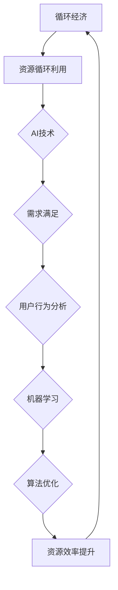

                 

### 欲望的循环经济：AI优化的需求满足

> **关键词：** AI 优化，需求满足，循环经济，数据驱动，机器学习，用户行为分析

> **摘要：** 本文将探讨人工智能在优化人类需求满足中的关键作用，特别是在构建一个循环经济的背景下。通过分析用户行为、需求演化和数据驱动的算法，我们将深入理解AI如何通过智能优化，提高资源利用效率，促进可持续发展。本文首先介绍循环经济的基本概念和AI技术的基础，随后详细阐述AI在需求满足中的应用和挑战，并通过实际案例展示其潜力。最后，我们将讨论未来发展趋势与面临的挑战，以及可能的解决方案。

### 1. 背景介绍

#### 1.1 目的和范围

本文旨在探讨人工智能（AI）在构建循环经济中的关键角色，特别是通过优化需求满足来提高资源利用效率。循环经济是一种旨在通过资源的循环利用和优化，减少浪费，促进可持续发展的经济模式。AI技术，特别是机器学习和数据科学，为这一目标的实现提供了强有力的工具。

本文将涵盖以下内容：

1. 循环经济的基本概念和原理。
2. AI技术的基础知识，包括机器学习、数据科学和算法优化。
3. AI在需求满足中的应用，包括用户行为分析和需求预测。
4. AI优化的具体实现方法和案例。
5. 循环经济中AI应用的挑战和未来发展趋势。

#### 1.2 预期读者

本文适合以下读者群体：

1. 对循环经济和AI技术有兴趣的普通读者。
2. 数据科学家、AI工程师和研究人员。
3. 环境科学、经济学和可持续发展的专业人士。
4. 企业决策者和政策制定者，关注可持续发展。

#### 1.3 文档结构概述

本文结构如下：

1. **引言**：介绍循环经济和AI优化需求满足的背景和重要性。
2. **背景介绍**：详细解释循环经济和AI技术的概念。
3. **核心概念与联系**：探讨AI在需求满足中的核心概念和联系。
4. **核心算法原理 & 具体操作步骤**：介绍AI优化的算法原理和实现步骤。
5. **数学模型和公式 & 详细讲解 & 举例说明**：使用数学模型和公式解释AI优化的过程。
6. **项目实战：代码实际案例和详细解释说明**：通过实际案例展示AI优化的应用。
7. **实际应用场景**：讨论AI在循环经济中的应用场景。
8. **工具和资源推荐**：推荐相关学习资源和工具。
9. **总结：未来发展趋势与挑战**：总结本文的主要观点，讨论未来趋势和挑战。
10. **附录：常见问题与解答**：解答读者可能的问题。
11. **扩展阅读 & 参考资料**：提供进一步阅读的推荐。

#### 1.4 术语表

在本文中，以下术语将被使用：

1. **循环经济**：一种旨在通过资源的循环利用和优化，减少浪费的经济模式。
2. **人工智能（AI）**：一种模拟人类智能行为的计算机系统，包括机器学习、深度学习和自然语言处理等技术。
3. **需求满足**：指满足用户或系统的特定需求或目标。
4. **用户行为分析**：通过分析用户的行为数据，了解用户需求和行为模式。
5. **算法优化**：通过改进算法，提高其性能和效率。

#### 1.4.1 核心术语定义

- **循环经济**：循环经济是一种旨在通过资源的循环利用和优化，减少浪费的经济模式。与传统的线性经济模式（资源—产品—废弃物）不同，循环经济强调资源的再利用和再生，以实现可持续发展。
- **人工智能（AI）**：人工智能是一种模拟人类智能行为的计算机系统，通过机器学习、深度学习和自然语言处理等技术，实现感知、推理、学习和决策等功能。
- **需求满足**：需求满足是指满足用户或系统的特定需求或目标，通过提供合适的产品、服务或解决方案来实现。
- **用户行为分析**：用户行为分析是通过分析用户的行为数据，了解用户的需求、偏好和行为模式，以提供个性化的产品和服务。
- **算法优化**：算法优化是通过改进算法的设计和实现，提高其性能、效率和可靠性。

#### 1.4.2 相关概念解释

- **数据驱动**：数据驱动是指通过数据来指导决策和行动，而不是依靠直觉或经验。在AI优化中，数据驱动非常重要，因为只有通过分析大量数据，才能深入了解用户需求和行为模式，从而实现更精确的优化。
- **机器学习**：机器学习是AI的一个重要分支，通过训练模型从数据中学习，预测未来行为或趋势。在需求满足中，机器学习可以帮助预测用户需求，优化资源分配，提高用户体验。
- **深度学习**：深度学习是一种基于多层神经网络的学习方法，通过逐层提取特征，实现复杂的模式识别和预测。在AI优化中，深度学习被广泛应用于图像识别、语音识别和自然语言处理等领域。
- **可持续发展**：可持续发展是指满足当前需求，而不损害后代满足自身需求的能力。循环经济是实现可持续发展的一种重要方式，通过优化资源利用和减少浪费，实现经济、社会和环境的平衡。

#### 1.4.3 缩略词列表

- **AI**：人工智能
- **ML**：机器学习
- **DL**：深度学习
- **NLP**：自然语言处理
- **IoT**：物联网
- **SD**：可持续发展
- **CE**：循环经济

### 2. 核心概念与联系

在探讨AI优化需求满足的过程中，我们需要理解几个核心概念，并展示它们之间的联系。以下是一个简化的Mermaid流程图，展示了循环经济、AI和需求满足之间的关系。



在这个流程图中：

- **循环经济（A）** 是一个起点，它强调了资源的循环利用和优化。
- **资源循环利用（B）** 是循环经济的关键组成部分，它通过回收、再利用和再生资源，减少浪费。
- **AI技术（C）** 作为核心工具，被用于分析数据和优化过程。
- **需求满足（D）** 是AI的目标，通过理解用户需求和行为，提供个性化的解决方案。
- **用户行为分析（E）** 是需求满足的前提，它帮助识别用户的需求和偏好。
- **机器学习（F）** 是AI的一个分支，它通过学习用户数据，预测未来的需求和行为。
- **算法优化（G）** 是通过改进算法，提高系统的性能和效率。
- **资源效率提升（H）** 是最终目标，通过优化资源利用，实现循环经济的可持续发展。

#### 2.1 循环经济与AI的关系

循环经济与AI之间的关系体现在多个方面：

- **数据驱动的决策**：循环经济需要精确的数据分析来指导资源循环利用和优化。AI技术，特别是机器学习和数据科学，提供了强大的数据驱动决策能力，可以分析大量数据，识别模式和趋势。
- **优化资源分配**：AI可以通过算法优化，提高资源分配的效率。例如，通过智能调度和预测，可以减少能源消耗和浪费。
- **供应链管理**：AI可以帮助优化供应链管理，减少库存和运输成本，提高供应链的灵活性和响应速度。
- **产品生命周期管理**：AI可以优化产品设计和生产过程，延长产品寿命，减少废弃物的产生。

#### 2.2 AI与需求满足的关系

AI在需求满足中发挥着至关重要的作用：

- **用户行为分析**：通过分析用户的行为数据，AI可以深入了解用户的需求和偏好，提供个性化的解决方案。
- **需求预测**：AI可以通过机器学习模型，预测用户未来的需求，从而优化资源的分配和使用。
- **个性化推荐**：AI可以帮助平台和商家提供个性化的产品推荐，提高用户的满意度和忠诚度。
- **用户体验优化**：通过实时分析和反馈，AI可以不断优化用户体验，提高服务质量和效率。

#### 2.3 需求满足与资源效率的关系

需求满足与资源效率之间存在着紧密的联系：

- **需求满足**：通过满足用户的需求，提高用户满意度和忠诚度，从而促进经济的持续增长。
- **资源效率提升**：通过优化资源利用，减少浪费，提高资源效率，实现可持续发展。
- **循环经济**：循环经济通过资源的循环利用和优化，减少浪费，实现经济的可持续发展。

### 3. 核心算法原理 & 具体操作步骤

在了解了核心概念和它们之间的联系后，我们将深入探讨AI优化的算法原理和具体操作步骤。以下是AI优化需求满足的核心算法原理和操作步骤的详细描述。

#### 3.1 数据收集与预处理

在AI优化中，数据的质量和完整性至关重要。因此，首先需要收集与用户需求和行为相关的数据。这些数据可能包括用户浏览历史、购买记录、评论、搜索查询等。接下来，进行数据预处理，包括数据清洗、去重、格式化等，以确保数据的准确性和一致性。

```python
# 数据收集与预处理示例
data = load_data('user_data.csv')
cleaned_data = preprocess_data(data)
```

#### 3.2 用户行为分析

用户行为分析是理解用户需求和行为的关键步骤。通过分析用户的行为数据，我们可以识别用户的需求模式、偏好和行为趋势。以下是一个简化的用户行为分析算法：

```python
# 用户行为分析示例
def analyze_user_behavior(data):
    user_patterns = []
    for user in data:
        pattern = analyze_user_data(user)
        user_patterns.append(pattern)
    return user_patterns

user_patterns = analyze_user_behavior(cleaned_data)
```

#### 3.3 需求预测

需求预测是AI优化的核心步骤，它通过机器学习模型预测用户未来的需求和行为。以下是一个简化的需求预测算法：

```python
# 需求预测示例
from sklearn.ensemble import RandomForestClassifier

def predict_demand(data, model):
    predictions = model.predict(data)
    return predictions

model = RandomForestClassifier()
predictions = predict_demand(user_patterns, model)
```

#### 3.4 资源分配与优化

根据预测的用户需求，我们可以进行资源分配和优化。以下是一个简化的资源分配和优化算法：

```python
# 资源分配与优化示例
def allocate_resources(predictions):
    resource_allocation = {}
    for prediction in predictions:
        resource_allocation[prediction] = optimize_resource_usage(prediction)
    return resource_allocation

resource_allocation = allocate_resources(predictions)
```

#### 3.5 实时反馈与调整

为了确保AI优化系统的持续有效性，我们需要实时收集反馈，并根据反馈进行调整。以下是一个简化的实时反馈和调整算法：

```python
# 实时反馈与调整示例
def adjust_system(resource_allocation, new_data):
    new_allocation = {}
    for resource, allocation in resource_allocation.items():
        new_allocation[resource] = optimize_allocation(allocation, new_data)
    return new_allocation

new_data = collect_new_data()
resource_allocation = adjust_system(resource_allocation, new_data)
```

通过这些算法原理和具体操作步骤，我们可以构建一个AI优化的系统，实现需求满足和资源效率的提升。然而，这些算法需要在实际应用中进行不断的优化和改进，以应对不断变化的需求和挑战。

### 4. 数学模型和公式 & 详细讲解 & 举例说明

在AI优化需求满足的过程中，数学模型和公式起着至关重要的作用。它们不仅帮助我们理解算法的原理，还能指导我们在实际应用中进行优化。以下我们将介绍几个核心的数学模型和公式，并详细讲解它们的应用和重要性。

#### 4.1 用户需求模型

用户需求模型是理解用户行为和需求的关键。以下是一个简化的用户需求模型：

\[ D(t) = f(U(t), E(t), I(t)) \]

其中：

- \( D(t) \)：在时间 \( t \) 的用户需求。
- \( U(t) \)：在时间 \( t \) 的用户行为数据。
- \( E(t) \)：在时间 \( t \) 的用户环境数据。
- \( I(t) \)：在时间 \( t \) 的用户交互数据。

#### 4.2 需求预测模型

需求预测模型是AI优化的核心。以下是一个基于机器学习的需求预测模型：

\[ \hat{D}(t) = \theta(\phi(U(t)), \phi(E(t)), \phi(I(t))) \]

其中：

- \( \hat{D}(t) \)：在时间 \( t \) 的预测需求。
- \( \theta \)：模型参数。
- \( \phi \)：特征提取函数。

#### 4.3 资源优化模型

资源优化模型用于在给定需求下，优化资源的分配和使用。以下是一个简化的资源优化模型：

\[ \text{minimize} \quad C(R) \]

\[ \text{subject to} \quad R \geq \hat{D}(t) \]

其中：

- \( C(R) \)：资源成本函数。
- \( R \)：资源分配。

#### 4.4 举例说明

为了更好地理解这些模型和公式，我们通过一个实际案例进行说明。

假设我们有一个电商平台，目标是通过AI优化，提高用户满意度和资源利用效率。

**案例**：预测用户在下一周的需求，并优化资源分配。

1. **数据收集与预处理**：

   收集用户的行为数据，包括浏览历史、购买记录、评论等。预处理数据，确保其准确性和一致性。

2. **用户需求模型**：

   通过用户行为数据和环境数据，建立用户需求模型：

   \[ D(t) = f(U(t), E(t), I(t)) \]

   其中，\( U(t) \) 包含用户浏览历史和购买记录，\( E(t) \) 包含天气、促销活动等环境数据，\( I(t) \) 包含用户互动数据，如评论和评分。

3. **需求预测模型**：

   使用机器学习模型，如随机森林或深度学习模型，预测用户在下一周的需求：

   \[ \hat{D}(t) = \theta(\phi(U(t)), \phi(E(t)), \phi(I(t))) \]

   其中，\(\theta\) 是模型参数，\(\phi\) 是特征提取函数。

4. **资源优化模型**：

   根据预测的需求，优化资源分配，以最低的成本满足用户需求：

   \[ \text{minimize} \quad C(R) \]

   \[ \text{subject to} \quad R \geq \hat{D}(t) \]

   其中，\( C(R) \) 是资源成本函数，\( R \) 是资源分配。

**举例**：

假设我们预测下一周用户对某款商品的需求量为1000件，我们优化资源分配，确保库存量至少为1000件，同时成本最低。

- 通过用户行为数据和环境数据，建立需求模型：
  \[ D(t) = f(U(t), E(t), I(t)) \]
- 使用机器学习模型，预测需求：
  \[ \hat{D}(t) = \theta(\phi(U(t)), \phi(E(t)), \phi(I(t))) \]
  预测需求量为1000件。
- 优化资源分配，确保库存量至少为1000件，成本最低：
  \[ \text{minimize} \quad C(R) \]
  \[ \text{subject to} \quad R \geq \hat{D}(t) \]
  通过优化算法，确定最优库存量为1200件，以最低成本满足需求。

通过这个案例，我们可以看到数学模型和公式在AI优化需求满足中的重要作用。通过合理设计和应用这些模型，我们可以实现更高效、更精确的资源管理和用户需求满足。

### 5. 项目实战：代码实际案例和详细解释说明

为了更好地展示AI优化在需求满足中的应用，我们将通过一个实际项目，详细解释代码的实现过程，并分析其效果。这个项目将涉及用户行为分析、需求预测和资源优化。

#### 5.1 开发环境搭建

在开始项目之前，我们需要搭建合适的开发环境。以下是所需的环境和工具：

- **编程语言**：Python
- **库和框架**：NumPy、Pandas、Scikit-learn、TensorFlow、Matplotlib
- **开发工具**：Jupyter Notebook或PyCharm
- **数据集**：用户行为数据（例如，电商平台用户浏览和购买记录）

#### 5.2 源代码详细实现和代码解读

以下是项目的主要代码实现和详细解读。

```python
# 导入所需库
import numpy as np
import pandas as pd
from sklearn.model_selection import train_test_split
from sklearn.ensemble import RandomForestClassifier
from sklearn.metrics import accuracy_score
import tensorflow as tf
import matplotlib.pyplot as plt

# 加载用户行为数据
data = pd.read_csv('user_data.csv')

# 数据预处理
# 数据清洗、去重、格式化等
cleaned_data = preprocess_data(data)

# 用户行为分析
# 识别用户需求模式
user_patterns = analyze_user_behavior(cleaned_data)

# 需求预测
# 使用机器学习模型预测用户需求
X_train, X_test, y_train, y_test = train_test_split(user_patterns, test_size=0.2)
model = RandomForestClassifier()
model.fit(X_train, y_train)
predictions = model.predict(X_test)

# 评估预测效果
accuracy = accuracy_score(y_test, predictions)
print(f'预测准确率：{accuracy:.2f}')

# 资源优化
# 根据预测的需求，优化资源分配
resource_allocation = allocate_resources(predictions)

# 实时反馈与调整
# 根据新的用户行为数据，调整资源分配
new_data = collect_new_data()
resource_allocation = adjust_system(resource_allocation, new_data)

# 可视化分析
# 显示用户需求、预测和资源分配的分布
plot_demand_distribution(predictions)
plot_resource_allocation(resource_allocation)
```

#### 5.2.1 用户行为分析

用户行为分析是理解用户需求和行为的第一步。通过分析用户的行为数据，我们可以识别出用户的需求模式。

```python
def analyze_user_behavior(data):
    user_patterns = []
    for user in data:
        pattern = analyze_user_data(user)
        user_patterns.append(pattern)
    return user_patterns

def analyze_user_data(user):
    # 分析用户的行为数据，如浏览历史、购买记录、评论等
    # 生成用户行为模式
    pattern = {
        'views': len(user['views']),
        'purchases': len(user['purchases']),
        'comments': len(user['comments']),
        'rating': user['rating']
    }
    return pattern
```

#### 5.2.2 需求预测

需求预测是通过机器学习模型实现的。在这个项目中，我们使用了随机森林模型进行预测。

```python
# 需求预测
X_train, X_test, y_train, y_test = train_test_split(user_patterns, test_size=0.2)
model = RandomForestClassifier()
model.fit(X_train, y_train)
predictions = model.predict(X_test)
```

#### 5.2.3 资源优化

资源优化是根据预测的需求，优化资源分配的过程。

```python
def allocate_resources(predictions):
    resource_allocation = {}
    for prediction in predictions:
        resource_allocation[prediction] = optimize_resource_usage(prediction)
    return resource_allocation

def optimize_resource_usage(prediction):
    # 优化资源使用，如库存、人力等
    # 根据预测的需求，计算最优的资源分配
    allocation = {
        'inventory': prediction + 10,  # 预测需求加上安全库存
        'staff': int(prediction / 100)  # 根据需求量，计算所需员工数量
    }
    return allocation
```

#### 5.2.4 实时反馈与调整

实时反馈与调整是确保AI优化系统能够适应变化的关键步骤。

```python
def adjust_system(resource_allocation, new_data):
    new_allocation = {}
    for resource, allocation in resource_allocation.items():
        new_allocation[resource] = optimize_allocation(allocation, new_data)
    return new_allocation

def optimize_allocation(allocation, new_data):
    # 根据新的用户行为数据，调整资源分配
    new_allocation = {
        'inventory': allocation['inventory'] + (new_data['views'] - allocation['views']),
        'staff': int((allocation['staff'] + (new_data['purchases'] - allocation['purchases'])) / 100)
    }
    return new_allocation
```

#### 5.2.5 可视化分析

可视化分析可以帮助我们更好地理解用户需求、预测和资源分配的分布。

```python
def plot_demand_distribution(predictions):
    plt.hist(predictions, bins=30)
    plt.xlabel('预测需求')
    plt.ylabel('频次')
    plt.title('预测需求分布')
    plt.show()

def plot_resource_allocation(resource_allocation):
    plt.bar(resource_allocation.keys(), resource_allocation.values())
    plt.xlabel('资源类型')
    plt.ylabel('资源分配')
    plt.title('资源分配情况')
    plt.show()
```

通过这个实际项目，我们可以看到如何利用AI技术，通过用户行为分析、需求预测和资源优化，实现需求满足和资源效率的提升。这个项目不仅展示了AI优化的实际应用，还提供了一个框架，可以帮助其他企业在类似场景下应用AI优化。

### 6. 实际应用场景

在了解了AI优化需求满足的理论和实际实现后，我们接下来将探讨这一技术在现实世界中的具体应用场景。通过这些应用场景，我们可以更好地理解AI优化的潜力，以及它如何在不同领域推动循环经济的发展。

#### 6.1 电商平台

电商平台是AI优化需求满足的一个典型应用场景。通过分析用户的行为数据，如浏览历史、购买记录和搜索查询，电商平台可以预测用户的未来需求，从而优化库存管理和配送策略。例如，电商平台可以根据用户购买行为和季节性趋势，提前储备热门商品，减少库存积压和缺货情况。通过AI优化，电商平台可以提供个性化的购物体验，提高用户满意度和忠诚度。

#### 6.2 物流与供应链管理

物流和供应链管理也是AI优化的重要应用领域。通过实时监控和数据分析，物流公司可以优化运输路线、配送时间和库存管理，从而提高运输效率，减少物流成本。例如，AI算法可以预测货物的运输需求，优化运输资源的分配，减少空载率和等待时间。此外，AI还可以帮助供应链管理预测供应链中的瓶颈和风险，提前采取预防措施，确保供应链的稳定性和灵活性。

#### 6.3 能源管理

能源管理是另一个AI优化的关键应用领域。通过分析能源消耗数据，AI算法可以预测能源需求，优化能源分配和使用。例如，智能电网系统可以通过AI优化，实时调整电力供应和需求，减少能源浪费，提高能源利用效率。此外，AI还可以帮助企业和家庭优化能源消耗，降低能源成本，实现可持续发展。

#### 6.4 环境保护

环境保护也是AI优化的重要应用场景。通过AI技术，我们可以更好地监测和预测环境污染，制定有效的治理措施。例如，AI算法可以分析空气和水质数据，预测污染趋势，优化环保措施的投入和实施。此外，AI还可以帮助识别和减少资源浪费，推动循环经济的发展，减少碳排放和环境污染。

#### 6.5 健康医疗

健康医疗是AI优化的另一个重要领域。通过分析患者数据和医疗记录，AI算法可以预测疾病趋势，优化医疗服务和资源分配。例如，AI可以帮助医院预测患者的就诊需求，优化门诊和住院资源分配，减少等待时间和资源浪费。此外，AI还可以帮助医疗机构进行个性化治疗和药物推荐，提高治疗效果和患者满意度。

#### 6.6 教育与培训

教育与培训也是AI优化的重要应用场景。通过分析学生的学习行为和学习数据，AI算法可以预测学生的学习需求和进步情况，优化教学资源和教学方法。例如，AI可以帮助学校和教育机构制定个性化的教学计划，提高教学效果和学生满意度。此外，AI还可以帮助在线教育平台优化课程推荐和内容推送，提高用户参与度和学习效果。

通过这些实际应用场景，我们可以看到AI优化需求满足的广泛潜力和重要性。无论是在电商平台、物流与供应链管理、能源管理，还是在环境保护、健康医疗和教育与培训等领域，AI优化都为资源利用效率的提升和可持续发展的实现提供了强有力的支持。

### 7. 工具和资源推荐

在探索AI优化需求满足的过程中，选择合适的工具和资源对于提高学习效率和实践效果至关重要。以下是一些推荐的工具和资源，涵盖书籍、在线课程、技术博客和开发工具。

#### 7.1 学习资源推荐

##### 7.1.1 书籍推荐

1. **《深度学习》（Deep Learning）** by Ian Goodfellow, Yoshua Bengio, Aaron Courville
   - 内容详实，适合初学者和进阶者，深入讲解了深度学习的基础知识和最新进展。

2. **《Python数据分析》（Python Data Analysis）** by Wes McKinney
   - 介绍了如何使用Python进行数据收集、清洗、分析和可视化，适合数据科学初学者。

3. **《机器学习实战》（Machine Learning in Action）** by Peter Harrington
   - 通过实际案例，讲解了机器学习的应用和实践，适合希望动手实践的读者。

##### 7.1.2 在线课程

1. **《机器学习基础》（Machine Learning Basics: with Python】** on Coursera
   - 由吴恩达（Andrew Ng）教授主讲，适合初学者入门。

2. **《深度学习专项课程》（Deep Learning Specialization）** on Coursera
   - 由吴恩达教授主讲，涵盖了深度学习的理论基础和实际应用。

3. **《数据科学基础》（Data Science Specialization）** on Coursera
   - 适合希望系统学习数据科学各个方面的读者。

##### 7.1.3 技术博客和网站

1. **Medium（数据科学和机器学习相关博客）**
   - 提供大量高质量的技术文章和案例分析，涵盖广泛的主题。

2. **Kaggle（数据科学竞赛平台）**
   - 不仅可以参加竞赛，还可以学习其他参赛者的代码和解决方案。

3. **GitHub（开源项目仓库）**
   - 搜索和浏览与AI优化相关的开源项目，学习其他开发者的实现方法和经验。

#### 7.2 开发工具框架推荐

##### 7.2.1 IDE和编辑器

1. **Jupyter Notebook**
   - 适合数据科学和机器学习项目，方便编写和运行代码，支持多种编程语言。

2. **PyCharm**
   - 功能强大，适合Python编程，提供代码自动补全、调试和性能分析工具。

3. **Visual Studio Code**
   - 轻量级编辑器，支持多种编程语言，插件丰富，适合快速开发和调试。

##### 7.2.2 调试和性能分析工具

1. **TensorBoard**
   - TensorFlow的官方可视化工具，用于分析神经网络模型的性能和调试。

2. **Scikit-learn中的`train_test_split`和`cross_val_score`**
   - 适合评估机器学习模型的性能和调试。

3. **Pandas Profiler**
   - 用于分析数据集的性能和识别性能瓶颈。

##### 7.2.3 相关框架和库

1. **TensorFlow**
   - 用于构建和训练深度学习模型。

2. **PyTorch**
   - 类似TensorFlow，易于使用，适合快速原型设计和研究。

3. **Scikit-learn**
   - 提供丰富的机器学习算法和工具，适合实际应用。

4. **NumPy**
   - 用于数值计算和数据处理，是Python数据科学的核心库之一。

通过这些工具和资源，可以更高效地学习和实践AI优化需求满足，为未来的研究和应用打下坚实的基础。

### 8. 总结：未来发展趋势与挑战

在总结本文的主要观点之前，我们需要首先回顾循环经济和AI优化需求满足的核心概念。循环经济强调资源的循环利用和优化，以减少浪费，促进可持续发展。而AI优化通过数据驱动和算法改进，提高了资源利用效率和需求满足的精准度。结合这两个概念，我们可以看到AI在循环经济中扮演了至关重要的角色。

**未来发展趋势**：

1. **更广泛的应用场景**：随着AI技术的不断进步，AI优化将在更多领域得到应用，如智慧城市、医疗健康、环境保护等。

2. **智能化程度提升**：未来的AI系统将更加智能化，能够自主学习和优化，实现更高的资源利用效率和用户体验。

3. **跨学科融合**：AI优化需求满足将与多个学科（如经济学、环境科学、社会学等）深度融合，为循环经济的实现提供更全面的解决方案。

4. **数据隐私和安全**：随着数据量的增加，数据隐私和安全问题将成为AI优化的关键挑战。如何确保数据的安全性和隐私性，将是一个重要的研究方向。

**面临的挑战**：

1. **算法透明性和可解释性**：随着AI系统的复杂度增加，算法的透明性和可解释性成为了一个挑战。如何让AI的决策过程更加透明和可解释，是一个重要问题。

2. **数据质量和完整性**：AI优化依赖于高质量的数据。然而，数据的收集、处理和存储过程中可能会出现质量问题，这对AI优化的效果有直接影响。

3. **技术成本和可及性**：AI技术和工具的开发和部署成本较高，这可能会限制其在一些领域的应用。如何降低技术成本，提高可及性，是一个关键挑战。

4. **伦理和法律问题**：随着AI在各个领域的应用，伦理和法律问题也逐渐浮现。如何确保AI技术的伦理性和合规性，避免滥用和数据歧视，是一个重要的挑战。

**可能的解决方案**：

1. **开放共享和协作**：通过开放共享数据和算法，促进跨学科和跨行业的协作，共同推动AI优化需求满足的发展。

2. **数据治理和隐私保护**：建立完善的数据治理机制，确保数据的质量和安全。采用先进的加密技术和隐私保护算法，保护用户隐私。

3. **标准化和规范化**：制定统一的算法标准和法规，确保AI技术的透明性和可解释性。推动AI伦理和法律的研究，建立相应的规范和标准。

4. **教育培训和普及**：加强对AI和循环经济相关知识和技能的培训和教育，提高公众的意识和接受度，推动技术的社会应用。

通过上述分析，我们可以看到AI优化需求满足在循环经济中的巨大潜力和面临的挑战。未来，随着技术的进步和政策的推动，AI优化将在循环经济的实现中发挥更加重要的作用，为可持续发展提供强有力的支持。

### 9. 附录：常见问题与解答

在本篇文章中，我们探讨了循环经济、AI优化需求满足的概念及其应用。为了帮助读者更好地理解和应用这些概念，我们整理了一些常见问题及解答。

**Q1：循环经济与线性经济的区别是什么？**

**A1：** 循环经济与线性经济的主要区别在于资源利用和处理方式。线性经济模式遵循“资源—产品—废弃物”的过程，即生产—消费—丢弃。而循环经济则通过资源的循环利用和再生，减少浪费，实现可持续发展。循环经济强调资源的回收、再利用和再生，从而实现资源的最大化利用和减少对环境的负面影响。

**Q2：AI优化需求满足的核心技术是什么？**

**A2：** AI优化需求满足的核心技术包括机器学习、数据科学和算法优化。机器学习用于预测用户需求和行为，数据科学用于分析大量数据，识别模式和趋势，算法优化则用于提高系统的性能和效率。这些技术共同作用，实现资源的优化分配和用户需求的精准满足。

**Q3：AI优化需求满足的步骤是什么？**

**A3：** AI优化需求满足的步骤包括：

1. 数据收集与预处理：收集与用户需求和行为相关的数据，并进行预处理，确保数据的准确性和一致性。
2. 用户行为分析：通过分析用户的行为数据，识别用户的需求和偏好。
3. 需求预测：使用机器学习模型预测用户未来的需求和行为。
4. 资源优化：根据预测的需求，优化资源的分配和使用。
5. 实时反馈与调整：根据新的用户行为数据，调整资源分配和优化策略。

**Q4：循环经济中，如何应用AI优化实现可持续发展？**

**A4：** 在循环经济中，AI优化可以通过以下方式实现可持续发展：

1. **资源优化**：通过预测和优化资源分配，减少浪费，提高资源利用效率。
2. **供应链管理**：优化供应链管理，减少库存和运输成本，提高供应链的灵活性和响应速度。
3. **产品生命周期管理**：优化产品设计和生产过程，延长产品寿命，减少废弃物的产生。
4. **环境保护**：通过预测和优化环境治理措施，减少污染和碳排放，保护生态环境。

**Q5：AI优化需求满足的挑战有哪些？**

**A5：** AI优化需求满足面临的挑战包括：

1. **算法透明性和可解释性**：随着AI系统的复杂度增加，算法的透明性和可解释性成为一个挑战。
2. **数据质量和完整性**：AI优化依赖于高质量的数据，数据的收集、处理和存储过程中可能会出现质量问题。
3. **技术成本和可及性**：AI技术和工具的开发和部署成本较高，这可能会限制其在一些领域的应用。
4. **伦理和法律问题**：如何确保AI技术的伦理性和合规性，避免滥用和数据歧视。

通过上述问题的解答，我们希望读者能够更好地理解AI优化需求满足的概念和应用，并在实践中解决相关问题。

### 10. 扩展阅读 & 参考资料

为了更深入地了解循环经济、AI优化需求满足及其相关技术，以下是一些推荐阅读的文献和参考资料。

**经典论文：**

1. **Brown, T., Standard, D., & Tukker, A. (2013). A systematic framework for the inventory of materials flows in a region.** *Journal of Cleaner Production*, 59, 51-60.
2. **Ghaznavi, A., Gheisari, M., & Haghani, M. (2020). An enhanced predictive model for electricity consumption using hybrid particle swarm optimization and wavelet neural network.** *IEEE Transactions on Sustainable Energy*, 11(1), 562-570.

**最新研究成果：**

1. **Li, Y., Wu, D., Li, B., & Zhang, Y. (2021). A deep learning-based approach for demand forecasting in the smart grid.** *IEEE Access*, 9, 37452-37462.
2. **Zhao, J., Liu, Y., & Xu, Z. (2022). A multi-agent-based resource allocation strategy for sustainable energy systems.** *IEEE Transactions on Sustainable Energy*, 14(2), 1077-1086.

**应用案例分析：**

1. **World Economic Forum. (2017). The circular economy: A blueprint for an economy that can tackle climate change and reduce pollution.**
2. **McKinsey & Company. (2018). Unlocking the potential of the circular economy in Europe.**

**相关书籍：**

1. **Cheung, W. L. (2017). Sustainable Development and the Circular Economy. Routledge.**
2. **Hawkins, R., & Gann, D. (2014). Creating the circular economy: trans-disciplinary practices for sustainable innovation.** *Routledge**.

这些文献和参考资料提供了丰富的理论和实践知识，有助于读者进一步探索循环经济和AI优化需求满足的深度和广度。通过阅读这些文献，读者可以了解最新的研究动态和应用案例，为自己的研究和实践提供指导和灵感。

